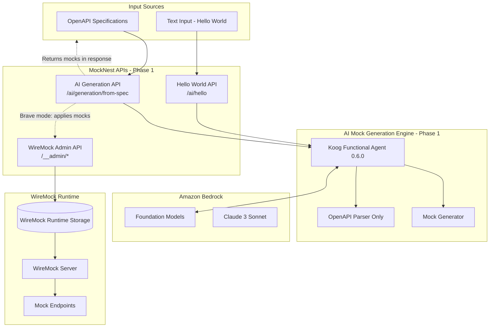
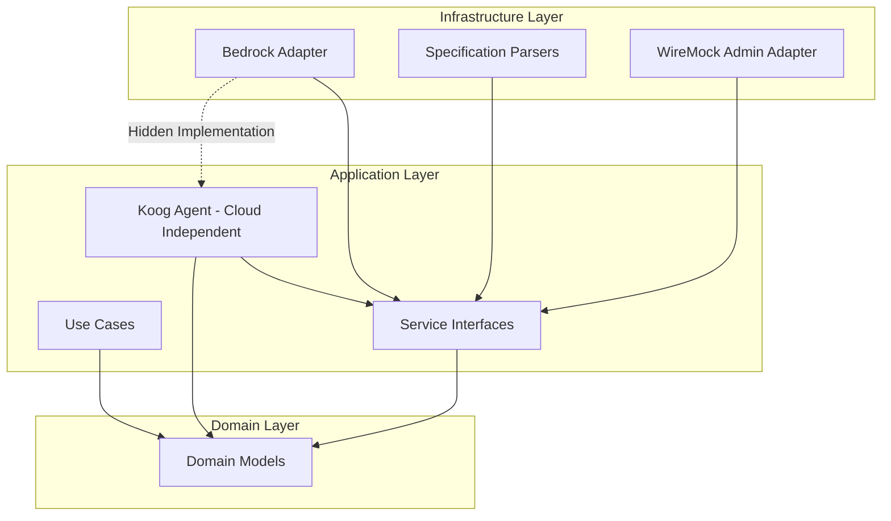

# Design Document: AI Mock Generation - Phase 1

## Overview

Phase 1 of the AI Mock Generation feature establishes the foundation for AI-powered mock creation using the Koog 0.6.0 framework, Kotlin implementation, and Amazon Bedrock integration. This phase focuses on validating the Bedrock integration and implementing core OpenAPI-based mock generation with synchronous response.

**Phase 1 Goals:**
1. **Hello World Endpoint**: Validate Bedrock + Koog integration with simple text processing
2. **OpenAPI Mock Generation**: Generate WireMock-ready mocks from OpenAPI 3.0 and Swagger 2.0 specifications
3. **Synchronous Response**: Return generated mocks immediately in HTTP response (no job tracking)
4. **Stateless Generation**: No storage of specifications or generated mocks (unless brave mode)
5. **Brave Mode**: Optional direct application of mocks to MockNest via WireMock admin API

**Deferred to Future Spec (Mock Evolution):**
- Specification storage and versioning
- Detecting API changes and updating mocks
- Namespace storage organization
- Mock evolution based on traffic patterns

**Deferred to Future Phases:**
- Mock enhancement and refinement using AI
- Traffic analysis integration
- GraphQL and WSDL support
- Batch generation
- Conversational interfaces (MCP)

## Architecture

### High-Level Architecture - Phase 1



### Clean Architecture Implementation - Phase 1

Following the established clean architecture pattern with strict dependency rules:

**Domain Layer:**
- `MockGenerationRequest` - Request for generating mocks from OpenAPI specifications
- `GeneratedMock` - Domain model representing a generated mock in WireMock format
- `APISpecification` - Domain model for parsed OpenAPI specifications
- `GenerationOptions` - Configuration options for mock generation

**Application Layer:**
- `HelloWorldUseCase` - Validate Bedrock integration with simple text processing
- `GenerateMocksFromSpecUseCase` - Generate mocks from OpenAPI specifications synchronously
- `KoogMockGenerationAgent` - **Koog 0.6.0 Functional Agent implementation (cloud-independent)**
- `SpecificationParserInterface` - Abstraction for parsing OpenAPI formats
- `MockGeneratorInterface` - Abstraction for mock generation logic
- `AIModelServiceInterface` - **Abstraction for AI model interactions (hides Bedrock)**
- `WireMockAdminInterface` - **Abstraction for WireMock admin API (for brave mode)**

**Infrastructure Layer:**
- `BedrockServiceAdapter` - **Amazon Bedrock integration (implements AIModelServiceInterface)**
- `OpenAPISpecificationParser` - OpenAPI 3.0 and Swagger 2.0 specification parsing
- `WireMockAdminAdapter` - **WireMock admin API client (for brave mode)**

**Phase 1 Simplifications:**
- No storage layer for specifications or generated mocks
- No job tracking or async processing
- No namespace storage organization
- Stateless synchronous generation only

### Clean Architecture Dependency Rules



**Key Architectural Principles:**
1. **Bedrock Abstraction**: `AIModelServiceInterface` in application layer hides Bedrock implementation
2. **Cloud-Independent Koog Agent**: Lives in application layer, uses abstractions only
3. **Dependency Inversion**: Infrastructure implements application interfaces
4. **No Cloud Coupling**: Domain and application layers have no AWS dependencies
5. **Stateless Design**: No storage layer needed for Phase 1 synchronous generation

## Components and Interfaces

### Core Components - Phase 1

#### 1. Hello World Endpoint (Bedrock Validation)

**Purpose**: Validate that Bedrock integration works correctly through Koog before building complex generation features.

```kotlin
@Component
class HelloWorldUseCase(
    private val aiModelService: AIModelServiceInterface
) {
    private val logger = KotlinLogging.logger {}
    
    suspend fun invoke(textInput: String): HelloWorldResponse {
        logger.info { "Processing hello world request with input: ${textInput.take(50)}..." }
        
        return runCatching {
            val response = aiModelService.processHelloWorld(textInput)
            HelloWorldResponse.success(response)
        }.onFailure { exception ->
            logger.error(exception) { "Hello world request failed" }
        }.getOrElse { exception ->
            HelloWorldResponse.error("Bedrock service unavailable: ${exception.message}")
        }
    }
}

data class HelloWorldResponse(
    val success: Boolean,
    val response: String?,
    val error: String?
) {
    companion object {
        fun success(response: String) = HelloWorldResponse(true, response, null)
        fun error(message: String) = HelloWorldResponse(false, null, message)
    }
}
```

#### 2. Koog Functional Agent Framework Integration (0.6.0) - Phase 1

**Agent Type: Functional Agent**
- **Domain-Specific**: Mock generation is a well-defined functional domain
- **Tool Coordination**: Orchestrates parsers and generators
- **Structured I/O**: Takes OpenAPI specs, produces WireMock JSON
- **Domain Expertise**: Encapsulates knowledge about OpenAPI and mock generation patterns

```kotlin
@Component
class MockGenerationFunctionalAgent(
    private val specificationParser: SpecificationParserInterface,
    private val mockGenerator: MockGeneratorInterface
) : FunctionalAgent {
    
    override val domain = "mock-generation"
    override val capabilities = setOf(
        "parse-openapi-specifications",
        "generate-wiremock-mappings",
        "scenario-based-generation"
    )
    
    override suspend fun execute(request: AgentRequest): AgentResponse {
        return when (request.type) {
            RequestType.SPECIFICATION_GENERATION -> generateFromSpec(request)
            else -> AgentResponse.error("Unsupported request type in Phase 1: ${request.type}")
        }
    }
    
    private suspend fun generateFromSpec(request: AgentRequest): AgentResponse {
        val specification = specificationParser.parse(
            request.specificationContent, 
            request.format
        )
        
        val generatedMocks = mockGenerator.generateFromSpecification(
            specification = specification,
            namespace = request.namespace,
            options = request.options
        )
        
        return AgentResponse.success(generatedMocks)
    }
}
```

**Phase 1 Limitations:**
- Only supports `SPECIFICATION_GENERATION` request type
- No natural language generation (beyond hello world)
- No mock evolution or enhancement
- Single specification processing only

#### 3. Use Case Layer - Phase 1

```kotlin
@Component
class GenerateMocksFromSpecUseCase(
    private val specificationParser: SpecificationParserInterface,
    private val mockGenerator: MockGeneratorInterface,
    private val wireMockAdmin: WireMockAdminInterface?,  // Optional for brave mode
    private val mockGenerationAgent: MockGenerationFunctionalAgent
) : GenerateMocksFromSpec {
    
    private val logger = KotlinLogging.logger {}
    
    override suspend fun invoke(request: MockGenerationRequest): GenerationResponse {
        logger.info { "Starting synchronous mock generation for ${request.specificationUrl ?: "inline spec"}" }
        
        // Parse specification
        val specification = specificationParser.parse(
            request.specificationContent,
            request.format
        )
        
        // Execute Koog agent to generate mocks
        val agentRequest = AgentRequest.fromSpec(
            specification = specification,
            instructions = request.instructions,
            options = request.options
        )
        val agentResponse = mockGenerationAgent.execute(agentRequest)
        
        // Apply mocks if brave mode is enabled
        val appliedMocks = if (request.apply?.brave == true) {
            applyMocksToBrave(agentResponse.mocks, request.apply.namespace)
        } else {
            emptyList()
        }
        
        logger.info { "Mock generation completed: generated=${agentResponse.mocks.size}, applied=${appliedMocks.size}" }
        
        return GenerationResponse(
            mocks = agentResponse.mocks,
            appliedMocks = appliedMocks,
            totalGenerated = agentResponse.mocks.size
        )
    }
    
    private suspend fun applyMocksToBrave(
        mocks: List<GeneratedMock>,
        namespace: String?
    ): List<AppliedMock> {
        if (wireMockAdmin == null) {
            logger.warn { "Brave mode requested but WireMock admin not available" }
            return emptyList()
        }
        
        return mocks.mapNotNull { mock ->
            runCatching {
                val mappingId = wireMockAdmin.createMapping(
                    mapping = mock.wireMockMapping,
                    namespace = namespace
                )
                AppliedMock(mockId = mock.id, mappingId = mappingId)
            }.onFailure { exception ->
                logger.error(exception) { "Failed to apply mock ${mock.id} in brave mode" }
            }.getOrNull()
        }
    }
}

data class GenerationResponse(
    val mocks: List<GeneratedMock>,
    val appliedMocks: List<AppliedMock>,
    val totalGenerated: Int
)

data class AppliedMock(
    val mockId: String,
    val mappingId: String
)
```

#### 4. Specification Parsing - Phase 1 (OpenAPI Only)

```kotlin
interface SpecificationParserInterface {
    suspend fun parse(content: String, format: SpecificationFormat): APISpecification
    fun supports(format: SpecificationFormat): Boolean
}

@Component
class OpenAPISpecificationParser : SpecificationParserInterface {
    
    private val logger = KotlinLogging.logger {}
    
    override suspend fun parse(content: String, format: SpecificationFormat): APISpecification {
        logger.info { "Parsing OpenAPI specification, format=$format" }
        
        return runCatching {
            val openApiSpec = OpenAPIV3Parser().readContents(content)
            
            checkNotNull(openApiSpec.openAPI) { 
                "Failed to parse OpenAPI specification: ${openApiSpec.messages}" 
            }
            
            APISpecification.fromOpenAPI(openApiSpec.openAPI)
        }.onFailure { exception ->
            logger.error(exception) { "OpenAPI parsing failed" }
        }.getOrThrow()
    }
    
    override fun supports(format: SpecificationFormat): Boolean = 
        format in listOf(SpecificationFormat.OPENAPI_3, SpecificationFormat.SWAGGER_2)
}
```

**Phase 1 Limitations:**
- Only OpenAPI 3.0 and Swagger 2.0 support
- No GraphQL schema parsing
- No WSDL parsing
- No composite parser for multiple formats

#### 5. Mock Generation Logic - Phase 1

```kotlin
interface MockGeneratorInterface {
    suspend fun generateFromSpecification(
        specification: APISpecification,
        instructions: String?,
        options: GenerationOptions
    ): List<GeneratedMock>
}

@Component
class WireMockMappingGenerator : MockGeneratorInterface {
    
    private val logger = KotlinLogging.logger {}
    
    override suspend fun generateFromSpecification(
        specification: APISpecification,
        instructions: String?,
        options: GenerationOptions
    ): List<GeneratedMock> {
        logger.info { "Generating mocks for ${specification.endpoints.size} endpoints" }
        
        val mocks = mutableListOf<GeneratedMock>()
        
        specification.endpoints.forEach { endpoint ->
            // Generate happy path mock (2xx)
            endpoint.responses.filter { it.key in 200..299 }.forEach { (statusCode, response) ->
                mocks.add(generateMock(endpoint, statusCode, response, "happy-path"))
            }
            
            // Generate error case mocks if requested
            if (options.generateErrorCases) {
                // Client errors (4xx)
                endpoint.responses.filter { it.key in 400..499 }.forEach { (statusCode, response) ->
                    mocks.add(generateMock(endpoint, statusCode, response, "client-error"))
                }
                
                // Server errors (5xx)
                endpoint.responses.filter { it.key in 500..599 }.forEach { (statusCode, response) ->
                    mocks.add(generateMock(endpoint, statusCode, response, "server-error"))
                }
            }
        }
        
        logger.info { "Generated ${mocks.size} mocks" }
        return mocks
    }
    
    private fun generateMock(
        endpoint: EndpointDefinition,
        statusCode: Int,
        response: ResponseDefinition,
        scenario: String
    ): GeneratedMock {
        val mockId = generateMockId(endpoint, statusCode)
        val wireMockJson = buildWireMockMapping(endpoint, statusCode, response)
        
        return GeneratedMock(
            id = mockId,
            name = "${endpoint.method} ${endpoint.path} - $statusCode",
            wireMockMapping = wireMockJson,
            metadata = MockMetadata(
                sourceType = "SPECIFICATION",
                scenario = scenario,
                endpoint = endpoint.path,
                method = endpoint.method.name,
                statusCode = statusCode
            )
        )
    }
    
    private fun buildWireMockMapping(
        endpoint: EndpointDefinition,
        statusCode: Int,
        response: ResponseDefinition
    ): String {
        // Build WireMock JSON format
        val mapping = mapOf(
            "request" to mapOf(
                "method" to endpoint.method.name,
                "urlPath" to endpoint.path
            ),
            "response" to mapOf(
                "status" to statusCode,
                "headers" to mapOf("Content-Type" to "application/json"),
                "body" to generateResponseBody(response)
            )
        )
        
        return Json.encodeToString(mapping)
    }
    
    private fun generateResponseBody(response: ResponseDefinition): String {
        // Use example if available, otherwise generate from schema
        return response.examples.values.firstOrNull()?.toString()
            ?: generateFromSchema(response.schema)
    }
}
```

#### 6. WireMock Admin Adapter - Phase 1 (Brave Mode)

```kotlin
// Application Layer - Abstract Interface
interface WireMockAdminInterface {
    suspend fun createMapping(mapping: String, namespace: String?): String
}

// Infrastructure Layer - WireMock Admin Implementation
@Component
class WireMockAdminAdapter(
    @Value("\${wiremock.admin.url:http://localhost:8080/__admin}") 
    private val adminUrl: String
) : WireMockAdminInterface {
    
    private val logger = KotlinLogging.logger {}
    private val httpClient = HttpClient()
    
    override suspend fun createMapping(mapping: String, namespace: String?): String {
        logger.info { "Creating WireMock mapping via admin API" }
        
        return runCatching {
            val response = httpClient.post("$adminUrl/mappings") {
                contentType(ContentType.Application.Json)
                setBody(mapping)
            }
            
            val responseBody = response.body<String>()
            val mappingId = Json.parseToJsonElement(responseBody)
                .jsonObject["id"]?.jsonPrimitive?.content
                ?: throw IllegalStateException("No mapping ID in response")
            
            logger.info { "Created WireMock mapping: id=$mappingId" }
            mappingId
        }.onFailure { exception ->
            logger.error(exception) { "Failed to create WireMock mapping" }
        }.getOrThrow()
    }
}
```

```kotlin
// Application Layer - Abstract Interface
interface AIModelServiceInterface {
    suspend fun processHelloWorld(textInput: String): String
}

// Infrastructure Layer - Bedrock Implementation (Hidden from Application)
@Component
class BedrockServiceAdapter(
    private val bedrockClient: BedrockRuntimeClient,
    @Value("\${bedrock.model.id:anthropic.claude-3-sonnet-20240229-v1:0}") 
    private val modelId: String
) : AIModelServiceInterface {
    
    private val logger = KotlinLogging.logger {}
    
    override suspend fun processHelloWorld(textInput: String): String {
        logger.info { "Processing hello world request with Bedrock" }
        
        return runCatching {
            val request = InvokeModelRequest {
                this.modelId = this@BedrockServiceAdapter.modelId
                contentType = "application/json"
                body = buildHelloWorldPrompt(textInput).toByteArray()
            }
            
            val response = bedrockClient.invokeModel(request)
            parseClaudeResponse(response.body)
        }.onFailure { exception ->
            logger.error(exception) { "Bedrock invocation failed" }
        }.getOrThrow()
    }
    
    private fun buildHelloWorldPrompt(textInput: String): String {
        return Json.encodeToString(mapOf(
            "anthropic_version" to "bedrock-2023-05-31",
            "max_tokens" to 1000,
            "messages" to listOf(
                mapOf(
                    "role" to "user",
                    "content" to "Echo this message back with a friendly greeting: $textInput"
                )
            )
        ))
    }
    
    private fun parseClaudeResponse(responseBody: ByteArray): String {
        val json = Json.decodeFromString<Map<String, Any>>(responseBody.decodeToString())
        val content = json["content"] as? List<*>
        val firstContent = content?.firstOrNull() as? Map<*, *>
        return firstContent?.get("text") as? String 
            ?: throw IllegalStateException("Invalid Claude response format")
    }
}
```

**Phase 1 Limitations:**
- Only hello world text processing for Bedrock validation
- No natural language mock generation
- No mock refinement or enhancement
- Future phases will expand this interface

## Data Models

### Domain Models - Phase 1

#### Core Generation Models
```kotlin
data class MockGenerationRequest(
    val spec: SpecificationSource,
    val instructions: String? = null,        // Optional user instructions for customization
    val apply: ApplyOptions? = null,         // Optional brave mode configuration
    val options: GenerationOptions = GenerationOptions.default()
)

data class SpecificationSource(
    val url: String? = null,                 // URL to fetch specification
    val content: String? = null,             // Inline specification content
    val format: SpecificationFormat = SpecificationFormat.OPENAPI_3
) {
    init {
        require(url != null || content != null) { 
            "Either url or content must be provided" 
        }
    }
}

data class ApplyOptions(
    val brave: Boolean = false,              // Apply mocks directly to MockNest
    val namespace: String? = null            // Optional namespace prefix for brave mode
)

data class GeneratedMock(
    val id: String,
    val name: String,
    val wireMockMapping: String,             // JSON string in WireMock format
    val metadata: MockMetadata,
    val generatedAt: Instant = Instant.now()
)

data class MockMetadata(
    val sourceType: String,                  // "SPECIFICATION" for Phase 1
    val scenario: String,                    // "happy-path", "client-error", "server-error"
    val endpoint: String,
    val method: String,
    val statusCode: Int
)

data class GenerationOptions(
    val includeExamples: Boolean = true,
    val generateErrorCases: Boolean = true,
    val realisticData: Boolean = true,
    val maxMappings: Int? = null             // Optional limit on number of mocks
) {
    companion object {
        fun default() = GenerationOptions()
    }
}

enum class SpecificationFormat {
    OPENAPI_3,
    SWAGGER_2
    // Future: GRAPHQL, WSDL
}
```

#### API Specification Models
```kotlin
data class APISpecification(
    val format: SpecificationFormat,
    val version: String,
    val title: String,
    val endpoints: List<EndpointDefinition>,
    val schemas: Map<String, JsonSchema>,
    val metadata: Map<String, String> = emptyMap()
)

data class EndpointDefinition(
    val path: String,
    val method: HttpMethod,
    val operationId: String?,
    val summary: String?,
    val parameters: List<ParameterDefinition>,
    val requestBody: RequestBodyDefinition?,
    val responses: Map<Int, ResponseDefinition>
)

data class ResponseDefinition(
    val statusCode: Int,
    val description: String,
    val schema: JsonSchema?,
    val examples: Map<String, Any> = emptyMap(),
    val headers: Map<String, HeaderDefinition> = emptyMap()
)
```

**Phase 1 Simplifications:**
- No `GenerationJob` model (synchronous generation only)
- No `GenerationResults` model (returned directly in response)
- No `MockNamespace` model (simple string namespace for brave mode)
- No storage-related models

### Storage Organization

**Phase 1: No Storage Layer**

Phase 1 uses a stateless synchronous generation approach with no storage of specifications or generated mocks:

- Generated mocks are returned directly in HTTP response
- No job tracking or status storage
- No specification versioning or storage
- Brave mode optionally applies mocks directly to WireMock via admin API

**Future Spec (Mock Evolution):**
- Specification storage and versioning will be added
- Namespace organization for tracking specifications
- Job history and audit trails
- Mock evolution tracking

## API Design

MockNest Serverless exposes **two distinct APIs** that work together:

### **1. Standard WireMock Admin API (Existing - Unchanged)**
The existing WireMock admin API for managing mocks:

```http
# Create/Update Mock (Standard WireMock)
POST /__admin/mappings
Content-Type: application/json

{
  "request": {
    "method": "GET",
    "url": "/users"
  },
  "response": {
    "status": 200,
    "headers": {
      "Content-Type": "application/json"
    },
    "body": "[{\"id\":1,\"name\":\"John Doe\"}]"
  }
}

# List All Mocks (Standard WireMock)
GET /__admin/mappings

# Delete Mock (Standard WireMock)  
DELETE /__admin/mappings/{id}
```

### **2. AI Generation API - Phase 1 Endpoints**

#### Hello World Endpoint (Bedrock Validation)
```http
POST /ai/hello
Content-Type: application/json

{
  "text": "Hello, Bedrock!"
}

Response:
{
  "success": true,
  "response": "Hello! I received your message: Hello, Bedrock!",
  "error": null
}
```

#### Mock Generation from OpenAPI Specification
```http
POST /ai/generation/from-spec
Content-Type: application/json

{
  "spec": {
    "url": "https://example.com/api/openapi.yaml"
  },
  "instructions": "Focus on error scenarios and include rate limiting examples",
  "apply": {
    "brave": true,
    "namespace": "bored"
  },
  "options": {
    "includeExamples": true,
    "generateErrorCases": true,
    "realisticData": true,
    "maxMappings": 10
  }
}

Response (without brave mode):
{
  "mocks": [
    {
      "id": "mock-activity-get-200",
      "name": "GET /activity - 200",
      "wireMockMapping": "{\"request\":{\"method\":\"GET\",\"urlPath\":\"/activity\"},\"response\":{\"status\":200,...}}",
      "metadata": {
        "sourceType": "SPECIFICATION",
        "scenario": "happy-path",
        "endpoint": "/activity",
        "method": "GET",
        "statusCode": 200
      }
    }
  ],
  "appliedMocks": [],
  "totalGenerated": 15
}

Response (with brave mode):
{
  "mocks": [
    {
      "id": "mock-activity-get-200",
      "name": "GET /activity - 200",
      "wireMockMapping": "{\"request\":{\"method\":\"GET\",\"urlPath\":\"/activity\"},\"response\":{\"status\":200,...}}",
      "metadata": {
        "sourceType": "SPECIFICATION",
        "scenario": "happy-path",
        "endpoint": "/activity",
        "method": "GET",
        "statusCode": 200
      }
    }
  ],
  "appliedMocks": [
    {
      "mockId": "mock-activity-get-200",
      "mappingId": "wiremock-uuid-123"
    }
  ],
  "totalGenerated": 15
}
```

### **Phase 1 Workflow Example**

```bash
# Step 1: Validate Bedrock integration (Hello World)
curl -X POST /ai/hello \
  -H "Content-Type: application/json" \
  -d '{"text": "Testing Bedrock connection"}'
# Returns: {"success": true, "response": "Hello! I received your message..."}

# Step 2: Generate mocks from OpenAPI spec (returns mocks in response)
curl -X POST /ai/generation/from-spec \
  -H "Content-Type: application/json" \
  -d '{
    "spec": {"url": "https://bored-api.appbrewery.com/openapi.yaml"},
    "instructions": "Mock bored api with funny activities",
    "options": {"generateErrorCases": true, "maxMappings": 10}
  }'
# Returns: {"mocks": [...], "totalGenerated": 10}

# Step 3: Create selected mocks in WireMock (Standard Admin API)
curl -X POST /__admin/mappings \
  -H "Content-Type: application/json" \
  -d '{"request":{"method":"GET","urlPath":"/activity"},"response":{"status":200,...}}'
# Mocks created and ready to use

# Alternative: Use brave mode to apply directly
curl -X POST /ai/generation/from-spec \
  -H "Content-Type: application/json" \
  -d '{
    "spec": {"url": "https://bored-api.appbrewery.com/openapi.yaml"},
    "apply": {"brave": true, "namespace": "bored"},
    "options": {"maxMappings": 10}
  }'
# Returns: {"mocks": [...], "appliedMocks": [...], "totalGenerated": 10}

# Step 4: Use mocks normally (Standard WireMock)
curl /activity  # Returns mocked response
```

### **Key Design Principles**

1. **Synchronous Response**: Generated mocks returned immediately in HTTP response
2. **Stateless Generation**: No storage of specifications or generated mocks
3. **Standard Integration**: Generated mocks use standard WireMock JSON format
4. **User Control**: Users can review and selectively create generated mocks
5. **Brave Mode**: Optional direct application to MockNest for quick testing
6. **No Lock-in**: Generated mocks are standard WireMock mappings

**Phase 1 Limitations:**
- No job tracking or async processing
- No specification storage or versioning
- No mock evolution endpoint
- No mock enhancement endpoint
- No batch generation endpoint

## Correctness Properties

*A property is a characteristic or behavior that should hold true across all valid executions of a system-essentially, a formal statement about what the system should do. Properties serve as the bridge between human-readable specifications and machine-verifiable correctness guarantees.*

### Property 1: Hello World Bedrock Integration
*For any* text input to the hello world endpoint, the system should successfully communicate with Bedrock and return a response or clear error message
**Validates: Requirements 1.1, 1.2, 1.3**

### Property 2: OpenAPI Parsing Completeness
*For any* valid OpenAPI 3.0 or Swagger 2.0 specification, the parser should extract all endpoint definitions without data loss
**Validates: Requirements 2.1, 2.2, 2.3**

### Property 3: Generated Mock Validity
*For any* generated mock, the WireMock mapping should be syntactically valid JSON and executable by the WireMock runtime
**Validates: Requirements 3.1, 3.5**

### Property 4: Schema Compliance
*For any* generated mock response, the response structure should comply with the schema definitions from the source OpenAPI specification
**Validates: Requirements 3.2**

### Property 5: Scenario Coverage
*For any* OpenAPI specification with multiple response status codes, the generator should create separate mocks for happy path (2xx), client errors (4xx), and server errors (5xx) when error generation is enabled
**Validates: Requirements 3.3**

### Property 6: Example Response Preservation
*For any* OpenAPI specification with example responses, those examples should be used as mock response templates in generated mocks
**Validates: Requirements 2.4, 3.4**

### Property 7: Synchronous Response Completeness
*For any* successful generation request, all generated mocks should be returned in the HTTP response in WireMock import format
**Validates: Requirements 6.1, 6.5**

### Property 8: Brave Mode Application
*For any* generation request with brave mode enabled, successfully applied mocks should be confirmed in the response with mapping IDs
**Validates: Requirements 5.1, 5.3**

### Property 9: Instructions Integration
*For any* generation request with natural language instructions, the generated mocks should reflect those instructions while maintaining schema compliance
**Validates: Requirements 4.1, 4.2, 4.4**

### Property 10: Error Handling Resilience
*For any* invalid OpenAPI specification, the parser should return detailed validation errors without crashing the system
**Validates: Requirements 2.5**

**Deferred to Future Phases:**
- Mock evolution properties (specification change detection)
- Specification storage and versioning properties
- Namespace organization properties
- Job tracking properties

## Error Handling

### Specification Parsing Errors - Phase 1
- **Invalid OpenAPI Format**: Clear error messages indicating specific format issues with line numbers
- **Missing Required Fields**: Detailed validation errors with field-level guidance
- **Unsupported Version**: Clear message indicating only OpenAPI 3.0 and Swagger 2.0 are supported in Phase 1
- **Specification Fetch Errors**: Handle URL fetch failures with appropriate error messages

### Bedrock Integration Errors - Phase 1
- **Service Unavailable**: Return clear error message indicating Bedrock is not available
- **Invalid Model Response**: Validate and handle malformed responses from Claude
- **Timeout Handling**: Configurable timeouts with appropriate error messages
- **Rate Limiting**: Handle Bedrock rate limits gracefully with retry logic

### Generation Process Errors - Phase 1
- **Memory Limits**: Handle large specifications gracefully with appropriate error messages
- **Invalid Schema**: Handle specifications with invalid or missing schemas
- **Timeout Errors**: Return partial results if generation exceeds timeout limits
- **Brave Mode Failures**: Return generated mocks even if WireMock application fails

## Testing Strategy

### Unit Testing - Phase 1
- Test hello world endpoint with various text inputs
- Test OpenAPI parser with valid and invalid specifications
- Test mock generator with different endpoint configurations
- Test brave mode application with mock WireMock admin API
- Test error handling scenarios with fault injection

### Property-Based Testing - Phase 1
Property-based tests will be implemented using Kotest Property Testing framework, with each test running a minimum of 100 iterations.

Each property-based test will be tagged with comments referencing the design document property:

```kotlin
// **Feature: ai-mock-generation, Property 2: OpenAPI Parsing Completeness**
@Test
suspend fun `openapi parsing preserves all endpoint information`() {
    checkAll<OpenAPISpecification> { spec ->
        val parsed = parser.parse(spec.toJson(), SpecificationFormat.OPENAPI_3)
        parsed.endpoints.size shouldBe spec.paths.size
    }
}

// **Feature: ai-mock-generation, Property 3: Generated Mock Validity**
@Test
suspend fun `generated mocks are valid wiremock json`() {
    checkAll<APISpecification> { spec ->
        val mocks = generator.generateFromSpecification(spec, null, defaultOptions)
        mocks.forEach { mock ->
            // Should parse as valid JSON
            Json.parseToJsonElement(mock.wireMockMapping)
            // Should contain required WireMock fields
            mock.wireMockMapping shouldContain "request"
            mock.wireMockMapping shouldContain "response"
        }
    }
}

// **Feature: ai-mock-generation, Property 7: Synchronous Response Completeness**
@Test
suspend fun `generation returns all mocks in response`() {
    checkAll<APISpecification> { spec ->
        val response = useCase.invoke(MockGenerationRequest(
            spec = SpecificationSource(content = spec.toJson()),
            options = GenerationOptions.default()
        ))
        response.totalGenerated shouldBe response.mocks.size
        response.mocks.forEach { mock ->
            mock.wireMockMapping.shouldNotBeEmpty()
        }
    }
}
```

### Integration Testing - Phase 1
- Test complete generation workflows with real OpenAPI specifications
- Test Koog agent orchestration with mock Bedrock responses
- Validate generated mocks work with actual WireMock runtime
- Test hello world endpoint with actual Bedrock integration
- Test brave mode with actual WireMock admin API

### Performance Testing - Phase 1
- Measure generation times for various specification sizes
- Test memory usage with large specifications
- Validate synchronous response times stay within timeout limits
- Test Bedrock API latency and timeout handling

## Deployment Considerations

### Koog Framework Integration - Phase 1
```yaml
Dependencies:
  - koog-core: 0.6.0
  - koog-functional-agents: 0.6.0
  - koog-bedrock: 0.6.0
  - koog-kotlin-dsl: 0.6.0

Configuration:
  - Functional Agent registration with Koog runtime
  - Agent domain: "mock-generation"
  - Capabilities: parse-openapi, generate-wiremock, scenario-generation
  - Bedrock model configuration for hello world validation
  - No persistence configuration needed (stateless generation)
```

### AWS Bedrock Configuration - Phase 1
```yaml
Required Models:
  - anthropic.claude-3-sonnet-20240229-v1:0 (Hello world validation only)

IAM Permissions:
  - bedrock:InvokeModel
  - bedrock:ListFoundationModels

Phase 1 Usage:
  - Hello world endpoint only
  - No natural language mock generation yet
  - Future phases will expand Bedrock usage
```

### Resource Scaling - Phase 1
- **Lambda Memory**: 1024MB minimum for OpenAPI parsing and generation
- **Timeout**: 30 seconds for synchronous generation (configurable)
- **Concurrency**: Start with default, monitor usage
- **No Storage**: No S3 storage needed for Phase 1 (stateless generation)

## Security Considerations

### API Specification Security - Phase 1
- **Sanitization**: Remove sensitive data from specifications before processing
- **Validation**: Strict input validation for OpenAPI format
- **Access Control**: API key-based access to generation endpoints
- **URL Validation**: Validate and sanitize specification URLs before fetching

### Bedrock Integration Security - Phase 1
- **Model Access**: Restrict to Claude 3 Sonnet only
- **Input Validation**: Sanitize text inputs for hello world endpoint
- **Response Validation**: Validate Bedrock responses before returning
- **Rate Limiting**: Implement rate limiting for Bedrock API calls

### Generated Mock Security - Phase 1
- **Content Filtering**: Basic validation of generated mock content
- **Brave Mode Safety**: Validate mocks before applying to WireMock
- **Audit Logging**: Track all generation activities

## Monitoring and Observability

### Generation Metrics - Phase 1
- **Success Rate**: Percentage of successful generations
- **Processing Time**: Average generation time by specification size
- **Bedrock Usage**: Hello world endpoint usage tracking
- **Error Rate**: Failed generations by error type
- **Brave Mode Success**: Application success rate when brave mode is enabled

### Business Metrics - Phase 1
- **Adoption**: Number of specifications processed
- **Mock Volume**: Total mocks generated over time
- **Endpoint Coverage**: Distribution of generated mocks by HTTP method and status code

## Future Phase Enhancements

The following features are explicitly deferred to future phases:

### Future Spec: Mock Evolution
- Specification storage and versioning
- Specification change detection and diff generation
- Automated mock update suggestions
- Version comparison and rollback capabilities
- Namespace storage organization

### Future Phase 2: AI-Powered Enhancement
- Natural language mock generation using Bedrock (beyond hello world)
- Mock refinement and improvement suggestions
- Response realism enhancement

### Future Phase 3: Advanced Features
- GraphQL and WSDL support
- Batch generation for multiple specifications
- Traffic analysis integration
- Conversational interfaces (MCP)
- Async job processing for large specifications