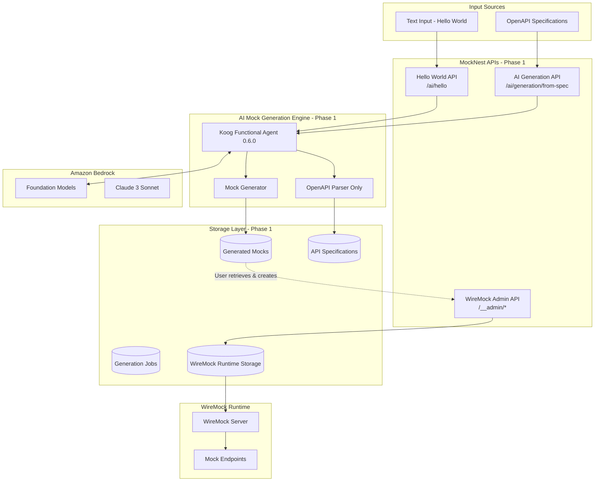
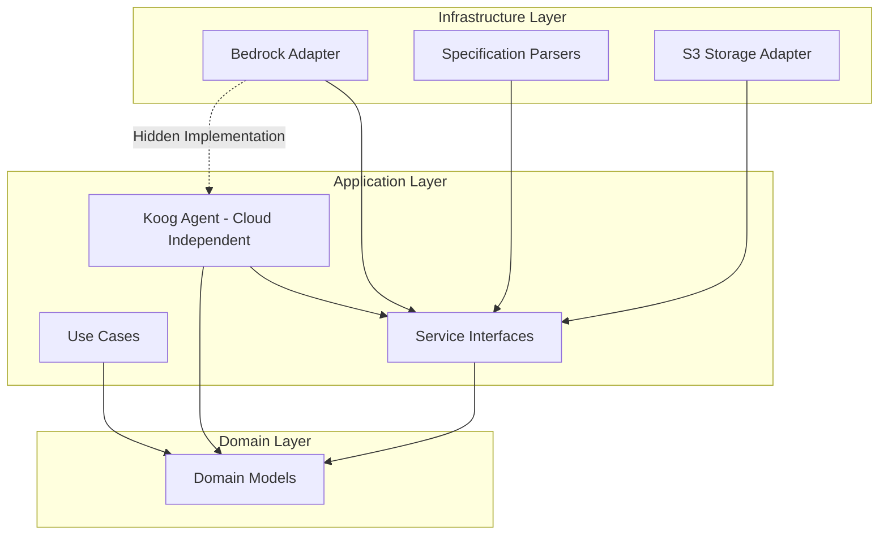

# Design Document: AI Mock Generation - Phase 1

## Overview

Phase 1 of the AI Mock Generation feature establishes the foundation for AI-powered mock creation using the Koog 0.6.0 framework, Kotlin implementation, and Amazon Bedrock integration. This phase focuses on validating the Bedrock integration and implementing core OpenAPI-based mock generation.

**Phase 1 Goals:**
1. **Hello World Endpoint**: Validate Bedrock + Koog integration with simple text processing
2. **OpenAPI Mock Generation**: Generate WireMock-ready mocks from OpenAPI 3.0 and Swagger 2.0 specifications
3. **Scenario Coverage**: Generate mocks for happy path, error cases (4xx, 5xx), and edge cases
4. **Namespace Support**: Organize mocks by API and optional client identifier
5. **Specification Storage**: Store API specifications for future evolution features

**Deferred to Future Phases:**
- Mock evolution (detecting API changes and updating mocks)
- Mock enhancement and refinement using AI
- Traffic analysis integration
- GraphQL and WSDL support
- Batch generation
- Conversational interfaces (MCP)

## Architecture

### High-Level Architecture - Phase 1



### Clean Architecture Implementation - Phase 1

Following the established clean architecture pattern with strict dependency rules:

**Domain Layer:**
- `MockGenerationRequest` - Request for generating mocks from OpenAPI specifications
- `GeneratedMock` - Domain model representing a prepared mock before WireMock creation
- `APISpecification` - Domain model for parsed OpenAPI specifications
- `GenerationJob` - Asynchronous mock generation process
- `MockNamespace` - Organizational structure for grouping mocks

**Application Layer:**
- `HelloWorldUseCase` - Validate Bedrock integration with simple text processing
- `GenerateMocksFromSpecUseCase` - Generate mocks from OpenAPI specifications only
- `KoogMockGenerationAgent` - **Koog 0.6.0 Functional Agent implementation (cloud-independent)**
- `SpecificationParserInterface` - Abstraction for parsing OpenAPI formats
- `MockGeneratorInterface` - Abstraction for mock generation logic
- `AIModelServiceInterface` - **Abstraction for AI model interactions (hides Bedrock)**

**Infrastructure Layer:**
- `BedrockServiceAdapter` - **Amazon Bedrock integration (implements AIModelServiceInterface)**
- `OpenAPISpecificationParser` - OpenAPI 3.0 and Swagger 2.0 specification parsing
- `S3GenerationStorageAdapter` - **Direct S3 storage for application data (specs, jobs, mocks)**
- `KoogS3PersistenceConfig` - **Koog framework S3 persistence configuration**

**Phase 1 Simplifications:**
- No mock evolution engine
- No natural language generation (beyond hello world validation)
- No GraphQL or WSDL parsers
- No batch generation
- Single specification processing only

### Clean Architecture Dependency Rules



**Key Architectural Principles:**
1. **Bedrock Abstraction**: `AIModelServiceInterface` in application layer hides Bedrock implementation
2. **Cloud-Independent Koog Agent**: Lives in application layer, uses abstractions only
3. **Dependency Inversion**: Infrastructure implements application interfaces
4. **No Cloud Coupling**: Domain and application layers have no AWS dependencies

## Components and Interfaces

### Core Components - Phase 1

#### 1. Hello World Endpoint (Bedrock Validation)

**Purpose**: Validate that Bedrock integration works correctly through Koog before building complex generation features.

```kotlin
@Component
class HelloWorldUseCase(
    private val aiModelService: AIModelServiceInterface
) {
    private val logger = KotlinLogging.logger {}
    
    suspend fun invoke(textInput: String): HelloWorldResponse {
        logger.info { "Processing hello world request with input: ${textInput.take(50)}..." }
        
        return runCatching {
            val response = aiModelService.processHelloWorld(textInput)
            HelloWorldResponse.success(response)
        }.onFailure { exception ->
            logger.error(exception) { "Hello world request failed" }
        }.getOrElse { exception ->
            HelloWorldResponse.error("Bedrock service unavailable: ${exception.message}")
        }
    }
}

data class HelloWorldResponse(
    val success: Boolean,
    val response: String?,
    val error: String?
) {
    companion object {
        fun success(response: String) = HelloWorldResponse(true, response, null)
        fun error(message: String) = HelloWorldResponse(false, null, message)
    }
}
```

#### 2. Koog Functional Agent Framework Integration (0.6.0) - Phase 1

**Agent Type: Functional Agent**
- **Domain-Specific**: Mock generation is a well-defined functional domain
- **Tool Coordination**: Orchestrates parsers and generators
- **Structured I/O**: Takes OpenAPI specs, produces WireMock JSON
- **Domain Expertise**: Encapsulates knowledge about OpenAPI and mock generation patterns

```kotlin
@Component
class MockGenerationFunctionalAgent(
    private val specificationParser: SpecificationParserInterface,
    private val mockGenerator: MockGeneratorInterface
) : FunctionalAgent {
    
    override val domain = "mock-generation"
    override val capabilities = setOf(
        "parse-openapi-specifications",
        "generate-wiremock-mappings",
        "scenario-based-generation"
    )
    
    override suspend fun execute(request: AgentRequest): AgentResponse {
        return when (request.type) {
            RequestType.SPECIFICATION_GENERATION -> generateFromSpec(request)
            else -> AgentResponse.error("Unsupported request type in Phase 1: ${request.type}")
        }
    }
    
    private suspend fun generateFromSpec(request: AgentRequest): AgentResponse {
        val specification = specificationParser.parse(
            request.specificationContent, 
            request.format
        )
        
        val generatedMocks = mockGenerator.generateFromSpecification(
            specification = specification,
            namespace = request.namespace,
            options = request.options
        )
        
        return AgentResponse.success(generatedMocks)
    }
}
```

**Phase 1 Limitations:**
- Only supports `SPECIFICATION_GENERATION` request type
- No natural language generation (beyond hello world)
- No mock evolution or enhancement
- Single specification processing only

#### 3. Use Case Layer - Phase 1

```kotlin
@Component
class GenerateMocksFromSpecUseCase(
    private val specificationParser: SpecificationParserInterface,
    private val mockGenerator: MockGeneratorInterface,
    private val generationStorage: GenerationStorageInterface,
    private val mockGenerationAgent: MockGenerationFunctionalAgent
) : GenerateMocksFromSpec {
    
    private val logger = KotlinLogging.logger {}
    
    override suspend fun invoke(request: MockGenerationRequest): GenerationResult {
        val jobId = request.jobId
        val namespace = request.namespace
        
        logger.info { "Starting mock generation: jobId=$jobId, namespace=$namespace" }
        
        // Store the original request for audit/replay
        generationStorage.storeGenerationRequest(jobId, namespace, request)
        
        // Parse specification
        val specification = specificationParser.parse(
            request.specificationContent,
            request.format
        )
        
        // Store API specification for future evolution if requested
        if (request.options.storeSpecification) {
            generationStorage.storeSpecification(
                namespace = namespace,
                specification = specification,
                instructions = request.instructions
            )
        }
        
        // Execute Koog agent (uses its own S3 persistence for state)
        val agentRequest = AgentRequest.fromSpec(
            specification = specification,
            namespace = namespace,
            options = request.options
        )
        val agentResponse = mockGenerationAgent.execute(agentRequest)
        
        // Store generated mocks in application storage
        generationStorage.storeGeneratedMocks(
            jobId = jobId,
            namespace = namespace,
            mocks = agentResponse.mocks
        )
        
        logger.info { "Mock generation completed: jobId=$jobId, mocksGenerated=${agentResponse.mocks.size}" }
        
        return GenerationResult.success(jobId, agentResponse.mocks.size)
    }
}
```

The storage layer uses a two-tier approach leveraging both Koog's built-in persistence and direct S3 access:

**Koog Persistence Configuration (Infrastructure Layer):**
```kotlin
@Configuration
class KoogS3PersistenceConfig(
    @Value("\${aws.s3.bucket}") private val bucketName: String,
    @Value("\${aws.account-id}") private val accountId: String
) {
    
    @Bean
    fun mockGenerationAgentPersistence(): S3PersistenceBackend {
        return S3PersistenceBackend(
            bucket = "mocknest-$accountId",
            prefix = "koog-agent-state/mock-generation/",
            checkpointInterval = Duration.ofMinutes(5),
            enableRollback = true,
            retentionPolicy = RetentionPolicy.TEMPORARY // Clear after completion
        )
    }
}
```

**Application Data Storage (Infrastructure Layer):**
```kotlin
@Component
class S3GenerationStorageAdapter(
    private val s3Client: S3Client,
    @Value("\${aws.s3.bucket}") private val bucketName: String
) : GenerationStorageInterface {
    
    private val logger = KotlinLogging.logger {}
    
    override suspend fun storeSpecification(
        namespace: MockNamespace,
        specification: APISpecification,
        instructions: String?
    ) {
        val prefix = namespace.toStoragePath()
        
        // Store current specification
        s3Client.putObject {
            bucket = bucketName
            key = "${prefix}api-specs/current.json"
            body = Json.encodeToString(specification).toByteArray()
            contentType = "application/json"
        }
        
        // Store user instructions if provided
        instructions?.let {
            s3Client.putObject {
                bucket = bucketName
                key = "${prefix}api-specs/current-instructions.txt"
                body = it.toByteArray()
                contentType = "text/plain"
            }
        }
        
        // Store versioned copy
        val version = specification.version
        s3Client.putObject {
            bucket = bucketName
            key = "${prefix}api-specs/versions/${version}/spec.json"
            body = Json.encodeToString(specification).toByteArray()
            contentType = "application/json"
        }
        
        instructions?.let {
            s3Client.putObject {
                bucket = bucketName
                key = "${prefix}api-specs/versions/${version}/instructions.txt"
                body = it.toByteArray()
                contentType = "text/plain"
            }
        }
        
        logger.info { "Stored API specification: namespace=$namespace, version=$version" }
    }
    
    override suspend fun storeGenerationRequest(
        jobId: String,
        namespace: MockNamespace,
        request: MockGenerationRequest
    ) {
        val prefix = namespace.toStoragePath()
        
        s3Client.putObject {
            bucket = bucketName
            key = "${prefix}generated-mocks/jobs/${jobId}/request.json"
            body = Json.encodeToString(request).toByteArray()
            contentType = "application/json"
        }
        
        logger.info { "Stored generation request: jobId=$jobId, namespace=$namespace" }
    }
    
    override suspend fun storeGeneratedMocks(
        jobId: String,
        namespace: MockNamespace,
        mocks: List<GeneratedMock>
    ) {
        val prefix = namespace.toStoragePath()
        
        // Store each generated mock
        mocks.forEach { mock ->
            s3Client.putObject {
                bucket = bucketName
                key = "${prefix}generated-mocks/jobs/${jobId}/mocks/${mock.id}.json"
                body = mock.wireMockMapping.toByteArray()
                contentType = "application/json"
            }
        }
        
        // Store job results summary
        val results = GenerationResults(
            totalGenerated = mocks.size,
            successful = mocks.size,
            failed = 0,
            generatedMocks = mocks
        )
        
        s3Client.putObject {
            bucket = bucketName
            key = "${prefix}generated-mocks/jobs/${jobId}/results.json"
            body = Json.encodeToString(results).toByteArray()
            contentType = "application/json"
        }
        
        logger.info { "Stored ${mocks.size} generated mocks: jobId=$jobId, namespace=$namespace" }
    }
    
    override suspend fun retrieveGeneratedMocks(
        jobId: String,
        namespace: MockNamespace
    ): GenerationResults {
        val prefix = namespace.toStoragePath()
        
        val response = s3Client.getObject {
            bucket = bucketName
            key = "${prefix}generated-mocks/jobs/${jobId}/results.json"
        }
        
        return Json.decodeFromString(response.body.decodeToString())
    }
    
    override suspend fun retrieveSpecification(
        namespace: MockNamespace,
        version: String? = null
    ): APISpecification {
        val prefix = namespace.toStoragePath()
        val key = if (version != null) {
            "${prefix}api-specs/versions/${version}/spec.json"
        } else {
            "${prefix}api-specs/current.json"
        }
        
        val response = s3Client.getObject {
            bucket = bucketName
            key = key
        }
        
        return Json.decodeFromString(response.body.decodeToString())
    }
}
```

**Use Case Integration:**
```kotlin
@Component
class GenerateMocksFromSpecUseCase(
    private val specificationParser: SpecificationParserInterface,
    private val mockGenerator: MockGeneratorInterface,
    private val generationStorage: GenerationStorageInterface,
    private val mockGenerationAgent: MockGenerationFunctionalAgent
) : GenerateMocksFromSpec {
    
    override suspend fun invoke(request: MockGenerationRequest): GenerationResult {
        val jobId = request.jobId
        val namespace = request.namespace
        
        // Store the original request for audit/replay
        generationStorage.storeGenerationRequest(jobId, namespace, request)
        
        // Parse specification
        val specification = specificationParser.parse(
            request.specificationContent,
            request.format
        )
        
        // Store API specification for future evolution if requested
        if (request.options.storeSpecification) {
            generationStorage.storeSpecification(
                namespace = namespace,
                specification = specification,
                instructions = request.instructions // User instructions
            )
        }
        
        // Execute Koog agent (uses its own S3 persistence for state)
        val agentRequest = AgentRequest.fromSpec(
            specification = specification,
            namespace = namespace,
            options = request.options
        )
        val agentResponse = mockGenerationAgent.execute(agentRequest)
        
        // Store generated mocks in application storage
        generationStorage.storeGeneratedMocks(
            jobId = jobId,
            namespace = namespace,
            mocks = agentResponse.mocks
        )
        
        return GenerationResult.success(jobId, agentResponse.mocks.size)
    }
}
```

#### 4. Specification Parsing - Phase 1 (OpenAPI Only)

```kotlin
interface SpecificationParserInterface {
    suspend fun parse(content: String, format: SpecificationFormat): APISpecification
    fun supports(format: SpecificationFormat): Boolean
}

@Component
class OpenAPISpecificationParser : SpecificationParserInterface {
    
    private val logger = KotlinLogging.logger {}
    
    override suspend fun parse(content: String, format: SpecificationFormat): APISpecification {
        logger.info { "Parsing OpenAPI specification, format=$format" }
        
        return runCatching {
            val openApiSpec = OpenAPIV3Parser().readContents(content)
            
            checkNotNull(openApiSpec.openAPI) { 
                "Failed to parse OpenAPI specification: ${openApiSpec.messages}" 
            }
            
            APISpecification.fromOpenAPI(openApiSpec.openAPI)
        }.onFailure { exception ->
            logger.error(exception) { "OpenAPI parsing failed" }
        }.getOrThrow()
    }
    
    override fun supports(format: SpecificationFormat): Boolean = 
        format in listOf(SpecificationFormat.OPENAPI_3, SpecificationFormat.SWAGGER_2)
}
```

**Phase 1 Limitations:**
- Only OpenAPI 3.0 and Swagger 2.0 support
- No GraphQL schema parsing
- No WSDL parsing
- No composite parser for multiple formats

#### 5. Mock Generation Logic - Phase 1

```kotlin
interface MockGeneratorInterface {
    suspend fun generateFromSpecification(
        specification: APISpecification,
        namespace: MockNamespace,
        options: GenerationOptions
    ): List<GeneratedMock>
}

@Component
class WireMockMappingGenerator : MockGeneratorInterface {
    
    private val logger = KotlinLogging.logger {}
    
    override suspend fun generateFromSpecification(
        specification: APISpecification,
        namespace: MockNamespace,
        options: GenerationOptions
    ): List<GeneratedMock> {
        logger.info { "Generating mocks for ${specification.endpoints.size} endpoints" }
        
        val mocks = mutableListOf<GeneratedMock>()
        
        specification.endpoints.forEach { endpoint ->
            // Generate happy path mock (2xx)
            endpoint.responses.filter { it.key in 200..299 }.forEach { (statusCode, response) ->
                mocks.add(generateMock(endpoint, statusCode, response, namespace, "happy-path"))
            }
            
            // Generate error case mocks if requested
            if (options.generateErrorCases) {
                // Client errors (4xx)
                endpoint.responses.filter { it.key in 400..499 }.forEach { (statusCode, response) ->
                    mocks.add(generateMock(endpoint, statusCode, response, namespace, "client-error"))
                }
                
                // Server errors (5xx)
                endpoint.responses.filter { it.key in 500..599 }.forEach { (statusCode, response) ->
                    mocks.add(generateMock(endpoint, statusCode, response, namespace, "server-error"))
                }
            }
        }
        
        logger.info { "Generated ${mocks.size} mocks for namespace=$namespace" }
        return mocks
    }
    
    private fun generateMock(
        endpoint: EndpointDefinition,
        statusCode: Int,
        response: ResponseDefinition,
        namespace: MockNamespace,
        scenario: String
    ): GeneratedMock {
        val mockId = generateMockId(endpoint, statusCode, namespace)
        val wireMockJson = buildWireMockMapping(endpoint, statusCode, response)
        
        return GeneratedMock(
            id = mockId,
            name = "${endpoint.method} ${endpoint.path} - $statusCode",
            namespace = namespace,
            wireMockMapping = wireMockJson,
            metadata = MockMetadata(
                sourceType = "SPECIFICATION",
                scenario = scenario,
                endpoint = endpoint.path,
                method = endpoint.method.name,
                statusCode = statusCode
            )
        )
    }
    
    private fun buildWireMockMapping(
        endpoint: EndpointDefinition,
        statusCode: Int,
        response: ResponseDefinition
    ): String {
        // Build WireMock JSON format
        val mapping = mapOf(
            "request" to mapOf(
                "method" to endpoint.method.name,
                "urlPath" to endpoint.path
            ),
            "response" to mapOf(
                "status" to statusCode,
                "headers" to mapOf("Content-Type" to "application/json"),
                "body" to generateResponseBody(response)
            )
        )
        
        return Json.encodeToString(mapping)
    }
    
    private fun generateResponseBody(response: ResponseDefinition): String {
        // Use example if available, otherwise generate from schema
        return response.examples.values.firstOrNull()?.toString()
            ?: generateFromSchema(response.schema)
    }
}
```

#### 6. AI Model Service Abstraction - Phase 1 (Hello World Only)

```kotlin
// Application Layer - Abstract Interface
interface AIModelServiceInterface {
    suspend fun processHelloWorld(textInput: String): String
}

// Infrastructure Layer - Bedrock Implementation (Hidden from Application)
@Component
class BedrockServiceAdapter(
    private val bedrockClient: BedrockRuntimeClient,
    @Value("\${bedrock.model.id:anthropic.claude-3-sonnet-20240229-v1:0}") 
    private val modelId: String
) : AIModelServiceInterface {
    
    private val logger = KotlinLogging.logger {}
    
    override suspend fun processHelloWorld(textInput: String): String {
        logger.info { "Processing hello world request with Bedrock" }
        
        return runCatching {
            val request = InvokeModelRequest {
                this.modelId = this@BedrockServiceAdapter.modelId
                contentType = "application/json"
                body = buildHelloWorldPrompt(textInput).toByteArray()
            }
            
            val response = bedrockClient.invokeModel(request)
            parseClaudeResponse(response.body)
        }.onFailure { exception ->
            logger.error(exception) { "Bedrock invocation failed" }
        }.getOrThrow()
    }
    
    private fun buildHelloWorldPrompt(textInput: String): String {
        return Json.encodeToString(mapOf(
            "anthropic_version" to "bedrock-2023-05-31",
            "max_tokens" to 1000,
            "messages" to listOf(
                mapOf(
                    "role" to "user",
                    "content" to "Echo this message back with a friendly greeting: $textInput"
                )
            )
        ))
    }
    
    private fun parseClaudeResponse(responseBody: ByteArray): String {
        val json = Json.decodeFromString<Map<String, Any>>(responseBody.decodeToString())
        val content = json["content"] as? List<*>
        val firstContent = content?.firstOrNull() as? Map<*, *>
        return firstContent?.get("text") as? String 
            ?: throw IllegalStateException("Invalid Claude response format")
    }
}
```

**Phase 1 Limitations:**
- Only hello world text processing for Bedrock validation
- No natural language mock generation
- No mock refinement or enhancement
- Future phases will expand this interface

## Data Models

### Domain Models - Phase 1

#### Core Generation Models
```kotlin
data class MockGenerationRequest(
    val jobId: String = UUID.randomUUID().toString(),
    val namespace: MockNamespace,
    val specificationContent: String,
    val format: SpecificationFormat,
    val instructions: String? = null,        // Optional user instructions for customization
    val options: GenerationOptions = GenerationOptions.default()
)

data class MockNamespace(
    val apiName: String,                     // Required: API identifier
    val client: String? = null              // Optional: Client/tenant identifier
) {
    fun toPrefix(): String = when {
        client != null -> "mocknest/$client/$apiName"
        else -> "mocknest/$apiName"
    }
    
    fun toStoragePath(): String = "${toPrefix()}/"
}

data class GeneratedMock(
    val id: String,
    val name: String,
    val namespace: MockNamespace,
    val wireMockMapping: String, // JSON string in WireMock format
    val metadata: MockMetadata,
    val generatedAt: Instant = Instant.now()
)

data class MockMetadata(
    val sourceType: String,                  // "SPECIFICATION" for Phase 1
    val scenario: String,                    // "happy-path", "client-error", "server-error"
    val endpoint: String,
    val method: String,
    val statusCode: Int
)

data class GenerationOptions(
    val includeExamples: Boolean = true,
    val generateErrorCases: Boolean = true,
    val realisticData: Boolean = true,
    val storeSpecification: Boolean = true  // Store API spec for future use
) {
    companion object {
        fun default() = GenerationOptions()
    }
}

enum class SpecificationFormat {
    OPENAPI_3,
    SWAGGER_2
    // Future: GRAPHQL, WSDL
}
```

#### API Specification Models
```kotlin
data class APISpecification(
    val format: SpecificationFormat,
    val version: String,
    val title: String,
    val endpoints: List<EndpointDefinition>,
    val schemas: Map<String, JsonSchema>,
    val metadata: Map<String, String> = emptyMap()
)

data class EndpointDefinition(
    val path: String,
    val method: HttpMethod,
    val operationId: String?,
    val summary: String?,
    val parameters: List<ParameterDefinition>,
    val requestBody: RequestBodyDefinition?,
    val responses: Map<Int, ResponseDefinition>
)

data class ResponseDefinition(
    val statusCode: Int,
    val description: String,
    val schema: JsonSchema?,
    val examples: Map<String, Any> = emptyMap(),
    val headers: Map<String, HeaderDefinition> = emptyMap()
)
```

#### Generation Job Models
```kotlin
data class GenerationJob(
    val id: String,
    val status: JobStatus,
    val namespace: MockNamespace,
    val request: MockGenerationRequest,
    val results: GenerationResults?,
    val createdAt: Instant,
    val completedAt: Instant? = null,
    val error: String? = null
)

data class GenerationResults(
    val totalGenerated: Int,
    val successful: Int,
    val failed: Int,
    val generatedMocks: List<GeneratedMock>,
    val errors: List<GenerationError> = emptyList()
)

enum class JobStatus {
    PENDING, IN_PROGRESS, COMPLETED, FAILED
}

data class GenerationError(
    val endpoint: String?,
    val message: String,
    val details: String?
)
```

**Phase 1 Simplifications:**
- No `SpecificationDiff` model (no evolution)
- No `NaturalLanguageRequest` model (beyond hello world)
- No `BatchGenerationRequest` model
- Simplified `GenerationOptions` without enhancement flags

### Storage Organization

MockNest uses a **two-layer S3 storage strategy** that leverages both Koog's built-in persistence and explicit application data storage:

#### Layer 1: Koog Agent State (Managed by Koog Framework)
Koog 0.3.0+ provides built-in persistence with S3 backend support for agent state management, checkpointing, and fault tolerance.

```
S3 Bucket: mocknest-{account-id}
├── koog-agent-state/                  # Koog's persistence layer
│   └── mock-generation/               # Agent domain
│       └── {agent-execution-id}/
│           ├── checkpoint-001.json    # Agent state snapshots
│           ├── checkpoint-002.json
│           └── latest.json            # Most recent checkpoint
```

**Koog Persistence Configuration:**
```kotlin
val mockGenerationAgent = FunctionalAgent {
    domain = "mock-generation"
    
    persistence {
        backend = S3PersistenceBackend(
            bucket = "mocknest-${accountId}",
            prefix = "koog-agent-state/mock-generation/"
        )
        checkpointInterval = Duration.ofMinutes(5)
        enableRollback = true
    }
}
```

**What Koog Manages:**
- Agent execution state and context
- Intermediate processing checkpoints
- Rollback points for error recovery
- State machine snapshots for fault tolerance

#### Layer 2: Application Data (Direct S3 Storage)
Application-specific data is stored directly in S3 for long-term persistence, retrieval, and evolution tracking.

```
S3 Bucket: mocknest-{account-id}
├── mocknest/                          # Base prefix (existing)
│   ├── {namespace}/                   # API/Client namespace
│   │   ├── api-specs/
│   │   │   ├── current.json           # Current API specification
│   │   │   ├── current-instructions.txt # Latest user instructions
│   │   │   └── versions/
│   │   │       ├── v1.0.0/
│   │   │       │   ├── spec.json      # Versioned specification
│   │   │       │   └── instructions.txt # Versioned instructions
│   │   │       └── v1.1.0/
│   │   │           ├── spec.json
│   │   │           └── instructions.txt
│   │   │
│   │   ├── generated-mocks/
│   │   │   └── jobs/
│   │   │       └── {job-id}/
│   │   │           ├── metadata.json  # Job info, status, timestamps
│   │   │           ├── request.json   # Original request (spec + instructions)
│   │   │           ├── results.json   # Generation summary
│   │   │           └── mocks/
│   │   │               ├── {mock-id-1}.json # Generated WireMock mappings
│   │   │               └── {mock-id-2}.json
│   │   │
│   │   └── __files/                   # WireMock response files (when created)
│   │       ├── {mock-id}.json
│   │       └── {mock-id}.bin
│
├── Examples of namespace organization:
│   ├── mocknest/salesforce/           # Example: Simple API namespace
│   ├── mocknest/client-a/payments/    # Example: Client-specific API namespace
│   └── mocknest/client-b/users/       # Example: Another client's API namespace
```

**What Application Manages:**
- API specifications for evolution tracking
- User instructions for audit and replay
- Generation job metadata and results
- Generated WireMock mappings (final output)
- Specification version history

#### Storage Responsibilities

| Data Type | Storage Layer | Purpose | Retention |
|-----------|--------------|---------|-----------|
| Agent execution state | Koog (Layer 1) | Fault tolerance, resume on failure | Temporary (cleared after completion) |
| Agent checkpoints | Koog (Layer 1) | Rollback capability | Temporary (configurable TTL) |
| API specifications | Application (Layer 2) | Evolution tracking, version history | Permanent |
| User instructions | Application (Layer 2) | Audit trail, replay capability | Permanent |
| Generated mocks | Application (Layer 2) | User retrieval, WireMock creation | Permanent (until user deletes) |
| Job metadata | Application (Layer 2) | Status tracking, reporting | Permanent |

#### Why This Two-Layer Approach?

**Koog Persistence (Layer 1):**
- ✅ Automatic state management and checkpointing
- ✅ Built-in fault tolerance and recovery
- ✅ No custom serialization logic needed
- ✅ Handles complex agent state automatically

**Application Storage (Layer 2):**
- ✅ Long-term data retention
- ✅ User-facing data retrieval
- ✅ Specification version tracking
- ✅ Audit trail and compliance
- ✅ Integration with existing WireMock storage

**Benefits:**
- **Separation of Concerns**: Agent runtime state vs. business data
- **Optimal Retention**: Temporary agent state vs. permanent specifications
- **Fault Tolerance**: Koog handles agent failures automatically
- **Simplicity**: Leverage Koog's built-in capabilities instead of custom implementation

### Namespace Strategy
```kotlin
data class MockNamespace(
    val client: String? = null,        // Optional client name
    val apiName: String,               // Required API name
) {
    fun toPrefix(): String = when {
        client != null -> "mocknest/$client/$apiName"
        else -> "mocknest/$apiName"
    }
}

// Examples:
// MockNamespace(apiName = "salesforce") → "mocknest/salesforce"
// MockNamespace(client = "client-a", apiName = "payments") → "mocknest/client-a/payments"
```

## API Design

MockNest Serverless exposes **two distinct APIs** that work together:

### **1. Standard WireMock Admin API (Existing - Unchanged)**
The existing WireMock admin API for managing mocks:

```http
# Create/Update Mock (Standard WireMock)
POST /__admin/mappings
Content-Type: application/json

{
  "request": {
    "method": "GET",
    "url": "/users"
  },
  "response": {
    "status": 200,
    "headers": {
      "Content-Type": "application/json"
    },
    "body": "[{\"id\":1,\"name\":\"John Doe\"}]"
  }
}

# List All Mocks (Standard WireMock)
GET /__admin/mappings

# Delete Mock (Standard WireMock)  
DELETE /__admin/mappings/{id}
```

### **2. AI Generation API - Phase 1 Endpoints**

#### Hello World Endpoint (Bedrock Validation)
```http
POST /ai/hello
Content-Type: application/json

{
  "text": "Hello, Bedrock!"
}

Response:
{
  "success": true,
  "response": "Hello! I received your message: Hello, Bedrock!",
  "error": null
}
```

#### Mock Generation from OpenAPI Specification
```http
POST /ai/generation/from-spec
Content-Type: application/json

{
  "namespace": {
    "apiName": "salesforce",
    "client": "client-a"              // Optional
  },
  "specification": "openapi: 3.0.0...",
  "format": "OPENAPI_3",
  "instructions": "Focus on error scenarios and include rate limiting examples", // Optional
  "options": {
    "includeExamples": true,
    "generateErrorCases": true,
    "realisticData": true,
    "storeSpecification": true        // Store spec for future evolution
  }
}

Response:
{
  "jobId": "gen-123e4567-e89b-12d3-a456-426614174000",
  "namespace": "mocknest/client-a/salesforce",
  "status": "COMPLETED",
  "mocksGenerated": 15
}
```

#### Retrieve Generated Mocks (Ready for WireMock)
```http
GET /ai/generation/jobs/{jobId}/mocks

Response:
{
  "jobId": "gen-123e4567-e89b-12d3-a456-426614174000",
  "status": "COMPLETED",
  "namespace": "mocknest/client-a/salesforce",
  "results": {
    "totalGenerated": 15,
    "successful": 15,
    "failed": 0,
    "mocks": [
      {
        "id": "mock-users-list-200",
        "name": "GET /users - 200",
        "wireMockMapping": "{\"request\":{\"method\":\"GET\",\"urlPath\":\"/users\"},\"response\":{\"status\":200,...}}",
        "metadata": {
          "sourceType": "SPECIFICATION",
          "scenario": "happy-path",
          "endpoint": "/users",
          "method": "GET",
          "statusCode": 200
        }
      },
      {
        "id": "mock-users-list-404",
        "name": "GET /users - 404",
        "wireMockMapping": "{\"request\":{\"method\":\"GET\",\"urlPath\":\"/users\"},\"response\":{\"status\":404,...}}",
        "metadata": {
          "sourceType": "SPECIFICATION",
          "scenario": "client-error",
          "endpoint": "/users",
          "method": "GET",
          "statusCode": 404
        }
      }
    ]
  }
}
```

### **Phase 1 Workflow Example**

```bash
# Step 1: Validate Bedrock integration (Hello World)
curl -X POST /ai/hello \
  -H "Content-Type: application/json" \
  -d '{"text": "Testing Bedrock connection"}'
# Returns: {"success": true, "response": "Hello! I received your message..."}

# Step 2: Generate mocks from OpenAPI spec with namespace (AI Generation API)
curl -X POST /ai/generation/from-spec \
  -H "Content-Type: application/json" \
  -d '{
    "namespace": {"apiName": "salesforce", "client": "client-a"},
    "specification": "openapi: 3.0.0...", 
    "format": "OPENAPI_3",
    "options": {"storeSpecification": true, "generateErrorCases": true}
  }'
# Returns: {"jobId": "gen-123", "namespace": "mocknest/client-a/salesforce", "status": "COMPLETED"}

# Step 3: Retrieve generated mocks (AI Generation API)  
curl /ai/generation/jobs/gen-123/mocks
# Returns: {"mocks": [{"wireMockMapping": "{...WireMock JSON...}"}]}

# Step 4: Create selected mocks in WireMock (Standard Admin API)
curl -X POST /__admin/mappings \
  -H "Content-Type: application/json" \
  -d '{"request":{"method":"GET","urlPath":"/users"},"response":{"status":200,...}}'
# Mocks created and ready to use

# Step 5: Use mocks normally (Standard WireMock)
curl /users  # Returns mocked response
```

### **Key Design Principles**

1. **Complete Separation**: AI generation API is independent of WireMock admin API
2. **Standard Integration**: Generated mocks use standard WireMock JSON format
3. **User Control**: Users can review, edit, and selectively create generated mocks
4. **No Lock-in**: Generated mocks are standard WireMock mappings
5. **Flexible Workflow**: Users can modify generated mocks before creating them

**Phase 1 Limitations:**
- No natural language generation endpoint (beyond hello world)
- No batch generation endpoint
- No mock evolution endpoint
- No mock enhancement endpointon API (New)**
New AI-powered endpoints for generating mocks at `/ai/generation/*`:

#### Mock Generation from Specifications with Namespace and Instructions
```http
POST /ai/generation/from-spec
Content-Type: application/json

{
  "namespace": {
    "apiName": "salesforce",
    "client": "client-a"              # Optional
  },
  "specification": "openapi: 3.0.0...",
  "format": "OPENAPI_3",
  "instructions": "Focus on error scenarios and include rate limiting examples", # Optional
  "options": {
    "includeExamples": true,
    "generateErrorCases": true,
    "realisticData": true,
    "storeSpecification": true        # Store spec for future evolution
  }
}

Response:
{
  "jobId": "gen-123e4567-e89b-12d3-a456-426614174000",
  "namespace": "mocknest/client-a/salesforce",
  "status": "IN_PROGRESS",
  "estimatedCompletion": "2024-01-10T15:30:00Z"
}
```

#### Mock Generation from Natural Language + Existing Spec (Future)
```http
POST /ai/generation/from-description
Content-Type: application/json

{
  "namespace": {
    "apiName": "salesforce",
    "client": "client-a"
  },
  "description": "Add error handling for rate limiting scenarios with 429 status codes and retry-after headers",
  "useExistingSpec": true,            # Use stored API spec as context
  "options": {
    "enhanceExisting": true,          # Enhance existing mocks vs create new
    "preserveCustomizations": true
  }
}

Response:
{
  "jobId": "gen-456e7890-e89b-12d3-a456-426614174001",
  "namespace": "mocknest/client-a/salesforce",
  "status": "COMPLETED",
  "enhancedMocks": 3,                 # Number of existing mocks enhanced
  "newMocks": 2                       # Number of new mocks created
}
```

#### Retrieve Generated Mocks (Ready for WireMock)
```http
GET /ai/generation/jobs/{jobId}/mocks

Response:
{
  "jobId": "gen-123e4567-e89b-12d3-a456-426614174000",
  "status": "COMPLETED",
  "mocks": [
    {
      "id": "mock-users-list",
      "name": "List Users",
      "wireMockMapping": "{\"request\":{\"method\":\"GET\",\"url\":\"/users\"},...}",
      "metadata": {
        "sourceType": "SPECIFICATION",
        "endpoint": {
          "method": "GET",
          "path": "/users",
          "statusCode": 200,
          "contentType": "application/json"
        }
      }
    }
  ]
}
```

### **Complete Workflow Example**

```bash
# Step 1: Generate mocks from API spec with namespace (AI Generation API)
curl -X POST /ai/generation/from-spec \
  -H "Content-Type: application/json" \
  -d '{
    "namespace": {"apiName": "salesforce", "client": "client-a"},
    "specification": "openapi: 3.0.0...", 
    "format": "OPENAPI_3",
    "options": {"storeSpecification": true}
  }'
# Returns: {"jobId": "gen-123", "namespace": "mocknest/client-a/salesforce"}

# Step 2: Retrieve generated mocks (AI Generation API)  
curl /ai/generation/jobs/gen-123/mocks
# Returns: {"mocks": [{"wireMockMapping": "{...WireMock JSON...}"}]}

# Step 3: Create selected mocks in WireMock with namespace (Admin API)
curl -X POST /__admin/mappings \
  -H "Content-Type: application/json" \
  -d '{"request":{"method":"GET","url":"/users"},"response":{...}}'
# Mocks created under mocknest/client-a/salesforce/ prefix

# Step 4: Use mocks normally (Standard WireMock)
curl /users  # Returns mocked response

# Future: Enhance existing mocks with natural language
curl -X POST /ai/generation/from-description \
  -H "Content-Type: application/json" \
  -d '{
    "namespace": {"apiName": "salesforce", "client": "client-a"},
    "description": "Add rate limiting error scenarios",
    "useExistingSpec": true
  }'
```

### **Key Design Principles**

1. **Complete Separation**: AI generation API is independent of WireMock admin API
2. **Standard Integration**: Generated mocks use standard WireMock JSON format
3. **User Control**: Users can review, edit, and selectively create generated mocks
4. **No Lock-in**: Generated mocks are standard WireMock mappings
5. **Flexible Workflow**: Users can modify generated mocks before creating them

### Batch Generation
```http
POST /ai/generation/batch
Content-Type: application/json

{
  "specifications": [
    {
      "name": "users-api",
      "content": "openapi: 3.0.0...",
      "format": "OPENAPI_3"
    },
    {
      "name": "orders-api", 
      "content": "openapi: 3.0.0...",
      "format": "OPENAPI_3"
    }
  ],
  "options": {
    "namespacePrefix": "external-apis",
    "generateErrorCases": true
  }
}
```

### Mock Evolution
```http
POST /ai/generation/evolve
Content-Type: application/json

{
  "previousSpecification": "openapi: 3.0.0...",
  "currentSpecification": "openapi: 3.0.0...",
  "existingMocks": ["mock-id-1", "mock-id-2"],
  "options": {
    "preserveCustomizations": true,
    "autoApplyChanges": false
  }
}
```

## Correctness Properties

*A property is a characteristic or behavior that should hold true across all valid executions of a system-essentially, a formal statement about what the system should do. Properties serve as the bridge between human-readable specifications and machine-verifiable correctness guarantees.*

### Property 1: Hello World Bedrock Integration
*For any* text input to the hello world endpoint, the system should successfully communicate with Bedrock and return a response or clear error message
**Validates: Requirements 1.1, 1.2, 1.3**

### Property 2: OpenAPI Parsing Completeness
*For any* valid OpenAPI 3.0 or Swagger 2.0 specification, the parser should extract all endpoint definitions without data loss
**Validates: Requirements 2.1, 2.2, 2.3**

### Property 3: Generated Mock Validity
*For any* generated mock, the WireMock mapping should be syntactically valid JSON and executable by the WireMock runtime
**Validates: Requirements 3.1, 3.5**

### Property 4: Schema Compliance
*For any* generated mock response, the response structure should comply with the schema definitions from the source OpenAPI specification
**Validates: Requirements 3.2**

### Property 5: Scenario Coverage
*For any* OpenAPI specification with multiple response status codes, the generator should create separate mocks for happy path (2xx), client errors (4xx), and server errors (5xx) when error generation is enabled
**Validates: Requirements 7.1, 7.2, 7.3, 7.4**

### Property 6: Namespace Isolation
*For any* two different namespaces, generated mocks should be stored in separate storage paths without collision
**Validates: Requirements 4.1, 4.2, 4.3, 4.5**

### Property 7: Specification Storage Persistence
*For any* generation request with storeSpecification enabled, the API specification should be persistently stored and retrievable with version information
**Validates: Requirements 5.1, 5.2, 5.3, 5.4**

### Property 8: Generation Job Tracking
*For any* generation job, the job status and results should be persistently stored and retrievable until explicitly deleted
**Validates: Requirements 6.1, 6.2, 6.3, 6.4**

### Property 9: Example Response Preservation
*For any* OpenAPI specification with example responses, those examples should be used as mock response templates in generated mocks
**Validates: Requirements 2.4, 3.2**

### Property 10: Error Handling Resilience
*For any* invalid OpenAPI specification, the parser should return detailed validation errors without crashing the system
**Validates: Requirements 2.5, 6.5**

**Deferred to Future Phases:**
- Mock evolution properties (specification change detection)
- Natural language interpretation properties
- Batch generation properties
- Mock enhancement properties

## Error Handling

### Specification Parsing Errors - Phase 1
- **Invalid OpenAPI Format**: Clear error messages indicating specific format issues with line numbers
- **Missing Required Fields**: Detailed validation errors with field-level guidance
- **Unsupported Version**: Clear message indicating only OpenAPI 3.0 and Swagger 2.0 are supported in Phase 1

### Bedrock Integration Errors - Phase 1
- **Service Unavailable**: Return clear error message indicating Bedrock is not available
- **Invalid Model Response**: Validate and handle malformed responses from Claude
- **Timeout Handling**: Configurable timeouts with appropriate error messages

### Generation Process Errors - Phase 1
- **Memory Limits**: Handle large specifications gracefully with appropriate error messages
- **Invalid Schema**: Handle specifications with invalid or missing schemas
- **Storage Failures**: Retry logic for S3 operations with exponential backoff

## Testing Strategy

### Unit Testing - Phase 1
- Test hello world endpoint with various text inputs
- Test OpenAPI parser with valid and invalid specifications
- Test mock generator with different endpoint configurations
- Test namespace path generation and collision prevention
- Test error handling scenarios with fault injection

### Property-Based Testing - Phase 1
Property-based tests will be implemented using Kotest Property Testing framework, with each test running a minimum of 100 iterations.

Each property-based test will be tagged with comments referencing the design document property:

```kotlin
// **Feature: ai-mock-generation, Property 2: OpenAPI Parsing Completeness**
@Test
suspend fun `openapi parsing preserves all endpoint information`() {
    checkAll<OpenAPISpecification> { spec ->
        val parsed = parser.parse(spec.toJson(), SpecificationFormat.OPENAPI_3)
        parsed.endpoints.size shouldBe spec.paths.size
    }
}

// **Feature: ai-mock-generation, Property 3: Generated Mock Validity**
@Test
suspend fun `generated mocks are valid wiremock json`() {
    checkAll<APISpecification> { spec ->
        val mocks = generator.generateFromSpecification(spec, testNamespace, defaultOptions)
        mocks.forEach { mock ->
            // Should parse as valid JSON
            Json.parseToJsonElement(mock.wireMockMapping)
            // Should contain required WireMock fields
            mock.wireMockMapping shouldContain "request"
            mock.wireMockMapping shouldContain "response"
        }
    }
}
```

### Integration Testing - Phase 1
- Use TestContainers with LocalStack for S3 testing
- Test complete generation workflows with real OpenAPI specifications
- Test Koog agent orchestration with mock Bedrock responses
- Validate generated mocks work with actual WireMock runtime
- Test hello world endpoint with actual Bedrock integration

### Performance Testing - Phase 1
- Measure generation times for various specification sizes
- Test memory usage with large specifications
- Validate S3 storage operations performance
- Test Bedrock API latency and timeout handling

## Deployment Considerations

### Koog Framework Integration - Phase 1
```yaml
Dependencies:
  - koog-core: 0.6.0
  - koog-functional-agents: 0.6.0
  - koog-bedrock: 0.6.0
  - koog-kotlin-dsl: 0.6.0

Configuration:
  - Functional Agent registration with Koog runtime
  - Agent domain: "mock-generation"
  - Capabilities: parse-openapi, generate-wiremock, scenario-generation
  - Bedrock model configuration for hello world validation
```

### AWS Bedrock Configuration - Phase 1
```yaml
Required Models:
  - anthropic.claude-3-sonnet-20240229-v1:0 (Hello world validation only)

IAM Permissions:
  - bedrock:InvokeModel
  - bedrock:ListFoundationModels

Phase 1 Usage:
  - Hello world endpoint only
  - No natural language mock generation yet
  - Future phases will expand Bedrock usage
```

### Resource Scaling - Phase 1
- **Lambda Memory**: 1024MB minimum for OpenAPI parsing and generation
- **Timeout**: 5 minutes for specification processing
- **Concurrency**: Start with default, monitor usage
- **Storage**: Separate S3 prefix for generation artifacts

## Security Considerations

### API Specification Security - Phase 1
- **Sanitization**: Remove sensitive data from specifications before storage
- **Validation**: Strict input validation for OpenAPI format
- **Access Control**: API key-based access to generation endpoints

### Bedrock Integration Security - Phase 1
- **Model Access**: Restrict to Claude 3 Sonnet only
- **Input Validation**: Sanitize text inputs for hello world endpoint
- **Response Validation**: Validate Bedrock responses before returning

### Generated Mock Security - Phase 1
- **Content Filtering**: Basic validation of generated mock content
- **Namespace Isolation**: Separate storage per namespace
- **Audit Logging**: Track all generation activities

## Monitoring and Observability

### Generation Metrics - Phase 1
- **Success Rate**: Percentage of successful generations
- **Processing Time**: Average generation time by specification size
- **Bedrock Usage**: Hello world endpoint usage tracking
- **Error Rate**: Failed generations by error type

### Business Metrics - Phase 1
- **Adoption**: Number of specifications processed
- **Namespace Usage**: Number of unique namespaces created
- **Mock Volume**: Total mocks generated over time

## Future Phase Enhancements

The following features are explicitly deferred to future phases:

### Future Phase 2: Mock Evolution
- Specification change detection and diff generation
- Automated mock update suggestions
- Version comparison and rollback capabilities

### Future Phase 3: AI-Powered Enhancement
- Natural language mock generation using Bedrock
- Mock refinement and improvement suggestions
- Response realism enhancement

### Future Phase 4: Advanced Features
- GraphQL and WSDL support
- Batch generation for multiple specifications
- Traffic analysis integration
- Conversational interfaces (MCP)