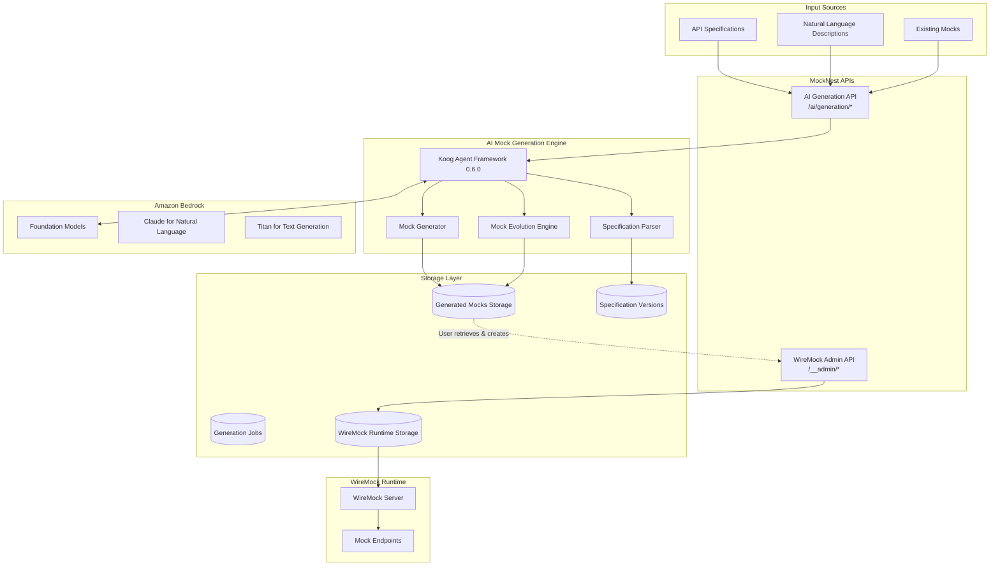
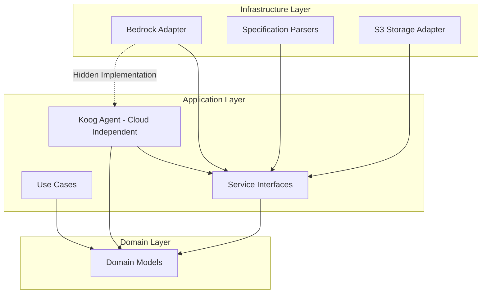

# Design Document: AI Mock Generation

## Overview

The AI Mock Generation feature provides intelligent mock creation capabilities using the Koog framework for AI agent orchestration, Kotlin implementation, and Amazon Bedrock integration. This design implements a clear separation between AI-powered mock generation and standard WireMock operations: AI generates and prepares mocks, users retrieve them, and then create them using standard WireMock admin APIs.

## Architecture

### High-Level Architecture



### Clean Architecture Implementation

Following the established clean architecture pattern with strict dependency rules:

**Domain Layer:**
- `MockGenerationRequest` - Request for generating mocks from specifications or descriptions
- `GeneratedMock` - Domain model representing a prepared mock before WireMock creation
- `APISpecification` - Domain model for parsed API specifications
- `GenerationJob` - Asynchronous mock generation process
- `SpecificationDiff` - Comparison between specification versions

**Application Layer:**
- `GenerateMocksFromSpecUseCase` - Generate mocks from API specifications only
- `GenerateMocksFromSpecWithDescriptionUseCase` - Generate mocks from API spec + natural language enhancement
- `GenerateMocksFromDescriptionUseCase` - Generate mocks from natural language only (via abstraction)
- `EvolveMocksUseCase` - Update mocks based on specification changes
- `BatchGenerationUseCase` - Handle multiple specifications in one job
- `KoogMockGenerationAgent` - **Koog 0.6.0 Functional Agent implementation (cloud-independent)**
- `SpecificationParserInterface` - Abstraction for parsing different spec formats
- `MockGeneratorInterface` - Abstraction for mock generation logic
- `AIModelServiceInterface` - **Abstraction for AI model interactions (hides Bedrock)**

**Infrastructure Layer:**
- `BedrockServiceAdapter` - **Amazon Bedrock integration (implements AIModelServiceInterface)**
- `OpenAPISpecificationParser` - OpenAPI/Swagger specification parsing
- `GraphQLSpecificationParser` - GraphQL schema parsing
- `WSDLSpecificationParser` - SOAP/WSDL specification parsing
- `S3GenerationStorageAdapter` - Storage for generated mocks and specifications

### Clean Architecture Dependency Rules



**Key Architectural Principles:**
1. **Bedrock Abstraction**: `AIModelServiceInterface` in application layer hides Bedrock implementation
2. **Cloud-Independent Koog Agent**: Lives in application layer, uses abstractions only
3. **Dependency Inversion**: Infrastructure implements application interfaces
4. **No Cloud Coupling**: Domain and application layers have no AWS dependencies

## Components and Interfaces

### Core Components

#### 1. Koog Functional Agent Framework Integration (0.6.0)

**Agent Type: Functional Agent**
- **Domain-Specific**: Mock generation is a well-defined functional domain
- **Tool Coordination**: Orchestrates parsers, generators, and AI services  
- **Structured I/O**: Takes structured requests, produces structured WireMock JSON
- **Domain Expertise**: Encapsulates knowledge about API specs and mock generation patterns

```kotlin
@Component
class MockGenerationFunctionalAgent(
    private val aiModelService: AIModelServiceInterface, // Abstraction - no Bedrock coupling
    private val specificationParser: SpecificationParserInterface,
    private val mockGenerator: MockGeneratorInterface
) : FunctionalAgent {
    
    override val domain = "mock-generation"
    override val capabilities = setOf(
        "parse-api-specifications",
        "generate-wiremock-mappings", 
        "natural-language-interpretation",
        "spec-enhancement"
    )
    
    override suspend fun execute(request: AgentRequest): AgentResponse {
        return when (request.type) {
            RequestType.SPECIFICATION_GENERATION -> generateFromSpec(request)
            RequestType.NATURAL_LANGUAGE_GENERATION -> generateFromDescription(request)
            RequestType.SPEC_WITH_DESCRIPTION -> generateFromSpecWithDescription(request)
            RequestType.MOCK_EVOLUTION -> evolveMocks(request)
        }
    }
    
    private suspend fun generateFromSpec(request: AgentRequest): AgentResponse {
        val specification = specificationParser.parse(request.specificationContent, request.format)
        val generatedMocks = mockGenerator.generateFromSpecification(specification, request.namespace)
        return AgentResponse.success(generatedMocks)
    }
    
    private suspend fun generateFromDescription(request: AgentRequest): AgentResponse {
        // Uses abstraction - doesn't know about Bedrock
        val generatedMocks = aiModelService.generateMockFromDescription(request.description)
        return AgentResponse.success(generatedMocks)
    }
    
    private suspend fun generateFromSpecWithDescription(request: AgentRequest): AgentResponse {
        // Parse specification first
        val specification = specificationParser.parse(request.specificationContent, request.format)
        
        // Use AI service to enhance generation with natural language context
        val enhancedMocks = aiModelService.generateMockFromSpecWithDescription(
            specification = specification,
            description = request.description,
            namespace = request.namespace
        )
        return AgentResponse.success(enhancedMocks)
    }
}
```

**Why Functional Agent is Perfect for Mock Generation:**
- ✅ **Specific Domain Task**: Mock generation is a well-defined functional domain
- ✅ **Multi-Service Coordination**: Orchestrates parsers, generators, Bedrock, and storage
- ✅ **Structured Processing**: Handles API specs and produces WireMock JSON mappings
- ✅ **Domain Knowledge**: Understands API specification formats and mock generation patterns
- ✅ **Right Complexity**: More sophisticated than basic agents, simpler than workflow agents

#### 2. Use Case Layer
The application uses clean architecture with dedicated use cases for different generation scenarios:

```kotlin
@Component
class GenerateMocksFromSpecUseCase(
    private val specificationParser: SpecificationParserInterface,
    private val mockGenerator: MockGeneratorInterface,
    private val generationStorage: GenerationStorageInterface
) : GenerateMocksFromSpec {
    
    override suspend fun invoke(request: MockGenerationRequest): GenerationResult {
        val specification = specificationParser.parse(request.specificationContent, request.format)
        val generatedMocks = mockGenerator.generateFromSpecification(specification, request.namespace)
        
        // Store API specification for future evolution if requested
        if (request.options.storeSpecification) {
            generationStorage.storeSpecification(request.namespace, specification)
        }
        
        val jobId = generationStorage.storeGeneratedMocks(generatedMocks, request.jobId)
        return GenerationResult.success(jobId, generatedMocks.size)
    }
}

@Component
class GenerateMocksFromSpecWithDescriptionUseCase(
    private val specificationParser: SpecificationParserInterface,
    private val mockGenerationAgent: MockGenerationFunctionalAgent,
    private val generationStorage: GenerationStorageInterface
) : GenerateMocksFromSpecWithDescription {
    
    override suspend fun invoke(request: SpecWithDescriptionRequest): GenerationResult {
        // Use Functional Agent to handle spec + description generation
        val agentRequest = AgentRequest.specWithDescription(
            specificationContent = request.specificationContent,
            format = request.format,
            description = request.description,
            namespace = request.namespace
        )
        val agentResponse = mockGenerationAgent.execute(agentRequest)
        
        val jobId = generationStorage.storeGeneratedMocks(agentResponse.mocks, request.jobId)
        return GenerationResult.success(jobId, agentResponse.mocks.size)
    }
}

@Component  
class GenerateMocksFromDescriptionUseCase(
    private val mockGenerationAgent: MockGenerationFunctionalAgent,
    private val generationStorage: GenerationStorageInterface
) : GenerateMocksFromDescription {
    
    override suspend fun invoke(request: NaturalLanguageRequest): GenerationResult {
        val agentRequest = AgentRequest.naturalLanguage(
            description = request.description, 
            namespace = request.namespace,
            useExistingSpec = request.useExistingSpec
        )
        val agentResponse = mockGenerationAgent.execute(agentRequest)
        
        val jobId = generationStorage.storeGeneratedMocks(agentResponse.mocks, request.jobId)
        return GenerationResult.success(jobId, agentResponse.mocks.size)
    }
}
```

#### 3. Specification Parsing
```kotlin
interface SpecificationParserInterface {
    suspend fun parse(content: String, format: SpecificationFormat): APISpecification
    fun supports(format: SpecificationFormat): Boolean
}

@Component
class OpenAPISpecificationParser : SpecificationParserInterface {
    override suspend fun parse(content: String, format: SpecificationFormat): APISpecification {
        val openApiSpec = OpenAPIV3Parser().readContents(content)
        return APISpecification.fromOpenAPI(openApiSpec.openAPI)
    }
    
    override fun supports(format: SpecificationFormat): Boolean = 
        format in listOf(SpecificationFormat.OPENAPI_3, SpecificationFormat.SWAGGER_2)
}
```

#### 4. AI Model Service Abstraction
```kotlin
// Application Layer - Abstract Interface
interface AIModelServiceInterface {
    suspend fun generateMockFromDescription(description: String): List<GeneratedMock>
    suspend fun refineMock(existingMock: GeneratedMock, refinementRequest: String): GeneratedMock
    suspend fun enhanceResponseRealism(mockResponse: String, schema: JsonSchema): String
}

// Infrastructure Layer - Bedrock Implementation (Hidden from Application)
@Component
class BedrockServiceAdapter(
    private val bedrockClient: BedrockRuntimeClient
) : AIModelServiceInterface {
    
    override suspend fun generateMockFromDescription(description: String): List<GeneratedMock> {
        val request = InvokeModelRequest {
            modelId = "anthropic.claude-3-sonnet-20240229-v1:0"
            contentType = "application/json"
            body = buildClaudePrompt(description).toByteArray()
        }
        
        val response = bedrockClient.invokeModel(request)
        return parseClaudeResponse(response.body)
    }
    
    private fun buildClaudePrompt(description: String): String {
        return """
        You are an expert API mock generator. Generate WireMock JSON mappings based on this description:
        
        Description: $description
        
        Requirements:
        - Generate valid WireMock JSON mapping format
        - Include realistic response data
        - Handle appropriate HTTP status codes
        - Include relevant headers
        - Ensure response matches described behavior
        
        Return only valid JSON in WireMock mapping format.
        """.trimIndent()
    }
}
```

## Data Models

### Domain Models

#### Core Generation Models
```kotlin
data class MockGenerationRequest(
    val jobId: String = UUID.randomUUID().toString(),
    val namespace: MockNamespace,
    val specificationContent: String,
    val format: SpecificationFormat,
    val options: GenerationOptions = GenerationOptions.default()
)

data class NaturalLanguageRequest(
    val jobId: String = UUID.randomUUID().toString(),
    val namespace: MockNamespace,
    val description: String,
    val useExistingSpec: Boolean = false,    # Use stored API spec as context
    val context: Map<String, String> = emptyMap(),
    val options: GenerationOptions = GenerationOptions.default()
)

data class MockNamespace(
    val apiName: String,                     # Required: API identifier
    val client: String? = null              # Optional: Client/tenant identifier
) {
    fun toPrefix(): String = when {
        client != null -> "mocknest/$client/$apiName"
        else -> "mocknest/$apiName"
    }
    
    fun toStoragePath(): String = "${toPrefix()}/"
}

data class GeneratedMock(
    val id: String,
    val name: String,
    val namespace: MockNamespace,
    val wireMockMapping: String, // JSON string in WireMock format
    val metadata: MockMetadata,
    val generatedAt: Instant = Instant.now()
)

data class GenerationOptions(
    val includeExamples: Boolean = true,
    val generateErrorCases: Boolean = true,
    val realisticData: Boolean = true,
    val storeSpecification: Boolean = true,  # Store API spec for future use
    val enhanceExisting: Boolean = false,    # Enhance existing mocks vs create new
    val preserveCustomizations: Boolean = true
) {
    companion object {
        fun default() = GenerationOptions()
    }
}
```

#### API Specification Models
```kotlin
data class APISpecification(
    val format: SpecificationFormat,
    val version: String,
    val title: String,
    val endpoints: List<EndpointDefinition>,
    val schemas: Map<String, JsonSchema>,
    val metadata: Map<String, String> = emptyMap()
)

data class EndpointDefinition(
    val path: String,
    val method: HttpMethod,
    val operationId: String?,
    val summary: String?,
    val parameters: List<ParameterDefinition>,
    val requestBody: RequestBodyDefinition?,
    val responses: Map<Int, ResponseDefinition>,
    val security: List<SecurityRequirement> = emptyList()
)

data class ResponseDefinition(
    val statusCode: Int,
    val description: String,
    val schema: JsonSchema?,
    val examples: Map<String, Any> = emptyMap(),
    val headers: Map<String, HeaderDefinition> = emptyMap()
)
```

#### Generation Job Models
```kotlin
data class GenerationJob(
    val id: String,
    val status: JobStatus,
    val request: GenerationJobRequest,
    val results: GenerationResults?,
    val createdAt: Instant,
    val completedAt: Instant? = null,
    val error: String? = null
)

data class GenerationJobRequest(
    val type: GenerationType,
    val specifications: List<SpecificationInput> = emptyList(),
    val descriptions: List<String> = emptyList(),
    val options: GenerationOptions
)

data class GenerationResults(
    val totalGenerated: Int,
    val successful: Int,
    val failed: Int,
    val generatedMocks: List<GeneratedMock>,
    val errors: List<GenerationError> = emptyList()
)

enum class JobStatus {
    PENDING, IN_PROGRESS, COMPLETED, FAILED, CANCELLED
}

enum class GenerationType {
    SPECIFICATION, NATURAL_LANGUAGE, BATCH, EVOLUTION
}
```

### Storage Organization
```
S3 Bucket Structure with Namespacing:
├── mocknest/                          # Base prefix (existing)
│   ├── {namespace}/                   # API/Client namespace
│   │   ├── api-specs/
│   │   │   ├── current.json           # Current API specification
│   │   │   ├── versions/
│   │   │   │   ├── v1.0.0.json       # Versioned specifications
│   │   │   │   └── v1.1.0.json
│   │   ├── generated-mocks/
│   │   │   ├── jobs/
│   │   │   │   ├── {job-id}/
│   │   │   │   │   ├── metadata.json  # Job information
│   │   │   │   │   ├── mocks/
│   │   │   │   │   │   ├── {mock-id}.json  # Generated WireMock mappings
│   │   │   │   │   └── results.json   # Generation results summary
│   │   └── __files/                   # WireMock response files (when created)
│   │       ├── {mock-id}.json
│   │       └── {mock-id}.bin
│
├── Examples of namespace organization:
│   ├── mocknest/salesforce/           # Example: Simple API namespace
│   ├── mocknest/client-a/payments/    # Example: Client-specific API namespace
│   └── mocknest/client-b/users/       # Example: Another client's API namespace
```

### Namespace Strategy
```kotlin
data class MockNamespace(
    val client: String? = null,        // Optional client name
    val apiName: String,               // Required API name
) {
    fun toPrefix(): String = when {
        client != null -> "mocknest/$client/$apiName"
        else -> "mocknest/$apiName"
    }
}

// Examples:
// MockNamespace(apiName = "salesforce") → "mocknest/salesforce"
// MockNamespace(client = "client-a", apiName = "payments") → "mocknest/client-a/payments"
```

## API Design

MockNest Serverless exposes **two distinct APIs** that work together:

### **1. Standard WireMock Admin API (Existing)**
The existing WireMock admin API for managing mocks - **completely unchanged**:

```http
# Create/Update Mock (Standard WireMock)
POST /__admin/mappings
Content-Type: application/json

{
  "request": {
    "method": "GET",
    "url": "/users"
  },
  "response": {
    "status": 200,
    "headers": {
      "Content-Type": "application/json"
    },
    "body": "[{\"id\":1,\"name\":\"John Doe\"}]"
  }
}

# List All Mocks (Standard WireMock)
GET /__admin/mappings

# Delete Mock (Standard WireMock)  
DELETE /__admin/mappings/{id}
```

### **2. AI Generation API (New)**
New AI-powered endpoints for generating mocks at `/ai/generation/*`:

#### Mock Generation from Specifications with Namespace
```http
POST /ai/generation/from-spec
Content-Type: application/json

{
  "namespace": {
    "apiName": "salesforce",
    "client": "client-a"              # Optional
  },
  "specification": "openapi: 3.0.0...",
  "format": "OPENAPI_3",
  "options": {
    "includeExamples": true,
    "generateErrorCases": true,
    "realisticData": true,
    "storeSpecification": true        # Store spec for future evolution
  }
}

Response:
{
  "jobId": "gen-123e4567-e89b-12d3-a456-426614174000",
  "namespace": "mocknest/client-a/salesforce",
  "status": "IN_PROGRESS",
  "estimatedCompletion": "2024-01-10T15:30:00Z"
}
```

#### Mock Generation from Natural Language + Existing Spec (Future)
```http
POST /ai/generation/from-description
Content-Type: application/json

{
  "namespace": {
    "apiName": "salesforce",
    "client": "client-a"
  },
  "description": "Add error handling for rate limiting scenarios with 429 status codes and retry-after headers",
  "useExistingSpec": true,            # Use stored API spec as context
  "options": {
    "enhanceExisting": true,          # Enhance existing mocks vs create new
    "preserveCustomizations": true
  }
}

Response:
{
  "jobId": "gen-456e7890-e89b-12d3-a456-426614174001",
  "namespace": "mocknest/client-a/salesforce",
  "status": "COMPLETED",
  "enhancedMocks": 3,                 # Number of existing mocks enhanced
  "newMocks": 2                       # Number of new mocks created
}
```

#### Retrieve Generated Mocks (Ready for WireMock)
```http
GET /ai/generation/jobs/{jobId}/mocks

Response:
{
  "jobId": "gen-123e4567-e89b-12d3-a456-426614174000",
  "status": "COMPLETED",
  "mocks": [
    {
      "id": "mock-users-list",
      "name": "List Users",
      "wireMockMapping": "{\"request\":{\"method\":\"GET\",\"url\":\"/users\"},...}",
      "metadata": {
        "sourceType": "SPECIFICATION",
        "endpoint": {
          "method": "GET",
          "path": "/users",
          "statusCode": 200,
          "contentType": "application/json"
        }
      }
    }
  ]
}
```

### **Complete Workflow Example**

```bash
# Step 1: Generate mocks from API spec with namespace (AI Generation API)
curl -X POST /ai/generation/from-spec \
  -H "Content-Type: application/json" \
  -d '{
    "namespace": {"apiName": "salesforce", "client": "client-a"},
    "specification": "openapi: 3.0.0...", 
    "format": "OPENAPI_3",
    "options": {"storeSpecification": true}
  }'
# Returns: {"jobId": "gen-123", "namespace": "mocknest/client-a/salesforce"}

# Step 2: Retrieve generated mocks (AI Generation API)  
curl /ai/generation/jobs/gen-123/mocks
# Returns: {"mocks": [{"wireMockMapping": "{...WireMock JSON...}"}]}

# Step 3: Create selected mocks in WireMock with namespace (Admin API)
curl -X POST /__admin/mappings \
  -H "Content-Type: application/json" \
  -d '{"request":{"method":"GET","url":"/users"},"response":{...}}'
# Mocks created under mocknest/client-a/salesforce/ prefix

# Step 4: Use mocks normally (Standard WireMock)
curl /users  # Returns mocked response

# Future: Enhance existing mocks with natural language
curl -X POST /ai/generation/from-description \
  -H "Content-Type: application/json" \
  -d '{
    "namespace": {"apiName": "salesforce", "client": "client-a"},
    "description": "Add rate limiting error scenarios",
    "useExistingSpec": true
  }'
```

### **Key Design Principles**

1. **Complete Separation**: AI generation API is independent of WireMock admin API
2. **Standard Integration**: Generated mocks use standard WireMock JSON format
3. **User Control**: Users can review, edit, and selectively create generated mocks
4. **No Lock-in**: Generated mocks are standard WireMock mappings
5. **Flexible Workflow**: Users can modify generated mocks before creating them

### Batch Generation
```http
POST /ai/generation/batch
Content-Type: application/json

{
  "specifications": [
    {
      "name": "users-api",
      "content": "openapi: 3.0.0...",
      "format": "OPENAPI_3"
    },
    {
      "name": "orders-api", 
      "content": "openapi: 3.0.0...",
      "format": "OPENAPI_3"
    }
  ],
  "options": {
    "namespacePrefix": "external-apis",
    "generateErrorCases": true
  }
}
```

### Mock Evolution
```http
POST /ai/generation/evolve
Content-Type: application/json

{
  "previousSpecification": "openapi: 3.0.0...",
  "currentSpecification": "openapi: 3.0.0...",
  "existingMocks": ["mock-id-1", "mock-id-2"],
  "options": {
    "preserveCustomizations": true,
    "autoApplyChanges": false
  }
}
```

## Correctness Properties

*A property is a characteristic or behavior that should hold true across all valid executions of a system-essentially, a formal statement about what the system should do. Properties serve as the bridge between human-readable specifications and machine-verifiable correctness guarantees.*

### Property 1: Specification Parsing Completeness
*For any* valid API specification in supported formats, the parser should extract all endpoint definitions and generate corresponding mock mappings without data loss
**Validates: Requirements 1.1, 1.2**

### Property 2: Generated Mock Validity
*For any* generated mock, the WireMock mapping should be syntactically valid and executable by the WireMock runtime
**Validates: Requirements 1.3, 2.3**

### Property 3: Schema Compliance
*For any* generated mock response, the response structure should comply with the schema definitions from the source API specification
**Validates: Requirements 1.2, 1.4**

### Property 4: Natural Language Interpretation Consistency
*For any* natural language description processed via Bedrock, the generated mocks should accurately reflect the described behavior and include appropriate error handling
**Validates: Requirements 2.1, 2.2, 2.4**

### Property 5: Batch Generation Isolation
*For any* batch generation job with multiple specifications, naming conflicts should be resolved consistently and failures in individual specifications should not affect others
**Validates: Requirements 4.2, 4.3**

### Property 6: Specification Change Detection Accuracy
*For any* two versions of an API specification, the diff detection should accurately identify all added, modified, and removed endpoints
**Validates: Requirements 3.1, 3.2**

### Property 7: Mock Evolution Preservation
*For any* mock evolution process, existing customizations should be preserved when possible and conflicts should be clearly reported
**Validates: Requirements 3.4, 5.5**

### Property 8: Generation Job Persistence
*For any* generation job, the job status, results, and generated mocks should be persistently stored and retrievable until explicitly deleted
**Validates: Requirements 6.1, 6.3**

### Property 9: Bedrock Integration Resilience
*For any* Bedrock service interaction, failures should be handled gracefully with appropriate fallbacks and error messages
**Validates: Requirements 2.5, 5.5**

### Property 10: Multi-Format Support Consistency
*For any* supported specification format (OpenAPI, GraphQL, WSDL), the generation process should produce equivalent mock quality and coverage
**Validates: Requirements 7.1, 8.1**

## Error Handling

### Specification Parsing Errors
- **Invalid Format**: Clear error messages indicating specific format issues
- **Missing Required Fields**: Detailed validation errors with field-level guidance
- **Schema Resolution**: Handle external schema references with appropriate fallbacks

### Bedrock Integration Errors
- **Service Unavailable**: Graceful degradation with local generation fallbacks
- **Rate Limiting**: Implement exponential backoff and queue management
- **Invalid Responses**: Validate and sanitize AI-generated content

### Generation Process Errors
- **Memory Limits**: Stream processing for large specifications
- **Timeout Handling**: Configurable timeouts with partial result recovery
- **Concurrent Processing**: Handle race conditions in batch generation

## Testing Strategy

### Unit Testing
- Test specification parsers with various valid and invalid inputs
- Test mock generators with different endpoint configurations
- Test Bedrock integration with mock responses
- Test error handling scenarios with fault injection

### Property-Based Testing
Property-based tests will be implemented using Kotest Property Testing framework, with each test running a minimum of 100 iterations.

Each property-based test will be tagged with comments referencing the design document property:

```kotlin
// **Feature: ai-mock-generation, Property 1: Specification Parsing Completeness**
@Test
fun `specification parsing preserves all endpoint information`() = runTest {
    checkAll<OpenAPISpecification> { spec ->
        val parsed = parser.parse(spec.toJson(), SpecificationFormat.OPENAPI_3)
        parsed.endpoints.size shouldBe spec.paths.size
    }
}
```

### Integration Testing
- Use TestContainers with LocalStack for S3 and Bedrock testing
- Test complete generation workflows with real specifications
- Test Koog agent orchestration with mock Bedrock responses
- Validate generated mocks work with actual WireMock runtime

### Performance Testing
- Measure generation times for various specification sizes
- Test concurrent generation job handling
- Validate memory usage with large batch operations
- Test Bedrock API rate limiting and retry behavior

## Deployment Considerations

### Koog Framework Integration
```yaml
Dependencies:
  - koog-core: 0.6.0
  - koog-functional-agents: 0.6.0
  - koog-bedrock: 0.6.0
  - koog-kotlin-dsl: 0.6.0

Configuration:
  - Functional Agent registration with Koog runtime
  - Agent domain and capabilities definition
  - Bedrock model configuration
  - Generation job queue management
```

### AWS Bedrock Configuration
```yaml
Required Models:
  - anthropic.claude-3-sonnet-20240229-v1:0 (Natural language generation)
  - amazon.titan-text-express-v1 (Text enhancement)

IAM Permissions:
  - bedrock:InvokeModel
  - bedrock:ListFoundationModels
  - bedrock:GetModelInvocationLoggingConfiguration
```

### Resource Scaling
- **Lambda Memory**: 2048MB minimum for Koog agent processing
- **Timeout**: 15 minutes for complex batch generation
- **Concurrency**: Configurable based on Bedrock quotas
- **Storage**: Separate S3 prefix for generation artifacts

## Security Considerations

### API Specification Security
- **Sanitization**: Remove sensitive data from specifications before processing
- **Validation**: Strict input validation for all specification formats
- **Access Control**: Role-based access to generation endpoints

### Bedrock Integration Security
- **Model Access**: Restrict to approved foundation models only
- **Prompt Injection**: Sanitize natural language inputs
- **Response Validation**: Validate AI-generated content before storage

### Generated Mock Security
- **Content Filtering**: Remove potentially sensitive generated data
- **Access Isolation**: Separate storage per user/tenant
- **Audit Logging**: Track all generation activities

## Monitoring and Observability

### Generation Metrics
- **Success Rate**: Percentage of successful generations per specification type
- **Processing Time**: Average generation time by specification size
- **Bedrock Usage**: API calls, tokens consumed, cost tracking
- **Error Rate**: Failed generations by error type

### Koog Agent Monitoring
- **Agent Health**: Koog framework health and performance metrics
- **Job Queue**: Pending, processing, and completed job counts
- **Resource Usage**: Memory and CPU utilization during generation

### Business Metrics
- **Adoption**: Number of specifications processed over time
- **Usage Patterns**: Most common generation types and options
- **Quality**: User feedback on generated mock accuracy