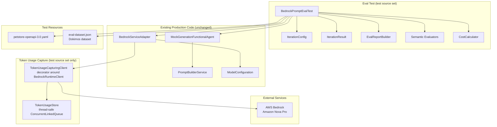

# Design Document: Bedrock Prompt Eval

## Overview

This feature adds a manual, local-only Kotlin integration test that evaluates the quality of MockNest's initial REST `spec-with-description` generation prompt against real AWS Bedrock (Amazon Nova Pro). The test is gated behind the `BEDROCK_EVAL_ENABLED=true` environment variable and is excluded from CI and normal `./gradlew test` runs. It uses the existing `BedrockServiceAdapter` and `MockGenerationFunctionalAgent` with `enableValidation = false` to make exactly one Bedrock call per iteration, runs N iterations (configurable via `BEDROCK_EVAL_ITERATIONS`, default 1), validates semantic correctness of generated mocks using the [Dokimos](https://github.com/dokimos-dev/dokimos) LLM evaluation framework, captures token usage via a lightweight observability hook, and produces a structured eval report with success rates, semantic scores, token usage, and estimated cost.

### Key Design Decisions

1. **Token usage capture via `BedrockRuntimeClient` middleware interceptor**: The Kotlin AWS SDK supports [interceptors](https://docs.aws.amazon.com/sdk-for-kotlin/api/latest/bedrockruntime/aws.sdk.kotlin.services.bedrockruntime/-bedrock-runtime-client/index.html) on the client. However, Koog's `BedrockLLMClient` wraps the `BedrockRuntimeClient` and uses the Converse API internally. Since we cannot intercept inside Koog's abstraction without modifying it, we use a **decorator pattern** around `BedrockRuntimeClient` that intercepts `converse` calls, extracts `TokenUsage` from the `ConverseResponse.usage` field, and stores it in a thread-safe collector. This decorator is injected only in the test — production code is untouched.

2. **Dokimos evaluators — hybrid approach**: We use both **custom programmatic evaluators** (via `BaseEvaluator`) for deterministic structural checks (mock count, endpoint coverage, schema fields, status distinctness) and **LLM-as-a-judge** (via `LLMJudgeEvaluator` with the same Bedrock model) for holistic faithfulness assessment. The programmatic evaluators run first and are cheap; the LLM judge runs only if structural checks pass.

3. **No Spring Boot context**: The eval test manually wires up `BedrockRuntimeClient`, `ModelConfiguration`, `PromptBuilderService`, `BedrockServiceAdapter`, and `MockGenerationFunctionalAgent` without a Spring application context. This keeps the test fast, avoids Spring Boot startup overhead, and avoids needing test-specific Spring profiles for real Bedrock.

4. **Eval report as structured log output**: The report is printed via `KotlinLogging` at INFO level using a bordered, labeled format. No file output or HTML report — just structured console output that's easy to scan in IDE test runners.

5. **Cost estimation model**: Amazon Nova Pro on-demand pricing is $0.0008 per 1K input tokens and $0.0032 per 1K output tokens ([source](https://aws.amazon.com/bedrock/pricing/)). These are stored as constants and used for estimation.

## Architecture



## Components and Interfaces

### 1. TokenUsageRecord (Data Class)

A simple data class capturing token usage from a single Bedrock invocation.

```kotlin
data class TokenUsageRecord(
    val inputTokens: Int = 0,
    val outputTokens: Int = 0,
    val totalTokens: Int = 0
)
```

**Location**: `software/infra/aws/generation/src/test/kotlin/nl/vintik/mocknest/infra/aws/generation/ai/eval/TokenUsageRecord.kt`

### 2. TokenUsageStore (Thread-Safe Collector)

A thread-safe store that accumulates `TokenUsageRecord` instances across invocations. Uses `ConcurrentLinkedQueue` for lock-free thread safety.

```kotlin
class TokenUsageStore {
    private val records = ConcurrentLinkedQueue<TokenUsageRecord>()

    fun record(usage: TokenUsageRecord)
    fun getRecords(): List<TokenUsageRecord>
    fun getTotalInputTokens(): Int
    fun getTotalOutputTokens(): Int
    fun getTotalTokens(): Int
    fun clear()
}
```

**Location**: `software/infra/aws/generation/src/test/kotlin/nl/vintik/mocknest/infra/aws/generation/ai/eval/TokenUsageStore.kt`

### 3. TokenUsageCapturingClient (Decorator)

A decorator around `BedrockRuntimeClient` that intercepts `converse` calls, extracts token usage from the response's `usage` field, and stores it in a `TokenUsageStore`. All other methods delegate directly to the wrapped client.

```kotlin
class TokenUsageCapturingClient(
    private val delegate: BedrockRuntimeClient,
    private val tokenUsageStore: TokenUsageStore
) : BedrockRuntimeClient by delegate {

    override suspend fun <T> converse(
        input: ConverseRequest,
        block: suspend (ConverseResponse) -> T
    ): T {
        return delegate.converse(input) { response ->
            // Extract token usage from response
            val usage = response.usage
            tokenUsageStore.record(
                TokenUsageRecord(
                    inputTokens = usage?.inputTokens ?: 0,
                    outputTokens = usage?.outputTokens ?: 0,
                    totalTokens = usage?.totalTokens ?: 0
                )
            )
            block(response)
        }
    }
}
```

**Location**: `software/infra/aws/generation/src/test/kotlin/nl/vintik/mocknest/infra/aws/generation/ai/eval/TokenUsageCapturingClient.kt`

**Design rationale**: Using Kotlin's `by` delegation, the decorator forwards all `BedrockRuntimeClient` methods to the delegate except `converse`, which it intercepts. All three token usage classes (`TokenUsageRecord`, `TokenUsageStore`, `TokenUsageCapturingClient`) live in the test source set so they never end up in the deployment JAR. Production code is completely untouched.

### 4. CostCalculator (Utility)

A pure function that calculates estimated cost from token usage and pricing constants.

```kotlin
object CostCalculator {
    // Amazon Nova Pro on-demand pricing (USD per token)
    const val NOVA_PRO_INPUT_PRICE_PER_TOKEN = 0.0000008   // $0.0008 per 1K tokens
    const val NOVA_PRO_OUTPUT_PRICE_PER_TOKEN = 0.0000032  // $0.0032 per 1K tokens

    fun calculateCost(
        inputTokens: Int,
        outputTokens: Int,
        inputPricePerToken: Double = NOVA_PRO_INPUT_PRICE_PER_TOKEN,
        outputPricePerToken: Double = NOVA_PRO_OUTPUT_PRICE_PER_TOKEN
    ): Double
}
```

**Location**: `software/infra/aws/generation/src/test/kotlin/nl/vintik/mocknest/infra/aws/generation/ai/eval/CostCalculator.kt`

### 5. IterationResult (Data Class)

Captures the outcome of a single eval iteration.

```kotlin
data class IterationResult(
    val iterationNumber: Int,
    val success: Boolean,
    val mockCount: Int = 0,
    val mockIds: List<String> = emptyList(),
    val endpointPaths: List<String> = emptyList(),
    val errorMessage: String? = null,
    val semanticScore: SemanticScore? = null,
    val tokenUsage: TokenUsageRecord = TokenUsageRecord(),
    val estimatedCost: Double = 0.0
)

data class SemanticScore(
    val petCountCorrect: Boolean,
    val endpointsCovered: Boolean,
    val schemaConsistent: Boolean,
    val statusesDistinct: Boolean,
    val llmJudgeScore: Double? = null,
    val passed: Boolean
)
```

**Location**: `software/infra/aws/generation/src/test/kotlin/nl/vintik/mocknest/infra/aws/generation/ai/eval/IterationResult.kt`

### 6. EvalReportBuilder (Report Formatter)

Builds the structured eval report from a list of `IterationResult` instances.

```kotlin
class EvalReportBuilder {
    fun buildReport(
        modelName: String,
        region: String,
        iterationCount: Int,
        results: List<IterationResult>,
        totalDurationMs: Long,
        totalTokenUsage: TokenUsageRecord,
        totalEstimatedCost: Double
    ): String
}
```

**Location**: `software/infra/aws/generation/src/test/kotlin/nl/vintik/mocknest/infra/aws/generation/ai/eval/EvalReportBuilder.kt`

The report format:

```
╔══════════════════════════════════════════════════════════════╗
║                  BEDROCK PROMPT EVAL REPORT                  ║
║                    (Generation-Only Mode)                    ║
╠══════════════════════════════════════════════════════════════╣
║ Model:            Amazon Nova Pro                            ║
║ Region:           eu-west-1                                  ║
║ Iterations:       10                                         ║
║ Duration:         45230 ms                                   ║
╠══════════════════════════════════════════════════════════════╣
║ Success Rate:     8/10 = 80.0%                               ║
║ Semantic Score:   7/10 = 70.0%                               ║
║ Total Mocks:      32                                         ║
╠══════════════════════════════════════════════════════════════╣
║ Token Usage:                                                 ║
║   Input Tokens:   12500                                      ║
║   Output Tokens:  8400                                       ║
║   Total Tokens:   20900                                      ║
║ Estimated Cost:   $0.0369                                    ║
╠══════════════════════════════════════════════════════════════╣
║ Per-Iteration Breakdown:                                     ║
║  #1  ✓  mocks=4  semantic=✓  in=1250 out=840  $0.0037       ║
║  #2  ✓  mocks=4  semantic=✓  in=1250 out=840  $0.0037       ║
║  #3  ✗  error: Model response parsing failed                 ║
║  ...                                                         ║
╚══════════════════════════════════════════════════════════════╝
```

### 7. Semantic Evaluators (Dokimos Integration)

#### 7a. PetCountEvaluator (Custom BaseEvaluator)

Verifies the number of generated pet entities matches the requested count (4).

```kotlin
class PetCountEvaluator(private val expectedCount: Int) : BaseEvaluator() {
    // Parses mock response bodies, counts distinct pet entities
    // Returns score 1.0 if count matches, 0.0 otherwise
}
```

#### 7b. EndpointCoverageEvaluator (Custom BaseEvaluator)

Verifies that generated WireMock mappings include mocks for the specified endpoints (`GET /pet/{petId}` and `GET /pet/findByStatus`).

```kotlin
class EndpointCoverageEvaluator(
    private val requiredEndpoints: List<String>
) : BaseEvaluator() {
    // Checks mock endpoint paths against required endpoints
    // Returns score 1.0 if all required endpoints are covered, 0.0 otherwise
}
```

#### 7c. SchemaConsistencyEvaluator (Custom BaseEvaluator)

Verifies that pet objects in response bodies contain required fields (id, name, status).

```kotlin
class SchemaConsistencyEvaluator(
    private val requiredFields: List<String>
) : BaseEvaluator() {
    // Parses response bodies, checks for required fields
    // Returns score 1.0 if all mocks have required fields, 0.0 otherwise
}
```

#### 7d. StatusDistinctnessEvaluator (Custom BaseEvaluator)

Verifies that pet statuses in generated mocks are distinct.

```kotlin
class StatusDistinctnessEvaluator : BaseEvaluator() {
    // Extracts status values from pet response bodies
    // Returns score 1.0 if all statuses are distinct, 0.0 otherwise
}
```

#### 7e. FaithfulnessJudge (LLMJudgeEvaluator)

Uses the same Bedrock model as an LLM-as-a-judge to assess overall faithfulness and completeness.

```kotlin
val faithfulnessJudge = llmJudge(judgeLM) {
    name = "Faithfulness"
    criteria = """
        Evaluate whether the generated WireMock mocks are a faithful and complete 
        representation of the requested mock scenario. The request asked for 4 pets 
        with different statuses, mocking GET /pet/{petId} and GET /pet/findByStatus 
        endpoints from the Petstore API. Score 1.0 if the output fully satisfies 
        the request, 0.0 if it does not.
    """
    params(EvalTestCaseParam.INPUT, EvalTestCaseParam.ACTUAL_OUTPUT)
    threshold = 0.7
}
```

**Location**: All evaluators in `software/infra/aws/generation/src/test/kotlin/nl/vintik/mocknest/infra/aws/generation/ai/eval/evaluators/`

### 8. BedrockPromptEvalTest (Main Test Class)

The main eval test class that orchestrates everything.

```kotlin
@Tag("bedrock-eval")
@EnabledIfEnvironmentVariable(named = "BEDROCK_EVAL_ENABLED", matches = "true")
class BedrockPromptEvalTest {

    @ParameterizedTest
    @DatasetSource("classpath:eval/petstore-eval-dataset.json")
    fun `Evaluate Bedrock prompt quality for Petstore spec`(example: Example) {
        // 1. Read iteration count from BEDROCK_EVAL_ITERATIONS (default 1)
        // 2. For each iteration:
        //    a. Build SpecWithDescriptionRequest with enableValidation=false
        //    b. Execute via MockGenerationFunctionalAgent
        //    c. Run semantic evaluators on result
        //    d. Capture token usage and calculate cost
        //    e. Record IterationResult
        // 3. Calculate aggregate success rate and semantic score
        // 4. Build and log EvalReport
        // 5. Assert success rate >= threshold
    }
}
```

**Location**: `software/infra/aws/generation/src/test/kotlin/nl/vintik/mocknest/infra/aws/generation/ai/eval/BedrockPromptEvalTest.kt`

### 9. Gradle Configuration

The eval test is excluded from normal test runs via JUnit tag filtering:

```kotlin
// In software/infra/aws/generation/build.gradle.kts
tasks.test {
    useJUnitPlatform {
        excludeTags("bedrock-eval")
    }
}

// New task for running eval tests explicitly
tasks.register<Test>("bedrockEval") {
    useJUnitPlatform {
        includeTags("bedrock-eval")
    }
}
```

## Data Models

### TokenUsageRecord

| Field | Type | Description |
|-------|------|-------------|
| inputTokens | Int | Number of input tokens consumed |
| outputTokens | Int | Number of output tokens generated |
| totalTokens | Int | Total tokens (input + output) |

### IterationResult

| Field | Type | Description |
|-------|------|-------------|
| iterationNumber | Int | 1-based iteration index |
| success | Boolean | Whether GenerationResult.success was true |
| mockCount | Int | Number of GeneratedMock instances produced |
| mockIds | List\<String\> | IDs of generated mocks |
| endpointPaths | List\<String\> | Endpoint paths from generated mocks |
| errorMessage | String? | Error message if iteration failed |
| semanticScore | SemanticScore? | Semantic evaluation results |
| tokenUsage | TokenUsageRecord | Token usage for this iteration |
| estimatedCost | Double | Estimated cost in USD for this iteration |

### SemanticScore

| Field | Type | Description |
|-------|------|-------------|
| petCountCorrect | Boolean | Whether 4 pets were generated |
| endpointsCovered | Boolean | Whether required endpoints are present |
| schemaConsistent | Boolean | Whether pet objects have required fields |
| statusesDistinct | Boolean | Whether pet statuses are all different |
| llmJudgeScore | Double? | LLM-as-a-judge faithfulness score (0.0-1.0) |
| passed | Boolean | Whether all semantic checks passed |

### Pricing Constants

| Model | Input Price (per token) | Output Price (per token) | Source |
|-------|------------------------|-------------------------|--------|
| Amazon Nova Pro | $0.0000008 | $0.0000032 | [AWS Bedrock Pricing](https://aws.amazon.com/bedrock/pricing/) |

### Petstore Eval Dataset (Dokimos JSON)

```json
[
  {
    "input": "Generate WireMock mocks for 4 pets with different statuses (available, pending, sold, and adopted), mocking the GET /pet/{petId} and GET /pet/findByStatus endpoints from the Petstore API.",
    "expected": "4 WireMock mappings covering GET /pet/{petId} and GET /pet/findByStatus with distinct pet statuses"
  }
]
```

**Location**: `software/infra/aws/generation/src/test/resources/eval/petstore-eval-dataset.json`

## Correctness Properties

*A property is a characteristic or behavior that should hold true across all valid executions of a system — essentially, a formal statement about what the system should do. Properties serve as the bridge between human-readable specifications and machine-verifiable correctness guarantees.*

### Property 1: Iteration result recording preserves GenerationResult data

*For any* `GenerationResult` (whether success or failure, with any number of mocks), converting it to an `IterationResult` SHALL correctly capture the success status, mock count equal to `mocks.size`, and all mock IDs and endpoint paths.

**Validates: Requirements 4.1, 4.2**

### Property 2: Success rate calculation

*For any* list of `IterationResult` instances, the calculated success rate SHALL equal `(count of results where success == true) / (total count) × 100.0`, and the semantic success rate SHALL equal `(count of results where semanticScore?.passed == true) / (total count) × 100.0`.

**Validates: Requirements 4.3, 11.7, 12.7**

### Property 3: Threshold assertion correctness

*For any* success rate (0.0 to 100.0) and threshold (0.0 to 100.0), the threshold assertion SHALL pass if and only if the success rate is greater than or equal to the threshold.

**Validates: Requirements 4.7, 11.8**

### Property 4: Cost calculation correctness

*For any* non-negative integer input token count and non-negative integer output token count, the estimated cost SHALL equal `inputTokens × inputPricePerToken + outputTokens × outputPricePerToken`, and the result SHALL be non-negative.

**Validates: Requirements 6.1**

### Property 5: Eval report completeness

*For any* valid set of eval results (model name, region, iteration count, list of N iteration results, duration, token usage, cost), the formatted report string SHALL contain all required fields: model name, region, iteration count, success rate percentage, total mock count, semantic score percentage, input token count, output token count, total token count, estimated cost, and exactly N per-iteration entries.

**Validates: Requirements 7.2, 7.5**

### Property 6: Iteration count execution

*For any* positive integer N provided as iteration count, the eval executor SHALL produce exactly N `IterationResult` instances, each with a unique `iterationNumber` from 1 to N.

**Validates: Requirements 12.3**

### Property 7: Invalid iteration count validation

*For any* string that is not a positive integer (including negative numbers, zero, non-numeric strings, and empty strings), parsing the iteration count SHALL throw an `IllegalArgumentException` with a descriptive message.

**Validates: Requirements 12.4**

### Property 8: Token usage store thread safety

*For any* sequence of `TokenUsageRecord` instances recorded concurrently from multiple coroutines, the `TokenUsageStore` SHALL eventually contain all recorded instances with no data loss, and `getTotalInputTokens()` SHALL equal the sum of all individual `inputTokens` values.

**Validates: Requirements 5.2**

## Error Handling

### Bedrock API Errors

- **Authentication failure**: If AWS credentials are not configured or expired, the test fails immediately with a descriptive error message. No retry.
- **Throttling / rate limiting**: If Bedrock returns a throttling error during an iteration, that iteration is recorded as failed with the error message. Remaining iterations continue.
- **Model invocation error**: Any Bedrock error during an iteration is caught, logged, and recorded as a failed iteration. The test continues with remaining iterations.

### Generation Pipeline Errors

- **Specification parsing failure**: If the Petstore spec fails to parse, the test fails immediately (this indicates a test setup problem, not a prompt quality issue).
- **Model response parsing failure**: If the model returns unparseable output, the iteration is recorded as failed. This is a valid eval signal — the prompt failed to produce valid output.
- **Empty mock list**: If the model returns valid JSON but zero mocks, the iteration is recorded as failed.

### Token Usage Errors

- **Missing token usage in response**: The `TokenUsageCapturingClient` records `TokenUsageRecord(0, 0, 0)` and logs a warning. The eval continues.
- **Token usage store access**: The store uses `ConcurrentLinkedQueue` which is lock-free and cannot throw on access.

### Configuration Errors

- **Invalid `BEDROCK_EVAL_ITERATIONS`**: The test fails immediately with `IllegalArgumentException` before any Bedrock calls are made.
- **Missing `BEDROCK_EVAL_ENABLED`**: The test is skipped via JUnit's `@EnabledIfEnvironmentVariable` — no error, just a skip message.

### Semantic Evaluation Errors

- **LLM judge failure**: If the Dokimos LLM-as-a-judge call fails (e.g., Bedrock error), the `llmJudgeScore` is recorded as `null` and the semantic score's `passed` field is determined solely by the programmatic evaluators. A warning is logged.
- **Response body parsing failure**: If a mock's response body cannot be parsed as JSON for semantic evaluation, that evaluator returns score 0.0 for that mock.

## Testing Strategy

### Test Categories

#### 1. Unit Tests (Property-Based)

These tests validate the pure logic components using JUnit 6 `@ParameterizedTest` with diverse test data. They run as part of normal `./gradlew test` (no Bedrock calls).

**Components tested**:
- `CostCalculator` — cost calculation correctness (Property 4)
- `EvalReportBuilder` — report completeness and formatting (Property 5)
- `IterationResult` construction from `GenerationResult` (Property 1)
- Success rate calculation logic (Property 2)
- Threshold assertion logic (Property 3)
- Iteration count parsing and validation (Property 7)
- `TokenUsageStore` — thread safety and accumulation (Property 8)

**Property-based testing approach**:
- Use `@ParameterizedTest` with `@MethodSource` providing diverse generated inputs
- 10-20 test cases per property covering edge cases (zero tokens, max int tokens, empty results, all-success, all-failure, mixed results)
- Deterministic examples for easier debugging

#### 2. Unit Tests (Example-Based)

- Semantic evaluator unit tests with known mock JSON inputs
- Report formatting verification with known data
- Gate condition behavior (skip messages)
- Cost formatting to 4 decimal places

#### 3. Integration Test (Manual, Gated)

The `BedrockPromptEvalTest` itself is the integration test. It:
- Makes real Bedrock API calls
- Validates the full generation pipeline end-to-end
- Runs semantic evaluators on real LLM output
- Produces the eval report

This test is **never** run in CI. It requires:
- `BEDROCK_EVAL_ENABLED=true`
- Valid AWS credentials with Bedrock access
- Network access to AWS Bedrock

**Running the eval test**:
```bash
BEDROCK_EVAL_ENABLED=true BEDROCK_EVAL_ITERATIONS=10 ./gradlew :software:infra:aws:generation:bedrockEval
```

### Property-Based Testing Configuration

- **Library**: JUnit 6 `@ParameterizedTest` with `@MethodSource` and `@ValueSource`
- **Minimum iterations**: 10-20 diverse examples per property test
- **Tag format**: `Feature: bedrock-prompt-eval, Property {number}: {property_text}`

### Dokimos Dependencies

```kotlin
// In software/infra/aws/generation/build.gradle.kts
val dokimosVersion = "0.14.2"
testImplementation("dev.dokimos:dokimos-core:$dokimosVersion")
testImplementation("dev.dokimos:dokimos-kotlin:$dokimosVersion")
testImplementation("dev.dokimos:dokimos-junit:$dokimosVersion")
testImplementation("dev.dokimos:dokimos-koog:$dokimosVersion")
```
