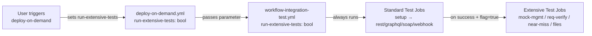
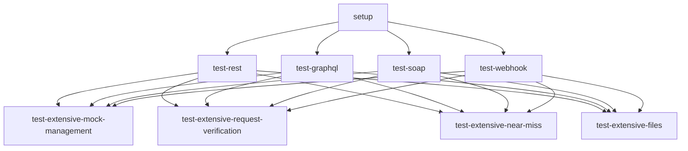

# Design Document: Extensive Post-Deploy Tests

## Overview

This design extends the MockNest Serverless post-deployment integration test infrastructure with an optional `run-extensive-tests` parameter. When enabled, four new parallel test jobs execute AFTER standard tests pass, covering all remaining MockNest APIs from the OpenAPI specification not already tested by the standard suite.

The extensive tests are organized into four groups that map to the OpenAPI spec's tag categories:
- **Mock Management** — CRUD, metadata, save/reset, unmatched mappings
- **Request Verification** — journal listing, find, count, remove, get/delete by ID, metadata removal
- **Near-Miss Analysis** — unmatched near-misses, near-misses for request, near-misses for request pattern
- **File Management** — file CRUD (create, read, list, update, delete)

### API Coverage Gap Analysis

The standard test suite already covers these endpoints:
| Endpoint | Covered By |
|---|---|
| `GET /__admin/health` | setup suite |
| `GET /ai/generation/health` | setup suite |
| `DELETE /__admin/mappings` | setup suite |
| `POST /ai/generation/from-spec` | rest/graphql/soap suites |
| `POST /__admin/mappings/import` | rest/graphql/soap suites |
| `GET /__admin/mappings` | rest suite (verification step) |
| `POST /__admin/mappings` | webhook suite (callback/trigger registration) |
| `GET /mocknest/{path}` | rest suite (mock invocation) |
| `POST /mocknest/{path}` | webhook suite (trigger invocation) |

The extensive tests cover these remaining endpoints:
| Endpoint | Test Group |
|---|---|
| `GET /__admin/mappings/{mappingId}` | mock-management |
| `PUT /__admin/mappings/{mappingId}` | mock-management |
| `DELETE /__admin/mappings/{mappingId}` | mock-management |
| `POST /__admin/mappings/save` | mock-management |
| `POST /__admin/mappings/find-by-metadata` | mock-management |
| `POST /__admin/mappings/remove-by-metadata` | mock-management |
| `GET /__admin/mappings/unmatched` | mock-management |
| `DELETE /__admin/mappings/unmatched` | mock-management |
| `POST /__admin/reset` | mock-management |
| `GET /__admin/requests` | request-verification |
| `POST /__admin/requests/find` | request-verification |
| `POST /__admin/requests/count` | request-verification |
| `GET /__admin/requests/{requestId}` | request-verification |
| `DELETE /__admin/requests/{requestId}` | request-verification |
| `POST /__admin/requests/remove` | request-verification |
| `POST /__admin/requests/remove-by-metadata` | request-verification |
| `GET /__admin/requests/unmatched` | request-verification |
| `DELETE /__admin/requests` | request-verification |
| `POST /__admin/requests/reset` | request-verification |
| `GET /__admin/requests/unmatched/near-misses` | near-miss |
| `POST /__admin/near-misses/request` | near-miss |
| `POST /__admin/near-misses/request-pattern` | near-miss |
| `GET /__admin/files` | files |
| `GET /__admin/files/{fileId}` | files |
| `PUT /__admin/files/{fileId}` | files |
| `DELETE /__admin/files/{fileId}` | files |

## Architecture

### Parameter Flow



The `run-extensive-tests` boolean parameter flows through three layers:

1. **deploy-on-demand.yml** — Adds `run-extensive-tests` as a `workflow_dispatch` boolean input (default: `false`). Passes it to the reusable integration test workflow call.
2. **workflow-integration-test.yml** — Accepts `run-extensive-tests` in both `workflow_call` and `workflow_dispatch` triggers. Uses it to conditionally enable extensive test jobs.
3. **Extensive test jobs** — Four parallel jobs with `needs:` dependencies on ALL standard test jobs plus a conditional `if:` that checks both the parameter value and that all standard jobs succeeded.

### Job Dependency Graph



Each extensive test job:
- Depends on ALL standard test jobs via `needs: [test-rest, test-graphql, test-soap, test-webhook]`
- Uses `if: ${{ inputs.run-extensive-tests == true && !cancelled() && !failure() }}` to only run when the flag is set AND no standard job failed
- Runs independently and in parallel with other extensive jobs
- Can be individually retried via GitHub Actions "Re-run failed jobs"

**Design Rationale**: Using `needs` on all four standard jobs (not just `setup`) ensures extensive tests never run when basic functionality is broken. The `!cancelled() && !failure()` check handles the case where some standard jobs are skipped (e.g., webhook only runs in IAM mode) — skipped jobs should not block extensive tests.

## Components and Interfaces

### 1. deploy-on-demand.yml Changes

Add a new `workflow_dispatch` input:

```yaml
inputs:
  run-extensive-tests:
    description: 'Run extensive API tests after standard tests pass (covers all remaining MockNest APIs)'
    required: false
    default: false
    type: boolean
```

Pass it to the integration test workflow call:

```yaml
integration-tests:
  needs: deploy-on-demand
  uses: ./.github/workflows/workflow-integration-test.yml
  with:
    # ... existing parameters ...
    run-extensive-tests: ${{ inputs.run-extensive-tests }}
```

### 2. workflow-integration-test.yml Changes

#### New Input Parameter

Add `run-extensive-tests` to both trigger types:

```yaml
on:
  workflow_call:
    inputs:
      run-extensive-tests:
        required: false
        type: boolean
        default: false
        description: 'Run extensive API tests after standard tests pass'
  workflow_dispatch:
    inputs:
      run-extensive-tests:
        description: 'Run extensive API tests after standard tests pass'
        required: false
        type: boolean
        default: false
```

#### New Extensive Test Jobs

Four new jobs follow the same pattern as existing test jobs (checkout → configure AWS → resolve credentials → run test script). Each job:

```yaml
test-extensive-mock-management:
  name: Extensive - Mock Management
  runs-on: ubuntu-latest
  needs: [test-rest, test-graphql, test-soap, test-webhook]
  if: ${{ inputs.run-extensive-tests == true && !cancelled() && !failure() }}
  steps:
    - name: Checkout code
      uses: actions/checkout@v6
    - name: Configure AWS credentials
      uses: aws-actions/configure-aws-credentials@v6
      with:
        role-to-assume: arn:aws:iam::${{ secrets.AWS_ACCOUNT_ID }}:role/${{ inputs.github-actions-role-name }}
        aws-region: ${{ inputs.aws-region }}
    - name: Run mock management tests
      run: |
        # Same credential resolution pattern as existing jobs
        STACK_NAME="${{ needs.setup.outputs.stack-name }}"
        AUTH_MODE="${{ needs.setup.outputs.auth-mode }}"
        # ... resolve API_URL, API_KEY ...
        export API_URL API_KEY AUTH_MODE
        chmod +x scripts/post-deploy-test.sh
        ./scripts/post-deploy-test.sh mock-management
```

The same pattern applies to `test-extensive-request-verification`, `test-extensive-near-miss`, and `test-extensive-files`.

**Important**: The `needs` array must include `setup` (for outputs) plus all standard test jobs. Since `test-webhook` has an `if` condition that may cause it to be skipped, the extensive jobs use `!cancelled() && !failure()` rather than the default `success()` to avoid being blocked by skipped jobs.

### 3. Test Script Architecture

#### New Test Suite Arguments

The test script (`scripts/post-deploy-test.sh`) gains five new `case` branches:

| Argument | Runs |
|---|---|
| `mock-management` | `test_mock_management_*` functions |
| `request-verification` | `test_request_verification_*` functions |
| `near-miss` | `test_near_miss_*` functions |
| `files` | `test_file_management_*` functions |
| `extensive` | All four groups sequentially |

#### Test Function Organization

Each test group is a sequence of test functions that share state (e.g., a mapping ID created in one step is used in subsequent steps). Functions within a group run sequentially because they depend on prior state.

```
mock-management group:
  test_mock_management_crud()        → Requirements 5.1-5.7
  test_mock_management_save_reset()  → Requirements 6.1-6.3
  test_mock_management_metadata()    → Requirements 7.1-7.3
  test_mock_management_unmatched()   → Requirements 8.1-8.2
  test_mock_management_cleanup()     → Requirement 13.1

request-verification group:
  test_request_verification_setup()           → Requirement 9.1
  test_request_verification_list_find_count() → Requirements 9.2-9.4
  test_request_verification_get_by_id()       → Requirement 9.5
  test_request_verification_unmatched()       → Requirement 9.6
  test_request_verification_delete_by_id()    → Requirement 9.10
  test_request_verification_remove()          → Requirement 9.7
  test_request_verification_metadata()        → Requirement 10.1
  test_request_verification_clear_reset()     → Requirements 9.8-9.9
  test_request_verification_cleanup()         → Requirement 13.2

near-miss group:
  test_near_miss_setup()              → Requirement 11.1
  test_near_miss_unmatched()          → Requirement 11.2
  test_near_miss_for_request()        → Requirement 11.3
  test_near_miss_for_request_pattern() → Requirement 11.4
  test_near_miss_cleanup()            → Requirement 13.4

files group:
  test_file_management_crud()    → Requirements 12.1-12.7
  test_file_management_cleanup() → Requirement 13.3
```

#### Output Prefixing Convention

All extensive test output is prefixed with the group name for log identification (Requirement 14.3):

```bash
echo "[mock-management] Testing create mapping..."
echo "[mock-management] ✓ Create mapping passed"
```

### 4. Detailed Test Function Designs

#### 4.1 Mock Management CRUD (`test_mock_management_crud`)

```
Step 1: POST /__admin/mappings
  Body: { request: { method: "GET", urlPath: "/extensive-test/mock-mgmt" },
          response: { status: 200, jsonBody: { test: "mock-management" },
                      headers: { "Content-Type": "application/json" } } }
  Assert: HTTP 201
  Extract: MAPPING_ID from response .id field (using grep/sed or python3 -c)

Step 2: GET /__admin/mappings/{MAPPING_ID}
  Assert: HTTP 200
  Assert: response contains urlPath "/extensive-test/mock-mgmt"

Step 3: PUT /__admin/mappings/{MAPPING_ID}
  Body: { id: MAPPING_ID,
          request: { method: "GET", urlPath: "/extensive-test/mock-mgmt-updated" },
          response: { status: 200, jsonBody: { test: "updated" },
                      headers: { "Content-Type": "application/json" } } }
  Assert: HTTP 200

Step 4: GET /__admin/mappings/{MAPPING_ID}
  Assert: HTTP 200
  Assert: response contains urlPath "/extensive-test/mock-mgmt-updated"

Step 5: GET /__admin/mappings
  Assert: HTTP 200
  Assert: response body contains MAPPING_ID

Step 6: DELETE /__admin/mappings/{MAPPING_ID}
  Assert: HTTP 200

Step 7: GET /__admin/mappings/{MAPPING_ID}
  Assert: HTTP 404 (use curl without --fail, check HTTP code manually)
```

**ID Extraction**: Use `python3 -c "import sys,json; print(json.load(sys.stdin)['id'])"` piped from the response body. Python3 is available on ubuntu-latest runners and is already used in the existing webhook test.

#### 4.2 Mock Management Save and Reset (`test_mock_management_save_reset`)

```
Step 1: POST /__admin/mappings
  Body: { request: { method: "GET", urlPath: "/extensive-test/save-reset" },
          response: { status: 200, body: "save-reset-test" },
          persistent: true }
  Assert: HTTP 201

Step 2: POST /__admin/mappings/save
  Assert: HTTP 200

Step 3: POST /__admin/mappings (create a second mapping for reset test)
  Body: { request: { method: "GET", urlPath: "/extensive-test/reset-target" },
          response: { status: 200, body: "reset-target" } }
  Assert: HTTP 201

Step 4: POST /__admin/reset
  Assert: HTTP 200

Step 5: GET /__admin/mappings
  Assert: HTTP 200
  Assert: response contains zero mappings (meta.total == 0 or mappings array is empty)
```

#### 4.3 Mock Management Metadata (`test_mock_management_metadata`)

```
Step 1: POST /__admin/mappings
  Body: { request: { method: "GET", urlPath: "/extensive-test/metadata" },
          response: { status: 200, body: "metadata-test" },
          metadata: { "testGroup": "extensive", "testId": "metadata-1" } }
  Assert: HTTP 201
  Extract: METADATA_MAPPING_ID

Step 2: POST /__admin/mappings/find-by-metadata
  Body: { matchesJsonPath: { expression: "$.testGroup", equalTo: "extensive" } }
  Assert: HTTP 200
  Assert: response contains METADATA_MAPPING_ID

Step 3: POST /__admin/mappings/remove-by-metadata
  Body: { matchesJsonPath: { expression: "$.testGroup", equalTo: "extensive" } }
  Assert: HTTP 200

Step 4: GET /__admin/mappings
  Assert: response does NOT contain METADATA_MAPPING_ID
```

#### 4.4 Mock Management Unmatched (`test_mock_management_unmatched`)

```
Step 1: POST /__admin/mappings (create a mapping that won't be invoked)
  Body: { request: { method: "GET", urlPath: "/extensive-test/unmatched-mapping" },
          response: { status: 200, body: "unmatched" } }
  Assert: HTTP 201

Step 2: GET /__admin/mappings/unmatched
  Assert: HTTP 200
  Assert: response contains a mappings array

Step 3: DELETE /__admin/mappings/unmatched
  Assert: HTTP 200
```

#### 4.5 Request Verification Setup (`test_request_verification_setup`)

```
Step 1: POST /__admin/mappings
  Body: { request: { method: "POST", urlPath: "/extensive-test/req-verify" },
          response: { status: 200, jsonBody: { received: true },
                      headers: { "Content-Type": "application/json" } } }
  Assert: HTTP 201
  Extract: REQ_VERIFY_MAPPING_ID

Step 2: POST /mocknest/extensive-test/req-verify (invoke the mock to generate journal entry)
  Body: { "testData": "request-verification" }
  Assert: HTTP 200
  Sleep 2s (allow journal persistence to S3)
```

#### 4.6 Request Verification List, Find, Count (`test_request_verification_list_find_count`)

```
Step 1: GET /__admin/requests
  Assert: HTTP 200
  Assert: response contains "requests" array with at least 1 entry
  Extract: REQUEST_ID from first matching request (where url contains "req-verify")

Step 2: POST /__admin/requests/find
  Body: { method: "POST", urlPath: "/extensive-test/req-verify" }
  Assert: HTTP 200
  Assert: response contains at least 1 matching request

Step 3: POST /__admin/requests/count
  Body: { method: "POST", urlPath: "/extensive-test/req-verify" }
  Assert: HTTP 200
  Assert: response .count >= 1
```

#### 4.7 Request Verification Get by ID (`test_request_verification_get_by_id`)

```
Step 1: GET /__admin/requests/{REQUEST_ID}
  Assert: HTTP 200
  Assert: response contains url with "req-verify"
```

#### 4.8 Request Verification Unmatched (`test_request_verification_unmatched`)

```
Step 1: GET /__admin/requests/unmatched
  Assert: HTTP 200
  Assert: response contains "requests" array (may be empty, that's OK)
```

#### 4.9 Request Verification Delete by ID (`test_request_verification_delete_by_id`)

This test needs its own journal entry to delete, so it creates one first:

```
Step 1: POST /mocknest/extensive-test/req-verify (invoke mock again)
  Body: { "testData": "delete-by-id-test" }
  Assert: HTTP 200
  Sleep 2s

Step 2: GET /__admin/requests (find the new request ID)
  Extract: DELETE_REQUEST_ID from the most recent matching request

Step 3: DELETE /__admin/requests/{DELETE_REQUEST_ID}
  Assert: HTTP 200
```

#### 4.10 Request Verification Remove (`test_request_verification_remove`)

```
Step 1: POST /mocknest/extensive-test/req-verify (generate another journal entry)
  Body: { "testData": "remove-test" }
  Assert: HTTP 200
  Sleep 2s

Step 2: POST /__admin/requests/remove
  Body: { method: "POST", urlPath: "/extensive-test/req-verify" }
  Assert: HTTP 200
```

#### 4.11 Request Verification Metadata (`test_request_verification_metadata`)

```
Step 1: POST /__admin/requests/remove-by-metadata
  Body: { matchesJsonPath: { expression: "$.testGroup", equalTo: "extensive" } }
  Assert: HTTP 200
```

#### 4.12 Request Verification Clear and Reset (`test_request_verification_clear_reset`)

```
Step 1: DELETE /__admin/requests
  Assert: HTTP 200

Step 2: POST /__admin/requests/reset
  Assert: HTTP 200
```

#### 4.13 Near-Miss Setup (`test_near_miss_setup`)

To generate near-miss data, we create a mapping and then send a request that almost matches but doesn't exactly:

```
Step 1: POST /__admin/mappings
  Body: { request: { method: "GET", urlPath: "/extensive-test/near-miss-target",
                      headers: { "X-Custom": { equalTo: "expected-value" } } },
          response: { status: 200, body: "near-miss-target" } }
  Assert: HTTP 201
  Extract: NEAR_MISS_MAPPING_ID

Step 2: Send a near-miss request (wrong header value, correct path)
  GET /mocknest/extensive-test/near-miss-target
  Header: X-Custom: wrong-value
  (Use curl WITHOUT --fail since this will return 404)
  Assert: HTTP 404 (no exact match)
  Sleep 2s (allow journal persistence)
```

#### 4.14 Near-Miss Unmatched (`test_near_miss_unmatched`)

```
Step 1: GET /__admin/requests/unmatched/near-misses
  Assert: HTTP 200
  Assert: response contains "nearMisses" array
```

#### 4.15 Near-Miss for Request (`test_near_miss_for_request`)

```
Step 1: POST /__admin/near-misses/request
  Body: { url: "/extensive-test/near-miss-target",
          method: "GET",
          headers: { "X-Custom": "wrong-value" } }
  Assert: HTTP 200
```

#### 4.16 Near-Miss for Request Pattern (`test_near_miss_for_request_pattern`)

```
Step 1: POST /__admin/near-misses/request-pattern
  Body: { urlPath: "/extensive-test/near-miss-target",
          method: "GET" }
  Assert: HTTP 200
```

#### 4.17 File Management CRUD (`test_file_management_crud`)

```
FILE_ID="extensive-test-file.json"
FILE_CONTENT='{"test": "file-management", "created": true}'
UPDATED_CONTENT='{"test": "file-management", "updated": true}'

Step 1: PUT /__admin/files/{FILE_ID}
  Content-Type: application/octet-stream
  Body: FILE_CONTENT
  Assert: HTTP 200

Step 2: GET /__admin/files/{FILE_ID}
  Assert: HTTP 200
  Assert: response body contains "created"

Step 3: GET /__admin/files
  Assert: HTTP 200
  Assert: response contains FILE_ID

Step 4: PUT /__admin/files/{FILE_ID}
  Body: UPDATED_CONTENT
  Assert: HTTP 200

Step 5: GET /__admin/files/{FILE_ID}
  Assert: HTTP 200
  Assert: response body contains "updated"

Step 6: DELETE /__admin/files/{FILE_ID}
  Assert: HTTP 200

Step 7: GET /__admin/files/{FILE_ID}
  (Use curl WITHOUT --fail)
  Assert: HTTP 404
```

**Note**: File endpoints use `application/octet-stream` content type for PUT requests, not `application/json`. The curl call for file PUT must override the default Content-Type header.

### 5. Shared Helper Functions

The existing `parse_response` helper and `CURL_OPTS` array are reused by all extensive tests (Requirement 15.3). Two new helpers are added:

#### `assert_http_code`

```bash
# Assert expected HTTP status code, with detailed error reporting (Req 14.1)
# Usage: assert_http_code "GROUP" "METHOD" "ENDPOINT" "$RESPONSE" "EXPECTED_CODE"
assert_http_code() {
  local group="$1" method="$2" endpoint="$3" response="$4" expected="$5"
  parse_response "$response"
  if [ "$HTTP_CODE" != "$expected" ]; then
    echo "[$group] ERROR: $method $endpoint — expected HTTP $expected, got HTTP $HTTP_CODE"
    echo "[$group] Response body: $BODY"
    exit 1
  fi
}
```

#### `extract_json_field`

```bash
# Extract a field from JSON response using python3
# Usage: VALUE=$(echo "$BODY" | extract_json_field ".id")
extract_json_field() {
  local path="$1"
  python3 -c "import sys,json; data=json.load(sys.stdin); print(eval('data' + '$path'.replace('.', \"['\").replace('[', \"['\").rstrip(\"'\") ))" 2>/dev/null || echo ""
}
```

Actually, a simpler approach using python3 for JSON field extraction:

```bash
# Usage: VALUE=$(echo "$JSON" | json_field "id")
json_field() {
  python3 -c "import sys,json; print(json.load(sys.stdin)['$1'])"
}
```

#### `curl_no_fail`

For endpoints where we expect non-2xx responses (404 tests), we need curl without `--fail`:

```bash
# curl without --fail flag, for testing expected error responses
curl_no_fail() {
  local curl_opts_no_fail=("${CURL_OPTS[@]}")
  # Remove --fail from the options
  curl_opts_no_fail=("${curl_opts_no_fail[@]/--fail/}")
  curl "${curl_opts_no_fail[@]}" "$@"
}
```

## Data Models

No new persistent data models are introduced. The extensive tests use the existing MockNest API data structures:

- **StubMapping** — Used for creating/updating mappings in mock-management tests
- **RequestPattern** — Used for find/count/remove operations in request-verification tests
- **LoggedRequest** — Used for near-miss request body in near-miss tests
- **ContentPattern** — Used for metadata-based operations

All test data is ephemeral and cleaned up after each test group completes.

### Test Data Conventions

To avoid conflicts between parallel extensive test jobs, each group uses a unique URL path prefix:

| Test Group | URL Path Prefix |
|---|---|
| mock-management | `/extensive-test/mock-mgmt*` |
| request-verification | `/extensive-test/req-verify` |
| near-miss | `/extensive-test/near-miss-target` |
| files | `extensive-test-file.json` |

Metadata uses `"testGroup": "extensive"` with group-specific `"testId"` values.

## Error Handling

### Per-Request Error Reporting (Requirement 14.1-14.2)

Every HTTP request in the extensive tests follows this pattern:

```bash
local response
response=$(curl "${CURL_OPTS[@]}" \
  --write-out "\n%{http_code}" \
  --request METHOD \
  "$API_URL/endpoint" 2>&1) || {
  echo "[group-name] ERROR: METHOD /endpoint request failed"
  echo "[group-name] Response: $response"
  exit 1
}

assert_http_code "group-name" "METHOD" "/endpoint" "$response" "EXPECTED_CODE"
```

On failure:
1. The test group name is printed as a prefix
2. The HTTP method and endpoint path are reported
3. The expected vs actual status code is shown
4. The response body is printed for debugging
5. The script exits with code 1, failing the GitHub Actions job

### Cleanup-on-Failure Strategy

Each test group has a cleanup function that runs in a trap:

```bash
run_mock_management_tests() {
  # Cleanup function registered via trap
  cleanup_mock_management() {
    echo "[mock-management] Cleaning up test data..."
    # Best-effort cleanup — don't fail if cleanup itself fails
    curl "${CURL_OPTS[@]}" --request DELETE "$API_URL/__admin/mappings" 2>/dev/null || true
  }
  trap cleanup_mock_management EXIT

  # ... run tests ...

  # Explicit cleanup on success
  cleanup_mock_management
  trap - EXIT
}
```

This ensures cleanup runs even if a test fails mid-execution. The cleanup uses `|| true` to avoid masking the original test failure.

### Authentication Mode Handling (Requirement 15)

Extensive tests reuse the existing `CURL_OPTS` array which is configured at script startup based on `AUTH_MODE`. No additional auth handling is needed — the same `CURL_OPTS` that work for standard tests work for extensive tests.

## Testing Strategy

### Why Property-Based Testing Does Not Apply

This feature consists of:
1. **GitHub Actions workflow YAML** — declarative CI/CD configuration
2. **Bash test scripts** — imperative HTTP calls to a deployed external service

There are no pure functions, data transformations, parsers, or serializers. The test scripts themselves ARE the integration tests. PBT is not applicable because:
- Behavior depends on external service state, not input variation
- There is no input space to generate — each test has a fixed sequence of API calls
- Running the same test 100 times would not find more bugs than running it once

### Validation Approach

**Manual validation** is the primary testing strategy:

1. **Workflow syntax validation**: Run `actionlint` or GitHub Actions dry-run to verify YAML syntax
2. **Script syntax validation**: Run `bash -n scripts/post-deploy-test.sh` to check for syntax errors
3. **Local script testing**: Run individual test suites against a deployed stack:
   ```bash
   export API_URL=https://... API_KEY=... AUTH_MODE=API_KEY
   ./scripts/post-deploy-test.sh mock-management
   ./scripts/post-deploy-test.sh request-verification
   ./scripts/post-deploy-test.sh near-miss
   ./scripts/post-deploy-test.sh files
   ```
4. **End-to-end workflow testing**: Trigger deploy-on-demand with `run-extensive-tests: true` and verify all jobs pass
5. **Negative testing**: Verify that `run-extensive-tests: false` (default) skips extensive jobs entirely
6. **Skipped-job handling**: Verify extensive tests still run when webhook job is skipped (API_KEY mode)

### Test Execution Time Estimates

| Test Group | Estimated Duration | Reason |
|---|---|---|
| mock-management | ~10-15s | Multiple CRUD operations, no AI calls |
| request-verification | ~15-20s | Includes mock invocation + journal persistence delays |
| near-miss | ~10-15s | Includes mock invocation + journal persistence delay |
| files | ~10-15s | S3 file operations |
| **Total (parallel)** | **~15-20s** | All four groups run in parallel |

Standard tests take ~60-90s (dominated by AI generation). Extensive tests add minimal overhead since they run in parallel and don't involve AI calls.
