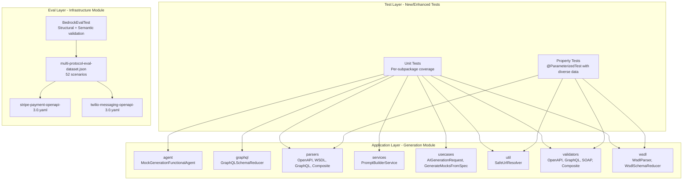

# Design Document: Generation Coverage and Eval

## Overview

This design covers two complementary quality assurance improvements for the MockNest Serverless AI mock generation module:

1. **Unit test coverage expansion** — Systematic addition of unit tests across all generation module subpackages (agent, graphql, parsers, services, usecases, util, validators, wsdl) to reach the project's enforced 90%+ aggregated coverage threshold.

2. **Realistic REST API eval scenarios** — Addition of 6 new eval scenarios based on Stripe Payment Intents API and Twilio Messaging API public specifications, expanding the eval suite from 46 to 52 scenarios across 14 API specifications.

These changes strengthen confidence in generation correctness by verifying internal logic through unit tests and measuring output quality against production-grade API shapes through the eval framework.

## Architecture

The feature operates within the existing clean architecture boundaries without introducing new modules or layers:



### Design Decisions

1. **No new modules** — All unit tests are added within the existing `software/application/src/test/` directory structure. Eval resources go into the existing `software/infra/aws/generation/src/test/resources/eval/` directory.

2. **MockK for isolation** — All unit tests mock external dependencies (Bedrock, network, S3) using MockK with `relaxed = true`, ensuring tests run without infrastructure.

3. **@ParameterizedTest for property coverage** — Following the project's testing strategy, property-like tests use JUnit 6's `@ParameterizedTest` with 10-20 diverse test data files rather than random generation, providing deterministic reproducibility.

4. **Minimal spec subsets** — Stripe and Twilio specifications are minimal faithful subsets (4 endpoints each) rather than full API specs, keeping eval focused and avoiding vendoring large files.

5. **Backward-compatible eval expansion** — New scenarios are appended to the existing `examples` array without modifying existing entries, preserving baseline comparability.

## Components and Interfaces

### Unit Test Components (per subpackage)

| Subpackage | Key Classes Under Test | Test Approach |
|---|---|---|
| `agent` | `MockGenerationFunctionalAgent` | Mock all interfaces (AIModelServiceInterface, SpecificationParserInterface, MockValidatorInterface, PromptBuilderService), verify orchestration flow and error propagation |
| `graphql` | `GraphQLSchemaReducer`, `GraphQLIntrospectionClientInterface` | Parameterized tests with 10+ diverse introspection JSON files, verify extraction completeness |
| `parsers` | `OpenAPISpecificationParser`, `WsdlSpecificationParser`, `GraphQLSpecificationParser`, `CompositeSpecificationParserImpl` | Parameterized tests per format, verify endpoint/schema extraction, delegation logic |
| `services` | `PromptBuilderService` | Verify template loading, placeholder substitution, format-specific routing |
| `usecases` | `AIGenerationRequestUseCase`, `GenerateMocksFromSpecWithDescriptionUseCase` | Mock dependencies, verify use case orchestration |
| `util` | `SafeUrlResolver`, `UrlResolutionException` | WireMock/MockWebServer for HTTP tests, parameterized tests for URL validation |
| `validators` | `OpenAPIMockValidator`, `GraphQLMockValidator`, `SoapMockValidator`, `CompositeMockValidator` | Parameterized valid/invalid mappings per protocol, verify error aggregation |
| `wsdl` | `WsdlParser`, `WsdlSchemaReducer`, `ParsedWsdl` | 3+ diverse WSDL files, verify field extraction, transitive type resolution |

### Eval Components

| Component | Location | Purpose |
|---|---|---|
| Stripe spec subset | `eval/stripe-payment-openapi-3.0.yaml` | OpenAPI 3.0 spec with 4 Stripe Payment Intents endpoints |
| Twilio spec subset | `eval/twilio-messaging-openapi-3.0.yaml` | OpenAPI 3.0 spec with 3 Twilio Messaging endpoints |
| Eval dataset | `eval/multi-protocol-eval-dataset.json` | Extended from 46 to 52 scenarios |
| Eval runner | Existing `BedrockEvalTest` | No modifications needed — reads dataset dynamically |

### Interfaces Used (no new interfaces)

- `AIModelServiceInterface` — Mocked in agent tests
- `SpecificationParserInterface` — Mocked in agent tests, tested directly in parser tests
- `MockValidatorInterface` — Mocked in agent tests, tested directly in validator tests
- `UrlFetcher` — Tested via SafeUrlResolver implementation
- `WsdlParserInterface` — Tested via WsdlParser implementation
- `WsdlSchemaReducerInterface` — Tested via WsdlSchemaReducer implementation
- `GraphQLIntrospectionClientInterface` — Mocked in GraphQL parser tests

## Data Models

### Eval Scenario Schema (existing, no changes)

```json
{
  "input": "string — unique scenario identifier",
  "metadata": {
    "protocol": "REST | GraphQL | SOAP",
    "specFile": "eval/{filename}",
    "format": "OPENAPI_3 | GRAPHQL | WSDL",
    "namespace": "string — eval namespace",
    "description": "string — generation instructions",
    "semanticCheck": "string — LLM judge criteria"
  }
}
```

### Stripe Payment Intent Spec Subset (new file)

Key schemas to define:
- **PaymentIntent** — id (`pi_` prefix), amount, currency, status (enum: requires_payment_method, requires_confirmation, requires_action, processing, succeeded, canceled), customer, latest_charge, payment_method, metadata, created
- **Charge** — id (`ch_` prefix), amount, currency, status, payment_intent, customer, payment_method_details (nested object)
- **Error** — type, code, message, param, charge

### Twilio Message Spec Subset (new file)

Key schemas to define:
- **Message** — sid (`SM` prefix), account_sid (`AC` prefix), from, to, body, status (enum: queued, sending, sent, delivered, undelivered, failed), direction (enum: inbound, outbound-api, outbound-call, outbound-reply), date_created, date_updated, date_sent, price, price_unit, uri, subresource_uris
- **Error** — code (integer), message, more_info (URI), status (HTTP status code)

### Test Data Files (new)

Test data files for parameterized tests will be stored under:
- `software/application/src/test/resources/test-data/graphql/` — 10+ diverse introspection JSON files
- `software/application/src/test/resources/test-data/wsdl/` — 3+ diverse WSDL files
- `software/application/src/test/resources/test-data/openapi/` — diverse OpenAPI specs
- `software/application/src/test/resources/test-data/validators/` — valid and invalid mapping JSON per protocol

## Correctness Properties

*A property is a characteristic or behavior that should hold true across all valid executions of a system — essentially, a formal statement about what the system should do. Properties serve as the bridge between human-readable specifications and machine-verifiable correctness guarantees.*

### Property 1: Fetch content preservation (round-trip)

*For any* valid HTTP URL serving a response body of up to 10 MB, the SafeUrlResolver `fetch` method SHALL return a String whose content is byte-for-byte equal to the response body served by the endpoint.

**Validates: Requirements 1.1**

### Property 2: Non-2xx error code propagation

*For any* HTTP response code outside the 200–299 range, SafeUrlResolver SHALL throw a UrlResolutionException whose message contains the numeric status code as a substring.

**Validates: Requirements 1.2**

### Property 3: Sensitive parameter redaction

*For any* URL containing query parameters whose key matches a sensitive pattern (token, key, secret, auth, sig, password, credential, or x-amz- prefix), `sanitizeUrlForLogging` SHALL return a URL where those parameter values are replaced with `<redacted>` and all non-sensitive parameters are preserved unchanged.

**Validates: Requirements 1.8, 6.3**

### Property 4: Invalid URL rejection without network access

*For any* URL string with an unsupported scheme (not http/https), a missing host, or malformed URI syntax, SafeUrlResolver SHALL throw a UrlResolutionException without making any network connection.

**Validates: Requirements 1.9**

### Property 5: Unsafe address detection

*For any* URL that resolves to a private, loopback, link-local, multicast, CGNAT (100.64.0.0/10), or IPv6 ULA (fc00::/7) address, SafeUrlResolver SHALL throw a UrlResolutionException whose message contains "unsafe address" without making an HTTP connection.

**Validates: Requirements 1.12, 6.4**

### Property 6: Agent failure propagation within retry bound

*For any* AI model response that is unparseable or any specification parser exception, the mock generation agent SHALL propagate the failure as a GenerationResult.failure without retrying beyond the configured maxRetries bound.

**Validates: Requirements 2.4**

### Property 7: GraphQL schema extraction completeness

*For any* valid GraphQL introspection response, the GraphQLSchemaReducer SHALL extract all non-built-in OBJECT fields from queryType as queries, all non-built-in OBJECT fields from mutationType as mutations, all non-built-in OBJECT and INPUT_OBJECT types into the types map, and all non-built-in ENUM types into the enums map.

**Validates: Requirements 3.2**

### Property 8: GraphQL type reference resolution

*For any* valid GraphQL introspection response containing nested types, list types (`[Type]`), non-null modifiers (`Type!`), and input objects, the GraphQLSchemaReducer SHALL correctly resolve all type references in operation arguments and field types.

**Validates: Requirements 3.4**

### Property 9: Parser extraction completeness

*For any* valid API specification (OpenAPI 3.0, Swagger 2.0, WSDL, or GraphQL introspection), the corresponding specification parser SHALL return an APISpecification containing one endpoint per path-method combination (REST), one endpoint per operation (WSDL/GraphQL), and schemas matching each declared type.

**Validates: Requirements 4.2, 4.3, 4.4**

### Property 10: Prompt template placeholder substitution completeness

*For any* valid APISpecification, description string, and MockNamespace, the PromptBuilderService SHALL return a prompt string containing no unreplaced template placeholders (no `{{` or `}}` sequences remain).

**Validates: Requirements 5.2**

### Property 11: Format-specific prompt content selection

*For any* supported SpecificationFormat (OPENAPI_3, SWAGGER_2, GRAPHQL, WSDL), the PromptBuilderService SHALL load the format-specific prompt template and produce output containing format-distinguishing content.

**Validates: Requirements 5.4**

### Property 12: Valid mock mappings pass validation

*For any* valid WireMock mapping JSON conforming to the protocol specification (REST, GraphQL, or SOAP), the corresponding validator SHALL return a validation result with zero errors.

**Validates: Requirements 7.2**

### Property 13: Invalid mock mappings produce specific errors

*For any* invalid WireMock mapping JSON, the corresponding validator SHALL return a validation result containing at least one error that identifies the specific validation rule violated.

**Validates: Requirements 7.3**

### Property 14: Composite validator error aggregation

*For any* set of registered validators where some return errors and some throw exceptions, the CompositeMockValidator SHALL aggregate errors from all validators into a single result, and an exception thrown by one validator SHALL NOT prevent other validators from executing.

**Validates: Requirements 7.5**

### Property 15: WSDL field extraction completeness

*For any* valid WSDL 1.1 document with SOAP 1.2 bindings, the WsdlParser SHALL return a ParsedWsdl containing the expected serviceName, targetNamespace, soapVersion, at least one operation with non-blank name and soapAction, at least one message entry, and at least one xsdType entry.

**Validates: Requirements 8.2**

### Property 16: WSDL transitive type inclusion and exclusion

*For any* WSDL document containing complex types with nested references, the WsdlSchemaReducer SHALL include all transitively referenced types reachable from operation inputs/outputs and SHALL exclude types not reachable from any operation.

**Validates: Requirements 8.3**

## Error Handling

### Unit Test Error Scenarios

| Component | Error Condition | Expected Behavior |
|---|---|---|
| SafeUrlResolver | SocketTimeoutException | Wraps in UrlResolutionException with "Timeout" message |
| SafeUrlResolver | UnknownHostException | Wraps in UrlResolutionException with "Cannot resolve host" |
| SafeUrlResolver | ConnectException | Wraps in UrlResolutionException with "Connection refused" |
| SafeUrlResolver | SSLException | Wraps in UrlResolutionException with "SSL/TLS error" |
| SafeUrlResolver | IOException | Wraps in UrlResolutionException with "Network error" |
| SafeUrlResolver | Response > 10MB | Throws UrlResolutionException with size exceeded message |
| SafeUrlResolver | 3xx redirect | Throws UrlResolutionException with 3xx status code (no redirect following) |
| GraphQLSchemaReducer | Invalid JSON | Throws GraphQLSchemaParsingException |
| GraphQLSchemaReducer | Missing `data.__schema` | Throws GraphQLSchemaParsingException |
| WsdlParser | Malformed XML | Throws WsdlParsingException within 2 seconds |
| WsdlParser | Missing required elements | Throws WsdlParsingException |
| CompositeSpecificationParser | Unsupported format | Throws IllegalArgumentException |
| PromptBuilderService | Missing template resource | Throws IllegalStateException |
| MockGenerationFunctionalAgent | Unparseable AI response | Returns GenerationResult.failure |
| CompositeMockValidator | Validator throws exception | Catches exception, continues with remaining validators |

### Eval Error Scenarios

| Scenario | Error Condition | Expected Behavior |
|---|---|---|
| Stripe card declined | Payment failure | HTTP 402 with error object containing type, code, message |
| Twilio invalid number | Invalid phone number | HTTP 4xx with error object containing status, message, code, more_info |
| Missing specFile | Referenced file not on classpath | Eval suite reports validation failure within 5 seconds |

## Testing Strategy

### Unit Testing Approach

**Framework**: JUnit 6 + MockK + kotlinx-coroutines-test

**Test naming**: Given-When-Then convention with backtick method names

**Mocking strategy**: 
- `relaxed = true` for all mocks by default
- `clearMocks(...)` with specific instances in `@AfterEach`
- `coEvery`/`coVerify` for suspend functions

**Coverage target**: 90%+ line coverage per generation subpackage, enforced via `./gradlew koverVerify`

### Property-Based Testing Approach

**Framework**: JUnit 6 `@ParameterizedTest` with `@ValueSource` and `@MethodSource`

**Strategy**: Deterministic diverse examples (10-20 test data files per property) rather than random generation, following the project's established pattern.

**Test data organization**:
```
src/test/resources/test-data/
├── graphql/          # 10+ introspection JSON files
├── wsdl/             # 3+ diverse WSDL files  
├── openapi/          # Diverse OpenAPI specs
└── validators/       # Valid/invalid mappings per protocol
```

**Property test configuration**:
- Each property test uses `@ParameterizedTest` with 10+ diverse inputs
- Each test references its design document property via comment tag
- Tag format: `Feature: generation-coverage-and-eval, Property {number}: {title}`

### Eval Testing Approach

**Framework**: Existing `BedrockEvalTest` infrastructure (no modifications needed)

**New scenarios**: 6 total (3 Stripe + 3 Twilio) appended to `multi-protocol-eval-dataset.json`

**Spec subsets**: Minimal OpenAPI 3.0 documents with 3-4 endpoints each, stored in `eval/` resources

**Validation**: Structural validation via existing validators + LLM-as-a-judge semantic checks

**Cost**: ~$0.02-$0.04 additional per full suite run (6 new scenarios × $0.004-$0.007 each)

### Coverage Verification

Final verification step:
1. `./gradlew clean test` — All tests compile and pass
2. `./gradlew koverVerify` — Exit code 0 confirms 90%+ threshold met
3. `./gradlew koverHtmlReport` — Visual confirmation of per-subpackage coverage

**Coverage exclusions** (if needed): Lambda entry points and SnapStart priming hooks that cannot execute outside the Lambda environment may be excluded in `kover.reports.total.filters.excludes.classes` with inline comments explaining the reason.
