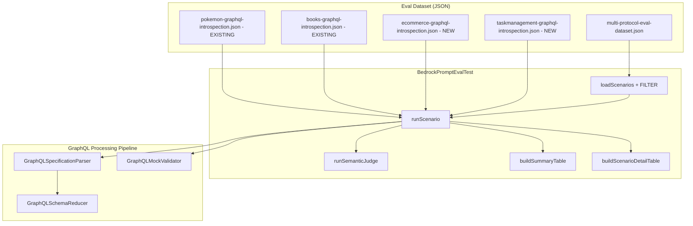

# Design Document: GraphQL Eval Test Expansion

## Overview

This feature expands the Bedrock prompt evaluation test suite with comprehensive GraphQL scenarios to measure prompt quality across diverse introspection schema shapes and prompt complexity levels. Currently, the multi-protocol dataset contains only 2 GraphQL scenarios (`graphql-pokemon-pikachu` using `pokemon-graphql-introspection.json` and `graphql-books-two-books` using `books-graphql-introspection.json`), both of which use query-only schemas with no mutations, no enums, no input types, and no complex nested structures. This does not exercise the prompt against realistic GraphQL patterns.

The expansion adds:
- 2 new synthetic GraphQL introspection schema files (e-commerce, task-management)
- 12 new GraphQL scenarios in the multi-protocol dataset across 6 complexity levels
- GraphQL prompt improvements if eval results reveal weaknesses (conditional)
- Updated `docs/PROMPT_EVAL.md` documentation

All changes are test-only — no production code is modified unless the GraphQL prompt needs improvement. The existing Pokemon and Books GraphQL scenarios remain unchanged. Existing REST and SOAP scenarios are unaffected.

## Architecture

The feature extends the existing eval infrastructure without changing its fundamental architecture. It follows the same pattern established by the REST and SOAP eval expansions.



### Design Decisions

1. **Two domain-diverse introspection schemas**: E-commerce (products, orders, customers with mutations, enums, input types, nested types) and Task Management (projects, tasks, users with nested types, enums, mutations). Each exercises GraphQL patterns that the existing Pokemon and Books schemas do not cover — specifically mutations, enums, INPUT_OBJECT types, and deeply nested object types.

2. **Two new schemas instead of three**: The existing 2 schemas (Pokemon, Books) already cover simple query-only patterns. Two new schemas with richer features (mutations, enums, input types) provide sufficient diversity to reach 14 total scenarios across 4 schemas without unnecessary complexity. The e-commerce schema alone has 8+ operations, providing ample surface area for multiple scenario types.

3. **GraphQL mocks use POST method with operationName matching**: Unlike SOAP (which uses SOAPAction in Content-Type), GraphQL mocks use `bodyPatterns` with `matchesJsonPath` on `operationName` to differentiate operations. All operations share the same `urlPath` (`/namespace/graphql`). The `jsonBody` response wraps data in a `data` key. This is the existing pattern used by the Pokemon and Books scenarios.

4. **CONTEXT preamble in semanticCheck**: Following the pattern established by the SOAP expansion, all new GraphQL scenarios include a CONTEXT preamble explaining the output format (JSON array of WireMock stubs with GraphQL-specific structure: POST method, urlPath to /namespace/graphql, bodyPatterns with matchesJsonPath on operationName, jsonBody with data wrapper).

5. **Reuse existing infrastructure**: No new validators, parsers, or test infrastructure needed. The existing `GraphQLSpecificationParser`, `GraphQLSchemaReducer`, and `GraphQLMockValidator` handle the new introspection schemas. The existing `BedrockPromptEvalTest` loads and runs GraphQL scenarios via the same dataset JSON schema.

6. **Conditional prompt improvement**: The GraphQL prompt is only modified if eval results show a first-pass valid rate below 70%. This avoids unnecessary changes to a working prompt.

## Components and Interfaces

### New GraphQL Introspection Schema Files

Two new synthetic introspection schemas placed in `src/test/resources/eval/`:

| File | Domain | Queries | Mutations | Key Characteristics |
|------|--------|---------|-----------|---------------------|
| `ecommerce-graphql-introspection.json` | E-commerce | 4 | 4 | ENUM types (OrderStatus: PENDING, SHIPPED, DELIVERED, CANCELLED; ProductCategory: ELECTRONICS, CLOTHING, FOOD, HOME, SPORTS), INPUT_OBJECT types (CreateProductInput, CreateOrderInput), nested types (Order → Customer → Address, Order → OrderItem → Product), multi-field types (Product with 7+ fields), cross-entity relationships (order.customerId matches customer.id) |
| `taskmanagement-graphql-introspection.json` | Task Management | 4 | 3 | ENUM types (TaskStatus: TODO, IN_PROGRESS, IN_REVIEW, DONE; TaskPriority: LOW, MEDIUM, HIGH, CRITICAL), INPUT_OBJECT types (CreateTaskInput), nested types (Task → User, Project → Task[]), multi-field types (Task with 8+ fields), cross-entity relationships (task.assigneeId matches user.id, task.projectId matches project.id) |

Combined with the existing schemas, this gives 4 distinct GraphQL APIs covering:
- Simple query-only with nested types (Pokemon) — 2 queries, no mutations, no enums
- Simple query-only with author relationship (Books) — 3 queries, no mutations, no enums
- Full e-commerce domain (E-commerce) — 4 queries + 4 mutations, 2 enums, 2 input types, deep nesting
- Project tracking domain (Task Management) — 4 queries + 3 mutations, 2 enums, 1 input type, cross-entity

### Introspection Schema Design Specifications

#### ecommerce-graphql-introspection.json

- **Queries**: `products` (returns [Product!]!, args: category: ProductCategory, limit: Int), `product` (returns Product, args: id: ID!), `orders` (returns [Order!]!, args: status: OrderStatus, customerId: ID), `customer` (returns Customer, args: id: ID!)
- **Mutations**: `createProduct` (returns Product!, args: input: CreateProductInput!), `createOrder` (returns Order!, args: input: CreateOrderInput!), `updateOrderStatus` (returns Order!, args: orderId: ID!, status: OrderStatus!), `deleteProduct` (returns Boolean!, args: id: ID!)
- **Object Types**:
  - `Product` (id: ID!, name: String!, description: String, price: Float!, category: ProductCategory!, inStock: Boolean!, imageUrl: String)
  - `Order` (id: ID!, customer: Customer!, items: [OrderItem!]!, totalAmount: Float!, status: OrderStatus!, createdAt: String!, shippingAddress: Address)
  - `OrderItem` (product: Product!, quantity: Int!, unitPrice: Float!)
  - `Customer` (id: ID!, name: String!, email: String!, address: Address, orders: [Order!]!)
  - `Address` (street: String!, city: String!, country: String!, postalCode: String!)
- **Enums**: `OrderStatus` (PENDING, SHIPPED, DELIVERED, CANCELLED), `ProductCategory` (ELECTRONICS, CLOTHING, FOOD, HOME, SPORTS)
- **Input Types**: `CreateProductInput` (name: String!, description: String, price: Float!, category: ProductCategory!, inStock: Boolean), `CreateOrderInput` (customerId: ID!, items: [OrderItemInput!]!, shippingAddress: AddressInput)
- **Total operations**: 8 (4 queries + 4 mutations)

#### taskmanagement-graphql-introspection.json

- **Queries**: `projects` (returns [Project!]!), `project` (returns Project, args: id: ID!), `tasks` (returns [Task!]!, args: projectId: ID, status: TaskStatus, assigneeId: ID), `users` (returns [User!]!)
- **Mutations**: `createTask` (returns Task!, args: input: CreateTaskInput!), `updateTaskStatus` (returns Task!, args: taskId: ID!, status: TaskStatus!), `assignTask` (returns Task!, args: taskId: ID!, assigneeId: ID!)
- **Object Types**:
  - `Project` (id: ID!, name: String!, description: String, tasks: [Task!]!, owner: User!, createdAt: String!)
  - `Task` (id: ID!, title: String!, description: String, status: TaskStatus!, priority: TaskPriority!, assignee: User, project: Project!, createdAt: String!, dueDate: String)
  - `User` (id: ID!, name: String!, email: String!, role: String!, tasks: [Task!]!)
- **Enums**: `TaskStatus` (TODO, IN_PROGRESS, IN_REVIEW, DONE), `TaskPriority` (LOW, MEDIUM, HIGH, CRITICAL)
- **Input Types**: `CreateTaskInput` (title: String!, description: String, projectId: ID!, priority: TaskPriority, assigneeId: ID)
- **Total operations**: 7 (4 queries + 3 mutations)

### New GraphQL Scenarios in Dataset

12 new scenarios across 6 complexity levels, distributed across all 4 schemas (existing + new):

| # | Scenario Input | API | Complexity | Description |
|---|---------------|-----|------------|-------------|
| 1 | `graphql-ecommerce-basic-queries` | E-commerce | Basic | Generate mocks for the products and product queries with sample product data |
| 2 | `graphql-ecommerce-basic-mutations` | E-commerce | Basic | Generate mocks for createProduct and createOrder mutations |
| 3 | `graphql-taskmanagement-basic-all` | Task Management | Basic | Generate mocks for projects, tasks, and users queries |
| 4 | `graphql-ecommerce-filtered-orders` | E-commerce | Filtered | Generate mocks only for order-related operations (orders query, createOrder, updateOrderStatus), not product or customer operations |
| 5 | `graphql-ecommerce-error-notfound` | E-commerce | Error | Generate GraphQL error responses for product not found and order not found |
| 6 | `graphql-ecommerce-realistic-data` | E-commerce | Realistic Data | Generate mocks with realistic European product names, EUR prices, and European customer names/addresses |
| 7 | `graphql-taskmanagement-realistic-data` | Task Management | Realistic Data | Generate mocks with realistic project names, task descriptions, and developer names |
| 8 | `graphql-ecommerce-consistency` | E-commerce | Consistency | Generate mocks where the order's customerId matches the customer query response id, and order items reference valid product ids |
| 9 | `graphql-taskmanagement-consistency` | Task Management | Consistency | Generate mocks where the task's assigneeId matches a user id from the users query, and task's projectId matches a project id |
| 10 | `graphql-ecommerce-edge-mutation-input` | E-commerce | Edge Case | Generate mocks for createProduct mutation with INPUT_OBJECT argument and enum category field, verifying the response includes all created product fields |
| 11 | `graphql-taskmanagement-edge-enum-filter` | Task Management | Edge Case | Generate mocks for tasks query filtered by TaskStatus enum and a createTask mutation with TaskPriority enum |
| 12 | `graphql-pokemon-basic-list` | Pokemon | Basic | Generate a mock for the pokemons query returning a list of 5 Pokemon with pagination (limit 5, offset 0) |

Each scenario includes a precise `semanticCheck` with:
- A CONTEXT preamble explaining the output format (JSON array of WireMock stub mappings with GraphQL-specific structure)
- Concrete, verifiable criteria (exact operation names, expected response field names, expected data values, expected enum values)
- No vague phrases

### Semantic Check Design

All new GraphQL scenario semanticCheck fields follow this structure:

```
CONTEXT: The output is a JSON array of WireMock stub mappings. Each mapping has 'request' (with method POST, urlPath to /namespace/graphql, and bodyPatterns with matchesJsonPath on operationName) and 'response' (with jsonBody containing a GraphQL response with 'data' wrapper for success or 'errors' array for errors). All operations share the same urlPath endpoint and are differentiated by operationName in bodyPatterns.

Strictly verify: 1) [specific operation checks] 2) [structural checks] 3) [domain-specific checks]. Score 0 if [critical failure condition].
```

### Existing Components (Unchanged)

- **GraphQLSpecificationParser**: Parses introspection JSON into `APISpecification` via `GraphQLSchemaReducer`. Already handles queries, mutations, enums, input types, and nested object types. No changes needed.
- **GraphQLSchemaReducer**: Reduces raw introspection JSON into `CompactGraphQLSchema` with queries, mutations, types (OBJECT and INPUT_OBJECT), and enums. Already handles all GraphQL type kinds needed. No changes needed.
- **GraphQLMockValidator**: Validates generated mocks against the schema — checks POST method, urlPath, GraphQL response format (data/errors), scalar type enforcement, required field presence, and enum value validation. No changes needed.
- **BedrockPromptEvalTest**: Loads scenarios from dataset JSON, runs generation pipeline, validates, and judges. Already supports GraphQL protocol. No changes needed.
- **GraphQL prompt** (`prompts/graphql/spec-with-description.txt`): May be updated if eval results show weaknesses, but no changes planned upfront.

## Data Models

### Multi-Protocol Dataset Schema (unchanged)

The existing JSON schema is preserved. New GraphQL scenarios use the same structure:

```json
{
  "input": "graphql-ecommerce-basic-queries",
  "metadata": {
    "protocol": "GraphQL",
    "specFile": "eval/ecommerce-graphql-introspection.json",
    "format": "GRAPHQL",
    "namespace": "ecommerce-eval",
    "description": "Generate mocks for the products and product queries...",
    "semanticCheck": "CONTEXT: The output is a JSON array of WireMock stub mappings..."
  }
}
```

No schema changes needed. The existing `loadScenarios()` and `createAgentForProtocol()` already handle GraphQL protocol scenarios.

### Introspection Schema Design Principles

Each synthetic introspection schema follows these design principles:
- Valid GraphQL introspection JSON in the standard `{ "data": { "__schema": { ... } } }` format (parseable by `GraphQLSchemaReducer`)
- Includes `queryType` with name "Query" and `mutationType` with name "Mutation" (where applicable)
- All types use standard introspection format with `kind`, `name`, `description`, `fields`/`inputFields`/`enumValues`, and `type` references using `kind`/`name`/`ofType` nesting
- Uses `NON_NULL` wrapper for required fields (e.g., `{ "kind": "NON_NULL", "name": null, "ofType": { "kind": "SCALAR", "name": "String", "ofType": null } }`)
- Uses `LIST` wrapper for array fields (e.g., `{ "kind": "LIST", "name": null, "ofType": { ... } }`)
- Skips introspection metadata types (types starting with `__`) — these are filtered by `GraphQLSchemaReducer`
- Includes `ENUM` types with `enumValues` array containing `name` fields
- Includes `INPUT_OBJECT` types with `inputFields` array (not `fields`)
- Each type has realistic field names and descriptions matching the domain

### Enum Handling

The `GraphQLSchemaReducer` already extracts `ENUM` types from introspection JSON into the `CompactGraphQLSchema.enums` map. The `GraphQLMockValidator` validates enum values in responses against the schema-defined values. The `GraphQLSpecificationParser` converts enums to `JsonSchema` with `enum` values list. This means:
1. Enum types in the introspection schema are fully supported by the existing pipeline
2. The prompt sees enum values in the compact schema representation
3. The validator enforces that response data uses valid enum values

### INPUT_OBJECT Handling

The `GraphQLSchemaReducer` extracts `INPUT_OBJECT` types via `extractInputType()` which reads `inputFields` (not `fields`). These are stored in the `CompactGraphQLSchema.types` map alongside regular object types. The `GraphQLSpecificationParser` converts them to `JsonSchema` for request body validation. This means:
1. Input types in the introspection schema are fully supported
2. Mutations with input type arguments are correctly parsed and represented
3. The validator can check that mutation request bodies match input type schemas

## Correctness Properties

*A property is a characteristic or behavior that should hold true across all valid executions of a system — essentially, a formal statement about what the system should do. Properties serve as the bridge between human-readable specifications and machine-verifiable correctness guarantees.*

### Property 1: Introspection schema parsing and reduction validity

*For any* GraphQL introspection schema file in the `eval/` test resources directory, parsing it with `GraphQLSchemaReducer` shall succeed without throwing an exception, and the resulting `CompactGraphQLSchema` shall have a non-empty queries or mutations list and correctly extracted types and enums.

**Validates: Requirements 1.8, 1.9**

### Property 2: GraphQL scenario metadata validity

*For any* GraphQL scenario in the multi-protocol eval dataset, the scenario shall have `protocol` equal to `"GraphQL"`, `format` equal to `"GRAPHQL"`, and a `specFile` path that resolves to an existing classpath resource in the eval directory.

**Validates: Requirements 2.2**

### Property 3: Semantic check quality

*For any* GraphQL scenario in the multi-protocol eval dataset, the `semanticCheck` field shall contain at least one concrete, verifiable element (an operation name, a response field name, a data value, or an enum value) and shall not contain vague phrases such as "looks correct", "reasonable output", or "seems right".

**Validates: Requirements 4.1, 4.2**

### Property 4: Semantic check CONTEXT preamble

*For any* new GraphQL scenario in the multi-protocol eval dataset (excluding the pre-existing Pokemon and Books scenarios), the `semanticCheck` field shall include a CONTEXT preamble explaining that the output is a JSON array of WireMock stub mappings with GraphQL-specific structure.

**Validates: Requirements 4.6**

## Error Handling

### Introspection Schema Parsing Failures

If a new introspection schema file has a structural issue that causes `GraphQLSchemaReducer` to throw `GraphQLSchemaParsingException`, the eval scenario will fail at the generation phase. This is caught by the existing error handling in `runScenario()` and reported as a generation failure in the detail table.

### Spec File Not Found

If a scenario references a `specFile` that doesn't exist on the classpath, `loadSpecContent()` already throws with a descriptive message. New scenarios must reference valid spec files that exist in the eval directory.

### GraphQLMockValidator with New Schemas

The `GraphQLMockValidator` validates against the `APISpecification` produced by the GraphQL parsing pipeline. If a new schema produces an `APISpecification` with unexpected operation names or type structures, validation will fail and the correction retry will attempt to fix the generated mocks. This is the expected behavior — it measures prompt quality.

### Prompt Improvement Scope

If the GraphQL prompt needs improvement based on eval results, changes are limited to `software/application/src/main/resources/prompts/graphql/spec-with-description.txt`. The existing Pokemon and Books scenarios must continue to pass after any prompt change. If a prompt change helps new scenarios but breaks existing ones, the change is rejected.

## Testing Strategy

### Unit Tests (Structural Validation)

Unit tests verify the new introspection schema files and dataset entries without calling Bedrock:

1. **Introspection schema parsing validity** — Parse each new introspection schema file with `GraphQLSchemaReducer` and verify no exception is thrown, queries or mutations list is non-empty, and types/enums are extracted. Use `@ParameterizedTest` with `@ValueSource` across all introspection schema files.

2. **Introspection schema structural requirements** — Verify at least one schema has mutations, at least one has enums, at least one has INPUT_OBJECT types, at least one has nested object types, at least one has 6+ operations, and at least one has multi-field types (5+ fields).

3. **Dataset structural validation** — Load the dataset JSON and verify:
   - At least 12 new GraphQL scenarios exist (beyond the existing 2)
   - Each new introspection schema is referenced by at least one scenario
   - All GraphQL scenarios have protocol "GraphQL", format "GRAPHQL", and valid specFile paths
   - Complexity level distribution meets requirements (3+ Basic, 1+ Filtered, 1+ Error, 1+ Realistic, 1+ Consistency, 1+ Edge Case)

4. **Semantic check quality** — Verify all new GraphQL scenario semanticCheck fields:
   - Contain a CONTEXT preamble
   - Contain concrete verifiable criteria (operation names, field names, etc.)
   - Do not contain vague phrases

5. **Backward compatibility** — Verify the existing Pokemon and Books scenarios are unchanged in the dataset.

### Property-Based Tests

Property-based tests use `@ParameterizedTest` with all introspection schema files and all GraphQL scenarios:

- **Introspection schema parsing + reduction**: All 4 introspection schema files (Pokemon + Books + 2 new) parsed and reduced successfully
- **Scenario metadata validity**: All GraphQL scenarios have correct protocol/format/specFile
- **Semantic check quality**: All GraphQL scenarios have concrete criteria and no vague phrases
- **CONTEXT preamble**: All new GraphQL scenarios have CONTEXT preamble in semanticCheck

Each property test runs across all applicable test data (4 introspection schemas, 14 GraphQL scenarios).

**Property test configuration:**
- Minimum iterations: All applicable items (4 schemas, 14 scenarios)
- Tag format: **Feature: graphql-eval-test-expansion, Property {number}: {property_text}**
- Use JUnit 6 `@ParameterizedTest` with `@ValueSource` for introspection schema file names
- Use `@MethodSource` for scenario-based tests

### Integration Tests

Integration-level verification happens during actual eval runs (requires `BEDROCK_EVAL_ENABLED=true`):

- GraphQL scenarios produce valid mocks and pass semantic checks
- Summary table shows GraphQL row with updated scenario count (14 total: 2 existing + 12 new)
- Detail table shows per-scenario breakdown for all GraphQL scenarios
- `BEDROCK_EVAL_FILTER=graphql` runs only GraphQL scenarios
- GraphQLMockValidator validates generated mocks from new schemas using the same validation rules (POST method, urlPath, GraphQL response format, scalar type enforcement, required fields, enum values)

These require Bedrock access and incur cost. Run manually during prompt tuning.

### What Is NOT Tested with PBT

- Documentation content (PROMPT_EVAL.md updates) — manual review
- Actual Bedrock generation quality — integration test requiring live Bedrock access
- Prompt improvement effectiveness — before/after eval comparison
- Visual formatting of summary/detail tables — already tested by REST expansion
