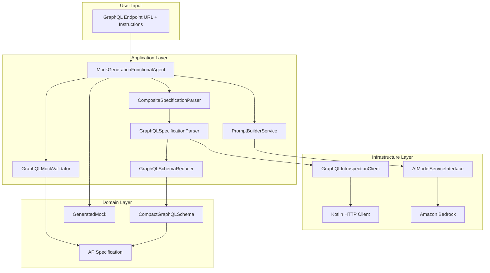
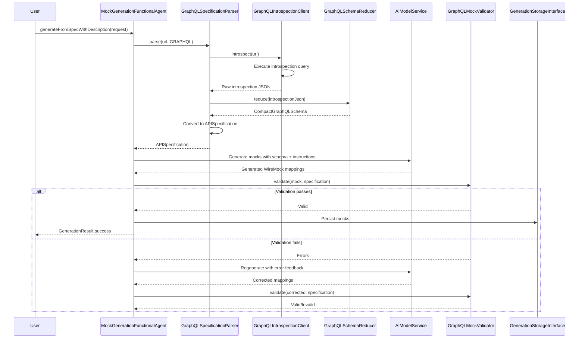

# Design Document: GraphQL Introspection AI Generation

## Overview

This design extends the existing AI mock generation flow to support GraphQL APIs through schema introspection. The feature enables developers to provide a GraphQL endpoint URL, automatically fetch the schema via introspection, reduce it to a compact representation suitable for AI consumption, generate WireMock-compatible GraphQL-over-HTTP mocks using AI, and validate the generated output against the schema with automatic retry/correction.

The design follows clean architecture principles and reuses existing patterns from the REST AI generation flow, including the Koog-based agent orchestration, validation-retry loop, and persistence mechanisms.

## Architecture

### High-Level Component Diagram



### Integration with Existing Flow

The GraphQL introspection feature integrates seamlessly with the existing AI generation flow:

1. **Request Entry Point**: Uses the existing `SpecWithDescriptionRequest` with `SpecificationFormat.GRAPHQL`
2. **Agent Orchestration**: Reuses `MockGenerationFunctionalAgent` without modification
3. **Parser Registration**: Adds `GraphQLSpecificationParser` to `CompositeSpecificationParserImpl`
4. **Validation Loop**: Adds `GraphQLMockValidator` alongside `OpenAPIMockValidator`
5. **Persistence**: Generated mocks use existing storage mechanisms

### Sequence Diagram: End-to-End Flow



## Components and Interfaces

### 1. GraphQLIntrospectionClient (Infrastructure Layer)

**Location**: `software/infra/aws/generation/src/main/kotlin/nl/vintik/mocknest/infra/aws/generation/graphql/GraphQLIntrospectionClient.kt`

**Purpose**: Fetches GraphQL schemas from live endpoints using the standard introspection query.

**Interface**:
```kotlin
interface GraphQLIntrospectionClientInterface {
    /**
     * Execute introspection query against a GraphQL endpoint.
     * @param endpointUrl The GraphQL endpoint URL
     * @param headers Optional HTTP headers for authentication
     * @param timeoutMs Request timeout in milliseconds
     * @return Raw introspection result as JSON string
     * @throws GraphQLIntrospectionException on failure
     */
    suspend fun introspect(
        endpointUrl: String,
        headers: Map<String, String> = emptyMap(),
        timeoutMs: Long = 30000
    ): String
}
```

**Implementation Details**:
- Uses Kotlin HTTP client (ktor-client) for HTTP requests
- Executes the standard GraphQL introspection query
- Handles network failures, timeouts, and invalid responses
- Returns raw introspection JSON for parsing

**Error Handling**:
- Network unreachable → `GraphQLIntrospectionException("Network failure: endpoint unreachable")`
- Introspection disabled → `GraphQLIntrospectionException("Introspection disabled on endpoint")`
- Invalid response format → `GraphQLIntrospectionException("Invalid GraphQL response structure")`
- Timeout → `GraphQLIntrospectionException("Request timeout after ${timeoutMs}ms")`
- Rate limiting → `GraphQLIntrospectionException("Rate limited by endpoint")`

**Standard Introspection Query**:
```graphql
query IntrospectionQuery {
  __schema {
    queryType { name }
    mutationType { name }
    types {
      kind
      name
      description
      fields(includeDeprecated: false) {
        name
        description
        args {
          name
          description
          type {
            kind
            name
            ofType {
              kind
              name
              ofType {
                kind
                name
              }
            }
          }
        }
        type {
          kind
          name
          ofType {
            kind
            name
            ofType {
              kind
              name
            }
          }
        }
      }
      inputFields {
        name
        description
        type {
          kind
          name
          ofType {
            kind
            name
          }
        }
      }
      enumValues {
        name
        description
      }
    }
  }
}
```

### 2. GraphQLSchemaReducer (Application Layer)

**Location**: `software/application/src/main/kotlin/nl/vintik/mocknest/application/generation/graphql/GraphQLSchemaReducer.kt`

**Purpose**: Converts raw introspection JSON into a compact representation suitable for AI consumption.

**Interface**:
```kotlin
interface GraphQLSchemaReducerInterface {
    /**
     * Reduce raw introspection JSON to compact schema.
     * @param introspectionJson Raw introspection result
     * @return Compact schema representation
     */
    suspend fun reduce(introspectionJson: String): CompactGraphQLSchema
}
```

**Reduction Strategy**:
1. Extract query operations with arguments and return types
2. Extract mutation operations with arguments and return types
3. Extract input types with their fields
4. Extract output types with their fields
5. Extract enum types with possible values
6. Include descriptions only when they provide useful context
7. Exclude introspection metadata fields (`__schema`, `__type`, etc.)
8. Exclude deprecated fields and operations

**Size Optimization**:
- Original introspection JSON: ~50-200KB for typical APIs
- Compact schema: ~10-40KB (60-80% reduction)
- Focuses on operation signatures and type definitions
- Omits verbose metadata not needed for mock generation

### 3. GraphQLSpecificationParser (Application Layer)

**Location**: `software/application/src/main/kotlin/nl/vintik/mocknest/application/generation/parsers/GraphQLSpecificationParser.kt`

**Purpose**: Implements `SpecificationParserInterface` for GraphQL schemas.

**Implementation**:
```kotlin
class GraphQLSpecificationParser(
    private val introspectionClient: GraphQLIntrospectionClientInterface,
    private val schemaReducer: GraphQLSchemaReducerInterface
) : SpecificationParserInterface {
    
    override suspend fun parse(content: String, format: SpecificationFormat): APISpecification {
        require(format == SpecificationFormat.GRAPHQL) { "Only GRAPHQL format supported" }
        
        // Determine if content is URL or schema
        val introspectionJson = if (content.startsWith("http")) {
            introspectionClient.introspect(content)
        } else {
            content // Pre-fetched schema
        }
        
        val compactSchema = schemaReducer.reduce(introspectionJson)
        return convertToAPISpecification(compactSchema)
    }
    
    override fun supports(format: SpecificationFormat): Boolean =
        format == SpecificationFormat.GRAPHQL
    
    override suspend fun validate(content: String, format: SpecificationFormat): ValidationResult {
        // Validate introspection JSON structure
    }
    
    override suspend fun extractMetadata(content: String, format: SpecificationFormat): SpecificationMetadata {
        // Extract basic metadata without full parsing
    }
    
    private fun convertToAPISpecification(schema: CompactGraphQLSchema): APISpecification {
        // Convert compact schema to APISpecification domain model
        // Each GraphQL operation becomes an EndpointDefinition
        // GraphQL types become JsonSchema definitions
    }
}
```

**Conversion Logic**:
- Each GraphQL query/mutation → `EndpointDefinition` with `POST` method
- GraphQL operation arguments → `ParameterDefinition` in request body
- GraphQL return types → `ResponseDefinition` with schema
- GraphQL input types → `JsonSchema` with `OBJECT` type
- GraphQL enums → `JsonSchema` with `STRING` type and enum values

### 4. GraphQLMockValidator (Application Layer)

**Location**: `software/application/src/main/kotlin/nl/vintik/mocknest/application/generation/validators/GraphQLMockValidator.kt`

**Purpose**: Validates generated GraphQL mocks against the introspected schema.

**Implementation**:
```kotlin
class GraphQLMockValidator : MockValidatorInterface {
    
    override suspend fun validate(mock: GeneratedMock, specification: APISpecification): MockValidationResult {
        val errors = mutableListOf<String>()
        
        // 1. Extract GraphQL operation from WireMock mapping
        val operation = extractGraphQLOperation(mock.wireMockMapping)
        
        // 2. Verify operation exists in schema
        val endpoint = findMatchingEndpoint(operation, specification)
        if (endpoint == null) {
            errors.add("Operation '${operation.name}' not found in schema")
            return MockValidationResult.invalid(errors)
        }
        
        // 3. Validate operation arguments
        errors.addAll(validateArguments(operation.arguments, endpoint))
        
        // 4. Validate response structure
        errors.addAll(validateResponseBody(mock, endpoint))
        
        // 5. Validate enum values
        errors.addAll(validateEnumValues(mock, specification))
        
        return if (errors.isEmpty()) {
            MockValidationResult.valid()
        } else {
            MockValidationResult.invalid(errors)
        }
    }
    
    private fun extractGraphQLOperation(wireMockMapping: String): GraphQLOperation {
        // Parse WireMock mapping JSON
        // Extract GraphQL query/mutation from request body matcher
        // Parse operation name, arguments, and selection set
    }
    
    private fun validateArguments(
        arguments: Map<String, Any>,
        endpoint: EndpointDefinition
    ): List<String> {
        // Verify all arguments match schema-defined types
        // Check required arguments are present
        // Validate argument value types
    }
    
    private fun validateResponseBody(
        mock: GeneratedMock,
        endpoint: EndpointDefinition
    ): List<String> {
        // Extract response body from WireMock mapping
        // Verify GraphQL response format (data/errors fields)
        // Validate response data matches return type schema
        // Check required fields are present
    }
    
    private fun validateEnumValues(
        mock: GeneratedMock,
        specification: APISpecification
    ): List<String> {
        // Extract enum values from response
        // Verify they match schema-defined enum values
    }
}
```

**Validation Rules**:
1. Operation name must exist in schema (query or mutation)
2. All operation arguments must match schema-defined argument types
3. Response must follow GraphQL format: `{ "data": {...} }` or `{ "errors": [...] }`
4. Response data must contain required fields as defined in schema
5. Scalar field types must be compatible with schema types
6. Enum values must be valid according to schema
7. List and object structures must match schema

### 5. Integration with MockGenerationFunctionalAgent

The existing `MockGenerationFunctionalAgent` requires no modifications. The GraphQL support is added through:

1. **Parser Registration**: Register `GraphQLSpecificationParser` in `CompositeSpecificationParserImpl`
2. **Validator Selection**: The agent already supports multiple validators through the `MockValidatorInterface`
3. **Prompt Building**: `PromptBuilderService` receives `APISpecification` regardless of source format

**No Changes Required**:
- Agent orchestration logic remains unchanged
- Validation-retry loop works identically for GraphQL
- AI model interaction is format-agnostic
- Persistence mechanisms are reused

## Data Models

### CompactGraphQLSchema (Domain Layer)

**Location**: `software/domain/src/main/kotlin/nl/vintik/mocknest/domain/generation/CompactGraphQLSchema.kt`

```kotlin
/**
 * Compact representation of a GraphQL schema optimized for AI consumption.
 * Contains only operation signatures, types, and essential metadata.
 */
data class CompactGraphQLSchema(
    val queries: List<GraphQLOperation>,
    val mutations: List<GraphQLOperation>,
    val types: Map<String, GraphQLType>,
    val enums: Map<String, GraphQLEnum>,
    val metadata: GraphQLSchemaMetadata
) {
    init {
        require(queries.isNotEmpty() || mutations.isNotEmpty()) {
            "Schema must have at least one query or mutation"
        }
    }
    
    /**
     * Pretty-print schema in GraphQL SDL format for round-trip testing.
     */
    fun prettyPrint(): String {
        val builder = StringBuilder()
        
        // Schema definition
        builder.appendLine("schema {")
        if (queries.isNotEmpty()) builder.appendLine("  query: Query")
        if (mutations.isNotEmpty()) builder.appendLine("  mutation: Mutation")
        builder.appendLine("}")
        builder.appendLine()
        
        // Query type
        if (queries.isNotEmpty()) {
            builder.appendLine("type Query {")
            queries.forEach { op ->
                builder.append("  ${op.name}")
                if (op.arguments.isNotEmpty()) {
                    builder.append("(")
                    builder.append(op.arguments.joinToString(", ") { arg ->
                        "${arg.name}: ${arg.type}"
                    })
                    builder.append(")")
                }
                builder.appendLine(": ${op.returnType}")
            }
            builder.appendLine("}")
            builder.appendLine()
        }
        
        // Mutation type
        if (mutations.isNotEmpty()) {
            builder.appendLine("type Mutation {")
            mutations.forEach { op ->
                builder.append("  ${op.name}")
                if (op.arguments.isNotEmpty()) {
                    builder.append("(")
                    builder.append(op.arguments.joinToString(", ") { arg ->
                        "${arg.name}: ${arg.type}"
                    })
                    builder.append(")")
                }
                builder.appendLine(": ${op.returnType}")
            }
            builder.appendLine("}")
            builder.appendLine()
        }
        
        // Object types
        types.values.forEach { type ->
            builder.appendLine("type ${type.name} {")
            type.fields.forEach { field ->
                builder.appendLine("  ${field.name}: ${field.type}")
            }
            builder.appendLine("}")
            builder.appendLine()
        }
        
        // Enum types
        enums.values.forEach { enum ->
            builder.appendLine("enum ${enum.name} {")
            enum.values.forEach { value ->
                builder.appendLine("  $value")
            }
            builder.appendLine("}")
            builder.appendLine()
        }
        
        return builder.toString().trim()
    }
}

/**
 * GraphQL operation (query or mutation).
 */
data class GraphQLOperation(
    val name: String,
    val arguments: List<GraphQLArgument>,
    val returnType: String,
    val description: String? = null
) {
    init {
        require(name.isNotBlank()) { "Operation name cannot be blank" }
        require(returnType.isNotBlank()) { "Return type cannot be blank" }
    }
}

/**
 * GraphQL operation argument.
 */
data class GraphQLArgument(
    val name: String,
    val type: String,
    val description: String? = null
) {
    init {
        require(name.isNotBlank()) { "Argument name cannot be blank" }
        require(type.isNotBlank()) { "Argument type cannot be blank" }
    }
}

/**
 * GraphQL object type.
 */
data class GraphQLType(
    val name: String,
    val fields: List<GraphQLField>,
    val description: String? = null
) {
    init {
        require(name.isNotBlank()) { "Type name cannot be blank" }
        require(fields.isNotEmpty()) { "Type must have at least one field" }
    }
}

/**
 * GraphQL type field.
 */
data class GraphQLField(
    val name: String,
    val type: String,
    val description: String? = null
) {
    init {
        require(name.isNotBlank()) { "Field name cannot be blank" }
        require(type.isNotBlank()) { "Field type cannot be blank" }
    }
}

/**
 * GraphQL enum type.
 */
data class GraphQLEnum(
    val name: String,
    val values: List<String>,
    val description: String? = null
) {
    init {
        require(name.isNotBlank()) { "Enum name cannot be blank" }
        require(values.isNotEmpty()) { "Enum must have at least one value" }
    }
}

/**
 * Metadata about the GraphQL schema.
 */
data class GraphQLSchemaMetadata(
    val schemaVersion: String? = null,
    val description: String? = null
)
```

### GraphQL-Specific Exceptions

**Location**: `software/domain/src/main/kotlin/nl/vintik/mocknest/domain/generation/GraphQLExceptions.kt`

```kotlin
/**
 * Exception thrown when GraphQL introspection fails.
 */
class GraphQLIntrospectionException(
    message: String,
    cause: Throwable? = null
) : RuntimeException(message, cause)

/**
 * Exception thrown when GraphQL schema parsing fails.
 */
class GraphQLSchemaParsingException(
    message: String,
    cause: Throwable? = null
) : RuntimeException(message, cause)
```

### Updates to Existing Domain Models

**SpecificationFormat Enum**:
```kotlin
enum class SpecificationFormat {
    OPENAPI_3, 
    SWAGGER_2, 
    GRAPHQL,  // Added
    WSDL
}
```

No other changes to existing domain models are required.


## Correctness Properties

A property is a characteristic or behavior that should hold true across all valid executions of a system-essentially, a formal statement about what the system should do. Properties serve as the bridge between human-readable specifications and machine-verifiable correctness guarantees.

### Property Reflection

After analyzing all acceptance criteria, I identified the following testable properties and performed redundancy elimination:

**Redundancy Analysis**:
- Properties 3.1-3.5 (extract queries, mutations, input types, output types, enums) can be combined into a single comprehensive property about schema extraction completeness
- Properties 5.2-5.7 (validate operation name, arguments, required fields, scalar types, enums, structures) can be combined into a single comprehensive validation property
- Properties 10.4-10.6 (pretty-print includes operations, types, enums) are subsumed by the round-trip property 10.3

**Final Property Set** (after redundancy elimination):

### Property 1: GraphQL Request Acceptance

*For any* valid GraphQL endpoint URL and instructions, when submitted to the AI generation flow with SpecificationFormat.GRAPHQL, the system should accept the request without format-related errors.

**Validates: Requirements 1.1**

### Property 2: Format-Based Parser Selection

*For any* generation request, when the SpecificationFormat is GRAPHQL, the system should route to the GraphQLSpecificationParser, and when the format is OPENAPI_3 or SWAGGER_2, the system should route to the OpenAPISpecificationParser.

**Validates: Requirements 1.2**

### Property 3: Dual Input Mode Support

*For any* valid GraphQL schema, whether provided as pre-fetched schema content or as an introspection endpoint URL, the system should successfully parse it into an APISpecification.

**Validates: Requirements 1.4**

### Property 4: Introspection Success Returns Valid JSON

*For any* successful introspection query against a GraphQL endpoint, the returned result should be valid JSON containing schema information.

**Validates: Requirements 2.6**

### Property 5: Schema Extraction Completeness

*For any* valid GraphQL introspection JSON, the Schema_Reducer should extract all queries, mutations, input types, output types, and enums with their complete signatures (names, arguments, return types, fields, and values).

**Validates: Requirements 3.1, 3.2, 3.3, 3.4, 3.5**

### Property 6: Metadata Field Exclusion

*For any* raw introspection JSON, the produced Compact_Schema should not contain introspection metadata fields (fields starting with `__` such as `__schema`, `__type`, `__typename`).

**Validates: Requirements 3.7**

### Property 7: Schema Size Reduction

*For any* valid introspection JSON, the Compact_Schema representation should be at least 40% smaller in byte size than the raw introspection JSON.

**Validates: Requirements 3.8**

### Property 8: GraphQL-over-HTTP Mock Format

*For any* generated GraphQL mock, the WireMock mapping should specify POST method and include a JSON body matcher for the GraphQL operation.

**Validates: Requirements 4.3**

### Property 9: GraphQL Response Format Compliance

*For any* generated GraphQL mock response, the response body should be valid JSON containing either a `data` field or an `errors` field (or both), conforming to the GraphQL response specification.

**Validates: Requirements 4.4**

### Property 10: Comprehensive Mock Validation

*For any* generated GraphQL mock and its source schema, validation should verify that: (1) the operation name exists in the schema, (2) all operation arguments match schema-defined types, (3) the response contains all required fields, (4) scalar types are compatible, (5) enum values are valid, and (6) list/object structures match the schema.

**Validates: Requirements 5.2, 5.3, 5.4, 5.5, 5.6, 5.7**

### Property 11: Validation Error Reporting

*For any* invalid GraphQL mock, when validation fails, the validator should return a non-empty list of specific error messages with context indicating which validation rule was violated.

**Validates: Requirements 5.8**

### Property 12: Bounded Retry Attempts

*For any* generation request with validation enabled, the retry coordinator should limit correction attempts to a maximum number (default 1 retry = 2 total attempts), preventing infinite retry loops.

**Validates: Requirements 6.3**

### Property 13: WireMock Persistence Compatibility

*For any* generated GraphQL mock, the WireMock mapping JSON should be valid according to the WireMock mapping schema and compatible with the existing persistence model.

**Validates: Requirements 7.1**

### Property 14: REST Generation Non-Regression

*For any* valid OpenAPI specification with instructions, after implementing GraphQL support, the system should still successfully generate valid REST mocks without errors.

**Validates: Requirements 7.4**

### Property 15: Schema Round-Trip Preservation

*For any* valid Compact_Schema, parsing introspection JSON to create the schema, then pretty-printing it to GraphQL SDL format, then parsing the SDL again, should produce an equivalent schema representation with the same operations, types, and enums.

**Validates: Requirements 10.3, 10.4, 10.5, 10.6**


## Error Handling

### Error Handling Strategy

The GraphQL introspection feature follows the existing error handling patterns established in the REST AI generation flow, with specific handling for GraphQL-specific failure scenarios.

### Error Categories

#### 1. Introspection Errors (Infrastructure Layer)

**Network Failures**:
- Endpoint unreachable
- DNS resolution failure
- Connection timeout
- SSL/TLS errors

**Handling**: Throw `GraphQLIntrospectionException` with descriptive message. Propagate to application layer for user-facing error response.

**GraphQL-Specific Errors**:
- Introspection disabled (returns error in GraphQL response)
- Invalid GraphQL response structure
- Missing required introspection fields
- Rate limiting (HTTP 429)

**Handling**: Parse GraphQL error response, extract error message, throw `GraphQLIntrospectionException` with context.

#### 2. Schema Parsing Errors (Application Layer)

**Invalid Schema Structure**:
- Missing query or mutation types
- Malformed type definitions
- Invalid field types
- Circular type references

**Handling**: Throw `GraphQLSchemaParsingException` with specific validation error. Return `ValidationResult.invalid()` with error details.

**Incomplete Schema**:
- No operations defined
- Empty type definitions
- Missing required fields

**Handling**: Throw `GraphQLSchemaParsingException` indicating incomplete schema. Suggest checking introspection query completeness.

#### 3. Validation Errors (Application Layer)

**Mock Validation Failures**:
- Operation not found in schema
- Argument type mismatch
- Missing required response fields
- Invalid enum values
- Type incompatibility

**Handling**: Return `MockValidationResult.invalid(errors)` with list of specific validation errors. Feed errors back to AI for correction in retry loop.

**Fatal vs Non-Fatal Errors**:
- Fatal: Operation not found, invalid JSON structure
- Non-Fatal: Consistency warnings, optional field mismatches

**Handling**: Mark errors as fatal or non-fatal. Fatal errors prevent mock persistence. Non-fatal errors logged as warnings.

#### 4. AI Generation Errors (Application Layer)

**AI Model Failures**:
- Model timeout
- Invalid response format
- Token limit exceeded
- Model unavailable

**Handling**: Reuse existing AI error handling from `AIModelServiceInterface`. Retry with exponential backoff. Return `GenerationResult.failure()` after max retries.

**Correction Loop Failures**:
- Max retries exceeded
- Validation errors persist after correction
- AI unable to generate valid mock

**Handling**: Return `GenerationResult.failure()` with accumulated validation errors. Provide actionable feedback to user.

### Error Response Format

All errors follow the existing error response format:

```kotlin
data class GenerationResult(
    val jobId: String,
    val status: GenerationStatus,
    val mocks: List<GeneratedMock> = emptyList(),
    val errors: List<String> = emptyList()
)

enum class GenerationStatus {
    SUCCESS, PARTIAL_SUCCESS, FAILURE
}
```

### Retry Strategy

**Introspection Retries**:
- Network errors: 3 retries with exponential backoff (1s, 2s, 4s)
- Timeout errors: 2 retries with increased timeout
- Rate limiting: Respect Retry-After header, max 2 retries

**Validation Retries**:
- Reuse existing retry loop in `MockGenerationFunctionalAgent`
- Default: 1 retry (2 total attempts)
- Configurable via `GenerationOptions`

**AI Model Retries**:
- Handled by `AIModelServiceInterface` implementation
- Follows existing Bedrock retry strategy

### Logging Strategy

**Error Logging Levels**:
- ERROR: Fatal errors preventing generation (introspection failure, parsing failure)
- WARN: Non-fatal validation errors, retry attempts
- INFO: Successful error recovery, validation passes after retry
- DEBUG: Detailed error context, validation error details

**Structured Logging**:
```kotlin
logger.error(exception) { "GraphQL introspection failed: endpoint=$url, error=${exception.message}" }
logger.warn { "Validation failed for mock ${mock.id}: ${errors.size} errors found" }
logger.info { "Validation passed after retry attempt ${attempt} for jobId: ${jobId}" }
```

### User-Facing Error Messages

**Introspection Errors**:
- "Unable to reach GraphQL endpoint: {url}. Please verify the endpoint is accessible."
- "GraphQL introspection is disabled on this endpoint. Please provide the schema directly."
- "Invalid GraphQL response from endpoint. Please verify this is a valid GraphQL API."

**Validation Errors**:
- "Generated mock validation failed: Operation '{operationName}' not found in schema."
- "Argument type mismatch: Expected {expectedType}, got {actualType} for argument '{argName}'."
- "Response missing required field: '{fieldName}' is required by schema but not present in mock."

**Generation Errors**:
- "Mock generation failed after {maxRetries} attempts. Validation errors: {errorSummary}"
- "AI model timeout. Please try again or simplify the generation instructions."

## Testing Strategy

### Dual Testing Approach

The GraphQL introspection feature will be tested using both unit tests and property-based tests to ensure comprehensive coverage:

**Unit Tests**:
- Specific examples demonstrating correct behavior
- Edge cases and error conditions
- Integration points between components
- Regression tests for REST generation

**Property-Based Tests**:
- Universal properties across all inputs
- Comprehensive input coverage through randomization
- Schema round-trip validation
- Validation rule verification

### Unit Testing Focus

**GraphQLIntrospectionClient**:
- Successful introspection with valid endpoint
- Network failure scenarios (unreachable, timeout, SSL errors)
- Introspection disabled error handling
- Invalid response format handling
- Rate limiting response handling

**GraphQLSchemaReducer**:
- Successful reduction of complete schema
- Extraction of queries with arguments and return types
- Extraction of mutations with arguments and return types
- Extraction of input types, output types, and enums
- Metadata field exclusion verification
- Size reduction verification

**GraphQLSpecificationParser**:
- Parsing from URL (introspection)
- Parsing from pre-fetched schema content
- Conversion to APISpecification domain model
- Metadata extraction
- Validation of invalid schemas

**GraphQLMockValidator**:
- Validation of valid mocks
- Detection of missing operations
- Detection of argument type mismatches
- Detection of missing required fields
- Detection of invalid enum values
- Detection of type incompatibilities
- Error message formatting

**Integration Tests**:
- End-to-end generation from fixed mock introspection responses
- Validation-retry loop with correctable errors
- Validation-retry loop with uncorrectable errors
- REST generation non-regression tests

**Optional Manual Tests**:
- Generation from public GraphQL API (PokeAPI: https://beta.pokeapi.co/graphql/v1beta)
- Verification of generated mocks in WireMock runtime

### Property-Based Testing Configuration

**Test Library**: Use Kotest property testing for Kotlin

**Configuration**:
- Minimum 100 iterations per property test
- Each test tagged with feature name and property number
- Tag format: `Feature: graphql-introspection-ai-generation, Property {number}: {property_text}`

**Property Test Examples**:

```kotlin
@Test
fun `Property 1 - GraphQL Request Acceptance`() = runTest {
    checkAll(100, Arb.graphqlEndpointUrl(), Arb.instructions()) { url, instructions ->
        val request = SpecWithDescriptionRequest(
            namespace = MockNamespace("test-api"),
            specificationUrl = url,
            format = SpecificationFormat.GRAPHQL,
            description = instructions
        )
        
        // Should not throw format-related exceptions
        shouldNotThrowAny {
            // Validation logic
        }
    }
}

@Test
fun `Property 5 - Schema Extraction Completeness`() = runTest {
    checkAll(100, Arb.graphqlIntrospectionJson()) { introspectionJson ->
        val compactSchema = schemaReducer.reduce(introspectionJson)
        
        // Verify all operations extracted
        val originalOperations = extractOperationsFromJson(introspectionJson)
        compactSchema.queries.size + compactSchema.mutations.size shouldBe originalOperations.size
        
        // Verify all types extracted
        val originalTypes = extractTypesFromJson(introspectionJson)
        compactSchema.types.size shouldBe originalTypes.size
        
        // Verify all enums extracted
        val originalEnums = extractEnumsFromJson(introspectionJson)
        compactSchema.enums.size shouldBe originalEnums.size
    }
}

@Test
fun `Property 15 - Schema Round-Trip Preservation`() = runTest {
    checkAll(100, Arb.compactGraphQLSchema()) { schema ->
        val prettyPrinted = schema.prettyPrint()
        val reparsed = parseGraphQLSDL(prettyPrinted)
        
        // Schemas should be equivalent
        reparsed.queries shouldContainExactlyInAnyOrder schema.queries
        reparsed.mutations shouldContainExactlyInAnyOrder schema.mutations
        reparsed.types shouldBe schema.types
        reparsed.enums shouldBe schema.enums
    }
}
```

**Generators for Property Tests**:
- `Arb.graphqlEndpointUrl()`: Generates valid GraphQL endpoint URLs
- `Arb.instructions()`: Generates natural language instructions
- `Arb.graphqlIntrospectionJson()`: Generates valid introspection JSON
- `Arb.compactGraphQLSchema()`: Generates valid CompactGraphQLSchema instances
- `Arb.graphqlOperation()`: Generates valid GraphQL operations
- `Arb.graphqlMock()`: Generates valid GraphQL mocks

### Test Data Management

**Test Resources**:
- `src/test/resources/graphql/introspection/` - Sample introspection JSON files
- `src/test/resources/graphql/schemas/` - Sample compact schemas
- `src/test/resources/graphql/mocks/` - Sample generated mocks
- `src/test/resources/graphql/invalid/` - Invalid schemas for error testing

**Test Data Examples**:
- `pokeapi-introspection.json` - Real introspection from PokeAPI
- `simple-schema.json` - Minimal valid schema
- `complex-schema.json` - Schema with nested types and enums
- `invalid-no-operations.json` - Schema missing operations
- `invalid-circular-refs.json` - Schema with circular type references

### Coverage Goals

**Target Coverage**: 90% aggregated code coverage across all modules

**Critical Paths**:
- Introspection client: 95% coverage (critical for reliability)
- Schema reducer: 95% coverage (critical for correctness)
- Validator: 95% coverage (critical for quality)
- Parser: 90% coverage
- Integration tests: Cover all happy paths and major error scenarios

### Continuous Integration

**Test Execution**:
- All unit tests run on every commit
- Property tests run on every commit (100 iterations)
- Integration tests run on every commit
- Manual tests documented but not automated

**Coverage Enforcement**:
- Kover plugin enforces 90% aggregated coverage
- Build fails if coverage drops below threshold
- Coverage reports generated for every build

## Deployment Considerations

### No Infrastructure Changes Required

The GraphQL introspection feature requires no changes to AWS infrastructure:
- No new Lambda functions
- No new API Gateway endpoints
- No new S3 buckets or storage configuration
- No new IAM roles or permissions

### Configuration Changes

**Application Configuration**:
- Register `GraphQLSpecificationParser` in `CompositeSpecificationParserImpl`
- Register `GraphQLMockValidator` in validator registry
- No environment variables or external configuration needed

**Dependency Changes**:
- Add Kotlin HTTP client (ktor-client) for introspection
- Add GraphQL parsing library (graphql-java) for schema parsing
- All dependencies added to existing Gradle modules

### Deployment Process

**Standard Deployment**:
1. Build application with new GraphQL support
2. Run full test suite (unit + property + integration)
3. Verify coverage meets 90% threshold
4. Deploy to AWS Lambda using existing SAM template
5. Verify REST generation still works (regression test)
6. Test GraphQL generation with sample endpoint

**Rollback Strategy**:
- If issues detected, rollback to previous Lambda version
- No data migration or cleanup required
- Feature can be disabled by not using GRAPHQL format

### Monitoring and Observability

**CloudWatch Metrics**:
- Reuse existing generation metrics
- Track GraphQL vs REST generation requests
- Monitor introspection success/failure rates
- Track validation retry rates

**CloudWatch Logs**:
- Introspection errors logged with endpoint context
- Schema reduction metrics (size before/after)
- Validation errors logged with operation context
- Retry attempts logged with error details

**Alarms**:
- High introspection failure rate (> 10%)
- High validation failure rate (> 20%)
- Increased retry attempts (> 50% of requests)

### Performance Considerations

**Introspection Latency**:
- Network round-trip to GraphQL endpoint: 100-500ms
- Introspection query execution: 50-200ms
- Total introspection overhead: 150-700ms

**Schema Reduction**:
- Parsing introspection JSON: 10-50ms
- Reduction to compact schema: 5-20ms
- Total reduction overhead: 15-70ms

**Validation**:
- GraphQL validation similar to OpenAPI validation
- Expected overhead: 20-100ms per mock

**Total Generation Time**:
- REST generation: 2-5 seconds (baseline)
- GraphQL generation: 2.5-6 seconds (includes introspection)
- Acceptable overhead: < 1 second

### Backward Compatibility

**API Compatibility**:
- No breaking changes to existing API
- `SpecificationFormat.GRAPHQL` is additive
- Existing REST generation unchanged

**Data Compatibility**:
- Generated mocks use same WireMock format
- Storage structure unchanged
- No migration required

**Client Compatibility**:
- Clients using REST generation unaffected
- Clients can adopt GraphQL generation incrementally
- No client-side changes required


## Implementation Notes

### Development Order

Following clean architecture principles, implement in this sequence:

**Phase 1: Domain Layer**
1. Create `CompactGraphQLSchema` and related domain models
2. Create `GraphQLIntrospectionException` and `GraphQLSchemaParsingException`
3. Add `GRAPHQL` to `SpecificationFormat` enum
4. Write unit tests for domain model validation

**Phase 2: Application Layer**
5. Implement `GraphQLSchemaReducer` with reduction logic
6. Implement `GraphQLSpecificationParser` (without introspection client)
7. Implement `GraphQLMockValidator` with validation rules
8. Write unit tests for reducer, parser, and validator
9. Write property tests for schema extraction and validation

**Phase 3: Infrastructure Layer**
10. Implement `GraphQLIntrospectionClient` with HTTP client
11. Wire introspection client into parser
12. Write unit tests for introspection client
13. Write integration tests with mock endpoints

**Phase 4: Integration**
14. Register `GraphQLSpecificationParser` in `CompositeSpecificationParserImpl`
15. Register `GraphQLMockValidator` in validator registry
16. Write end-to-end integration tests
17. Write REST non-regression tests
18. Optional: Manual test with PokeAPI

**Phase 5: Documentation and Deployment**
19. Update API documentation
20. Update README with GraphQL examples
21. Deploy to AWS and verify
22. Monitor metrics and logs

### Key Implementation Details

**GraphQL Introspection Query**:
- Use standard introspection query (provided in design)
- Include nested type information (up to 3 levels)
- Exclude deprecated fields and operations
- Request descriptions for context

**Schema Reduction Algorithm**:
1. Parse introspection JSON into structured representation
2. Extract query type and all query operations
3. Extract mutation type and all mutation operations
4. For each operation, extract arguments with types
5. For each operation, extract return type
6. Recursively extract referenced types (input, output, enums)
7. Exclude introspection metadata fields (`__schema`, `__type`, etc.)
8. Exclude built-in scalar types (String, Int, Float, Boolean, ID)
9. Include descriptions only for operations and types (not fields)
10. Serialize to compact JSON representation

**Validation Algorithm**:
1. Parse WireMock mapping JSON
2. Extract GraphQL operation from request body matcher
3. Parse operation to extract name, arguments, and selection set
4. Find matching operation in schema (query or mutation)
5. Validate argument names and types against schema
6. Extract response body from WireMock mapping
7. Validate response follows GraphQL format (data/errors)
8. Validate response data structure against return type schema
9. Recursively validate nested objects and arrays
10. Validate enum values against schema-defined values
11. Collect all validation errors with context
12. Return validation result with errors

**Pretty-Print Algorithm**:
1. Start with schema definition (query/mutation types)
2. Print Query type with all query operations
3. Print Mutation type with all mutation operations
4. Print all object types with fields
5. Print all enum types with values
6. Format with proper indentation and line breaks
7. Follow GraphQL SDL syntax

### Reuse Opportunities

**Existing Components to Reuse**:
- `MockGenerationFunctionalAgent`: No changes needed
- `PromptBuilderService`: Reuse for GraphQL prompts
- `AIModelServiceInterface`: Reuse for AI interaction
- `CompositeSpecificationParserImpl`: Register GraphQL parser
- `GenerationStorageInterface`: Reuse for persistence
- `MockValidationResult`: Reuse for validation results
- `GenerationResult`: Reuse for generation results

**Existing Patterns to Follow**:
- Error handling with `runCatching` and structured logging
- Validation with `MockValidatorInterface`
- Parsing with `SpecificationParserInterface`
- Domain model validation in `init` blocks
- Test organization with Given-When-Then naming
- Property testing with Kotest

### Dependencies

**New Dependencies**:
```kotlin
// Kotlin HTTP client for introspection
implementation("io.ktor:ktor-client-core:2.3.0")
implementation("io.ktor:ktor-client-cio:2.3.0")
implementation("io.ktor:ktor-client-content-negotiation:2.3.0")
implementation("io.ktor:ktor-serialization-kotlinx-json:2.3.0")

// GraphQL parsing (optional, for SDL parsing in tests)
testImplementation("com.graphql-java:graphql-java:21.0")
```

**Existing Dependencies to Leverage**:
- `kotlinx-serialization-json`: For JSON parsing
- `kotlin-logging`: For structured logging
- `kotest`: For property testing
- `mockk`: For mocking in tests

### Configuration

**No External Configuration Required**:
- Introspection timeout: Hardcoded default (30 seconds)
- Retry attempts: Configurable via `GenerationOptions`
- Validation enabled: Configurable via `GenerationOptions`

**Spring Bean Registration**:
```kotlin
@Configuration
class GraphQLGenerationConfig {
    
    @Bean
    fun graphqlIntrospectionClient(): GraphQLIntrospectionClientInterface {
        return GraphQLIntrospectionClient()
    }
    
    @Bean
    fun graphqlSchemaReducer(): GraphQLSchemaReducerInterface {
        return GraphQLSchemaReducer()
    }
    
    @Bean
    fun graphqlSpecificationParser(
        introspectionClient: GraphQLIntrospectionClientInterface,
        schemaReducer: GraphQLSchemaReducerInterface
    ): SpecificationParserInterface {
        return GraphQLSpecificationParser(introspectionClient, schemaReducer)
    }
    
    @Bean
    fun graphqlMockValidator(): MockValidatorInterface {
        return GraphQLMockValidator()
    }
}
```

### Testing Utilities

**Test Data Builders**:
```kotlin
object GraphQLTestData {
    fun sampleIntrospectionJson(): String = 
        this::class.java.getResource("/graphql/introspection/pokeapi-introspection.json")!!.readText()
    
    fun sampleCompactSchema(): CompactGraphQLSchema = CompactGraphQLSchema(
        queries = listOf(
            GraphQLOperation("pokemon", listOf(GraphQLArgument("id", "Int!")), "Pokemon")
        ),
        mutations = emptyList(),
        types = mapOf(
            "Pokemon" to GraphQLType("Pokemon", listOf(
                GraphQLField("id", "Int!"),
                GraphQLField("name", "String!")
            ))
        ),
        enums = emptyMap(),
        metadata = GraphQLSchemaMetadata()
    )
    
    fun sampleGraphQLMock(): GeneratedMock = GeneratedMock(
        id = "test-mock-1",
        name = "Pokemon Query Mock",
        namespace = MockNamespace("pokeapi"),
        wireMockMapping = """
            {
              "request": {
                "method": "POST",
                "urlPath": "/pokeapi/graphql",
                "bodyPatterns": [{
                  "matchesJsonPath": "$[?(@.query =~ /.*pokemon.*/)]"
                }]
              },
              "response": {
                "status": 200,
                "jsonBody": {
                  "data": {
                    "pokemon": {
                      "id": 1,
                      "name": "bulbasaur"
                    }
                  }
                }
              }
            }
        """.trimIndent(),
        metadata = MockMetadata(
            sourceType = SourceType.SPEC_WITH_DESCRIPTION,
            sourceReference = "PokeAPI GraphQL",
            endpoint = EndpointInfo(
                method = HttpMethod.POST,
                path = "/graphql",
                statusCode = 200,
                contentType = "application/json"
            )
        )
    )
}
```

**Property Test Generators**:
```kotlin
object GraphQLArbitraries {
    fun graphqlEndpointUrl(): Arb<String> = Arb.string(10..50).map { "https://api.example.com/graphql" }
    
    fun instructions(): Arb<String> = Arb.string(20..200)
    
    fun graphqlIntrospectionJson(): Arb<String> = Arb.bind(
        Arb.list(graphqlOperation(), 1..10),
        Arb.list(graphqlType(), 1..10),
        Arb.list(graphqlEnum(), 0..5)
    ) { operations, types, enums ->
        buildIntrospectionJson(operations, types, enums)
    }
    
    fun compactGraphQLSchema(): Arb<CompactGraphQLSchema> = Arb.bind(
        Arb.list(graphqlOperation(), 1..10),
        Arb.list(graphqlOperation(), 0..5),
        Arb.map(Arb.string(5..20), graphqlType(), 1..10),
        Arb.map(Arb.string(5..20), graphqlEnum(), 0..5)
    ) { queries, mutations, types, enums ->
        CompactGraphQLSchema(queries, mutations, types, enums, GraphQLSchemaMetadata())
    }
    
    private fun graphqlOperation(): Arb<GraphQLOperation> = Arb.bind(
        Arb.string(5..20),
        Arb.list(graphqlArgument(), 0..5),
        Arb.string(5..20)
    ) { name, args, returnType ->
        GraphQLOperation(name, args, returnType)
    }
    
    private fun graphqlArgument(): Arb<GraphQLArgument> = Arb.bind(
        Arb.string(5..20),
        Arb.string(5..20)
    ) { name, type ->
        GraphQLArgument(name, type)
    }
    
    private fun graphqlType(): Arb<GraphQLType> = Arb.bind(
        Arb.string(5..20),
        Arb.list(graphqlField(), 1..10)
    ) { name, fields ->
        GraphQLType(name, fields)
    }
    
    private fun graphqlField(): Arb<GraphQLField> = Arb.bind(
        Arb.string(5..20),
        Arb.string(5..20)
    ) { name, type ->
        GraphQLField(name, type)
    }
    
    private fun graphqlEnum(): Arb<GraphQLEnum> = Arb.bind(
        Arb.string(5..20),
        Arb.list(Arb.string(5..20), 1..10)
    ) { name, values ->
        GraphQLEnum(name, values)
    }
}
```

### Risk Mitigation

**Risk: Introspection Disabled on Target Endpoint**
- Mitigation: Support both URL and pre-fetched schema content
- Fallback: User provides schema manually

**Risk: Large Schema Size Impacts AI Token Limits**
- Mitigation: Schema reduction algorithm targets 60-80% size reduction
- Fallback: Implement schema filtering to include only specified operations

**Risk: GraphQL Validation Complexity**
- Mitigation: Start with basic validation, iterate based on feedback
- Fallback: Allow validation to be disabled via `GenerationOptions`

**Risk: Breaking Changes to REST Generation**
- Mitigation: Comprehensive regression tests
- Fallback: Feature flag to disable GraphQL support

**Risk: Performance Impact from Introspection**
- Mitigation: Cache introspection results per endpoint
- Fallback: Recommend pre-fetching schemas for production use

### Future Enhancements

**Phase 2 Improvements**:
- Schema caching to avoid repeated introspection
- Support for GraphQL subscriptions
- Support for custom scalar types
- Support for GraphQL directives
- Incremental schema updates (detect changes)

**Advanced Features**:
- GraphQL query complexity analysis
- Automatic mock data generation from schema
- Support for GraphQL federation
- Support for GraphQL batch queries

## Summary

This design extends the existing AI mock generation flow to support GraphQL APIs through schema introspection. The implementation follows clean architecture principles, reuses existing patterns and components, and requires no infrastructure changes. The feature integrates seamlessly with the existing REST generation flow and maintains backward compatibility.

Key design decisions:
- Reuse `MockGenerationFunctionalAgent` without modification
- Implement GraphQL-specific components following existing patterns
- Support both URL-based introspection and pre-fetched schemas
- Validate generated mocks against schema with automatic retry/correction
- Achieve 60-80% schema size reduction for AI consumption
- Maintain 90% test coverage with unit and property tests
- No breaking changes to existing API or infrastructure

The design is ready for implementation following the phased development order outlined above.
