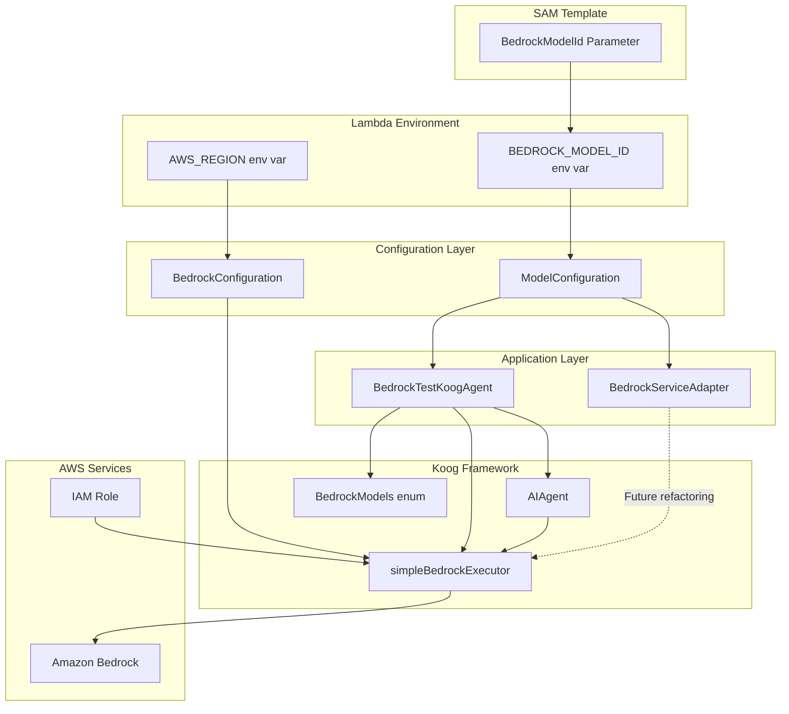

# Design Document

## Overview

This design document specifies the refactoring approach for the AI generation code in MockNest Serverless to follow Kotlin coding standards and properly implement the Koog framework. The refactoring addresses four main areas:

1. **Configuration Management**: Making Bedrock model selection configurable via SAM template parameters
2. **Koog Integration**: Properly using Koog's abstractions instead of direct Bedrock API calls
3. **Error Handling**: Replacing try-catch blocks with idiomatic Kotlin patterns (runCatching)
4. **Code Quality**: Ensuring all code follows project coding standards

The refactoring maintains backward compatibility while improving maintainability, testability, and adherence to framework patterns.

## Architecture

### Current Architecture Issues

The current implementation has several architectural issues:

1. **Tight Coupling**: BedrockTestKoogAgent directly calls BedrockRuntimeClient.invokeModel, bypassing Koog abstractions
2. **Hardcoded Configuration**: Model IDs are hardcoded in two places (BedrockTestKoogAgent and BedrockServiceAdapter)
3. **Manual JSON Handling**: Direct construction of Bedrock request bodies using Jackson ObjectMapper
4. **Non-idiomatic Error Handling**: Extensive try-catch blocks instead of Kotlin's runCatching

### Target Architecture

The refactored architecture will:

1. **Use Koog Abstractions**: Leverage Koog's simpleBedrockExecutor and AIAgent for all Bedrock interactions
2. **Centralized Configuration**: Read model ID from environment variables set by SAM template
3. **Framework-Managed JSON**: Let Koog handle request/response serialization
4. **Idiomatic Error Handling**: Use runCatching with onFailure for consistent error handling

### Architecture Diagram



## Components and Interfaces

### 1. ModelConfiguration

A new configuration class that manages Bedrock model selection:

```kotlin
package nl.vintik.mocknest.infra.aws.core.ai

import ai.koog.prompt.executor.clients.bedrock.BedrockModels
import ai.koog.prompt.llm.LLModel
import io.github.oshai.kotlinlogging.KotlinLogging
import org.springframework.beans.factory.annotation.Value
import org.springframework.context.annotation.Configuration

/**
 * Configuration for Bedrock model selection.
 * Maps environment variable model names to Koog BedrockModels constants.
 */
@Configuration
class ModelConfiguration(
    @Value("\${bedrock.model.name:AnthropicClaude35SonnetV2}")
    private val modelName: String
) {
    private val logger = KotlinLogging.logger {}
    
    /**
     * Get the LLModel for the configured model name.
     * Falls back to Claude 3.5 Sonnet v2 if mapping fails.
     */
    fun getBedrockModel(): LLModel {
        return runCatching {
            mapModelNameToLLModel(modelName)
        }.onFailure { exception ->
            logger.warn(exception) { "Failed to map model name '$modelName' to BedrockModel, using default" }
        }.getOrDefault(BedrockModels.AnthropicClaude35SonnetV2)
    }
    
    /**
     * Get the model name for logging and debugging.
     */
    fun getModelName(): String = modelName
    
    private fun mapModelNameToLLModel(modelName: String): LLModel {
        // Use Kotlin reflection to look up BedrockModels property by name
        return runCatching {
            val property = BedrockModels::class.members
                .firstOrNull { it.name == modelName }
                ?: error("Model name not found: $modelName")
            
            property.call(BedrockModels) as? LLModel
                ?: error("Property $modelName is not an LLModel")
        }.onFailure { exception ->
            logger.warn(exception) { "Failed to find model: $modelName" }
        }.getOrElse {
            logger.warn { "Unknown model name: $modelName, using Claude 3.5 Sonnet v2" }
            BedrockModels.AnthropicClaude35SonnetV2
        }
    }
}
```

### 2. Refactored BedrockTestKoogAgent

The refactored agent uses Koog's abstractions properly:

```kotlin
package nl.vintik.mocknest.infra.aws.generation.ai

import ai.koog.agents.AIAgent
import ai.koog.bedrock.simpleBedrockExecutor
import ai.koog.tools.ToolRegistry
import io.github.oshai.kotlinlogging.KotlinLogging
import nl.vintik.mocknest.application.generation.agent.TestKoogAgent
import nl.vintik.mocknest.domain.generation.TestAgentRequest
import nl.vintik.mocknest.domain.generation.TestAgentResponse
import nl.vintik.mocknest.infra.aws.core.ai.ModelConfiguration
import org.springframework.beans.factory.annotation.Value

/**
 * Bedrock-based implementation of TestKoogAgent using Koog framework.
 * Provides AI-powered mock generation through proper Koog abstractions.
 */
class BedrockTestKoogAgent(
    private val modelConfiguration: ModelConfiguration,
    @Value("\${aws.region:eu-west-1}") private val region: String
) : TestKoogAgent {
    
    private val logger = KotlinLogging.logger {}
    
    // Lazy initialization of Koog components
    private val executor by lazy {
        logger.info { "Initializing Bedrock executor for region: $region" }
        simpleBedrockExecutor(
            region = region
            // Uses DefaultChainCredentialsProvider automatically (Lambda IAM role)
        )
    }
    
    private val agent by lazy {
        logger.info { "Initializing AI agent with model: ${modelConfiguration.getBedrockModel()}" }
        AIAgent(
            executor = executor,
            llmModel = modelConfiguration.getBedrockModel(),
            systemPrompt = """
                You are a helpful AI assistant integrated with MockNest Serverless.
                You help users with their requests in a clear and concise manner.
            """.trimIndent(),
            temperature = 0.7,
            toolRegistry = ToolRegistry() // Empty registry for now
        )
    }
    
    override suspend fun execute(request: TestAgentRequest): TestAgentResponse {
        logger.info { "Executing Koog agent with instructions: ${request.instructions}" }
        
        return runCatching {
            val prompt = buildPrompt(request.instructions, request.context)
            val response = agent.execute(prompt)
            
            logger.info { "Received response from Koog agent" }
            
            TestAgentResponse(
                success = true,
                message = "Successfully processed request through Koog and Bedrock",
                bedrockResponse = response
            )
        }.onFailure { exception ->
            logger.error(exception) { "Error executing Koog agent: instructions=${request.instructions}" }
        }.getOrElse {
            TestAgentResponse(
                success = false,
                message = "Failed to process request",
                error = it.message
            )
        }
    }
    
    private fun buildPrompt(instructions: String, context: Map<String, String>): String {
        val contextStr = if (context.isNotEmpty()) {
            "\n\nContext:\n" + context.entries.joinToString("\n") { "${it.key}: ${it.value}" }
        } else {
            ""
        }
        
        return """
User Instructions:
$instructions$contextStr

Please respond to the user's instructions in a helpful and concise manner.
        """.trimIndent()
    }
}
```

### 3. Updated BedrockServiceAdapter

BedrockServiceAdapter will be updated to use the ModelConfiguration for consistent model selection:

```kotlin
// In BedrockServiceAdapter constructor
class BedrockServiceAdapter(
    private val bedrockClient: BedrockRuntimeClient,
    private val modelConfiguration: ModelConfiguration
) : AIModelServiceInterface {
    
    private val logger = KotlinLogging.logger {}
    private val objectMapper = ObjectMapper()
    
    // Use modelConfiguration.getBedrockModel().id for the model ID
    private val modelId: String
        get() = modelConfiguration.getBedrockModel().id
    
    // ... rest of implementation uses modelId property
}
```

Note: Full Koog integration for BedrockServiceAdapter is out of scope for this refactoring. It will continue using direct Bedrock API calls but with configurable model ID from the LLModel.

### 4. Updated Spring Configuration

```kotlin
@Configuration
class AIGenerationConfiguration {
    
    @Bean
    fun modelConfiguration(
        @Value("\${bedrock.model.name:AnthropicClaude35SonnetV2}") modelName: String
    ): ModelConfiguration {
        return ModelConfiguration(modelName)
    }
    
    @Bean
    fun bedrockTestKoogAgent(
        modelConfiguration: ModelConfiguration,
        @Value("\${aws.region:eu-west-1}") region: String
    ): TestKoogAgent {
        return BedrockTestKoogAgent(modelConfiguration, region)
    }
    
    @Bean
    fun bedrockServiceAdapter(
        bedrockClient: BedrockRuntimeClient,
        modelConfiguration: ModelConfiguration
    ): AIModelServiceInterface {
        return BedrockServiceAdapter(bedrockClient, modelConfiguration)
    }
    
    // ... other beans
}
```

### 5. SAM Template Updates

```yaml
Parameters:
  # ... existing parameters
  
  BedrockModelName:
    Type: String
    Default: 'AnthropicClaude35SonnetV2'
    Description: |
      Bedrock model name for AI-powered mock generation.
      Choose from available Claude, Nova, Jamba, or Llama models.
    AllowedValues:
      # Claude 4.5 models
      - AnthropicClaude45Opus
      - AnthropicClaude4_5Sonnet
      - AnthropicClaude4_5Haiku
      # Claude 4 models
      - AnthropicClaude4Opus
      - AnthropicClaude41Opus
      - AnthropicClaude4Sonnet
      # Claude 3.5 models
      - AnthropicClaude35SonnetV2
      - AnthropicClaude35Haiku
      # Claude 3 models
      - AnthropicClaude3Opus
      - AnthropicClaude3Sonnet
      - AnthropicClaude3Haiku
      - AnthropicClaude21
      - AnthropicClaudeInstant
      # Amazon Nova models
      - AmazonNovaMicro
      - AmazonNovaLite
      - AmazonNovaPro
      - AmazonNovaPremier
      # AI21 Jamba models
      - AI21JambaLarge
      - AI21JambaMini
      # Meta Llama models
      - MetaLlama3_0_8BInstruct
      - MetaLlama3_0_70BInstruct
      - MetaLlama3_1_8BInstruct
      - MetaLlama3_1_70BInstruct
      - MetaLlama3_1_405BInstruct
      - MetaLlama3_2_1BInstruct
      - MetaLlama3_2_3BInstruct
      - MetaLlama3_2_11BInstruct
      - MetaLlama3_2_90BInstruct
      - MetaLlama3_3_70BInstruct
    ConstraintDescription: Must be a valid BedrockModels constant name

Resources:
  MockNestFunction:
    Type: AWS::Serverless::Function
    Properties:
      # ... existing properties
      Environment:
        Variables:
          MOCK_STORAGE_BUCKET: !Ref MockStorage
          MOCKNEST_S3_BUCKET_NAME: !Ref MockStorage
          BEDROCK_MODEL_NAME: !Ref BedrockModelName
          # ... other variables
```

## Data Models

No new data models are required. The refactoring uses existing domain models:
- `TestAgentRequest` - Input to the test agent
- `TestAgentResponse` - Output from the test agent

## Correctness Properties


*A property is a characteristic or behavior that should hold true across all valid executions of a system—essentially, a formal statement about what the system should do. Properties serve as the bridge between human-readable specifications and machine-verifiable correctness guarantees.*

### Property Reflection

After analyzing all acceptance criteria, I identified the following redundancies:
- Criteria 1.7 and 2.5 both test model ID to enum mapping - combined into one property
- Criteria 1.8 and 2.6 both test fallback behavior for invalid model IDs - combined into one property
- Criteria 1.4 and 1.5 both test environment variable reading - combined into one property
- Criteria 4.5, 4.6, 4.7, 4.8 all test log level usage - combined into one comprehensive property

### Testable Properties

**Property 1: Model Name Configuration Reading**
*For any* component that requires Bedrock model configuration (BedrockTestKoogAgent, BedrockServiceAdapter), when initialized with a BEDROCK_MODEL_NAME environment variable, the component should use that model name value.
**Validates: Requirements 1.4, 1.5**

**Property 2: Model Name to LLModel Mapping**
*For any* valid Bedrock model name that exists in BedrockModels object (e.g., "AnthropicClaude35SonnetV2", "AmazonNovaPro"), the ModelConfiguration should map it to the corresponding LLModel constant.
**Validates: Requirements 1.7, 2.5**

**Property 3: Region Configuration**
*For any* AWS region string provided via configuration, the Bedrock executor should be initialized with that region (not hardcoded).
**Validates: Requirements 2.2**

**Property 4: Exception Logging**
*For any* exception caught during error handling, the logger should receive the exception object (not just the message) to enable full stack trace logging.
**Validates: Requirements 4.3**

**Property 5: Structured Logging Context**
*For any* log message, if the operation involves identifiable entities (model IDs, request instructions, regions), the log message should include that context information.
**Validates: Requirements 4.4**

**Property 6: Log Level Appropriateness**
*For any* logging operation, the log level should match the severity: ERROR for operation-preventing failures, WARN for recoverable errors with fallbacks, INFO for normal operations, DEBUG for detailed execution information.
**Validates: Requirements 4.5, 4.6, 4.7, 4.8**

### Edge Cases

**Edge Case 1: Missing Environment Variable**
When BEDROCK_MODEL_NAME environment variable is not set, the system should use the default value "AnthropicClaude35SonnetV2".
**Validates: Requirements 1.6**

**Edge Case 2: Invalid Model Name**
When an unrecognized model name is provided (not found in BedrockModels object), the system should log a warning and fall back to BedrockModels.AnthropicClaude35SonnetV2.
**Validates: Requirements 1.8, 2.6**

### Examples

**Example 1: SAM Template Parameter Definition**
The SAM template should contain a BedrockModelName parameter with default value "AnthropicClaude35SonnetV2" and description of valid model names.
**Validates: Requirements 1.1, 1.2**

**Example 2: SAM Template Environment Variable Mapping**
The SAM template should map the BedrockModelName parameter to the BEDROCK_MODEL_NAME environment variable in the Lambda function configuration.
**Validates: Requirements 1.3**

**Example 3: Koog Executor Initialization**
BedrockTestKoogAgent should create a Koog Bedrock executor using simpleBedrockExecutor without explicit AWS credentials.
**Validates: Requirements 2.1, 2.3**

**Example 4: AIAgent Usage**
BedrockTestKoogAgent should use Koog's AIAgent class for model invocation, not direct BedrockRuntimeClient calls.
**Validates: Requirements 2.4, 2.9**

**Example 5: Test Suite Integrity**
After refactoring, all existing unit tests and integration tests should pass.
**Validates: Requirements 5.5, 7.1, 7.2**

**Example 6: Code Coverage Maintenance**
After refactoring, code coverage percentage should be maintained or improved.
**Validates: Requirements 7.4**

**Example 7: Error Scenario Testing**
New error handling patterns should have corresponding tests for error scenarios.
**Validates: Requirements 7.5**

## Error Handling

### Error Handling Strategy

The refactored code follows Kotlin idiomatic error handling patterns:

1. **Use runCatching for Expected Failures**: All operations that may fail (AI agent execution, configuration reading, model mapping) use runCatching
2. **Structured Error Logging**: All errors are logged with context using onFailure before handling
3. **Graceful Degradation**: Invalid configurations fall back to sensible defaults with warning logs
4. **No Silent Failures**: All error paths produce log output at appropriate levels

### Error Scenarios

| Scenario | Handling | Log Level | Fallback |
|----------|----------|-----------|----------|
| Missing BEDROCK_MODEL_NAME env var | Use default model name | INFO | "AnthropicClaude35SonnetV2" |
| Invalid model name string | Map to default LLModel | WARN | BedrockModels.AnthropicClaude35SonnetV2 |
| Koog agent execution failure | Return error response | ERROR | TestAgentResponse with success=false |
| Executor initialization failure | Lazy initialization retry | ERROR | Exception propagated |
| Missing AWS region config | Use default region | INFO | "eu-west-1" |

### Error Handling Examples

```kotlin
// Configuration reading with fallback
fun getBedrockModel(): LLModel {
    return runCatching {
        mapModelNameToLLModel(modelName)
    }.onFailure { exception ->
        logger.warn(exception) { "Failed to map model name '$modelName', using default" }
    }.getOrDefault(BedrockModels.AnthropicClaude35SonnetV2)
}

// Agent execution with structured error logging
override suspend fun execute(request: TestAgentRequest): TestAgentResponse {
    return runCatching {
        val prompt = buildPrompt(request.instructions, request.context)
        val response = agent.execute(prompt)
        
        TestAgentResponse(
            success = true,
            message = "Successfully processed request",
            bedrockResponse = response
        )
    }.onFailure { exception ->
        logger.error(exception) { "Agent execution failed: instructions=${request.instructions}" }
    }.getOrElse {
        TestAgentResponse(
            success = false,
            message = "Failed to process request",
            error = it.message
        )
    }
}
```

## Testing Strategy

### Dual Testing Approach

The refactoring will maintain comprehensive test coverage using both unit tests and property-based tests:

**Unit Tests:**
- Verify specific examples (SAM template structure, default values)
- Test edge cases (missing env vars, invalid model IDs)
- Test integration points (Spring bean wiring, Koog initialization)
- Validate error scenarios (agent failures, configuration errors)

**Property-Based Tests:**
- Verify model ID mapping across all valid model ID patterns
- Test configuration reading with various environment variable values
- Validate logging behavior across different error scenarios
- Ensure region configuration works with any valid AWS region

### Test Configuration

- Minimum 100 iterations per property test
- Each property test tagged with: **Feature: koog-bedrock-refactoring, Property N: [property text]**
- Unit tests focus on specific examples and edge cases
- Property tests verify universal correctness across input ranges

### Testing Priorities

1. **Configuration Management** (High Priority)
   - SAM template parameter definition
   - Environment variable reading
   - Model ID to enum mapping
   - Fallback behavior for invalid inputs

2. **Koog Integration** (High Priority)
   - Executor initialization without explicit credentials
   - AIAgent usage instead of direct API calls
   - Proper delegation to Koog framework

3. **Error Handling** (Medium Priority)
   - runCatching usage patterns
   - Error logging with exceptions
   - Graceful degradation

4. **Code Quality** (Medium Priority)
   - Logging standards compliance
   - Kotlin idiom usage
   - Test coverage maintenance

### Test Examples

```kotlin
// Unit test for model name mapping
@Test
fun `Given Claude 3-5 Sonnet v2 model name When mapping to LLModel Then should return AnthropicClaude35SonnetV2`() {
    val config = ModelConfiguration("AnthropicClaude35SonnetV2")
    val model = config.getBedrockModel()
    assertEquals(BedrockModels.AnthropicClaude35SonnetV2, model)
}

// Unit test for fallback behavior
@Test
fun `Given invalid model name When mapping to LLModel Then should log warning and return default`() {
    val config = ModelConfiguration("InvalidModelName")
    val model = config.getBedrockModel()
    assertEquals(BedrockModels.AnthropicClaude35SonnetV2, model)
    // Verify warning was logged
}

// Property test for configuration reading
@Test
fun `Property: For any valid model name in BedrockModels, configuration should map it correctly`() {
    val validModelNames = listOf(
        "AnthropicClaude35SonnetV2",
        "AnthropicClaude4_5Sonnet",
        "AmazonNovaPro",
        "AI21JambaLarge"
    )
    
    validModelNames.forEach { modelName ->
        val config = ModelConfiguration(modelName)
        assertNotNull(config.getBedrockModel())
    }
}

// Integration test for Koog agent
@Test
suspend fun `Given valid request When executing agent Then should use Koog AIAgent`() {
    val agent = BedrockTestKoogAgent(modelConfiguration, "eu-west-1")
    val request = TestAgentRequest(
        instructions = "Test instruction",
        context = emptyMap()
    )
    
    val response = agent.execute(request)
    
    assertTrue(response.success)
    assertNotNull(response.bedrockResponse)
}
```

### RealisticTestDataGenerator Analysis

Based on code analysis, RealisticTestDataGenerator is used by:
1. WireMockMappingGenerator for generating realistic test data from JSON schemas
2. Spring configuration as a TestDataGeneratorInterface bean

**Decision**: Keep RealisticTestDataGenerator but document its purpose clearly. The hardcoded sample data (names, companies, cities) serves a legitimate purpose: generating believable test data that follows schema constraints. This is valuable for AI-generated mocks that need realistic-looking responses.

**Justification**:
- Used in production code path (WireMockMappingGenerator)
- Provides value by generating schema-compliant realistic data
- Hardcoded samples are intentional for generating varied but believable test data
- Removing it would require reimplementing similar functionality

**Action**: Add documentation to RealisticTestDataGenerator explaining its purpose and the rationale for hardcoded sample pools.

## Implementation Notes

### Migration Path

1. **Phase 1: Add Configuration** (Low Risk)
   - Add ModelConfiguration class
   - Update SAM template with BedrockModelId parameter
   - No behavior changes yet

2. **Phase 2: Refactor BedrockTestKoogAgent** (Medium Risk)
   - Update to use Koog abstractions
   - Update Spring configuration
   - Run tests to verify behavior

3. **Phase 3: Update BedrockServiceAdapter** (Low Risk)
   - Inject ModelConfiguration
   - Use configurable model ID
   - Run tests to verify behavior

4. **Phase 4: Error Handling** (Low Risk)
   - Replace try-catch with runCatching
   - Update logging patterns
   - Run tests to verify behavior

### Backward Compatibility

- Default model ID matches current hardcoded value (Claude 3.5 Sonnet v2)
- Existing deployments without BedrockModelId parameter will use default
- API contracts remain unchanged (TestAgentRequest/Response)
- Spring bean names and types remain unchanged

### Dependencies

- Koog framework (already in dependencies)
- Kotlin AWS SDK (already in dependencies)
- Spring Boot (already in dependencies)
- No new dependencies required

### Performance Considerations

- Lazy initialization of Koog executor and AIAgent (no startup penalty)
- Model ID mapping is O(1) with simple string matching
- No additional network calls or I/O operations
- Configuration reading happens once at bean initialization

## Deployment Considerations

### SAM Template Changes

Operators can now customize the Bedrock model during deployment:

```bash
# Deploy with default model (Claude 3.5 Sonnet v2)
sam deploy

# Deploy with Claude 4.5 Opus (most capable)
sam deploy --parameter-overrides BedrockModelName=AnthropicClaude45Opus

# Deploy with Amazon Nova Pro (AWS native)
sam deploy --parameter-overrides BedrockModelName=AmazonNovaPro

# Deploy with Claude 4.5 Haiku (fast and cost-effective)
sam deploy --parameter-overrides BedrockModelName=AnthropicClaude4_5Haiku
```

### Environment Variable Override

For testing or special cases, the model name can be overridden via environment variable:

```bash
# Local testing
export BEDROCK_MODEL_NAME=AnthropicClaude35Haiku

# Lambda environment variable (via SAM template or console)
BEDROCK_MODEL_NAME: AmazonNovaPro
```

### Monitoring and Observability

- Model name is logged at INFO level during initialization
- Failed model name mappings are logged at WARN level
- Agent execution failures are logged at ERROR level with full context
- CloudWatch logs will show which model is being used

### Rollback Strategy

If issues arise:
1. Redeploy with previous SAM template (no BedrockModelName parameter)
2. System will use default model name ("AnthropicClaude35SonnetV2")
3. No data migration or state cleanup required
4. Rollback is safe and immediate
