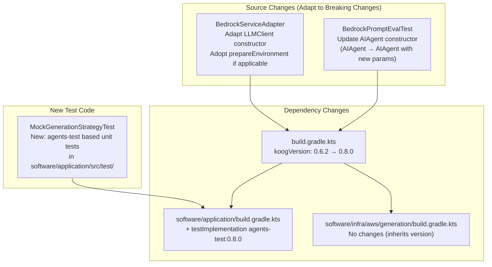
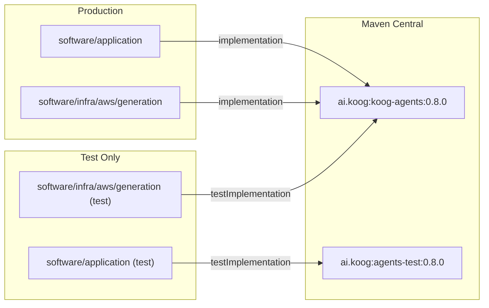

# Design Document: Koog Upgrade and Review

## Overview

This design covers upgrading the Koog AI agent framework from 0.6.2 to 0.8.0 and performing a comprehensive review of how MockNest Serverless uses Koog. The upgrade spans six areas: (1) version bump and breaking change adaptation, (2) usage pattern alignment with 0.8.0 best practices, (3) eval-driven development setup review, (4) clean architecture boundary verification, (5) current agent unit testing review, and (6) adoption of the Koog `agents-test` module for strategy-level unit testing with mock LLMs.

The upgrade is a non-functional change: production behavior remains identical. The primary deliverables are updated dependencies, adapted API calls, new agent-level unit tests, and documented review findings.

### Key Koog 0.8.0 Changes (Research Summary)

Based on the [Koog 0.8.0 release notes](https://github.com/JetBrains/koog/releases):

**Breaking Changes:**
- **LLMProvider singletons restored** — Restored LLMProvider singletons and fixed reified type inference. This may affect custom provider implementations but is unlikely to impact MockNest since it uses `BedrockLLMClient` directly.

**Relevant Improvements:**
- **LLMClient constructor decoupling** — Decoupled `LLMClient` constructors from Ktor for improved flexibility (#1742). This affects how `BedrockLLMClient` is instantiated.
- **Environment creation abstraction** — Extracted environment creation into `prepareEnvironment` method in agent implementations (#1790). This provides a hook for customizing agent environment setup.
- **DataDog LLM Observability** — Added DataDog LLM Observability exporter with response metadata forwarding (#1591). Worth evaluating as a potential replacement/complement for the custom `TokenUsageCapturingClient`.

**From 0.7.3 (intermediate release):**
- **Bedrock prompt caching** — Added `CacheControl` property on messages within the Prompt and integrated explicit cache blocks in the Bedrock Converse API (#1583). MockNest could benefit from this for repeated system prompts.

**agents-test Module:**
The `agents-test` module (documented at [api.koog.ai](https://api.koog.ai/agents/agents-test/index.html)) provides:
- `getMockExecutor()` — Creates a mock LLM executor with a DSL for defining responses
- `mockLLMAnswer()` / `mockLLMToolCall()` — Mock LLM text responses and tool calls
- `withTesting()` — Enables testing mode on agents for graph structure validation
- `testGraph {}` — DSL for asserting graph structure, node behavior, and edge connections

## Architecture

The upgrade preserves the existing clean architecture. No new modules or layers are introduced. The changes are confined to:



### Impact Analysis

| Component | Change Type | Risk |
|---|---|---|
| `build.gradle.kts` (root) | Version bump `0.6.2` → `0.8.0` | Low — single line change |
| `software/application/build.gradle.kts` | Add `agents-test` dependency | Low — test-only dependency |
| `BedrockServiceAdapter` | Adapt `BedrockLLMClient` constructor, potentially adopt `prepareEnvironment` | Medium — breaking API change |
| `BedrockPromptEvalTest` | Update `AIAgent` constructor (used for LLM judge) | Medium — test code only |
| `ModelConfiguration` | Verify `BedrockModels` / `withInferenceProfile` API unchanged | Low — likely no changes needed |
| `MockGenerationFunctionalAgent` | Verify strategy DSL API unchanged | Low — likely no changes needed |
| `AIModelServiceInterface` | Verify `AIAgentGraphStrategy` type signature unchanged | Low — likely no changes needed |
| New: `MockGenerationStrategyTest` | New test file using `agents-test` | None — additive only |

## Components and Interfaces

### Affected Components

#### 1. BedrockServiceAdapter (Infrastructure Layer)

**Current state:** Creates `BedrockLLMClient` and `SingleLLMPromptExecutor` lazily. Uses `GraphAIAgent` with `AIAgentConfig.withSystemPrompt()`.

**Required changes for 0.8.0:**
- **LLMClient constructor**: The `BedrockLLMClient` constructor has been decoupled from Ktor. The current instantiation `BedrockLLMClient(bedrockClient, apiMethod = apiMethod)` may need parameter adjustments depending on the new constructor signature.
- **prepareEnvironment**: Evaluate whether the new `prepareEnvironment` abstraction in agent implementations provides value for MockNest's use case. Since MockNest uses `GraphAIAgent` directly (not a custom agent subclass), this change likely has no impact.
- **LLMProvider singletons**: Since MockNest creates `BedrockLLMClient` directly rather than going through `LLMProvider`, this breaking change is unlikely to affect us.

```kotlin
// Current (0.6.2)
private val executor by lazy {
    SingleLLMPromptExecutor(BedrockLLMClient(bedrockClient, apiMethod = apiMethod))
}

// After upgrade (0.8.0) — adapt constructor if signature changed
private val executor by lazy {
    SingleLLMPromptExecutor(BedrockLLMClient(bedrockClient, apiMethod = apiMethod))
    // ^ May need additional/different parameters based on Ktor decoupling
}
```

#### 2. BedrockPromptEvalTest (Test Infrastructure)

**Current state:** Uses `AIAgent(promptExecutor, llmModel, systemPrompt, toolRegistry)` constructor for the LLM judge.

**Required changes for 0.8.0:**
- The `AIAgent` constructor may have changed. The eval test creates an `AIAgent` directly for the LLM-as-a-judge pattern. This needs to be updated to match the 0.8.0 API.

```kotlin
// Current (0.6.2)
val judgeAgent = AIAgent(
    promptExecutor = judgeExecutor,
    llmModel = modelConfiguration.getModel(),
    systemPrompt = "You are an evaluation judge...",
    toolRegistry = ToolRegistry.EMPTY
)

// After upgrade (0.8.0) — adapt to new constructor
// May need AIAgentConfig-based construction instead
```

#### 3. MockGenerationFunctionalAgent (Application Layer)

**Current state:** Uses `strategy<Input, Output>("name") { ... }` DSL with `node`, `edge`, `forwardTo`, `onCondition`, `transformed`, `llm.writeSession`.

**Expected impact:** The strategy DSL is a core Koog API that is unlikely to have breaking changes. The `strategy` builder, `node`, `edge`, `forwardTo`, `onCondition`, and `transformed` functions should remain stable. Verify at compile time.

#### 4. ModelConfiguration (Infrastructure Layer)

**Current state:** Uses `BedrockModels` constants via reflection and `withInferenceProfile()` extension.

**Expected impact:** `BedrockModels` constants and `withInferenceProfile` are part of the Bedrock client module. The 0.8.0 release notes don't mention changes to these. Verify at compile time.

#### 5. New: MockGenerationStrategyTest (Application Layer — Test)

**New component** that uses the `agents-test` module to test the `MockGenerationFunctionalAgent` strategy graph with mock LLM responses.

```kotlin
// Conceptual structure
class MockGenerationStrategyTest {
    // Use getMockExecutor() to create mock LLM
    // Use withTesting() to enable graph validation
    // Test node sequences for different scenarios
    // Verify prompt content sent to LLM
    // Verify error handling paths
}
```

### Interface Changes

The `AIModelServiceInterface` should remain unchanged. Its method signatures use `AIAgentGraphStrategy<Input, Output>` which is a core Koog type. If the 0.8.0 upgrade changes this type's package or signature, the interface and all implementations must be updated consistently.

```kotlin
// Expected to remain unchanged
interface AIModelServiceInterface {
    suspend fun <Input, Output> runStrategy(
        strategy: AIAgentGraphStrategy<Input, Output>,
        input: Input
    ): Output
    // ... other methods unchanged
}
```

### Bedrock Prompt Caching Evaluation

Koog 0.7.3 introduced Bedrock prompt caching via `CacheControl` on messages. MockNest sends a system prompt on every agent invocation. Since the system prompt is identical across invocations for the same model, prompt caching could reduce input token costs by caching the system prompt. However, this is an optimization opportunity for a future iteration, not a requirement for this upgrade. The design recommends documenting this finding and deferring adoption.

### DataDog LLM Observability Evaluation

Koog 0.8.0 added DataDog LLM Observability. MockNest's `TokenUsageCapturingClient` serves a similar purpose (capturing token usage) but is simpler and test-scoped. Since MockNest doesn't use DataDog, the custom approach remains appropriate. The design recommends keeping `TokenUsageCapturingClient` as-is.

## Data Models

No data model changes are required. All domain types (`GeneratedMock`, `GenerationResult`, `MockMetadata`, `EndpointInfo`, `SourceType`, `MockNamespace`, `SpecWithDescriptionRequest`, etc.) are Koog-independent and remain unchanged.

The only type that crosses the Koog boundary is `AIAgentGraphStrategy<Input, Output>` in the `AIModelServiceInterface`. If Koog 0.8.0 changes this type's package, the import statement must be updated, but the type itself is expected to remain structurally identical.

### Dependency Graph (After Upgrade)



## Correctness Properties

*A property is a characteristic or behavior that should hold true across all valid executions of a system — essentially, a formal statement about what the system should do. Properties serve as the bridge between human-readable specifications and machine-verifiable correctness guarantees.*

### Property 1: Cost calculation is linear in token counts

*For any* non-negative integer pair (inputTokens, outputTokens), `CostCalculator.calculateCost(inputTokens, outputTokens)` SHALL equal `inputTokens * inputPricePerToken + outputTokens * outputPricePerToken`.

**Validates: Requirements 3.2**

### Property 2: Domain layer contains no cloud or framework imports

*For any* Kotlin source file in `software/domain/src/main/kotlin/`, the file SHALL NOT contain import statements from `ai.koog`, `aws.sdk.kotlin`, or `com.amazonaws` packages.

**Validates: Requirements 4.1**

### Property 3: Application layer contains no cloud-specific imports

*For any* Kotlin source file in `software/application/src/main/kotlin/`, the file SHALL NOT contain import statements from `aws.sdk.kotlin`, `com.amazonaws`, or `ai.koog.prompt.executor.clients.bedrock` packages.

**Validates: Requirements 4.2**

### Property 4: Strategy graph traversal follows correct node sequence

*For any* valid generation request, the strategy graph SHALL follow the correct node sequence based on the request configuration: (a) when validation is disabled, the sequence is setup → generate → finish; (b) when validation is enabled and the first generation produces errors, the sequence includes the correction node before finishing.

**Validates: Requirements 6.3, 6.4**

### Property 5: Prompt content includes specification context

*For any* valid specification (with title, endpoints, and format) and description string, the prompt sent to the LLM during the generate node SHALL contain the specification title, the user-provided description, and the namespace.

**Validates: Requirements 6.5**

### Property 6: Parse failures trigger correction path

*For any* LLM response that cannot be parsed as valid JSON (neither raw, markdown-wrapped, nor regex-extractable), the agent SHALL set `parseFailure = true` in the context and traverse to the correction node (when retries remain).

**Validates: Requirements 6.6**

### Property 7: GenerationResult contains complete metadata

*For any* completed generation (success or failure), the `GenerationResult.metadata` map SHALL contain the keys `totalGenerated`, `attempts`, and `validationSkipped` (when validation is disabled) or `allValid`, `firstPassValid`, `firstPassMocksGenerated`, `firstPassMocksValid`, `mocksDropped`, and `validationErrors` (when validation is enabled).

**Validates: Requirements 6.7, 8.1**

### Property 8: JSON extraction is format-agnostic

*For any* valid JSON array of WireMock mappings, `parseModelResponse` SHALL extract the same mocks regardless of whether the JSON is provided as raw JSON, wrapped in markdown code blocks (` ```json ... ``` `), or embedded within surrounding text.

**Validates: Requirements 8.2**

### Property 9: GeneratedMock follows consistent naming and metadata format

*For any* valid WireMock mapping JSON node with a `request.method`, `request.url` (or `request.urlPattern`), and `response.status`, `createGeneratedMock` SHALL produce a `GeneratedMock` with: (a) an ID matching the pattern `ai-generated-{namespace}-{method}-{path}-{index}`, (b) a name matching `AI Generated: {METHOD} {path}`, and (c) metadata containing `sourceType`, `sourceReference`, and tags including `ai-generated`.

**Validates: Requirements 8.3**

### Property 10: Model name resolution falls back to AmazonNovaPro

*For any* string that does not correspond to a valid `BedrockModels` property name, `ModelConfiguration.getModel()` SHALL return the `AmazonNovaPro` model as a fallback. *For any* valid `BedrockModels` property name, it SHALL return the corresponding `LLModel`.

**Validates: Requirements 8.4**

## Error Handling

### Upgrade Compilation Errors

When the Koog version is bumped from 0.6.2 to 0.8.0, compilation errors are expected due to breaking changes. The approach is:

1. **Bump version first** — Change the version string in `build.gradle.kts`
2. **Compile and collect errors** — Run `./gradlew compileKotlin` to identify all affected files
3. **Fix errors systematically** — Address each compilation error by consulting the [Koog 0.8.0 release notes](https://github.com/JetBrains/koog/releases) and [API documentation](https://api.koog.ai/)
4. **Run tests** — Verify all existing tests pass after fixes

### Dependency Resolution Errors

If `ai.koog:agents-test:0.8.0` is not available on Maven Central, fall back to the version that matches the `koog-agents` artifact. The `agents-test` module has been published since at least 0.1.0-beta (visible on [Maven Central](https://repo1.maven.org/maven2/ai/koog/agents-test-jvm/)).

### Eval Test Compatibility

If the Dokimos Koog integration (`dev.dokimos:dokimos-koog`) is incompatible with Koog 0.8.0, the eval test will fail to compile. In that case:
1. Check for a newer Dokimos version compatible with Koog 0.8.0
2. If no compatible version exists, temporarily exclude the Dokimos Koog dependency and adapt the LLM judge to use Koog directly
3. Document the incompatibility and track resolution

### agents-test Module Integration

If the `agents-test` module's `getMockExecutor` or `withTesting` APIs don't support `GraphAIAgent` (only `AIAgent`), the new tests will need to:
1. Construct a `GraphAIAgent` with the mock executor from `agents-test`
2. Use the mock executor's response matching DSL to simulate LLM responses
3. Verify behavior through the agent's output rather than graph structure assertions

## Testing Strategy

### Dual Testing Approach

This feature uses both unit tests and property-based tests:

- **Unit tests**: Verify specific upgrade scenarios (compilation, API adaptation, eval test compatibility)
- **Property-based tests**: Verify universal properties that must hold after the upgrade (clean architecture boundaries, output format consistency, graph traversal correctness)

### Property-Based Testing Configuration

- **Library**: JUnit 6 `@ParameterizedTest` with `@MethodSource` and `@ValueSource` for deterministic property testing, following the project's existing pattern
- **Minimum iterations**: 10-20 diverse examples per property test
- **Tag format**: `Feature: koog-upgrade-and-review, Property {number}: {property_text}`

### Test Categories

| Category | Tests | Location |
|---|---|---|
| Build verification | `./gradlew clean test` passes | CI/CD |
| Clean architecture boundaries | Property tests scanning source files for prohibited imports | `software/application/src/test/` |
| Agent strategy graph tests | New tests using `agents-test` mock LLM | `software/application/src/test/` |
| BedrockServiceAdapter tests | Existing + adapted unit tests | `software/infra/aws/generation/src/test/` |
| CostCalculator property test | Arithmetic property verification | `software/infra/aws/generation/src/test/` |
| Model resolution tests | Existing + adapted unit tests | `software/infra/aws/generation/src/test/` |
| Eval test compatibility | Manual run with `BEDROCK_EVAL_ENABLED=true` | `software/infra/aws/generation/src/test/` |
| Coverage verification | `./gradlew koverVerify` (80%+ enforced, 90%+ goal) | CI/CD |

### New Test: MockGenerationStrategyTest

This is the primary new test file, using the `agents-test` module:

```kotlin
class MockGenerationStrategyTest {
    // Dependencies mocked with MockK (non-LLM)
    private val specificationParser: SpecificationParserInterface = mockk()
    private val mockValidator: MockValidatorInterface = mockk()
    private val promptBuilder: PromptBuilderService = mockk()

    // LLM mocked with agents-test getMockExecutor
    // Tests:
    // 1. Happy path: validation disabled → setup → generate → finish
    // 2. Happy path: validation enabled, all valid → setup → generate → validate → finish
    // 3. Correction path: validation enabled, errors → setup → generate → validate → correct → validate → finish
    // 4. Parse failure path: LLM returns non-JSON → parseFailure=true → correction
    // 5. Prompt content: verify prompt contains spec title, description, namespace
    // 6. Metadata completeness: verify GenerationResult.metadata keys
}
```

### Existing Tests: Adaptation Only

Existing tests should require minimal changes:
- `MockGenerationFunctionalAgentTest` — Mocks at `AIModelServiceInterface` boundary, should pass unchanged unless `runStrategy` signature changes
- `BedrockServiceAdapterTest` — May need constructor adaptation for `BedrockLLMClient`
- `ModelConfigurationTest` — Should pass unchanged unless `BedrockModels` API changes
- `BedrockPromptEvalTest` — Needs `AIAgent` constructor update for the LLM judge

### Review Documentation

The review findings will be documented as:
1. **Commit messages** — Each commit describes the specific Koog API change and adaptation
2. **Code comments** — Inline comments where API usage changed, explaining the 0.8.0 pattern
3. **CHANGELOG.md** — Entry documenting the Koog upgrade and any behavioral observations
