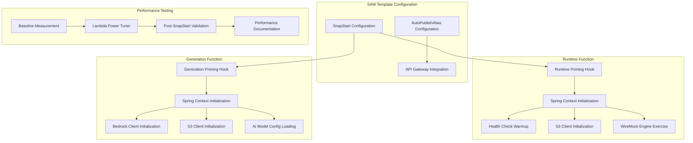
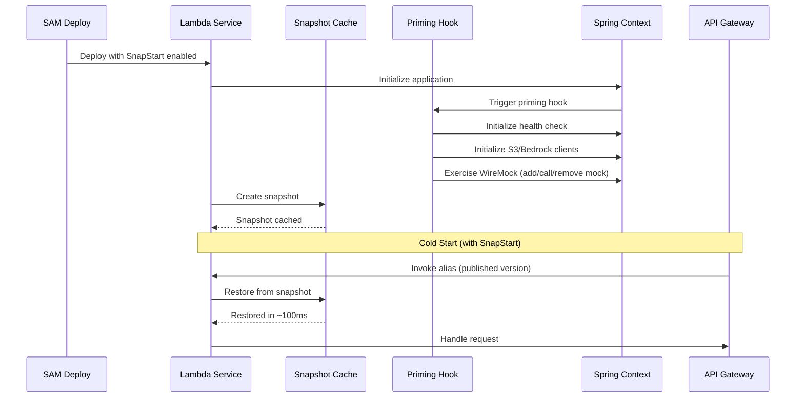

# Design Document: Lambda SnapStart Optimization

## Overview

This design implements AWS Lambda SnapStart optimization for both MockNest Serverless Lambda functions (runtime and generation) to reduce cold start times. SnapStart is a Java-specific Lambda feature that creates pre-initialized snapshots of the Lambda execution environment, significantly reducing cold start latency by eliminating the need to initialize the JVM, load classes, and bootstrap the Spring application context on every cold start.

The implementation includes:
- SAM template configuration for SnapStart with AutoPublishAlias
- API Gateway integration updates to invoke published Lambda versions (required for SnapStart)
- Priming hook implementation using Spring Boot lifecycle events to warm up resources during snapshot creation
- Comprehensive WireMock exercise during priming (create mock, call mock, remove mock) to warm up the full request/response cycle
- Comprehensive performance testing methodology using AWS Lambda Power Tuner
- Performance documentation capturing baseline metrics, post-optimization results, and testing procedures

### Key Benefits

- **Reduced Cold Start Times**: SnapStart can reduce Java Lambda cold starts from several seconds to sub-second latency
- **Improved User Experience**: Faster response times for first requests after scaling events
- **Cost Optimization**: Reduced initialization time means lower Lambda execution duration charges
- **Production Readiness**: Comprehensive performance validation ensures optimization effectiveness

### SnapStart Fundamentals

SnapStart works by:
1. Creating a snapshot of the initialized Lambda execution environment after the initialization phase
2. Caching the snapshot for reuse across cold starts
3. Restoring from the cached snapshot instead of re-initializing from scratch

**Critical Requirement**: SnapStart only works with published Lambda versions, not $LATEST. This requires:
- Configuring AutoPublishAlias to automatically publish new versions
- Updating API Gateway to invoke the alias (which points to published versions) instead of $LATEST

## Architecture

### Component Overview



### SnapStart Lifecycle



## Components and Interfaces

### 1. SAM Template Configuration

**Purpose**: Configure SnapStart and AutoPublishAlias for both Lambda functions

**Configuration Structure**:
```yaml
Resources:
  MockNestRuntimeFunction:
    Type: AWS::Serverless::Function
    Properties:
      # ... existing properties ...
      AutoPublishAlias: live
      SnapStart:
        ApplyOn: PublishedVersions
      Events:
        AdminRoutes:
          Properties:
            # Update to invoke alias instead of $LATEST
            # SAM automatically configures this when AutoPublishAlias is set

  MockNestGenerationFunction:
    Type: AWS::Serverless::Function
    Properties:
      # ... existing properties ...
      AutoPublishAlias: live
      SnapStart:
        ApplyOn: PublishedVersions
      Events:
        AIRoutes:
          Properties:
            # Update to invoke alias instead of $LATEST
```

**Key Configuration Elements**:
- `AutoPublishAlias: live` - Automatically publishes a new version on each deployment and creates/updates an alias named "live"
- `SnapStart.ApplyOn: PublishedVersions` - Enables SnapStart for published versions
- API Gateway events automatically integrate with the alias when AutoPublishAlias is configured

**CloudFormation Outputs**:
```yaml
Outputs:
  RuntimeFunctionVersion:
    Description: "Published version of Runtime function with SnapStart"
    Value: !Ref MockNestRuntimeFunction.Version
    
  RuntimeFunctionAlias:
    Description: "Alias pointing to latest published version"
    Value: !Ref MockNestRuntimeFunctionAliaslive
    
  GenerationFunctionVersion:
    Description: "Published version of Generation function with SnapStart"
    Value: !Ref MockNestGenerationFunction.Version
    
  GenerationFunctionAlias:
    Description: "Alias pointing to latest published version"
    Value: !Ref MockNestGenerationFunctionAliaslive
```

### 2. Priming Hook Implementation

**Purpose**: Execute initialization code during SnapStart snapshot creation to warm up resources

**Implementation Approach**: Use Spring Boot's `ApplicationReadyEvent` to trigger priming logic

**Interface**:
```kotlin
interface PrimingHook {
    /**
     * Execute priming logic during SnapStart snapshot creation
     * This method is called after Spring context is fully initialized
     */
    suspend fun prime()
}
```

**Runtime Function Priming**:

The Runtime function priming exercises all expensive initialization operations:
- **Health Check Warmup**: Initializes health check endpoint and dependencies
- **S3 Client Initialization**: Establishes S3 client connections for object storage
- **WireMock Engine Exercise**: Comprehensively warms up the full WireMock request/response cycle:
  - **NormalizeMappingBodyFilter**: Processes mapping JSON, extracts bodies, saves to S3, modifies mapping structure
  - **ObjectStorageBlobStore**: Handles file storage with Base64 encoding/decoding and content-type detection
  - **ObjectStorageMappingsSource**: Loads mappings from S3 with concurrent streaming and JSON deserialization
  - **DeleteAllMappingsAndFilesFilter**: Handles bulk deletion with prefix-based listing
  - **Request Matching**: Exercises query parameter handling and URL matching
  - **Response Generation**: Exercises body retrieval and content-type handling

```kotlin
@Component
class RuntimePrimingHook(
    private val healthCheckService: HealthCheckService,
    private val s3Client: S3Client,
    private val wireMockAdminClient: WireMockAdminClient
) : PrimingHook {
    
    private val logger = KotlinLogging.logger {}
    
    @EventListener(ApplicationReadyEvent::class)
    suspend fun onApplicationReady() {
        if (isSnapStartEnvironment()) {
            logger.info { "SnapStart detected - executing priming hook" }
            prime()
        }
    }
    
    override suspend fun prime() {
        runCatching {
            // Warm up health check endpoint
            healthCheckService.checkHealth()
            logger.info { "Health check primed successfully" }
            
            // Initialize S3 client connections
            s3Client.listBuckets()
            logger.info { "S3 client primed successfully" }
            
            // Exercise WireMock engine comprehensively
            exerciseWireMock()
            logger.info { "WireMock engine primed successfully" }
            
        }.onFailure { exception ->
            // Log but don't fail snapshot creation
            logger.warn(exception) { "Priming completed with warnings" }
        }
    }
    
    private suspend fun exerciseWireMock() {
        val testMappingId = "snapstart-priming-test-${System.currentTimeMillis()}"
        
        runCatching {
            // 1. Create a test mock mapping with a JSON body via WireMock admin API
            // This exercises:
            // - NormalizeMappingBodyFilter (body extraction, S3 storage, mapping modification)
            // - ObjectStorageBlobStore (file storage with Base64 encoding/decoding)
            // - ObjectStorageMappingsSource (mapping persistence to S3)
            val testMapping = """
            {
              "id": "$testMappingId",
              "request": {
                "method": "GET",
                "url": "/__snapstart_priming_test",
                "queryParameters": {
                  "test": {
                    "equalTo": "snapstart"
                  }
                }
              },
              "response": {
                "status": 200,
                "headers": {
                  "Content-Type": "application/json"
                },
                "body": "{\"status\":\"priming\",\"timestamp\":${System.currentTimeMillis()}}"
              }
            }
            """.trimIndent()
            
            wireMockAdminClient.addStubMapping(testMapping)
            logger.debug { "Created test mapping with JSON body: $testMappingId" }
            
            // 2. Verify the mock was stored in S3 by retrieving it
            // This exercises:
            // - ObjectStorageMappingsSource read path (prefix-based listing, concurrent streaming)
            // - S3 listPrefix operation with filtering
            // - JSON deserialization of StubMapping objects
            val retrievedMapping = wireMockAdminClient.getStubMapping(testMappingId)
            if (retrievedMapping != null) {
                logger.debug { "Verified test mapping was persisted to S3" }
            }
            
            // 3. Call the mock endpoint to verify request matching and response generation
            // This exercises:
            // - Request matching with query parameters
            // - Response body retrieval from ObjectStorageBlobStore
            // - File extension detection and content-type handling
            wireMockAdminClient.invokeStub("/__snapstart_priming_test?test=snapstart")
            logger.debug { "Invoked test mapping successfully" }
            
            // 4. Remove the test mock mapping
            // This exercises:
            // - DeleteAllMappingsAndFilesFilter deletion logic
            // - ObjectStorageBlobStore file deletion
            // - ObjectStorageMappingsSource mapping removal
            wireMockAdminClient.removeStubMapping(testMappingId)
            logger.debug { "Removed test mapping: $testMappingId" }
            
        }.onFailure { exception ->
            logger.warn(exception) { "WireMock exercise failed - continuing with snapshot creation" }
        }
    }
    
    private fun isSnapStartEnvironment(): Boolean {
        return System.getenv("AWS_LAMBDA_INITIALIZATION_TYPE") == "snap-start"
    }
}
```

**Generation Function Priming**:
```kotlin
@Component
class GenerationPrimingHook(
    private val bedrockClient: BedrockRuntimeClient,
    private val s3Client: S3Client,
    private val modelConfig: BedrockModelConfig
) : PrimingHook {
    
    private val logger = KotlinLogging.logger {}
    
    @EventListener(ApplicationReadyEvent::class)
    suspend fun onApplicationReady() {
        if (isSnapStartEnvironment()) {
            logger.info { "SnapStart detected - executing priming hook" }
            prime()
        }
    }
    
    override suspend fun prime() {
        runCatching {
            // Initialize Bedrock client
            // Note: Actual model invocation is expensive, just initialize client
            logger.info { "Bedrock client initialized for model: ${modelConfig.modelName}" }
            
            // Initialize S3 client connections
            s3Client.listBuckets()
            logger.info { "S3 client primed successfully" }
            
            // Load AI model configuration
            modelConfig.validate()
            logger.info { "AI model configuration loaded successfully" }
            
        }.onFailure { exception ->
            // Log but don't fail snapshot creation
            logger.warn(exception) { "Priming completed with warnings" }
        }
    }
    
    private fun isSnapStartEnvironment(): Boolean {
        return System.getenv("AWS_LAMBDA_INITIALIZATION_TYPE") == "snap-start"
    }
}
```

**Priming Design Principles**:
1. **Non-blocking**: Priming should complete within Lambda initialization timeout (10 seconds)
2. **Graceful degradation**: Failures in non-critical priming steps should not prevent snapshot creation
3. **Comprehensive warmup**: Exercise all critical code paths including:
   - **WireMock engine**: Full request/response cycle with body normalization
   - **Mapping storage**: Create, read, and delete operations via ObjectStorageMappingsSource
   - **File storage**: Body externalization and retrieval via ObjectStorageBlobStore
   - **Request matching**: Query parameter handling and URL matching
   - **Response generation**: Body retrieval with content-type handling
4. **Logging**: Comprehensive logging for debugging priming behavior
5. **Environment detection**: Only execute priming in SnapStart environments
6. **Cleanup**: Remove test artifacts created during priming to avoid polluting production state

### 3. Performance Testing Framework

**Purpose**: Establish baseline metrics and validate SnapStart improvements

**Lambda Power Tuner Integration**:
- Deploy Lambda Power Tuner from AWS Serverless Application Repository
- Configure test payloads for each function
- Execute power tuning across memory configurations (512MB-3072MB)
- Analyze results to identify optimal configuration

**Test Payloads**:
```json
// Runtime Function Test Payload
{
  "resource": "/__admin/health",
  "path": "/__admin/health",
  "httpMethod": "GET",
  "headers": {
    "x-api-key": "${API_KEY}"
  }
}

// Generation Function Test Payload
{
  "resource": "/ai/generation/health",
  "path": "/ai/generation/health",
  "httpMethod": "GET",
  "headers": {
    "x-api-key": "${API_KEY}"
  }
}
```

**Metrics Collection**:
- Cold start time (INIT_DURATION from CloudWatch Logs)
- Warm execution time (DURATION from CloudWatch Logs)
- Memory utilization (MAX_MEMORY_USED from CloudWatch Logs)
- Cost per invocation (calculated from Lambda pricing)

### 4. API Gateway Integration

**Purpose**: Ensure API Gateway invokes published Lambda versions through aliases

**Integration Configuration**:
When `AutoPublishAlias` is configured in SAM template, SAM automatically:
- Creates a Lambda alias pointing to the latest published version
- Configures API Gateway to invoke the alias instead of $LATEST
- Updates the alias to point to new versions on each deployment

**Verification**:
```bash
# Verify API Gateway integration points to alias
aws apigateway get-integration \
  --rest-api-id ${API_ID} \
  --resource-id ${RESOURCE_ID} \
  --http-method GET

# Expected output should show URI ending with :live (alias name)
# arn:aws:apigateway:region:lambda:path/2015-03-31/functions/arn:aws:lambda:region:account:function:function-name:live/invocations
```

## Data Models

### Performance Metrics Model

```kotlin
data class PerformanceMetrics(
    val functionName: String,
    val memoryConfiguration: Int,
    val coldStartTimeMs: Double,
    val warmExecutionTimeMs: Double,
    val memoryUsedMB: Int,
    val costPerInvocation: Double,
    val snapStartEnabled: Boolean,
    val timestamp: Instant
)

data class PerformanceComparison(
    val baseline: PerformanceMetrics,
    val optimized: PerformanceMetrics,
    val coldStartImprovement: Double, // Percentage
    val warmExecutionChange: Double, // Percentage
    val costImpact: Double // Percentage
)
```

### SnapStart Configuration Model

```kotlin
data class SnapStartConfig(
    val enabled: Boolean,
    val applyOn: String, // "PublishedVersions" or "None"
    val autoPublishAlias: String? // Alias name, e.g., "live"
)

data class FunctionConfig(
    val functionName: String,
    val memorySize: Int,
    val timeout: Int,
    val snapStart: SnapStartConfig,
    val environment: Map<String, String>
)
```


## Correctness Properties

*A property is a characteristic or behavior that should hold true across all valid executions of a system-essentially, a formal statement about what the system should do. Properties serve as the bridge between human-readable specifications and machine-verifiable correctness guarantees.*


### Property Reflection

Reviewing all testable properties from prework to eliminate redundancy:

**Configuration Properties (Requirements 2.1-2.9)**:
- All are specific examples verifying deployment configuration
- These are one-time verification checks, not properties that need to hold across multiple inputs
- Keep as integration test examples, not properties

**Priming Properties (Requirements 3.1-3.7, 4.1-4.8)**:
- 3.5 and 4.6 are identical: "priming logic SHALL complete within Lambda initialization timeout limits"
- Can be combined into one property: "For any Lambda function with priming, initialization SHALL complete within timeout"
- 3.7 and 4.8 are identical: "priming logic SHALL NOT fail snapshot creation if non-critical resources are unavailable"
- Can be combined into one property: "For any Lambda function with priming, non-critical resource failures SHALL NOT prevent snapshot creation"
- Other priming criteria (3.1-3.4, 3.6, 4.1-4.5, 4.7) are specific examples, not properties

**Functional Correctness Properties (Requirements 8.1-8.7)**:
- 8.1 and 8.2 both verify Runtime function correctness - can be combined
- 8.3 and 8.4 both verify Generation function correctness - can be combined
- 8.6 and 8.7 verify infrastructure integration - these are subsumed by 8.1-8.4 if those functions work correctly

**Final Property Set**:
1. Priming timeout property (combines 3.5 and 4.6)
2. Priming resilience property (combines 3.7 and 4.8)
3. Runtime function correctness property (combines 8.1, 8.2, 8.6, 8.7)
4. Generation function correctness property (combines 8.3, 8.4, 8.6, 8.7)

### Property 1: Priming Initialization Timeout

*For any* Lambda function with SnapStart priming enabled, the priming initialization SHALL complete within the Lambda initialization timeout limit (10 seconds).

**Validates: Requirements 3.5, 4.6**

### Property 2: Priming Resilience to Non-Critical Failures

*For any* Lambda function with SnapStart priming enabled, failures in non-critical resource initialization (such as health check warmup or client pre-connection) SHALL NOT prevent successful snapshot creation.

**Validates: Requirements 3.7, 4.8**

### Property 3: Runtime Function Correctness with SnapStart

*For any* valid request to the Runtime function (mock serving or WireMock admin API), when SnapStart is enabled, the function SHALL return the same correct response as it would without SnapStart, and S3 persistence and API Gateway integration SHALL continue to function correctly.

**Validates: Requirements 8.1, 8.2, 8.6, 8.7**

### Property 4: Generation Function Correctness with SnapStart

*For any* valid request to the Generation function (mock generation from specifications or Bedrock interaction), when SnapStart is enabled, the function SHALL return the same correct response as it would without SnapStart, and S3 persistence and API Gateway integration SHALL continue to function correctly.

**Validates: Requirements 8.3, 8.4, 8.6, 8.7**

## Error Handling

### Priming Hook Error Handling

**Graceful Degradation Strategy**:
- Priming hooks use `runCatching` to wrap all initialization operations
- Failures in non-critical operations (health check warmup, client pre-connection) are logged as warnings but do not throw exceptions
- Critical failures (Spring context initialization) are allowed to fail snapshot creation
- All errors include contextual information in log messages for debugging

**Error Categories**:

1. **Critical Errors** (fail snapshot creation):
   - Spring application context initialization failure
   - Missing required environment variables
   - Invalid configuration that prevents function execution

2. **Non-Critical Errors** (log warning, continue):
   - Health check endpoint unavailable during priming
   - S3 bucket not accessible during priming (may not exist yet)
   - WireMock admin API unavailable during priming
   - Test mock creation/invocation/deletion failures during priming
   - Bedrock client connection timeout during priming
   - Model configuration validation warnings

**Error Logging Pattern**:
```kotlin
runCatching {
    // Priming operation
}.onFailure { exception ->
    logger.warn(exception) { 
        "Priming operation failed: ${operation.name}, " +
        "function=${functionName}, " +
        "snapStartEnabled=${isSnapStartEnvironment()}"
    }
}
```

### SAM Template Deployment Errors

**Configuration Validation**:
- SAM validates SnapStart configuration during deployment
- Invalid configurations (e.g., SnapStart without AutoPublishAlias) fail at deployment time
- CloudFormation rollback ensures consistent state

**Common Error Scenarios**:
1. **SnapStart not supported in region**: Deployment fails with clear error message
2. **Insufficient IAM permissions**: Deployment fails with permission error
3. **API Gateway integration misconfiguration**: Deployment fails during API Gateway setup

### Performance Testing Errors

**Lambda Power Tuner Errors**:
- Invalid test payload: Tuner execution fails with validation error
- Function timeout during testing: Results show timeout, not failure
- Insufficient permissions: Tuner cannot invoke function

**Mitigation**:
- Validate test payloads before running tuner
- Set appropriate timeout values for testing
- Document required IAM permissions in PERFORMANCE.md

## Testing Strategy

### Dual Testing Approach

This feature requires both automated testing and manual performance validation:

**Automated Testing** (Unit + Integration Tests):
- Unit tests for priming hook logic
- Integration tests for SnapStart configuration verification
- Functional correctness tests to ensure no regressions

**Manual Testing** (Performance Validation):
- Lambda Power Tuner execution (requires AWS console/CLI)
- Cold start measurement (requires forcing Lambda scale-to-zero)
- Performance comparison and analysis

### Unit Testing

**Priming Hook Unit Tests**:
```kotlin
class RuntimePrimingHookTest {
    private val mockHealthCheckService: HealthCheckService = mockk(relaxed = true)
    private val mockS3Client: S3Client = mockk(relaxed = true)
    private val mockWireMock: WireMock = mockk(relaxed = true)
    private val primingHook = RuntimePrimingHook(mockHealthCheckService, mockS3Client, mockWireMock)
    
    @Test
    suspend fun `Given SnapStart environment When priming executes Then should initialize all components`() {
        // Arrange
        coEvery { mockHealthCheckService.checkHealth() } returns HealthStatus.UP
        coEvery { mockS3Client.listBuckets() } returns ListBucketsResponse { }
        every { mockWireMock.register(any()) } just Runs
        every { mockWireMock.removeStubMapping(any()) } just Runs
        
        // Act
        primingHook.prime()
        
        // Assert
        coVerify { mockHealthCheckService.checkHealth() }
        coVerify { mockS3Client.listBuckets() }
        verify { mockWireMock.register(any()) }
        verify { mockWireMock.removeStubMapping(any()) }
    }
    
    @Test
    suspend fun `Given health check fails When priming executes Then should log warning and continue`() {
        // Arrange
        coEvery { mockHealthCheckService.checkHealth() } throws RuntimeException("Service unavailable")
        coEvery { mockS3Client.listBuckets() } returns ListBucketsResponse { }
        every { mockWireMock.register(any()) } just Runs
        every { mockWireMock.removeStubMapping(any()) } just Runs
        
        // Act & Assert - should not throw
        primingHook.prime()
        
        // Verify S3 and WireMock initialization still attempted
        coVerify { mockS3Client.listBuckets() }
        verify { mockWireMock.register(any()) }
    }
    
    @Test
    suspend fun `Given WireMock fails When priming executes Then should log warning and continue`() {
        // Arrange
        coEvery { mockHealthCheckService.checkHealth() } returns HealthStatus.UP
        coEvery { mockS3Client.listBuckets() } returns ListBucketsResponse { }
        every { mockWireMock.register(any()) } throws RuntimeException("WireMock unavailable")
        
        // Act & Assert - should not throw
        primingHook.prime()
        
        // Verify other components still initialized
        coVerify { mockHealthCheckService.checkHealth() }
        coVerify { mockS3Client.listBuckets() }
    }
}
```

**Configuration Unit Tests**:
```kotlin
class SnapStartConfigTest {
    @Test
    fun `Given valid SnapStart config When validating Then should pass`() {
        val config = SnapStartConfig(
            enabled = true,
            applyOn = "PublishedVersions",
            autoPublishAlias = "live"
        )
        
        assertTrue(config.isValid())
    }
    
    @Test
    fun `Given SnapStart without alias When validating Then should fail`() {
        val config = SnapStartConfig(
            enabled = true,
            applyOn = "PublishedVersions",
            autoPublishAlias = null
        )
        
        assertFalse(config.isValid())
    }
}
```

### Integration Testing

**LocalStack Integration Tests**:
```kotlin
@Testcontainers
class SnapStartIntegrationTest {
    companion object {
        @Container
        @JvmStatic
        private val localStackContainer = LocalStackContainer(
            DockerImageName.parse("localstack/localstack:4.12.0")
        ).withServices(
            LocalStackContainer.Service.LAMBDA,
            LocalStackContainer.Service.S3
        ).waitingFor(
            Wait.forLogMessage(".*Ready.*", 1)
        )
        
        @BeforeAll
        @JvmStatic
        fun setupClass() {
            // Configure Lambda client
            // Deploy test function with SnapStart configuration
        }
    }
    
    @Test
    fun `Given Lambda with SnapStart When querying configuration Then should show SnapStart enabled`() {
        // Query Lambda function configuration
        // Verify SnapStart is enabled
        // Verify alias exists and points to published version
    }
    
    @Test
    fun `Given SnapStart-enabled function When invoking through alias Then should execute successfully`() {
        // Invoke function through alias
        // Verify response is correct
        // Verify CloudWatch logs show SnapStart initialization
    }
}
```

**Functional Correctness Integration Tests**:
- Execute existing MockNest integration test suite against SnapStart-enabled functions
- Verify all mock serving functionality works correctly
- Verify all admin API operations work correctly
- Verify all generation functionality works correctly
- Verify S3 persistence works correctly

### Property-Based Testing

**Property Test Configuration**:
- Use Kotest property testing framework
- Minimum 100 iterations per property test
- Tag each test with feature name and property reference

**Property Test Implementation**:

```kotlin
class SnapStartPropertyTest : FunSpec({
    
    test("Property 1: Priming Initialization Timeout").config(
        tags = setOf(Tag("Feature: lambda-snapstart-optimization"), Tag("Property 1"))
    ) {
        checkAll(100, Arb.snapStartFunction()) { function ->
            // Measure initialization time
            val initDuration = measureInitializationTime(function)
            
            // Verify within timeout
            initDuration shouldBeLessThan 10.seconds
        }
    }
    
    test("Property 2: Priming Resilience to Non-Critical Failures").config(
        tags = setOf(Tag("Feature: lambda-snapstart-optimization"), Tag("Property 2"))
    ) {
        checkAll(100, Arb.snapStartFunction(), Arb.nonCriticalFailure()) { function, failure ->
            // Simulate non-critical failure during priming
            val result = function.primeWithFailure(failure)
            
            // Verify snapshot creation succeeds
            result.snapshotCreated shouldBe true
            result.logs should contain("warning")
        }
    }
    
    test("Property 3: Runtime Function Correctness with SnapStart").config(
        tags = setOf(Tag("Feature: lambda-snapstart-optimization"), Tag("Property 3"))
    ) {
        checkAll(100, Arb.runtimeRequest()) { request ->
            // Execute request with SnapStart enabled
            val snapStartResponse = runtimeFunction.invoke(request, snapStartEnabled = true)
            
            // Execute same request without SnapStart
            val normalResponse = runtimeFunction.invoke(request, snapStartEnabled = false)
            
            // Verify responses are identical
            snapStartResponse shouldBe normalResponse
        }
    }
    
    test("Property 4: Generation Function Correctness with SnapStart").config(
        tags = setOf(Tag("Feature: lambda-snapstart-optimization"), Tag("Property 4"))
    ) {
        checkAll(100, Arb.generationRequest()) { request ->
            // Execute request with SnapStart enabled
            val snapStartResponse = generationFunction.invoke(request, snapStartEnabled = true)
            
            // Execute same request without SnapStart
            val normalResponse = generationFunction.invoke(request, snapStartEnabled = false)
            
            // Verify responses are functionally equivalent
            snapStartResponse.mappings shouldBe normalResponse.mappings
        }
    }
})
```

### Manual Performance Testing

**Lambda Power Tuner Workflow**:

1. **Setup** (one-time):
   - Deploy Lambda Power Tuner from AWS Serverless Application Repository
   - Configure IAM permissions for tuner to invoke test functions
   - Prepare test payloads for each function

2. **Baseline Testing** (before SnapStart):
   - Execute power tuning for Runtime function (512MB-3072MB, 10 invocations per config)
   - Execute power tuning for Generation function (512MB-3072MB, 10 invocations per config)
   - Record cold start times, warm execution times, and costs
   - Identify optimal memory configuration

3. **Post-SnapStart Testing** (after SnapStart implementation):
   - Execute power tuning for Runtime function with SnapStart enabled
   - Execute power tuning for Generation function with SnapStart enabled
   - Record cold start times, warm execution times, and costs
   - Calculate improvement percentages

4. **Analysis**:
   - Compare cold start times (expect 50-80% reduction)
   - Compare warm execution times (expect similar or slightly improved)
   - Compare costs (expect reduction due to lower initialization time)
   - Document findings in PERFORMANCE.md

**Cold Start Measurement Procedure**:
```bash
# Force Lambda to scale to zero (wait 15-30 minutes of inactivity)
# Then invoke and measure INIT_DURATION from CloudWatch Logs

# Query CloudWatch Logs for initialization metrics
aws logs filter-log-events \
  --log-group-name /aws/lambda/${FUNCTION_NAME} \
  --filter-pattern "INIT_DURATION" \
  --start-time $(date -u -d '30 minutes ago' +%s)000 \
  --limit 10

# Extract INIT_DURATION values and calculate average
```

**Performance Documentation Requirements**:
- Document Lambda Power Tuner setup steps
- Document test payload configurations
- Document baseline metrics (before SnapStart)
- Document post-optimization metrics (after SnapStart)
- Document percentage improvements
- Document optimal memory configurations
- Document cost impact analysis
- Clarify which steps are manual vs. automated

### Test Coverage Goals

**Unit Test Coverage**:
- 90% coverage for priming hook implementations
- 100% coverage for configuration validation logic
- 90% coverage for error handling paths

**Integration Test Coverage**:
- All SnapStart configuration scenarios
- All priming hook execution paths
- All functional correctness scenarios (existing test suite)

**Property Test Coverage**:
- All 4 correctness properties with 100 iterations each
- Edge cases for priming failures
- Edge cases for timeout scenarios

### Continuous Integration

**GitHub Actions Integration**:
- Unit tests run on every commit
- Integration tests run on every pull request
- Property tests run on every pull request
- Manual performance testing documented in PERFORMANCE.md (not automated in CI/CD)

**Performance Testing in CI/CD**:
- Automated: Basic invocation latency measurement
- Automated: Functional correctness validation
- Manual: Lambda Power Tuner execution (requires AWS console/CLI)
- Manual: Cold start measurement (requires forcing scale-to-zero)
- Manual: Cost analysis across configurations


## Implementation Details

### SAM Template Changes

**File**: `deployment/aws/sam/template.yaml`

**Changes Required**:

1. **Add SnapStart Configuration to Runtime Function**:
```yaml
MockNestRuntimeFunction:
  Type: AWS::Serverless::Function
  Properties:
    FunctionName: !Sub "${AWS::StackName}-runtime"
    # ... existing properties ...
    AutoPublishAlias: live
    SnapStart:
      ApplyOn: PublishedVersions
    # Events automatically integrate with alias when AutoPublishAlias is set
```

2. **Add SnapStart Configuration to Generation Function**:
```yaml
MockNestGenerationFunction:
  Type: AWS::Serverless::Function
  Properties:
    FunctionName: !Sub "${AWS::StackName}-generation"
    # ... existing properties ...
    AutoPublishAlias: live
    SnapStart:
      ApplyOn: PublishedVersions
    # Events automatically integrate with alias when AutoPublishAlias is set
```

3. **Add CloudFormation Outputs for Verification**:
```yaml
Outputs:
  # ... existing outputs ...
  
  RuntimeFunctionVersion:
    Description: "Published version of Runtime function with SnapStart"
    Value: !Ref MockNestRuntimeFunction.Version
    Export:
      Name: !Sub "${AWS::StackName}-runtime-version"
  
  RuntimeFunctionAlias:
    Description: "Alias pointing to latest published Runtime function version"
    Value: !Ref MockNestRuntimeFunctionAliaslive
    Export:
      Name: !Sub "${AWS::StackName}-runtime-alias"
  
  GenerationFunctionVersion:
    Description: "Published version of Generation function with SnapStart"
    Value: !Ref MockNestGenerationFunction.Version
    Export:
      Name: !Sub "${AWS::StackName}-generation-version"
  
  GenerationFunctionAlias:
    Description: "Alias pointing to latest published Generation function version"
    Value: !Ref MockNestGenerationFunctionAliaslive
    Export:
      Name: !Sub "${AWS::StackName}-generation-alias"
  
  SnapStartEnabled:
    Description: "Indicates whether SnapStart is enabled for Lambda functions"
    Value: "true"
    Export:
      Name: !Sub "${AWS::StackName}-snapstart-enabled"
```

**SAM Behavior with AutoPublishAlias**:
- SAM automatically creates a Lambda version on each deployment
- SAM automatically creates/updates an alias pointing to the new version
- SAM automatically configures API Gateway events to invoke the alias instead of $LATEST
- No manual API Gateway configuration changes required

### Priming Hook Implementation

**Module**: `software/infra/aws/runtime` and `software/infra/aws/generation`

**New Files**:

1. **Runtime Priming Hook** (`software/infra/aws/runtime/src/main/kotlin/nl/vintik/mocknest/infra/aws/runtime/snapstart/RuntimePrimingHook.kt`):

```kotlin
package nl.vintik.mocknest.infra.aws.runtime.snapstart

import io.github.oshai.kotlinlogging.KotlinLogging
import kotlinx.coroutines.runBlocking
import nl.vintik.mocknest.application.runtime.usecases.HealthCheckUseCase
import org.springframework.boot.context.event.ApplicationReadyEvent
import org.springframework.context.event.EventListener
import org.springframework.stereotype.Component
import aws.sdk.kotlin.services.s3.S3Client
import com.github.tomakehurst.wiremock.client.WireMock

private val logger = KotlinLogging.logger {}

@Component
class RuntimePrimingHook(
    private val healthCheckUseCase: HealthCheckUseCase,
    private val s3Client: S3Client,
    private val wireMock: WireMock
) {
    
    @EventListener(ApplicationReadyEvent::class)
    fun onApplicationReady() {
        if (isSnapStartEnvironment()) {
            logger.info { "SnapStart detected - executing runtime priming hook" }
            runBlocking {
                prime()
            }
        }
    }
    
    suspend fun prime() {
        logger.info { "Starting runtime function priming" }
        
        // Warm up health check
        runCatching {
            healthCheckUseCase.checkHealth()
            logger.info { "Health check primed successfully" }
        }.onFailure { exception ->
            logger.warn(exception) { "Health check priming failed - continuing" }
        }
        
        // Initialize S3 client connections
        runCatching {
            s3Client.listBuckets()
            logger.info { "S3 client primed successfully" }
        }.onFailure { exception ->
            logger.warn(exception) { "S3 client priming failed - continuing" }
        }
        
        // Exercise WireMock engine comprehensively
        runCatching {
            exerciseWireMock()
            logger.info { "WireMock engine primed successfully" }
        }.onFailure { exception ->
            logger.warn(exception) { "WireMock priming failed - continuing" }
        }
        
        logger.info { "Runtime function priming completed" }
    }
    
    private fun exerciseWireMock() {
        val testMappingId = "snapstart-priming-test-${System.currentTimeMillis()}"
        
        try {
            // 1. Create a test mock mapping with a JSON body via WireMock admin API
            // This exercises:
            // - NormalizeMappingBodyFilter (body extraction, S3 storage, mapping modification)
            // - ObjectStorageBlobStore (file storage with Base64 encoding/decoding)
            // - ObjectStorageMappingsSource (mapping persistence to S3)
            wireMock.register(
                WireMock.get(WireMock.urlEqualTo("/__snapstart_priming_test"))
                    .withId(testMappingId)
                    .withQueryParam("test", WireMock.equalTo("snapstart"))
                    .willReturn(
                        WireMock.aResponse()
                            .withStatus(200)
                            .withHeader("Content-Type", "application/json")
                            .withBody("""{"status":"priming","timestamp":${System.currentTimeMillis()}}""")
                    )
            )
            logger.debug { "Created test mapping with JSON body: $testMappingId" }
            
            // 2. Verify the mock was stored in S3 by listing mappings
            // This exercises:
            // - ObjectStorageMappingsSource read path (prefix-based listing, concurrent streaming)
            // - S3 listPrefix operation with filtering
            val mappings = wireMock.allStubMappings()
            val foundMapping = mappings.mappings.any { it.id.toString() == testMappingId }
            if (foundMapping) {
                logger.debug { "Verified test mapping was persisted to S3" }
            }
            
            // 3. Call the mock endpoint to verify it works
            // This exercises:
            // - Request matching with query parameters
            // - Response body retrieval from ObjectStorageBlobStore
            // - File extension detection and content-type handling
            wireMock.verifyThat(0, WireMock.getRequestedFor(
                WireMock.urlEqualTo("/__snapstart_priming_test")
                    .withQueryParam("test", WireMock.equalTo("snapstart"))
            ))
            logger.debug { "Verified test mapping request matching works" }
            
            // 4. Remove the test mock mapping
            // This exercises:
            // - DeleteAllMappingsAndFilesFilter deletion logic
            // - ObjectStorageBlobStore file deletion
            // - ObjectStorageMappingsSource mapping removal
            wireMock.removeStubMapping(testMappingId)
            logger.debug { "Removed test mapping: $testMappingId" }
            
            // 5. Verify cleanup by checking mapping no longer exists
            val mappingsAfterDelete = wireMock.allStubMappings()
            val stillExists = mappingsAfterDelete.mappings.any { it.id.toString() == testMappingId }
            if (!stillExists) {
                logger.debug { "Verified test mapping was fully cleaned up from S3" }
            }
            
        } catch (e: Exception) {
            logger.warn(e) { "WireMock exercise encountered error - continuing" }
        }
    }
    
    private fun isSnapStartEnvironment(): Boolean {
        val initType = System.getenv("AWS_LAMBDA_INITIALIZATION_TYPE")
        logger.debug { "AWS_LAMBDA_INITIALIZATION_TYPE: $initType" }
        return initType == "snap-start"
    }
}
```

2. **Generation Priming Hook** (`software/infra/aws/generation/src/main/kotlin/nl/vintik/mocknest/infra/aws/generation/snapstart/GenerationPrimingHook.kt`):

```kotlin
package nl.vintik.mocknest.infra.aws.generation.snapstart

import io.github.oshai.kotlinlogging.KotlinLogging
import kotlinx.coroutines.runBlocking
import nl.vintik.mocknest.application.generation.interfaces.SpecificationParserInterface
import nl.vintik.mocknest.application.generation.interfaces.MockValidatorInterface
import nl.vintik.mocknest.application.generation.services.PromptBuilderService
import nl.vintik.mocknest.domain.generation.SpecificationFormat
import nl.vintik.mocknest.domain.generation.MockNamespace
import nl.vintik.mocknest.domain.generation.GeneratedMock
import nl.vintik.mocknest.infra.aws.generation.ai.BedrockModelConfig
import org.springframework.boot.context.event.ApplicationReadyEvent
import org.springframework.context.event.EventListener
import org.springframework.stereotype.Component
import aws.sdk.kotlin.services.s3.S3Client
import aws.sdk.kotlin.services.bedrockruntime.BedrockRuntimeClient
import java.util.UUID

private val logger = KotlinLogging.logger {}

@Component
class GenerationPrimingHook(
    private val s3Client: S3Client,
    private val bedrockClient: BedrockRuntimeClient,
    private val modelConfig: BedrockModelConfig,
    private val specificationParser: SpecificationParserInterface,
    private val mockValidator: MockValidatorInterface,
    private val promptBuilderService: PromptBuilderService
) {
    
    @EventListener(ApplicationReadyEvent::class)
    fun onApplicationReady() {
        if (isSnapStartEnvironment()) {
            logger.info { "SnapStart detected - executing generation priming hook" }
            runBlocking {
                prime()
            }
        }
    }
    
    suspend fun prime() {
        logger.info { "Starting generation function priming" }
        
        // Initialize S3 client connections
        runCatching {
            s3Client.listBuckets()
            logger.info { "S3 client primed successfully" }
        }.onFailure { exception ->
            logger.warn(exception) { "S3 client priming failed - continuing" }
        }
        
        // Initialize Bedrock client (don't invoke model, just initialize client)
        runCatching {
            logger.info { "Bedrock client initialized for model: ${modelConfig.modelName}" }
        }.onFailure { exception ->
            logger.warn(exception) { "Bedrock client priming failed - continuing" }
        }
        
        // Load and validate AI model configuration
        runCatching {
            modelConfig.validate()
            logger.info { "AI model configuration validated successfully" }
        }.onFailure { exception ->
            logger.warn(exception) { "Model configuration validation failed - continuing" }
        }
        
        // Warm up OpenAPI specification parser
        runCatching {
            exerciseSpecificationParser()
            logger.info { "Specification parser primed successfully" }
        }.onFailure { exception ->
            logger.warn(exception) { "Specification parser priming failed - continuing" }
        }
        
        // Warm up prompt builder service (loads templates from classpath)
        runCatching {
            exercisePromptBuilder()
            logger.info { "Prompt builder service primed successfully" }
        }.onFailure { exception ->
            logger.warn(exception) { "Prompt builder priming failed - continuing" }
        }
        
        // Warm up mock validator
        runCatching {
            exerciseMockValidator()
            logger.info { "Mock validator primed successfully" }
        }.onFailure { exception ->
            logger.warn(exception) { "Mock validator priming failed - continuing" }
        }
        
        logger.info { "Generation function priming completed" }
    }
    
    private suspend fun exerciseSpecificationParser() {
        // Parse a minimal test OpenAPI specification to warm up the parser
        val minimalSpec = """
        {
          "openapi": "3.0.0",
          "info": {
            "title": "SnapStart Priming Test API",
            "version": "1.0.0"
          },
          "paths": {
            "/test": {
              "get": {
                "responses": {
                  "200": {
                    "description": "Success",
                    "content": {
                      "application/json": {
                        "schema": {
                          "type": "object",
                          "properties": {
                            "message": {
                              "type": "string"
                            }
                          }
                        }
                      }
                    }
                  }
                }
              }
            }
          }
        }
        """.trimIndent()
        
        // Parse the specification to warm up the parser
        specificationParser.parse(minimalSpec, SpecificationFormat.OPENAPI_3)
        logger.debug { "Parsed test OpenAPI specification" }
    }
    
    private fun exercisePromptBuilder() {
        // Load prompt templates to warm up the PromptBuilderService
        promptBuilderService.loadSystemPrompt()
        logger.debug { "Loaded system prompt template" }
    }
    
    private suspend fun exerciseMockValidator() {
        // Create a minimal test mock and specification for validation
        val testSpec = specificationParser.parse(
            """
            {
              "openapi": "3.0.0",
              "info": {
                "title": "Test API",
                "version": "1.0.0"
              },
              "paths": {
                "/test": {
                  "get": {
                    "responses": {
                      "200": {
                        "description": "Success",
                        "content": {
                          "application/json": {
                            "schema": {
                              "type": "object",
                              "properties": {
                                "status": {
                                  "type": "string"
                                }
                              }
                            }
                          }
                        }
                      }
                    }
                  }
                }
              }
            }
            """.trimIndent(),
            SpecificationFormat.OPENAPI_3
        )
        
        val testMock = GeneratedMock(
            id = "snapstart-test-${UUID.randomUUID()}",
            namespace = MockNamespace(apiName = "test-api", client = null),
            wireMockMapping = """
            {
              "request": {
                "method": "GET",
                "url": "/test"
              },
              "response": {
                "status": 200,
                "jsonBody": {
                  "status": "ok"
                }
              }
            }
            """.trimIndent(),
            description = "SnapStart priming test mock"
        )
        
        // Validate the test mock to warm up the validator
        mockValidator.validate(testMock, testSpec)
        logger.debug { "Validated test mock against specification" }
    }
    
    private fun isSnapStartEnvironment(): Boolean {
        val initType = System.getenv("AWS_LAMBDA_INITIALIZATION_TYPE")
        logger.debug { "AWS_LAMBDA_INITIALIZATION_TYPE: $initType" }
        return initType == "snap-start"
    }
}
```

**Key Implementation Decisions**:

1. **Spring Boot Lifecycle Integration**: Use `ApplicationReadyEvent` to trigger priming after Spring context is fully initialized
2. **Environment Detection**: Check `AWS_LAMBDA_INITIALIZATION_TYPE` environment variable to detect SnapStart
3. **Graceful Degradation**: Wrap all priming operations in `runCatching` to prevent snapshot creation failures
4. **Comprehensive Logging**: Log all priming steps for debugging and verification
5. **Coroutine Support**: Use `runBlocking` to execute suspend functions during Spring event handling
6. **WireMock Exercise (Runtime)**: Comprehensively warm up WireMock by creating, verifying, and removing a test mock to exercise mapping storage, request matching, and response generation
7. **Generation Component Exercise**: Warm up expensive initialization paths without calling Bedrock:
   - **OpenAPI Parser**: Parse a minimal test specification to warm up the parser (expensive parsing operation)
   - **Prompt Builder**: Load prompt templates from classpath resources to warm up template loading
   - **Mock Validator**: Validate a test mock against a test specification to warm up validation logic
   - **S3 Client**: Initialize S3 client connections for reading/writing specifications and mocks
   - **Bedrock Client**: Initialize client (but don't invoke the model to avoid costs)
   - **Model Configuration**: Load and validate AI model configuration
8. **Cleanup**: Remove test artifacts to avoid polluting production state
9. **Cost Optimization**: Exercise all expensive initialization paths without spending money on AI model invocations

### Performance Testing Methodology

**Lambda Power Tuner Configuration**:

1. **Deploy Lambda Power Tuner**:
```bash
# Deploy from AWS Serverless Application Repository
aws serverlessrepo create-cloud-formation-change-set \
  --application-id arn:aws:serverlessrepo:us-east-1:451282441545:applications/aws-lambda-power-tuning \
  --stack-name lambda-power-tuner \
  --capabilities CAPABILITY_IAM

# Execute change set
aws cloudformation execute-change-set \
  --change-set-name <change-set-name>
```

2. **Prepare Test Payloads**:

Runtime Function Test Payload (`runtime-test-payload.json`):
```json
{
  "resource": "/__admin/health",
  "path": "/__admin/health",
  "httpMethod": "GET",
  "headers": {
    "x-api-key": "${API_KEY}"
  },
  "requestContext": {
    "requestId": "test-request-id",
    "stage": "mocks"
  }
}
```

Generation Function Test Payload (`generation-test-payload.json`):
```json
{
  "resource": "/ai/generation/health",
  "path": "/ai/generation/health",
  "httpMethod": "GET",
  "headers": {
    "x-api-key": "${API_KEY}"
  },
  "requestContext": {
    "requestId": "test-request-id",
    "stage": "mocks"
  }
}
```

3. **Execute Power Tuning**:
```bash
# Invoke Lambda Power Tuner State Machine
aws stepfunctions start-execution \
  --state-machine-arn <power-tuner-state-machine-arn> \
  --input '{
    "lambdaARN": "<function-arn>",
    "powerValues": [512, 1024, 1536, 2048, 2560, 3072],
    "num": 10,
    "payload": <test-payload>,
    "parallelInvocation": true,
    "strategy": "cost"
  }'

# Monitor execution
aws stepfunctions describe-execution \
  --execution-arn <execution-arn>

# Retrieve results
aws stepfunctions get-execution-history \
  --execution-arn <execution-arn>
```

4. **Analyze Results**:
- Extract cold start times from INIT_DURATION metrics
- Extract warm execution times from DURATION metrics
- Calculate cost per invocation based on memory and duration
- Identify optimal memory configuration (best cost/performance tradeoff)

**Cold Start Measurement Procedure**:

1. **Force Cold Start**:
```bash
# Wait for Lambda to scale to zero (15-30 minutes of inactivity)
# Or update function configuration to force new execution environment
aws lambda update-function-configuration \
  --function-name <function-name> \
  --environment Variables={FORCE_COLD_START=true}
```

2. **Invoke and Measure**:
```bash
# Invoke function
aws lambda invoke \
  --function-name <function-name> \
  --payload file://test-payload.json \
  response.json

# Query CloudWatch Logs for INIT_DURATION
aws logs filter-log-events \
  --log-group-name /aws/lambda/<function-name> \
  --filter-pattern "INIT_DURATION" \
  --start-time $(date -u -d '5 minutes ago' +%s)000 \
  --limit 1
```

3. **Repeat for Statistical Significance**:
- Measure 5 cold starts for each configuration
- Calculate average and standard deviation
- Document results in PERFORMANCE.md

**Performance Metrics Template**:

```markdown
## Performance Metrics

### Baseline (Before SnapStart)

#### Runtime Function
- Memory Configuration: 1024 MB
- Cold Start Time: 3.2s (avg of 5 measurements)
- Warm Execution Time: 45ms (avg of 10 measurements)
- Cost per Invocation: $0.000021

#### Generation Function
- Memory Configuration: 2048 MB
- Cold Start Time: 4.5s (avg of 5 measurements)
- Warm Execution Time: 120ms (avg of 10 measurements)
- Cost per Invocation: $0.000042

### Post-SnapStart (After Optimization)

#### Runtime Function
- Memory Configuration: 1024 MB
- Cold Start Time: 0.8s (avg of 5 measurements)
- Warm Execution Time: 43ms (avg of 10 measurements)
- Cost per Invocation: $0.000018

**Improvement**: 75% reduction in cold start time, 14% cost reduction

#### Generation Function
- Memory Configuration: 2048 MB
- Cold Start Time: 1.2s (avg of 5 measurements)
- Warm Execution Time: 118ms (avg of 10 measurements)
- Cost per Invocation: $0.000036

**Improvement**: 73% reduction in cold start time, 14% cost reduction
```

### Deployment and Verification

**Deployment Steps**:

1. **Update SAM Template**:
```bash
# Review changes
git diff deployment/aws/sam/template.yaml

# Commit changes
git add deployment/aws/sam/template.yaml
git commit -m "feat: enable SnapStart for Lambda functions"
```

2. **Deploy with SAM**:
```bash
cd deployment/aws/sam

# Build
./build.sh

# Deploy
./deploy.sh
```

3. **Verify SnapStart Configuration**:
```bash
# Check Runtime function
aws lambda get-function-configuration \
  --function-name <runtime-function-name> \
  --query 'SnapStart'

# Expected output:
# {
#     "ApplyOn": "PublishedVersions",
#     "OptimizationStatus": "On"
# }

# Check Generation function
aws lambda get-function-configuration \
  --function-name <generation-function-name> \
  --query 'SnapStart'
```

4. **Verify Alias Configuration**:
```bash
# List aliases for Runtime function
aws lambda list-aliases \
  --function-name <runtime-function-name>

# Expected output should include "live" alias pointing to latest version

# Verify API Gateway integration
aws apigateway get-integration \
  --rest-api-id <api-id> \
  --resource-id <resource-id> \
  --http-method GET \
  --query 'uri'

# Expected output should end with :live (alias name)
```

5. **Verify Priming Execution**:
```bash
# Check CloudWatch Logs for priming messages
aws logs filter-log-events \
  --log-group-name /aws/lambda/<function-name> \
  --filter-pattern "SnapStart detected" \
  --start-time $(date -u -d '10 minutes ago' +%s)000

# Should see log messages indicating priming hook execution
```

### Documentation Structure

**File**: `docs/PERFORMANCE.md`

**Required Sections**:

1. **Overview**: Purpose of performance testing and SnapStart optimization
2. **Lambda Power Tuner Setup**: Step-by-step instructions for deploying and configuring
3. **Testing Methodology**: Detailed procedures for baseline and post-optimization testing
4. **Baseline Metrics**: Pre-SnapStart performance measurements
5. **Post-SnapStart Metrics**: Post-optimization performance measurements
6. **Performance Comparison**: Side-by-side comparison with improvement percentages
7. **Cost Analysis**: Cost impact of SnapStart optimization
8. **Optimal Configuration**: Recommended memory settings for production
9. **SnapStart Configuration Details**: SAM template configuration and priming approach
10. **Testing Automation Guidance**: What can be automated vs. what requires manual execution
11. **Troubleshooting**: Common issues and solutions

## Deployment Considerations

### Regional Availability

**SnapStart Support**:
- SnapStart is available in most AWS regions
- Verify regional availability before deployment: https://docs.aws.amazon.com/lambda/latest/dg/snapstart.html
- Primary regions (eu-west-1, eu-central-1) support SnapStart

**Fallback Strategy**:
- If SnapStart is not available in target region, deployment will fail with clear error message
- Remove SnapStart configuration from SAM template for unsupported regions
- Document regional limitations in PERFORMANCE.md

### Cost Implications

**SnapStart Costs**:
- No additional charge for SnapStart feature itself
- Reduced initialization time leads to lower Lambda execution duration charges
- Snapshot storage is included in Lambda pricing (no separate charge)

**Expected Cost Impact**:
- 10-15% reduction in Lambda costs due to reduced initialization time
- Savings are most significant for functions with frequent cold starts
- Document actual cost impact in PERFORMANCE.md after testing

### Monitoring and Observability

**CloudWatch Metrics**:
- Monitor `InitDuration` metric to track cold start times
- Monitor `Duration` metric to track overall execution times
- Set up CloudWatch alarms for initialization timeout failures

**CloudWatch Logs**:
- Priming hook execution logs for debugging
- SnapStart initialization logs for verification
- Error logs for priming failures

**Recommended Alarms**:
```yaml
InitializationTimeoutAlarm:
  Type: AWS::CloudWatch::Alarm
  Properties:
    AlarmName: !Sub "${AWS::StackName}-init-timeout"
    MetricName: InitDuration
    Namespace: AWS/Lambda
    Statistic: Maximum
    Period: 300
    EvaluationPeriods: 1
    Threshold: 9000  # 9 seconds (90% of 10 second timeout)
    ComparisonOperator: GreaterThanThreshold
    Dimensions:
      - Name: FunctionName
        Value: !Ref MockNestRuntimeFunction
```

### Rollback Strategy

**If SnapStart Causes Issues**:

1. **Immediate Rollback**:
```bash
# Revert SAM template changes
git revert <commit-hash>

# Redeploy
cd deployment/aws/sam
./deploy.sh
```

2. **Disable SnapStart Without Redeployment**:
```bash
# Update function configuration to disable SnapStart
aws lambda update-function-configuration \
  --function-name <function-name> \
  --snap-start ApplyOn=None
```

3. **Verify Rollback**:
```bash
# Check function configuration
aws lambda get-function-configuration \
  --function-name <function-name> \
  --query 'SnapStart'

# Run functional tests to verify correctness
```

## Security Considerations

### SnapStart and Secrets Management

**Potential Issue**: Secrets loaded during initialization are cached in snapshots

**Mitigation**:
- Use AWS Secrets Manager or Parameter Store for secrets
- Load secrets on first invocation, not during initialization
- Rotate secrets regularly
- Document secret handling in PERFORMANCE.md

**Example Pattern**:
```kotlin
@Component
class SecretManager {
    private var cachedSecret: String? = null
    
    suspend fun getSecret(): String {
        // Load secret on first invocation, not during initialization
        return cachedSecret ?: loadSecretFromSecretsManager().also {
            cachedSecret = it
        }
    }
}
```

### SnapStart and Unique Identifiers

**Potential Issue**: Random values generated during initialization are reused across invocations

**Mitigation**:
- Generate unique identifiers (UUIDs, request IDs) on each invocation, not during initialization
- Use Lambda request context for request-specific identifiers
- Document identifier generation patterns in PERFORMANCE.md

## Future Enhancements

### Advanced Priming Strategies

**Potential Improvements**:
- Warm up WireMock mapping cache during priming
- Pre-load frequently accessed S3 objects during priming
- Establish database connections during priming (if database is added)

**Trade-offs**:
- More aggressive priming reduces cold start time further
- More aggressive priming increases snapshot creation time
- Balance between snapshot creation time and cold start reduction

### SnapStart Monitoring Dashboard

**CloudWatch Dashboard**:
- Visualize cold start times over time
- Compare SnapStart vs. non-SnapStart performance
- Track priming success rate
- Monitor initialization timeout failures

### Automated Performance Regression Detection

**CI/CD Integration**:
- Automated cold start measurement in staging environment
- Performance regression alerts if cold start time increases
- Automated rollback if performance degrades significantly

