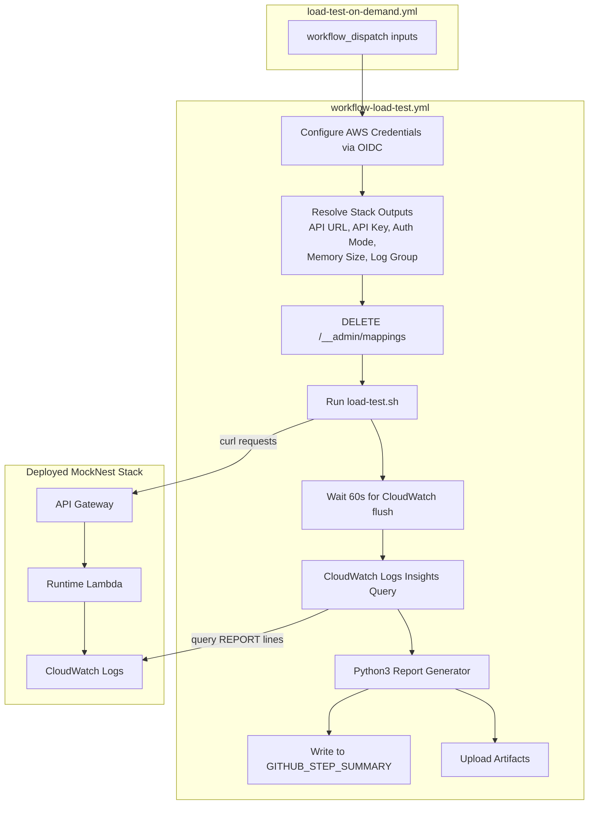

# Design Document

## Overview

This design describes a GitHub Actions load test benchmarking pipeline for MockNest Serverless. The pipeline sends sequential HTTP requests to a deployed stack's health endpoint, collects client-side latency via curl and server-side metrics via CloudWatch Logs Insights, and produces a three-table percentile report (all requests, warm only, cold starts only) rendered in the GitHub Actions Job Summary with raw data uploaded as artifacts.

The pipeline consists of four components:
1. **Trigger workflow** (`load-test-on-demand.yml`) — a `workflow_dispatch` entry point
2. **Reusable workflow** (`workflow-load-test.yml`) — orchestrates the full load test lifecycle
3. **Load test script** (`scripts/load-test.sh`) — sends sequential HTTP requests and records per-request timing as JSON
4. **Report generation** — inline python3 that calculates percentiles and produces a markdown report

The design follows existing project patterns: the trigger workflow mirrors `deploy-on-demand.yml`, the reusable workflow mirrors `workflow-integration-test.yml`, and the bash script follows `scripts/post-deploy-test.sh` conventions.

## Architecture



### Design Decisions

1. **Sequential requests, not parallel**: The API Gateway usage plan has BurstLimit=1, so concurrent requests would immediately trigger 429s. Sequential requests with a configurable delay respect this constraint.

2. **Stack-based resolution only**: All configuration (API URL, API key, memory size, log group) is resolved from CloudFormation stack outputs/parameters. No manual URL or key inputs — this eliminates misconfiguration and ensures the test targets the correct deployment.

3. **Three separate percentile tables**: Client-side latency includes network + API Gateway + Lambda overhead. Server-side metrics from CloudWatch isolate Lambda execution time and distinguish cold starts (SnapStart restore) from warm invocations. This separation is critical for framework migration comparisons where you want to see the Lambda-level impact.

4. **python3 for percentile calculations**: Available on `ubuntu-latest` runners without installation. The `statistics` module provides `quantiles()` for percentile computation. Bash alone cannot do floating-point percentile math reliably.

5. **60-second CloudWatch flush wait**: CloudWatch Logs has eventual consistency. Lambda REPORT lines may take up to 60 seconds to appear in Logs Insights queries. Waiting ensures complete data collection.

6. **Graceful degradation when CloudWatch fails**: If the Logs Insights query returns no results (e.g., log retention expired, permissions issue), the report still includes the client-side table with a warning. Partial results are more useful than a failed pipeline.

## Components and Interfaces

### 1. Trigger Workflow (`load-test-on-demand.yml`)

A `workflow_dispatch` workflow that invokes the reusable workflow. Follows the same pattern as `deploy-on-demand.yml`.

**Inputs:**
| Input | Type | Required | Default | Description |
|-------|------|----------|---------|-------------|
| `stack-name` | string | yes | — | CloudFormation stack name |
| `aws-region` | string | no | `eu-west-1` | AWS region |
| `test-label` | string | yes | — | Label for comparison (e.g., "koin", "spring") |
| `request-rate` | string | no | `"5"` | Requests per second |
| `duration-minutes` | string | no | `"10"` | Test duration in minutes |
| `github-actions-role-name` | string | no | `"GitHubOIDCAdmin"` | OIDC role name |

**Permissions:** `id-token: write`, `contents: read`

**Jobs:** Single job that calls `workflow-load-test.yml` passing all inputs and `AWS_ACCOUNT_ID` secret.

### 2. Reusable Workflow (`workflow-load-test.yml`)

Orchestrates the full load test lifecycle in a single job with multiple steps.

**Steps:**
1. Checkout code
2. Configure AWS credentials (OIDC)
3. Resolve stack outputs (API URL, API key ID, auth mode) from CloudFormation
4. Resolve API key value (if API_KEY mode) via `aws apigateway get-api-key`
5. Resolve runtime Lambda memory size from stack parameters
6. Pre-test cleanup: `DELETE /__admin/mappings`
7. Run `scripts/load-test.sh` with environment variables
8. Wait 60 seconds for CloudWatch log flush
9. Execute CloudWatch Logs Insights query
10. Poll for query completion
11. Generate percentile report (python3)
12. Write report to `$GITHUB_STEP_SUMMARY`
13. Upload artifacts (raw JSON, CloudWatch results, markdown report)

**Stack Resolution Pattern** (mirrors `workflow-integration-test.yml`):
```bash
# Resolve API URL
API_URL=$(aws cloudformation describe-stacks \
  --stack-name "$STACK_NAME" \
  --query 'Stacks[0].Outputs[?OutputKey==`MockNestApiUrl`].OutputValue' \
  --output text)

# Resolve Auth Mode
AUTH_MODE=$(aws cloudformation describe-stacks \
  --stack-name "$STACK_NAME" \
  --query 'Stacks[0].Outputs[?OutputKey==`AuthMode`].OutputValue' \
  --output text)

# Resolve API Key (API_KEY mode only)
API_KEY_ID=$(aws cloudformation describe-stacks \
  --stack-name "$STACK_NAME" \
  --query 'Stacks[0].Outputs[?OutputKey==`MockNestApiKey`].OutputValue' \
  --output text)
API_KEY=$(aws apigateway get-api-key \
  --api-key "$API_KEY_ID" --include-value \
  --query 'value' --output text)

# Resolve runtime Lambda memory from stack parameters
MEMORY_SIZE=$(aws cloudformation describe-stacks \
  --stack-name "$STACK_NAME" \
  --query 'Stacks[0].Parameters[?ParameterKey==`RuntimeLambdaMemorySize`].ParameterValue' \
  --output text)
```

**Artifact upload** uses `actions/upload-artifact@v4` with:
- Name: `load-test-{test-label}-{timestamp}` (e.g., `load-test-koin-20240115-143022`)
- Files: `load-test-results.json`, `cloudwatch-results.json`, `load-test-report.md`

### 3. Load Test Script (`scripts/load-test.sh`)

A bash script following `scripts/post-deploy-test.sh` patterns.

**Environment Variables:**
| Variable | Required | Description |
|----------|----------|-------------|
| `API_URL` | yes | API Gateway base URL |
| `API_KEY` | conditional | API key (required when AUTH_MODE=API_KEY) |
| `AUTH_MODE` | yes | `API_KEY` or `IAM` |
| `REQUEST_RATE` | yes | Requests per second (1-50) |
| `DURATION_MINUTES` | yes | Test duration in minutes |
| `TEST_LABEL` | yes | Label for the test run |

**Behavior:**
1. Validate all required environment variables; exit 2 with usage message if missing
2. Validate `REQUEST_RATE` ≤ 50; exit 1 with error if exceeded
3. Build curl options array matching `post-deploy-test.sh` pattern (API_KEY or IAM SigV4)
4. Calculate total requests: `REQUEST_RATE × DURATION_MINUTES × 60`
5. Calculate delay between requests: `1 / REQUEST_RATE` seconds (using `bc` or awk)
6. Record test start timestamp (epoch seconds)
7. Loop: send sequential GET requests to `{API_URL}/__admin/health`
   - Use `curl --write-out` to capture `time_total` (in seconds, converted to ms)
   - Record HTTP status code
   - Record timestamp per request
   - Track consecutive non-2xx errors (excluding 429); abort if >10 consecutive
   - Track 429 count; flag test as invalid if any received
   - Sleep for the calculated delay between requests
8. Record test end timestamp
9. Write all results to `load-test-results.json`

**Output JSON format:**
```json
{
  "test_label": "koin",
  "start_time": 1705312222,
  "end_time": 1705312822,
  "request_rate": 5,
  "duration_minutes": 10,
  "total_requests": 3000,
  "throttled_count": 0,
  "error_count": 0,
  "is_valid": true,
  "requests": [
    {
      "timestamp": 1705312222,
      "status_code": 200,
      "latency_ms": 45.2
    }
  ]
}
```

**Curl timing approach:**
```bash
# Use curl's --write-out to get timing + status code
# Remove --fail from CURL_OPTS to capture non-2xx status codes
RESPONSE=$(curl "${CURL_OPTS_NO_FAIL[@]}" \
  --write-out "\n%{http_code} %{time_total}" \
  --output /dev/null \
  "${API_URL}/__admin/health")
HTTP_CODE=$(echo "$RESPONSE" | awk '{print $1}')
TIME_TOTAL=$(echo "$RESPONSE" | awk '{print $2}')
LATENCY_MS=$(echo "$TIME_TOTAL * 1000" | bc)
```

### 4. CloudWatch Logs Insights Query

Executed in the reusable workflow after the 60-second wait.

**Query:**
```
filter @type = "REPORT"
| parse @message /Duration: (?<duration>[\d.]+) ms/
| parse @message /Restore Duration: (?<restore_duration>[\d.]+) ms/
| fields duration, restore_duration, ispresent(restore_duration) as is_cold_start
```

**Execution pattern:**
```bash
# Start query
QUERY_ID=$(aws logs start-query \
  --log-group-name "/aws/lambda/${STACK_NAME}-runtime" \
  --start-time "$TEST_START_EPOCH" \
  --end-time "$TEST_END_EPOCH" \
  --query-string "$QUERY" \
  --output text)

# Poll for completion (max 60 seconds)
for i in $(seq 1 12); do
  STATUS=$(aws logs get-query-results --query-id "$QUERY_ID" \
    --query 'status' --output text)
  if [ "$STATUS" = "Complete" ]; then
    aws logs get-query-results --query-id "$QUERY_ID" > cloudwatch-results.json
    break
  fi
  sleep 5
done
```

**Result separation:**
The python3 report generator reads `cloudwatch-results.json` and separates results into:
- **Cold starts**: rows where `restore_duration` is present → `Cold_Start_Duration = duration + restore_duration`
- **Warm invocations**: rows where `restore_duration` is absent → duration only

### 5. Report Generator (inline python3)

An inline python3 script in the workflow step that reads `load-test-results.json` and `cloudwatch-results.json` and produces `load-test-report.md`.

**Percentile calculation:**
```python
import statistics
def percentiles(data):
    if not data:
        return {"p50": "N/A", "p95": "N/A", "p99": "N/A", "max": "N/A", "count": 0}
    sorted_data = sorted(data)
    q = statistics.quantiles(sorted_data, n=100)
    return {
        "p50": f"{q[49]:.1f}",
        "p95": f"{q[94]:.1f}",
        "p99": f"{q[98]:.1f}",
        "max": f"{max(sorted_data):.1f}",
        "count": len(data)
    }
```

**Report structure:**
```markdown
# Load Test Report: {test_label}

## Metadata
| Parameter | Value |
|-----------|-------|
| Test Label | {test_label} |
| Stack Name | {stack_name} |
| AWS Region | {aws_region} |
| Runtime Memory | {memory_size} MB |
| Duration | {duration_minutes} min |
| Request Rate | {request_rate} req/s |
| Target Endpoint | GET /__admin/health |
| Total Requests | {total_requests} |
| Errors (non-2xx excl. 429) | {error_count} |
| 429 Throttled | {throttled_count} |

> ⚠️ **WARNING: Test run invalid — {throttled_count} requests were throttled (HTTP 429)**

## All Requests (Client-Side)
| p50 | p95 | p99 | max | count |
|-----|-----|-----|-----|-------|
| ... | ... | ... | ... | ...   |

## Warm Invocations Only (Lambda-Side)
| p50 | p95 | p99 | max | count |
|-----|-----|-----|-----|-------|
| ... | ... | ... | ... | ...   |

## Cold Starts Only (Lambda-Side)
| p50 | p95 | p99 | max | count |
|-----|-----|-----|-----|-------|
| ... | ... | ... | ... | ...   |
```

## Data Models

### Load Test Results JSON (`load-test-results.json`)

```json
{
  "test_label": "string",
  "stack_name": "string",
  "aws_region": "string",
  "memory_size": "number",
  "start_time": "number (epoch seconds)",
  "end_time": "number (epoch seconds)",
  "request_rate": "number",
  "duration_minutes": "number",
  "total_requests": "number",
  "throttled_count": "number",
  "error_count": "number",
  "is_valid": "boolean",
  "requests": [
    {
      "timestamp": "number (epoch seconds)",
      "status_code": "number",
      "latency_ms": "number"
    }
  ]
}
```

### CloudWatch Query Results JSON (`cloudwatch-results.json`)

The raw output from `aws logs get-query-results`, containing an array of result rows. Each row has fields: `duration`, `restore_duration` (optional), `is_cold_start`.

### Markdown Report (`load-test-report.md`)

The generated markdown file containing metadata table, optional throttle warning, and three percentile tables.

## Error Handling

| Scenario | Behavior |
|----------|----------|
| Stack does not exist / outputs unresolvable | Workflow exits with non-zero code and descriptive error message |
| Missing required environment variable in script | Script prints usage message and exits with code 2 |
| `request-rate` > 50 | Script rejects with error explaining API Gateway throttle constraint |
| Pre-test cleanup (`DELETE /__admin/mappings`) fails | Workflow exits with non-zero code |
| >10 consecutive non-2xx responses (excl. 429) | Script aborts test, writes partial results to JSON |
| Any HTTP 429 received | Script continues but flags `is_valid: false`; report shows warning |
| CloudWatch query fails or returns no results | Report generated with client-side table only + warning that server-side metrics are unavailable |
| Any step fails | Workflow uses `if: always()` on artifact upload step to ensure partial results are uploaded |

## Testing Strategy

### Why Property-Based Testing Does Not Apply

This feature consists of:
- **GitHub Actions workflow YAML** — declarative CI/CD configuration
- **Bash shell script** — sequential HTTP requests with I/O side effects
- **Inline python3** — thin wrapper around `statistics.quantiles()` for percentile math
- **AWS CLI commands** — external service interactions (CloudFormation, CloudWatch)

PBT requires pure functions with meaningful input variation. The bash script is entirely I/O-bound (curl calls, file writes). The python3 percentile logic delegates to the standard library. The workflow YAML is declarative configuration. None of these components have the input/output characteristics that benefit from property-based testing.

### Recommended Testing Approach

**Manual integration testing** is the primary validation strategy for this feature:

1. **Workflow syntax validation**: Use `actionlint` (if available) or GitHub's workflow validation to check YAML syntax
2. **Script dry-run testing**: Test `scripts/load-test.sh` locally against a deployed stack with a short duration (1 minute, 2 req/s) to verify:
   - Environment variable validation and error messages
   - Curl timing capture and JSON output format
   - Rate limiting compliance (verify no 429s at low rates)
   - Consecutive error abort behavior
3. **CloudWatch query validation**: Run the Logs Insights query manually in the AWS Console to verify it returns expected REPORT line fields
4. **Report generation validation**: Run the python3 report generator against sample JSON files to verify:
   - Percentile calculations produce expected values
   - Markdown formatting renders correctly
   - Edge cases: empty CloudWatch results, zero cold starts, all cold starts
5. **End-to-end workflow run**: Trigger the workflow via `workflow_dispatch` against a test stack and verify:
   - Job Summary renders correctly with all three tables
   - Artifacts are uploaded with correct naming
   - Throttle warning appears when 429s occur (can be tested by setting rate > burst limit)

**Unit-level validation for the python3 report generator** can be done by creating a small test script that feeds known input data and asserts expected percentile output. This is example-based testing, not property-based.
