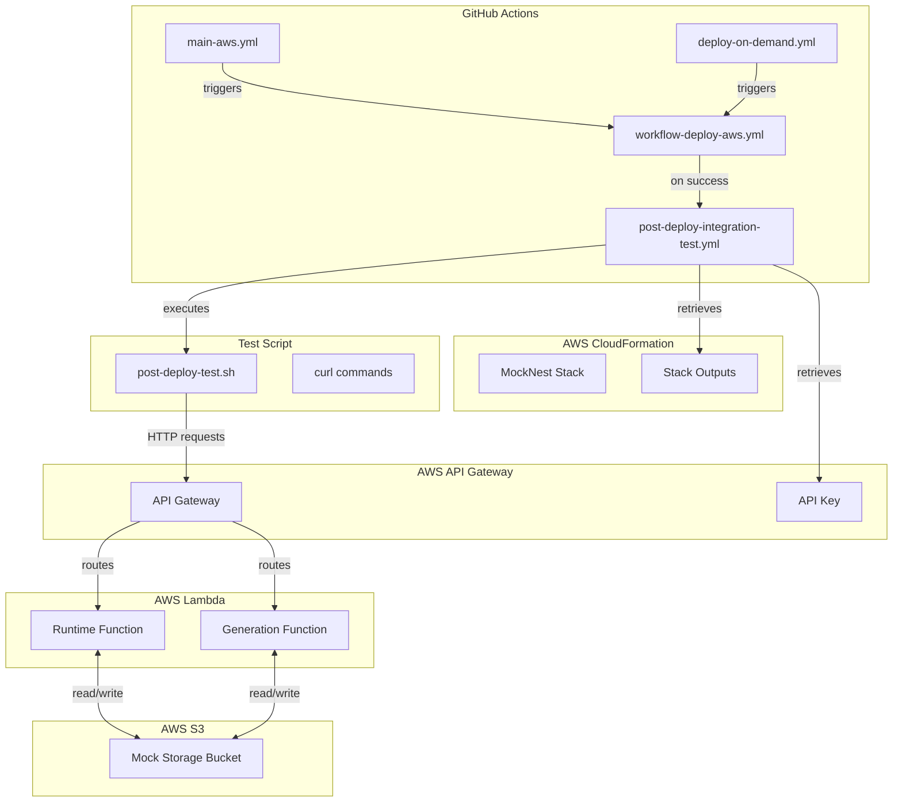
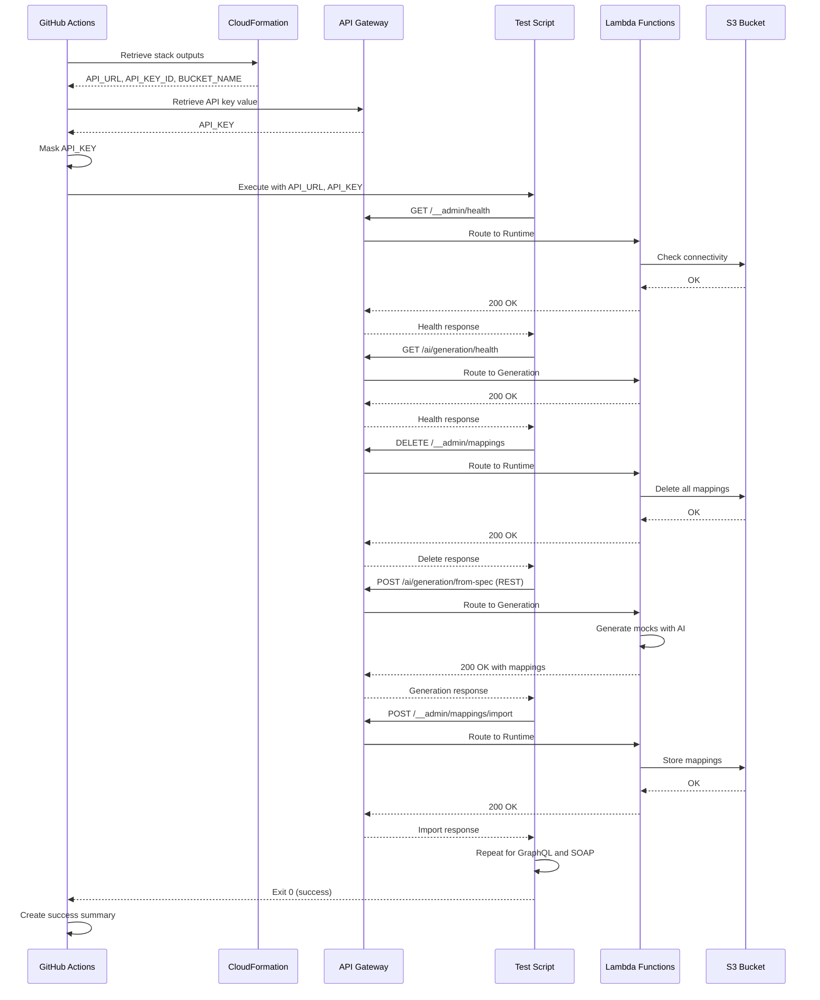

# Design Document

## Introduction

This document provides the technical design for implementing a post-deployment integration test workflow that validates deployed MockNest Serverless applications in AWS. The design follows the requirements specified in requirements.md and provides a comprehensive solution for automated post-deployment validation.

## System Architecture

### High-Level Architecture



### Component Overview

1. **GitHub Actions Workflows**
   - `main-aws.yml`: Main branch deployment workflow
   - `deploy-on-demand.yml`: Manual deployment workflow
   - `workflow-deploy-aws.yml`: Reusable deployment workflow
   - `post-deploy-integration-test.yml`: New integration test workflow (to be created)

2. **Test Script**
   - `scripts/post-deploy-test.sh`: Bash script containing all test logic

3. **AWS Resources**
   - CloudFormation Stack: Contains all deployed resources
   - API Gateway: HTTP endpoint with API key authentication
   - Lambda Functions: Runtime and Generation functions
   - S3 Bucket: Mock storage

## Detailed Design

### 1. Workflow Triggering Design

**File**: `.github/workflows/post-deploy-integration-test.yml`

**Trigger Configuration**:
```yaml
on:
  workflow_run:
    workflows:
      - "CICD - Main Branch AWS"
      - "CD - Deploy On Demand"
    types:
      - completed
    branches:
      - main
```

**Conditional Execution**:
- Only run if the triggering workflow succeeded
- Only run if deployment actually occurred (not skipped due to no changes)
- Skip for SAR test pipeline workflows

**Design Rationale**:
- `workflow_run` trigger ensures tests run after deployment completes
- Checking `conclusion == 'success'` prevents running tests after failed deployments
- Checking deployment outputs ensures we don't test when no deployment occurred

### 2. Stack Output Retrieval Design

**Implementation Approach**:
Use AWS CLI to retrieve CloudFormation stack outputs

**Stack Name Resolution**:
```bash
# Read stack name from samconfig.toml using Python
STACK_NAME=$(python3 - <<'PY'
import tomllib
cfg = tomllib.load(open("deployment/aws/sam/samconfig.toml", "rb"))
print(cfg["default"]["global"]["parameters"]["stack_name"])
PY
)
```

**Output Retrieval**:
```bash
# Retrieve stack outputs using AWS CLI
API_URL=$(aws cloudformation describe-stacks \
  --stack-name "$STACK_NAME" \
  --query 'Stacks[0].Outputs[?OutputKey==`MockNestApiUrl`].OutputValue' \
  --output text)

API_KEY_ID=$(aws cloudformation describe-stacks \
  --stack-name "$STACK_NAME" \
  --query 'Stacks[0].Outputs[?OutputKey==`MockNestApiKey`].OutputValue' \
  --output text)

BUCKET_NAME=$(aws cloudformation describe-stacks \
  --stack-name "$STACK_NAME" \
  --query 'Stacks[0].Outputs[?OutputKey==`MockStorageBucket`].OutputValue' \
  --output text)
```

**Validation**:
```bash
# Validate outputs are not empty
if [ -z "$API_URL" ] || [ -z "$API_KEY_ID" ] || [ -z "$BUCKET_NAME" ]; then
  echo "ERROR: Failed to retrieve required stack outputs"
  exit 1
fi

# Validate API_URL format
if [[ ! "$API_URL" =~ ^https:// ]]; then
  echo "ERROR: API_URL must start with https://"
  exit 1
fi

# Remove trailing slash from API_URL
API_URL="${API_URL%/}"
```

**Design Rationale**:
- Python with tomllib provides reliable TOML parsing
- AWS CLI provides native CloudFormation integration
- Validation ensures test script receives valid inputs

### 3. API Key Retrieval Design

**Implementation Approach**:
Use AWS CLI to retrieve API key value from API Gateway

**API Key Retrieval**:
```bash
# Retrieve API key value
API_KEY=$(aws apigateway get-api-key \
  --api-key "$API_KEY_ID" \
  --include-value \
  --query 'value' \
  --output text)

# Mask API key in GitHub Actions logs
echo "::add-mask::$API_KEY"

# Validate API key is not empty
if [ -z "$API_KEY" ]; then
  echo "ERROR: Failed to retrieve API key value"
  exit 1
fi
```

**Design Rationale**:
- `--include-value` flag retrieves the actual key value
- `::add-mask::` ensures key is never exposed in logs
- Immediate masking prevents accidental exposure

### 4. Test Script Design

**File**: `scripts/post-deploy-test.sh`

**Script Structure**:
```bash
#!/bin/bash
set -e
set -o pipefail

# Script accepts API_URL and API_KEY as arguments or environment variables
API_URL="${1:-$API_URL}"
API_KEY="${2:-$API_KEY}"

# Validate inputs
if [ -z "$API_URL" ] || [ -z "$API_KEY" ]; then
  echo "ERROR: API_URL and API_KEY are required"
  echo "Usage: $0 <API_URL> <API_KEY>"
  exit 1
fi

# Test functions
test_runtime_health() { ... }
test_ai_health() { ... }
test_delete_all_mappings() { ... }
test_rest_generation() { ... }
test_rest_import() { ... }
test_graphql_generation() { ... }
test_graphql_import() { ... }
test_soap_generation() { ... }
test_soap_import() { ... }

# Main execution
main() {
  echo "=== MockNest Serverless Post-Deployment Integration Tests ==="
  echo "API URL: $API_URL"
  echo ""
  
  test_runtime_health
  test_ai_health
  test_delete_all_mappings
  test_rest_generation
  test_rest_import
  test_graphql_generation
  test_graphql_import
  test_soap_generation
  test_soap_import
  
  echo ""
  echo "=== All Tests Passed ==="
}

main
```

**Design Rationale**:
- `set -e` ensures script exits on first error
- `set -o pipefail` ensures pipeline failures are caught
- Modular test functions improve maintainability
- Clear output messages aid debugging

### 5. HTTP Request Design

**curl Configuration**:
```bash
# Common curl options
CURL_OPTS=(
  --fail              # Fail on HTTP errors (4xx, 5xx)
  --silent            # Suppress progress meter
  --show-error        # Show errors even in silent mode
  --max-time 30       # 30 second timeout
  --header "x-api-key: $API_KEY"
  --header "Content-Type: application/json"
)
```

**Health Check Implementation**:
```bash
test_runtime_health() {
  echo "Testing runtime health..."
  
  RESPONSE=$(curl "${CURL_OPTS[@]}" \
    --write-out "\n%{http_code}" \
    "$API_URL/__admin/health")
  
  HTTP_CODE=$(echo "$RESPONSE" | tail -n1)
  BODY=$(echo "$RESPONSE" | sed '$d')
  
  if [ "$HTTP_CODE" != "200" ]; then
    echo "ERROR: Runtime health check failed with HTTP $HTTP_CODE"
    echo "Response: $BODY"
    exit 1
  fi
  
  if ! echo "$BODY" | grep -q '"status": "healthy"'; then
    echo "ERROR: Runtime health check response missing 'status: healthy'"
    echo "Response: $BODY"
    exit 1
  fi
  
  echo "✓ Runtime health check passed"
}
```

**Mock Generation Implementation**:
```bash
test_rest_generation() {
  echo "Testing REST/OpenAPI mock generation..."
  
  REQUEST_BODY='{
    "specificationUrl": "https://petstore3.swagger.io/api/v3/openapi.json",
    "format": "OPENAPI_3",
    "description": "Generate mocks for the Petstore API with realistic pet data"
  }'
  
  RESPONSE=$(curl "${CURL_OPTS[@]}" \
    --write-out "\n%{http_code}" \
    --request POST \
    --data "$REQUEST_BODY" \
    "$API_URL/ai/generation/from-spec")
  
  HTTP_CODE=$(echo "$RESPONSE" | tail -n1)
  BODY=$(echo "$RESPONSE" | sed '$d')
  
  if [ "$HTTP_CODE" != "200" ]; then
    echo "ERROR: REST generation failed with HTTP $HTTP_CODE"
    echo "Response: $BODY"
    exit 1
  fi
  
  if ! echo "$BODY" | grep -q '"mappings"'; then
    echo "ERROR: REST generation response missing 'mappings' array"
    echo "Response: $BODY"
    exit 1
  fi
  
  # Store mappings for import test
  REST_MAPPINGS="$BODY"
  
  echo "✓ REST mock generation passed"
}
```

**Design Rationale**:
- `--fail` ensures curl exits with error on HTTP failures
- `--write-out` captures HTTP status code separately from body
- `--max-time 30` prevents hanging on slow responses
- Response validation checks both HTTP status and body content
- Storing generated mappings enables subsequent import tests

### 6. Test Payload Design

**REST/OpenAPI Test Payload**:
```json
{
  "specificationUrl": "https://petstore3.swagger.io/api/v3/openapi.json",
  "format": "OPENAPI_3",
  "description": "Generate mocks for the Petstore API with realistic pet data"
}
```

**GraphQL Test Payload**:
```json
{
  "specificationUrl": "https://countries.trevorblades.com/graphql",
  "format": "GRAPHQL",
  "description": "Generate mocks for the Countries GraphQL API with sample country data"
}
```

**SOAP/WSDL Test Payload**:
```json
{
  "specificationUrl": "http://www.dneonline.com/calculator.asmx?WSDL",
  "format": "WSDL",
  "description": "Generate mocks for the Calculator SOAP service with sample calculations"
}
```

**Design Rationale**:
- Use publicly accessible, stable API specifications
- Petstore API is a well-known OpenAPI example
- Countries GraphQL API is a public, stable GraphQL endpoint
- Calculator WSDL is a simple, reliable SOAP service
- Descriptions provide context for AI generation

### 7. Error Handling Design

**Error Detection**:
```bash
# HTTP status code validation
if [ "$HTTP_CODE" != "200" ]; then
  echo "ERROR: Request failed with HTTP $HTTP_CODE"
  echo "Response: $BODY"
  exit 1
fi

# Response content validation
if ! echo "$BODY" | grep -q "expected_content"; then
  echo "ERROR: Response missing expected content"
  echo "Response: $BODY"
  exit 1
fi
```

**Timeout Handling**:
```bash
# curl automatically handles timeouts with --max-time
# Exit code 28 indicates timeout
if [ $? -eq 28 ]; then
  echo "ERROR: Request timed out after 30 seconds"
  exit 1
fi
```

**Design Rationale**:
- Explicit HTTP status validation catches API errors
- Content validation ensures responses are well-formed
- Timeout handling prevents indefinite hangs
- Clear error messages aid debugging

### 8. Test Result Reporting Design

**GitHub Actions Summary**:
```bash
# Create summary in workflow
cat >> $GITHUB_STEP_SUMMARY <<EOF
## 🧪 Post-Deployment Integration Tests

**Status**: ✅ All tests passed

**Deployment Details**:
- **API URL**: $API_URL
- **Stack Name**: $STACK_NAME
- **Region**: $AWS_REGION
- **Test Duration**: ${DURATION}s

**Tests Executed**:
- ✅ Runtime health check
- ✅ AI generation health check
- ✅ Delete all mappings
- ✅ REST/OpenAPI mock generation
- ✅ REST mock import
- ✅ GraphQL mock generation
- ✅ GraphQL mock import
- ✅ SOAP/WSDL mock generation
- ✅ SOAP mock import

**Next Steps**:
- Deployment is production-ready
- All API endpoints are functional
- AI generation is operational
EOF
```

**Failure Reporting**:
```bash
# On failure, capture error details
cat >> $GITHUB_STEP_SUMMARY <<EOF
## 🧪 Post-Deployment Integration Tests

**Status**: ❌ Tests failed

**Deployment Details**:
- **API URL**: $API_URL
- **Stack Name**: $STACK_NAME
- **Region**: $AWS_REGION

**Failed Test**: $FAILED_TEST
**Error**: $ERROR_MESSAGE

**Action Required**:
- Review test logs for details
- Check Lambda function logs in CloudWatch
- Verify API Gateway configuration
EOF
```

**Design Rationale**:
- GitHub Actions summary provides at-a-glance status
- Success summary confirms all tests passed
- Failure summary highlights specific failure
- No sensitive data (API keys) in summary

### 9. Security Design

**API Key Masking**:
```yaml
# In GitHub Actions workflow
- name: Retrieve API Key
  id: api-key
  run: |
    API_KEY=$(aws apigateway get-api-key \
      --api-key "$API_KEY_ID" \
      --include-value \
      --query 'value' \
      --output text)
    echo "::add-mask::$API_KEY"
    echo "api-key=$API_KEY" >> $GITHUB_OUTPUT
```

**Credential Handling**:
- API key retrieved at runtime, never stored in repository
- Immediate masking prevents exposure in logs
- Passed to script via environment variable, not command line
- Not included in error messages or summaries

**Design Rationale**:
- `::add-mask::` ensures GitHub Actions masks the value
- Environment variables are more secure than command-line arguments
- Explicit exclusion from error messages prevents accidental exposure

### 10. Workflow Integration Design

**Workflow File Structure**:
```yaml
name: Post-Deployment Integration Tests

on:
  workflow_run:
    workflows:
      - "CICD - Main Branch AWS"
      - "CD - Deploy On Demand"
    types:
      - completed

permissions:
  id-token: write
  contents: read

jobs:
  integration-tests:
    runs-on: ubuntu-latest
    if: ${{ github.event.workflow_run.conclusion == 'success' }}
    
    steps:
      - name: Checkout code
        uses: actions/checkout@v6
      
      - name: Configure AWS credentials
        uses: aws-actions/configure-aws-credentials@v6
        with:
          role-to-assume: arn:aws:iam::${{ secrets.AWS_ACCOUNT_ID }}:role/${{ vars.GITHUB_ACTIONS_ROLE_NAME }}
          aws-region: ${{ vars.AWS_REGION }}
      
      - name: Retrieve stack outputs
        id: stack-outputs
        run: |
          # Stack output retrieval logic
      
      - name: Retrieve API key
        id: api-key
        run: |
          # API key retrieval logic
      
      - name: Run integration tests
        env:
          API_URL: ${{ steps.stack-outputs.outputs.api-url }}
          API_KEY: ${{ steps.api-key.outputs.api-key }}
        run: |
          chmod +x scripts/post-deploy-test.sh
          ./scripts/post-deploy-test.sh
      
      - name: Create test summary
        if: always()
        run: |
          # Summary creation logic
```

**Design Rationale**:
- `workflow_run` trigger ensures sequential execution
- Conditional execution prevents running after failures
- AWS credentials reuse existing OIDC configuration
- Script execution is isolated in dedicated step
- Summary creation runs even on failure

## Data Flow

### Test Execution Flow



## Technology Stack

### GitHub Actions
- **Version**: Latest (actions/checkout@v6, aws-actions/configure-aws-credentials@v6)
- **Purpose**: Workflow orchestration and execution
- **Rationale**: Native GitHub integration, OIDC support

### Bash
- **Version**: 4.0+ (Ubuntu latest includes 5.x)
- **Purpose**: Test script implementation
- **Rationale**: Universal availability, excellent for HTTP testing

### curl
- **Version**: 7.x+ (Ubuntu latest includes 8.x)
- **Purpose**: HTTP request execution
- **Rationale**: Standard tool for HTTP testing, excellent error handling

### AWS CLI
- **Version**: 2.x
- **Purpose**: CloudFormation and API Gateway interaction
- **Rationale**: Native AWS integration, reliable output parsing

### Python
- **Version**: 3.11+
- **Purpose**: TOML parsing for stack name resolution
- **Rationale**: Built-in tomllib module, reliable parsing

## Testing Strategy

### Unit Testing
Not applicable - this is an integration test workflow

### Integration Testing
The workflow itself is an integration test that validates:
- API Gateway configuration
- Lambda function execution
- S3 storage connectivity
- AI generation capabilities
- End-to-end request/response flow

### Manual Testing
Before merging:
1. Test script locally with deployed stack
2. Test workflow with test deployment
3. Verify error handling with invalid inputs
4. Verify timeout handling with slow endpoints
5. Verify API key masking in logs

### Validation Criteria
- All health checks pass
- All mock generation requests succeed
- All mock import requests succeed
- Test execution completes within 5 minutes
- No API keys exposed in logs
- Clear error messages on failure

## Deployment Strategy

### Rollout Plan
1. Create test script (`scripts/post-deploy-test.sh`)
2. Test script locally with existing deployment
3. Create workflow file (`.github/workflows/post-deploy-integration-test.yml`)
4. Test workflow with test deployment
5. Merge to main branch
6. Verify workflow runs after next deployment

### Rollback Plan
If integration tests fail after deployment:
1. Review test logs for failure details
2. Check Lambda function logs in CloudWatch
3. Verify API Gateway configuration
4. If deployment is broken, rollback CloudFormation stack
5. If tests are broken, disable workflow temporarily

### Monitoring
- GitHub Actions workflow status
- Test execution duration
- Test failure rate
- API response times

## Security Considerations

### API Key Security
- API keys retrieved at runtime, never stored
- Immediate masking in GitHub Actions logs
- Not included in error messages or summaries
- Passed via environment variables, not command line

### AWS Credentials
- OIDC authentication (no long-lived credentials)
- Minimal IAM permissions (CloudFormation read, API Gateway read)
- Session-based credentials with automatic expiration

### Network Security
- All requests use HTTPS
- API Gateway enforces API key authentication
- No public endpoints without authentication

## Performance Considerations

### Test Execution Time
- Expected total duration: 2-3 minutes
- Health checks: <5 seconds each
- Mock generation: 10-20 seconds each
- Mock import: <5 seconds each
- Total timeout: 30 seconds per request

### Resource Usage
- Minimal GitHub Actions runner resources
- Lambda cold starts handled by SnapStart
- S3 operations are fast (<1 second)
- AI generation is the slowest operation (10-20 seconds)

### Optimization Opportunities
- Parallel test execution (future enhancement)
- Cached test data (future enhancement)
- Reduced AI generation timeout (if reliable)

## Maintenance Considerations

### Script Maintenance
- Test payloads may need updates if public APIs change
- curl options may need adjustment for new requirements
- Error messages should be kept clear and actionable

### Workflow Maintenance
- AWS CLI commands may need updates for new features
- GitHub Actions versions should be kept current
- Timeout values may need adjustment based on performance

### Documentation Maintenance
- Update README with test workflow information
- Document test failure troubleshooting steps
- Keep Postman collection synchronized with test payloads

## Future Enhancements

### Phase 2 Enhancements
1. **Parallel Test Execution**: Run tests concurrently to reduce duration
2. **Test Data Caching**: Cache generated mocks to speed up subsequent tests
3. **Performance Metrics**: Collect and report API response times
4. **Slack Notifications**: Send test results to Slack channel
5. **Test Coverage Reporting**: Track which endpoints are tested

### Phase 3 Enhancements
1. **Load Testing**: Add load tests to verify scalability
2. **Security Scanning**: Add security tests for common vulnerabilities
3. **Chaos Engineering**: Add failure injection tests
4. **Multi-Region Testing**: Test deployments in multiple regions
5. **Automated Rollback**: Automatically rollback failed deployments

## Appendix

### A. Test Script Template

See `scripts/post-deploy-test.sh` for complete implementation.

### B. Workflow Template

See `.github/workflows/post-deploy-integration-test.yml` for complete implementation.

### C. Postman Collection Mapping

| Test | Postman Request | curl Payload |
|------|----------------|--------------|
| Runtime Health | Admin Health | GET /__admin/health |
| AI Health | AI Generation Health | GET /ai/generation/health |
| Delete Mappings | Delete All Mappings | DELETE /__admin/mappings |
| REST Generation | Generate from OpenAPI | POST /ai/generation/from-spec |
| REST Import | Import Mappings | POST /__admin/mappings/import |
| GraphQL Generation | Generate from GraphQL | POST /ai/generation/from-spec |
| GraphQL Import | Import Mappings | POST /__admin/mappings/import |
| SOAP Generation | Generate from WSDL | POST /ai/generation/from-spec |
| SOAP Import | Import Mappings | POST /__admin/mappings/import |

### D. Error Code Reference

| Exit Code | Meaning |
|-----------|---------|
| 0 | All tests passed |
| 1 | Test failure (generic) |
| 2 | Invalid arguments |
| 28 | curl timeout |
| 130 | Script interrupted (Ctrl+C) |

### E. CloudFormation Output Reference

| Output Key | Description | Example Value |
|------------|-------------|---------------|
| MockNestApiUrl | API Gateway URL | https://abc123.execute-api.eu-west-1.amazonaws.com/mocks/ |
| MockNestApiKey | API Key ID | abc123def456 |
| MockStorageBucket | S3 bucket name | mocknest-serverless-mockstorage-xyz |
| StackName | Stack name | mocknest-serverless |
