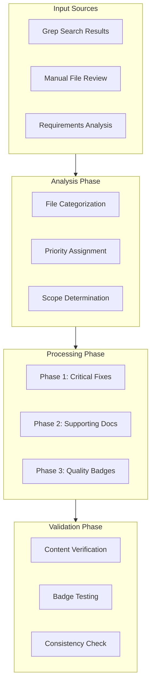
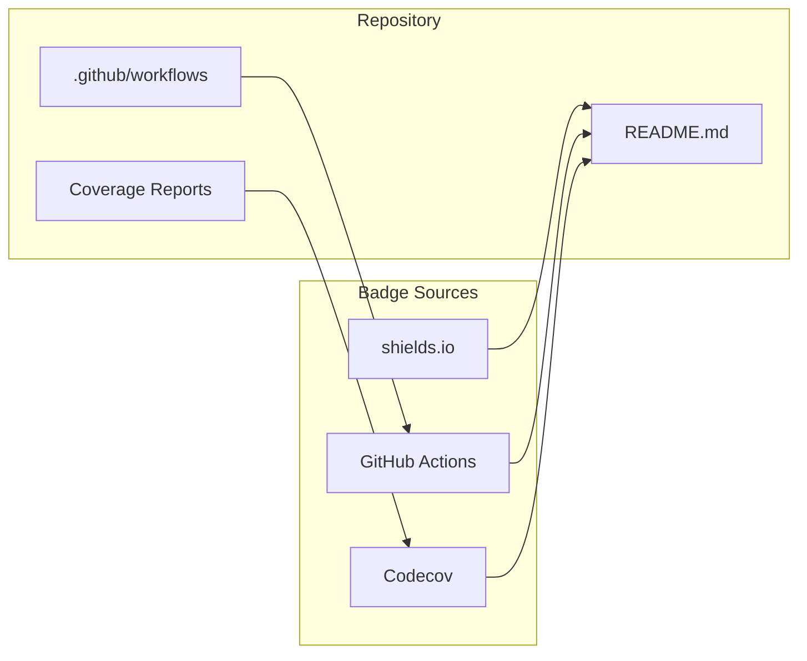

# Design Document: Repository Cleanup and Quality Badges

## Overview

This design document outlines the technical approach for systematically cleaning up MockNest Serverless repository documentation inconsistencies and implementing professional quality badges. The primary challenge is that AI traffic analysis is documented throughout the repository as if it's implemented, when only AI mock generation is actually available.

The solution involves a three-phase approach: critical documentation fixes, supporting documentation updates, and quality badge implementation. This ensures accurate representation of current capabilities while preserving future planning context.

## Architecture

### Documentation Cleanup Architecture

The cleanup process follows a systematic file categorization and update strategy:



### Badge Integration Architecture

Quality badges integrate with existing repository structure using free services:



## Components and Interfaces

### File Processing Components

**DocumentationScanner**
- Scans files for traffic analysis references
- Categorizes references by implementation status
- Identifies inconsistencies between documented and actual features

**ContentUpdater**
- Updates file content while preserving structure
- Applies consistent terminology and status markers
- Maintains future planning context

**BadgeManager**
- Generates badge URLs using shields.io
- Validates badge functionality
- Ensures consistent badge formatting

### File Categories

**Critical Documentation Files**
- README.md - Primary project presentation
- Architecture documents - System design accuracy
- API specifications - Endpoint availability

**Supporting Documentation Files**
- Cost analysis - Feature-based estimates
- Market positioning - Capability accuracy
- Competition articles - Current vs future positioning

**Configuration Files**
- GitHub workflows - Build and deployment accuracy
- SAM templates - Infrastructure alignment
- Postman collections - API endpoint consistency

## Data Models

### File Update Record
```kotlin
data class FileUpdateRecord(
    val filePath: String,
    val updateType: UpdateType,
    val changes: List<ContentChange>,
    val phase: ProcessingPhase,
    val status: UpdateStatus
)

enum class UpdateType {
    TRAFFIC_ANALYSIS_REMOVAL,
    FUTURE_MARKING,
    BADGE_ADDITION,
    CONSISTENCY_FIX
}

data class ContentChange(
    val lineNumber: Int,
    val oldContent: String,
    val newContent: String,
    val changeReason: String
)
```

### Badge Configuration
```kotlin
data class BadgeConfig(
    val name: String,
    val service: BadgeService,
    val url: String,
    val altText: String,
    val position: BadgePosition
)

enum class BadgeService {
    SHIELDS_IO,
    GITHUB_ACTIONS,
    CODECOV
}
```

## Correctness Properties

*A property is a characteristic or behavior that should hold true across all valid executions of a system-essentially, a formal statement about what the system should do. Properties serve as the bridge between human-readable specifications and machine-verifiable correctness guarantees.*

### Property 1: Traffic Analysis Future Marking

*For any* file in the repository that mentions traffic analysis, the content should clearly indicate it as planned, future, or roadmap functionality rather than current implementation.

**Validates: Requirements 1.5, 2.3, 4.5, 5.4**

### Property 2: Documentation Consistency

*For any* documentation file that describes MockNest capabilities, the descriptions should accurately reflect current implementation state (AI generation implemented, traffic analysis planned).

**Validates: Requirements 1.4, 4.4, 6.2, 6.3**

### Property 3: API Specification Accuracy

*For any* endpoint described in API documentation, the endpoint should exist in the current implementation or be clearly marked as future/planned.

**Validates: Requirements 5.1, 5.2, 5.3**

### Property 4: Badge Functionality

*For any* badge added to the repository, the badge should use free services and display current, accurate information.

**Validates: Requirements 3.5**

### Property 5: Content Preservation

*For any* specification or planning document, the original content should be preserved while adding appropriate implementation status indicators.

**Validates: Requirements 2.5, 7.2, 7.3, 7.4, 7.5**

### Property 6: Architecture Diagram Accuracy

*For any* architecture diagram or system description, only currently implemented components should be shown as active/current, with future components clearly distinguished.

**Validates: Requirements 4.2, 4.3**

### Property 7: Cost Analysis Accuracy

*For any* cost estimate or market positioning statement, the analysis should be based only on currently implemented features.

**Validates: Requirements 6.1, 6.4, 6.5**

## Error Handling

### File Processing Errors
- **File Not Found**: Log warning and continue with other files
- **Permission Denied**: Report error and skip file
- **Malformed Content**: Create backup and attempt partial update
- **Encoding Issues**: Use UTF-8 with fallback to system default

### Badge Service Errors
- **Service Unavailable**: Use fallback badge or placeholder
- **Invalid Configuration**: Log error and skip badge
- **Network Timeout**: Retry with exponential backoff

### Validation Errors
- **Inconsistent References**: Report all inconsistencies for manual review
- **Missing Required Changes**: Fail validation and report specific issues
- **Badge Malfunction**: Report non-functional badges for correction

## Testing Strategy

### Dual Testing Approach

**Unit Tests**: Verify specific file processing logic, badge generation, and content validation
- Test file scanning and categorization
- Test content replacement accuracy
- Test badge URL generation
- Test error handling scenarios

**Property Tests**: Verify universal properties across all repository files
- Test that all traffic analysis references are properly marked
- Test documentation consistency across file types
- Test badge functionality and accessibility
- Test content preservation during updates

**Property Test Configuration**:
- Minimum 100 iterations per property test
- Each property test references its design document property
- Tag format: **Feature: repository-cleanup-and-quality-badges, Property {number}: {property_text}**

### Integration Testing
- **End-to-End Repository Scan**: Test complete file processing workflow
- **Badge Integration**: Test badge display and functionality in actual README
- **Consistency Validation**: Test cross-file reference consistency
- **Rollback Testing**: Test ability to revert changes if needed

### Manual Validation
- **Content Review**: Human review of critical documentation changes
- **Badge Verification**: Manual testing of badge links and display
- **User Experience**: Review from perspective of new repository visitors

## Implementation Phases

### Phase 1: Critical Documentation Fixes

**Objective**: Fix the most visible and impactful documentation inconsistencies that affect user perception and expectations.

**Files and Changes**:

1. **README.md**
   - Remove claims about implemented traffic analysis features
   - Update feature list to clearly distinguish current (AI generation) from planned (traffic analysis)
   - Add professional quality badges section
   - Ensure architecture overview reflects current implementation

2. **Architecture Documentation (.kiro/steering/02-architecture.md)**
   - Remove traffic analysis endpoints from current system description
   - Move traffic analysis components to future/planned sections
   - Update system diagrams to show only implemented components
   - Preserve traffic analysis design for future reference with clear "planned" markers

3. **AI Traffic Analysis Spec Marking**
   - Add prominent "NOT IMPLEMENTED" notice to `.kiro/specs/ai-traffic-analysis/requirements.md`
   - Create `.kiro/specs/ai-traffic-analysis/README.md` with implementation status
   - Update any references to the spec to indicate future status

**Success Criteria**: Primary user-facing documentation accurately represents current capabilities.

### Phase 2: Supporting Documentation Updates

**Objective**: Ensure consistency across all supporting documentation and technical specifications.

**Files and Changes**:

1. **Cost and Market Documentation**
   - `docs/COST.md`: Base cost estimates on current features only
   - `.kiro/steering/04-market-impact.md`: Update competitive positioning
   - Remove traffic analysis from current value propositions

2. **API Documentation**
   - `docs/api/mocknest-openapi.yaml`: Remove traffic analysis endpoints
   - Update API examples to reflect available functionality
   - Mark future endpoints clearly in documentation

3. **Competition and Vision Documents**
   - `docs/AIDEAS_COMPETITION_ARTICLE.md`: Reposition traffic analysis as roadmap
   - `.kiro/steering/00-vision.md`: Clarify current vs future capabilities
   - `.kiro/steering/01-scope-and-non-goals.md`: Update scope definitions

**Success Criteria**: All documentation consistently represents current implementation state.

### Phase 3: Quality Badge Implementation

**Objective**: Add professional quality indicators that automatically reflect project status.

**Badge Implementation Strategy**:

1. **License Badge**
   ```markdown
   [](https://opensource.org/licenses/MIT)
   ```

2. **Technology Badges**
   ```markdown
   [](https://kotlinlang.org)
   [](https://openjdk.org)
   ```

3. **Build Status Badge**
   ```markdown
   [](https://github.com/elenavanengelenmaslova/mocknest-serverless/actions)
   ```

4. **Code Coverage Badge** (requires Codecov setup)
   ```markdown
   [](https://codecov.io/gh/elenavanengelenmaslova/mocknest-serverless)
   ```

**Badge Placement**: All badges will be placed in a dedicated section at the top of README.md, after the title and description but before the architecture overview.

**Success Criteria**: All badges are functional, use free services, and automatically update.

## File Processing Strategy

### Systematic Content Updates

**Traffic Analysis Reference Patterns**:
- Present tense descriptions → Future tense with "planned" markers
- Implemented endpoint lists → Separate current and planned sections
- Architecture diagrams → Visual distinction between current and future
- Cost calculations → Based on current features only

**Content Preservation Rules**:
- Maintain all specification details for future implementation
- Preserve architectural vision and long-term goals
- Keep roadmap and planning context intact
- Add status indicators without removing content

**Consistency Enforcement**:
- Standardize terminology across all files
- Use consistent future markers ("planned", "future", "roadmap")
- Maintain parallel structure in similar documents
- Cross-reference validation between related files

### Automated Validation Approach

**Content Scanning**:
```bash
# Search for traffic analysis references
grep -r "traffic.*analysis\|analyze.*traffic" --include="*.md" .

# Search for present tense AI claims
grep -r "analyzes\|provides.*analysis\|traffic.*insights" --include="*.md" .

# Validate badge functionality
curl -I "https://img.shields.io/badge/License-MIT-yellow.svg"
```

**Consistency Checks**:
- Cross-file terminology validation
- Reference integrity verification
- Badge functionality testing
- Documentation completeness review

## Risk Mitigation

### Content Accuracy Risks
- **Risk**: Accidentally removing important future planning content
- **Mitigation**: Create backups before changes, preserve all specification content
- **Validation**: Manual review of all changes before commit

### Badge Functionality Risks
- **Risk**: Badges becoming non-functional over time
- **Mitigation**: Use established, reliable badge services (shields.io, GitHub Actions)
- **Validation**: Automated badge testing in CI/CD pipeline

### User Confusion Risks
- **Risk**: Users confused by mixed current/future messaging
- **Mitigation**: Clear, consistent status indicators throughout documentation
- **Validation**: User experience review from fresh repository visitor perspective

### Implementation Coordination Risks
- **Risk**: Changes across multiple files becoming inconsistent
- **Mitigation**: Systematic phase-by-phase approach with validation checkpoints
- **Validation**: Cross-file consistency verification before each phase completion

## Success Metrics

### Quantitative Metrics
- **Documentation Accuracy**: 100% of traffic analysis references properly marked as future
- **Badge Functionality**: 100% of badges functional and displaying correct information
- **File Coverage**: All 18+ identified files updated according to requirements
- **Consistency Score**: Zero cross-file inconsistencies in capability descriptions

### Qualitative Metrics
- **User Clarity**: New repository visitors can clearly distinguish current from planned features
- **Professional Appearance**: Repository presents professional, mature project image
- **Contributor Understanding**: Contributors understand current implementation boundaries
- **Future Planning Preservation**: All future planning context maintained for implementation

## Deployment Considerations

### Change Management
- **Incremental Deployment**: Phase-by-phase rollout to minimize disruption
- **Rollback Capability**: Maintain ability to revert changes if issues discovered
- **Stakeholder Communication**: Clear communication about documentation updates

### Validation Process
- **Automated Testing**: Property-based tests for content consistency
- **Manual Review**: Human validation of critical documentation changes
- **User Acceptance**: Verification that changes meet user needs and expectations

### Maintenance Strategy
- **Badge Monitoring**: Regular verification of badge functionality
- **Content Drift Prevention**: Processes to prevent future documentation inconsistencies
- **Update Procedures**: Clear procedures for maintaining accuracy as features are implemented

This design provides a comprehensive, systematic approach to cleaning up repository documentation while implementing professional quality indicators, ensuring MockNest Serverless accurately represents its current capabilities while preserving important future planning context.