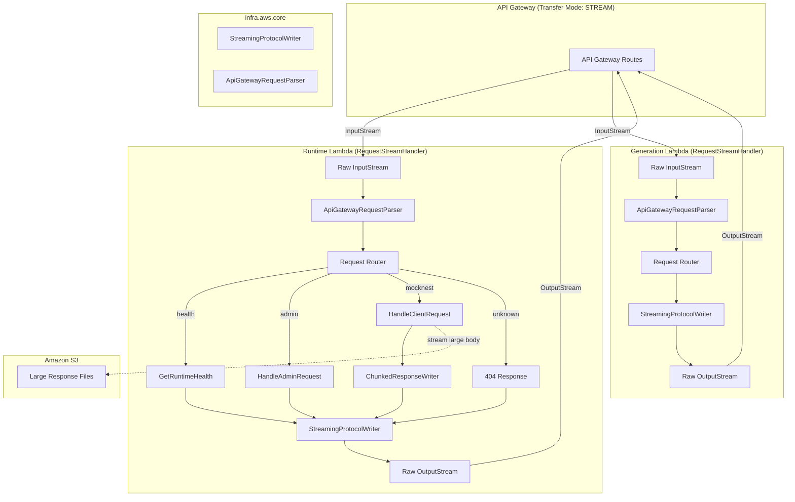

# Design Document: Response Streaming

## Overview

This design transforms MockNest Serverless from buffered Lambda responses (6MB limit) to streaming responses (200MB limit) by switching both the Runtime and Generation Lambda handlers from `RequestHandler<APIGatewayProxyRequestEvent, APIGatewayProxyResponseEvent>` to `RequestStreamHandler`. The streaming protocol writes a metadata JSON block, an 8 null byte delimiter, and then the response payload to a raw `OutputStream`.

Additionally, the Runtime Lambda gains SSE mock simulation via WireMock's `chunkedDribbleDelay`, splitting response bodies into timed chunks to simulate real-time streaming APIs.

### Key Design Decisions

1. **Shared `StreamingProtocolWriter`** — A single reusable component in `infra.aws.core` handles the streaming protocol format (metadata + delimiter + body) for both Lambda handlers, eliminating duplication.
2. **Shared `ApiGatewayRequestParser`** — A single component parses the raw `InputStream` JSON into the domain `HttpRequest`, replacing the SDK's `APIGatewayProxyRequestEvent` deserialization.
3. **`ChunkedResponseWriter`** in the runtime module — Handles SSE chunking logic (splitting body, delays, flushing) as a runtime-specific concern.
4. **S3 streaming via bounded buffer** — Large response bodies stored in S3 are streamed through a 1MB buffer without loading the entire file into memory.
5. **SnapStart compatibility preserved** — Priming hooks and CRaC registration remain in companion object `init` blocks, unchanged by the interface switch.

## Architecture



### Data Flow for a Standard Mock Response

1. API Gateway receives HTTP request, forwards as JSON payload via Lambda streaming integration
2. `ApiGatewayRequestParser` reads the raw `InputStream` and deserializes the API Gateway proxy request JSON
3. Request router dispatches to the appropriate use case (unchanged logic)
4. Use case returns an `HttpResponse` (unchanged)
5. `StreamingProtocolWriter` writes: metadata JSON → 8 null bytes → body bytes
6. API Gateway reads the stream and forwards the response to the client

### Data Flow for SSE/Chunked Mock Response

1. Steps 1-4 same as above
2. `ChunkedResponseWriter` detects `chunkedDribbleDelay` in the WireMock response
3. Writes metadata JSON → 8 null bytes via `StreamingProtocolWriter`
4. Splits body into N chunks, writes each chunk with `delay` ms pause between them, flushing after each

### Data Flow for Large S3-Stored Response

1. Steps 1-4 same as above, but WireMock response references a `bodyFileName` in S3
2. `StreamingProtocolWriter` writes metadata JSON → 8 null bytes
3. S3 object is streamed through a 1MB buffer directly to the `OutputStream`
4. No full in-memory loading of the response body

## Components and Interfaces

### `ApiGatewayRequestParser` (infra.aws.core)

Parses raw Lambda `InputStream` into a domain-level request object.

```kotlin
package nl.vintik.mocknest.infra.aws.core.streaming

import nl.vintik.mocknest.domain.core.HttpRequest
import java.io.InputStream

/**
 * Parses the API Gateway proxy request JSON from a raw Lambda InputStream.
 * Replaces SDK-based APIGatewayProxyRequestEvent deserialization.
 */
class ApiGatewayRequestParser {

    /**
     * Parses the raw InputStream into an HttpRequest.
     * Handles base64-encoded bodies, multi-value headers, and multi-value query parameters.
     *
     * @throws RequestParseException if the JSON is malformed or missing required fields
     */
    fun parse(input: InputStream): HttpRequest { ... }
}

class RequestParseException(message: String, cause: Throwable? = null) : RuntimeException(message, cause)
```

**Responsibilities:**
- Read and deserialize API Gateway proxy request JSON using Kotlinx Serialization
- Decode base64-encoded bodies when `isBase64Encoded` is true
- Merge `multiValueHeaders` and `multiValueQueryStringParameters` into the `HttpRequest`
- Throw `RequestParseException` for malformed JSON or missing required fields (`httpMethod`, `path`)

### `StreamingProtocolWriter` (infra.aws.core)

Writes the Lambda streaming response protocol format.

```kotlin
package nl.vintik.mocknest.infra.aws.core.streaming

import nl.vintik.mocknest.domain.core.HttpResponse
import java.io.OutputStream

/**
 * Writes the API Gateway streaming protocol:
 * 1. Metadata JSON (statusCode + headers)
 * 2. 8 null bytes delimiter
 * 3. Response body bytes
 *
 * Content type for the OutputStream: application/vnd.awslambda.http-integration-response
 */
class StreamingProtocolWriter {

    companion object {
        const val CONTENT_TYPE = "application/vnd.awslambda.http-integration-response"
        const val NULL_DELIMITER_SIZE = 8
        const val MAX_METADATA_SIZE = 16_376 // 16KB - 8 bytes for delimiter
    }

    /**
     * Writes a complete streaming response (metadata + delimiter + body).
     *
     * @throws MetadataTooLargeException if serialized metadata exceeds MAX_METADATA_SIZE
     * @throws java.io.IOException propagated from OutputStream on write failure
     */
    fun write(response: HttpResponse, output: OutputStream) { ... }

    /**
     * Writes only metadata + delimiter, leaving the body to be written separately.
     * Used by ChunkedResponseWriter for SSE streaming.
     */
    fun writeMetadataAndDelimiter(statusCode: Int, headers: Map<String, String>, output: OutputStream) { ... }
}

class MetadataTooLargeException(message: String) : RuntimeException(message)
```

**Responsibilities:**
- Serialize metadata block as UTF-8 JSON: `{"statusCode": N, "headers": {...}}`
- Write exactly 8 null bytes as delimiter
- Validate metadata size does not exceed 16,376 bytes
- Write body bytes after delimiter (or leave body writing to caller)
- Propagate I/O exceptions without writing partial data

### `ChunkedResponseWriter` (infra.aws.runtime)

Handles SSE mock chunking with delays.

```kotlin
package nl.vintik.mocknest.infra.aws.runtime.streaming

import java.io.OutputStream

/**
 * Splits a response body into chunks with delays between writes,
 * simulating Server-Sent Events streaming behavior.
 */
class ChunkedResponseWriter {

    /**
     * Writes the body in chunks with delays.
     *
     * @param body The complete response body bytes
     * @param numberOfChunks Number of chunks to split into (must be >= 2)
     * @param totalDurationMs Total delay in milliseconds distributed between chunks
     * @param output The OutputStream to write chunks to
     */
    fun writeChunked(body: ByteArray, numberOfChunks: Int, totalDurationMs: Long, output: OutputStream) { ... }

    /**
     * Calculates chunk sizes for a given body length and chunk count.
     * Each chunk is bodySize/numberOfChunks bytes, remainder goes to last chunk.
     */
    internal fun calculateChunkSizes(bodySize: Int, numberOfChunks: Int): List<Int> { ... }
}
```

**Responsibilities:**
- Split body into `numberOfChunks` equal-sized chunks (remainder in last chunk)
- Wait `totalDuration / numberOfChunks` ms before each chunk after the first
- Flush after each chunk write
- Log warning if `totalDuration` > 270,000 ms (4.5 minutes)
- Handle edge case: if `numberOfChunks` > body bytes, deliver one byte per chunk

### `StreamingRuntimeLambdaHandler` (infra.aws.runtime)

New streaming handler replacing `RuntimeLambdaHandler`.

```kotlin
package nl.vintik.mocknest.infra.aws.runtime.function

import com.amazonaws.services.lambda.runtime.Context
import com.amazonaws.services.lambda.runtime.RequestStreamHandler
import java.io.InputStream
import java.io.OutputStream

class StreamingRuntimeLambdaHandler : RequestStreamHandler, KoinComponent {

    companion object {
        init {
            // Same Koin bootstrap, priming, and CRaC registration as current handler
            KoinBootstrap.init(listOf(coreModule(), runtimeModule()))
            KoinBootstrap.getKoin().get<RuntimePrimingHook>().onApplicationReady()
            KoinBootstrap.getKoin().get<RuntimeMappingReloadHook>().register()
        }
    }

    override fun handleRequest(input: InputStream, output: OutputStream, context: Context) { ... }
}
```

**Responsibilities:**
- Parse input via `ApiGatewayRequestParser`
- Route request (same logic as current handler)
- For client requests: detect `chunkedDribbleDelay` and use `ChunkedResponseWriter` if present
- For large S3-stored bodies: stream from S3 with bounded buffer
- Write response via `StreamingProtocolWriter`
- On parse failure: write 400 streaming response

### `StreamingGenerationLambdaHandler` (infra.aws.generation)

New streaming handler replacing `GenerationLambdaHandler`.

```kotlin
package nl.vintik.mocknest.infra.aws.generation.function

import com.amazonaws.services.lambda.runtime.Context
import com.amazonaws.services.lambda.runtime.RequestStreamHandler
import java.io.InputStream
import java.io.OutputStream

class StreamingGenerationLambdaHandler : RequestStreamHandler, KoinComponent {

    companion object {
        init {
            KoinBootstrap.init(listOf(coreModule(), generationModule()))
            KoinBootstrap.getKoin().get<GenerationPrimingHook>().onApplicationReady()
        }
    }

    override fun handleRequest(input: InputStream, output: OutputStream, context: Context) { ... }
}
```

**Responsibilities:**
- Parse input via `ApiGatewayRequestParser`
- Route request (same logic as current handler)
- Write response via `StreamingProtocolWriter`
- On parse failure: write 400 streaming response

### Updated `HttpRequest` Domain Model

The domain `HttpRequest` needs to support multi-value headers and query parameters for full API Gateway compatibility:

```kotlin
package nl.vintik.mocknest.domain.core

data class HttpRequest(
    val method: HttpMethod,
    val headers: Map<String, String> = emptyMap(),
    val multiValueHeaders: Map<String, List<String>> = emptyMap(),
    val path: String,
    val queryParameters: Map<String, String> = emptyMap(),
    val multiValueQueryParameters: Map<String, List<String>> = emptyMap(),
    val body: String? = null,
)
```

The existing `headers` and `queryParameters` fields remain for backward compatibility with existing use cases. The new `multiValueHeaders` and `multiValueQueryParameters` fields carry the full multi-value data from API Gateway.

### SAM Template Changes

Both Runtime and Generation Lambda function resources need:
1. `Handler` property updated to new streaming handler class names
2. Each API event needs `Properties` with streaming transfer mode

Example for a function event:
```yaml
Events:
  MockRoutes:
    Type: Api
    Properties:
      RestApiId: !Ref MockNestApiKeyModeApi
      Path: /mocknest/{proxy+}
      Method: ANY
      # Enable response streaming
      Auth:
        ApiKeyRequired: true
```

Note: SAM/API Gateway REST API streaming requires the `x-amazon-apigateway-integration` extension with `type: aws_proxy` and response streaming configuration. The exact SAM syntax will be validated during implementation with `sam validate`.

## Data Models

### Streaming Protocol Wire Format

```
┌─────────────────────────────────────────────────────────┐
│ Metadata JSON (UTF-8)                                    │
│ {"statusCode":200,"headers":{"Content-Type":"text/plain"}}│
├─────────────────────────────────────────────────────────┤
│ 8 null bytes: \x00\x00\x00\x00\x00\x00\x00\x00         │
├─────────────────────────────────────────────────────────┤
│ Response body bytes (0 to 200MB)                         │
│ Hello, World!                                            │
└─────────────────────────────────────────────────────────┘
```

### Metadata Block JSON Schema

```json
{
  "statusCode": 200,
  "headers": {
    "Content-Type": "application/json",
    "X-Custom-Header": "value"
  },
  "cookies": ["session=abc; Path=/; HttpOnly"]
}
```

- `statusCode`: Integer 100–599 (required)
- `headers`: Map of header name to single string value (required, may be empty)
- `cookies`: Array of Set-Cookie strings (optional)

### API Gateway Proxy Request JSON (Input)

The raw `InputStream` contains the standard API Gateway proxy request format:

```json
{
  "httpMethod": "GET",
  "path": "/mocknest/api/users",
  "headers": { "Accept": "application/json" },
  "multiValueHeaders": { "Accept": ["application/json", "text/html"] },
  "queryStringParameters": { "page": "1" },
  "multiValueQueryStringParameters": { "page": ["1"], "filter": ["active", "recent"] },
  "body": null,
  "isBase64Encoded": false
}
```

### `ChunkedDribbleDelay` Configuration (from WireMock Response)

```json
{
  "chunkedDribbleDelay": {
    "numberOfChunks": 5,
    "totalDuration": 3000
  }
}
```

- `numberOfChunks`: Integer >= 2 for chunking to activate
- `totalDuration`: Integer >= 0, total milliseconds to spread delivery over

### Chunking Algorithm

For a body of `B` bytes split into `N` chunks:
- Base chunk size: `B / N` (integer division)
- Last chunk size: `B / N + B % N` (gets the remainder)
- Delay between chunks: `totalDuration / N` ms (integer division)
- First chunk written immediately, subsequent chunks after delay

## Correctness Properties

*A property is a characteristic or behavior that should hold true across all valid executions of a system — essentially, a formal statement about what the system should do. Properties serve as the bridge between human-readable specifications and machine-verifiable correctness guarantees.*

### Property 1: Streaming Protocol Round-Trip

*For any* `HttpResponse` with a status code in 100–599, a headers map of 0–50 string-to-string entries (total serialized metadata ≤ 16,376 bytes), and a body of 0 to 10MB, writing the response through `StreamingProtocolWriter` and then parsing the resulting byte stream SHALL yield a byte-identical body, an identical status code, and identical header name-value pairs.

**Validates: Requirements 3.1, 3.2, 3.3, 3.4, 3.5, 3.6**

### Property 2: Request Parsing Equivalence

*For any* valid API Gateway proxy request JSON containing an `httpMethod` (any valid HTTP method), a `path` (any non-empty string), optional `headers`, optional `multiValueHeaders`, optional `queryStringParameters`, optional `multiValueQueryStringParameters`, an optional `body` (plain or base64-encoded), and an `isBase64Encoded` flag, parsing with `ApiGatewayRequestParser` SHALL produce an `HttpRequest` with method, path, decoded body, and merged header/query parameter values identical to what the previous `APIGatewayProxyRequestEvent` SDK deserialization produced for the same JSON input.

**Validates: Requirements 1.2, 2.2, 6.1, 6.2, 6.4, 6.5, 6.6**

### Property 3: Chunked Delivery Preserves Body

*For any* response body of 1 to 100,000 bytes and any `numberOfChunks` in 2–1000 (where `numberOfChunks` ≤ body size), splitting the body via `ChunkedResponseWriter.calculateChunkSizes` and concatenating the resulting chunks SHALL produce a byte sequence identical to the original body, with exactly `numberOfChunks` chunks produced.

**Validates: Requirements 4.1, 4.6**

### Property 4: Chunked Delay Calculation

*For any* `totalDuration` in 0–270,000 ms and `numberOfChunks` in 2–1000, the inter-chunk delay SHALL equal `totalDuration / numberOfChunks` (integer division), and the total number of delays SHALL equal `numberOfChunks - 1` (no delay before the first chunk).

**Validates: Requirements 4.2**

### Property 5: S3 Streaming With Bounded Buffer

*For any* S3 object of size 1 byte to 50MB, streaming the object to an `OutputStream` via the S3 streaming adapter SHALL write the complete object content byte-for-byte to the output, and no single read buffer allocation SHALL exceed 1MB (1,048,576 bytes).

**Validates: Requirements 7.3**

### Property 6: Routing Preservation Under New Interface

*For any* request path, the `StreamingRuntimeLambdaHandler` SHALL route to the same use case as the current `RuntimeLambdaHandler`: `/__admin/health` → `GetRuntimeHealth`, `/__admin/*` → `HandleAdminRequest`, `/mocknest/*` → `HandleClientRequest`, all others → 404.

**Validates: Requirements 1.7, 2.8**

## Error Handling

| Scenario | Response | Behavior |
|----------|----------|----------|
| Malformed input JSON / missing `httpMethod` or `path` | HTTP 400 via streaming protocol | Write metadata with 400 status + error message body |
| Metadata block exceeds 16,376 bytes | `MetadataTooLargeException` thrown | Lambda runtime catches and returns platform error |
| I/O error writing to OutputStream | Exception propagated to Lambda runtime | No partial/corrupted data written |
| Response body exceeds 200MB | HTTP 502 via streaming protocol | Write metadata with 502 status + size limit error message |
| S3 file retrieval failure during streaming | Stream aborted, error logged | Log S3 key and failure reason at ERROR level |
| `chunkedDribbleDelay` with invalid config (`numberOfChunks` < 1 or `totalDuration` < 0) | Ignored — full body written at once | Graceful fallback, no error |
| `totalDuration` > 270,000 ms | Warning logged, chunking proceeds | WARN log about potential 5-minute idle timeout |
| `numberOfChunks` > body byte count | One byte per chunk, remaining chunks empty | Graceful handling per spec |

## Testing Strategy

### Unit Tests

- **`StreamingProtocolWriter`**: Verify metadata serialization, null delimiter, body writing, empty body, oversized metadata rejection, I/O error propagation
- **`ApiGatewayRequestParser`**: Verify field extraction, base64 decoding, multi-value header/query merging, malformed JSON handling
- **`ChunkedResponseWriter`**: Verify chunk size calculation, delay timing (with `runTest` for virtual time), flush behavior, edge cases (chunks > bytes, invalid config)
- **`StreamingRuntimeLambdaHandler`**: Verify routing (parameterized test), parse failure → 400, SnapStart initialization
- **`StreamingGenerationLambdaHandler`**: Verify routing, parse failure → 400, SnapStart initialization

### Property-Based Tests

Property-based testing is appropriate for this feature because:
- The streaming protocol writer is a pure serialization function with clear input/output
- Request parsing is a deserialization function with a large input space
- Chunking is a pure data transformation algorithm

**Library**: JUnit 6 `@ParameterizedTest` with `@MethodSource` providing 15–20 diverse test cases per property.

**Configuration**: Each property test uses deterministic, diverse examples covering edge cases (empty body, large body, special characters, many headers, single header, base64 bodies, unicode content).

**Tag format**: `Feature: response-streaming, Property {number}: {property_text}`

| Property | Test Class | Min Examples |
|----------|-----------|--------------|
| Property 1: Streaming Protocol Round-Trip | `StreamingProtocolRoundTripPropertyTest` | 15 |
| Property 2: Request Parsing Equivalence | `RequestParsingEquivalencePropertyTest` | 15 |
| Property 3: Chunked Delivery Preserves Body | `ChunkedDeliveryPropertyTest` | 15 |
| Property 4: Chunked Delay Calculation | `ChunkedDelayCalculationPropertyTest` | 15 |
| Property 5: S3 Streaming Bounded Buffer | `S3StreamingPropertyTest` | 10 |
| Property 6: Routing Preservation | `StreamingRoutingPropertyTest` | 20 (existing test data) |

### Integration Tests

- **End-to-end streaming**: Register mock → invoke → verify response body matches (< 6MB and > 6MB)
- **SSE chunking**: Register mock with `chunkedDribbleDelay` → invoke → verify delivery time ≥ 80% of `totalDuration`
- **Custom headers/status**: Register mock with custom status and headers → verify client receives them
- **Error status codes**: Register 404 and 503 mocks → verify correct status codes returned
- **Cleanup**: Delete all mappings after each test

### Post-Deploy Validation

Shell script tests using `curl` against the deployed API:
- Large payload (7MB+) delivery verification
- SSE chunked delivery timing verification
- Standard response body matching
- Custom header verification
- Cleanup after each test
