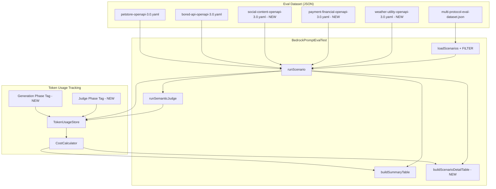

# Design Document: REST Eval Test Expansion

## Overview

This feature expands the Bedrock prompt evaluation test suite with comprehensive REST API scenarios to measure prompt quality across diverse API shapes and prompt complexity levels. Currently, the multi-protocol dataset contains only GraphQL (2 scenarios) and SOAP (1 scenario), with zero REST scenarios — despite REST being the primary protocol for MockNest users.

The expansion adds:
- 3 new synthetic OpenAPI specification files (social/content, payment/financial, weather/utility)
- 12+ REST scenarios in the multi-protocol dataset across 6 prompt complexity levels
- Separated generation vs. judge cost tracking in `TokenUsageStore`
- A per-scenario detail table alongside the existing summary table
- A `BEDROCK_EVAL_FILTER` environment variable for re-running scenario subsets
- Updated `docs/PROMPT_EVAL.md` documentation

All changes are test-only — no production code is modified. Existing GraphQL and SOAP scenarios remain unchanged.

## Architecture

The feature extends the existing eval infrastructure without changing its fundamental architecture. The key components and their relationships:



### Design Decisions

1. **Phase-tagged token tracking**: Rather than creating separate `TokenUsageStore` instances for generation and judge, we add a `phase` tag to `TokenUsageRecord`. This keeps the single-store architecture while enabling cost attribution. The `TokenUsageCapturingClient` is shared — the test code sets the current phase before each Bedrock call.

2. **Substring filter over tag-based filter**: `BEDROCK_EVAL_FILTER` uses case-insensitive substring matching on the scenario `input` field. This is simpler than a tag system and matches how scenario names are already structured (e.g., `rest-petstore-basic-get`, `rest-social-consistency`).

3. **Synthetic specs over real-world specs**: New OpenAPI specs are purpose-built for eval testing rather than sourced from public APIs. This gives us control over complexity, schema depth, and cross-entity relationships — exactly the properties we need to stress-test prompts.

4. **Detail table as separate method**: The scenario detail table is built by a new `buildScenarioDetailTable()` method, printed alongside (not replacing) the existing `buildSummaryTable()`. This preserves backward compatibility.

## Components and Interfaces

### New OpenAPI Specification Files

Three new synthetic OpenAPI 3.0 specs placed in `src/test/resources/eval/`:

| File | Domain | Endpoints | Key Characteristics |
|------|--------|-----------|---------------------|
| `social-content-openapi-3.0.yaml` | Social/Content | ~8-10 | Posts, comments, users with cross-entity relationships (post.authorId → user.id, comment.postId → post.id). Nested objects, arrays of references. |
| `payment-financial-openapi-3.0.yaml` | Payment/Financial | ~6-8 | Payments, customers, invoices with nested line items. Enum statuses (pending/completed/failed), decimal amounts, date fields. |
| `weather-utility-openapi-3.0.yaml` | Weather/Utility | 2-3 | Simple forecast and current-weather endpoints. Minimal schemas, few parameters. Tests prompt handling of small specs. |

Combined with existing specs:
- `petstore-openapi-3.0.yaml` — 20+ endpoints, large spec
- `bored-api-openapi-3.0.yaml` — 3 endpoints, small spec

This gives 5 distinct REST APIs covering small (2-3), medium (6-10), and large (20+) endpoint counts.

### Modified: `TokenUsageRecord`

```kotlin
data class TokenUsageRecord(
    val inputTokens: Int = 0,
    val outputTokens: Int = 0,
    val totalTokens: Int = 0,
    val phase: TokenPhase = TokenPhase.GENERATION
)

enum class TokenPhase {
    GENERATION,
    JUDGE
}
```

### Modified: `TokenUsageStore`

Add phase-aware query methods:

```kotlin
class TokenUsageStore {
    // ... existing methods unchanged ...

    fun getRecordsByPhase(phase: TokenPhase): List<TokenUsageRecord>
    fun getGenerationRecords(): List<TokenUsageRecord> = getRecordsByPhase(TokenPhase.GENERATION)
    fun getJudgeRecords(): List<TokenUsageRecord> = getRecordsByPhase(TokenPhase.JUDGE)

    /** Set the current phase for subsequent records */
    var currentPhase: TokenPhase = TokenPhase.GENERATION
}
```

### Modified: `TokenUsageCapturingClient`

The `converse` override reads `tokenUsageStore.currentPhase` and tags each recorded `TokenUsageRecord` with that phase. No API change — the phase is set externally by the test before calling generation or judge.

### Modified: `ScenarioResult`

Add cost breakdown fields:

```kotlin
private data class ScenarioResult(
    // ... existing fields ...
    val generationCost: Double = 0.0,
    val judgeCost: Double = 0.0,
    val estimatedCost: Double = 0.0  // total = generationCost + judgeCost
)
```

### Modified: `BedrockPromptEvalTest`

Key changes:

1. **`loadScenarios()`** — After loading all scenarios, apply `BEDROCK_EVAL_FILTER` substring filter if the env var is set.

2. **`runScenario()`** — Set `tokenUsageStore.currentPhase = TokenPhase.GENERATION` before generation, then `TokenPhase.JUDGE` before the semantic judge call. Compute `generationCost` and `judgeCost` separately.

3. **`buildScenarioDetailTable()`** — New method producing a per-scenario table grouped by API spec name, showing: scenario input, 1st-pass valid rate, after-retry valid rate, pass/fail, generation cost, judge cost, total cost, latency, and failure reason (if any).

4. **`buildSummaryTable()`** — Add a total cost footer row showing total generation cost, total judge cost, and combined total across all protocols.

5. **Main test method** — Print both `buildSummaryTable()` and `buildScenarioDetailTable()` to the log.

### New REST Scenarios in Dataset

12+ scenarios across 6 complexity levels, distributed across all 5 REST APIs:

| # | Scenario Input | API | Complexity | Description |
|---|---------------|-----|------------|-------------|
| 1 | `rest-petstore-basic-get` | Petstore | Basic | Generate mocks for all GET endpoints |
| 2 | `rest-bored-basic-all` | Bored API | Basic | Generate mocks for all 3 endpoints |
| 3 | `rest-social-basic-get` | Social | Basic | Generate mocks for all GET endpoints |
| 4 | `rest-petstore-filtered-pets` | Petstore | Filtered | Generate mocks only for pet-related endpoints |
| 5 | `rest-social-filtered-users` | Social | Filtered | Generate mocks only for user-related endpoints |
| 6 | `rest-petstore-consistency` | Petstore | Consistency | Generate mocks where GET /pets/1, GET /store/order/1, GET /user/john return consistent cross-entity data |
| 7 | `rest-social-consistency` | Social | Consistency | Generate mocks where GET /posts/1 author matches GET /users/1 and GET /comments for post 1 reference post 1 |
| 8 | `rest-petstore-error` | Petstore | Error | Generate 404 and 500 error responses for pet endpoints |
| 9 | `rest-payment-error` | Payment | Error | Generate error responses for payment failures (402, 404, 422) |
| 10 | `rest-social-realistic` | Social | Realistic Data | Generate mocks with realistic European names and content |
| 11 | `rest-payment-realistic` | Payment | Realistic Data | Generate mocks with realistic payment amounts in EUR |
| 12 | `rest-petstore-pagination` | Petstore | Edge Case | Generate mocks for findByStatus with 3 pages of results |
| 13 | `rest-weather-basic` | Weather | Basic | Generate mocks for all weather endpoints |
| 14 | `rest-payment-basic` | Payment | Basic | Generate mocks for all GET endpoints |

Each scenario includes a precise `semanticCheck` with concrete, verifiable criteria (exact endpoint paths, expected field names, HTTP status codes).

## Data Models

### Multi-Protocol Dataset Schema (unchanged)

The existing JSON schema is preserved:

```json
{
  "name": "string",
  "description": "string",
  "examples": [
    {
      "input": "string",
      "metadata": {
        "protocol": "REST | GraphQL | SOAP",
        "specFile": "eval/filename.yaml",
        "format": "OPENAPI_3 | GRAPHQL | WSDL",
        "namespace": "string",
        "description": "string",
        "semanticCheck": "string"
      }
    }
  ]
}
```

No schema changes are needed. New REST scenarios use `protocol: "REST"` and `format: "OPENAPI_3"`, which the existing `loadScenarios()` and `createAgentForProtocol()` already handle.

### OpenAPI Spec Design Principles

Each synthetic spec follows these design principles:
- Valid OpenAPI 3.0 parseable by `OpenAPISpecificationParser`
- Realistic domain modeling with proper `$ref` usage for shared schemas
- Cross-entity relationships via ID references (e.g., `authorId`, `postId`)
- Mix of HTTP methods (GET, POST, PUT, DELETE)
- Proper response schemas with both success (200) and error (400, 404) responses
- Enum types for status fields
- Nested objects and arrays where appropriate


## Correctness Properties

*A property is a characteristic or behavior that should hold true across all valid executions of a system — essentially, a formal statement about what the system should do. Properties serve as the bridge between human-readable specifications and machine-verifiable correctness guarantees.*

### Property 1: OpenAPI spec parsing validity

*For any* OpenAPI specification file in the `eval/` test resources directory, parsing it with `OpenAPISpecificationParser` shall succeed without throwing an exception and shall produce a non-empty list of endpoints.

**Validates: Requirements 1.6**

### Property 2: REST scenario metadata validity

*For any* REST scenario in the multi-protocol eval dataset, the scenario shall have `protocol` equal to `"REST"`, `format` equal to `"OPENAPI_3"`, and a `specFile` that resolves to an existing classpath resource.

**Validates: Requirements 2.2**

### Property 3: Scenario detail table completeness

*For any* list of `ScenarioResult` objects (including both successful and failed results with varying cost breakdowns), the scenario detail table produced by `buildScenarioDetailTable()` shall contain every scenario's input name, first-pass valid rate, after-retry valid rate, pass/fail status, generation cost, judge cost, total cost, latency, and failure reason (for failed scenarios).

**Validates: Requirements 4.1, 4.3, 5.1**

### Property 4: Scenario detail table grouping by API

*For any* list of `ScenarioResult` objects from multiple distinct API specifications, the scenario detail table shall group results by API specification name such that all scenarios for the same spec appear in a contiguous block.

**Validates: Requirements 4.2**

### Property 5: Summary table cost totals

*For any* non-empty list of `ScenarioResult` objects with generation and judge cost data, the summary table produced by `buildSummaryTable()` shall display total generation cost, total judge cost, and total combined cost, and shall include a total cost footer line at the bottom.

**Validates: Requirements 5.2, 5.6**

### Property 6: Token usage phase filtering

*For any* sequence of `TokenUsageRecord` entries tagged with `GENERATION` or `JUDGE` phases recorded into a `TokenUsageStore`, calling `getGenerationRecords()` shall return exactly the records tagged `GENERATION`, and calling `getJudgeRecords()` shall return exactly the records tagged `JUDGE`, with no records lost or duplicated.

**Validates: Requirements 5.3**

### Property 7: Scenario filter correctness

*For any* filter string and any list of eval scenarios, applying the `BEDROCK_EVAL_FILTER` logic shall return exactly those scenarios whose `input` field contains the filter string as a case-insensitive substring. When the filter is null or empty, all scenarios shall be returned unchanged.

**Validates: Requirements 6.1, 6.2**

### Property 8: Semantic check quality

*For any* REST scenario in the multi-protocol eval dataset, the `semanticCheck` field shall contain at least one concrete, verifiable element (an HTTP path pattern, a specific HTTP status code, or a specific response field name) and shall not contain vague phrases such as "looks correct", "reasonable output", or "seems right".

**Validates: Requirements 8.1, 8.2**

## Error Handling

### Spec File Not Found

If a scenario references a `specFile` that doesn't exist on the classpath, `loadSpecContent()` already throws with a descriptive message. No change needed — new scenarios must reference valid spec files.

### Filter Produces Empty Scenario List

If `BEDROCK_EVAL_FILTER` matches zero scenarios, the test should log a warning and produce empty summary/detail tables rather than failing. This allows users to discover typos in their filter without a test crash.

### Phase Tracking Edge Cases

If `tokenUsageStore.currentPhase` is not explicitly set before a Bedrock call, it defaults to `GENERATION`. This is safe because the generation phase always runs first, and the judge phase is explicitly set before the semantic check call.

### Cost Calculation with Zero Tokens

`CostCalculator.calculateCost()` already handles zero-token inputs correctly (returns 0.0). No change needed for scenarios where generation or judge produces no tokens (e.g., on exception).

## Testing Strategy

### Unit Tests

Unit tests verify the new and modified components in isolation:

1. **`TokenUsageStore` phase filtering** — Test that records tagged with different phases are correctly filtered by `getGenerationRecords()` and `getJudgeRecords()`. Use `@ParameterizedTest` with diverse record sequences.

2. **`buildScenarioDetailTable()` output** — Test with synthetic `ScenarioResult` lists covering: single scenario, multiple scenarios from same API, multiple APIs, failed scenarios, zero-cost scenarios. Verify column presence, grouping, and failure reason display.

3. **`buildSummaryTable()` cost footer** — Test with synthetic results that the total cost footer line appears and sums correctly.

4. **Scenario filter logic** — Test substring matching with various filter strings: exact match, partial match, case-insensitive match, no match, null filter, empty filter.

5. **Dataset structural validation** — Test that the dataset JSON contains the required REST scenarios with correct metadata, complexity level distribution, and semantic check quality.

6. **OpenAPI spec validity** — Test that all OpenAPI spec files in the eval directory parse successfully with `OpenAPISpecificationParser`.

### Property-Based Tests

Property-based tests use `@ParameterizedTest` with diverse test data to verify universal properties:

- **Token phase filtering**: 15+ diverse record sequences with varying GENERATION/JUDGE distributions
- **Scenario filter**: 15+ filter string × scenario list combinations including edge cases (empty filter, no matches, all matches, special characters)
- **Detail table completeness**: 10+ ScenarioResult lists with varying sizes, success/failure mixes, and cost distributions
- **Spec parsing**: All OpenAPI spec files in the eval directory (5+ files)

Each property test runs with minimum 10-20 diverse examples per `@ParameterizedTest` to catch edge cases, following the project's testing standards.

**Property test configuration:**
- Tag format: **Feature: rest-eval-test-expansion, Property {number}: {property_text}**
- Use JUnit 6 `@ParameterizedTest` with `@MethodSource` for complex test data
- Use `@ValueSource` for simple string/file-based parameterization

### Integration Tests

Integration-level verification happens during actual eval runs (requires `BEDROCK_EVAL_ENABLED=true`):

- REST scenarios produce valid mocks and pass semantic checks
- Summary table includes a REST row with aggregate metrics
- Detail table shows per-scenario breakdown
- Cost breakdown shows non-zero generation and judge costs
- Filter correctly limits which scenarios run

These are not automated in CI — they require Bedrock access and incur cost. They are run manually during prompt tuning.

### What Is NOT Tested with PBT

- Documentation content (PROMPT_EVAL.md updates) — manual review
- Build configuration (Gradle task setup) — smoke test
- Actual Bedrock generation quality — integration test requiring live Bedrock access
- Visual formatting of tables — example-based tests with expected output snippets
