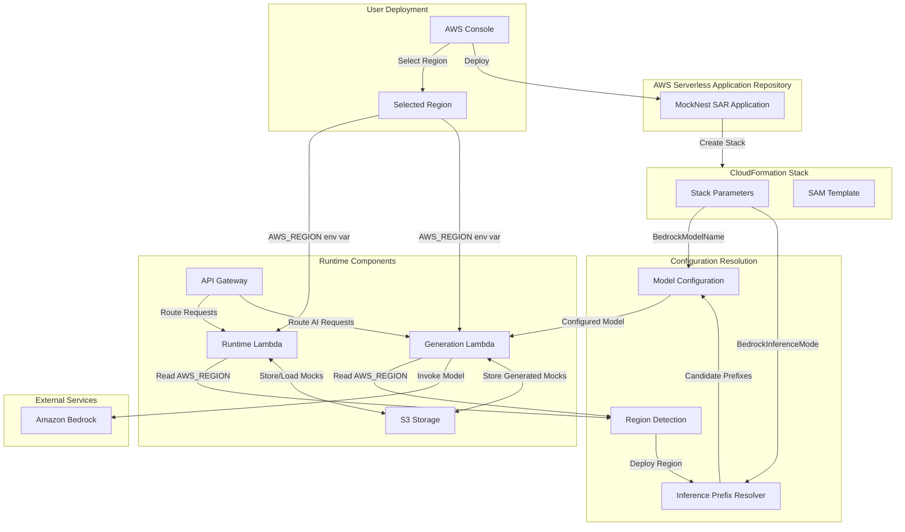

# Design Document: SAR Deployment Hardening

## Overview

This design document describes the architectural changes required to harden MockNest Serverless for public AWS Serverless Application Repository (SAR) publication. The feature addresses critical production-readiness issues while maintaining full Koog AI framework integration and ensuring a smooth user experience for SAR deployments.

### Goals

1. **Eliminate Configuration Confusion**: Remove misleading region parameters that don't control deployment location
2. **Simplify User Experience**: Automate complex Bedrock inference profile selection
3. **Enhance Security**: Implement least-privilege IAM permissions
4. **Enable Public Distribution**: Meet all AWS SAR technical requirements
5. **Provide Comprehensive Documentation**: Support different user personas (SAR users, developers, contributors)
6. **Establish Quality Standards**: Define tested configurations and validate across multiple regions

### Key Design Principles

- **Automatic over Manual**: Prefer automatic detection and configuration over user-provided parameters
- **Graceful Degradation**: AI features are optional; core runtime works without Bedrock access
- **Clear Boundaries**: Document tested vs. experimental configurations without technical enforcement
- **Security First**: Follow least-privilege principles for all IAM permissions
- **User-Centric Documentation**: Separate concerns for different user personas

## Architecture

### System Context

MockNest Serverless consists of two main Lambda functions:
- **Runtime Function**: Serves WireMock admin API and mocked endpoints (core functionality)
- **Generation Function**: Provides AI-powered mock generation using Amazon Bedrock (optional)

Both functions share S3 storage for mock definitions and response payloads. The SAR deployment hardening focuses on:
1. Automatic region detection and configuration
2. Intelligent Bedrock inference profile selection
3. Tightened IAM permissions
4. Enhanced health monitoring
5. Comprehensive documentation

### Component Architecture



### Key Architectural Changes

#### 1. Region Parameter Removal

**Current State**: SAM template includes `AppRegion` parameter that users must configure, creating confusion about which region controls deployment.

**New Design**: 
- Remove `AppRegion` parameter from SAM template
- Remove `MOCKNEST_APP_REGION` environment variable
- Use AWS-provided `AWS_REGION` environment variable (automatically set by Lambda runtime)
- All AWS SDK clients (S3, Bedrock) use the deployment region from `AWS_REGION`

**Rationale**: The deployment region is determined by the user's region selection in the AWS Console during SAR deployment. Having a separate parameter is misleading and error-prone.

#### 2. Inference Prefix Resolution

**Current State**: Users must manually select `BedrockInferencePrefix` (global, eu, us, etc.) without understanding model capabilities or regional availability.

**New Design**: Introduce `InferencePrefixResolver` component that:
- Automatically determines geo prefix from deployment region
- Provides candidate prefixes based on `BedrockInferenceMode` parameter
- Implements fallback strategy when primary prefix fails

**Component Design**:

```kotlin
class InferencePrefixResolver(
    private val deployRegion: String,
    private val inferenceMode: InferenceMode
) {
    enum class InferenceMode {
        AUTO,        // Try global first, then geo
        GLOBAL_ONLY, // Only try global
        GEO_ONLY     // Only try geo-specific
    }
    
    fun getCandidatePrefixes(): List<String> {
        val geoPrefix = deriveGeoPrefix(deployRegion)
        return when (inferenceMode) {
            AUTO -> listOf("global", geoPrefix)
            GLOBAL_ONLY -> listOf("global")
            GEO_ONLY -> listOf(geoPrefix)
        }
    }
    
    private fun deriveGeoPrefix(region: String): String {
        return when {
            region.startsWith("eu-") -> "eu"
            region.startsWith("us-") -> "us"
            region.startsWith("ap-") -> "ap"
            region.startsWith("ca-") -> "ca"
            region.startsWith("me-") -> "me"
            region.startsWith("sa-") -> "sa"
            region.startsWith("af-") -> "af"
            else -> "us" // Default fallback
        }
    }
}
```

#### 3. Model Configuration with Fallback

**Current State**: `ModelConfiguration` applies a single inference prefix to all models.

**New Design**: Enhanced `ModelConfiguration` that:
- Attempts candidate prefixes in order
- Retries on model-not-found or access-denied errors
- Falls back to no prefix if all candidates fail
- Caches successful prefix for subsequent invocations
- Provides detailed error messages including attempted prefixes

**Enhanced Component**:

```kotlin
class ModelConfiguration(
    private val modelName: String,
    private val prefixResolver: InferencePrefixResolver
) {
    private var cachedPrefix: String? = null
    
    fun getModel(): LLModel {
        val baseModel = mapModelNameToLLModel(modelName)
        
        // Use cached prefix if available
        cachedPrefix?.let {
            return baseModel.withInferenceProfile(it)
        }
        
        // Try candidate prefixes in order
        val candidates = prefixResolver.getCandidatePrefixes()
        for (prefix in candidates) {
            try {
                val model = baseModel.withInferenceProfile(prefix)
                // Test invocation would happen at first use
                cachedPrefix = prefix
                return model
            } catch (e: Exception) {
                if (isRetryableError(e)) {
                    logger.debug { "Prefix $prefix failed, trying next candidate" }
                    continue
                } else {
                    throw e // Non-retryable error
                }
            }
        }
        
        // Final fallback: try without prefix
        try {
            return baseModel
        } catch (e: Exception) {
            throw ModelConfigurationException(
                "Failed to configure model $modelName in region ${prefixResolver.deployRegion}. " +
                "Attempted prefixes: $candidates. Error: ${e.message}"
            )
        }
    }
    
    private fun isRetryableError(e: Exception): Boolean {
        // Check for model not found or access denied errors
        return e.message?.contains("not found", ignoreCase = true) == true ||
               e.message?.contains("access denied", ignoreCase = true) == true ||
               e.message?.contains("not enabled", ignoreCase = true) == true
    }
}
```

#### 4. IAM Permission Tightening

**Current State**: IAM policy includes `bedrock:ListFoundationModels` and uses `Resource: *` for Bedrock permissions.

**New Design**: Tightened IAM policy that:
- Removes unnecessary `bedrock:ListFoundationModels` action
- Scopes Bedrock permissions to deployment region
- Uses specific resource ARN pattern
- Includes documentation comments explaining resource scope

**IAM Policy**:

```yaml
- PolicyName: MockNestBedrockAccess
  PolicyDocument:
    Version: '2012-10-17'
    Statement:
      - Effect: Allow
        Action:
          - bedrock:InvokeModel
          - bedrock:InvokeModelWithResponseStream
        # Scoped to deployment region for security
        # Pattern covers both foundation models and inference profiles:
        # - arn:aws:bedrock:region::foundation-model/model-id
        # - arn:aws:bedrock:region::inference-profile/prefix.model-id
        Resource: !Sub "arn:aws:bedrock:${AWS::Region}:*:*"
```

**Rationale**: 
- `ListFoundationModels` is not needed since we use reflection to map model names
- Region scoping prevents cross-region access
- Wildcard in account and resource portions is necessary to cover both foundation models and inference profiles

#### 5. Storage Simplification

**Current State**: `CompositeMappingsSource` supports both S3 storage and classpath/filesystem loading.

**New Design**: S3-only storage with simplified configuration:
- Remove `CompositeMappingsSource` complexity
- Use `ObjectStorageMappingsSource` directly
- Remove classpath fallback for mappings
- Implement health check as a standard WireMock mapping in S3

**Rationale**:
- Serverless environments should not rely on filesystem or classpath for runtime data
- Simplifies codebase and reduces potential failure modes
- All mocks are explicitly managed through S3, providing clear audit trail

#### 6. Health Check Endpoints

**Current State**: No dedicated health check endpoints.

**New Design**: Two separate health check endpoints:

**Runtime Health Endpoint** (`GET /__admin/health`):
```json
{
  "status": "healthy",
  "timestamp": "2024-01-15T10:30:00Z",
  "region": "eu-west-1",
  "storage": {
    "bucket": "mocknest-storage-bucket",
    "connectivity": "ok"
  }
}
```

**AI Health Endpoint** (`GET /ai/health`):
```json
{
  "status": "healthy",
  "timestamp": "2024-01-15T10:30:00Z",
  "region": "eu-west-1",
  "ai": {
    "modelName": "AmazonNovaPro",
    "inferencePrefix": "global",
    "inferenceMode": "AUTO",
    "lastInvocationSuccess": true,
    "officiallySupported": true
  }
}
```

**Implementation**: Both endpoints are implemented as Spring Boot controller endpoints that return JSON responses with appropriate HTTP status codes.

## Components and Interfaces

### InferencePrefixResolver

**Purpose**: Automatically determine the optimal Bedrock inference profile prefix based on deployment region and user preferences.

**Interface**:
```kotlin
interface InferencePrefixResolver {
    /**
     * Get ordered list of candidate inference prefixes to try.
     * Order matters: first prefix is tried first, with fallback to subsequent prefixes.
     */
    fun getCandidatePrefixes(): List<String>
    
    /**
     * Get the deployment region this resolver is configured for.
     */
    val deployRegion: String
}
```

**Implementation**:
```kotlin
class DefaultInferencePrefixResolver(
    override val deployRegion: String,
    private val inferenceMode: InferenceMode
) : InferencePrefixResolver {
    
    override fun getCandidatePrefixes(): List<String> {
        val geoPrefix = deriveGeoPrefix(deployRegion)
        return when (inferenceMode) {
            InferenceMode.AUTO -> listOf("global", geoPrefix)
            InferenceMode.GLOBAL_ONLY -> listOf("global")
            InferenceMode.GEO_ONLY -> listOf(geoPrefix)
        }
    }
    
    private fun deriveGeoPrefix(region: String): String {
        return when {
            region.startsWith("eu-") -> "eu"
            region.startsWith("us-") -> "us"
            region.startsWith("ap-") -> "ap"
            region.startsWith("ca-") -> "ca"
            region.startsWith("me-") -> "me"
            region.startsWith("sa-") -> "sa"
            region.startsWith("af-") -> "af"
            else -> {
                logger.warn { "Unknown region prefix for $region, defaulting to 'us'" }
                "us"
            }
        }
    }
}
```

### Enhanced ModelConfiguration

**Purpose**: Configure Bedrock models with automatic inference prefix selection and fallback.

**Key Methods**:
```kotlin
class ModelConfiguration(
    private val modelName: String,
    private val prefixResolver: InferencePrefixResolver
) {
    /**
     * Get configured LLModel with optimal inference prefix.
     * Implements fallback strategy across candidate prefixes.
     */
    fun getModel(): LLModel
    
    /**
     * Get the model name for logging and health checks.
     */
    fun getModelName(): String
    
    /**
     * Check if the current model is officially supported.
     */
    fun isOfficiallySupported(): Boolean = modelName == "AmazonNovaPro"
    
    /**
     * Get the successfully cached inference prefix (if any).
     */
    fun getCachedPrefix(): String?
}
```

### Health Check Controllers

**Runtime Health Controller**:
```kotlin
@RestController
@RequestMapping("/__admin")
class RuntimeHealthController(
    private val storage: ObjectStorageInterface,
    @Value("\${aws.region}") private val region: String
) {
    @GetMapping("/health")
    fun health(): ResponseEntity<RuntimeHealthResponse> {
        val connectivity = checkStorageConnectivity()
        return ResponseEntity.ok(
            RuntimeHealthResponse(
                status = if (connectivity) "healthy" else "degraded",
                timestamp = Instant.now(),
                region = region,
                storage = StorageHealth(
                    bucket = storage.bucketName,
                    connectivity = if (connectivity) "ok" else "error"
                )
            )
        )
    }
    
    private fun checkStorageConnectivity(): Boolean {
        return runCatching {
            storage.exists("health-check-probe")
        }.isSuccess
    }
}
```

**AI Health Controller**:
```kotlin
@RestController
@RequestMapping("/ai")
class AIHealthController(
    private val modelConfig: ModelConfiguration,
    private val prefixResolver: InferencePrefixResolver,
    @Value("\${aws.region}") private val region: String
) {
    @GetMapping("/health")
    fun health(): ResponseEntity<AIHealthResponse> {
        return ResponseEntity.ok(
            AIHealthResponse(
                status = "healthy",
                timestamp = Instant.now(),
                region = region,
                ai = AIHealth(
                    modelName = modelConfig.getModelName(),
                    inferencePrefix = modelConfig.getCachedPrefix() ?: "not-yet-invoked",
                    inferenceMode = prefixResolver.inferenceMode.name,
                    lastInvocationSuccess = null, // Updated after first invocation
                    officiallySupported = modelConfig.isOfficiallySupported()
                )
            )
        )
    }
}
```

## Data Models

### Configuration Data Models

```kotlin
/**
 * Inference mode configuration.
 */
enum class InferenceMode {
    /** Try global prefix first, then geo-specific prefix */
    AUTO,
    
    /** Only try global prefix */
    GLOBAL_ONLY,
    
    /** Only try geo-specific prefix derived from deployment region */
    GEO_ONLY
}

/**
 * Model configuration exception with detailed context.
 */
class ModelConfigurationException(
    message: String,
    cause: Throwable? = null
) : RuntimeException(message, cause)
```

### Health Check Response Models

```kotlin
/**
 * Runtime health check response.
 */
data class RuntimeHealthResponse(
    val status: String,
    val timestamp: Instant,
    val region: String,
    val storage: StorageHealth
)

data class StorageHealth(
    val bucket: String,
    val connectivity: String
)

/**
 * AI health check response.
 */
data class AIHealthResponse(
    val status: String,
    val timestamp: Instant,
    val region: String,
    val ai: AIHealth
)

data class AIHealth(
    val modelName: String,
    val inferencePrefix: String,
    val inferenceMode: String,
    val lastInvocationSuccess: Boolean?,
    val officiallySupported: Boolean
)
```

### SAM Template Parameter Models

The SAM template will expose these user-facing parameters:

```yaml
Parameters:
  DeploymentName:
    Type: String
    Default: 'mocks'
    Description: Deployment instance identifier
    
  BucketName:
    Type: String
    Default: ''
    Description: Custom S3 bucket name (optional, auto-generated if empty)
    
  LambdaMemorySize:
    Type: Number
    Default: 1024
    MinValue: 512
    MaxValue: 10240
    Description: Lambda function memory size in MB
    
  LambdaTimeout:
    Type: Number
    Default: 120
    MinValue: 3
    MaxValue: 900
    Description: Lambda function timeout in seconds
    
  BedrockModelName:
    Type: String
    Default: 'AmazonNovaPro'
    Description: |
      Bedrock model for AI-powered mock generation.
      Amazon Nova Pro is officially supported and tested.
      Other models are experimental and may not work in all regions.
    AllowedValues:
      - AmazonNovaPro
      - AmazonNovaLite
      - AmazonNovaMicro
      - AnthropicClaude35SonnetV2
      - AnthropicClaude4_5Sonnet
      # ... other Koog-supported models
      
  BedrockInferenceMode:
    Type: String
    Default: 'AUTO'
    Description: |
      Inference profile selection mode:
      - AUTO: Try global first, then region-specific (recommended)
      - GLOBAL_ONLY: Force global inference profile
      - GEO_ONLY: Force region-specific inference profile
    AllowedValues:
      - AUTO
      - GLOBAL_ONLY
      - GEO_ONLY
      
  BedrockGenerationMaxRetries:
    Type: Number
    Default: 1
    Description: Maximum retry attempts for AI mock generation
```

## Correctness Properties


*A property is a characteristic or behavior that should hold true across all valid executions of a system—essentially, a formal statement about what the system should do. Properties serve as the bridge between human-readable specifications and machine-verifiable correctness guarantees.*

### Property 1: Region Configuration Consistency

*For any* AWS SDK client (S3, Bedrock) in the runtime, the client SHALL be configured to use the deployment region from the `AWS_REGION` environment variable.

**Validates: Requirements 1.3, 1.4, 10.3**

### Property 2: Model Name Mapping Robustness

*For any* model name string, the ModelConfiguration SHALL either successfully map it to a valid Koog BedrockModels constant OR fall back to AmazonNovaPro with a warning log entry.

**Validates: Requirements 2.4, 2.5**

### Property 3: Geo Prefix Derivation

*For any* AWS region string, the InferencePrefixResolver SHALL derive the correct geo prefix according to the region prefix mapping (eu-* → eu, us-* → us, ap-* → ap, ca-* → ca, me-* → me, sa-* → sa, af-* → af).

**Validates: Requirements 3.4**

### Property 4: Inference Prefix Retry with Fallback

*For any* list of candidate prefixes, when a Bedrock invocation fails with a retryable error (model not found, access denied, not enabled), the ModelConfiguration SHALL attempt the next candidate prefix in order until one succeeds or all are exhausted.

**Validates: Requirements 3.8, 3.9, 4.1**

### Property 5: Non-Retryable Error Propagation

*For any* Bedrock invocation error that is not retryable (throttling, validation error, internal server error), the ModelConfiguration SHALL immediately throw the error without attempting additional prefixes.

**Validates: Requirements 4.2**

### Property 6: Prefix Attempt Logging

*For any* inference prefix attempt, the ModelConfiguration SHALL log the attempt at DEBUG level before trying to use that prefix.

**Validates: Requirements 4.4**

### Property 7: Successful Prefix Caching

*For any* successful Bedrock model configuration, when a prefix succeeds, subsequent invocations of getModel() SHALL return a model using the cached prefix without re-attempting other candidates.

**Validates: Requirements 4.5**

### Property 8: Health Response Completeness

*For any* health check endpoint (runtime or AI), the response SHALL include all required fields: status, timestamp, region, and component-specific fields (storage for runtime, ai for generation).

**Validates: Requirements 8.3, 8.7, 8.10**

### Property 9: Koog Integration Preservation

*For any* AI-powered mock generation request, the system SHALL continue to use Koog BedrockModels enum mapping, withInferenceProfile() method calls, SingleLLMPromptExecutor, BedrockLLMClient, and GraphAIAgent without modification to existing functionality.

**Validates: Requirements 9.1, 9.2, 9.3, 9.4, 9.5, 9.6**

### Property 10: S3-Only Storage

*For any* WireMock mapping or file operation, the runtime SHALL use S3-backed storage exclusively without attempting to load from or save to local filesystem or classpath resources.

**Validates: Requirements 24.1, 24.2, 24.3**

### Example Tests

The following requirements are best validated through example-based tests rather than property-based tests:

**Template Structure Validation** (Requirements 1.1, 1.2, 2.1, 2.2, 2.3, 3.1, 3.2, 3.3, 5.1-5.6, 6.1-6.9, 11.1-11.3, 13.1-13.7):
- Parse SAM template and verify parameter presence/absence
- Verify parameter allowed values and defaults
- Verify environment variable mappings
- Verify IAM policy structure and permissions
- Verify SAR metadata fields

**Inference Mode Behavior** (Requirements 3.5, 3.6, 3.7):
- Test AUTO mode returns [global, geo_prefix]
- Test GLOBAL_ONLY mode returns [global]
- Test GEO_ONLY mode returns [geo_prefix]

**Health Endpoint Existence** (Requirements 8.1, 8.2, 8.4, 8.5, 8.6, 8.9):
- Test GET /__admin/health returns 200
- Test GET /ai/health returns 200
- Verify timestamp fields are present

**Configuration File Validation** (Requirements 10.1, 10.2, 10.4, 24.4, 24.6, 24.7):
- Verify application.properties doesn't contain aws.region or MOCKNEST_APP_REGION
- Verify BedrockConfiguration uses AWS_REGION
- Verify no filesystem paths in configuration
- Verify health check is not loaded from classpath

### Edge Cases

**Final Fallback Error Message** (Requirements 3.10, 3.11, 4.3):
- When all candidate prefixes fail and the no-prefix attempt also fails, verify the error message includes deployment region, model name, and all attempted prefixes

**Conditional AI Health Response** (Requirement 8.8):
- When Bedrock has been invoked, verify AI health response includes lastInvocationSuccess field
- When Bedrock has not been invoked, verify the field is null or indicates "not-yet-invoked"

## Error Handling

### Error Categories

The SAR deployment hardening introduces several error scenarios that must be handled gracefully:

#### 1. Model Configuration Errors

**Scenario**: Invalid model name provided
- **Handling**: Log warning, fall back to AmazonNovaPro
- **User Impact**: AI features work with default model
- **Logging**: WARN level with original model name

**Scenario**: All inference prefixes fail
- **Handling**: Attempt model without prefix, then throw descriptive error
- **User Impact**: Deployment fails with clear error message
- **Logging**: DEBUG for each attempt, ERROR for final failure
- **Error Message Format**: "Failed to configure model {modelName} in region {region}. Attempted prefixes: {prefixes}. Error: {details}"

**Scenario**: Non-retryable Bedrock error (throttling, validation)
- **Handling**: Immediately propagate error without retry
- **User Impact**: Request fails with original error
- **Logging**: ERROR level with full exception details

#### 2. Storage Connectivity Errors

**Scenario**: S3 bucket not accessible during health check
- **Handling**: Return "degraded" status with connectivity: "error"
- **User Impact**: Health check indicates problem but doesn't fail
- **Logging**: WARN level with bucket name and error details

**Scenario**: S3 operations fail during mapping load
- **Handling**: Log error, continue with empty mapping set
- **User Impact**: No mocks available until S3 is accessible
- **Logging**: ERROR level with operation details

#### 3. Region Detection Errors

**Scenario**: AWS_REGION environment variable not set
- **Handling**: This should never happen in Lambda, but fall back to eu-west-1 with warning
- **User Impact**: May use wrong region for Bedrock calls
- **Logging**: WARN level indicating fallback

**Scenario**: Unknown region prefix
- **Handling**: Default to "us" geo prefix with warning
- **User Impact**: May not use optimal inference profile
- **Logging**: WARN level with unknown region

### Error Response Formats

All API errors follow consistent JSON format:

```json
{
  "error": {
    "code": "MODEL_CONFIGURATION_ERROR",
    "message": "Failed to configure model AmazonNovaPro in region eu-west-1",
    "details": {
      "attemptedPrefixes": ["global", "eu"],
      "modelName": "AmazonNovaPro",
      "region": "eu-west-1"
    },
    "timestamp": "2024-01-15T10:30:00Z"
  }
}
```

### Retry Strategy

The system implements intelligent retry logic for Bedrock model configuration:

1. **Retryable Errors**: Model not found, access denied, access not enabled
2. **Non-Retryable Errors**: Throttling, validation errors, internal server errors
3. **Retry Sequence**: Try each candidate prefix in order, then try without prefix
4. **Caching**: Cache successful prefix to avoid retries on subsequent calls

## Testing Strategy

### Unit Testing Approach

The SAR deployment hardening requires comprehensive unit testing across multiple layers:

#### Configuration Layer Tests

**InferencePrefixResolver Tests**:
- Test geo prefix derivation for all AWS region patterns
- Test candidate prefix generation for each InferenceMode
- Test unknown region handling with default fallback
- Use parameterized tests for region mapping coverage

**ModelConfiguration Tests**:
- Test valid model name mapping using reflection
- Test invalid model name fallback to AmazonNovaPro
- Test prefix retry logic with mock Bedrock errors
- Test non-retryable error propagation
- Test successful prefix caching
- Test logging at appropriate levels
- Mock Koog BedrockModels and LLModel for isolation

**Health Controller Tests**:
- Test runtime health endpoint response structure
- Test AI health endpoint response structure
- Test storage connectivity checking
- Test officially supported model indication
- Mock storage and model configuration dependencies

#### Template Validation Tests

**SAM Template Tests**:
- Parse template YAML and verify structure
- Verify parameter presence, absence, defaults, and allowed values
- Verify environment variable mappings
- Verify IAM policy structure and resource scoping
- Verify SAR metadata completeness
- Use YAML parsing library for validation

#### Integration Layer Tests

**Storage Configuration Tests**:
- Verify S3-only storage configuration
- Verify no filesystem or classpath sources
- Verify CompositeMappingsSource removal
- Test that mappings load only from S3

**Bedrock Client Configuration Tests**:
- Verify client uses AWS_REGION for region configuration
- Verify no hardcoded region values
- Test client initialization with various region values

### Property-Based Testing

Property-based tests validate universal behaviors across many generated inputs:

**Property Test 1: Region Configuration Consistency**
- Generate random AWS region strings
- Verify all SDK clients use the region from AWS_REGION
- Minimum 100 iterations

**Property Test 2: Model Name Mapping Robustness**
- Generate valid and invalid model name strings
- Verify either successful mapping or fallback to AmazonNovaPro
- Verify warning logs for invalid names
- Minimum 100 iterations

**Property Test 3: Geo Prefix Derivation**
- Generate AWS region strings with various prefixes
- Verify correct geo prefix derivation
- Test edge cases (unknown prefixes, malformed regions)
- Minimum 100 iterations

**Property Test 4: Inference Prefix Retry with Fallback**
- Generate various candidate prefix lists
- Simulate retryable errors at different positions
- Verify correct retry sequence and eventual success or failure
- Minimum 100 iterations

**Property Test 5: Health Response Completeness**
- Generate various system states (healthy, degraded, error)
- Verify all required fields present in responses
- Verify JSON format validity
- Minimum 100 iterations

### Integration Testing

Integration tests validate end-to-end behavior in AWS environment:

**LocalStack Integration Tests**:
- Deploy SAM template to LocalStack
- Verify Lambda functions start successfully
- Verify health endpoints return correct responses
- Verify S3 storage operations work correctly
- Verify Bedrock client configuration (using LocalStack Bedrock emulation)

**Multi-Region Validation**:
- Test deployment to us-east-1, eu-west-1
- Verify automatic region detection works in each region
- Verify geo prefix derivation is correct for each region
- Verify Bedrock model access works (or fails gracefully)

### Test Coverage Goals

- **Unit Test Coverage**: 90% line coverage across all modules
- **Property Test Coverage**: All universal properties validated with 100+ iterations
- **Integration Test Coverage**: All three tested regions validated
- **Template Validation**: 100% of SAM template requirements verified

### Testing Tools

- **JUnit 5**: Unit test framework
- **MockK**: Mocking framework for Kotlin
- **Kotest Property Testing**: Property-based testing library
- **TestContainers**: LocalStack integration testing
- **YAML Parser**: Template validation (SnakeYAML or similar)
- **Kover**: Code coverage reporting

### Test Organization

Tests are organized by architectural layer:

```
software/
├── infra/aws/generation/src/test/kotlin/
│   ├── ai/config/
│   │   ├── InferencePrefixResolverTest.kt
│   │   ├── ModelConfigurationTest.kt
│   │   └── ModelConfigurationPropertyTest.kt
│   └── health/
│       └── AIHealthControllerTest.kt
├── infra/aws/runtime/src/test/kotlin/
│   └── health/
│       └── RuntimeHealthControllerTest.kt
└── application/src/test/kotlin/
    └── runtime/mappings/
        └── S3OnlyStorageTest.kt

deployment/aws/sam/src/test/kotlin/
└── template/
    └── SAMTemplateValidationTest.kt
```

## Deployment Architecture

### SAM Template Changes

The updated SAM template implements all hardening requirements:

#### Removed Parameters
- `AppRegion` - No longer needed, use AWS::Region
- `BedrockInferencePrefix` - Replaced by automatic selection

#### New Parameters
- `BedrockInferenceMode` - User control over prefix selection strategy

#### Modified Parameters
- `BedrockModelName` - Updated description to indicate official support

#### Environment Variable Changes

**Runtime Lambda**:
```yaml
Environment:
  Variables:
    SPRING_PROFILES_ACTIVE: aws
    MOCKNEST_S3_BUCKET_NAME: !Ref MockStorage
    # AWS_REGION automatically provided by Lambda runtime
```

**Generation Lambda**:
```yaml
Environment:
  Variables:
    SPRING_PROFILES_ACTIVE: aws
    MOCKNEST_S3_BUCKET_NAME: !Ref MockStorage
    BEDROCK_MODEL_NAME: !Ref BedrockModelName
    BEDROCK_INFERENCE_MODE: !Ref BedrockInferenceMode
    BEDROCK_GENERATION_MAX_RETRIES: !Ref BedrockGenerationMaxRetries
    # AWS_REGION automatically provided by Lambda runtime
```

#### IAM Policy Changes

```yaml
- PolicyName: MockNestBedrockAccess
  PolicyDocument:
    Version: '2012-10-17'
    Statement:
      - Effect: Allow
        Action:
          - bedrock:InvokeModel
          - bedrock:InvokeModelWithResponseStream
        # Scoped to deployment region for security.
        # Resource pattern covers both foundation models and inference profiles:
        # - arn:aws:bedrock:region::foundation-model/model-id
        # - arn:aws:bedrock:region::inference-profile/prefix.model-id
        # Wildcard in account portion is required because Bedrock resources
        # are owned by AWS, not the customer account.
        Resource: !Sub "arn:aws:bedrock:${AWS::Region}:*:*"
```

#### SAR Metadata Addition

```yaml
Metadata:
  AWS::ServerlessRepo::Application:
    Name: MockNest-Serverless
    Description: >
      AWS-native serverless mock runtime with AI-powered mock intelligence.
      Provides WireMock-compatible API mocking with S3 persistence and optional
      AI-assisted mock generation using Amazon Bedrock.
    Author: Vintik
    LicenseUrl: LICENSE
    ReadmeUrl: README-SAR.md
    Labels:
      - mock
      - testing
      - wiremock
      - serverless
      - ai
      - bedrock
    HomePageUrl: https://github.com/vintik/mocknest-serverless
    SourceCodeUrl: https://github.com/vintik/mocknest-serverless
    SemanticVersion: 1.0.0
```

### Deployment Workflow

#### Private SAR Testing Phase

1. **Publish to Private SAR**:
   ```bash
   sam package --template-file template.yaml \
               --output-template-file packaged.yaml \
               --s3-bucket mocknest-sar-artifacts \
               --region us-east-1
   
   sam publish --template packaged.yaml \
               --region us-east-1 \
               --semantic-version 1.0.0-beta.1
   ```

2. **Share with Test Account**:
   - Share application with specific AWS account IDs
   - Do not make public yet

3. **Test in Fresh Account**:
   - Deploy from SAR in us-east-1
   - Deploy from SAR in eu-west-1
   - Deploy from SAR in ap-southeast-1
   - Verify all functionality in each region

4. **Validation Checklist**:
   - [ ] Core runtime works (create, serve, persist mocks)
   - [ ] AI generation works with AmazonNovaPro
   - [ ] Health endpoints return correct information
   - [ ] API Gateway endpoints accessible with API key
   - [ ] CloudFormation outputs are correct
   - [ ] No manual region configuration needed
   - [ ] Inference prefix selection works automatically

#### Public SAR Release Phase

1. **Update to Public Sharing**:
   ```bash
   aws serverlessrepo put-application-policy \
       --application-id arn:aws:serverlessrepo:us-east-1:ACCOUNT:applications/MockNest-Serverless \
       --statements Principals='*',Actions=Deploy
   ```

2. **Publish Release Version**:
   ```bash
   sam publish --template packaged.yaml \
               --region us-east-1 \
               --semantic-version 1.0.0
   ```

3. **Update Documentation**:
   - Update README with SAR deployment instructions
   - Publish blog post announcing availability
   - Update GitHub releases

### Regional Considerations

#### Tested Regions
- **us-east-1** (N. Virginia): Primary testing region, Bedrock widely available
- **eu-west-1** (Ireland): European testing region, Bedrock available
- **ap-southeast-1** (Singapore): Asia-Pacific testing region, Bedrock available

#### Untested Regions
- Core runtime should work in any AWS region with Lambda, API Gateway, and S3
- AI features depend on Bedrock model availability in the region
- Users deploying to untested regions should verify Bedrock model access first

#### Model Availability
- Amazon Nova Pro: Available in us-east-1, us-west-2, eu-west-1, ap-southeast-1
- Other models: Availability varies by region
- Users should check AWS Bedrock documentation for current availability

## Documentation Structure

### Documentation Files

The SAR deployment hardening requires comprehensive documentation for different audiences:

#### README.md (Main Repository README)
- **Audience**: All visitors (SAR users, developers, contributors)
- **Structure**:
  - Quick Start for SAR Users (primary path)
  - Deployment for Developers (SAM-based)
  - Tested Configuration (regions and models)
  - Contributing (link to CONTRIBUTING.md)
- **Focus**: Clear separation between user and developer concerns

#### README-SAR.md (SAR-Specific README)
- **Audience**: SAR users viewing in AWS Console
- **Structure**:
  - How to Use (post-deployment instructions)
  - Input Parameters (with examples)
  - Output Format (with examples)
  - Common Use Cases
  - Error Handling
  - Cost Transparency
  - Security and IAM Permissions
- **Focus**: Deployment and usage, no developer setup

#### docs/USER_GUIDE.md (Comprehensive User Guide)
- **Audience**: MockNest users (post-deployment)
- **Structure**:
  - Getting Started
  - Core Features (tested WireMock functionality)
  - AI-Assisted Mock Generation
  - Common Workflows
  - Troubleshooting
  - Limitations
  - API Reference (link to OpenAPI spec)
- **Focus**: How to use the deployed application effectively

#### docs/api/mocknest-openapi.yaml (OpenAPI Specification)
- **Audience**: Developers integrating with MockNest
- **Content**:
  - All WireMock admin API endpoints
  - All AI generation endpoints
  - Health check endpoints
  - Request/response schemas
  - Authentication requirements
  - Example requests and responses
- **Focus**: Complete API contract documentation

#### CHANGELOG.md (Version History)
- **Audience**: All users tracking changes
- **Format**: Semantic versioning with categorized changes
- **Categories**: Added, Changed, Fixed, Removed, Security
- **Focus**: What changed between versions

### Documentation Maintenance

- Update README.md when adding features or changing deployment process
- Update README-SAR.md when changing SAR parameters or outputs
- Update USER_GUIDE.md when adding or changing functionality
- Update OpenAPI spec when adding or modifying endpoints
- Update CHANGELOG.md for every release
- Keep all documentation synchronized with code changes

## Security Considerations

### IAM Permissions

The hardened IAM policy follows least-privilege principles:

**Granted Permissions**:
- `bedrock:InvokeModel` - Required for AI mock generation
- `bedrock:InvokeModelWithResponseStream` - Required for streaming responses
- `s3:GetObject`, `s3:PutObject`, `s3:DeleteObject` - Required for mock storage
- `s3:ListBucket` - Required for listing mappings
- `sqs:SendMessage` - Required for dead letter queue

**Removed Permissions**:
- `bedrock:ListFoundationModels` - Not needed, use reflection instead

**Resource Scoping**:
- Bedrock: Scoped to deployment region only
- S3: Scoped to specific MockNest bucket only
- SQS: Scoped to specific DLQ only

### API Authentication

- API Gateway uses API key authentication by default
- API key is generated during deployment and provided in CloudFormation outputs
- Users should rotate API keys periodically
- Users can implement additional authentication (IAM, Cognito) if needed

### Data Security

- S3 bucket has versioning enabled for audit trail
- S3 bucket blocks all public access
- S3 bucket uses server-side encryption (default)
- CloudWatch logs retained for 30 days
- No sensitive data logged (API keys, credentials)

### Network Security

- Lambda functions run in AWS-managed VPC by default
- No VPC configuration required for basic usage
- Users can deploy into custom VPC if needed
- API Gateway provides DDoS protection

## Migration Guide

### Migrating from Pre-Hardening Versions

Users with existing MockNest deployments need to update their configuration:

#### Step 1: Update SAM Template

Remove the `AppRegion` parameter from any deployment scripts or configuration files.

**Before**:
```bash
sam deploy --parameter-overrides \
  AppRegion=eu-west-1 \
  BedrockInferencePrefix=eu
```

**After**:
```bash
sam deploy --parameter-overrides \
  BedrockInferenceMode=AUTO
```

#### Step 2: Update Environment Variables

If you have custom Lambda configuration, remove `MOCKNEST_APP_REGION`:

**Before**:
```yaml
Environment:
  Variables:
    MOCKNEST_APP_REGION: eu-west-1
```

**After**:
```yaml
Environment:
  Variables:
    # AWS_REGION automatically provided by Lambda
```

#### Step 3: Update Application Properties

Remove any `aws.region` configuration from application.properties:

**Before**:
```properties
aws.region=${MOCKNEST_APP_REGION}
```

**After**:
```properties
# Region automatically detected from AWS_REGION environment variable
```

#### Step 4: Test Deployment

1. Deploy updated template to test environment
2. Verify health endpoints return correct region
3. Verify AI generation works with automatic prefix selection
4. Verify core runtime functionality unchanged

#### Step 5: Update Production

1. Deploy to production during maintenance window
2. Monitor CloudWatch logs for any errors
3. Verify health endpoints
4. Test mock creation and serving

### Breaking Changes

- `AppRegion` parameter removed - use AWS Console region selection instead
- `BedrockInferencePrefix` parameter removed - use `BedrockInferenceMode` instead
- `MOCKNEST_APP_REGION` environment variable removed - use `AWS_REGION` instead
- Local filesystem mock loading removed - all mocks must be in S3

### Backward Compatibility

- Existing mocks in S3 continue to work without changes
- WireMock admin API remains unchanged
- AI generation API remains unchanged
- Health check endpoints are new additions (no breaking changes)

## Performance Considerations

### Cold Start Impact

The SAR deployment hardening has minimal impact on cold start times:

- **Region Detection**: Negligible (read environment variable)
- **Inference Prefix Resolution**: Negligible (simple string matching)
- **Model Configuration**: Adds one Bedrock API call on first invocation
- **Prefix Caching**: Eliminates overhead on subsequent invocations

### Runtime Performance

- **Health Checks**: Lightweight, no Bedrock calls
- **S3-Only Storage**: Slightly faster than composite source (no classpath scanning)
- **Prefix Retry**: Only occurs on first invocation or when model unavailable

### Optimization Strategies

- Cache successful inference prefix to avoid retries
- Use AUTO mode for best balance of reliability and performance
- Monitor CloudWatch metrics for cold start times
- Adjust Lambda memory if needed for faster cold starts

## Monitoring and Observability

### CloudWatch Metrics

Key metrics to monitor:

- **Lambda Invocations**: Track request volume
- **Lambda Errors**: Track configuration and runtime errors
- **Lambda Duration**: Monitor cold start and execution times
- **API Gateway 4xx/5xx**: Track client and server errors
- **S3 Operations**: Monitor storage access patterns

### CloudWatch Logs

Important log patterns to watch:

- `Failed to find model` - Invalid model name warnings
- `Prefix .* failed, trying next candidate` - Inference prefix retry attempts
- `Failed to configure model` - Model configuration errors
- `Storage connectivity check failed` - S3 access issues

### Health Check Monitoring

Set up automated health check monitoring:

```bash
# Runtime health check
curl -H "x-api-key: YOUR_API_KEY" \
  https://API_ID.execute-api.REGION.amazonaws.com/STAGE/__admin/health

# AI health check
curl -H "x-api-key: YOUR_API_KEY" \
  https://API_ID.execute-api.REGION.amazonaws.com/STAGE/ai/health
```

### Alerting Recommendations

- Alert on Lambda error rate > 5%
- Alert on API Gateway 5xx rate > 1%
- Alert on health check failures
- Alert on S3 access errors
- Alert on Bedrock throttling errors

## Future Enhancements

### Potential Improvements

1. **Dynamic Model Discovery**: Automatically discover available Bedrock models in the deployment region
2. **Prefix Performance Metrics**: Track which prefixes work best in each region
3. **Cost Estimation**: Include estimated costs in health check response
4. **Multi-Model Support**: Allow multiple models for different use cases
5. **Custom Inference Profiles**: Support user-defined inference profiles
6. **Enhanced Error Recovery**: Implement exponential backoff for transient errors
7. **Metrics Dashboard**: CloudWatch dashboard template for monitoring

### Backward Compatibility Commitment

Future enhancements will maintain backward compatibility:
- Existing parameters will not be removed without deprecation period
- New parameters will have sensible defaults
- API changes will be versioned
- Breaking changes will be clearly documented

## Conclusion

The SAR deployment hardening transforms MockNest Serverless from a development tool into a production-ready, publicly distributable application. By removing configuration confusion, automating complex decisions, tightening security, and providing comprehensive documentation, we enable users to deploy and use MockNest with confidence.

The key achievements of this design:

1. **Simplified User Experience**: Automatic region detection and inference prefix selection
2. **Enhanced Security**: Least-privilege IAM permissions with regional scoping
3. **Production Readiness**: Comprehensive testing, documentation, and monitoring
4. **Clear Boundaries**: Documented tested vs. experimental configurations
5. **Graceful Degradation**: AI features are optional, core runtime always works

This design provides a solid foundation for public SAR distribution while maintaining the flexibility and power that makes MockNest Serverless valuable for testing cloud-native applications.
