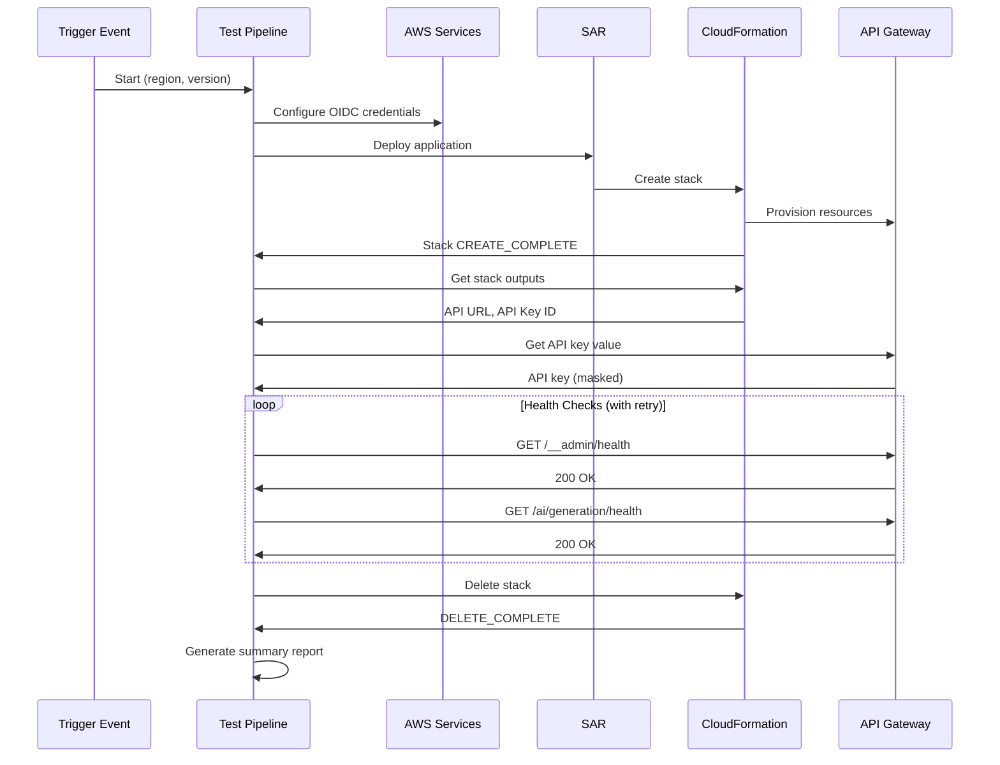
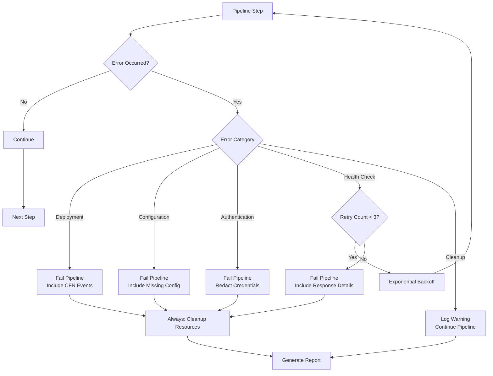
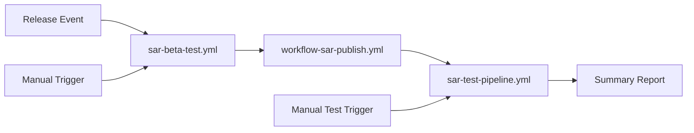

# Design Document: SAR Test Pipeline

## Overview

The SAR Test Pipeline is a GitHub Actions workflow that validates published MockNest Serverless applications by deploying them from the AWS Serverless Application Repository (SAR), executing comprehensive health checks, and cleaning up test resources. This pipeline ensures that SAR-published applications work correctly for end users before making them publicly available.

The pipeline bridges the gap between SAR publication and production readiness by providing automated validation that the deployment process, API key retrieval, and basic functionality all work as expected in a real AWS environment. It operates as both an automated quality gate (triggered after SAR publication) and a manual testing tool (triggered on-demand with region selection).

### Key Design Goals

1. **Automated Validation**: Automatically test SAR deployments after publication to catch issues early
2. **Multi-Region Support**: Enable testing across all Nova Pro supported regions to validate regional availability
3. **Security-First**: Handle API credentials securely without exposing them in logs or artifacts
4. **Comprehensive Testing**: Validate both core runtime and AI generation capabilities through health checks
5. **Clean Resource Management**: Ensure test resources are always cleaned up to avoid unnecessary costs
6. **Clear Reporting**: Provide actionable feedback through GitHub Actions summaries

## Architecture

### High-Level Architecture

```mermaid
flowchart TB
    subgraph Triggers["Pipeline Triggers"]
        AUTO[SAR Publish Workflow<br/>workflow_call]
        MANUAL[Manual Trigger<br/>workflow_dispatch]
    end

    subgraph Pipeline["SAR Test Pipeline"]
        SETUP[Setup & Authentication]
        DEPLOY[Deploy from SAR]
        OUTPUTS[Retrieve Stack Outputs]
        APIKEY[Retrieve API Key]
        HEALTH[Execute Health Checks]
        CLEANUP[Cleanup Resources]
        REPORT[Generate Report]
    end

    subgraph AWS["AWS Services"]
        SAR[Serverless Application<br/>Repository]
        CFN[CloudFormation]
        APIGW[API Gateway]
        S3[S3 Bucket]
    end

    AUTO --> SETUP
    MANUAL --> SETUP
    SETUP --> DEPLOY
    DEPLOY --> SAR
    SAR --> CFN
    CFN --> APIGW
    CFN --> S3
    DEPLOY --> OUTPUTS
    OUTPUTS --> APIKEY
    APIKEY --> HEALTH
    HEALTH --> APIGW
    HEALTH --> CLEANUP
    CLEANUP --> CFN
    CLEANUP --> REPORT
```



### Workflow Execution Flow



## Components and Interfaces

### 1. Pipeline Trigger Interface

The pipeline supports two trigger mechanisms:

**Workflow Call Trigger (Automated)**
```yaml
on:
  workflow_call:
    inputs:
      aws-region:
        required: true
        type: string
        description: 'AWS region where SAR was published'
      version:
        required: true
        type: string
        description: 'SAR application version to test'
    secrets:
      AWS_ACCOUNT_ID:
        required: true
```

**Workflow Dispatch Trigger (Manual)**
```yaml
on:
  workflow_dispatch:
    inputs:
      aws-region:
        required: false
        type: choice
        default: 'eu-west-1'
        description: 'AWS region for testing'
        options:
          - us-east-1
          - us-west-2
          - eu-west-1
          - eu-central-1
          - ap-southeast-1
          - ap-northeast-1
```

### 2. SAR Deployment Component

**Responsibility**: Deploy MockNest Serverless from SAR using AWS CLI

**Interface**:
```bash
# Input
SAR_APP_URL="https://serverlessrepo.aws.amazon.com/applications/eu-west-1/021259937026/MockNest-Serverless"
DEPLOYMENT_NAME="sar-test-${GITHUB_RUN_ID}"
AWS_REGION="${{ inputs.aws-region }}"

# Output
STACK_NAME="mocknest-sar-test-${GITHUB_RUN_ID}"
```

**Implementation Approach**:
- Use AWS CLI `aws serverlessrepo create-cloud-formation-change-set` to create a change set from SAR
- Execute the change set using `aws cloudformation execute-change-set`
- Wait for stack creation using `aws cloudformation wait stack-create-complete`
- Capture stack name for subsequent operations

**Error Handling**:
- Deployment failures result in immediate pipeline failure with CloudFormation error details
- Timeout after 15 minutes to prevent indefinite waiting
- Include CloudFormation stack events in error output for debugging

### 3. Stack Output Retrieval Component

**Responsibility**: Extract deployment outputs from CloudFormation stack

**Interface**:
```bash
# Input
STACK_NAME="mocknest-sar-test-${GITHUB_RUN_ID}"

# Output
API_URL=$(aws cloudformation describe-stacks \
  --stack-name "$STACK_NAME" \
  --query 'Stacks[0].Outputs[?OutputKey==`MockNestApiUrl`].OutputValue' \
  --output text)

API_KEY_ID=$(aws cloudformation describe-stacks \
  --stack-name "$STACK_NAME" \
  --query 'Stacks[0].Outputs[?OutputKey==`MockNestApiKey`].OutputValue' \
  --output text)
```

**Required Outputs**:
- `MockNestApiUrl`: API Gateway endpoint URL
- `MockNestApiKey`: API Gateway API key ID

**Error Handling**:
- Fail pipeline if any required output is missing
- Validate output format (URL must start with https://, API key ID must be alphanumeric)

### 4. API Key Retrieval Component

**Responsibility**: Securely retrieve API key value from AWS API Gateway

**Interface**:
```bash
# Input
API_KEY_ID="abc123xyz"

# Output (masked)
API_KEY_VALUE=$(aws apigateway get-api-key \
  --api-key "$API_KEY_ID" \
  --include-value \
  --query 'value' \
  --output text)

# Mask in GitHub Actions
echo "::add-mask::$API_KEY_VALUE"
echo "API_KEY_VALUE=$API_KEY_VALUE" >> $GITHUB_ENV
```

**Security Requirements**:
- Use GitHub Actions `::add-mask::` to prevent logging
- Store in environment variable, not GitHub output
- Never include in error messages or reports
- Redact from any HTTP request logging

**Error Handling**:
- Fail pipeline if API key retrieval fails
- Do not expose API key ID in error messages (use generic "API key retrieval failed")

### 5. Health Check Component

**Responsibility**: Validate deployed application functionality

**Interface**:
```bash
# Admin Health Check
curl -f -s -X GET \
  -H "x-api-key: $API_KEY_VALUE" \
  --max-time 30 \
  "$API_URL/__admin/health"

# AI Generation Health Check
curl -f -s -X GET \
  -H "x-api-key: $API_KEY_VALUE" \
  --max-time 30 \
  "$API_URL/ai/generation/health"
```

**Expected Responses**:
```json
{
  "status": "healthy"
}
```

**Retry Logic**:
- Maximum 3 attempts per health check
- Exponential backoff: 5s, 10s, 20s
- Retry on HTTP 5xx errors and timeouts
- Do not retry on HTTP 4xx errors (authentication/authorization issues)

**Error Handling**:
- Capture HTTP status code and response body
- Include in pipeline failure message
- Redact `x-api-key` header from any logged requests

### 6. Resource Cleanup Component

**Responsibility**: Delete test CloudFormation stack and verify resource removal

**Interface**:
```bash
# Delete stack
aws cloudformation delete-stack --stack-name "$STACK_NAME"

# Wait for deletion
aws cloudformation wait stack-delete-complete --stack-name "$STACK_NAME"

# Verify S3 bucket deletion
BUCKET_NAME=$(aws cloudformation describe-stacks \
  --stack-name "$STACK_NAME" \
  --query 'Stacks[0].Outputs[?OutputKey==`MockStorageBucket`].OutputValue' \
  --output text 2>/dev/null || echo "")

if [ -n "$BUCKET_NAME" ]; then
  aws s3 ls "s3://$BUCKET_NAME" 2>/dev/null && echo "WARNING: Bucket still exists"
fi
```

**Cleanup Guarantees**:
- Execute in GitHub Actions `always()` condition to run even on failure
- Log warnings for cleanup failures but do not fail pipeline
- Timeout after 10 minutes to prevent indefinite waiting

**Error Handling**:
- Log cleanup failures as warnings
- Continue pipeline execution to generate report
- Include cleanup status in final report

### 7. Reporting Component

**Responsibility**: Generate GitHub Actions summary with test results

**Interface**:
```bash
echo "## 🧪 SAR Test Pipeline Results" >> $GITHUB_STEP_SUMMARY
echo "" >> $GITHUB_STEP_SUMMARY
echo "**Region:** $AWS_REGION" >> $GITHUB_STEP_SUMMARY
echo "**Version:** $VERSION" >> $GITHUB_STEP_SUMMARY
echo "**Status:** ✅ Success / ❌ Failed" >> $GITHUB_STEP_SUMMARY
```

**Report Sections**:
1. **Deployment Status**: Stack name, region, deployment duration
2. **Health Check Results**: Admin API status, AI API status, response times
3. **Cleanup Status**: Stack deletion status, resource cleanup verification
4. **API Gateway URL**: Deployed endpoint (for manual testing if needed)

**Security Requirements**:
- Never include API key values
- Never include API key IDs
- Redact sensitive information from error messages

## Data Models

### Pipeline Configuration

```yaml
name: SAR Test Pipeline

inputs:
  aws-region:
    type: string
    required: true
    description: AWS region for testing
    
  version:
    type: string
    required: false
    description: SAR application version (optional for manual triggers)

secrets:
  AWS_ACCOUNT_ID:
    required: true
    description: AWS account ID for OIDC authentication
```

### Stack Outputs Model

```typescript
interface StackOutputs {
  MockNestApiUrl: string;        // https://{api-id}.execute-api.{region}.amazonaws.com/{stage}/
  MockNestApiKey: string;        // API key ID (not value)
  MockStorageBucket: string;     // S3 bucket name
  StackName: string;             // CloudFormation stack name
  Region: string;                // AWS region
}
```

### Health Check Response Model

```typescript
interface HealthCheckResponse {
  status: "healthy" | "unhealthy";
  timestamp?: string;
  details?: {
    runtime?: string;
    storage?: string;
    ai?: string;
  };
}
```

### Pipeline Execution Context

```typescript
interface PipelineContext {
  runId: string;                 // GitHub run ID
  region: string;                // AWS region
  version: string;               // SAR version
  stackName: string;             // Generated stack name
  apiUrl: string;                // API Gateway URL
  apiKeyId: string;              // API key ID
  apiKeyValue: string;           // API key value (masked)
  startTime: Date;               // Pipeline start time
  deploymentDuration: number;    // Seconds
  healthCheckDuration: number;   // Seconds
  cleanupDuration: number;       // Seconds
}
```

## Correctness Properties

*A property is a characteristic or behavior that should hold true across all valid executions of a system—essentially, a formal statement about what the system should do. Properties serve as the bridge between human-readable specifications and machine-verifiable correctness guarantees.*

### Property 1: Stack Name Capture After Successful Deployment

*For any* successful SAR deployment, the pipeline should capture and store the CloudFormation stack name for use in subsequent operations.

**Validates: Requirements 1.4**

### Property 2: Deployment Failure Reporting

*For any* failed SAR deployment, the pipeline should fail with a descriptive error message that includes CloudFormation error details.

**Validates: Requirements 1.5**

### Property 3: Stack Creation Completion Wait

*For any* CloudFormation stack creation, the pipeline should wait for the stack to reach CREATE_COMPLETE status before proceeding to output retrieval.

**Validates: Requirements 1.6**

### Property 4: Stack Output Query After Completion

*For any* CloudFormation stack that reaches CREATE_COMPLETE status, the pipeline should query the stack outputs to retrieve deployment information.

**Validates: Requirements 2.1**

### Property 5: Environment Variable Storage for Outputs

*For any* retrieved stack output value, the pipeline should store it as an environment variable accessible to subsequent pipeline steps.

**Validates: Requirements 2.4, 2.5**

### Property 6: Missing Output Failure

*For any* required stack output that is missing, the pipeline should fail with a descriptive error message indicating which output is missing.

**Validates: Requirements 2.6**

### Property 7: API Key Retrieval Using AWS CLI

*For any* valid API key ID, the pipeline should use AWS CLI to retrieve the API key value with the `--include-value` flag.

**Validates: Requirements 3.1**

### Property 8: API Key Value Extraction

*For any* valid AWS CLI response from get-api-key, the pipeline should successfully extract the API key value.

**Validates: Requirements 3.3**

### Property 9: API Key Masking

*For any* API key value retrieved, the pipeline should store it as a masked secret environment variable to prevent logging.

**Validates: Requirements 3.4**

### Property 10: API Key Non-Disclosure

*For any* pipeline execution, API key values should never appear in pipeline output, logs, or error messages.

**Validates: Requirements 3.5, 6.4**

### Property 11: API Key Retrieval Failure Reporting

*For any* failed API key retrieval attempt, the pipeline should fail with a descriptive error message without exposing the API key ID.

**Validates: Requirements 3.6**

### Property 12: Authentication Header Inclusion

*For any* authenticated HTTP request to the deployed API, the pipeline should include the API key in the `x-api-key` HTTP header.

**Validates: Requirements 4.2**

### Property 13: Health Check Response Validation

*For any* health check that returns HTTP 200, the pipeline should verify the response body contains `"status": "healthy"`.

**Validates: Requirements 4.3, 4.5**

### Property 14: Health Check Failure Reporting

*For any* health check that fails or returns non-200 status, the pipeline should fail with a descriptive error message including the HTTP status code and response details.

**Validates: Requirements 4.6**

### Property 15: Health Check Timeout

*For any* health check HTTP request, the pipeline should enforce a 30-second timeout to prevent indefinite waiting.

**Validates: Requirements 4.7**

### Property 16: Health Check Retry with Exponential Backoff

*For any* failed health check, the pipeline should retry up to 3 times with exponential backoff delays (5s, 10s, 20s).

**Validates: Requirements 4.8**

### Property 17: Cleanup After Success

*For any* pipeline execution where health checks complete successfully, the pipeline should delete the CloudFormation stack.

**Validates: Requirements 5.1**

### Property 18: Cleanup After Failure

*For any* pipeline execution where health checks fail, the pipeline should still delete the CloudFormation stack to avoid resource leaks.

**Validates: Requirements 5.2**

### Property 19: Stack Deletion Completion Wait

*For any* CloudFormation stack deletion, the pipeline should wait for the stack to reach DELETE_COMPLETE status before considering cleanup complete.

**Validates: Requirements 5.3**

### Property 20: S3 Bucket Deletion Verification

*For any* CloudFormation stack with an S3 bucket, the pipeline should verify the bucket is deleted after stack deletion completes.

**Validates: Requirements 5.4**

### Property 21: Graceful Cleanup Failure Handling

*For any* stack deletion failure, the pipeline should log a warning but not fail the overall pipeline execution.

**Validates: Requirements 5.5**

### Property 22: GitHub Secrets Exclusion

*For any* pipeline execution, API keys should never be stored in GitHub secrets or repository variables.

**Validates: Requirements 6.2**

### Property 23: Secret Masking in GitHub Actions

*For any* API key environment variable, the pipeline should use GitHub Actions masking to prevent the value from appearing in logs.

**Validates: Requirements 6.3**

### Property 24: HTTP Header Redaction

*For any* logged HTTP request, the pipeline should redact the `x-api-key` header value to prevent credential exposure.

**Validates: Requirements 6.5**

### Property 25: AWS Credential Expiration

*For any* OIDC session, the pipeline should configure AWS credentials to expire within 1 hour.

**Validates: Requirements 6.7**

### Property 26: Region Parameter Passing

*For any* workflow_call trigger from the SAR deploy pipeline, the test pipeline should receive and use the same AWS region where SAR was deployed.

**Validates: Requirements 7.2**

### Property 27: Version Parameter Passing

*For any* workflow trigger, the pipeline should use the published SAR application version from the triggering event.

**Validates: Requirements 7.7**

### Property 28: Summary Report Generation

*For any* pipeline completion (success or failure), the pipeline should generate a summary report in GitHub Actions summary.

**Validates: Requirements 8.1**

### Property 29: Secret Exclusion from Reports

*For any* generated report, API key values should never be included in the report content.

**Validates: Requirements 8.4**

### Property 30: Error Details in Failure Reports

*For any* health check failure, the pipeline should include HTTP status codes and error messages in the summary report.

**Validates: Requirements 8.5**

### Property 31: Execution Duration Tracking

*For any* major pipeline step (deployment, health checks, cleanup), the pipeline should capture and report execution duration.

**Validates: Requirements 8.6**

## Error Handling

### Error Categories

1. **Deployment Errors**
   - SAR application not found
   - CloudFormation stack creation failure
   - Insufficient IAM permissions
   - Resource quota exceeded

2. **Configuration Errors**
   - Missing required outputs
   - Invalid output format
   - Missing environment variables

3. **Authentication Errors**
   - OIDC authentication failure
   - API key retrieval failure
   - Invalid API key

4. **Health Check Errors**
   - HTTP timeout
   - HTTP 4xx errors (authentication/authorization)
   - HTTP 5xx errors (server errors)
   - Invalid response format

5. **Cleanup Errors**
   - Stack deletion failure
   - Resource retention issues
   - S3 bucket not empty

### Error Handling Strategy



### Error Message Format

**Deployment Failure**:
```
❌ SAR Deployment Failed

Region: eu-west-1
Stack: mocknest-sar-test-12345
Duration: 5m 23s

CloudFormation Error:
Resource creation failed: MockNestRuntimeFunction
Reason: The role defined for the function cannot be assumed by Lambda.

Stack Events:
[Timestamp] [Resource] [Status] [Reason]
...
```

**Health Check Failure**:
```
❌ Health Check Failed

Endpoint: https://abc123.execute-api.eu-west-1.amazonaws.com/mocks/__admin/health
Attempts: 3/3
Status: 503 Service Unavailable

Response:
{
  "error": "Service temporarily unavailable"
}

Note: API key has been redacted from logs
```

**Cleanup Warning**:
```
⚠️  Cleanup Warning

Stack deletion initiated but not completed within timeout.
Stack: mocknest-sar-test-12345
Status: DELETE_IN_PROGRESS

Manual cleanup may be required. Check AWS Console:
https://console.aws.amazon.com/cloudformation/home?region=eu-west-1#/stacks
```

## Testing Strategy

### Unit Testing

Unit tests focus on individual components and their error handling:

1. **Stack Output Parsing**
   - Test parsing of CloudFormation describe-stacks output
   - Test handling of missing outputs
   - Test validation of output formats

2. **API Key Masking**
   - Test GitHub Actions masking syntax
   - Test environment variable storage
   - Test redaction from error messages

3. **Health Check Response Validation**
   - Test JSON parsing of health check responses
   - Test validation of "status" field
   - Test handling of malformed responses

4. **Retry Logic**
   - Test exponential backoff calculation
   - Test retry count enforcement
   - Test retry decision based on HTTP status codes

### Integration Testing

Integration tests validate the complete pipeline flow:

1. **Successful Deployment Flow**
   - Deploy from SAR
   - Retrieve outputs
   - Execute health checks
   - Clean up resources
   - Verify report generation

2. **Deployment Failure Flow**
   - Trigger deployment failure (invalid parameters)
   - Verify error reporting
   - Verify cleanup execution
   - Verify report includes error details

3. **Health Check Failure Flow**
   - Deploy successfully
   - Simulate health check failure
   - Verify retry logic
   - Verify cleanup execution
   - Verify report includes failure details

4. **Multi-Region Testing**
   - Test deployment in each supported region
   - Verify region-specific configurations
   - Verify health checks work across regions

### Manual Testing Checklist

Before releasing pipeline changes:

- [ ] Test automatic trigger from SAR publish workflow
- [ ] Test manual trigger with each supported region
- [ ] Test with valid SAR application
- [ ] Test with invalid SAR application (error handling)
- [ ] Verify API key masking in logs
- [ ] Verify cleanup executes on failure
- [ ] Verify report generation for success and failure
- [ ] Verify no secrets in GitHub Actions logs
- [ ] Verify no secrets in GitHub Actions summary

### Test Data

**Valid SAR Application**:
- URL: `https://serverlessrepo.aws.amazon.com/applications/eu-west-1/021259937026/MockNest-Serverless`
- Regions: us-east-1, us-west-2, eu-west-1, eu-central-1, ap-southeast-1, ap-northeast-1

**Expected Health Check Endpoints**:
- Admin: `{API_URL}/__admin/health`
- AI Generation: `{API_URL}/ai/generation/health`

**Expected Health Check Response**:
```json
{
  "status": "healthy"
}
```

## Security Considerations

### Credential Management

1. **OIDC Authentication**
   - Use GitHub Actions OIDC provider for AWS authentication
   - No long-lived credentials stored in GitHub
   - Temporary credentials expire within 1 hour
   - Minimum required IAM permissions

2. **API Key Handling**
   - Retrieve API keys only when needed
   - Mask immediately after retrieval using `::add-mask::`
   - Store in environment variables, not GitHub outputs
   - Never log or print API key values
   - Redact from HTTP request logs

3. **Secret Redaction**
   - Use GitHub Actions masking for all sensitive values
   - Implement custom redaction for HTTP headers
   - Validate no secrets in error messages
   - Validate no secrets in reports

### IAM Permissions

**Required Permissions for Pipeline**:
```json
{
  "Version": "2012-10-17",
  "Statement": [
    {
      "Effect": "Allow",
      "Action": [
        "serverlessrepo:CreateCloudFormationChangeSet",
        "serverlessrepo:GetApplication"
      ],
      "Resource": "arn:aws:serverlessrepo:*:021259937026:applications/MockNest-Serverless"
    },
    {
      "Effect": "Allow",
      "Action": [
        "cloudformation:CreateChangeSet",
        "cloudformation:ExecuteChangeSet",
        "cloudformation:DescribeStacks",
        "cloudformation:DescribeStackEvents",
        "cloudformation:DescribeChangeSet",
        "cloudformation:DeleteStack"
      ],
      "Resource": "arn:aws:cloudformation:*:*:stack/mocknest-sar-test-*/*"
    },
    {
      "Effect": "Allow",
      "Action": [
        "apigateway:GET"
      ],
      "Resource": "arn:aws:apigateway:*::/apikeys/*"
    },
    {
      "Effect": "Allow",
      "Action": [
        "iam:PassRole"
      ],
      "Resource": "*",
      "Condition": {
        "StringEquals": {
          "iam:PassedToService": "lambda.amazonaws.com"
        }
      }
    }
  ]
}
```

### Audit and Compliance

1. **Logging**
   - All AWS API calls logged via CloudTrail
   - GitHub Actions logs retained per repository settings
   - No sensitive data in logs

2. **Access Control**
   - Pipeline execution requires GitHub Actions permissions
   - AWS access via OIDC with specific role
   - No manual credential management

3. **Resource Tagging**
   - All created resources tagged with pipeline run ID
   - Enables tracking and cost attribution
   - Facilitates cleanup verification

## Integration with Existing Workflows

### Integration with SAR Publish Workflow

The test pipeline integrates with the existing SAR publish workflow (`workflow-sar-publish.yml`) as a quality gate:

```yaml
# In workflow-sar-publish.yml
jobs:
  publish:
    # ... existing publish job ...
    outputs:
      application_id: ${{ steps.publish.outputs.application_id }}
  
  test:
    needs: publish
    uses: ./.github/workflows/sar-test-pipeline.yml
    with:
      aws-region: ${{ inputs.aws-region }}
      version: ${{ inputs.version }}
    secrets:
      AWS_ACCOUNT_ID: ${{ secrets.AWS_ACCOUNT_ID }}
```

### Integration with SAR Beta Test Workflow

The existing `sar-beta-test.yml` workflow will be updated to call the new test pipeline:

```yaml
# In sar-beta-test.yml
jobs:
  publish:
    uses: ./.github/workflows/workflow-sar-publish.yml
    # ... existing configuration ...
  
  test:
    needs: publish
    uses: ./.github/workflows/sar-test-pipeline.yml
    with:
      aws-region: ${{ inputs.aws-region || 'eu-west-1' }}
      version: ${{ inputs.version || github.event.release.tag_name }}
    secrets:
      AWS_ACCOUNT_ID: ${{ secrets.AWS_ACCOUNT_ID }}
  
  summary:
    needs: [publish, test]
    # ... existing summary job ...
```

### Workflow Dependencies



## Deployment and Operations

### Pipeline Deployment

The pipeline is deployed as a GitHub Actions workflow file:

1. Create `.github/workflows/sar-test-pipeline.yml`
2. Configure workflow triggers (workflow_call and workflow_dispatch)
3. Set up GitHub repository secrets (AWS_ACCOUNT_ID)
4. Configure AWS OIDC role with required permissions

### Operational Monitoring

**Key Metrics**:
- Pipeline success rate
- Average deployment duration
- Average health check duration
- Cleanup success rate
- Regional availability

**Alerts**:
- Pipeline failure rate > 10%
- Deployment duration > 15 minutes
- Health check failures in specific regions
- Cleanup failures requiring manual intervention

### Cost Considerations

**Per Pipeline Execution**:
- CloudFormation stack creation: $0 (within free tier)
- Lambda invocations for health checks: ~$0.0001
- API Gateway requests: ~$0.0001
- S3 storage (temporary): ~$0.0001
- Total estimated cost: < $0.01 per execution

**Monthly Cost Estimate**:
- Assuming 50 executions per month: < $0.50
- Well within AWS Free Tier limits

### Troubleshooting Guide

**Pipeline Fails at Deployment**:
1. Check CloudFormation stack events in AWS Console
2. Verify IAM permissions for OIDC role
3. Verify SAR application is published in target region
4. Check AWS service quotas

**Pipeline Fails at Health Checks**:
1. Verify API Gateway endpoint is accessible
2. Check Lambda function logs in CloudWatch
3. Verify API key is valid
4. Test health check endpoints manually with curl

**Cleanup Fails**:
1. Check CloudFormation stack status in AWS Console
2. Verify S3 bucket is empty (may need manual deletion)
3. Check for resource retention policies
4. Manually delete stack if necessary

**Secrets Exposed in Logs**:
1. Immediately rotate exposed API keys
2. Review GitHub Actions masking implementation
3. Update redaction logic
4. Re-run pipeline to verify fix

## Future Enhancements

### Phase 2 Enhancements

1. **Extended Health Checks**
   - Test mock creation via admin API
   - Test mock serving via mocked endpoints
   - Test AI generation capabilities (if enabled)

2. **Performance Testing**
   - Measure cold start times
   - Measure response times under load
   - Compare performance across regions

3. **Multi-Version Testing**
   - Test upgrade paths between versions
   - Verify backward compatibility
   - Test rollback scenarios

4. **Cost Tracking**
   - Capture AWS costs per test execution
   - Report cost trends over time
   - Alert on cost anomalies

### Phase 3 Enhancements

1. **Automated Public Release**
   - Automatically make SAR application public after successful tests
   - Support for staged rollout across regions
   - Automated release notes generation

2. **Integration Testing**
   - Deploy sample applications that use MockNest
   - Test end-to-end integration scenarios
   - Validate Postman collections

3. **Chaos Engineering**
   - Test resilience to Lambda throttling
   - Test behavior under API Gateway rate limits
   - Test recovery from S3 failures

## Conclusion

The SAR Test Pipeline provides automated validation of MockNest Serverless SAR deployments, ensuring that published applications work correctly for end users across all supported regions. By combining automated deployment, comprehensive health checks, secure credential management, and thorough cleanup, the pipeline serves as a critical quality gate before making applications publicly available.

The design prioritizes security (credential masking, OIDC authentication), reliability (retry logic, cleanup guarantees), and observability (detailed reporting, execution tracking), while maintaining simplicity and cost-effectiveness for a CI/CD pipeline.
