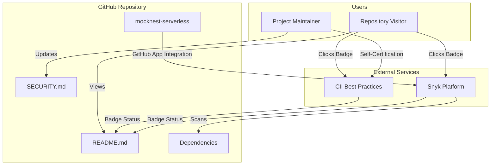

# Design Document: Security Trust Badges

## Overview

This design describes the implementation of security trust badges for the MockNest Serverless project. The feature adds Snyk vulnerability scanning and CII Best Practices badges to the README, enhancing the project's security posture visibility and trust signals for potential users evaluating the AWS Serverless Application Repository (SAR) application.

The implementation involves three main components:
1. **External Service Integration**: Setting up Snyk and CII Best Practices accounts and connecting them to the GitHub repository
2. **Badge Display**: Adding badge markdown to README.md with proper positioning and formatting
3. **Documentation**: Updating SECURITY.md with comprehensive security tooling documentation

This is primarily a documentation and configuration feature rather than a code implementation feature. The design focuses on the integration process, badge placement strategy, and documentation structure.

## Architecture

### System Context

The security trust badges feature integrates external security assessment services with the MockNest Serverless GitHub repository:



### Integration Architecture

Both Snyk and CII Best Practices operate as external services that assess the repository and provide badge endpoints:

**Snyk Integration Flow:**
1. GitHub App installed on repository grants Snyk read access to code and dependencies
2. Snyk automatically scans on PR creation and scheduled intervals (weekly)
3. Snyk provides badge URL that dynamically reflects current vulnerability status
4. Badge links to public Snyk dashboard showing detailed scan results

**CII Best Practices Integration Flow:**
1. Project registered on CII Best Practices website
2. Maintainer completes self-certification questionnaire
3. CII provides badge URL that reflects certification level (passing/silver/gold)
4. Badge links to public CII project page showing criteria compliance

### Badge Positioning Strategy

The badges will be added to the existing badge section in README.md, maintaining logical grouping:

```
[Release] [SAR] [Build] [Coverage] [CodeQL] [OpenSSF] [Snyk] [CII] [OpenAPI] [Kotlin] [JVM] [License]
```

Grouping logic:
- **Release/Distribution**: GitHub release, AWS SAR
- **CI/Quality**: Build status, code coverage
- **Security**: CodeQL, OpenSSF Scorecard, Snyk, CII Best Practices
- **Technical**: OpenAPI, Kotlin version, JVM version, License

## Components and Interfaces

### External Service Interfaces

#### Snyk Platform Interface

**Integration Method**: GitHub App
- **Authentication**: OAuth via GitHub App installation
- **Permissions Required**: Read access to repository code and dependency manifests
- **Scan Triggers**: 
  - Pull request creation/update
  - Scheduled scans (configurable, default weekly)
  - Manual trigger via Snyk dashboard

**Badge Endpoint**:
```
https://snyk.io/test/github/{owner}/{repo}/badge.svg
```

**Dashboard URL**:
```
https://snyk.io/test/github/{owner}/{repo}
```

**Configuration Options**:
- Scan frequency (daily, weekly, monthly)
- Severity thresholds for PR blocking
- Auto-fix PR creation
- Public/private dashboard visibility

#### CII Best Practices Interface

**Integration Method**: Web-based self-certification
- **Authentication**: GitHub OAuth for project ownership verification
- **Assessment Process**: Online questionnaire with evidence submission
- **Certification Levels**: Passing (required), Silver (optional), Gold (optional)

**Badge Endpoint**:
```
https://bestpractices.coreinfrastructure.org/projects/{project-id}/badge
```

**Project Page URL**:
```
https://bestpractices.coreinfrastructure.org/projects/{project-id}
```

**Criteria Categories**:
- Basics (project website, documentation, license)
- Change Control (version control, automated testing)
- Reporting (bug reporting process, vulnerability reporting)
- Quality (coding standards, test coverage)
- Security (secure development practices, vulnerability response)
- Analysis (static analysis, dynamic analysis)

### Documentation Components

#### README.md Badge Section

**Current Structure**:
```markdown
[
[
[
[
[
[
[
[
[
[
```

**Updated Structure** (with new badges):
```markdown
[
[
[
[
[
[
[
[
[
[
[
[
```

#### SECURITY.md Tooling Section

A new "Security and Quality Tooling" section will be added to SECURITY.md documenting all automated security and quality tools:

**Section Structure**:
1. Introduction explaining the purpose of security tooling
2. Badge-based tools (visible in README)
   - Snyk vulnerability scanning
   - CII Best Practices certification
   - CodeQL code scanning
   - OpenSSF Scorecard
   - Code coverage (Codecov)
3. Background automation tools (not visible as badges)
   - Dependabot dependency updates
   - CodeRabbit AI code review (if active)
4. Configuration references
5. Maintenance guidance

## Data Models

### Badge Metadata

Each badge has associated metadata that defines its display and behavior:

```kotlin
data class BadgeMetadata(
    val name: String,              // Display name (e.g., "Snyk Security")
    val imageUrl: String,          // Badge SVG endpoint
    val linkUrl: String,           // Target URL when clicked
    val altText: String,           // Accessibility text
    val category: BadgeCategory,   // Grouping category
    val position: Int              // Display order within category
)

enum class BadgeCategory {
    RELEASE_DISTRIBUTION,
    CI_QUALITY,
    SECURITY,
    TECHNICAL
}
```

### Security Tool Configuration

Documentation structure for each security tool:

```kotlin
data class SecurityToolDocumentation(
    val toolName: String,
    val purpose: String,
    val visibility: ToolVisibility,
    val configurationFile: String?,
    val dashboardUrl: String?,
    val maintenanceSchedule: String?
)

enum class ToolVisibility {
    BADGE,              // Visible as badge in README
    BACKGROUND          // Background automation, no badge
}
```

## Implementation Details

### Snyk Integration Setup

**Step 1: Install Snyk GitHub App**
1. Navigate to https://github.com/apps/snyk-io
2. Click "Install" and select the mocknest-serverless repository
3. Grant requested permissions (read access to code and dependencies)
4. Complete OAuth authorization flow

**Step 2: Configure Snyk Project**
1. Log into Snyk dashboard at https://app.snyk.io
2. Verify repository appears in project list
3. Configure scan settings:
   - Enable automatic PR scanning
   - Set weekly scheduled scans
   - Enable auto-fix PR creation
   - Set public dashboard visibility
4. Run initial scan and verify results

**Step 3: Verify Passing Status**
1. Review scan results for critical and high-severity vulnerabilities
2. If vulnerabilities found:
   - Review Snyk's suggested fixes
   - Apply fixes via Snyk auto-fix PRs or manual updates
   - Re-scan to verify resolution
3. Confirm zero critical and high-severity vulnerabilities before adding badge

**Step 4: Add Badge to README**
```markdown
[](https://snyk.io/test/github/elenavanengelenmaslova/mocknest-serverless)
```

### CII Best Practices Integration Setup

**Step 1: Register Project**
1. Navigate to https://bestpractices.coreinfrastructure.org
2. Click "Get Your Badge Now"
3. Authenticate with GitHub OAuth
4. Select mocknest-serverless repository
5. Complete project registration form

**Step 2: Complete Self-Certification**

The CII Best Practices questionnaire covers multiple categories. Key criteria for passing level:

**Basics**:
- Project has public website/repository ✓ (GitHub)
- Project has documentation ✓ (README, docs/)
- Project has open source license ✓ (MIT)

**Change Control**:
- Version control system used ✓ (Git/GitHub)
- Unique version numbering ✓ (semantic versioning)
- Release notes provided ✓ (CHANGELOG.md)

**Reporting**:
- Bug reporting process documented ✓ (GitHub Issues)
- Vulnerability reporting process documented ✓ (SECURITY.md)
- Response time commitments ✓ (48 hours acknowledgment)

**Quality**:
- Coding standards documented ✓ (CONTRIBUTING.md, Kiro usage guidelines)
- Automated test suite ✓ (JUnit, Kover)
- Test coverage measured ✓ (Codecov)

**Security**:
- Secure development practices ✓ (documented in SECURITY.md)
- Static analysis used ✓ (CodeQL)
- Dependency vulnerability scanning ✓ (Dependabot, Snyk)

**Analysis**:
- Static analysis tools used ✓ (CodeQL, Kotlin compiler)
- Dynamic analysis in CI ✓ (integration tests)

**Step 3: Submit Evidence**

For each criterion, provide evidence:
- Links to relevant documentation files
- Links to CI/CD workflow files
- Screenshots of tool configurations
- Links to public dashboards (CodeQL, Codecov, etc.)

**Step 4: Achieve Passing Status**

1. Complete all required criteria (marked with "MUST")
2. Address any gaps identified during self-assessment
3. Submit for review (automated for passing level)
4. Verify passing badge is awarded

**Step 5: Add Badge to README**
```markdown
[](https://bestpractices.coreinfrastructure.org/projects/{project-id})
```

### README.md Updates

**Location**: After OpenSSF Scorecard badge, before OpenAPI badge

**Changes**:
1. Add Snyk badge markdown
2. Add CII Best Practices badge markdown
3. Maintain consistent formatting with existing badges
4. Verify all badges render correctly
5. Test badge links navigate to correct dashboards

**Before**:
```markdown
[](https://securityscorecards.dev/viewer/?uri=github.com/elenavanengelenmaslova/mocknest-serverless)
[](https://raw.githubusercontent.com/elenavanengelenmaslova/mocknest-serverless/main/docs/api/mocknest-openapi.yaml)
```

**After**:
```markdown
[](https://securityscorecards.dev/viewer/?uri=github.com/elenavanengelenmaslova/mocknest-serverless)
[](https://snyk.io/test/github/elenavanengelenmaslova/mocknest-serverless)
[](https://bestpractices.coreinfrastructure.org/projects/{project-id})
[](https://raw.githubusercontent.com/elenavanengelenmaslova/mocknest-serverless/main/docs/api/mocknest-openapi.yaml)
```

### SECURITY.md Updates

**New Section**: "Security and Quality Tooling"

**Location**: After "Security Features" section, before "Important Security Guidance"

**Content Structure**:

```markdown
## Security and Quality Tooling

MockNest Serverless uses a comprehensive set of automated tools to maintain security and quality standards. These tools provide continuous monitoring, automated updates, and proactive security scanning.

### Badge-Based Security Tools

These tools are visible as badges in the README and provide public dashboards for transparency:

#### Snyk Vulnerability Scanning
- **Purpose**: Continuously monitors dependencies, code, and infrastructure for security vulnerabilities
- **Visibility**: Badge in README linking to public dashboard
- **Automation**: 
  - Scans on every pull request
  - Weekly scheduled scans
  - Automatic fix PRs for vulnerabilities
- **Dashboard**: https://snyk.io/test/github/elenavanengelenmaslova/mocknest-serverless
- **Maintenance**: Automated with manual review of fix PRs

#### CII Best Practices Certification
- **Purpose**: Demonstrates adherence to open source security and quality standards
- **Visibility**: Badge in README linking to public criteria compliance page
- **Certification Level**: Passing (required criteria met)
- **Project Page**: https://bestpractices.coreinfrastructure.org/projects/{project-id}
- **Maintenance**: Quarterly review and re-certification as needed

#### CodeQL Code Scanning
- **Purpose**: Static analysis for security vulnerabilities and code quality issues
- **Visibility**: Badge in README linking to security scanning results
- **Automation**: Runs on every push and pull request
- **Dashboard**: GitHub Security tab
- **Configuration**: `.github/workflows/github-code-scanning/codeql`

#### OpenSSF Scorecard
- **Purpose**: Automated security health metrics for open source projects
- **Visibility**: Badge in README linking to detailed scorecard
- **Metrics**: Security practices, dependency management, code review, etc.
- **Dashboard**: https://securityscorecards.dev/viewer/?uri=github.com/elenavanengelenmaslova/mocknest-serverless
- **Maintenance**: Automated, no manual intervention required

#### Code Coverage (Codecov)
- **Purpose**: Tracks test coverage to ensure code quality
- **Visibility**: Badge in README linking to coverage reports
- **Automation**: Runs on every push via CI/CD
- **Dashboard**: https://codecov.io/gh/elenavanengelenmaslova/mocknest-serverless
- **Configuration**: `codecov.yml`

### Background Automation Tools

These tools operate automatically without visible badges but are essential for security:

#### Dependabot
- **Purpose**: Automated dependency updates to address security vulnerabilities
- **Visibility**: No badge, operates via GitHub pull requests
- **Automation**:
  - Weekly scans for dependency updates
  - Automatic PRs for security updates
  - Grouped updates to reduce PR noise
- **Configuration**: `.github/dependabot.yml`
- **Maintenance**: Review and merge automated PRs

#### CodeRabbit AI Code Review
- **Purpose**: AI-powered code review for quality and security issues
- **Visibility**: No badge, provides PR comments
- **Automation**: Reviews every pull request automatically
- **Configuration**: `.coderabbit.yaml`
- **Maintenance**: Review AI suggestions during PR review process

### Configuration Files

- **Dependabot**: `.github/dependabot.yml`
- **CodeRabbit**: `.coderabbit.yaml`
- **CodeQL**: `.github/workflows/github-code-scanning/codeql`
- **Codecov**: `codecov.yml`
- **Kover (Coverage)**: Applied via Gradle plugin in `build.gradle.kts`

### Adding New Security Tooling

When considering new security tools or badges:

1. **Evaluate necessity**: Does it provide unique value not covered by existing tools?
2. **Check automation**: Can it run automatically without manual intervention?
3. **Verify public visibility**: Can results be made public for transparency?
4. **Consider maintenance**: What ongoing maintenance is required?
5. **Update documentation**: Add to this section when new tools are adopted

### Tool Maintenance Schedule

- **Snyk**: Automated weekly scans, manual review of fix PRs as needed
- **CII Best Practices**: Quarterly review and re-certification
- **CodeQL**: Automated, no manual maintenance
- **OpenSSF Scorecard**: Automated, no manual maintenance
- **Codecov**: Automated, no manual maintenance
- **Dependabot**: Review and merge PRs weekly
- **CodeRabbit**: Review suggestions during PR process
```

## Correctness Properties

