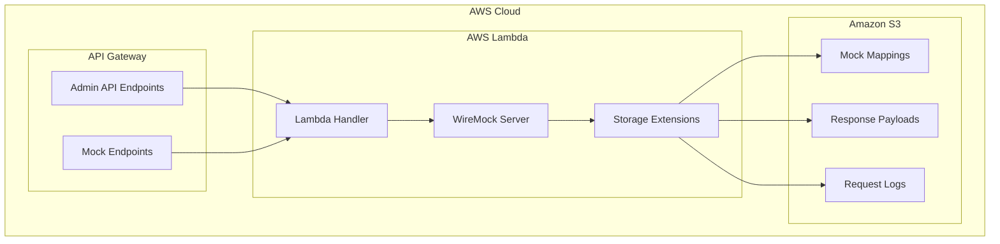

# Design Document: Serverless WireMock Runtime

## Overview

The Serverless WireMock Runtime provides a complete WireMock server running on AWS Lambda with persistent storage in Amazon S3. This design uses a direct WireMock server instance with custom storage extensions to achieve serverless deployment while maintaining full WireMock compatibility.

## Architecture

### High-Level Architecture



### Clean Architecture Layers

Following the established clean architecture pattern:

**Domain Layer:**
- `HttpRequest` - Cloud-agnostic HTTP request abstraction
- `HttpResponse` - Cloud-agnostic HTTP response abstraction
- WireMock domain models (`StubMapping`, `ServeEvent`) - Used directly from WireMock library

**Application Layer:**
- `AdminRequestUseCase` - Handles WireMock admin API requests
- `ClientRequestUseCase` - Handles mock endpoint requests  
- `HandleAdminRequest` / `HandleClientRequest` - Use case interfaces
- `MockNestConfig` - WireMock server configuration and bean setup
- `ObjectStorageInterface` - Storage abstraction interface
- `ObjectStorageMappingsSource` - WireMock mappings source backed by object storage
- `ObjectStorageBlobStore` - WireMock blob store for response files  
- `NormalizeMappingBodyFilter` - WireMock extension for response body externalization
- `DeleteAllMappingsAndFilesFilter` - WireMock extension for cleanup operations
- `CompositeMappingsSource` - Combines object storage mappings with classpath mappings (used for built-in health check endpoint)

**Infrastructure Layer:**
- `S3ObjectStorageAdapter` - AWS S3 implementation of storage interface
- `LambdaHandler` - AWS Lambda entry point

## Components and Interfaces

### Core Components

#### 1. WireMock Server Instance
- **Implementation**: Direct WireMock server running in Lambda via `DirectCallHttpServer`
- **Rationale**: Maintains full compatibility with WireMock ecosystem
- **Configuration**: Custom storage extensions replace default file-based storage

#### 2. Use Case Layer
The application uses clean architecture with dedicated use cases:

```kotlin
@Component
class AdminRequestUseCase(
    private val directCallHttpServer: DirectCallHttpServer,
) : HandleAdminRequest {
    override fun invoke(path: String, httpRequest: HttpRequest): HttpResponse
}

@Component  
class ClientRequestUseCase(
    private val directCallHttpServer: DirectCallHttpServer
) : HandleClientRequest {
    override fun invoke(httpRequest: HttpRequest): HttpResponse
}
```

#### 3. Storage Extensions
WireMock storage is backed by object storage through custom implementations:

```kotlin
class ObjectStorageMappingsSource(
    private val storage: ObjectStorageInterface,
    private val prefix: String = "mappings/",
    private val concurrency: Int = 32,
) : MappingsSource

class ObjectStorageBlobStore(
    private val storage: ObjectStorageInterface,
) : BlobStore
```

#### 4. WireMock Extensions
Custom filters handle response body externalization and cleanup:

```kotlin
class NormalizeMappingBodyFilter(
    private val storage: ObjectStorageInterface,
) : AdminRequestFilterV2

class DeleteAllMappingsAndFilesFilter(
    private val storage: ObjectStorageInterface
) : AdminRequestFilterV2
```

### Interface Definitions

#### Storage Interface (Enhanced)
Extending existing `ObjectStorageInterface`:

```kotlin
interface ObjectStorageInterface {
    // Existing methods
    suspend fun save(id: String, content: String): String
    suspend fun get(id: String): String?
    suspend fun delete(id: String)
    fun list(): Flow<String>
    fun listPrefix(prefix: String): Flow<String>
    
    // New methods for enhanced functionality
    suspend fun saveWithMetadata(id: String, content: String, metadata: Map<String, String>): String
    suspend fun getMetadata(id: String): Map<String, String>?
    suspend fun applyRetentionPolicy(prefix: String, policy: RetentionPolicy)
}
```

## Data Models

### Domain Models

#### HTTP Abstractions
```kotlin
data class HttpRequest(
    val method: HttpMethod,
    val headers: Map<String, String> = emptyMap(),
    val path: String,
    val queryParameters: Map<String, String> = emptyMap(),
    val body: String? = null
)

data class HttpResponse(
    val statusCode: HttpStatusCode,
    val headers: MultiValueMap<String, String>? = null,
    val body: String? = null
)
```

These domain models provide cloud-agnostic abstractions that can be adapted from cloud-specific request/response formats (e.g., AWS API Gateway events) to WireMock's expected formats.

### Mock Definition Storage
WireMock's existing `StubMapping` class is used directly for mock definitions. The storage organization separates mapping definitions from response payloads:

```kotlin
// WireMock's existing domain model
class StubMapping {
    val id: UUID
    val request: RequestPattern
    val response: ResponseDefinition
    // ... other WireMock properties
}
```

### Request Log Entry
WireMock's existing `ServeEvent` class is used for request logging:

```kotlin
// WireMock's existing domain model  
class ServeEvent {
    val id: UUID
    val request: LoggedRequest
    val response: LoggedResponse
    val stubMapping: StubMapping?
    // ... other WireMock properties
}
```

### Storage Organization
```
S3 Bucket Structure:
├── mappings/
│   ├── {mapping-id}.json          # StubMapping definitions (WireMock format)
├── __files/
│   ├── {mapping-id}.json          # Response bodies externalized by NormalizeMappingBodyFilter
│   ├── {mapping-id}.bin           # Binary response bodies (Base64 encoded)
└── __admin/
    └── requests/                  # Request logs (future enhancement)
```

## Correctness Properties

*A property is a characteristic or behavior that should hold true across all valid executions of a system-essentially, a formal statement about what the system should do. Properties serve as the bridge between human-readable specifications and machine-verifiable correctness guarantees.*

### Property 1: Mock Definition Persistence
*For any* mock definition created via the Admin API, the definition should be immediately available in persistent storage and survive serverless cold starts
**Validates: Requirements 2.1, 7.1**

### Property 2: Response Payload Externalization
*For any* mock mapping with response bodies, all response payload content should be stored separately from mapping definitions regardless of size
**Validates: Requirements 2.2, 7.2**

### Property 3: Memory Optimization Strategy
*For any* serverless instance startup, only mapping definitions should be loaded into memory while response payloads remain in persistent storage and are loaded on-demand
**Validates: Requirements 7.3, 7.5**

### Property 4: Request Matching Consistency
*For any* HTTP request that matches a mock definition, the system should return the configured response with correct status, headers, and body
**Validates: Requirements 3.1, 3.2**

### Property 5: Request Logging Persistence
*For any* HTTP request processed by the system, request details should be recorded directly to persistent storage using WireMock store extensions
**Validates: Requirements 4.1, 4.2**

### Property 6: Storage Operation Resilience
*For any* storage operation failure, the system should provide appropriate error handling and retry mechanisms while maintaining service availability
**Validates: Requirements 7.4, 10.2**

### Property 7: WireMock Feature Compatibility
*For any* standard WireMock feature (templating, delays, fault injection, callbacks), the system should maintain compatibility with WireMock's standard behavior
**Validates: Requirements 6.1, 6.2, 6.3, 8.1**

### Property 8: Protocol Support Consistency
*For any* supported protocol (REST, SOAP, GraphQL), the system should handle requests and preserve content encoding and format requirements
**Validates: Requirements 5.1, 5.2, 5.3, 5.4**

### Property 9: Proxy and Recording Functionality
*For any* proxy or recording configuration, the system should forward unmatched requests appropriately and capture responses for mock generation
**Validates: Requirements 9.1, 9.2, 9.3**

### Property 10: Configuration and Error Handling
*For any* configuration or validation error, the system should provide clear error messages with specific details and guidance for fixes
**Validates: Requirements 10.1, 10.3, 10.4**

### Property 11: Multi-Instance Deployment Isolation
*For any* two MockNest instances with different instance names, the instances should be completely isolated with separate storage, API endpoints, and no resource conflicts
**Validates: Requirements 11.2, 11.3**

## Error Handling

### Storage Error Handling
- **Connection Failures**: Implement exponential backoff retry with circuit breaker
- **Timeout Handling**: Configurable timeouts with graceful degradation
- **Partial Failures**: Continue operation with available data, log missing items

### WireMock Integration Errors
- **Mapping Validation**: Validate mappings before storage, provide detailed error messages
- **Response Generation**: Handle missing payload files gracefully with appropriate error responses
- **Extension Failures**: Isolate storage extension failures from core WireMock functionality

### Lambda-Specific Error Handling
- **Cold Start Optimization**: Implement lazy loading strategies for large mock sets
- **Memory Management**: Monitor memory usage and implement payload streaming for large responses
- **Timeout Management**: Ensure operations complete within Lambda timeout limits

## Testing Strategy

### Unit Testing
- Test storage extensions with mock S3 client
- Test WireMock integration with embedded WireMock server
- Test Lambda handler with mock API Gateway events
- Test error handling scenarios with fault injection

### Property-Based Testing
Property-based tests will be implemented using Kotest Property Testing framework, with each test running a minimum of 100 iterations.

Each property-based test will be tagged with comments referencing the design document property:

```kotlin
// **Feature: serverless-wiremock-runtime, Property 1: Mock Definition Persistence**
@Test
fun `mock definitions persist across cold starts`() = runTest {
    checkAll<StubMapping> { mapping ->
        // Property test implementation
    }
}
```

### Integration Testing
- Use TestContainers with LocalStack for S3 integration testing
- Test complete request/response cycles with real WireMock server
- Test cold start scenarios with Lambda container simulation
- Validate storage retention policies with time-based testing

### Performance Testing
- Measure cold start times with various mock set sizes
- Test concurrent request handling under load
- Validate memory usage patterns during operation
- Test storage operation performance with large datasets

## Deployment Architecture

### Multi-Instance Deployment Strategy

MockNest supports deploying multiple independent instances for different testing purposes, moving away from traditional dev→staging→prod promotion to a more flexible instance-based model.

#### Instance Naming Strategy
```yaml
# Instead of environment-based naming:
stack_name = "mocknest-serverless-dev"

# Use instance-based naming:
stack_name = "mocknest-${instance_name}"

# Examples:
# - mocknest-team-a-integration
# - mocknest-feature-auth-tests  
# - mocknest-shared-api-tests
```

#### Resource Isolation
Each instance gets completely isolated resources:
```yaml
S3 Bucket: mocknest-storage-${instance_name}-${account_id}
Lambda Function: mocknest-${instance_name}-runtime
API Gateway: mocknest-${instance_name}-api
CloudWatch Logs: /aws/lambda/mocknest-${instance_name}-runtime
```

#### Instance Lifecycle Management
- **Permanent Instances**: Long-lived instances for team shared testing (e.g., `team-a-integration`)
- **Temporary Instances**: Short-lived instances for feature development (e.g., `feature-auth-tests`)
- **Configurable Retention**: Different retention policies per instance type

### AWS Lambda Configuration
```yaml
Runtime: java25
Memory: 1024MB (configurable based on mock set size)
Timeout: 30s
Environment Variables:
  - AWS_S3_BUCKET_NAME
  - WIREMOCK_STORAGE_PREFIX
  - LOG_RETENTION_DAYS
```

### API Gateway Integration
```yaml
Endpoints:
  - /__admin/*: WireMock Admin API (proxy to Lambda)
  - /*: Mock endpoints (proxy to Lambda)
Authentication: API Key (configurable)
```

### S3 Bucket Configuration
```yaml
Bucket Policy: Private access only
Lifecycle Rules:
  - Request logs: Transition to IA after 30 days, delete after 90 days
  - Mock definitions: No automatic deletion
Versioning: Enabled for mock definitions
```

## Performance Considerations

### Cold Start Optimization
- **Lazy Loading**: Load mappings on-demand for very large mock sets (future enhancement)
- **Mapping Caching**: Cache frequently accessed mappings in memory
- **Payload Streaming**: Stream large response payloads directly from S3

### Memory Management
- **Mapping Definitions**: Keep in memory for fast matching (typically < 100MB)
- **Response Payloads**: Load on-demand from S3 (unlimited size)
- **Request Logs**: Stream directly to S3, minimal memory footprint

### Concurrency Handling
- **Bounded Concurrency**: Use existing concurrency controls in storage operations
- **Connection Pooling**: Reuse S3 client connections across requests
- **Batch Operations**: Leverage existing batch delete/get operations for efficiency

## Security Considerations

### Access Control
- **API Gateway**: API key-based authentication by default
- **S3 Bucket**: Private bucket with IAM role-based access
- **Lambda Execution**: Minimal IAM permissions for S3 operations only

### Data Protection
- **Encryption**: S3 server-side encryption enabled by default
- **Network Security**: VPC deployment optional for enhanced isolation
- **Audit Logging**: CloudTrail integration for API access logging

## Monitoring and Observability

### CloudWatch Metrics
- **Lambda Metrics**: Duration, memory usage, error rate, cold starts
- **Custom Metrics**: Mock request count, storage operation latency, cache hit rate
- **S3 Metrics**: Request count, data transfer, error rate

### Logging Strategy
- **Application Logs**: Structured logging with correlation IDs
- **Request Logs**: Configurable request/response logging to S3
- **Error Logs**: Detailed error context for troubleshooting

### Health Checks
```kotlin
@RestController
class HealthController {
    @GetMapping("/__admin/health")
    fun health(): HealthStatus {
        return HealthStatus(
            status = "UP",
            storage = storageHealthCheck(),
            wiremock = wiremockHealthCheck(),
            timestamp = Instant.now()
        )
    }
}
```