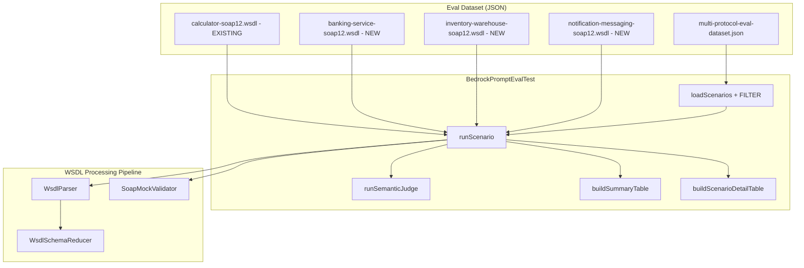

# Design Document: SOAP Eval Test Expansion

## Overview

This feature expands the Bedrock prompt evaluation test suite with comprehensive SOAP scenarios to measure prompt quality across diverse WSDL shapes and prompt complexity levels. Currently, the multi-protocol dataset contains only 1 SOAP scenario (calculator-soap12.wsdl with 3 simple arithmetic operations), which does not exercise the prompt against realistic enterprise WSDL structures.

The expansion adds:
- 3 new synthetic WSDL 1.2 specification files (banking-service, inventory-warehouse, notification-messaging)
- 8–12 new SOAP scenarios in the multi-protocol dataset across 6 complexity levels
- SOAP prompt improvements if eval results reveal weaknesses (conditional)
- Updated `docs/PROMPT_EVAL.md` documentation

All changes are test-only — no production code is modified. The existing calculator SOAP scenario remains unchanged. Existing REST and GraphQL scenarios are unaffected.

## Architecture

The feature extends the existing eval infrastructure without changing its fundamental architecture. It follows the same pattern established by the REST eval expansion.



### Design Decisions

1. **Three domain-diverse WSDLs**: Banking (financial transactions with nested types), Inventory/Warehouse (5+ operations with enumerations), and Notification/Messaging (cross-entity relationships). Each exercises different WSDL shapes that the calculator WSDL does not cover.

2. **All operations share the same endpoint path per WSDL**: This is standard SOAP behavior — all operations in a WSDL service share a single endpoint URL and are differentiated by SOAPAction. This tests the prompt's ability to generate distinct WireMock stubs using Content-Type action matching.

3. **CONTEXT preamble in semanticCheck**: Learned from the REST expansion — the LLM judge needs context about the output format (JSON array of WireMock stubs with SOAP-specific structure) to evaluate correctly. All new SOAP scenarios include this preamble.

4. **Reuse existing infrastructure**: No new validators, parsers, or test infrastructure needed. The existing `WsdlParser`, `WsdlSchemaReducer`, and `SoapMockValidator` handle the new WSDLs. The existing `BedrockPromptEvalTest` loads and runs SOAP scenarios via the same dataset JSON schema.

5. **Conditional prompt improvement**: The SOAP prompt is only modified if eval results show a first-pass valid rate below 70%. This avoids unnecessary changes to a working prompt.

## Components and Interfaces

### New WSDL Specification Files

Three new synthetic WSDL 1.2 specs placed in `src/test/resources/eval/`:

| File | Domain | Operations | Key Characteristics |
|------|--------|------------|---------------------|
| `banking-service-soap12.wsdl` | Banking/Financial | 5 | Nested complex types (Transaction contains MoneyAmount), multi-field request/response types (4+ fields), cross-entity relationships (accountId in GetAccount response appears in GetTransactions request), enumerated status fields (TransactionStatus: pending/completed/failed/reversed) |
| `inventory-warehouse-soap12.wsdl` | Inventory/Warehouse | 6 | Large operation count (6 ops), multi-field types (InventoryItem with 5+ fields), nested types (ShipmentOrder contains LineItem array), enumerated fields (ItemCategory, StockStatus) |
| `notification-messaging-soap12.wsdl` | Notification/Messaging | 4 | Cross-entity relationships (recipientId references a user), simple-to-moderate complexity, different message types (email, SMS, push), delivery status tracking |

Combined with the existing calculator WSDL (3 operations), this gives 4 distinct SOAP services covering:
- Simple arithmetic (calculator) — 3 operations, primitive types only
- Financial domain (banking) — 5 operations, nested types, enumerations, cross-entity
- Logistics domain (inventory) — 6 operations, large types, arrays, enumerations
- Communication domain (notification) — 4 operations, cross-entity, multiple delivery channels

### WSDL Design Specifications

#### banking-service-soap12.wsdl

- **targetNamespace**: `http://example.com/banking-service`
- **Service address**: `http://example.com/banking-service/v1`
- **Operations**: GetAccount, CreateAccount, GetTransactions, TransferFunds, GetAccountBalance
- **Key XSD types**:
  - `AccountInfo` (id: string, holderName: string, accountType: string, balance: decimal, currency: string, status: string)
  - `MoneyAmount` (amount: decimal, currency: string)
  - `TransactionRecord` (transactionId: string, accountId: string, amount: MoneyAmount, type: string, status: string, timestamp: dateTime, description: string)
  - `TransferRequest` (fromAccountId: string, toAccountId: string, amount: MoneyAmount, reference: string)
- **Enumeration**: TransactionStatus via `xsd:restriction` on `xsd:string` with values: pending, completed, failed, reversed

#### inventory-warehouse-soap12.wsdl

- **targetNamespace**: `http://example.com/inventory-warehouse`
- **Service address**: `http://example.com/inventory/ws`
- **Operations**: GetItem, ListItems, CreateItem, UpdateStock, CreateShipment, GetShipment
- **Key XSD types**:
  - `InventoryItem` (itemId: string, name: string, sku: string, category: string, quantity: int, unitPrice: decimal, location: string, status: string)
  - `ShipmentOrder` (shipmentId: string, destinationAddress: string, status: string, items: LineItem[], createdAt: dateTime)
  - `LineItem` (itemId: string, quantity: int, unitPrice: decimal)
  - `StockUpdate` (itemId: string, quantityChange: int, reason: string)
- **Enumerations**: ItemCategory (electronics, clothing, food, furniture, other), StockStatus (in_stock, low_stock, out_of_stock, discontinued)

#### notification-messaging-soap12.wsdl

- **targetNamespace**: `http://example.com/notification-messaging`
- **Service address**: `http://example.com/notifications/v1`
- **Operations**: SendNotification, GetNotificationStatus, ListNotifications, UpdatePreferences
- **Key XSD types**:
  - `NotificationRequest` (recipientId: string, channel: string, subject: string, body: string, priority: string)
  - `NotificationStatus` (notificationId: string, recipientId: string, channel: string, status: string, sentAt: dateTime, deliveredAt: dateTime)
  - `UserPreferences` (userId: string, emailEnabled: boolean, smsEnabled: boolean, pushEnabled: boolean, quietHoursStart: string, quietHoursEnd: string)
- **Cross-entity**: recipientId in SendNotification/GetNotificationStatus references the same user; notificationId returned by SendNotification is used in GetNotificationStatus

### New SOAP Scenarios in Dataset

10 new scenarios across 6 complexity levels, distributed across all 3 new WSDL specs:

| # | Scenario Input | API | Complexity | Description |
|---|---------------|-----|------------|-------------|
| 1 | `soap-banking-basic-all` | Banking | Basic | Generate mocks for all 5 banking operations |
| 2 | `soap-inventory-basic-all` | Inventory | Basic | Generate mocks for all 6 inventory operations |
| 3 | `soap-notification-basic-all` | Notification | Basic | Generate mocks for all 4 notification operations |
| 4 | `soap-banking-filtered-account` | Banking | Filtered | Generate mocks only for account-related operations (GetAccount, CreateAccount, GetAccountBalance) |
| 5 | `soap-banking-error-faults` | Banking | Error | Generate SOAP fault responses for TransferFunds with insufficient funds and GetAccount with account not found |
| 6 | `soap-banking-realistic-data` | Banking | Realistic Data | Generate mocks with realistic financial data (EUR amounts, IBAN account numbers, realistic holder names) |
| 7 | `soap-banking-consistency` | Banking | Consistency | Generate mocks where GetAccount returns an accountId that appears in GetTransactions response records |
| 8 | `soap-inventory-edge-xpath` | Inventory | Edge Case | Generate mocks with XPath body matchers to disambiguate GetItem vs ListItems operations sharing the same endpoint |
| 9 | `soap-inventory-realistic-data` | Inventory | Realistic Data | Generate mocks with realistic warehouse data (SKU codes, product names, realistic quantities and prices) |
| 10 | `soap-notification-consistency` | Notification | Consistency | Generate mocks where SendNotification returns a notificationId that appears in GetNotificationStatus response |

Each scenario includes a precise `semanticCheck` with:
- A CONTEXT preamble explaining the output format (JSON array of WireMock stub mappings with SOAP-specific structure)
- Concrete, verifiable criteria (exact operation names, expected SOAP action URLs, expected response element names, expected XML namespace)
- No vague phrases

### Semantic Check Design

All new SOAP scenario semanticCheck fields follow this structure:

```
CONTEXT: The output is a JSON array of WireMock stub mappings. Each mapping has 'request' (with urlPath, method POST, and headers containing Content-Type with action parameter) and 'response' (with body containing a SOAP 1.2 XML envelope). The response body uses namespace {targetNamespace}. All operations share the same urlPath endpoint and are differentiated by the action parameter in Content-Type.

Strictly verify: 1) [specific operation checks] 2) [structural checks] 3) [domain-specific checks]. Score 0 if [critical failure condition].
```

### Existing Components (Unchanged)

- **WsdlParser**: Parses WSDL XML into `ParsedWsdl`. Already handles nested complex types, enumerations (as string fields), and multiple operations. No changes needed.
- **WsdlSchemaReducer**: Reduces `ParsedWsdl` to `CompactWsdl` with reachable types. Already follows type references transitively. No changes needed.
- **SoapMockValidator**: Validates generated mocks against 7 rules (POST method, URL path, SOAPAction/Content-Type action, XML well-formedness, SOAP envelope, target namespace, Content-Type header). No changes needed.
- **BedrockPromptEvalTest**: Loads scenarios from dataset JSON, runs generation pipeline, validates, and judges. Already supports SOAP protocol. No changes needed.
- **SOAP prompt** (`prompts/soap/spec-with-description.txt`): May be updated if eval results show weaknesses, but no changes planned upfront.

## Data Models

### Multi-Protocol Dataset Schema (unchanged)

The existing JSON schema is preserved. New SOAP scenarios use the same structure:

```json
{
  "input": "soap-banking-basic-all",
  "metadata": {
    "protocol": "SOAP",
    "specFile": "eval/banking-service-soap12.wsdl",
    "format": "WSDL",
    "namespace": "banking-eval",
    "description": "Generate mocks for all 5 banking operations: GetAccount, CreateAccount, GetTransactions, TransferFunds, and GetAccountBalance.",
    "semanticCheck": "CONTEXT: The output is a JSON array of WireMock stub mappings..."
  }
}
```

No schema changes needed. The existing `loadScenarios()` and `createAgentForProtocol()` already handle SOAP protocol scenarios.

### WSDL Design Principles

Each synthetic WSDL follows these design principles:
- Valid WSDL 1.1 document with SOAP 1.2 bindings (parseable by `WsdlParser`)
- Uses `soap12:binding`, `soap12:operation`, and `soap12:address` elements
- Unique `targetNamespace` per service to avoid namespace collisions
- Realistic `soap12:address location` with a meaningful service path
- `document/literal` binding style (same as existing calculator WSDL)
- XSD types defined inline within `wsdl:types/xsd:schema`
- Each operation has distinct `soapAction` URL
- All operations share a single service endpoint (standard SOAP pattern)

### Enumeration Handling

The `WsdlParser` extracts XSD types from `xsd:complexType` and `xsd:element` declarations. For enumerations defined via `xsd:simpleType` with `xsd:restriction`, the parser does not currently extract these as separate types — they appear as `string` fields in the containing complex type. This is acceptable because:
1. The prompt sees the compact WSDL which shows the field type as `string`
2. The enumeration values can be communicated via the scenario description
3. The `SoapMockValidator` validates the response structure, not specific field values

The WSDL files will include `xsd:simpleType` restrictions for documentation purposes and to satisfy requirement 1.5, even though the parser treats them as strings.

## Correctness Properties

*A property is a characteristic or behavior that should hold true across all valid executions of a system — essentially, a formal statement about what the system should do. Properties serve as the bridge between human-readable specifications and machine-verifiable correctness guarantees.*

### Property 1: WSDL parsing and reduction validity

*For any* WSDL specification file in the `eval/` test resources directory, parsing it with `WsdlParser` shall succeed without throwing an exception, and reducing it with `WsdlSchemaReducer` shall produce a `CompactWsdl` with a non-empty operations list and correctly resolved XSD types (no unresolved type references to non-built-in types).

**Validates: Requirements 1.6, 1.7**

### Property 2: SOAP scenario metadata validity

*For any* SOAP scenario in the multi-protocol eval dataset, the scenario shall have `protocol` equal to `"SOAP"`, `format` equal to `"WSDL"`, and a `specFile` path that resolves to an existing classpath resource in the eval directory.

**Validates: Requirements 2.2**

### Property 3: Semantic check quality

*For any* SOAP scenario in the multi-protocol eval dataset, the `semanticCheck` field shall contain at least one concrete, verifiable element (an operation name, a SOAP action URL, an XML element name, or a namespace URI) and shall not contain vague phrases such as "looks correct", "reasonable output", or "seems right".

**Validates: Requirements 4.1, 4.2**

### Property 4: Semantic check CONTEXT preamble

*For any* new SOAP scenario in the multi-protocol eval dataset (excluding the pre-existing calculator scenario), the `semanticCheck` field shall include a CONTEXT preamble explaining that the output is a JSON array of WireMock stub mappings with SOAP-specific structure.

**Validates: Requirements 4.6**

### Property 5: Unique targetNamespace per WSDL

*For any* pair of WSDL specification files in the `eval/` test resources directory, their `targetNamespace` values shall be distinct (no two WSDLs share the same namespace).

**Validates: Requirements 6.4**

### Property 6: WSDL service address presence

*For any* WSDL specification file in the `eval/` test resources directory, the parsed `servicePortAddresses` list shall be non-empty, containing at least one `soap12:address` location with a realistic service path (not empty, not just a hostname).

**Validates: Requirements 6.5**

## Error Handling

### WSDL Parsing Failures

If a new WSDL file has a structural issue that causes `WsdlParser` to throw `WsdlParsingException`, the eval scenario will fail at the generation phase. This is caught by the existing error handling in `runScenario()` and reported as a generation failure in the detail table.

### Spec File Not Found

If a scenario references a `specFile` that doesn't exist on the classpath, `loadSpecContent()` already throws with a descriptive message. New scenarios must reference valid spec files that exist in the eval directory.

### SoapMockValidator with New WSDLs

The `SoapMockValidator` validates against the `APISpecification` produced by the WSDL parsing pipeline. If a new WSDL produces an `APISpecification` with unexpected endpoint paths or SOAPAction values, validation will fail and the correction retry will attempt to fix the generated mocks. This is the expected behavior — it measures prompt quality.

### Prompt Improvement Scope

If the SOAP prompt needs improvement based on eval results, changes are limited to `software/application/src/main/resources/prompts/soap/spec-with-description.txt`. The existing calculator scenario must continue to pass after any prompt change. If a prompt change helps new scenarios but breaks the calculator, the change is rejected.

## Testing Strategy

### Unit Tests (Structural Validation)

Unit tests verify the new WSDL files and dataset entries without calling Bedrock:

1. **WSDL parsing validity** — Parse each new WSDL file with `WsdlParser` and verify no exception is thrown, operations list is non-empty, and XSD types are resolved. Use `@ParameterizedTest` with `@ValueSource` across all WSDL files.

2. **WSDL structural requirements** — Verify at least one WSDL has nested complex types, at least one has 5+ operations, at least one has enumeration restrictions, and all have unique targetNamespaces.

3. **Dataset structural validation** — Load the dataset JSON and verify:
   - At least 8 new SOAP scenarios exist (beyond the calculator)
   - Each new WSDL is referenced by at least one scenario
   - All SOAP scenarios have protocol "SOAP", format "WSDL", and valid specFile paths
   - Complexity level distribution meets requirements (3+ Basic, 1+ Filtered, 1+ Error, 1+ Realistic, 1+ Consistency, 1+ Edge Case)

4. **Semantic check quality** — Verify all new SOAP scenario semanticCheck fields:
   - Contain a CONTEXT preamble
   - Contain concrete verifiable criteria (operation names, namespaces, etc.)
   - Do not contain vague phrases

5. **Backward compatibility** — Verify the existing calculator scenario is unchanged in the dataset.

### Property-Based Tests

Property-based tests use `@ParameterizedTest` with all WSDL files and all SOAP scenarios:

- **WSDL parsing + reduction**: All 4 WSDL files (calculator + 3 new) parsed and reduced successfully
- **Scenario metadata validity**: All SOAP scenarios have correct protocol/format/specFile
- **Semantic check quality**: All new SOAP scenarios have concrete criteria and CONTEXT preamble
- **Namespace uniqueness**: All WSDL files have distinct targetNamespaces
- **Service address presence**: All WSDL files have non-empty service addresses

Each property test runs across all applicable test data (4 WSDL files, 9-11 SOAP scenarios).

**Property test configuration:**
- Minimum iterations: All applicable items (4 WSDLs, 10+ scenarios)
- Tag format: **Feature: soap-eval-test-expansion, Property {number}: {property_text}**
- Use JUnit 6 `@ParameterizedTest` with `@ValueSource` for WSDL file names
- Use `@MethodSource` for scenario-based tests

### Integration Tests

Integration-level verification happens during actual eval runs (requires `BEDROCK_EVAL_ENABLED=true`):

- SOAP scenarios produce valid mocks and pass semantic checks
- Summary table shows SOAP row with updated scenario count (11 total: 1 existing + 10 new)
- Detail table shows per-scenario breakdown for all SOAP scenarios
- `BEDROCK_EVAL_FILTER=soap` runs only SOAP scenarios
- SoapMockValidator validates generated mocks from new WSDLs using the same 7 rules

These require Bedrock access and incur cost. Run manually during prompt tuning.

### What Is NOT Tested with PBT

- Documentation content (PROMPT_EVAL.md updates) — manual review
- Actual Bedrock generation quality — integration test requiring live Bedrock access
- Prompt improvement effectiveness — before/after eval comparison
- Visual formatting of summary/detail tables — already tested by REST expansion
