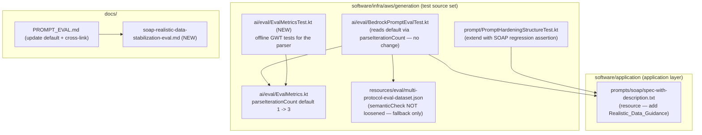

# Design Document

## Overview

This design stabilizes the single flaky Bedrock quality-eval scenario `soap-notification-realistic-data` by addressing the two independent contributors identified in the requirements, and it records the confirmed data and methodology change in documentation.

The work is deliberately small and offline-first. Two concrete decisions are baked in as **decided** (not open questions):

1. **`Default_Iteration_Count = 3`** — `parseIterationCount` returns `3` (via a named constant `DEFAULT_EVAL_ITERATIONS`) when `BEDROCK_EVAL_ITERATIONS` is unset, replacing the current default of `1`. This averages out borderline scenarios at the LLM-judge threshold instead of coin-flipping on a single shot. **Cost implication:** because the harness reads the default when the variable is unset, an unset full-suite run now performs roughly **3× the Bedrock calls** it did before (~$0.66–$1.16 per full-suite run vs ~$0.22–$0.39). This is called out again under Risks.
2. **New dedicated eval doc** — `docs/soap-realistic-data-stabilization-eval.md`, cross-linked from `docs/PROMPT_EVAL.md`. The confirmed re-run data (`soap-notification-realistic-data` 3/5 pass at 100% structural validity; `rest-payment-basic` 5/5 pass) and the new before/after results live here — **not** in `docs/prompt-injection-hardening-eval.md`.

The primary fix is (a) adding a minimal, data-value-only **Realistic_Data_Guidance** subsection to the SOAP prompt, plus (b) raising the default iteration count. Loosening the dataset `semanticCheck` for the target scenario is a documented **last-resort fallback** only (REQ 4.7), never the main approach. REST/GraphQL prompts and the injection hardening are out of scope and must not be weakened (REQ 2.3).

This design produces **`design.md` only**. `tasks.md` is created in a later phase.

### Requirements traceability at a glance

| Requirement | Addressed by design section |
|---|---|
| REQ 1 (realistic-data guidance) | [Realistic_Data_Guidance block](#a-realistic_data_guidance-block-req-1) |
| REQ 2 (preserve rules + hardening) | [Realistic_Data_Guidance block](#a-realistic_data_guidance-block-req-1), [Correctness Property 1](#property-1-soap-prompt-structural-regression-guard), [Property 3](#property-3-non-soap-prompts-unchanged) |
| REQ 3 (default iteration count) | [parseIterationCount default change](#b-parseiterationcount-default-change-req-3), [Property 2](#property-2-parseiterationcount-behavior) |
| REQ 4 (before/after measurement, cost-gated) | [Eval measurement plan](#c-eval-measurement-plan-req-4) |
| REQ 5 (documentation) | [New eval doc + PROMPT_EVAL.md cross-link](#d-eval-documentation-req-5) |
| REQ 6 (offline build + coverage green) | [Testing Strategy](#testing-strategy) |

## Architecture

The change touches three files across three concerns, and one new test file. Clean-architecture boundaries are respected: **no production Kotlin in the domain or application layers changes** except the SOAP prompt template, which is an application-layer *resource*. There are no new interfaces, no DI wiring, and no domain model changes.



### Component impact summary

| File | Layer / source set | Change |
|---|---|---|
| `software/application/src/main/resources/prompts/soap/spec-with-description.txt` | application-layer resource | Add `Realistic_Data_Guidance` subsection within the SOAP 1.2 response format rules |
| `software/infra/aws/generation/src/test/kotlin/.../ai/eval/EvalMetrics.kt` | `:software:infra:aws:generation` **test** source set | Change null-default branch from `1` to `DEFAULT_EVAL_ITERATIONS = 3` |
| `software/infra/aws/generation/src/test/kotlin/.../ai/eval/EvalMetricsTest.kt` | `:software:infra:aws:generation` **test** source set | **New** offline unit tests for the parser |
| `software/infra/aws/generation/src/test/kotlin/.../prompt/PromptHardeningStructureTest.kt` | `:software:infra:aws:generation` **test** source set | Extend with a SOAP structural-regression assertion |
| `software/infra/aws/generation/src/test/kotlin/.../ai/eval/BedrockPromptEvalTest.kt` | `:software:infra:aws:generation` **test** source set | **No code change** — already calls `parseIterationCount(System.getenv("BEDROCK_EVAL_ITERATIONS"))` in `runEvalSuite`, so the new default flows through automatically |
| `software/infra/aws/generation/src/test/resources/eval/multi-protocol-eval-dataset.json` | `:software:infra:aws:generation` test resource | **No change** as the primary fix; `semanticCheck` for the target scenario is loosened only as a last-resort fallback (REQ 4.7) |
| `docs/PROMPT_EVAL.md` | docs | Update the `BEDROCK_EVAL_ITERATIONS` default and cross-link the new eval doc |
| `docs/soap-realistic-data-stabilization-eval.md` | docs | **New** — confirmed re-run data + before/after results |

## Components and Interfaces

There are no new runtime components or interfaces. The two behavioral surfaces being touched:

1. **The SOAP prompt template** — a static text resource consumed by `PromptBuilderService` (application layer) when `SpecificationFormat.WSDL` is selected. Adding guidance changes only the *content* the model receives, not the template-loading interface.
2. **`parseIterationCount(envValue: String?): Int`** — a pure function in the generation module test source set. Its signature is unchanged; only the null-branch return value changes. Its sole caller is `BedrockPromptEvalTest.runEvalSuite`, which passes `System.getenv("BEDROCK_EVAL_ITERATIONS")`.

## Data Models

No data models change. For reference, the parser operates over `String?` input and returns `Int`; the eval scenario entries in `multi-protocol-eval-dataset.json` are unchanged (fields `input`, `metadata.protocol/specFile/format/namespace/description/semanticCheck`).

## Detailed Design

### (a) Realistic_Data_Guidance block (REQ 1)

**Exact placement.** The SOAP prompt (`prompts/soap/spec-with-description.txt`) has these sections in order: intro → *API Specification Summary* → *Namespace* → *SECURITY — INSTRUCTION HIERARCHY* (immediately before `Enhancement Description: {{DESCRIPTION}}`) → *Requirements:* → *SOAP 1.2 request matching rules* → *WHICH OPERATIONS TO GENERATE* → *SOAP 1.2 response format rules* → *SOAP 1.2 fault format* → trailing JSON-array output contract with `{{WIREMOCK_SCHEMA}}`.

Because the guidance concerns **response body DATA values**, it is added as a small new group of bullets **at the end of the `SOAP 1.2 response format rules (IMPORTANT):` section**, immediately after the existing final bullet of that section:

```
- Response HTTP status code is always 200 for successful SOAP responses
```

and **before** the `SOAP 1.2 fault format (for error scenarios):` heading. It is placed:

- **NOT** inside the Security block (which stays byte-unchanged and positioned before `{{DESCRIPTION}}` — REQ 2.2),
- **NOT** altering any existing request-matching, response-format, namespace, urlPath, XPath, or fault rule (REQ 2.1),
- data-value-only, introducing **no** new output-format restriction (REQ 1.6).

**Exact proposed bullet text** to insert (a `Realistic data values` sub-group appended to the response-format section):

```
- Realistic data values (response body content):
  - Populate response body elements with realistic, non-placeholder values. Do NOT emit obvious placeholders such as `status1`, `test`, `string`, `foo`, or `example`.
  - Use realistic status and enumeration strings (e.g., `delivered`, `pending`, `active`) that fit the field's meaning; when the WSDL constrains a field to an enumeration, choose a valid member of that enumeration.
  - For date and time fields, use ISO-8601 values (e.g., `2024-05-17T14:30:00Z`).
  - For identifier fields, use realistic identifiers (e.g., `user-12345`, `ORD-2024-0001`) rather than bare numbers like `1` or placeholders.
  - Continue honoring the Enhancement Description and the WSDL schema when choosing values; do NOT fabricate values that violate the WSDL scalar types or element structure.
```

This maps to REQ 1.1 (realistic non-placeholder data), 1.2 (realistic status/enum strings; avoid `status1`/`test`/`string`), 1.3 (ISO-8601 for date/time), 1.4 (realistic identifiers), 1.5 (honor description + WSDL schema), and 1.6 (data-value-only, no new output-format restriction). The bullets add **guidance about which values to choose**, never a new structural requirement, matcher, or field constraint on the emitted JSON.

**Why this placement works.** The response-format section already governs the *shape* of the response body; realistic data is a natural, adjacent concern about the *content* of that body. Placing it here keeps the Security block and the "generate only what the description asks" rule untouched, and preserves the existing ordering the structural tests assert.

### (b) parseIterationCount default change (REQ 3)

Introduce a named constant and change only the null-default branch. All validation (non-blank, numeric, positive) is identical.

**Before:**

```kotlin
fun parseIterationCount(envValue: String?): Int {
    if (envValue == null) return 1
    require(envValue.isNotBlank()) { "BEDROCK_EVAL_ITERATIONS must not be empty or blank" }
    val parsed = envValue.trim().toIntOrNull()
    require(parsed != null) { "BEDROCK_EVAL_ITERATIONS must be a valid integer, got: '$envValue'" }
    require(parsed > 0) { "BEDROCK_EVAL_ITERATIONS must be a positive integer, got: $parsed" }
    return parsed
}
```

**After:**

```kotlin
/** Default iteration count when BEDROCK_EVAL_ITERATIONS is unset. */
const val DEFAULT_EVAL_ITERATIONS = 3

fun parseIterationCount(envValue: String?): Int {
    if (envValue == null) return DEFAULT_EVAL_ITERATIONS
    require(envValue.isNotBlank()) { "BEDROCK_EVAL_ITERATIONS must not be empty or blank" }
    val parsed = envValue.trim().toIntOrNull()
    require(parsed != null) { "BEDROCK_EVAL_ITERATIONS must be a valid integer, got: '$envValue'" }
    require(parsed > 0) { "BEDROCK_EVAL_ITERATIONS must be a positive integer, got: $parsed" }
    return parsed
}
```

The KDoc `@return` line is updated from "or 1 if [envValue] is null" to reference the new default.

**Harness flow-through (no harness change needed).** `BedrockPromptEvalTest.runEvalSuite` already calls `parseIterationCount(System.getenv("BEDROCK_EVAL_ITERATIONS"))` (line ~239) and prints `Iterations: $iterationCount`, then loops `for (iter in 1..iterationCount)`. Changing the parser default is therefore sufficient; no harness edit is required (REQ 3.1).

**Existing test.** A repository search found **no** dedicated offline unit test for `parseIterationCount` today (only the harness references it). The design therefore **creates** a new offline test file, `EvalMetricsTest.kt`, in the same package (`nl.vintik.mocknest.infra.aws.generation.ai.eval`). If a reviewer identifies a pre-existing parser test during implementation, the tasks phase must instead **locate it and update its "unset → default" assertion from `1` to `3`** while keeping the override and rejection cases — rather than duplicating coverage. Either way, the coverage requirement of REQ 3.6 is met: default-when-unset, explicit-override, and each rejection case (blank/non-numeric/zero/negative).

### (c) Eval measurement plan (REQ 4)

All Bedrock eval runs are **cost-gated and manual** (REQ 4.1, 4.2; `docs/PROMPT_EVAL.md` cost policy). The workflow must obtain explicit user confirmation before each run — the phrasing to use is the project standard: "The prompt eval tests call Bedrock and cost ~$0.01–$0.02 per run. Run them before and after the change to measure impact?" If the user does not confirm, the run is not executed.

**Baseline (before) — target scenario, 5 iterations, prompt unchanged (REQ 4.3):**

```bash
BEDROCK_EVAL_ENABLED=true BEDROCK_EVAL_DEMO=true \
BEDROCK_EVAL_FILTER=soap-notification-realistic-data BEDROCK_EVAL_ITERATIONS=5 \
  ./gradlew :software:infra:aws:generation:bedrockEval --rerun-tasks \
  --tests "*BedrockPromptEvalTest*multi-protocol*"
```

`BEDROCK_EVAL_FILTER` is a **case-insensitive substring match on the scenario `input` name, single value only** (not comma-separated), so `soap-notification-realistic-data` selects exactly the target scenario.

**After — same command, run after the SOAP prompt change is applied (REQ 4.4):** identical to the baseline command above. Record the target scenario pass rate over the 5 iterations; it must be **improved or no worse** than the baseline.

**What to capture** for both runs (into the new eval doc): scenario pass rate (e.g., `x/5`), first-pass structural validity %, semantic verdict outcomes, avg latency, and avg cost/run — read from the summary and scenario-detail tables printed by the harness.

**Validity guard (REQ 4.5).** An "after" measurement is reported as a valid before/after comparison **only if** (1) a baseline was established with the unchanged prompt AND (2) the SOAP prompt change was applied before the "after" run. If either precondition is missing, the "after" number is treated as invalid and must not be presented as a before/after result. This precondition is stated explicitly in the eval doc.

**SOAP non-regression guardrail (REQ 4.6).** After the change, run a broader SOAP check to confirm other SOAP scenarios do not regress. To balance cost vs coverage, the **recommended** approach is to filter to the SOAP subset (substring `soap-`), which is cheaper than the full suite while covering all SOAP scenarios:

```bash
BEDROCK_EVAL_ENABLED=true BEDROCK_EVAL_DEMO=true \
BEDROCK_EVAL_FILTER=soap- BEDROCK_EVAL_ITERATIONS=3 \
  ./gradlew :software:infra:aws:generation:bedrockEval --rerun-tasks \
  --tests "*BedrockPromptEvalTest*multi-protocol*"
```

A full-suite run (no filter) is acceptable when the reviewer wants cross-protocol confirmation, at higher cost. Compare each SOAP scenario's pass status against its baseline; none should drop from pass to fail.

**Last-resort fallback ordering (REQ 4.7).** If, after **both** the prompt change and the iteration-count change, the target scenario still fails the after measurement, loosening the `semanticCheck` for `soap-notification-realistic-data` in `multi-protocol-eval-dataset.json` may be considered — but **only** after the prompt and methodology fixes, and it must be documented as a deliberate fallback in the eval doc. The `semanticCheck` is not loosened as part of the primary fix.

### (d) Eval documentation (REQ 5)

**New doc: `docs/soap-realistic-data-stabilization-eval.md`.** Structure:

1. **Context / background** — one paragraph linking to this spec and the `prompt-injection-hardening` work that surfaced the flake.
2. **Confirmed re-run results (REQ 5.1)** — `soap-notification-realistic-data`: 3 of 5 pass at 100% structural validity every run (flips only on the LLM-judge semantic verdict at the 0.7 threshold); `rest-payment-basic`: 5 of 5 pass, recorded as non-regression context.
3. **Methodology change** — the default iteration count is now 3 when `BEDROCK_EVAL_ITERATIONS` is unset, and why (average out borderline judge verdicts). Note the ~3× full-suite cost implication.
4. **Before / after results (REQ 5.2)** — a small table: baseline pass rate vs after-change pass rate for the target scenario over the measured iterations, plus the validity-guard note from REQ 4.5.
5. **SOAP non-regression guardrail outcome (REQ 5.3)** — the per-SOAP-scenario pass-status comparison from REQ 4.6.
6. **Fallback note** — records whether the last-resort `semanticCheck` loosening (REQ 4.7) was needed, and if so exactly what changed.

The pre-run rows (2 and 3) can be authored offline now; rows 4 and 5 are filled in after the confirmed, cost-gated Bedrock runs.

**`docs/PROMPT_EVAL.md` updates (REQ 5.4):**

- Change the `BEDROCK_EVAL_ITERATIONS` row in the Environment Variables table so the **Default** column reflects the new default (was `1`). A textual update describing the changed default satisfies REQ 5.4; it need not restate a specific numeric value.
- Add a cross-link near the existing "worked example" link so readers can find the new report, e.g. alongside the prompt-injection-hardening report reference: a line pointing to `./soap-realistic-data-stabilization-eval.md`.

## Correctness Properties

*A property is a characteristic or behavior that should hold true across all valid executions of a system — a formal statement about what the system should do. Properties serve as the bridge between human-readable specifications and machine-verifiable correctness guarantees.*

Here, property-based testing applies narrowly. The **parser** (`parseIterationCount`) is a pure function with clear input/output and a large input space, so it is a genuine PBT target. The **prompt templates** are static resources, so their guarantees are expressed as structural invariants verified offline (single-file assertions and a fixed set of non-SOAP files) rather than randomized properties — these are framed as testable properties for the tasks phase but are implemented as focused/parameterized offline assertions, not 100-iteration generators. The Bedrock before/after measurement (REQ 4) is manual and non-deterministic, so it is intentionally excluded from property tests.

### Property 1: SOAP prompt structural regression guard

*For all* loads of the SOAP prompt template after the change, the template SHALL contain the `SECURITY — INSTRUCTION HIERARCHY` marker at an index that precedes the first `{{DESCRIPTION}}` placeholder, SHALL still contain every pre-existing section anchor (`API Specification Summary`, `Namespace`, `Requirements:`, `SOAP 1.2 request matching rules`, `WHICH OPERATIONS TO GENERATE`, `SOAP 1.2 response format rules`, `SOAP 1.2 fault format`, `{{WIREMOCK_SCHEMA}}`), and SHALL additionally contain the new `Realistic data values` guidance marker positioned after `SOAP 1.2 response format rules` and before `SOAP 1.2 fault format`.

**Validates: Requirements 1.1, 1.6, 2.1, 2.2, 2.4**

### Property 2: parseIterationCount behavior

*For any* input to `parseIterationCount`: when the input is `null` it SHALL return `3` (`DEFAULT_EVAL_ITERATIONS`); *for any* string that trims to a positive integer `n`, it SHALL return `n`; and *for any* input that is empty, all-whitespace, non-numeric, or a non-positive integer, it SHALL throw `IllegalArgumentException` with a descriptive message.

**Validates: Requirements 3.1, 3.2, 3.3, 3.4, 3.5**

### Property 3: Non-SOAP prompts unchanged

*For all* non-SOAP `spec-with-description` prompt templates (REST and GraphQL), the template SHALL NOT contain the SOAP `Realistic data values` guidance marker, confirming the realistic-data change is scoped to the SOAP prompt only.

**Validates: Requirements 2.3**

## Error Handling

- **Parser validation is unchanged.** Empty/blank, non-numeric, and zero/negative inputs continue to throw `IllegalArgumentException` via the existing `require(...)` checks with their existing descriptive messages. Only the `null` branch changes its returned default value.
- **Prompt guidance must not conflict with the WSDL.** The Realistic_Data_Guidance explicitly instructs the model not to fabricate values that violate WSDL scalar types or element structure, and to pick valid enumeration members when the WSDL constrains a field. It also preserves the existing "generate ONLY what the description asks for" rule — the guidance influences *values*, never *which operations/stubs* are generated.
- **Manual eval runs are cost-gated.** If the user declines confirmation, no Bedrock call is made (REQ 4.2). If the validity preconditions (REQ 4.5) are not met, the "after" number is not reported as a valid comparison.

## Testing Strategy

**Offline unit / structural tests (run in `./gradlew clean test`, no Bedrock — REQ 6.1, 6.4):**

- **Parser (new `EvalMetricsTest.kt`), Given-When-Then, MockK only where relevant (the parser is pure, so no mocking is needed):**
  - `Given BEDROCK_EVAL_ITERATIONS is unset When parsing Then it returns the default of 3` (REQ 3.1)
  - `Given a valid positive integer string When parsing Then it returns that value` — parameterized over several positive integers (REQ 3.2)
  - `Given a blank or empty string When parsing Then it throws IllegalArgumentException with a descriptive message` (REQ 3.3)
  - `Given a non-numeric string When parsing Then it throws IllegalArgumentException with a descriptive message` (REQ 3.4)
  - `Given zero or a negative integer When parsing Then it throws IllegalArgumentException with a descriptive message` (REQ 3.5)
  - Implemented as the single property (Property 2) split across a `@ParameterizedTest` for the valid/invalid input classes plus focused cases for the null default. Tag: **Feature: soap-realistic-data-stabilization, Property 2: parseIterationCount behavior**.
- **SOAP prompt structure — extend `PromptHardeningStructureTest`** (it already asserts the Security marker precedes `{{DESCRIPTION}}` for the SOAP prompt). Add a focused SOAP-only assertion that (1) all pre-existing section anchors are present, and (2) the new `Realistic data values` marker is present and positioned after `SOAP 1.2 response format rules` and before `SOAP 1.2 fault format`. Tag: **Feature: soap-realistic-data-stabilization, Property 1: SOAP prompt structural regression guard**.
- **Non-SOAP prompts unchanged** — assert REST and GraphQL `spec-with-description.txt` do NOT contain the SOAP realistic-data marker (Property 3). Byte-level non-modification is additionally confirmed by VCS diff review. Tag: **Feature: soap-realistic-data-stabilization, Property 3: Non-SOAP prompts unchanged**.

The existing `PromptHardeningStructureTest` Property 1 (marker precedes untrusted input) and Property 3 (Security block ≤ 15 lines) must remain green, confirming REQ 2.2.

**Property test configuration.** Where a property is implemented as a parameterized test (Property 2 valid/invalid input classes), provide a diverse set of inputs. A dedicated property-based library is not required for a pure `String? -> Int` function; JUnit 6 `@ParameterizedTest` with a diverse `@ValueSource`/`@CsvSource` set is sufficient and idiomatic for this project. Each property test comment references its design property via the tag format above.

**Manual, cost-gated Bedrock measurement (REQ 4).** The before/after and SOAP non-regression runs are manual, require explicit user confirmation, and are not part of `./gradlew clean test` (the eval suite is tag-excluded via `bedrock-eval`). Commands and capture points are specified in [Eval measurement plan](#c-eval-measurement-plan-req-4).

**Coverage and build gates (REQ 6.2, 6.3).** `./gradlew clean test` must be green and `./gradlew koverVerify` must keep aggregated coverage ≥ 90%. The new parser tests add coverage for the parser branches; the prompt/structure assertions add no production Kotlin. All changed/added Kotlin stays in the `:software:infra:aws:generation` **test** source set, and the prompt stays an application-layer resource, honoring clean-architecture boundaries.

## Risks and Cost Note

- **Default = 3 triples full-suite eval cost.** With `BEDROCK_EVAL_ITERATIONS` unset, a full-suite run now performs ~3× the Bedrock calls (~$0.66–$1.16 vs ~$0.22–$0.39 per full run). **Mitigations:** during targeted work, use `BEDROCK_EVAL_FILTER` to run a single scenario (`soap-notification-realistic-data`) or the SOAP subset (`soap-`), and set `BEDROCK_EVAL_ITERATIONS` explicitly for cheaper single-shot checks. All eval runs remain gated behind explicit user confirmation.
- **Prompt guidance drift risk.** Adding value guidance could, if written too strongly, be misread as a structural constraint. Mitigated by keeping the guidance strictly data-value-only, placing it inside the response-format section, and enforcing the structural regression guard (Property 1).
- **False-negative on the flake.** Because the root cause is judge-threshold variance, the after measurement uses 5 iterations for the target scenario to reduce the chance of a misleading single-shot verdict; the validity guard (REQ 4.5) prevents reporting an invalid comparison.

## Requirements Coverage Notes

- **REQ 4.5 (validity guard)** and **REQ 4.7 (last-resort fallback ordering)** are process/documentation constraints captured in the [Eval measurement plan](#c-eval-measurement-plan-req-4) and the new eval doc; they are not code-testable and are intentionally excluded from the property set.
- **REQ 5.x** are documentation-content requirements satisfied by authoring `docs/soap-realistic-data-stabilization-eval.md` and updating `docs/PROMPT_EVAL.md`.
