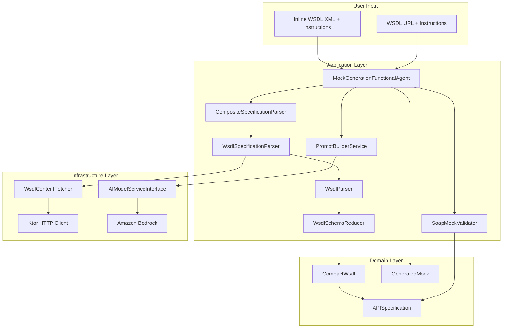
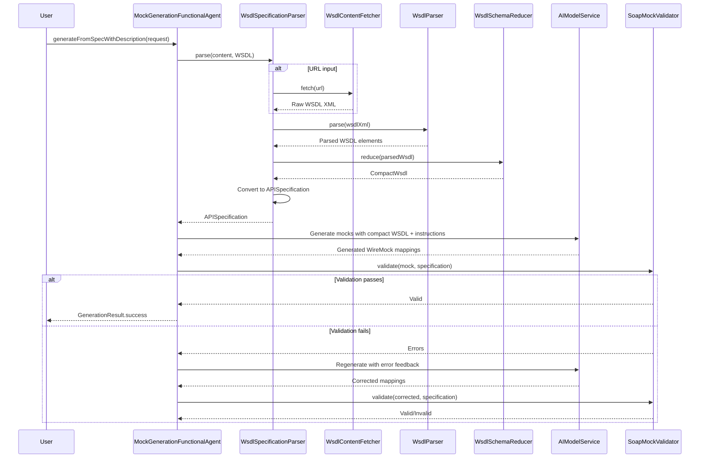

# Design Document: SOAP/WSDL AI Generation

## Overview

This design extends the existing AI mock generation flow to support SOAP web services through WSDL document parsing. The feature enables developers to provide a WSDL document — either as inline XML content or as a remote URL — parse it into a compact representation suitable for AI consumption, generate WireMock-compatible SOAP mock mappings using AI, and validate the generated output against the WSDL with automatic retry/correction.

The design follows clean architecture principles and reuses existing patterns from the REST and GraphQL AI generation flows, including the Koog-based agent orchestration and validation-retry loop. Generation is synchronous — mocks are returned directly without S3 persistence. SOAP requests are handled as HTTP POST requests with XML payloads, matching on the `SOAPAction` header (SOAP 1.1) or `action` parameter in `Content-Type` (SOAP 1.2). Both SOAP 1.1 and SOAP 1.2 are supported.

The primary test path is **inline XML content**. URL-based fetching is validated manually during development; all automated tests use inline WSDL XML from test resource files.

## Architecture

### High-Level Component Diagram



### Integration with Existing Flow

The SOAP/WSDL feature integrates with the existing AI generation flow:

1. **Request Entry Point**: Uses the existing `SpecWithDescriptionRequest` with `SpecificationFormat.WSDL` (already present in the enum)
2. **Agent Orchestration**: Reuses `MockGenerationFunctionalAgent` without modification
3. **Parser Registration**: Adds `WsdlSpecificationParser` to `CompositeSpecificationParserImpl`
4. **Validation Loop**: Adds `SoapMockValidator` alongside `OpenAPIMockValidator` and `GraphQLMockValidator`
5. **Return**: Generated mocks are returned synchronously — no S3 persistence for generation

### Sequence Diagram: End-to-End Flow




## Components and Interfaces

### 1. WsdlContentFetcherInterface (Application Layer — Interface)

**Location**: `software/application/src/main/kotlin/nl/vintik/mocknest/application/generation/wsdl/WsdlContentFetcherInterface.kt`

**Purpose**: Defines the contract for fetching WSDL documents from remote URLs. Kept in the application layer so the domain and application layers have no dependency on infrastructure.

```kotlin
interface WsdlContentFetcherInterface {
    /**
     * Fetch WSDL XML content from a remote URL.
     * @param url The WSDL endpoint URL
     * @return Raw WSDL XML as a string
     * @throws WsdlFetchException on failure
     */
    suspend fun fetch(url: String): String
}
```

### 2. WsdlContentFetcher (Infrastructure Layer)

**Location**: `software/infra/aws/generation/src/main/kotlin/nl/vintik/mocknest/infra/aws/generation/wsdl/WsdlContentFetcher.kt`

**Purpose**: Implements `WsdlContentFetcherInterface` using the existing Ktor HTTP client (already a dependency from the GraphQL feature). Performs an HTTP GET, validates URL safety using `SafeUrlResolver`, and returns the raw WSDL XML.

**Implementation Details**:
- Reuses the Ktor HTTP client already present in the infra module — no new HTTP client dependency
- Validates URL safety via `SafeUrlResolver.validateUrlSafety()` before any network call
- Performs HTTP GET with a configurable timeout (default 30 seconds)
- Returns raw XML string on success
- Throws `WsdlFetchException` on network failure, non-2xx status, or timeout

**Error Handling**:
- Non-2xx HTTP status → `WsdlFetchException("HTTP ${status} fetching WSDL from $url")`
- Network unreachable → `WsdlFetchException("Network failure fetching WSDL: ${cause.message}", cause)`
- Timeout → `WsdlFetchException("Timeout fetching WSDL from $url after ${timeoutMs}ms")`
- Unsafe URL → `WsdlFetchException("URL targets an unsafe address: $url", cause)`

### 3. WsdlParser (Application Layer)

**Location**: `software/application/src/main/kotlin/nl/vintik/mocknest/application/generation/wsdl/WsdlParser.kt`

**Purpose**: Parses WSDL 1.1 XML into structured domain objects using standard JDK XML parsing (`javax.xml.parsers.DocumentBuilder`) — no new XML library dependency.

**Interface**:
```kotlin
interface WsdlParserInterface {
    /**
     * Parse a WSDL 1.1 XML document.
     * @param wsdlXml Raw WSDL XML string
     * @return Parsed WSDL structure
     * @throws WsdlParsingException on parse failure
     */
    fun parse(wsdlXml: String): ParsedWsdl
}
```

**Parsing Algorithm**:
1. Parse XML with `DocumentBuilder` — throw `WsdlParsingException` on malformed XML
2. Extract `targetNamespace` from `<wsdl:definitions>` root element
3. Extract service name from `<wsdl:service name="...">` element
4. Detect SOAP version by checking binding namespace:
   - `http://schemas.xmlsoap.org/wsdl/soap/` → `SoapVersion.SOAP_1_1`
   - `http://schemas.xmlsoap.org/wsdl/soap12/` → `SoapVersion.SOAP_1_2`
   - Neither found → default to `SOAP_1_1` with warning
5. Extract `<wsdl:portType>` elements with their `<wsdl:operation>` children
6. For each operation, extract `<wsdl:input>` and `<wsdl:output>` message references
7. Extract `<wsdl:binding>` elements to get `soapAction` per operation
8. Extract `<xsd:schema>` inline types from `<wsdl:types>` section

**Error Handling**:
- Malformed XML → `WsdlParsingException("Malformed XML at line ${line}: ${message}")`
- Missing `<wsdl:definitions>` root → `WsdlParsingException("Not a valid WSDL 1.1 document: missing definitions element")`
- Missing `targetNamespace` → `WsdlParsingException("WSDL missing required targetNamespace attribute")`

### 4. WsdlSchemaReducer (Application Layer)

**Location**: `software/application/src/main/kotlin/nl/vintik/mocknest/application/generation/wsdl/WsdlSchemaReducer.kt`

**Purpose**: Converts a `ParsedWsdl` into a `CompactWsdl` by retaining only the information needed for AI mock generation and excluding unreferenced XSD types, binding details, and service port addresses.

**Interface**:
```kotlin
interface WsdlSchemaReducerInterface {
    /**
     * Reduce a parsed WSDL to compact form.
     * @param parsedWsdl Parsed WSDL structure
     * @return Compact WSDL representation
     */
    fun reduce(parsedWsdl: ParsedWsdl): CompactWsdl
}
```

**Reduction Strategy**:
1. Copy service name, target namespace, and SOAP version directly
2. For each port type, include name and all operations
3. For each operation, include name, SOAPAction, input message element name, output message element name
4. Collect all message element names referenced by operations
5. Walk the XSD type graph starting from referenced message elements — include only reachable types
6. Exclude: binding details, service port addresses, unreferenced XSD types, WSDL import/include directives

**Size Optimization**:
- Raw WSDL: typically 5–200KB for real-world services
- Compact WSDL: typically 1–30KB (measurably smaller for any WSDL with more than two operations)

### 5. WsdlSpecificationParser (Application Layer)

**Location**: `software/application/src/main/kotlin/nl/vintik/mocknest/application/generation/parsers/WsdlSpecificationParser.kt`

**Purpose**: Implements `SpecificationParserInterface` for WSDL format. Detects whether the input is a URL or inline XML, delegates URL fetching to `WsdlContentFetcherInterface`, then delegates parsing and reduction to `WsdlParser` and `WsdlSchemaReducer`.

**Implementation**:
```kotlin
class WsdlSpecificationParser(
    private val contentFetcher: WsdlContentFetcherInterface,
    private val wsdlParser: WsdlParserInterface,
    private val schemaReducer: WsdlSchemaReducerInterface
) : SpecificationParserInterface {

    override suspend fun parse(content: String, format: SpecificationFormat): APISpecification {
        require(format == SpecificationFormat.WSDL) { "Only WSDL format supported" }
        val wsdlXml = if (SafeUrlResolver.isHttpUrl(content.trim())) {
            contentFetcher.fetch(content.trim())
        } else {
            content
        }
        val parsedWsdl = wsdlParser.parse(wsdlXml)
        val compactWsdl = schemaReducer.reduce(parsedWsdl)
        return convertToAPISpecification(compactWsdl, wsdlXml)
    }

    override fun supports(format: SpecificationFormat): Boolean = format == SpecificationFormat.WSDL
}
```

**Conversion Logic**:
- Each WSDL operation → `EndpointDefinition` with `POST` method
- SOAPAction → stored in `metadata` map of `EndpointDefinition`
- Input/output message element names → request/response schema descriptions
- `CompactWsdl.prettyPrint()` output → stored as `rawContent` in `APISpecification`

### 6. SoapMockValidator (Application Layer)

**Location**: `software/application/src/main/kotlin/nl/vintik/mocknest/application/generation/validators/SoapMockValidator.kt`

**Purpose**: Validates generated WireMock mappings against the `CompactWsdl` embedded in the `APISpecification`. Implements `MockValidatorInterface`.

**Validation Rules** (applied in order):
1. Request method must be `POST`
2. SOAPAction header matcher (SOAP 1.1) or `action` parameter in `Content-Type` matcher (SOAP 1.2) must reference a valid operation name from the compact WSDL
3. Response body must be well-formed XML (parsed with `DocumentBuilder`)
4. Response body root element must be `Envelope` with the correct namespace:
   - SOAP 1.1: `http://schemas.xmlsoap.org/soap/envelope/`
   - SOAP 1.2: `http://www.w3.org/2003/05/soap-envelope`
5. `Envelope` must contain a `Body` child element in the same namespace
6. The element inside `Body` must use the correct target namespace from the compact WSDL
7. Response `Content-Type` header must match SOAP version:
   - SOAP 1.1: `text/xml`
   - SOAP 1.2: `application/soap+xml`

**Error Messages** (returned as a list for AI correction):
- `"Request method must be POST, found: ${method}"`
- `"SOAPAction '${action}' does not match any operation in the WSDL"`
- `"Response body is not well-formed XML: ${parseError}"`
- `"SOAP Envelope element missing or has wrong namespace. Expected: ${expectedNs}, found: ${foundNs}"`
- `"SOAP Body element missing inside Envelope"`
- `"Response body element namespace does not match WSDL targetNamespace. Expected: ${targetNs}"`
- `"Content-Type header '${contentType}' does not match SOAP version. Expected: ${expectedContentType}"`

### 7. PromptBuilderService Updates

**Location**: `software/application/src/main/kotlin/nl/vintik/mocknest/application/generation/services/PromptBuilderService.kt`

**Change**: Add `SpecificationFormat.WSDL` routing to SOAP-specific prompt templates:

```kotlin
val promptPath = when (format) {
    SpecificationFormat.GRAPHQL -> "/prompts/graphql/spec-with-description.txt"
    SpecificationFormat.WSDL -> "/prompts/soap/spec-with-description.txt"
    else -> "/prompts/rest/spec-with-description.txt"
}
```

Same pattern applies to `buildCorrectionPrompt`.

**Prompt Templates**:
- `software/application/src/main/resources/prompts/soap/spec-with-description.txt`
- `software/application/src/main/resources/prompts/soap/correction.txt`

The spec-with-description prompt instructs the AI to:
- Generate WireMock mappings with `POST` method
- Match on `SOAPAction` header (SOAP 1.1) or `action` parameter in `Content-Type` (SOAP 1.2)
- Return XML SOAP envelopes with the correct namespace for the detected SOAP version
- Include the correct `Content-Type` response header
- Use the target namespace from the compact WSDL in response body elements
- Include `"persistent": true` at the top level of each mapping

### 8. Spring Configuration (Infrastructure Layer)

**Location**: `software/infra/aws/generation/src/main/kotlin/nl/vintik/mocknest/infra/aws/generation/config/SoapGenerationConfig.kt`

```kotlin
@Configuration
class SoapGenerationConfig {

    @Bean
    fun wsdlContentFetcher(): WsdlContentFetcherInterface = WsdlContentFetcher()

    @Bean
    fun wsdlParser(): WsdlParserInterface = WsdlParser()

    @Bean
    fun wsdlSchemaReducer(): WsdlSchemaReducerInterface = WsdlSchemaReducer()

    @Bean
    fun wsdlSpecificationParser(
        contentFetcher: WsdlContentFetcherInterface,
        wsdlParser: WsdlParserInterface,
        schemaReducer: WsdlSchemaReducerInterface
    ): SpecificationParserInterface = WsdlSpecificationParser(contentFetcher, wsdlParser, schemaReducer)

    @Bean
    fun soapMockValidator(): SoapMockValidator = SoapMockValidator()
}
```

`WsdlSpecificationParser` is automatically registered in `CompositeSpecificationParserImpl` via the existing `List<SpecificationParserInterface>` injection. `SoapMockValidator` is registered in the existing `CompositeMockValidator` via the same pattern.


## Data Models

### CompactWsdl (Domain Layer)

**Location**: `software/domain/src/main/kotlin/nl/vintik/mocknest/domain/generation/CompactWsdl.kt`

```kotlin
/**
 * Compact representation of a WSDL document optimized for AI consumption.
 * Contains only service metadata, operation signatures, and referenced XSD types.
 */
data class CompactWsdl(
    val serviceName: String,
    val targetNamespace: String,
    val soapVersion: SoapVersion,
    val portTypes: List<WsdlPortType>,
    val operations: List<WsdlOperation>,
    val xsdTypes: Map<String, WsdlXsdType>
) {
    init {
        require(serviceName.isNotBlank()) { "Service name cannot be blank" }
        require(targetNamespace.isNotBlank()) { "Target namespace cannot be blank" }
        require(operations.isNotEmpty()) { "WSDL must have at least one operation" }
    }

    /**
     * Pretty-print the compact WSDL as human-readable text for round-trip testing.
     */
    fun prettyPrint(): String {
        val sb = StringBuilder()
        sb.appendLine("service: $serviceName")
        sb.appendLine("targetNamespace: $targetNamespace")
        sb.appendLine("soapVersion: ${soapVersion.name}")
        sb.appendLine()
        sb.appendLine("portTypes:")
        portTypes.forEach { pt ->
            sb.appendLine("  ${pt.name}")
        }
        sb.appendLine()
        sb.appendLine("operations:")
        operations.forEach { op ->
            sb.appendLine("  ${op.name}:")
            sb.appendLine("    soapAction: ${op.soapAction}")
            sb.appendLine("    input: ${op.inputMessage}")
            sb.appendLine("    output: ${op.outputMessage}")
        }
        if (xsdTypes.isNotEmpty()) {
            sb.appendLine()
            sb.appendLine("types:")
            xsdTypes.forEach { (name, type) ->
                sb.appendLine("  $name:")
                type.fields.forEach { field ->
                    sb.appendLine("    ${field.name}: ${field.type}")
                }
            }
        }
        return sb.toString().trim()
    }
}

/**
 * SOAP protocol version.
 */
enum class SoapVersion(val envelopeNamespace: String, val contentType: String) {
    SOAP_1_1(
        envelopeNamespace = "http://schemas.xmlsoap.org/soap/envelope/",
        contentType = "text/xml"
    ),
    SOAP_1_2(
        envelopeNamespace = "http://www.w3.org/2003/05/soap-envelope",
        contentType = "application/soap+xml"
    )
}

/**
 * A WSDL port type (groups related operations).
 */
data class WsdlPortType(
    val name: String
) {
    init {
        require(name.isNotBlank()) { "Port type name cannot be blank" }
    }
}

/**
 * A WSDL operation with its SOAP binding metadata.
 */
data class WsdlOperation(
    val name: String,
    val soapAction: String,
    val inputMessage: String,
    val outputMessage: String,
    val portTypeName: String
) {
    init {
        require(name.isNotBlank()) { "Operation name cannot be blank" }
        require(inputMessage.isNotBlank()) { "Input message cannot be blank" }
        require(outputMessage.isNotBlank()) { "Output message cannot be blank" }
    }
}

/**
 * An XSD complex type referenced by WSDL message parts.
 */
data class WsdlXsdType(
    val name: String,
    val fields: List<WsdlXsdField>
) {
    init {
        require(name.isNotBlank()) { "XSD type name cannot be blank" }
    }
}

/**
 * A field within an XSD complex type.
 */
data class WsdlXsdField(
    val name: String,
    val type: String
) {
    init {
        require(name.isNotBlank()) { "Field name cannot be blank" }
        require(type.isNotBlank()) { "Field type cannot be blank" }
    }
}
```

### ParsedWsdl (Application Layer — Internal)

**Location**: `software/application/src/main/kotlin/nl/vintik/mocknest/application/generation/wsdl/ParsedWsdl.kt`

Internal intermediate representation produced by `WsdlParser` before reduction. Contains the full parsed WSDL structure including all XSD types, binding details, and service port addresses. Not exposed outside the application layer.

### WSDL-Specific Exceptions (Domain Layer)

**Location**: `software/domain/src/main/kotlin/nl/vintik/mocknest/domain/generation/WsdlExceptions.kt`

```kotlin
/**
 * Exception thrown when WSDL parsing fails.
 */
class WsdlParsingException(message: String, cause: Throwable? = null) : RuntimeException(message, cause)

/**
 * Exception thrown when WSDL fetching from a URL fails.
 */
class WsdlFetchException(message: String, cause: Throwable? = null) : RuntimeException(message, cause)
```

### SpecificationFormat — No Change Required

`SpecificationFormat.WSDL` already exists in the domain model with `handlesOwnUrlResolution = false`, which correctly signals that the infrastructure layer (`WsdlContentFetcher`) handles URL resolution rather than the parser itself.


## Correctness Properties

*A property is a characteristic or behavior that should hold true across all valid executions of a system — essentially, a formal statement about what the system should do. Properties serve as the bridge between human-readable specifications and machine-verifiable correctness guarantees.*

### Property Reflection Summary

After analyzing all acceptance criteria, the following redundancy consolidations were applied:

- Requirements 3.1–3.5 (extract service name, port types, operations, XSD types, SOAPAction) are combined into a single **WSDL extraction completeness** property (P2)
- Requirements 4.1–4.5 (compact WSDL contains service name, port types, operations, SOAPAction, XSD types) are subsumed by P2 and the size reduction property (P3)
- Requirements 5.1–5.3 and 5.5 (prettyPrint includes operations, types, SOAP version, namespace) are subsumed by the round-trip property (P4), which validates all of these implicitly
- Requirements 7.1–7.7 (individual SOAP validation rules) are combined into a single **comprehensive SOAP mock validation** property (P7)
- Requirements 9.1 and 9.2 (SOAP 1.1 and 1.2 version detection) are combined into a single **SOAP version detection** property (P5)

---

### Property 1: Dual Input Mode Equivalence

*For any* valid WSDL document, whether provided as inline XML content or fetched from a URL that serves the same XML, the system should produce an equivalent `CompactWsdl` with the same service name, target namespace, SOAP version, operations, and XSD types.

**Validates: Requirements 1.1, 1.2, 2.6**

---

### Property 2: WSDL Extraction Completeness

*For any* valid WSDL 1.1 document, the `WsdlParser` and `WsdlSchemaReducer` together should extract all port type names, all operation names with their SOAPAction values, all input and output message element names, and all XSD types directly referenced by those messages — with no operations or referenced types omitted.

**Validates: Requirements 3.1, 3.2, 3.3, 3.4, 3.5, 4.1, 4.2, 4.3, 4.4, 4.5**

---

### Property 3: Schema Size Reduction

*For any* valid WSDL document with more than two operations, the character count of `CompactWsdl.prettyPrint()` should be strictly less than the character count of the raw WSDL XML.

**Validates: Requirements 4.7**

---

### Property 4: Round-Trip Integrity

*For any* valid WSDL document, parsing it to a `CompactWsdl`, calling `prettyPrint()`, then parsing the pretty-printed output again should produce a `CompactWsdl` with equivalent service name, target namespace, SOAP version, operations (same names, SOAPActions, input/output messages), and XSD types.

**Validates: Requirements 5.1, 5.2, 5.3, 5.4, 5.5**

---

### Property 5: SOAP Version Detection Correctness

*For any* WSDL document, if the document's binding namespace is `http://schemas.xmlsoap.org/wsdl/soap/` then the detected `SoapVersion` should be `SOAP_1_1`, and if the binding namespace is `http://schemas.xmlsoap.org/wsdl/soap12/` then the detected `SoapVersion` should be `SOAP_1_2`.

**Validates: Requirements 9.1, 9.2, 9.5**

---

### Property 6: Unreferenced XSD Type Exclusion

*For any* WSDL document containing XSD types that are not referenced by any operation's input or output message, those types should not appear in the `CompactWsdl.xsdTypes` map.

**Validates: Requirements 4.6**

---

### Property 7: Comprehensive SOAP Mock Validation

*For any* generated WireMock mapping and its source `CompactWsdl`, the `SoapMockValidator` should enforce all of the following simultaneously: (1) request method is `POST`, (2) SOAPAction or Content-Type action parameter references a valid operation name, (3) response body is well-formed XML, (4) response body root is a SOAP `Envelope` with the correct namespace for the detected SOAP version, (5) `Envelope` contains a `Body` element, (6) the element inside `Body` uses the correct target namespace, and (7) the response `Content-Type` header matches the SOAP version.

**Validates: Requirements 7.1, 7.2, 7.3, 7.4, 7.5, 7.6, 7.7**

---

### Property 8: Bounded Retry Attempts

*For any* generation request where validation fails on every attempt, the retry coordinator should stop after the configured maximum number of attempts (default: 1 retry = 2 total attempts) and return a failure result — never entering an infinite loop.

**Validates: Requirements 8.3**

---

### Property 9: WireMock Mapping Compatibility

*For any* generated SOAP mock, the WireMock mapping JSON should be valid according to the WireMock stub mapping schema and compatible with the existing persistence model (contains `request`, `response`, and `"persistent": true` at the top level).

**Validates: Requirements 10.1**

---

### Property 10: REST and GraphQL Non-Regression

*For any* valid OpenAPI or GraphQL specification with instructions, after adding WSDL support, the system should still successfully generate valid mocks without errors — identical behavior to before the WSDL feature was introduced.

**Validates: Requirements 10.4**


## Error Handling

### Error Handling Strategy

The SOAP/WSDL feature follows the existing error handling patterns from the REST and GraphQL flows, using `runCatching` with structured logging and typed exceptions.

### Error Categories

#### 1. WSDL Fetch Errors (Infrastructure Layer)

| Scenario | Exception | Message Pattern |
|---|---|---|
| Unsafe URL (private IP, loopback) | `WsdlFetchException` | `"URL targets an unsafe address: $host"` |
| Non-2xx HTTP status | `WsdlFetchException` | `"HTTP $status fetching WSDL from $url"` |
| Network unreachable | `WsdlFetchException` | `"Network failure fetching WSDL: ${cause.message}"` |
| Request timeout | `WsdlFetchException` | `"Timeout fetching WSDL from $url after ${timeoutMs}ms"` |
| Response not XML | `WsdlFetchException` | `"Response from $url is not valid XML"` |

#### 2. WSDL Parse Errors (Application Layer)

| Scenario | Exception | Message Pattern |
|---|---|---|
| Malformed XML | `WsdlParsingException` | `"Malformed XML at line $line: $message"` |
| Missing `<wsdl:definitions>` | `WsdlParsingException` | `"Not a valid WSDL 1.1 document: missing definitions element"` |
| Missing `targetNamespace` | `WsdlParsingException` | `"WSDL missing required targetNamespace attribute"` |
| No operations found | `WsdlParsingException` | `"WSDL contains no operations"` |

#### 3. Validation Errors (Application Layer)

Validation errors are returned as a `List<String>` via `MockValidationResult.invalid(errors)` and fed back to the AI for correction. They are not thrown as exceptions.

#### 4. AI Generation Errors

Reuse existing error handling from `MockGenerationFunctionalAgent` and `AIModelServiceInterface`. No SOAP-specific changes needed.

### User-Facing Error Messages

- `"Unable to fetch WSDL from URL: $url. Please verify the URL is accessible and returns a valid WSDL document."`
- `"Failed to parse WSDL document: $parseError. Please verify the document is a valid WSDL 1.1 XML file."`
- `"SOAP mock generation failed after $maxRetries attempts. Last validation errors: $errorSummary"`

### Logging Strategy

Following the project's logging standards:
- `ERROR`: Fatal errors preventing generation (fetch failure, parse failure)
- `WARN`: Validation failures, retry attempts
- `INFO`: Successful parse/reduce with size metrics, successful validation after retry
- `DEBUG`: Detailed extraction counts, validation rule details

```kotlin
logger.info { "WSDL parsed: service=$serviceName, operations=${operations.size}, types=${xsdTypes.size}" }
logger.info { "Schema reduction: ${rawSize} -> ${compactSize} chars (${reductionPct}% reduction)" }
logger.warn { "SOAP mock validation failed: ${errors.size} errors, attempt=$attempt" }
logger.error(exception) { "Failed to fetch WSDL: url=$url" }
```


## Testing Strategy

### Dual Testing Approach

The SOAP/WSDL feature uses both unit tests and property-based tests for comprehensive coverage. **Inline XML content is the primary test path** — all automated tests use inline WSDL XML from `src/test/resources/wsdl/`. URL-based fetching is validated manually during development.

**Unit Tests**:
- Specific examples demonstrating correct behavior
- Error conditions and edge cases
- Integration points between components

**Property-Based Tests**:
- Universal properties across diverse WSDL inputs
- Implemented as `@ParameterizedTest` with 10+ diverse WSDL test data files
- Each property test references its design document property number

### Test Data Organization

All WSDL test data files are stored in `src/test/resources/wsdl/` within the relevant module:

| File | Description |
|---|---|
| `simple-soap11.wsdl` | Minimal SOAP 1.1 service, 1 operation |
| `simple-soap12.wsdl` | Minimal SOAP 1.2 service, 1 operation |
| `multi-operation-soap11.wsdl` | SOAP 1.1 service with 5+ operations |
| `multi-porttype-soap11.wsdl` | SOAP 1.1 service with multiple port types |
| `complex-types-soap11.wsdl` | SOAP 1.1 service with nested XSD complex types |
| `nested-xsd-soap11.wsdl` | SOAP 1.1 service with deeply nested XSD types |
| `unreferenced-types-soap11.wsdl` | SOAP 1.1 service with unreferenced XSD types (for exclusion test) |
| `multi-operation-soap12.wsdl` | SOAP 1.2 service with 5+ operations |
| `mixed-version.wsdl` | WSDL with both SOAP 1.1 and SOAP 1.2 bindings |
| `large-service.wsdl` | Service with 15+ operations and many XSD types |
| `calculator-soap11.wsdl` | Classic calculator service (SOAP 1.1) |
| `weather-soap12.wsdl` | Weather service (SOAP 1.2) |
| `malformed.wsdl` | Malformed XML (for error testing) |
| `invalid-no-operations.wsdl` | Valid XML but no WSDL operations (for error testing) |

### Unit Testing Focus

**WsdlParser**:
- Successful parsing of SOAP 1.1 and SOAP 1.2 documents
- Extraction of service name, target namespace, port types, operations, SOAPAction, XSD types
- SOAP version detection from binding namespace
- Default to SOAP 1.1 when no binding namespace found
- Error on malformed XML
- Error on missing `<wsdl:definitions>` root
- Error on missing `targetNamespace`

**WsdlSchemaReducer**:
- Successful reduction produces smaller output than input
- All operations present in compact form
- Referenced XSD types included
- Unreferenced XSD types excluded
- Binding details and service port addresses excluded

**WsdlSpecificationParser**:
- Inline XML path: parse → reduce → convert to APISpecification
- URL path: detect URL → delegate to fetcher → parse → reduce
- Validation of invalid WSDL content
- Metadata extraction

**SoapMockValidator**:
- Valid SOAP 1.1 mock passes all rules
- Valid SOAP 1.2 mock passes all rules
- Non-POST method rejected with descriptive error
- Invalid SOAPAction rejected
- Non-XML response body rejected
- Wrong envelope namespace rejected
- Missing Body element rejected
- Wrong target namespace in body rejected
- Wrong Content-Type header rejected
- Multiple validation errors returned together

**WsdlContentFetcher** (infrastructure, URL path):
- Successful fetch returns raw XML
- Non-2xx status throws `WsdlFetchException`
- Timeout throws `WsdlFetchException`
- Unsafe URL rejected before network call

### Property-Based Tests

All property tests use `@ParameterizedTest` with the WSDL test data files listed above. Each test is tagged with `@Tag("soap-wsdl-ai-generation")` and the property number.

```kotlin
// Property 2: WSDL Extraction Completeness
@ParameterizedTest
@ValueSource(strings = [
    "simple-soap11.wsdl", "simple-soap12.wsdl", "multi-operation-soap11.wsdl",
    "multi-porttype-soap11.wsdl", "complex-types-soap11.wsdl", "nested-xsd-soap11.wsdl",
    "multi-operation-soap12.wsdl", "large-service.wsdl", "calculator-soap11.wsdl",
    "weather-soap12.wsdl"
])
@Tag("soap-wsdl-ai-generation")
@Tag("Property-2")
fun `Property 2 - WSDL Extraction Completeness`(filename: String) {
    val wsdlXml = loadTestWsdl(filename)
    val parsedWsdl = wsdlParser.parse(wsdlXml)
    val compactWsdl = schemaReducer.reduce(parsedWsdl)
    // Verify all operations present
    val expectedOperations = extractOperationNamesFromXml(wsdlXml)
    assertEquals(expectedOperations.toSet(), compactWsdl.operations.map { it.name }.toSet())
    // Verify all SOAPActions present
    compactWsdl.operations.forEach { op ->
        assertNotNull(op.soapAction, "SOAPAction must be present for operation ${op.name}")
    }
    // Verify referenced XSD types present
    val referencedTypes = collectReferencedTypeNames(wsdlXml)
    referencedTypes.forEach { typeName ->
        assertTrue(compactWsdl.xsdTypes.containsKey(typeName) || isBuiltInType(typeName),
            "Referenced type $typeName must be in compact WSDL")
    }
}

// Property 3: Schema Size Reduction
@ParameterizedTest
@ValueSource(strings = [
    "multi-operation-soap11.wsdl", "multi-porttype-soap11.wsdl", "complex-types-soap11.wsdl",
    "multi-operation-soap12.wsdl", "large-service.wsdl", "calculator-soap11.wsdl",
    "weather-soap12.wsdl", "nested-xsd-soap11.wsdl"
])
@Tag("soap-wsdl-ai-generation")
@Tag("Property-3")
fun `Property 3 - Schema Size Reduction`(filename: String) {
    val wsdlXml = loadTestWsdl(filename)
    val compactWsdl = schemaReducer.reduce(wsdlParser.parse(wsdlXml))
    val compactSize = compactWsdl.prettyPrint().length
    assertTrue(compactSize < wsdlXml.length,
        "Compact WSDL ($compactSize chars) must be smaller than raw WSDL (${wsdlXml.length} chars)")
}

// Property 4: Round-Trip Integrity
@ParameterizedTest
@ValueSource(strings = [
    "simple-soap11.wsdl", "simple-soap12.wsdl", "multi-operation-soap11.wsdl",
    "complex-types-soap11.wsdl", "multi-operation-soap12.wsdl", "large-service.wsdl",
    "calculator-soap11.wsdl", "weather-soap12.wsdl", "nested-xsd-soap11.wsdl",
    "multi-porttype-soap11.wsdl"
])
@Tag("soap-wsdl-ai-generation")
@Tag("Property-4")
fun `Property 4 - Round-Trip Integrity`(filename: String) {
    val wsdlXml = loadTestWsdl(filename)
    val original = schemaReducer.reduce(wsdlParser.parse(wsdlXml))
    val prettyPrinted = original.prettyPrint()
    val reparsed = parseCompactWsdlText(prettyPrinted)
    assertEquals(original.serviceName, reparsed.serviceName)
    assertEquals(original.targetNamespace, reparsed.targetNamespace)
    assertEquals(original.soapVersion, reparsed.soapVersion)
    assertEquals(original.operations.map { it.name }.toSet(), reparsed.operations.map { it.name }.toSet())
    assertEquals(original.xsdTypes.keys, reparsed.xsdTypes.keys)
}
```

### Integration Tests

**Inline XML End-to-End** (application layer, no AWS):
- Complete path: inline WSDL XML → `WsdlSpecificationParser.parse()` → `WsdlSchemaReducer.reduce()` → `APISpecification` → prompt construction → mock validation
- Covers SOAP 1.1 and SOAP 1.2 documents
- Verifies `CompactWsdl` is embedded in `APISpecification.rawContent`

**URL Path with Mock HTTP Server** (infrastructure layer):
- Uses WireMock or MockWebServer to serve a WSDL document
- Verifies `WsdlContentFetcher` performs GET and returns XML
- Verifies the result is equivalent to the inline XML path for the same WSDL content
- Validates: Property 1 (Dual Input Mode Equivalence)

**LocalStack Integration Tests** (infrastructure layer):
- Uses LocalStack TestContainers with S3
- Verifies end-to-end: inline WSDL XML → parsing → AI generation (mocked) → S3 persistence
- Verifies generated mocks are retrievable from S3
- Follows existing LocalStack test patterns with `@BeforeAll`/`@AfterAll` lifecycle

**REST/GraphQL Non-Regression** (integration):
- Verifies that existing OpenAPI and GraphQL generation still works after WSDL support is added
- Uses existing test fixtures from those features

### Property-Based Testing Configuration

- **Test Library**: JUnit 6 `@ParameterizedTest` (consistent with project standards)
- **Minimum examples per property**: 10 diverse WSDL files
- **Tag format**: `@Tag("soap-wsdl-ai-generation")` and `@Tag("Property-{number}")`
- **Test data location**: `src/test/resources/wsdl/`
- All tests are mandatory — no `@Disabled` or optional markers

### Coverage Goals

- **Target**: 90%+ aggregated coverage for new SOAP/WSDL code
- **Critical paths**: `WsdlParser` (95%), `WsdlSchemaReducer` (95%), `SoapMockValidator` (95%)
- Coverage enforced via `./gradlew koverVerify`

