# Design Document: Spring Cloud Function to Koin Migration

## Overview

This design describes the migration of MockNest Serverless from Spring Boot 4.0.5 / Spring Cloud Function 2025.1.1 to Koin 4.2.1, a lightweight Kotlin-native dependency injection framework. The migration is a pure refactoring effort — all existing functionality, API contracts, serialization behavior, and post-deploy test compatibility are preserved.

### Motivation

Spring is used exclusively for dependency injection in MockNest Serverless. No Spring Web controllers, Spring Data repositories, or other Spring features are leveraged. The current architecture pays a significant cost for this:

- **JAR size**: 83 MB Shadow JAR, of which ~33 MB is Spring + Reactor classes
- **Cold-start overhead**: Spring context initialization adds latency to Lambda cold starts
- **Build complexity**: Shadow JAR requires `mergeServiceFiles()`, 6 `append()` calls for Spring metadata, and Spring-specific exclusions
- **Domain pollution**: The domain layer depends on `spring-web` solely for `HttpMethod`, `HttpStatusCode`, and `MultiValueMap` types

Koin eliminates all of these costs while providing equivalent DI capabilities through a Kotlin-native DSL with no annotation processing, no reflection-heavy startup, and a ~1 MB footprint.

### Migration Strategy

The migration follows a bottom-up approach across the clean architecture layers:

1. **Domain layer** — Replace Spring HTTP types with custom Kotlin types
2. **Application layer** — Remove Spring annotations, replace `@Value` with environment variable reads
3. **Infrastructure layer** — Replace `@Configuration`/`@Bean` with Koin modules, replace `FunctionInvoker` with direct `RequestHandler` implementations
4. **Build system** — Remove Spring plugins and BOMs, add Koin dependencies
5. **SAM template** — Update handler references, remove Spring environment variables
6. **Tests** — Replace `@SpringBootTest` with Koin test utilities

### Key Design Decisions

| Decision | Rationale |
|---|---|
| Koin 4.2.1 over Kodein or manual DI | Koin is the most widely adopted Kotlin-native DI framework, has excellent test utilities, and its DSL maps naturally to the existing `@Bean` method structure |
| Custom domain HTTP types over AWS SDK types | Domain layer must remain cloud-agnostic per clean architecture; AWS Lambda event types belong in the infrastructure layer only |
| `startKoin` once per Lambda container lifecycle | Matches the current Spring context lifecycle — initialized once, reused across warm invocations |
| Shared `KoinBootstrap` object for idempotent startup | `startKoin` throws if called twice in the same JVM (tests, multiple handlers). A shared object with "start once / get existing" logic prevents this |
| Explicit priming call in handler init, before SnapStart snapshot | Priming must run eagerly during initialization (not lazily on first request) to be captured in the SnapStart snapshot. Called explicitly after `startKoin` in the handler's `companion object init` block |
| `coreModule` lives in `:software:infra:aws:core` (not `:mocknest`) | Runtime and generation handlers live in their own modules and reference `coreModule`. Placing it in `:mocknest` would create circular or awkward dependencies. `:infra:aws:core` is the shared infra package |
| `System.getenv()` for configuration | All configuration values already come from Lambda environment variables; Spring's `@Value` was just a pass-through |
| `MOCKNEST_S3_BUCKET_NAME` as canonical env var name | SAM currently passes both `MOCK_STORAGE_BUCKET` and `MOCKNEST_S3_BUCKET_NAME`. Settle on `MOCKNEST_S3_BUCKET_NAME` as the single canonical name; remove `MOCK_STORAGE_BUCKET` from SAM |
| `APIGatewayProxyResponseEvent.withHeaders()` uses first value only | `withHeaders()` accepts `Map<String, String>` (single-value). Decision: keep first value via `mapValues { it.value.first() }`, matching current `toSingleValueMap()` behavior. Use `withMultiValueHeaders()` if multi-value support is needed later |
| Remove `kotlin-reflect` from global dependencies if possible | No source code uses `kotlin.reflect` APIs directly. Remove from global dependencies and verify the build, tests, Koog, WireMock, Jackson, and Koin still pass without it. Reduces JAR size further |

## Architecture

### High-Level Architecture Change

```mermaid
flowchart TB
    subgraph Before["Current: Spring Cloud Function"]
        SCF[FunctionInvoker::handleRequest]
        SC[Spring Context]
        PROF[Spring Profiles]
        BEAN[@Bean / @Configuration]
        
        SCF --> SC
        SC --> PROF
        SC --> BEAN
    end
    
    subgraph After["After: Koin + Direct Handlers"]
        RH[RuntimeHandler : RequestHandler]
        GH[GenerationHandler : RequestHandler]
        AH[RuntimeAsyncHandler : RequestHandler]
        KA[KoinApplication]
        KM[Koin Modules]
        
        RH --> KA
        GH --> KA
        AH --> KA
        KA --> KM
    end
    
    Before -.->|migrates to| After
```

### Dependency Flow (Unchanged)

The clean architecture dependency flow remains identical:

```
:software:infra:aws:mocknest → :software:infra:aws:runtime → :software:application → :software:domain
                              → :software:infra:aws:generation → :software:application → :software:domain
                              → :software:infra:generation-core → :software:application → :software:domain
```

### Module Mapping: Spring Profiles → Koin Modules

| Spring Profile | Lambda Function | Koin Module Set |
|---|---|---|
| `runtime` | MockNestRuntimeFunction | `coreModule` + `runtimeModule` |
| `generation` | MockNestGenerationFunction | `coreModule` + `generationModule` |
| `core,async` | MockNestRuntimeAsyncFunction | `coreModule` + `asyncModule` |

Each Koin module set is loaded by the corresponding Lambda handler at startup, replacing Spring's profile-based conditional bean activation.

## Components and Interfaces

### 1. Domain HTTP Types (Replacing Spring Types)

New Kotlin types in `:software:domain` to replace Spring HTTP types:

#### `HttpMethod` Enum
```kotlin
// nl.vintik.mocknest.domain.core.HttpMethod
enum class HttpMethod {
    GET, HEAD, POST, PUT, PATCH, DELETE, OPTIONS, TRACE;
    
    companion object {
        fun valueOf(method: String): HttpMethod = entries.first { it.name.equals(method, ignoreCase = true) }
    }
}
```

Replaces `org.springframework.http.HttpMethod` in:
- `HttpRequest.kt` — `method: HttpMethod`
- `APISpecification.kt` — `EndpointDefinition.method: HttpMethod`
- `GeneratedMock.kt` — `EndpointInfo.method: HttpMethod`

#### `HttpStatusCode` Value Class
```kotlin
// nl.vintik.mocknest.domain.core.HttpStatusCode
@JvmInline
value class HttpStatusCode(val value: Int) {
    init {
        require(value in 100..599) { "HTTP status code must be between 100 and 599, got: $value" }
    }
    
    fun value(): Int = value
    
    companion object {
        val OK = HttpStatusCode(200)
        val CREATED = HttpStatusCode(201)
        val BAD_REQUEST = HttpStatusCode(400)
        val NOT_FOUND = HttpStatusCode(404)
        val INTERNAL_SERVER_ERROR = HttpStatusCode(500)
    }
}
```

Replaces `org.springframework.http.HttpStatusCode` and `org.springframework.http.HttpStatus` in:
- `HttpResponse.kt` — `statusCode: HttpStatusCode`
- `HttpResponseHelper.kt` — `HttpStatusCode.OK`
- `RuntimeLambdaHandler.kt` — `HttpStatusCode.NOT_FOUND`
- `GenerationLambdaHandler.kt` — `HttpStatusCode.NOT_FOUND`

#### `HttpResponse` Update
```kotlin
// nl.vintik.mocknest.domain.core.HttpResponse
data class HttpResponse(
    val statusCode: HttpStatusCode,
    val headers: Map<String, List<String>>? = null,
    val body: String? = null
)
```

Replaces `MultiValueMap<String, String>` with `Map<String, List<String>>`. The `toSingleValueMap()` call in Lambda handlers becomes a simple `mapValues { it.value.first() }`.

### 2. Lambda Handlers (Replacing FunctionInvoker + Router Beans)

Each Lambda function gets a direct `RequestHandler` implementation that:
1. Initializes Koin via shared `KoinBootstrap` (idempotent — safe for tests and multiple handlers)
2. Calls priming explicitly after Koin init (before SnapStart snapshot)
3. Resolves dependencies via `KoinComponent`
4. Contains the routing logic previously in `Function<>` beans

#### KoinBootstrap (Idempotent Startup)
```kotlin
// nl.vintik.mocknest.infra.aws.core.di.KoinBootstrap
object KoinBootstrap {
    @Volatile
    private var initialized = false
    
    fun init(modules: List<Module>) {
        if (!initialized) {
            synchronized(this) {
                if (!initialized) {
                    startKoin {
                        allowOverride(false) // Catch accidental duplicate bean definitions
                        modules(modules)
                    }
                    initialized = true
                }
            }
        }
    }
}
```

This prevents `startKoin` from being called twice in the same JVM — which happens during tests or if multiple handlers share a classloader. `allowOverride(false)` catches accidental duplicate definitions (e.g., S3Client declared in both coreModule and runtimeModule).

#### Runtime Lambda Handler
```kotlin
// nl.vintik.mocknest.infra.aws.runtime.function.RuntimeLambdaHandler
class RuntimeLambdaHandler : RequestHandler<APIGatewayProxyRequestEvent, APIGatewayProxyResponseEvent>, KoinComponent {
    
    companion object {
        init {
            KoinBootstrap.init(listOf(coreModule(), runtimeModule()))
            // Explicit priming — runs BEFORE SnapStart snapshot, not lazily on first request
            KoinBootstrap.getKoin().get<RuntimePrimingHook>().onApplicationReady()
            // CRaC registration — enables afterRestore() for mock reload after SnapStart restore
            KoinBootstrap.getKoin().get<RuntimeMappingReloadHook>().register()
        }
    }
    
    private val handleClientRequest: HandleClientRequest by inject()
    private val handleAdminRequest: HandleAdminRequest by inject()
    private val getRuntimeHealth: GetRuntimeHealth by inject()
    
    override fun handleRequest(event: APIGatewayProxyRequestEvent, context: Context): APIGatewayProxyResponseEvent {
        // Same routing logic as current runtimeRouter bean
    }
}
```

#### Generation Lambda Handler
```kotlin
// nl.vintik.mocknest.infra.aws.generation.function.GenerationLambdaHandler
class GenerationLambdaHandler : RequestHandler<APIGatewayProxyRequestEvent, APIGatewayProxyResponseEvent>, KoinComponent {
    
    companion object {
        init {
            KoinBootstrap.init(listOf(coreModule(), generationModule()))
            // Explicit priming — runs BEFORE SnapStart snapshot
            KoinBootstrap.getKoin().get<GenerationPrimingHook>().onApplicationReady()
        }
    }
    
    private val handleAIGenerationRequest: HandleAIGenerationRequest by inject()
    private val getAIHealth: GetAIHealth by inject()
    
    override fun handleRequest(event: APIGatewayProxyRequestEvent, context: Context): APIGatewayProxyResponseEvent {
        // Same routing logic as current generationRouter bean
    }
}
```

#### RuntimeAsync Lambda Handler
```kotlin
// nl.vintik.mocknest.infra.aws.runtime.runtimeasync.RuntimeAsyncLambdaHandler
class RuntimeAsyncLambdaHandler : RequestHandler<SQSEvent, Unit>, KoinComponent {
    
    companion object {
        init {
            KoinBootstrap.init(listOf(coreModule(), asyncModule()))
            // Explicit priming — runs BEFORE SnapStart snapshot
            KoinBootstrap.getKoin().get<RuntimeAsyncPrimingHook>().onApplicationReady()
        }
    }
    
    private val runtimeAsyncHandler: RuntimeAsyncHandler by inject()
    
    override fun handleRequest(event: SQSEvent, context: Context) {
        runtimeAsyncHandler.handle(event)
    }
}
```

### 3. Koin Module Definitions (Replacing @Configuration Classes)

#### Core Module (Shared — lives in `:software:infra:aws:core`)

The `coreModule` lives in `:software:infra:aws:core` (not `:mocknest`) so that `:runtime` and `:generation` can import it without circular dependencies. It also includes the S3Client bean from the current `S3Configuration` class (`@Configuration @Profile("!local")`).

Shared modules are defined as functions rather than global `val`s — Koin docs recommend this because `module {}` preallocates factories, and functions create fresh instances when needed.

```kotlin
// nl.vintik.mocknest.infra.aws.core.di.CoreModule
fun coreModule() = module {
    // Jackson ObjectMapper (shared)
    single { mapper }
    
    // S3 client (replaces S3Configuration @Bean with @Profile("!local"))
    single {
        S3Client { region = System.getenv("AWS_REGION") ?: "eu-west-1" }
    }
}
```

#### Runtime Module
```kotlin
fun runtimeModule() = module {
    // SQS client
    single {
        SqsClient { region = System.getenv("AWS_DEFAULT_REGION") ?: "eu-west-1" }
    }
    
    // Storage (S3Client comes from coreModule)
    single<ObjectStorageInterface> {
        S3ObjectStorageAdapter(
            bucketName = System.getenv("MOCKNEST_S3_BUCKET_NAME") ?: "",
            s3Client = get()
        )
    }
    
    // Webhook config
    single { WebhookConfig.fromEnv() }
    single<WebhookHttpClientInterface> { WebhookHttpClient(get()) }
    single<SqsPublisherInterface> { SqsWebhookPublisher(get()) }
    
    // WireMock server and components
    single { DirectCallHttpServerFactory() }
    single<BlobStore> { ObjectStorageBlobStore(get()) }
    single { RedactSensitiveHeadersFilter(get()) }
    single { S3RequestJournalStore(get(), get(), get()) }
    single { createWireMockServer(get(), get(), get(), get(), get(), get()) }
    single { get<DirectCallHttpServerFactory>().httpServer }
    
    // Health check
    single<GetRuntimeHealth> {
        AwsRuntimeHealthUseCase(get(), System.getenv("MOCKNEST_S3_BUCKET_NAME") ?: "")
    }
    
    // Use cases
    single<HandleAdminRequest> { AdminRequestUseCase(get()) }
    single<HandleClientRequest> { ClientRequestUseCase(get()) }
    
    // Priming hook
    single { RuntimePrimingHook(get(), get(), System.getenv("MOCKNEST_S3_BUCKET_NAME") ?: "", get(), get(), get()) }
    
    // CRaC lifecycle — reloads WireMock mappings from S3 after SnapStart restore
    single { RuntimeMappingReloadHook(get()) }
}
```

#### Generation Module
```kotlin
fun generationModule() = module {
    // Bedrock client (S3Client comes from coreModule)
    single {
        val region = System.getenv("AWS_REGION") ?: "eu-west-1"
        val customEndpoint = System.getenv("aws.bedrock.endpoint")
        BedrockRuntimeClient {
            this.region = region
            if (!customEndpoint.isNullOrBlank()) {
                endpointUrl = Url.parse(customEndpoint)
            }
        }
    }
    
    // Storage
    single<GenerationStorageInterface> {
        S3GenerationStorageAdapter(get(), System.getenv("MOCKNEST_S3_BUCKET_NAME") ?: "")
    }
    
    // Model configuration
    single {
        val deployRegion = System.getenv("AWS_REGION") ?: "eu-west-1"
        val inferenceMode = System.getenv("BEDROCK_INFERENCE_MODE") ?: "AUTO"
        DefaultInferencePrefixResolver(deployRegion, InferenceMode.valueOf(inferenceMode.uppercase()))
    }
    single {
        ModelConfiguration(
            modelName = System.getenv("BEDROCK_MODEL_NAME") ?: "AmazonNovaPro",
            prefixResolver = get()
        )
    }
    
    // Parsers
    single { OpenAPISpecificationParser() }
    single<GraphQLIntrospectionClientInterface> { GraphQLIntrospectionClient() }
    single<GraphQLSchemaReducerInterface> { GraphQLSchemaReducer() }
    single<SpecificationParserInterface>(named("graphql")) {
        GraphQLSpecificationParser(get(), get())
    }
    single<WsdlContentFetcherInterface> { WsdlContentFetcher() }
    single<WsdlParserInterface> { WsdlParser() }
    single<WsdlSchemaReducerInterface> { WsdlSchemaReducer() }
    single<SpecificationParserInterface>(named("wsdl")) {
        WsdlSpecificationParser(get(), get(), get())
    }
    single<CompositeSpecificationParser> {
        CompositeSpecificationParserImpl(listOf(get(), get(named("graphql")), get(named("wsdl"))))
    }
    
    // Validators
    single { OpenAPIMockValidator() }
    single { GraphQLMockValidator() }
    single { SoapMockValidator() }
    single<MockValidatorInterface> {
        CompositeMockValidator(listOf(get<OpenAPIMockValidator>(), get<GraphQLMockValidator>(), get<SoapMockValidator>()))
    }
    
    // Services
    single { PromptBuilderService() }
    single<AIModelServiceInterface> { BedrockServiceAdapter(get(), get(), get()) }
    
    // Agent and use cases
    single {
        val maxRetries = (System.getenv("BEDROCK_GENERATION_MAX_RETRIES") ?: "1").toInt()
        MockGenerationFunctionalAgent(get(), get<CompositeSpecificationParser>(), get(), get(), maxRetries)
    }
    single { GenerateMocksFromSpecWithDescriptionUseCase(get()) }
    single<HandleAIGenerationRequest> { AIGenerationRequestUseCase(get()) }
    
    // Health check
    single<GetAIHealth> {
        AwsAIHealthUseCase(get(), System.getenv("BEDROCK_INFERENCE_MODE") ?: "AUTO")
    }
    
    // Priming hook
    single {
        GenerationPrimingHook(
            get(), get(), System.getenv("MOCKNEST_S3_BUCKET_NAME") ?: "",
            get(), get(), get(), get(), get(), get(), get(), get(), get()
        )
    }
}
```

#### Async Module
```kotlin
fun asyncModule() = module {
    // Webhook config and HTTP client
    single { WebhookConfig.fromEnv() }
    single<WebhookHttpClientInterface> { WebhookHttpClient(get()) }
    
    // RuntimeAsync handler
    single {
        RuntimeAsyncHandler(
            webhookHttpClient = get(),
            webhookConfig = get(),
            defaultRegion = System.getenv("AWS_DEFAULT_REGION") ?: "eu-west-1"
        )
    }
    
    // Priming hook
    single { RuntimeAsyncPrimingHook(get()) }
}
```

### 4. SnapStart Priming (Replacing ApplicationReadyEvent)

The priming hooks currently use `@EventListener(ApplicationReadyEvent::class)`. After migration, priming is called **explicitly and eagerly** in each Lambda handler's `companion object init` block — immediately after `KoinBootstrap.init()`. This ensures priming runs during Lambda initialization, **before** the SnapStart snapshot is taken, not lazily on first request.

```kotlin
companion object {
    init {
        KoinBootstrap.init(listOf(coreModule(), runtimeModule()))
        // CRITICAL: Priming runs HERE — during init, before SnapStart snapshot
        // Not lazily on first request. This is the direct replacement for ApplicationReadyEvent.
        KoinBootstrap.getKoin().get<RuntimePrimingHook>().onApplicationReady()
    }
}
```

The priming hooks themselves already check `isSnapStartEnvironment()` internally and skip priming in non-SnapStart environments. The explicit call in `init` guarantees the priming code is captured in the snapshot.

No CRaC dependency is needed for priming — the `companion object init` block runs exactly once per Lambda container lifecycle, which is the same timing as `ApplicationReadyEvent`.

### CRaC Lifecycle Integration

MockNest uses CRaC (`org.crac:crac`) to handle lifecycle events beyond initial startup:

- `beforeCheckpoint()` is a no-op (priming is handled via the handler init block)
- `afterRestore()` is used by `RuntimeMappingReloadHook` to reload WireMock mappings from S3 after SnapStart restore — without this, the in-memory stub store contains stale data from snapshot time

After migration to Koin:
- CRaC-managed components MUST be registered manually after Koin initialization — Spring previously registered CRaC lifecycle via `@PostConstruct` on a Spring-managed component; Koin requires explicit registration
- Components implementing CRaC `Resource` (e.g., `RuntimeMappingReloadHook`) MUST be explicitly registered with the CRaC global context

Example:
```kotlin
companion object {
    init {
        KoinBootstrap.init(listOf(coreModule(), runtimeModule()))
        // Priming — runs before SnapStart snapshot
        KoinBootstrap.getKoin().get<RuntimePrimingHook>().onApplicationReady()
        // CRaC registration — enables afterRestore() for mock reload after SnapStart restore
        val reloadHook = KoinBootstrap.getKoin().get<RuntimeMappingReloadHook>()
        Core.getGlobalContext().register(reloadHook)
    }
}
```

This ensures:
- Mocks are reloaded after SnapStart restore (via CRaC `afterRestore()`)
- Runtime state is correctly restored for each new execution environment
- No hidden lifecycle magic from Spring — fully explicit, predictable behavior

**Important**: CRaC `afterRestore()` logic must complete within the Lambda restore hook timeout. AWS requires after-restore runtime hooks to finish within 10 seconds, so mock reload must remain bounded and observable through logs.

#### KoinBootstrap Koin Access

`KoinBootstrap` exposes access to the Koin instance for CRaC hook registration:

```kotlin
fun getKoin(): Koin = GlobalContext.get().koin
```

This is required for CRaC hook registration during initialization. `startKoin` registers the container in `GlobalContext`, while `koinApplication {}` creates an isolated instance (used in tests).

### 5. Shadow JAR Simplification

The `mocknest` module's `build.gradle.kts` Shadow JAR configuration simplifies significantly:

**Removed (Spring-specific only):**
- `mergeServiceFiles()` — no Spring service files to merge
- All 6 `append()` calls for Spring metadata files
- Spring-specific class exclusions: `org/springframework/boot/devtools/**`, `org/springframework/boot/test/**`, `org/springframework/test/**`
- `springBoot { mainClass }` block, `bootJar`/`bootRun` task disabling

**Retained (non-Spring — still needed):**
- `isZip64 = true`
- Security file exclusions (`META-INF/*.SF`, `META-INF/*.DSA`, `META-INF/*.RSA`, `META-INF/LICENSE*`, `META-INF/NOTICE*`, `META-INF/maven/**`, `module-info.class`)
- Jetty component exclusions: `org/eclipse/jetty/websocket/**`, `org/eclipse/jetty/http2/**`, `org/eclipse/jetty/alpn/**`, `org/eclipse/jetty/jmx/**`, `org/eclipse/jetty/annotations/**`, `org/eclipse/jetty/jaas/**`, `org/eclipse/jetty/jndi/**`, `org/eclipse/jetty/plus/**`, `org/eclipse/jetty/proxy/**`, `org/eclipse/jetty/rewrite/**`, `org/eclipse/jetty/servlets/**`, `org/eclipse/jetty/webapp/**`, `org/eclipse/jetty/xml/**`
- Size optimization exclusions: `assets/swagger-ui/**`, `samples/**`, `mozilla/public-suffix-list.txt`, `ucd/**`
- `runtimeClasspath` exclusions: Tomcat, Undertow, Jetty WebSocket/HTTP2, Guava, Apache HTTP clients, Lettuce/Reactor Netty, Kotlin compiler/scripting, XML processing
- `manifest` block (updated to remove Spring main class reference)

### 6. SAM Template Changes

For each Lambda function definition (6 total: 3 API key mode + 3 IAM mode):

**Handler property changes:**
| Function | Before | After |
|---|---|---|
| Runtime | `org.springframework.cloud.function.adapter.aws.FunctionInvoker::handleRequest` | `nl.vintik.mocknest.infra.aws.runtime.function.RuntimeLambdaHandler` |
| Generation | `org.springframework.cloud.function.adapter.aws.FunctionInvoker::handleRequest` | `nl.vintik.mocknest.infra.aws.generation.function.GenerationLambdaHandler` |
| RuntimeAsync | `org.springframework.cloud.function.adapter.aws.FunctionInvoker::handleRequest` | `nl.vintik.mocknest.infra.aws.runtime.runtimeasync.RuntimeAsyncLambdaHandler` |

**Environment variables removed:**
- `SPRING_PROFILES_ACTIVE`
- `SPRING_CLOUD_FUNCTION_DEFINITION`
- `MAIN_CLASS`
- `MOCK_STORAGE_BUCKET` (duplicate of `MOCKNEST_S3_BUCKET_NAME` — settle on one canonical name)

**Environment variables retained (unchanged):**
- `MOCKNEST_S3_BUCKET_NAME` (canonical bucket name), `JAVA_TOOL_OPTIONS`
- `BEDROCK_MODEL_NAME`, `BEDROCK_INFERENCE_MODE`, `BEDROCK_GENERATION_MAX_RETRIES`
- `MOCKNEST_SENSITIVE_HEADERS`, `MOCKNEST_WEBHOOK_QUEUE_URL`, `MOCKNEST_REQUEST_JOURNAL_PREFIX`
- `MOCKNEST_WEBHOOK_TIMEOUT_MS`

## Data Models

### Domain Type Replacements

| Spring Type | New Type | Location |
|---|---|---|
| `org.springframework.http.HttpMethod` | `nl.vintik.mocknest.domain.core.HttpMethod` (enum) | Domain, Application, Infrastructure |
| `org.springframework.http.HttpStatus` | `nl.vintik.mocknest.domain.core.HttpStatusCode` (value class) | Domain, Application, Infrastructure |
| `org.springframework.http.HttpStatusCode` | `nl.vintik.mocknest.domain.core.HttpStatusCode` (value class) | Domain |
| `org.springframework.util.MultiValueMap<String, String>` | `Map<String, List<String>>` | Domain (`HttpResponse`) |
| `org.springframework.util.LinkedMultiValueMap` | `mutableMapOf<String, List<String>>()` | Application (`HttpResponseHelper`) |

### Koin Module Organization

```mermaid
graph TD
    subgraph "Koin Modules"
        CORE[coreModule&#40;&#41;<br/>Jackson mapper, S3Client<br/>Lives in :infra:aws:core]
        RT[runtimeModule&#40;&#41;<br/>SQS, WireMock,<br/>Runtime use cases,<br/>Priming hook]
        GEN[generationModule&#40;&#41;<br/>Bedrock,<br/>Parsers, Validators,<br/>AI agent, Priming hook]
        ASYNC[asyncModule&#40;&#41;<br/>Webhook client,<br/>Async handler,<br/>Priming hook]
    end
    
    subgraph "Lambda Handlers"
        RH[RuntimeLambdaHandler<br/>loads: core + runtime]
        GH[GenerationLambdaHandler<br/>loads: core + generation]
        AH[RuntimeAsyncLambdaHandler<br/>loads: core + async]
    end
    
    subgraph "Shared"
        KB[KoinBootstrap<br/>Idempotent startKoin<br/>Lives in :infra:aws:core]
    end
    
    RH --> KB
    GH --> KB
    AH --> KB
    RH --> CORE
    RH --> RT
    GH --> CORE
    GH --> GEN
    AH --> CORE
    AH --> ASYNC
```



### Build Dependency Changes

**Root `build.gradle.kts`:**
- Remove `kotlin("plugin.spring")` plugin declaration
- Remove `id("org.springframework.boot")` plugin declaration
- Remove `id("io.spring.dependency-management")` plugin declaration
- Remove Spring Boot and Spring Cloud BOM imports
- Remove `implementation("org.jetbrains.kotlin:kotlin-reflect")` from global dependencies (no source code uses `kotlin.reflect` APIs; Koin/Koog/WireMock don't need it)
- Add Koin BOM: `mavenBom("io.insert-koin:koin-bom:4.2.1")`
- Add Koin dependency versions in the `dependencies` block

**`:software:domain` module:**
- Remove `api("org.springframework:spring-web")`
- No new dependencies needed (custom types are pure Kotlin)

**`:software:application` module:**
- Remove `spring-boot-starter`, `spring-boot-starter-web`, `coroutines-reactor`
- Remove `spring-boot-starter-test`
- Remove `kotlin("plugin.spring")`

**`:software:infra:aws:core` module:**
- Add `implementation("io.insert-koin:koin-core")`
- Contains `KoinBootstrap` object and `coreModule` definition
- Contains migrated `S3Configuration` (S3Client bean)

**`:software:infra:aws:runtime` module:**
- Remove `spring-boot-starter`, `spring-boot-starter-validation`
- Remove `spring-cloud-function-adapter-aws`, `spring-cloud-function-kotlin`
- Remove `spring-boot-starter-test`
- Remove `kotlin("plugin.spring")`, `id("io.spring.dependency-management")`
- Add `implementation("io.insert-koin:koin-core")`
- Add `testImplementation("io.insert-koin:koin-test-junit5")`

**`:software:infra:aws:generation` module:**
- Same Spring removals as runtime
- Add `implementation("io.insert-koin:koin-core")`
- Add `testImplementation("io.insert-koin:koin-test-junit5")`

**`:software:infra:aws:mocknest` module:**
- Remove `kotlin("plugin.spring")`, `id("org.springframework.boot")`, `id("io.spring.dependency-management")`
- Remove `spring-cloud-function-adapter-aws`, `spring-cloud-function-kotlin`
- Remove `spring-boot-starter-test`
- Remove `springBoot { mainClass }` block
- Remove `bootJar` and `bootRun` task disabling
- Add `implementation("io.insert-koin:koin-core")`
- Add `testImplementation("io.insert-koin:koin-test-junit5")`

### Explicit Version Management

Without Spring BOM, the following dependencies need explicit version management in the root `build.gradle.kts`:

| Dependency | Current (via Spring BOM) | Explicit Version |
|---|---|---|
| `com.fasterxml.jackson.module:jackson-module-kotlin` | Managed by Spring | Pin to `3.1.1` (matching current CVE override) |
| `com.fasterxml.jackson.datatype:jackson-datatype-jsr310` | Managed by Spring | Pin to `3.1.1` |
| `org.jetbrains.kotlinx:kotlinx-coroutines-core` | Managed by Spring | Pin to `1.10.2` (already explicit in test deps) |
| `org.junit.jupiter:junit-jupiter` | Managed by Spring | Already explicit: `6.0.3` |
| `io.insert-koin:koin-bom` | N/A | `4.2.1` |


## Correctness Properties

*A property is a characteristic or behavior that should hold true across all valid executions of a system — essentially, a formal statement about what the system should do. Properties serve as the bridge between human-readable specifications and machine-verifiable correctness guarantees.*

The migration introduces custom domain types and rewrites Lambda handler routing. These are the areas where property-based testing provides the most value — verifying that the new types and routing logic behave identically to the Spring originals across all valid inputs.

### Property 1: Domain HTTP type round-trip

*For any* valid HTTP method string (GET, HEAD, POST, PUT, PATCH, DELETE, OPTIONS, TRACE), converting it to the custom `HttpMethod` enum via `HttpMethod.valueOf(string)` and back to a string via `.name` SHALL produce the original uppercase string. Additionally, *for any* integer in the range 100..599, constructing `HttpStatusCode(n)` and calling `.value()` SHALL return `n`. *For any* integer outside 100..599, constructing `HttpStatusCode(n)` SHALL throw `IllegalArgumentException`.

**Validates: Requirements 9.1, 9.2**

### Property 2: Header map single-value conversion

*For any* `Map<String, List<String>>` where every value list is non-empty, converting to a single-value map via `mapValues { it.value.first() }` SHALL produce a `Map<String, String>` with the same keys and the first value from each list. This ensures the `HttpResponse.headers` replacement for `MultiValueMap` preserves the same `toSingleValueMap()` behavior used in Lambda handler response construction.

**Validates: Requirements 9.3**

### Property 3: Runtime routing equivalence

*For any* `APIGatewayProxyRequestEvent` with a valid `httpMethod` and `path`, the new `RuntimeLambdaHandler.handleRequest()` SHALL route to the same use case (health check, admin request, client request, or 404) as the current `runtimeRouter` `Function<>` bean. Specifically:
- Path `/__admin/health` → `GetRuntimeHealth`
- Path starting with `/__admin/` → `HandleAdminRequest`
- Path starting with `/mocknest/` → `HandleClientRequest`
- All other paths → 404 response

**Validates: Requirements 3.4, 7.1, 10.1**

### Property 4: Generation routing equivalence

*For any* `APIGatewayProxyRequestEvent` with a valid `httpMethod` and `path`, the new `GenerationLambdaHandler.handleRequest()` SHALL route to the same use case (AI health check, AI generation request, or 404) as the current `generationRouter` `Function<>` bean. Specifically:
- Path `/ai/health` → `GetAIHealth`
- Path starting with `/ai/` → `HandleAIGenerationRequest`
- All other paths → 404 response

**Validates: Requirements 3.4, 7.2, 10.2**

### Property 5: Async processing equivalence

*For any* valid `SQSEvent` containing webhook event records, the new `RuntimeAsyncLambdaHandler.handleRequest()` SHALL delegate to `RuntimeAsyncHandler.handle()` identically to the current `runtimeAsyncRouter` `Function<SQSEvent, Unit>` bean, processing each record with the same webhook dispatch logic including SigV4 signing for `aws_iam` auth mode.

**Validates: Requirements 3.4, 7.3, 10.3**

### Property 6: Environment variable configuration mapping

*For any* set of Lambda environment variable values (MOCKNEST_S3_BUCKET_NAME, BEDROCK_MODEL_NAME, BEDROCK_INFERENCE_MODE, BEDROCK_GENERATION_MAX_RETRIES, AWS_REGION, AWS_DEFAULT_REGION), the Koin-resolved beans SHALL have configuration values matching those environment variables, equivalent to the current `@Value`-injected properties.

**Validates: Requirements 2.5**

## Error Handling

### Lambda Handler Initialization Errors

If Koin module initialization fails (e.g., missing required environment variable, S3 client creation failure), the Lambda handler will throw during the `companion object init` block. This matches the current behavior where Spring context initialization failure prevents the Lambda from starting.

**Strategy**: Let initialization errors propagate. AWS Lambda will retry initialization and eventually mark the function as failed, which is the correct behavior for misconfiguration.

### Priming Hook Errors

All priming operations are wrapped in `runCatching` blocks (unchanged from current implementation). A priming failure does not prevent snapshot creation or Lambda initialization.

**Strategy**: Log warnings for priming failures, continue with snapshot creation. This is identical to the current behavior.

### Routing Errors

Unknown paths return a 404 response with a descriptive message. This is unchanged from the current router bean behavior.

**Strategy**: Return `HttpResponse(HttpStatusCode.NOT_FOUND, body = "Path $path not found")` for unrecognized paths.

### Domain Type Validation Errors

The custom `HttpStatusCode` value class validates that the status code is in the range 100..599. Invalid values throw `IllegalArgumentException` at construction time.

**Strategy**: Fail fast with clear error messages. This matches the behavior of Spring's `HttpStatus` which also rejects invalid codes.

### Koin Resolution Errors

If a dependency is not found in the Koin module graph, Koin throws `NoBeanDefFoundException` at resolution time. This is equivalent to Spring's `NoSuchBeanDefinitionException`.

**Strategy**: Use Koin's `verify()` in integration tests to catch wiring errors at test time rather than runtime. For cases needing real environment variables or AWS clients, use isolated `koinApplication { modules(...) }` startup tests.

## Testing Strategy

### Dual Testing Approach

The migration testing strategy combines unit tests, property-based tests, and integration tests:

#### Unit Tests
- **Domain HTTP types**: Test `HttpMethod` enum parsing, `HttpStatusCode` value class construction and validation, header map conversion
- **Lambda handlers**: Test routing logic with mocked use cases (MockK), verifying correct delegation for each path pattern
- **Koin module definitions**: Test individual module definitions resolve expected types

#### Property-Based Tests (using JUnit 6 `@ParameterizedTest`)

Property-based testing is appropriate for this migration because:
- The custom domain types (`HttpMethod`, `HttpStatusCode`) have clear input/output behavior with a well-defined input space
- The routing logic is a pure function from request path → use case delegation
- The header map conversion is a pure transformation

**Configuration**:
- Library: JUnit 6 `@ParameterizedTest` with `@MethodSource` and `@ValueSource`
- Minimum 10-20 diverse examples per property test (covering all HTTP methods, status code ranges, path patterns)
- Each test tagged with: `Feature: spring-to-koin-migration, Property {number}: {property_text}`

**Property tests to implement**:

1. **Property 1 — Domain HTTP type round-trip**: Generate all valid HTTP method strings and status codes (100-599), verify round-trip preservation
2. **Property 2 — Header map single-value conversion**: Generate diverse header maps with varying key counts and value list lengths, verify single-value conversion
3. **Property 3 — Runtime routing equivalence**: Generate API Gateway events with paths covering all routing branches (health, admin, client, unknown), verify correct use case delegation
4. **Property 4 — Generation routing equivalence**: Generate API Gateway events with paths covering all generation routing branches
5. **Property 5 — Async processing equivalence**: Generate SQS events with varying record counts and payload structures
6. **Property 6 — Environment variable configuration mapping**: Generate environment variable combinations, verify Koin-resolved beans have matching configuration

#### Integration Tests

- **Koin module wiring**: Use `verify()` on module definitions to validate dependency graphs at test time. For cases needing real environment variables, AWS clients, or dynamic parameters, use isolated `koinApplication { modules(...) }` startup tests
- **Shadow JAR validation**: Build the JAR and verify it contains expected classes, has no Spring classes, and is smaller than the pre-migration baseline
- **SAM template validation**: Run `sam validate` to verify the template is valid
- **LocalStack integration tests**: Migrate existing `@SpringBootTest` tests to use Koin test utilities while preserving LocalStack TestContainers for S3 and Bedrock testing
- **Post-deploy tests**: Run existing post-deploy test scripts against deployed Lambda functions (unchanged)

#### Smoke Tests

- Zero Spring imports in source files (`grep -r "org.springframework" --include="*.kt"`)
- Zero Spring dependencies in Gradle dependency tree
- Zero Spring classes in Shadow JAR
- SAM template has no Spring environment variables
- Build compiles and all tests pass (`./gradlew clean build`)
- 90%+ code coverage maintained (`./gradlew koverVerify`)

### Test Infrastructure Migration

| Spring Test Feature | Koin Replacement |
|---|---|
| `@SpringBootTest` | `KoinTest` interface + `startKoin { modules(...) }` in `@BeforeEach` or isolated `koinApplication { }` |
| `@Autowired` | `val dep: Type by inject()` or `val dep: Type = get()` |
| `@TestPropertySource` | `System.setProperty()` or environment variable stubs (`system-stubs-jupiter`) |
| `@DynamicPropertySource` | Direct environment variable setup in `@BeforeAll` |
| `@MockBean` | MockK `mockk()` + Koin `single { mockk<Type>() }` override module |
| Spring TestContext caching | Koin `stopKoin()` in `@AfterEach` for test isolation |
