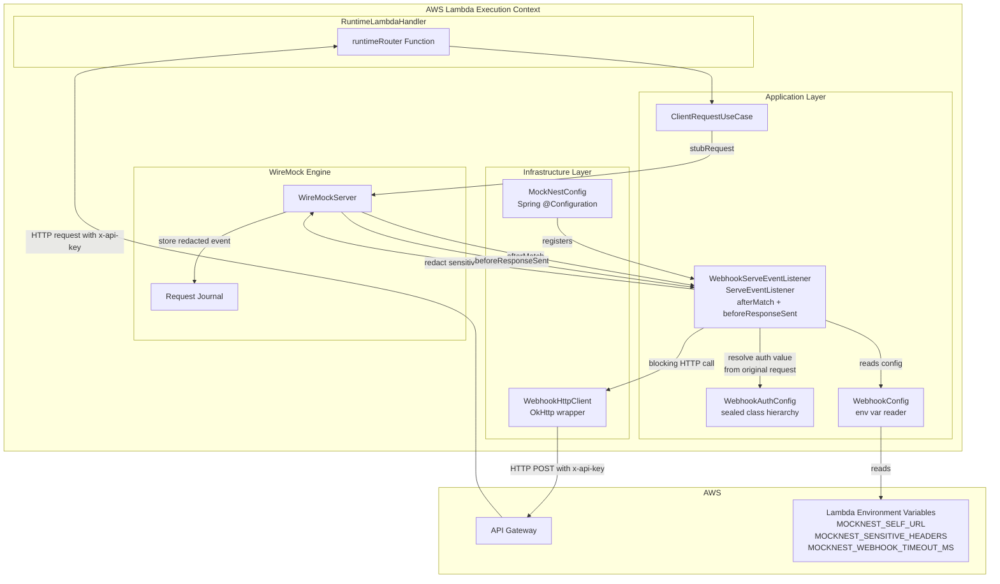
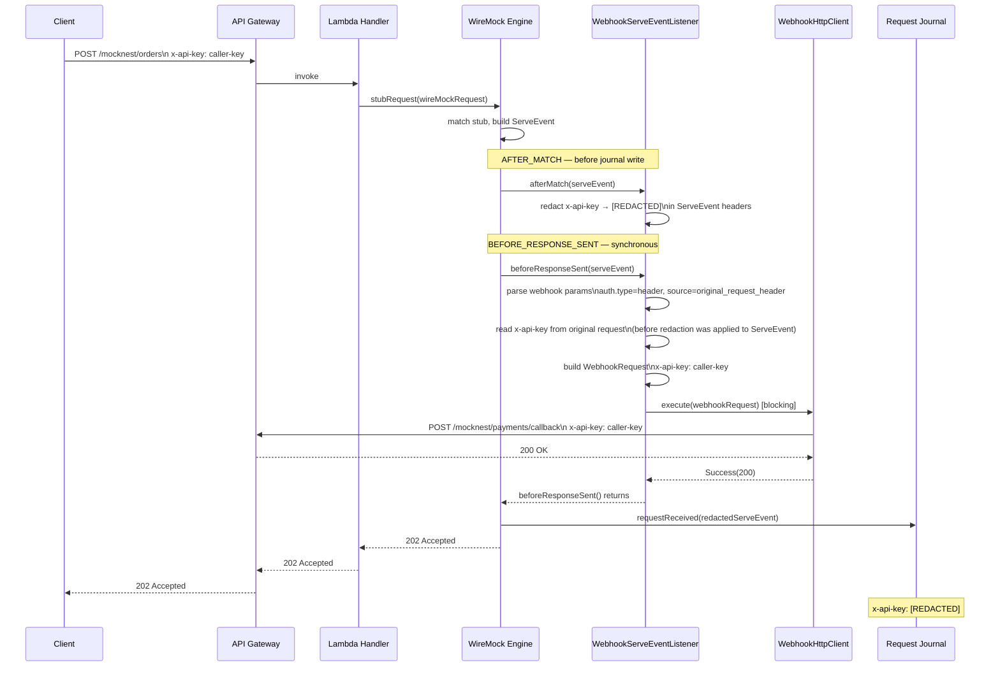

# Design Document: Webhook Support

## Overview

This document describes the technical design for adding reliable webhook/callback-style behavior to MockNest Serverless. A mock definition can trigger an outbound HTTP call (a webhook) after serving its response, using WireMock's `serveEventListeners` configuration model.

The central challenge is AWS Lambda's execution model: once the handler returns, the execution context may be frozen. WireMock's built-in webhook extension dispatches asynchronously via a `ScheduledExecutorService`, which means webhook calls will be silently dropped in Lambda. MockNest must intercept webhook dispatch and execute the HTTP call synchronously before the Lambda handler returns.

The design also covers a structured, extensible webhook authentication model (v1: `original_request_header` source), sensitive header redaction from the request journal, Handlebars-based webhook templating, local integration tests, and post-deploy pipeline validation.

---

## WireMock Extension Point Validation (3.13.2 Source)

### `AdminRequestFilterV2` cannot modify response bodies
`AdminRequestFilterV2` extends `RequestFilterV2`, whose `filter()` method returns a `RequestFilterAction` (`continueWith` or `stopWith`). There is no mechanism to intercept or modify response bodies. Request interception only.

### `WebhookTransformer` does not suppress async dispatch
From `Webhooks.java`: `WebhookTransformer.transform()` is called synchronously, but `scheduler.schedule(...)` always fires afterward. A transformer cannot prevent the async dispatch — it would cause duplicate HTTP calls.

### Correct approach: `ServeEventListener` phases

From `StubRequestHandler.java`, the call order is:
1. `BEFORE_MATCH` — before stub matching
2. `AFTER_MATCH` — after stub matched ← **redact sensitive headers here** (before journal write)
3. `beforeResponseSent()` → `requestJournal.requestReceived(serveEvent)` ← journal write
4. `BEFORE_RESPONSE_SENT` listeners ← **dispatch webhook here** (synchronous, before response sent)
5. Response sent to caller
6. `afterResponseSent()` → `AFTER_COMPLETE` listeners (where built-in async `Webhooks` runs)

`AFTER_MATCH` fires before journal storage, enabling redaction. `BEFORE_RESPONSE_SENT` fires synchronously before the response is returned, ensuring webhook completion before Lambda freezes.

---

## Key Design Decisions

| Decision | Choice | Rationale |
|---|---|---|
| WireMock extension point | `ServeEventListener` (`afterMatch` + `beforeResponseSent`) | Only approach that is synchronous, pre-journal, and pre-response |
| Webhook dispatch | Synchronous blocking OkHttp call in `beforeResponseSent()` | Completes before Lambda handler returns |
| HTTP client | OkHttp 5.3.2 (already in runtime module) | Consistent with existing pattern; no new dependency |
| Webhook auth model | Structured `type` + `inject` + `value.source` config | Separates injection point from value origin; extensible without breaking changes |
| v1 auth type | `header` — injects a named header into the outbound request | Covers the primary same-instance use case |
| v1 value source | `original_request_header` — copies a header from the incoming trigger request | Simple, no external dependencies, no secrets needed for v1 |
| Future value sources | `static`, `secret_ref`, `env_var` — documented, not implemented | Same `Header` type, different `HeaderValueSource` variant |
| Future auth type | `aws_iam` — documented as roadmap, not implemented | Peer of `Header` in the sealed class; no breaking change to add |
| Sensitive header redaction | Mutate `ServeEvent` headers in `afterMatch()` before journal storage | Only reliable approach given journal write timing |
| Self-URL | `MOCKNEST_SELF_URL` environment variable | Simple, explicit; set via SAM `!Sub` |
| Webhook timeout | `MOCKNEST_WEBHOOK_TIMEOUT_MS` env var, default 10000ms | Configurable; accounts for API Gateway round-trip |
| Redaction marker | `[REDACTED]` | Clear, unambiguous, non-revealing |
| Local integration test | Real `WireMockServer` with a real port | `DirectCallHttpServer` bypasses HTTP stack; OkHttp needs a real listener |

---

## Webhook Authentication Model

### Design Principle

The auth config separates two independent concerns:
- **where** auth is injected into the outbound request (`auth.type`)
- **where** the auth value comes from at dispatch time (`auth.value.source`)

This means new value sources can be added without changing the injection mechanism, and new auth types (e.g. `aws_iam`) can be added as peers without affecting existing `header` configs.

### Auth Types

| `auth.type` | Description | v1 Status |
|---|---|---|
| `header` | Injects a named header into the outbound webhook request | **Implemented** |
| `aws_iam` | SigV4 signing for Lambda URLs or IAM-protected API Gateway endpoints | Future roadmap — not implemented in v1 |

### Value Sources (for `auth.type = "header"`)

| `auth.value.source` | Description | v1 Status |
|---|---|---|
| `original_request_header` | Copies a named header value from the incoming trigger request | **Implemented** |
| `static` | A fixed value specified directly in the mapping | Future roadmap |
| `secret_ref` | Resolved at dispatch time from a secure secret backend (e.g. AWS Secrets Manager) | Future roadmap |
| `env_var` | Read from a Lambda environment variable at dispatch time | Future roadmap |

### Mapping Configuration Shape

The `auth` block is a top-level field within the webhook `parameters` object:

```json
{
  "serveEventListeners": [
    {
      "name": "webhook",
      "parameters": {
        "method": "POST",
        "url": "{{mocknest-self-url}}/mocknest/payments/callback",
        "body": "{\"orderId\": \"{{jsonPath originalRequest.body '$.orderId'}}\"}",
        "auth": {
          "type": "header",
          "inject": {
            "name": "x-api-key"
          },
          "value": {
            "source": "original_request_header",
            "headerName": "x-api-key"
          }
        }
      }
    }
  ]
}
```

This copies the `x-api-key` header from the incoming trigger request and injects it as `x-api-key` on the outbound webhook call. For same-instance callbacks, the caller's API key is valid for both the trigger and callback endpoints.

**No auth example:**
```json
"auth": { "type": "none" }
```
Or omit the `auth` block entirely — defaults to no auth.

**Future `static` example** (not implemented in v1):
```json
"auth": {
  "type": "header",
  "inject": { "name": "x-api-key" },
  "value": { "source": "static", "value": "fixed-key" }
}
```

**Future `secret_ref` example** (not implemented in v1):
```json
"auth": {
  "type": "header",
  "inject": { "name": "x-api-key" },
  "value": { "source": "secret_ref", "secretRef": "mocknest/webhook-api-key" }
}
```

**Future `aws_iam` example** (not implemented in v1):
```json
"auth": {
  "type": "aws_iam",
  "region": "eu-west-1"
}
```

### `{{mocknest-self-url}}` Placeholder

`{{mocknest-self-url}}` is a MockNest-specific placeholder resolved by `WebhookServeEventListener` from `WebhookConfig.selfUrl` before the HTTP call. It is not processed by WireMock's template engine. This allows the webhook URL to reference the deployed instance's own base URL without hardcoding it in the mapping.

---

## Architecture

### Component Diagram



### Data Flow: Webhook Dispatch with `original_request_header` Auth



> **Implementation note on redaction timing:** `afterMatch()` redacts the `ServeEvent` headers before journal storage. The `original_request_header` value source must read the header value from the original `Request` object (available on the `ServeEvent` before redaction mutates it), not from the already-redacted `LoggedRequest`. The implementation must preserve the original header value for auth resolution before applying redaction to the stored copy.

---

## Components and Interfaces

### Application Layer (`software/application/`)

#### `WebhookAuthConfig` (data model)
**Package:** `nl.vintik.mocknest.application.runtime.extensions`

Parsed from the `auth` block in webhook parameters. The sealed class hierarchy separates auth type from value source.

```kotlin
sealed class WebhookAuthConfig {
    // No auth — omit auth block or set type: none
    object None : WebhookAuthConfig()

    // Inject a header — v1 implemented type
    data class Header(
        val injectName: String,
        val valueSource: HeaderValueSource,
    ) : WebhookAuthConfig()

    // Future: SigV4 signing
    // data class AwsIam(val region: String? = null) : WebhookAuthConfig()
}

sealed class HeaderValueSource {
    // v1: copy from incoming trigger request
    data class OriginalRequestHeader(val headerName: String) : HeaderValueSource()

    // Future value sources — not implemented in v1:
    // data class Static(val value: String) : HeaderValueSource()
    // data class SecretRef(val secretRef: String) : HeaderValueSource()
    // data class EnvVar(val envVar: String) : HeaderValueSource()
}
```

#### `WebhookServeEventListener`
**Package:** `nl.vintik.mocknest.application.runtime.extensions`
**Implements:** `com.github.tomakehurst.wiremock.extension.ServeEventListener`
**Registered name:** `"webhook"` (replaces built-in async dispatcher)

Single extension handling both redaction and synchronous dispatch.

**`afterMatch(serveEvent, parameters)`:**
- Capture the original `Request` object from `serveEvent` before any mutation (needed for `OriginalRequestHeader` value source)
- Iterate over all request headers in `serveEvent.getRequest()`
- For each header whose name (lowercased) is in `WebhookConfig.sensitiveHeaders`, replace its value(s) with `[REDACTED]`
- Catch all exceptions: log at `ERROR`, do not rethrow

**`beforeResponseSent(serveEvent, parameters)`:**
- Check if the matched stub has `serveEventListeners` with name `"webhook"`; if not, return immediately
- Extract webhook parameters (url, method, body, auth block)
- Resolve `{{mocknest-self-url}}` placeholder in URL from `WebhookConfig.selfUrl`
- Parse `WebhookAuthConfig` from the `auth` block (default: `None` if absent)
- Build outbound headers based on auth config:
  - `None`: no auth headers added
  - `Header(injectName, OriginalRequestHeader(headerName))`: read `headerName` from the original (pre-redaction) request, inject as `injectName` in the outbound request — never log the value
- Build `WebhookRequest` with `WebhookConfig.webhookTimeoutMs`
- Call `webhookHttpClient.send(request)` — blocking
- On `WebhookResult.Failure`: log at `WARN` with URL and status code only — never log header values — never rethrow
- Catch all exceptions: log at `WARN`, never rethrow

**`getName()`:** returns `"webhook"`
**`applyGlobally()`:** returns `true`

```kotlin
interface WebhookHttpClientInterface {
    fun send(request: WebhookRequest): WebhookResult
}

data class WebhookRequest(
    val url: String,
    val method: String,
    val headers: Map<String, String>,
    val body: String?,
    val timeoutMs: Long,
)

sealed class WebhookResult {
    data class Success(val statusCode: Int) : WebhookResult()
    data class Failure(val statusCode: Int?, val message: String) : WebhookResult()
}
```

#### `WebhookConfig`
**Package:** `nl.vintik.mocknest.application.runtime.config`

| Environment Variable | Default | Description |
|---|---|---|
| `MOCKNEST_SELF_URL` | (none) | The deployed API Gateway base URL |
| `MOCKNEST_SENSITIVE_HEADERS` | `x-api-key,authorization` | Comma-separated sensitive header names (case-insensitive) |
| `MOCKNEST_WEBHOOK_TIMEOUT_MS` | `10000` | Outbound webhook HTTP call timeout in milliseconds |

```kotlin
data class WebhookConfig(
    val selfUrl: String?,
    val sensitiveHeaders: Set<String>,
    val webhookTimeoutMs: Long,
)
```

### Infrastructure Layer (`software/infra/aws/runtime/`)

#### `WebhookHttpClient`
**Package:** `nl.vintik.mocknest.infra.aws.runtime.webhook`
**Implements:** `WebhookHttpClientInterface`

OkHttp-based synchronous HTTP client. Uses `OkHttpClient.newCall(request).execute()` (blocking). Spring singleton bean.

#### `MockNestConfig` (updated)

```kotlin
.extensions(
    NormalizeMappingBodyFilter(storage),
    DeleteAllMappingsAndFilesFilter(storage),
    WebhookServeEventListener(webhookHttpClient, webhookConfig),  // NEW — replaces built-in "webhook"
)
```

---

## Correctness Properties

### Property 1: Webhook Delivery Before Handler Returns

*For any* mock with a valid `serveEventListeners` webhook configuration, when that mock is matched and a response is served, the outbound webhook HTTP call SHALL complete (succeed or fail with a logged error) before the Lambda handler function returns its response to the caller.

**Validates: Requirements 1.1, 7.1**

### Property 2: Failure Isolation

*For any* mock response paired with a webhook that fails (non-2xx, network error, or timeout), the HTTP response returned to the original caller SHALL be identical to the response that would be returned if no webhook were configured.

**Validates: Requirements 1.3, 7.3**

### Property 3: Template Rendering Fidelity

*For any* triggering HTTP request, and for any webhook definition containing Handlebars template expressions referencing `originalRequest` fields, the rendered values in the outbound webhook SHALL match the corresponding field values from the triggering request.

**Validates: Requirements 2.1, 2.2, 2.3, 2.4**

### Property 4: Auth Header Injection from Original Request

*For any* webhook configured with `auth.type = "header"` and `auth.value.source = "original_request_header"`, the outbound webhook request SHALL contain the header named by `auth.inject.name` with the value of the header named by `auth.value.headerName` from the incoming trigger request, and that value SHALL NOT appear in any log line or journal entry.

**Validates: Requirements 3.4, 3.8, 5.1, 6.1**

### Property 5: Redaction Completeness

*For any* HTTP request containing a header whose name matches a configured sensitive header name (case-insensitive), the value of that header in the WireMock request journal and in `/__admin/requests` responses SHALL be `[REDACTED]`.

**Validates: Requirements 4.1, 4.2, 4.3, 4.4, 6.2**

### Property 6: Sensitive Value Non-Exposure in Logs

*For any* sensitive header value passing through MockNest code, that value SHALL NOT appear in any log line emitted by MockNest at any log level.

**Validates: Requirements 3.8, 4.5, 6.1**

---

## Error Handling

### Webhook Dispatch Failures
`WebhookServeEventListener.beforeResponseSent()` catches all exceptions and logs at `WARN` with URL and status code. Header values must not appear in log output. Never rethrows.

### Webhook Timeout
OkHttp `callTimeout(webhookTimeoutMs, MILLISECONDS)`. Timeout throws `SocketTimeoutException`, caught and logged at `WARN`. Original response unaffected.

**Recommended minimum Lambda timeout when webhooks are used:** 30 seconds (accounts for original request processing ~1s, webhook round-trip through API Gateway ~5–15s, buffer ~10s).

### Template Rendering Failures
WireMock's template engine substitutes empty string for unresolvable expressions. `WebhookServeEventListener` proceeds with partially-rendered values.

### Missing `MOCKNEST_SELF_URL`
If `MOCKNEST_SELF_URL` is not set and a webhook URL contains `{{mocknest-self-url}}`, the placeholder is replaced with an empty string, resulting in an invalid URL. Dispatch fails and is logged at `WARN`. Configuration error documented in `USAGE.md`.

### Redaction Failures
If header mutation in `afterMatch()` throws, the exception is caught, logged at `ERROR`, and the original (unredacted) headers remain. The implementation must be robust and well-tested to minimize this risk.

---

## Testing Strategy

### Prototype First (Task 1)

Before implementing the full solution, a small prototype must validate:

1. **`AFTER_MATCH` timing vs journal write:** Confirm that mutating `ServeEvent` request headers in `afterMatch()` results in the redacted values being stored in the journal.
2. **Name collision with built-in `Webhooks`:** Confirm that registering a `ServeEventListener` named `"webhook"` replaces the built-in `Webhooks` extension and prevents the async dispatch.
3. **`beforeResponseSent` webhook parameters:** Confirm that `serveEvent` in `beforeResponseSent()` contains the `serveEventListeners` parameters from the matched stub mapping.
4. **Original request access before redaction:** Confirm that the original `Request` object (with unredacted headers) is accessible in `beforeResponseSent()` after `afterMatch()` has mutated the `ServeEvent`.

### Local Integration Test

Uses a `WireMockServer` started on a real port (not `DirectCallHttpServer`). No AWS credentials required.

**Test scenario 1 — Webhook delivery with `original_request_header` auth:**
1. Start `WireMockServer` on a random port with `WebhookServeEventListener` registered
2. Register callback mock: `POST /mocknest/payments/callback` → 200 OK
3. Register trigger mock: `POST /mocknest/orders` → 202 Accepted, with `serveEventListeners` webhook targeting `http://localhost:{port}/mocknest/payments/callback`, with `auth: { type: header, inject: { name: x-api-key }, value: { source: original_request_header, headerName: x-api-key } }`
4. Call trigger mock via real HTTP with `x-api-key: test-key-value`
5. Assert trigger response is 202 Accepted
6. Query `/__admin/requests` — no polling needed (webhook is synchronous)
7. Assert callback mock received a request
8. Assert `x-api-key` header in the callback journal entry is `[REDACTED]` (not `test-key-value`)

**Test scenario 2 — Sensitive header redaction on direct inbound requests:**
1. Send a request to any mock with `x-api-key: test-key-value`
2. Query `/__admin/requests`
3. Assert `x-api-key` value is `[REDACTED]`

### Post-Deploy Pipeline Validation

**Verification approach:** `/__admin/requests` polling after synchronous webhook completion. Retry loop (max 10s, 1s interval) handles Lambda cold starts on the callback invocation.

**Known limitation:** If the webhook callback is handled by a different Lambda invocation due to concurrency, the callback's journal entry will be in that invocation's in-memory journal. In practice, for same-instance calls with low concurrency (typical in test scenarios), the same Lambda instance handles both.

**Test flow:**
1. Retrieve API key via `aws apigateway get-api-key` and mask immediately: `echo "::add-mask::$API_KEY"`
2. Register callback mock: `POST /mocknest/webhook-callback` → 200 OK
3. Register trigger mock: `POST /mocknest/webhook-trigger` → 202 Accepted, with `serveEventListeners` webhook targeting `$API_URL/mocknest/webhook-callback`, with `auth: { type: header, inject: { name: x-api-key }, value: { source: original_request_header, headerName: x-api-key } }`
4. Call trigger: `POST $API_URL/mocknest/webhook-trigger` with `x-api-key: $API_KEY` — the trigger endpoint requires the API key to satisfy API Gateway auth; the webhook auth config copies this same key to the outbound callback call
5. Poll `GET $API_URL/__admin/requests` (max 10s, 1s interval) to find a request matching `/mocknest/webhook-callback`
6. Assert callback request found; fail with descriptive error if timeout exceeded
7. Assert `x-api-key` header value in the callback journal entry is `[REDACTED]`
8. Clean up: `DELETE $API_URL/__admin/mappings`

---

## SAM Template Changes

### New Environment Variables (both `MockNestRuntimeFunction` and `MockNestRuntimeFunctionIam`)

```yaml
Environment:
  Variables:
    # ... existing variables ...
    MOCKNEST_SELF_URL: !Sub
      - "https://${ApiId}.execute-api.${AWS::Region}.amazonaws.com/${DeploymentName}"
      - ApiId: !If [IsIamMode, !Ref MockNestIamModeApi, !Ref MockNestApiKeyModeApi]
    MOCKNEST_SENSITIVE_HEADERS: "x-api-key,authorization"
    MOCKNEST_WEBHOOK_TIMEOUT_MS: "10000"
```

No new IAM permissions are required for v1. The `original_request_header` value source reads from the incoming request — no external backend calls.
