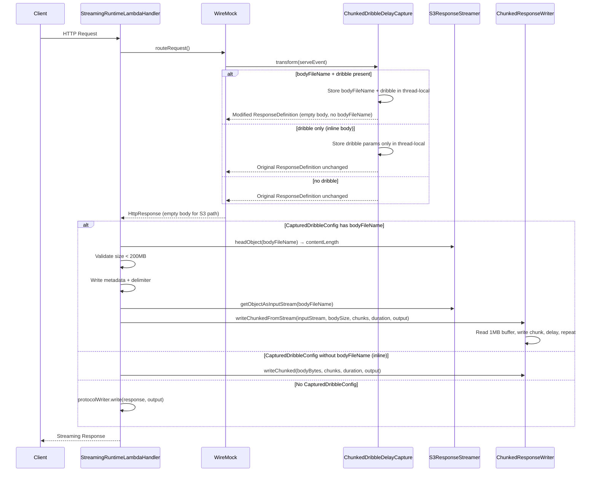
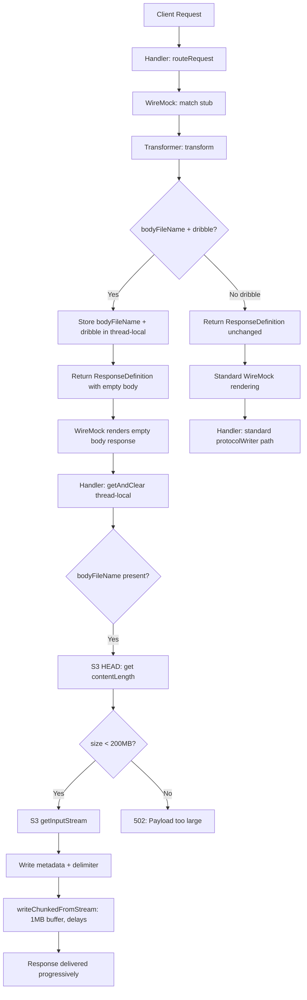
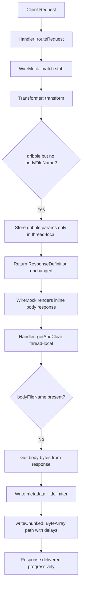

# Design Document: Zero-Memory Streaming

## Overview

This feature eliminates full body materialization when `chunkedDribbleDelay` is configured on a persistent mock whose response body has been externalized to S3. Currently, the handler loads the entire S3 file into memory as a `String`, converts it to a `ByteArray`, and then chunks it — consuming ~2× the payload size in heap. 

The zero-memory streaming optimization introduces a new path where:
1. The `ChunkedDribbleDelayCapture` transformer intercepts the `bodyFileName` before WireMock renders the response body
2. The transformer returns a modified `ResponseDefinition` with the `bodyFileName` removed (preventing WireMock from loading the S3 file)
3. The handler detects the captured `bodyFileName` and streams directly from S3 using bounded 1MB chunks with inter-chunk delays

This keeps peak memory usage constant (~1MB) regardless of payload size, enabling chunked dribble delivery of payloads up to 200MB without memory pressure.

## Architecture

### Design Decision: Intercepting Before WireMock Renders

The key architectural decision is to intercept the `bodyFileName` in the `ResponseDefinitionTransformerV2` (which runs before WireMock resolves the body) and return a modified `ResponseDefinition` without the `bodyFileName`. This prevents WireMock from loading the S3 file into memory via its standard body resolution path.

**Why `ResponseDefinitionBuilder.like()`**: WireMock's `ResponseDefinitionBuilder.like(responseDefinition)` creates a builder pre-populated with all fields from an existing `ResponseDefinition`. We then call `.withBody("")` (which clears `bodyFileName` internally since body and bodyFileName are mutually exclusive in WireMock) to produce a new `ResponseDefinition` that WireMock will render with an empty body. The handler then ignores this empty body and streams from S3 instead.

**Why not modify the response after WireMock renders**: If we let WireMock resolve the `bodyFileName`, it would load the entire file into memory — exactly what we're trying to avoid.

### Design Decision: S3 HEAD Request for Size Validation

Before streaming begins, the handler issues an S3 `HeadObject` request to get the `contentLength`. This allows the 200MB size check to happen without loading any body content, failing fast for oversized payloads.

### Design Decision: Expanding CapturedDribbleConfig

Rather than introducing a separate thread-local or side channel, we expand the existing `CapturedDribbleConfig` data class to include an optional `bodyFileName`. This keeps the communication between transformer and handler simple and contained in a single thread-local.

### High-Level Flow



## Components and Interfaces

### Modified `CapturedDribbleConfig`

Expanded to include an optional `bodyFileName` field:

```kotlin
data class CapturedDribbleConfig(
    val numberOfChunks: Int,
    val totalDurationMs: Long,
    val bodyFileName: String? = null,
)
```

**Location**: `software/application/src/main/kotlin/nl/vintik/mocknest/application/runtime/extensions/ChunkedDribbleDelayCapture.kt`

### Modified `ChunkedDribbleDelayCapture` Transformer

The transformer gains new logic to detect `bodyFileName` + `chunkedDribbleDelay` combinations:

```kotlin
class ChunkedDribbleDelayCapture : ResponseDefinitionTransformerV2 {

    override fun transform(serveEvent: ServeEvent): ResponseDefinition {
        val responseDefinition = serveEvent.responseDefinition
            ?: run {
                capturedConfig.remove()
                return ResponseDefinition.notConfigured()
            }

        val chunkedDribbleDelay = responseDefinition.chunkedDribbleDelay

        if (chunkedDribbleDelay != null) {
            val numberOfChunks = chunkedDribbleDelay.numberOfChunks
            val totalDuration = chunkedDribbleDelay.totalDuration.toLong()

            if (numberOfChunks >= 2 && totalDuration >= 0) {
                val bodyFileName = responseDefinition.bodyFileName

                if (bodyFileName != null) {
                    // S3 streaming path: capture bodyFileName and return modified response
                    logger.debug { "Captured chunkedDribbleDelay with bodyFileName: $bodyFileName" }
                    capturedConfig.set(
                        CapturedDribbleConfig(numberOfChunks, totalDuration, bodyFileName)
                    )
                    // Return a ResponseDefinition without bodyFileName to prevent WireMock from loading S3
                    return ResponseDefinitionBuilder.like(responseDefinition)
                        .withBody("")
                        .build()
                } else {
                    // Inline body path: existing behavior
                    logger.debug { "Captured chunkedDribbleDelay: numberOfChunks=$numberOfChunks, totalDuration=$totalDuration" }
                    capturedConfig.set(CapturedDribbleConfig(numberOfChunks, totalDuration))
                }
            } else {
                capturedConfig.remove()
            }
        } else {
            capturedConfig.remove()
        }

        return responseDefinition
    }
}
```

**Key change**: When both `bodyFileName` and valid `chunkedDribbleDelay` are present, the transformer:
1. Stores the `bodyFileName` in `CapturedDribbleConfig`
2. Returns `ResponseDefinitionBuilder.like(responseDefinition).withBody("").build()` — this creates a new `ResponseDefinition` that preserves status, headers, etc. but has an empty body and no `bodyFileName`

### Expanded `ChunkedResponseWriter`

New `InputStream`-based method added alongside the existing `ByteArray`-based method:

```kotlin
class ChunkedResponseWriter {

    companion object {
        private const val IDLE_TIMEOUT_WARNING_THRESHOLD_MS = 270_000L
        const val STREAM_BUFFER_SIZE = 1024 * 1024 // 1MB
    }

    /**
     * Existing method: writes body from a ByteArray in chunks with delays.
     */
    suspend fun writeChunked(body: ByteArray, numberOfChunks: Int, totalDurationMs: Long, output: OutputStream) {
        // ... existing implementation unchanged ...
    }

    /**
     * New method: streams from an InputStream in bounded chunks with delays.
     * Reads at most STREAM_BUFFER_SIZE (1MB) at a time, writes to output,
     * then delays before the next read.
     *
     * @param input The InputStream to read from (e.g., S3 object stream)
     * @param bodySize Total size of the body in bytes (from S3 HEAD)
     * @param numberOfChunks Number of chunks to deliver
     * @param totalDurationMs Total delay distributed between chunks
     * @param output The OutputStream to write chunks to
     */
    suspend fun writeChunkedFromStream(
        input: InputStream,
        bodySize: Long,
        numberOfChunks: Int,
        totalDurationMs: Long,
        output: OutputStream,
    ) {
        if (totalDurationMs > IDLE_TIMEOUT_WARNING_THRESHOLD_MS) {
            logger.warn {
                "Chunked dribble delay totalDuration ${totalDurationMs}ms exceeds ${IDLE_TIMEOUT_WARNING_THRESHOLD_MS}ms. " +
                    "This may exceed the 5-minute streaming idle timeout."
            }
        }

        val chunkSize = calculateStreamChunkSize(bodySize, numberOfChunks)
        val delayBetweenChunks = totalDurationMs / numberOfChunks
        val buffer = ByteArray(minOf(chunkSize.toInt(), STREAM_BUFFER_SIZE))

        var totalBytesWritten = 0L
        var chunkIndex = 0

        while (totalBytesWritten < bodySize) {
            if (chunkIndex > 0 && delayBetweenChunks > 0) {
                delay(delayBetweenChunks)
            }

            // Read up to one chunk's worth of data (bounded by buffer size)
            var chunkBytesWritten = 0L
            val targetChunkBytes = chunkSize

            while (chunkBytesWritten < targetChunkBytes) {
                val toRead = minOf(
                    buffer.size.toLong(),
                    targetChunkBytes - chunkBytesWritten,
                    bodySize - totalBytesWritten
                ).toInt()
                if (toRead <= 0) break

                val bytesRead = input.read(buffer, 0, toRead)
                if (bytesRead == -1) break

                output.write(buffer, 0, bytesRead)
                chunkBytesWritten += bytesRead
                totalBytesWritten += bytesRead
            }
            output.flush()
            chunkIndex++
        }
    }

    /**
     * Calculates the target chunk size for stream-based chunking.
     */
    internal fun calculateStreamChunkSize(bodySize: Long, numberOfChunks: Int): Long {
        if (bodySize == 0L || numberOfChunks <= 0) return 0L
        return (bodySize + numberOfChunks - 1) / numberOfChunks // ceiling division
    }
}
```

**Location**: `software/infra/aws/runtime/src/main/kotlin/nl/vintik/mocknest/infra/aws/runtime/streaming/ChunkedResponseWriter.kt`

### Expanded `S3ResponseStreamer`

New methods for getting content length and streaming with a consumer callback:

```kotlin
class S3ResponseStreamer(
    private val s3Client: S3Client,
    private val bucketName: String,
) {

    companion object {
        const val BUFFER_SIZE = 1024 * 1024
    }

    /**
     * Existing method: streams S3 content directly to an OutputStream.
     */
    fun streamToOutput(s3Key: String, output: OutputStream): Boolean { /* ... */ }

    /**
     * Gets the content length of an S3 object without downloading it.
     * Uses HeadObject to retrieve metadata only.
     *
     * @param s3Key The S3 object key
     * @return Content length in bytes, or null if the object doesn't exist or an error occurs
     */
    suspend fun getContentLength(s3Key: String): Long? =
        runCatching {
            s3Client.headObject(HeadObjectRequest {
                bucket = bucketName
                key = s3Key
            }).contentLength
        }.onFailure { exception ->
            logger.error(exception) {
                "Failed to get content length for S3 object: key=$s3Key, bucket=$bucketName"
            }
        }.getOrNull()

    /**
     * Streams S3 object content through a consumer callback, keeping the getObject
     * lifecycle contained within this method. The consumer receives the InputStream
     * and content length, and must consume the stream before returning.
     *
     * This design avoids returning an InputStream that would be invalid outside
     * the Kotlin AWS SDK's getObject callback scope.
     *
     * @param s3Key The S3 object key
     * @param consumer Callback that receives the InputStream and content length.
     *                 Must consume the stream before returning.
     * @return true if streaming completed successfully, false on error
     */
    suspend fun streamWithConsumer(
        s3Key: String,
        consumer: suspend (inputStream: InputStream, contentLength: Long) -> Unit,
    ): Boolean =
        runCatching {
            s3Client.getObject(GetObjectRequest {
                bucket = bucketName
                key = s3Key
            }) { response ->
                val body = response.body
                    ?: throw S3StreamingException("S3 object body is null for key: $s3Key")
                val contentLength = response.contentLength ?: 0L
                val inputStream = body.toInputStream()
                consumer(inputStream, contentLength)
            }
            true
        }.onFailure { exception ->
            logger.error(exception) {
                "Failed to stream S3 object with consumer: key=$s3Key, bucket=$bucketName"
            }
        }.getOrDefault(false)
}
```

**Design Decision: Consumer Callback Pattern**

The Kotlin AWS SDK's `getObject` lambda scope means the response body InputStream is only valid inside the callback. Returning it from a method would result in a closed/invalid stream. Instead, `S3ResponseStreamer` owns the `getObject` lifecycle and invokes a consumer callback with the InputStream. The consumer (the handler/writer) reads from the stream within the callback scope, ensuring the stream is valid throughout.

This means the `ChunkedResponseWriter.writeChunkedFromStream` is called from within the S3 callback — the handler passes the output stream and dribble config, and the writer reads from S3 and writes to output with delays, all within the callback scope.

**Location**: `software/infra/aws/runtime/src/main/kotlin/nl/vintik/mocknest/infra/aws/runtime/streaming/S3ResponseStreamer.kt`

### Modified `StreamingRuntimeLambdaHandler`

The handler gains a new branch for S3 streaming with dribble:

```kotlin
class StreamingRuntimeLambdaHandler : RequestStreamHandler, KoinComponent {

    // ... existing fields ...
    private val s3ResponseStreamer: S3ResponseStreamer by inject()

    override fun handleRequest(input: InputStream, output: OutputStream, context: Context) {
        val httpRequest = parseRequest(input, output) ?: return
        val path = httpRequest.path

        ChunkedDribbleDelayCapture.clear()
        val response = routeRequest(path, httpRequest)

        // For client requests, check if chunkedDribbleDelay was captured
        if (path.startsWith(MOCKNEST_PREFIX)) {
            val dribbleConfig = ChunkedDribbleDelayCapture.getAndClear()
            if (dribbleConfig != null) {
                if (dribbleConfig.bodyFileName != null) {
                    // NEW: S3 streaming path with chunked dribble
                    writeS3ChunkedResponse(response, dribbleConfig, output)
                    return
                }
                // Existing: in-memory chunked path
                val bodyBytes = response.body?.toByteArray(Charsets.UTF_8)
                if (bodyBytes != null && bodyBytes.isNotEmpty()) {
                    writeChunkedResponse(response, bodyBytes, dribbleConfig, output)
                    return
                }
            }
        }

        // Check response body size against 200MB limit (for non-S3 path)
        val bodyBytes = response.body?.toByteArray(Charsets.UTF_8)
        if (bodyBytes != null && bodyBytes.size > MAX_RESPONSE_SIZE_BYTES) {
            writeErrorResponse(output, 502, "Response payload exceeds the maximum supported streaming limit of 200MB")
            return
        }

        protocolWriter.write(response, output)
        output.flush()
    }

    /**
     * Streams response body from S3 with chunked dribble delays.
     * Uses S3 HEAD for size validation, then streams with bounded memory
     * via the consumer callback pattern (InputStream consumed within S3 callback scope).
     */
    private fun writeS3ChunkedResponse(
        response: HttpResponse,
        config: CapturedDribbleConfig,
        output: OutputStream,
    ) {
        val bodyFileName = config.bodyFileName ?: return
        val s3Key = "__files/$bodyFileName"

        runBlocking {
            // Size check via HEAD request
            val contentLength = s3ResponseStreamer.getContentLength(s3Key)
            if (contentLength == null) {
                writeErrorResponse(output, 502, "Failed to retrieve S3 object metadata: $bodyFileName")
                return@runBlocking
            }
            if (contentLength > MAX_RESPONSE_SIZE_BYTES) {
                writeErrorResponse(output, 502, "Response payload exceeds the maximum supported streaming limit of 200MB")
                return@runBlocking
            }

            // Write metadata + delimiter before streaming body
            val headers = response.headers
                ?.flatMap { (name, values) -> values.map { name to it } }
                ?.toMap()
                ?: emptyMap()
            protocolWriter.writeMetadataAndDelimiter(response.statusCode.value, headers, output)

            // Stream from S3 with chunked delays using consumer callback
            // The InputStream is only valid inside the S3 callback scope
            val success = s3ResponseStreamer.streamWithConsumer(s3Key) { inputStream, _ ->
                chunkedWriter.writeChunkedFromStream(
                    input = inputStream,
                    bodySize = contentLength,
                    numberOfChunks = config.numberOfChunks,
                    totalDurationMs = config.totalDurationMs,
                    output = output,
                )
            }

            if (!success) {
                logger.error { "S3 streaming with chunked dribble failed for key=$s3Key" }
                // Note: metadata+delimiter already written, can't change status code
                // Client will receive a truncated response
            }
            output.flush()
        }
    }
}
```

**Location**: `software/infra/aws/runtime/src/main/kotlin/nl/vintik/mocknest/infra/aws/runtime/function/StreamingRuntimeLambdaHandler.kt`

## Data Models

### `CapturedDribbleConfig` (Modified)

```kotlin
data class CapturedDribbleConfig(
    val numberOfChunks: Int,
    val totalDurationMs: Long,
    val bodyFileName: String? = null,  // NEW: optional S3 body file reference
)
```

### Data Flow: S3 Streaming with Dribble (New Path)



### Data Flow: Inline Body with Dribble (Existing Path — Unchanged)



### Memory Usage Comparison

| Scenario | Before (Current) | After (Zero-Memory) |
|----------|------------------|---------------------|
| 10MB body + dribble | ~20MB heap (String + ByteArray) | ~1MB heap (streaming buffer) |
| 50MB body + dribble | ~100MB heap | ~1MB heap |
| 200MB body + dribble | ~400MB heap (OOM likely) | ~1MB heap |
| Inline body + dribble | Body size × 2 | Body size × 2 (unchanged) |
| No dribble | Body loaded by WireMock | Body loaded by WireMock (unchanged) |

## Correctness Properties

*A property is a characteristic or behavior that should hold true across all valid executions of a system — essentially, a formal statement about what the system should do. Properties serve as the bridge between human-readable specifications and machine-verifiable correctness guarantees.*

### Property 1: Transformer captures bodyFileName and removes it from ResponseDefinition

*For any* response definition containing both a valid `bodyFileName` and a valid `chunkedDribbleDelay` (numberOfChunks >= 2, totalDuration >= 0), the transformer SHALL store the `bodyFileName` in the `CapturedDribbleConfig` thread-local AND return a `ResponseDefinition` where `bodyFileName` is null and body is empty.

**Validates: Requirements 1.1, 1.2**

### Property 2: Transformer preserves response unchanged for inline dribble mocks

*For any* response definition containing a valid `chunkedDribbleDelay` but no `bodyFileName`, the transformer SHALL return the original response definition unchanged AND store only `numberOfChunks` and `totalDurationMs` (with `bodyFileName` = null) in the thread-local.

**Validates: Requirements 1.3, 4.2**

### Property 3: Transformer is no-op when no dribble is configured

*For any* response definition that does not contain a `chunkedDribbleDelay`, the transformer SHALL return the response definition unchanged AND not store any configuration in the thread-local, regardless of whether `bodyFileName` is present.

**Validates: Requirements 1.4, 5.1**

### Property 4: Handler routes to S3 streaming when bodyFileName is present

*For any* `CapturedDribbleConfig` containing a non-null `bodyFileName`, the handler SHALL use the `S3ResponseStreamer` to stream the response body rather than using the in-memory body bytes, and SHALL write metadata+delimiter before the chunked body content.

**Validates: Requirements 2.1, 2.2**

### Property 5: Handler routes to ByteArray path when no bodyFileName

*For any* `CapturedDribbleConfig` with a null `bodyFileName` and non-empty response body bytes, the handler SHALL use the existing `ByteArray`-based `writeChunked` method and SHALL NOT attempt S3 streaming.

**Validates: Requirements 4.1, 4.3**

### Property 6: Bounded memory during InputStream-based streaming

*For any* input stream of size S (where S > 0), the `writeChunkedFromStream` method SHALL never hold more than 1MB (1,048,576 bytes) of response body content in memory at any time, regardless of the total body size or number of chunks configured.

**Validates: Requirements 3.1, 3.2, 3.3**

### Property 7: Streaming round-trip preserves body content byte-for-byte

*For any* body content stored in S3, streaming it through `writeChunkedFromStream` with any valid `numberOfChunks` and `totalDurationMs` SHALL produce output that matches the original content byte-for-byte when all chunks are concatenated.

**Validates: Requirements 7.2, 7.4**

### Property 8: Chunked delivery distributes bytes across configured number of chunks

*For any* body of size S > 0 and configured `numberOfChunks` N >= 2, the `writeChunkedFromStream` method SHALL deliver the body in at most N write-flush cycles, with each cycle writing approximately S/N bytes (±1 byte for remainder distribution).

**Validates: Requirements 7.3**

## Error Handling

| Error Condition | Detection | Response | Recovery |
|----------------|-----------|----------|----------|
| S3 HEAD fails (object not found, access denied) | `getContentLength()` returns null | 502 with error message | Log error, return immediately |
| S3 object exceeds 200MB | `contentLength > MAX_RESPONSE_SIZE_BYTES` | 502 with size limit message | Log error, return immediately |
| S3 GET InputStream fails | `getInputStream()` returns null | 502 with error message | Log error, return immediately |
| S3 stream read error mid-transfer | IOException during `input.read()` | Partial response (connection may be broken) | Log error, exception propagates |
| Invalid dribble config (chunks < 2 or duration < 0) | Validation in transformer | No config stored, standard path used | Graceful fallback to non-chunked |

### Error Handling Design Decisions

1. **Fail-fast on HEAD**: The S3 HEAD request validates both existence and size before any streaming begins. This avoids partial responses for oversized or missing files.
2. **502 for S3 failures**: All S3-related failures return 502 (Bad Gateway) since the mock server is acting as a gateway to S3 storage.
3. **Mid-stream failures**: If the S3 stream fails after metadata+delimiter have been written, the client receives a partial response. This is acceptable because HTTP streaming inherently has this limitation — the status code has already been sent.

## Testing Strategy

### Unit Tests

- **ChunkedDribbleDelayCapture transformer**: Test all four paths (bodyFileName+dribble, dribble-only, bodyFileName-only, neither)
- **ChunkedResponseWriter.writeChunkedFromStream**: Test bounded memory, correct output, chunk distribution
- **ChunkedResponseWriter.calculateStreamChunkSize**: Test edge cases (0 size, 1 chunk, more chunks than bytes)
- **StreamingRuntimeLambdaHandler**: Test S3 streaming path routing, error handling (502 responses), fallback to inline path
- **S3ResponseStreamer.getContentLength**: Test success and failure paths
- **S3ResponseStreamer.getInputStream**: Test success and failure paths

### Property-Based Tests

Property-based testing is appropriate for this feature because:
- The `ChunkedResponseWriter.writeChunkedFromStream` is a pure data transformation with clear input/output behavior
- The transformer logic has universal properties that hold across all valid inputs
- The input space (body sizes, chunk counts, durations) is large and continuous

**Library**: JUnit 6 `@ParameterizedTest` with diverse test data files and `@MethodSource` for generated inputs.

**Configuration**: Minimum 100 iterations per property test.

**Tag format**: `Feature: zero-memory-streaming, Property {number}: {property_text}`

Each correctness property (1-8) will be implemented as a property-based test:
- Properties 1-3: Transformer behavior with generated ResponseDefinitions
- Properties 4-5: Handler routing with generated CapturedDribbleConfigs
- Property 6: Memory bound verification with varying stream sizes (1KB to 50MB)
- Property 7: Round-trip data integrity with random body content
- Property 8: Chunk distribution with varying sizes and chunk counts

### Integration Tests

- **LocalStack S3 + Handler end-to-end**: Create persistent mock with bodyFileName, invoke via handler, verify complete body received
- **Varying sizes**: Test with <1MB, ~5MB, and ~50MB bodies
- **Timing verification**: Verify progressive delivery timing matches configured duration

### Post-Deploy Tests

- **Progressive delivery verification**: Create large mock, curl with `--no-buffer`, measure incremental arrival
- **Data integrity**: Verify complete body matches expected content
- **Timing assertion**: Fail if response arrives within first 10% of configured duration
