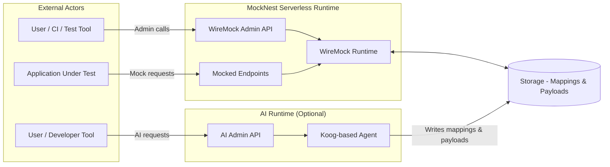
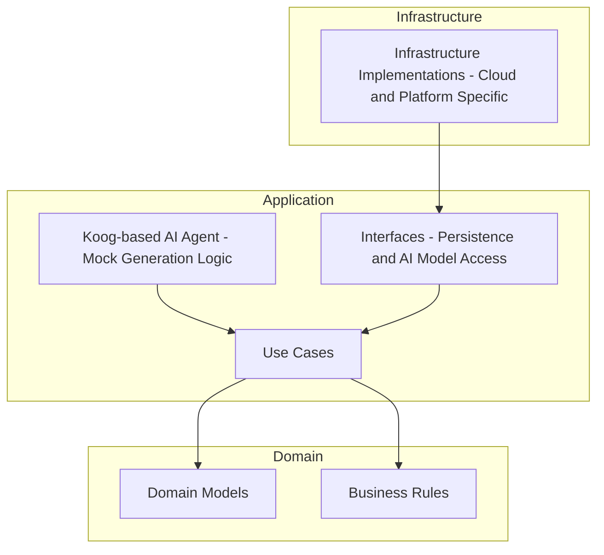

# Architecture

## System Architecture
MockNest Serverless consists of two main capabilities:

1) A serverless WireMock runtime that serves mocked HTTP endpoints and exposes the WireMock admin API.
2) A persistence layer that stores mock definitions and response payloads outside the runtime so they remain available across executions.

### AI agent and request/response flow
The AI-assisted mock generation is not part of the runtime request/response path. It is accessed through dedicated AI admin endpoints (when AI is enabled during deployment):

- `POST /ai/generate-mappings` - Generate WireMock mappings from API specifications and natural language descriptions
- `POST /ai/bulk-generate` - Generate multiple mappings in batch
- `GET /ai/status` - Check generation status and health

The generated mappings and payloads are persisted to external storage, and the runtime serves them on subsequent requests.

### System Architecture Diagram

## Clean Architecture for Serverless
MockNest Serverless applies a simplified variant of clean architecture tailored for serverless workloads.
Clean-architecture style described in ["Keeping Business Logic Portable in Serverless Functions with Clean Architecture"](https://medium.com/nntech/keeping-business-logic-portable-in-serverless-functions-with-clean-architecture-bd1976276562) article to keep core behavior decoupled from infrastructure. 

The architecture is organised into three layers with strict dependency rules:

### Domain
- Contains domain models and business rules related to mocking behavior.

### Application
- Contains use cases and orchestration logic.
- Defines interfaces for external concerns such as persistence and AI model access.
- Implements the AI-assisted mock generation logic using a Koog-based agent.
- Coordinates mock generation and mock lifecycle without knowledge of cloud-specific implementations.

### Infrastructure
- Provides concrete implementations of interfaces defined in the application layer.
- Contains cloud- and platform-specific code, such as persistence implementations and function entry points.
- Is the only layer allowed to depend on cloud SDKs or platform-specific libraries.

Dependencies flow strictly inward: infrastructure depends on application, and application depends on domain, but never the other way around.

### Clean Architecture Diagram

## Technology Stack
- **Kotlin** - Primary development language chosen for:
  - **Concise, expressive syntax** - Reduces boilerplate and improves code maintainability
  - **Null safety** - Eliminates null pointer exceptions at compile time, improving reliability
  - **Multiplatform capabilities** - Can target JVM, Node JS, and Native 
  - **Coroutines** - Built-in support for asynchronous programming
- **Koog** (Kotlin-based AI agent framework) for implementing AI-assisted mock generation; Koog provides agent orchestration and integrates with external AI model providers (e.g., Amazon Bedrock)
- **Gradle** with **Kotlin DSL**
- **Java runtime** for AWS Lambda
- **WireMock** (as the underlying mocking engine)

## Data Architecture
- Mock definitions (WireMock mappings) are persisted in external storage (Amazon S3 in the AWS deployment).
- Response bodies (payloads) are stored in external storage and referenced in mock mapping to avoid inflating in-memory state.
- At startup, mappings may be loaded into memory to support request matching.

## API Design
- **WireMock Admin API** - Standard WireMock endpoints for managing mappings and inspecting requests
- **AI Admin API** (when enabled) - Separate endpoints for AI-assisted mock generation:
  - `POST /ai/generate-mappings` - Generate mappings from API specs and descriptions
  - `POST /ai/bulk-generate` - Batch generation of multiple mappings
  - `GET /ai/status` - Health check and generation status
- **Mocked Endpoints** - Standard HTTP routes serving the actual mocks
- Supports REST, SOAP, and GraphQL as HTTP-based APIs:
  - SOAP requests are handled as HTTP POST requests with XML payload matching
  - GraphQL is supported as GraphQL-over-HTTP, typically via POST requests with JSON payload matching

## Security Architecture
- Access to the MockNest Serverless service itself (both the mock admin API and mocked endpoints) is protected in the same way as any other API, with a default configuration using API key–based access control at the edge (e.g., AWS API Gateway).
- When mocked services normally require authentication flows (such as OAuth-style token acquisition), those identity endpoints can also be mocked. This allows the system under test to keep its authentication logic enabled and follow the usual token request flow, while the token endpoint returns predictable mock tokens for testing purposes.

## Scalability Considerations
- The runtime scales based on the serverless platform configuration of the deployed environment (e.g., AWS Lambda concurrency settings).
- Persisted mock definitions allow the runtime to be restarted or scaled horizontally without losing configured mocks.
- Cold-start time is influenced by the number and complexity of mappings loaded at startup. The solution is primarily optimized for typical integration-testing scenarios with a moderate number of mocks, rather than very large mock catalogs.
- Horizontal scaling is achieved by running multiple independent runtime instances that all load their configuration from shared external storage.

## Integration Points
- Storage integration for mappings and payloads (S3 in AWS).
- Serverless compute entry point (AWS Lambda in AWS).
- HTTP ingress (API Gateway in AWS).
- WireMock is used under the hood for matching and response serving.

## Deployment Architecture
Infrastructure-as-code packaging and deployment using AWS SAM.
- CI/CD via GitHub Actions.
- The goal is publication as an AWS Serverless Application Repository (SAR) application.