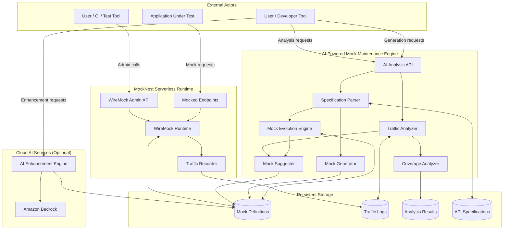
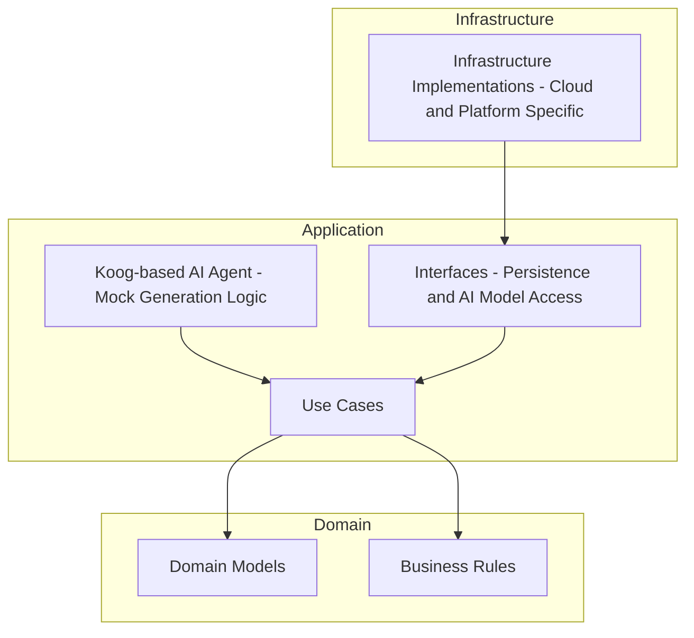

# Architecture

## System Architecture
MockNest Serverless consists of three main capabilities:

1) **AI-Powered Mock Intelligence**: A comprehensive mock maintenance engine that analyzes traffic patterns, generates mocks from API specifications, detects specification changes, and provides intelligent mock suggestions and optimization recommendations to keep mock suites current and comprehensive
2) **Core Mock Runtime**: A serverless WireMock runtime that serves mocked HTTP endpoints and exposes the WireMock admin API
3) **Persistent Storage**: Stores mock definitions, response payloads, traffic logs, and analysis results outside the runtime so they remain available across executions

### AI-Powered Mock Intelligence Flow
The AI intelligence system operates as a comprehensive mock maintenance engine through dedicated admin endpoints and on-demand analysis:

**Traffic Analysis Endpoints:**
- `POST /ai/analyze-traffic` - Analyze traffic for specified timeframe and generate mock suggestions
- `GET /ai/coverage-analysis` - Analyze contract coverage against API specifications
- `POST /ai/suggest-mocks` - Generate mock suggestions based on traffic gaps and near-misses
- `GET /ai/analysis-status` - Check analysis job status and retrieve results

**Mock Generation and Evolution Endpoints:**
- `POST /ai/generate-from-spec` - Generate comprehensive mock suites from API specifications
- `POST /ai/detect-spec-changes` - Compare API specification versions and identify changes
- `POST /ai/evolve-mocks` - Update existing mocks based on specification changes and traffic patterns
- `POST /ai/bulk-generate` - Generate multiple mocks in batch from specifications or descriptions

**AI-Assisted Enhancement Endpoints (when Bedrock enabled):**
- `POST /ai/generate-from-description` - Generate WireMock mappings from natural language descriptions
- `POST /ai/refine-mocks` - Enhance existing mocks with AI-powered improvements
- `POST /ai/enhance-responses` - Improve mock response realism using AI

**Mock Maintenance Operations:**
- All requests are recorded by WireMock's built-in logging (can be cleared via admin API)
- Traffic data and specification versions are stored in persistent storage for analysis
- Analysis and generation are triggered on-demand by users for specified timeframes or specifications
- Mock evolution combines traffic insights with specification changes for comprehensive updates

### Enhanced System Architecture Diagram



## Package Structure
MockNest Serverless uses `nl.vintik.mocknest` as the base package namespace, reflecting organizational ownership and supporting open source publication with correct Maven coordinates.

Code is organized by capability within each architectural layer to clearly separate the three major functional areas:
- **runtime** - Serverless WireMock runtime (mock serving, object storage, Lambda handlers)
  - `runtime.storage` - Runtime-specific S3 adapters for WireMock mappings and files
- **generation** - AI-assisted mock generation (mock generation, AI model services, specification parsing)
  - `generation.storage` - Generation-specific S3 adapters for API specifications
  - `generation.ai` - Generation-specific AI implementations (mock generation agents)
- **analysis** - AI-powered traffic analysis (traffic recording, analysis, pattern detection)
  - `analysis.storage` - Analysis-specific S3 adapters for traffic logs
  - `analysis.ai` - Analysis-specific AI implementations (traffic analysis agents)
- **core** - Shared code used across multiple capabilities (generic storage interfaces, HTTP models, foundational components)
  - `core.storage` - Shared S3 configuration and generic storage infrastructure
  - `core.ai` - Shared Bedrock configuration and generic AI service infrastructure

This capability-based organization makes it clear which code belongs to which functional area while maintaining clean architecture boundaries.

Example package structure:
```
nl.vintik.mocknest.domain.runtime
nl.vintik.mocknest.domain.generation
nl.vintik.mocknest.domain.analysis
nl.vintik.mocknest.domain.core

nl.vintik.mocknest.application.runtime
nl.vintik.mocknest.application.generation
nl.vintik.mocknest.application.analysis
nl.vintik.mocknest.application.core

nl.vintik.mocknest.infra.aws.runtime
nl.vintik.mocknest.infra.aws.runtime.storage
nl.vintik.mocknest.infra.aws.generation
nl.vintik.mocknest.infra.aws.generation.storage
nl.vintik.mocknest.infra.aws.generation.ai
nl.vintik.mocknest.infra.aws.analysis
nl.vintik.mocknest.infra.aws.analysis.storage
nl.vintik.mocknest.infra.aws.analysis.ai
nl.vintik.mocknest.infra.aws.core
nl.vintik.mocknest.infra.aws.core.storage
nl.vintik.mocknest.infra.aws.core.ai
```

## Clean Architecture for Serverless
MockNest Serverless applies a simplified variant of clean architecture tailored for serverless workloads.
Clean-architecture style described in ["Keeping Business Logic Portable in Serverless Functions with Clean Architecture"](https://medium.com/nntech/keeping-business-logic-portable-in-serverless-functions-with-clean-architecture-bd1976276562) article to keep core behavior decoupled from infrastructure. 

The architecture is organised into three layers with strict dependency rules:

### Domain
- Contains domain models and business rules related to mocking behavior.
- Organized by capability (runtime, generation, analysis, core) to clearly separate functional areas.

### Application
- Contains use cases and orchestration logic.
- Defines interfaces for external concerns such as persistence and AI model access.
- Implements the AI-assisted mock generation logic using a Koog-based agent.
- Coordinates mock generation and mock lifecycle without knowledge of cloud-specific implementations.
- Organized by capability (runtime, generation, analysis, core) to clearly separate functional areas.

### Infrastructure
- Provides concrete implementations of interfaces defined in the application layer.
- Contains cloud- and platform-specific code, such as persistence implementations and function entry points.
- Is the only layer allowed to depend on cloud SDKs or platform-specific libraries.
- Organized by capability (runtime, generation, analysis, core) to clearly separate functional areas.

Dependencies flow strictly inward: infrastructure depends on application, and application depends on domain, but never the other way around.

### Clean Architecture Diagram




## Technology Stack
- **Kotlin** - Primary development language chosen for:
  - **Concise, expressive syntax** - Reduces boilerplate and improves code maintainability
  - **Null safety** - Eliminates null pointer exceptions at compile time, improving reliability
  - **Multiplatform capabilities** - Can target JVM, Node JS, and Native 
  - **Coroutines** - Built-in support for asynchronous programming
- **Koog** (Kotlin-based AI agent framework) for implementing AI-assisted mock generation; Koog provides agent orchestration and integrates with external AI model providers (e.g., Amazon Bedrock)
- **Gradle with Kotlin DSL** - Build system chosen for:
  - **Kotlin consistency** - Build scripts in same language as application code
  - **Type safety** - IDE support and compile-time validation for build configuration
  - **AWS Lambda packaging** - Excellent support for creating Lambda deployment packages
  - **Dependency management** - Robust handling of Java/Kotlin ecosystem libraries
- **Java runtime** for AWS Lambda
- **WireMock** - Mocking engine selected for:
  - **Comprehensive feature set** - Supports all required mocking patterns (REST, SOAP, GraphQL, callbacks, proxying)
  - **Familiar API** - Well-known interface reduces learning curve for users
  - **Mature ecosystem** - Proven reliability and extensive community support
  - **Extensibility** - Clean architecture allows integration with custom persistence and AI components

## Data Architecture
- Mock definitions (WireMock mappings) are persisted in external storage (Amazon S3 in the AWS deployment).
- Response bodies (payloads) are stored in external storage and referenced in mock mapping to avoid inflating in-memory state.
- At startup, mappings may be loaded into memory to support request matching.


## API Design
- **WireMock Admin API** - Standard WireMock endpoints for managing mappings and inspecting requests
- **AI Admin API** (when enabled) - Separate endpoints for AI-assisted mock generation:
  - `POST /ai/generate-mappings` - Generate mappings from API specs and descriptions
  - `POST /ai/bulk-generate` - Batch generation of multiple mappings
  - `GET /ai/status` - Health check and generation status
- **Mocked Endpoints** - Standard HTTP routes serving the actual mocks
- Supports REST, SOAP, and GraphQL as HTTP-based APIs:
  - SOAP requests are handled as HTTP POST requests with XML payload matching
  - GraphQL is supported as GraphQL-over-HTTP, typically via POST requests with JSON payload matching


## Security Architecture
- Access to the MockNest Serverless service itself (both the mock admin API and mocked endpoints) is protected in the same way as any other API, with a default configuration using API key–based access control at the edge (e.g., AWS API Gateway).
- When mocked services normally require authentication flows (such as OAuth-style token acquisition), those identity endpoints can also be mocked. This allows the system under test to keep its authentication logic enabled and follow the usual token request flow, while the token endpoint returns predictable mock tokens for testing purposes.

## Scalability Considerations
- The runtime scales based on the serverless platform configuration of the deployed environment (e.g., AWS Lambda concurrency settings).
- Persisted mock definitions allow the runtime to be restarted or scaled horizontally without losing configured mocks.
- Cold-start time is influenced by the number and complexity of mappings loaded at startup. The solution is primarily optimized for typical integration-testing scenarios with a moderate number of mocks, rather than very large mock catalogs.
- Horizontal scaling is achieved by running multiple independent runtime instances that all load their configuration from shared external storage.

## Integration Points
- Storage integration for mappings and payloads (S3 in AWS).
- Serverless compute entry point (AWS Lambda in AWS).
- HTTP ingress (API Gateway in AWS).
- WireMock is used under the hood for matching and response serving.

## Deployment Architecture
Infrastructure-as-code packaging and deployment using AWS SAM.
- CI/CD via GitHub Actions.
- The goal is publication as an AWS Serverless Application Repository (SAR) application.