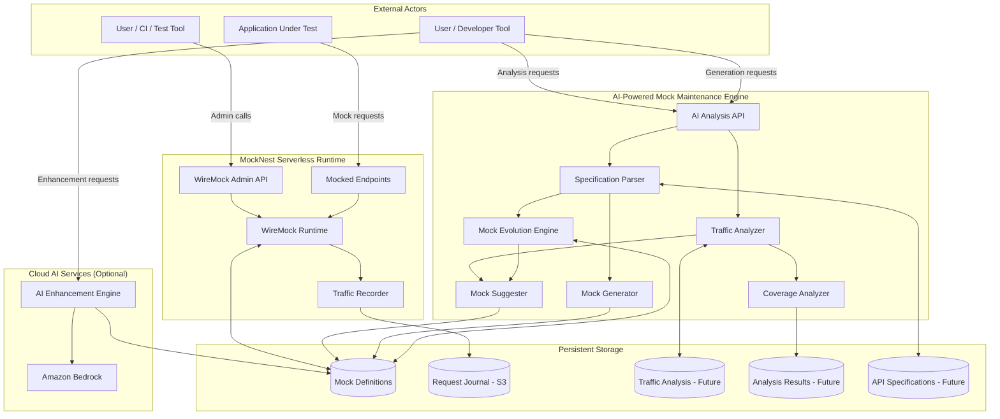
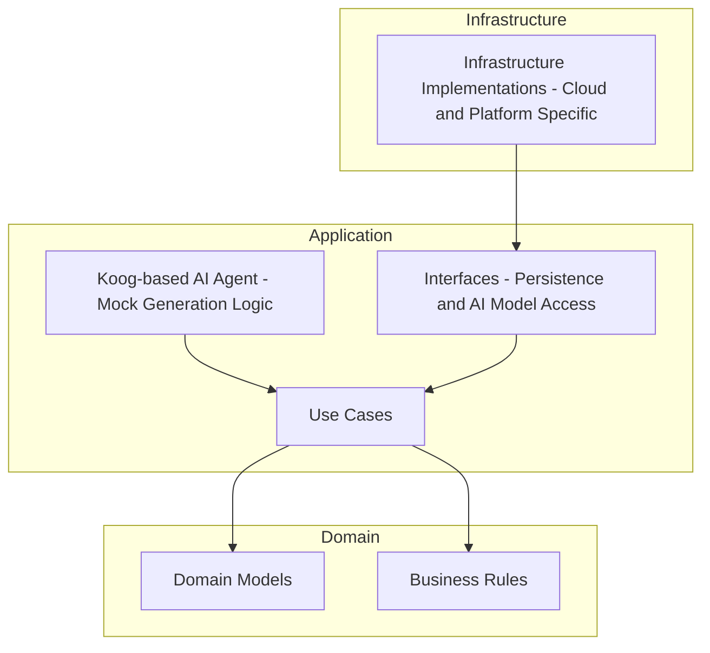
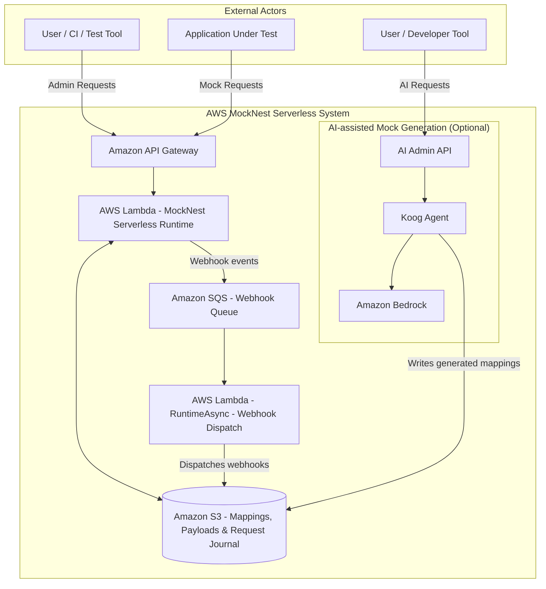

# System Architecture

MockNest Serverless consists of three main capabilities:

1) **AI-Powered Mock Intelligence**: A comprehensive mock maintenance engine that analyzes traffic patterns, generates mocks from API specifications, detects specification changes, and provides intelligent mock suggestions and optimization recommendations to keep mock suites current and comprehensive
2) **Core Mock Runtime**: A serverless WireMock runtime that serves mocked HTTP endpoints and exposes the WireMock admin API
3) **Persistent Storage**: Stores mock definitions, response payloads, and request journal entries outside the runtime so they remain available across executions (traffic analysis results storage planned for future phases)

## AI-Powered Mock Intelligence Flow
The AI intelligence system provides intelligent mock generation and maintenance through dedicated admin endpoints:

**Priority 1: Mock Generation from API Specifications**
- `POST /ai/generation/from-spec` - Generate WireMock mappings from API specifications with optional instructions
  - Supports OpenAPI/REST, SOAP (WSDL 1.2 only for AI generation), GraphQL schemas, MCP (Model Context Protocol), and SSE (Server-Sent Events)
  - Accepts specification file and optional generation instructions
  - Returns WireMock-compatible mapping JSON

**Priority 2: Mock Evolution for Updated Specifications**
- `POST /ai/generation/update-from-spec` - Update existing mocks when API specifications change
  - Compares new specification version against existing mocks
  - Identifies changes (new endpoints, modified schemas, removed operations)
  - Updates affected mocks while preserving custom configurations
  - Returns updated WireMock mappings

**Priority 3: Lenient Mock Mode (Auto-Generation on Demand)**
- `POST /ai/lenient/configure` - Configure lenient mock behavior with API specification and generation instructions
  - Stores specification and instructions for on-demand mock generation
  - Configures fallback behavior when no mock matches incoming requests
- `ANY /ai/lenient/mocknest/{path}` - Lenient request handling endpoint
  - Attempts to match existing mocks first
  - On no match: generates new mock based on stored specification and instructions
  - Saves generated mock to avoid repeated AI calls for same request pattern
  - Returns generated response immediately
  - Supports all HTTP methods and arbitrary paths under `/ai/lenient/mocknest/`

**Priority 4: Traffic Analysis (Future Enhancement)**
- `POST /ai/analyze-traffic` - Analyze traffic patterns and generate comprehensive coverage report
  - Identifies mock coverage gaps (e.g., only happy flows tested, missing error scenarios)
  - Detects unused mocks that are never invoked
  - Analyzes request patterns to suggest missing test scenarios
  - Returns detailed analysis report with recommendations
- All requests recorded by WireMock's built-in logging for analysis

## System Architecture Diagram



# Clean Architecture for Serverless

MockNest Serverless applies a simplified variant of clean architecture tailored for serverless workloads, following the clean-architecture style described in ["Keeping Business Logic Portable in Serverless Functions with Clean Architecture"](https://medium.com/nntech/keeping-business-logic-portable-in-serverless-functions-with-clean-architecture-bd1976276562) article to keep core behavior decoupled from infrastructure.

The architecture is organized into three layers with strict dependency rules:

## Domain Layer
- Contains domain models and business rules related to mocking behavior
- Organized by capability (runtime, generation, analysis, core) to clearly separate functional areas

## Application Layer
- Contains use cases and orchestration logic
- Defines interfaces for external concerns such as persistence and AI model access
- Implements the AI-assisted mock generation logic using a Koog-based agent
- Coordinates mock generation and mock lifecycle without knowledge of cloud-specific implementations
- Organized by capability (runtime, generation, analysis, core) to clearly separate functional areas

## Infrastructure Layer
- Provides concrete implementations of interfaces defined in the application layer
- Contains cloud- and platform-specific code, such as persistence implementations and function entry points
- Is the only layer allowed to depend on cloud SDKs or platform-specific libraries
- Organized by capability (runtime, generation, analysis, core) to clearly separate functional areas

Dependencies flow strictly inward: infrastructure depends on application, and application depends on domain, but never the other way around.

## Clean Architecture Diagram



# Package Structure

MockNest Serverless uses `nl.vintik.mocknest` as the base package namespace, reflecting organizational ownership and supporting open source publication with correct Maven coordinates.

Code is organized by capability within each architectural layer to clearly separate the three major functional areas:
- **runtime** - Serverless WireMock runtime (mock serving, object storage, Lambda handlers)
  - `runtime.storage` - Runtime-specific S3 adapters for WireMock mappings and files
- **generation** - AI-assisted mock generation (mock generation, AI model services, specification parsing)
  - `generation.storage` - Generation-specific S3 adapters for API specifications
  - `generation.ai` - Generation-specific AI implementations (mock generation agents)
- **analysis** - AI-powered traffic analysis (traffic recording, analysis, pattern detection)
  - `analysis.storage` - Analysis-specific S3 adapters for traffic logs
  - `analysis.ai` - Analysis-specific AI implementations (traffic analysis agents)
- **core** - Shared code used across multiple capabilities (generic storage interfaces, HTTP models, foundational components)
  - `core.storage` - Shared S3 configuration and generic storage infrastructure
  - `core.ai` - Shared Bedrock configuration and generic AI service infrastructure

This capability-based organization makes it clear which code belongs to which functional area while maintaining clean architecture boundaries.

## Package Structure by Layer

**Domain Layer** (`nl.vintik.mocknest.domain.*`):
- `domain.runtime` - Serverless WireMock runtime domain models
- `domain.generation` - AI-assisted mock generation domain models
- `domain.analysis` - AI-powered traffic analysis domain models (future)
- `domain.core` - Shared domain models (HTTP models, etc.)

**Application Layer** (`nl.vintik.mocknest.application.*`):
- `application.runtime` - WireMock runtime use cases and orchestration
- `application.generation` - Mock generation use cases and interfaces
- `application.analysis` - Traffic analysis use cases (future)
- `application.core` - Shared application logic and generic interfaces

**Infrastructure Layer** (`nl.vintik.mocknest.infra.aws.*`):
- `infra.aws.runtime` - Runtime AWS adapters (Lambda handlers, Koin modules)
- `infra.aws.runtime.storage` - Runtime-specific S3 adapters (mappings, files)
- `infra.aws.generation` - Generation AWS adapters
- `infra.aws.generation.storage` - Generation-specific S3 adapters (specs)
- `infra.aws.generation.ai` - Generation AI implementations (Amazon Nova Pro agents)
- `infra.aws.analysis` - Analysis AWS adapters (future)
- `infra.aws.core` - Shared AWS infrastructure
- `infra.aws.core.storage` - Shared S3 configuration
- `infra.aws.core.ai` - Shared Bedrock/Nova Pro configuration

## Package Organization Guidelines

When adding new code:
- Place capability-specific code in the appropriate capability package (`runtime`, `generation`, `analysis`)
- Place shared code used across multiple capabilities in `core` packages
- Maintain clean architecture boundaries: infra → application → domain
- Keep AWS-specific code in the infrastructure layer only
- Use sub-packages for storage and AI implementations within capabilities

## Example Package Structure

```
nl.vintik.mocknest.domain.runtime
nl.vintik.mocknest.domain.generation
nl.vintik.mocknest.domain.analysis
nl.vintik.mocknest.domain.core

nl.vintik.mocknest.application.runtime
nl.vintik.mocknest.application.generation
nl.vintik.mocknest.application.analysis
nl.vintik.mocknest.application.core

nl.vintik.mocknest.infra.aws.runtime
nl.vintik.mocknest.infra.aws.runtime.storage
nl.vintik.mocknest.infra.aws.generation
nl.vintik.mocknest.infra.aws.generation.storage
nl.vintik.mocknest.infra.aws.generation.ai
nl.vintik.mocknest.infra.aws.analysis
nl.vintik.mocknest.infra.aws.analysis.storage
nl.vintik.mocknest.infra.aws.analysis.ai
nl.vintik.mocknest.infra.aws.core
nl.vintik.mocknest.infra.aws.core.storage
nl.vintik.mocknest.infra.aws.core.ai
```

# Project Structure

The project structure follows clean architecture principles with clear separation between domain, application, and infrastructure layers:

```
mocknest-serverless/
│
├── build.gradle.kts     // Root build file
├── settings.gradle.kts  // Contains include statements for subprojects
│
├── .github/             // GitHub-specific configuration
│   └── workflows/       // GitHub Actions workflow definitions
│       ├── feature-aws.yml                  // Triggers AWS build and deployment for feature branches
│       ├── main-aws.yml                     // Triggers AWS build and deployment for main branch
│       ├── workflow-build.yml               // Reusable workflow for building and testing
│       └── workflow-deploy-aws.yml          // Reusable workflow for AWS Lambda deployment
│
├── docs/               // Documentation files
│   └── postman/                 // Postman collections and environments
│       ├── AWS MockNest Serverless.postman_collection.json    // Collection for all endpoints (generation + runtime)
│       └── Mock Nest AWS.postman_environment.json            // Environment variables
│
├── software/            // Holds all the business logic and application code
│   ├── domain/
│   │   ├── src/
│   │   └── build.gradle.kts
│   ├── application/
│   │   ├── src/
│   │   └── build.gradle.kts
│   └── infra/            // Infrastructure specific code
│       └── aws/          // AWS-specific code, including AWS Lambda
│           ├── core/             // Shared AWS infrastructure
│           ├── runtime/          // Runtime Lambda handler (includes RuntimeAsync webhook/callback dispatch via SQS)
│           ├── generation/       // Generation Lambda handler
│           └── mocknest/         // MockNest WireMock integration
│
└── deployment/           // Cloud deployment configurations
    └── aws/              // AWS-specific deployment
        ├── sam/              // SAM deployment method
        │   ├── template.yaml         // SAM template for infrastructure as code
        │   └── samconfig.toml       // SAM configuration for different environments
        └── shared/           // Shared deployment utilities
```

# Technology Stack

- **Kotlin** - Primary development language chosen for:
  - **Concise, expressive syntax** - Reduces boilerplate and improves code maintainability
  - **Null safety** - Eliminates null pointer exceptions at compile time, improving reliability
  - **Multiplatform capabilities** - Can target JVM, Node JS, and Native 
  - **Coroutines** - Built-in support for asynchronous programming

- **Koog** (Kotlin-based AI agent framework) for implementing AI-assisted mock generation; Koog provides agent orchestration and integrates with external AI model providers (e.g., Amazon Bedrock with Amazon Nova Pro as the default model)

- **Gradle with Kotlin DSL** - Build system chosen for:
  - **Kotlin consistency** - Build scripts in same language as application code
  - **Type safety** - IDE support and compile-time validation for build configuration
  - **AWS Lambda packaging** - Excellent support for creating Lambda deployment packages
  - **Dependency management** - Robust handling of Java/Kotlin ecosystem libraries

- **Java runtime** for AWS Lambda

- **Koin** - Lightweight Kotlin-native dependency injection framework:
  - **Kotlin DSL** - Module definitions use idiomatic Kotlin, no annotation processing
  - **Minimal footprint** - ~1 MB, no reflection-heavy startup
  - **Lambda-friendly** - Idempotent startup via `KoinBootstrap`, compatible with SnapStart
  - **Test utilities** - `verify()`, `koinApplication { }` for isolated module testing

- **WireMock** - Mocking engine selected for:
  - **Comprehensive feature set** - Supports all required mocking patterns (REST, SOAP, GraphQL, callbacks, proxying)
  - **Familiar API** - Well-known interface reduces learning curve for users
  - **Mature ecosystem** - Proven reliability and extensive community support
  - **Extensibility** - Clean architecture allows integration with custom persistence and AI components

# Data Architecture

- Mock definitions (WireMock mappings) are persisted in external storage (Amazon S3 in the AWS deployment)
- Response bodies (payloads) are stored in external storage and referenced in mock mapping to avoid inflating in-memory state
- At startup, mappings may be loaded into memory to support request matching

# API Design

- **WireMock Admin API** - Standard WireMock endpoints for managing mappings and inspecting requests
- **AI Admin API** (when enabled) - Separate endpoints for AI-assisted mock generation:
  - Priority 1: `POST /ai/generation/from-spec` - Generate mappings from API specifications with optional instructions
  - Priority 2: `POST /ai/generation/update-from-spec` - Update existing mocks when specifications change
  - Priority 3: `POST /ai/lenient/configure` and `ANY /ai/lenient/mocknest/{path}` - Lenient mock mode with auto-generation
  - Priority 4: `POST /ai/analyze-traffic` - Traffic analysis and coverage reporting (future)
- **Mocked Endpoints** - Standard HTTP routes serving the actual mocks
- Supports REST, SOAP, and GraphQL as HTTP-based APIs:
  - SOAP requests are handled as HTTP POST requests with XML payload matching
  - GraphQL is supported as GraphQL-over-HTTP, typically via POST requests with JSON payload matching

# Security Architecture

- Access to the MockNest Serverless service itself (both the mock admin API and mocked endpoints) is protected at the edge (e.g., AWS API Gateway) with a configurable authentication mode: API key (default) or AWS IAM SigV4
- When mocked services normally require authentication flows (such as OAuth-style token acquisition), those identity endpoints can also be mocked. This allows the system under test to keep its authentication logic enabled and follow the usual token request flow, while the token endpoint returns predictable mock tokens for testing purposes

# Scalability Considerations

- The runtime scales based on the serverless platform configuration of the deployed environment (e.g., AWS Lambda concurrency settings)
- Persisted mock definitions allow the runtime to be restarted or scaled horizontally without losing configured mocks
- Cold-start time is influenced by the number and complexity of mappings loaded at startup. The solution is primarily optimized for typical integration-testing scenarios with a moderate number of mocks, rather than very large mock catalogs
- Horizontal scaling is achieved by running multiple independent runtime instances that all load their configuration from shared external storage

# Integration Points

- Storage integration for mappings and payloads (S3 in AWS)
- Serverless compute entry point (AWS Lambda in AWS)
- HTTP ingress (API Gateway in AWS)
- WireMock is used under the hood for matching and response serving

# Deployment Architecture

Infrastructure-as-code packaging and deployment using AWS SAM:
- CI/CD via GitHub Actions
- Published as an [AWS Serverless Application Repository (SAR) application](https://serverlessrepo.aws.amazon.com/applications/eu-west-1/021259937026/MockNest-Serverless)

# AWS Services

## AWS Architecture Overview



## Core Services

MockNest Serverless core runtime is built around these essential AWS services:

- **AWS Lambda** - Serverless compute runtime for the WireMock engine
- **Amazon API Gateway** - HTTP ingress and access control for both admin API and mocked endpoints (API key or IAM SigV4, configurable via AuthMode parameter)
- **Amazon S3** - Persistent storage for WireMock mappings, response payloads, and request journal (always deployed)
- **Amazon SQS** - Asynchronous webhook/callback dispatch queue, consumed by the RuntimeAsync Lambda

When AI features are enabled, additional services are used:
- **Amazon Bedrock** - AI model access for the Koog-based mock generation agent (using Amazon Nova Pro as the officially supported model)

## Compute Services

- **AWS Lambda** (Java runtime) - Hosts the WireMock runtime and handles all HTTP requests
  - Cold start optimization is critical due to mapping loading at startup
  - Concurrency settings control horizontal scaling
  - Memory allocation impacts performance with large mock sets
- **AWS Lambda - RuntimeAsync** - Handles asynchronous webhook/callback dispatch from SQS
  - Triggered by SQS messages when mocks include webhook/callback definitions
  - Supports AWS IAM SigV4 signing on outbound webhook requests

## Messaging Services

- **Amazon SQS** - Asynchronous message queue for webhook/callback dispatch
  - Runtime Lambda enqueues webhook events; RuntimeAsync Lambda processes them
  - Visibility timeout derived from webhook timeout configuration (per AWS best practice)

## Storage Services

- **Amazon S3** - Primary storage for all persistent data
  - Mock definitions (WireMock mappings) stored as JSON files
  - Response payloads stored separately to reduce memory usage
  - Request journal entries stored under `requests/` prefix with configurable retention
  - Bucket organization supports efficient loading and caching strategies

## AI/ML Services

- **Amazon Bedrock** - Provides access to foundation models such as Amazon Nova Pro for AI-assisted mock generation
  - Integrated through the Koog framework
  - Used for generating WireMock mappings from API specifications and natural language input
  - Operates outside the request/response path to avoid runtime latency

## Networking Services

- **Amazon API Gateway** - HTTP ingress and request routing
  - Handles both admin API calls and mocked endpoint requests
  - Provides authentication via API key or IAM SigV4 (configurable), plus rate limiting
  - Integrates with Lambda for serverless request processing

## Security Services

- **AWS IAM** - Service-to-service authentication and authorization
  - Lambda execution roles for S3 and Bedrock access
  - API Gateway integration roles
- **API Gateway Authentication** - Configurable access control for MockNest Serverless endpoints (API key mode by default, IAM SigV4 as alternative)
- **AWS Secrets Manager** (future) - Secure storage for API keys and configuration

## Monitoring & Logging

- **Amazon CloudWatch** - Logging and basic metrics
  - Lambda function logs for debugging and monitoring
  - API Gateway access logs and metrics
  - Custom metrics for mock usage patterns (future enhancement)
- **AWS X-Ray** (optional) - Distributed tracing for performance analysis

## Deployment & CI/CD

- **AWS SAM** - Infrastructure-as-code and deployment packaging
  - Supports conditional deployment parameters for AI features
  - Default deployment excludes AI components (Free Tier compliant)
  - Users can opt-in to AI generation during SAR deployment
- **AWS Serverless Application Repository (SAR)** - [Published application](https://serverlessrepo.aws.amazon.com/applications/eu-west-1/021259937026/MockNest-Serverless) for one-click deployment
- **AWS CloudFormation** - Underlying infrastructure provisioning (via SAM)

## Cost Optimization

- **Free Tier Alignment** - Architecture designed to operate within AWS Free Tier limits
  - Lambda: 1M requests/month, 400,000 GB-seconds compute
  - API Gateway: 1M API calls/month
  - S3: 5GB storage, 20,000 GET requests, 2,000 PUT requests
  - Bedrock: Pay-per-use model for AI generation (no free tier, costs separate from runtime)
- **Efficient Resource Usage**
  - Response payloads stored in S3 to minimize Lambda memory usage
  - All mappings loaded at startup (on-demand loading is a future optimization)
  - Horizontal scaling only when needed

## Service Limits & Quotas

Key AWS limits that may impact MockNest Serverless:

**Lambda Limits:**
- 15-minute maximum execution time (not typically relevant for HTTP APIs)
- 10GB maximum memory allocation
- 1000 concurrent executions (default, can be increased)
- 6MB request/response payload size limit

**API Gateway Limits:**
- 10MB maximum payload size
- 30-second timeout for Lambda integration
- 10,000 requests per second (default, can be increased)

**S3 Limits:**
- No practical limits for MockNest Serverless use cases
- 5GB maximum object size (sufficient for response payloads)

**Bedrock Limits:**
- Model-specific rate limits and quotas
- Regional availability varies by model

## Regional Considerations

- **Primary Regions**: eu-west-1 (Ireland), eu-central-1 (Frankfurt) - closest regions to development team
- **Bedrock Availability**: Ensure chosen region supports required foundation models
- **Multi-region Support**: Not in scope for Phase 1, but architecture supports future expansion
