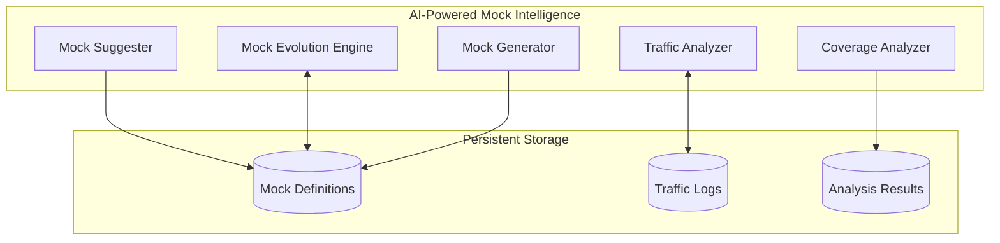

# MockNest Serverless - Competition Submission

## Project Overview

**MockNest Serverless** is an intelligent, AWS-native serverless mock runtime that revolutionizes API testing by combining traditional mocking capabilities with AI-powered mock intelligence. It addresses the critical challenge of testing cloud-native applications that depend on external APIs in environments where those APIs are unavailable, unstable, or difficult to control.

### The Problem We Solve

Modern cloud-native and serverless applications frequently rely on multiple external services, creating significant testing challenges:

- **Availability Issues**: External APIs may not be reachable from development or test environments
- **Mock Maintenance Burden**: As third-party APIs evolve, teams struggle to keep mocks synchronized with changing contracts
- **Coverage Gaps**: Mock coverage gaps are invisible until production issues occur
- **Infrastructure Overhead**: Container-based solutions are incompatible with serverless-first architectures

### Our Solution

MockNest Serverless provides the first **intelligent mocking platform** that proactively maintains API test coverage through:

1. **Serverless WireMock Runtime**: Complete WireMock server running on AWS Lambda with persistent storage
2. **AI-Powered Mock Intelligence**: Traffic analysis, coverage gap detection, and automated mock evolution
3. **AWS-Native Deployment**: One-click deployment via AWS Serverless Application Repository (SAR)

## Unique Value Proposition

MockNest Serverless offers a combination of capabilities that no existing solution matches:

### 🚀 **AI-Assisted + Open Source + Serverless Runtime**
The only solution combining AI mock generation, open source transparency, and true serverless execution.

### 🔒 **AWS-Native with No Internet Dependency**
Runs entirely within customer AWS accounts without requiring external network access, perfect for regulated environments.

### 🎯 **Intelligent Mock Evolution**
Unlike static mock servers, MockNest proactively analyzes traffic patterns to identify gaps and suggest improvements, solving the critical problem of mock maintenance that existing solutions ignore.

### 💰 **Predictable Costs**
Infrastructure costs in customer account vs. unpredictable SaaS subscription fees, designed to operate within AWS Free Tier limits.

## Technical Innovation

### Architecture Excellence

MockNest follows **clean architecture principles** with strict separation between:
- **Domain Layer**: Business models and rules
- **Application Layer**: Use cases and WireMock orchestration  
- **Infrastructure Layer**: AWS-specific implementations

This ensures portability, testability, and maintainability while keeping the core business logic cloud-agnostic.

### AI-Powered Intelligence Engine

Our AI system operates as a comprehensive mock maintenance engine:

### Technology Stack

- **Kotlin 2.3.0**: Modern, concise language with excellent null safety and coroutines
- **Spring Boot 4.0**: Latest enterprise framework for robust application development
- **WireMock**: Industry-standard mocking engine with comprehensive feature set
- **AWS Lambda + API Gateway + S3**: Serverless architecture for scalability and cost efficiency
- **Amazon Bedrock**: Optional AI enhancement for advanced mock generation

## Market Impact

### Competitive Landscape

| Feature | MockNest Serverless | WireMock Cloud | Mockoon Cloud | Postman Mock |
|---------|-------------------|----------------|---------------|--------------|
| **Deployment Model** | AWS account (SAR) | Vendor SaaS | Vendor SaaS | Vendor SaaS |
| **Serverless Runtime** | ✅ Yes | ❌ No | ❌ No | ❌ No |
| **AI Assistance** | ✅ Yes | ✅ Yes | ✅ Yes | ⚠️ Limited |
| **Open Source** | ✅ Yes | ❌ No | ❌ No | ❌ No |
| **No Internet Dependency** | ✅ Yes | ❌ No | ❌ No | ❌ No |
| **Persistent State** | ✅ Yes | ✅ Yes | ✅ Yes | ❌ No |

### Target Market

- **Organizations adopting serverless architectures on AWS**
- **Teams practicing integration testing in cloud environments**  
- **Developers in regulated or restricted environments**
- **Platform teams seeking alternatives to vendor-hosted solutions**

## Implementation Status

### Phase 1: Serverless WireMock Runtime ✅
- Complete WireMock server running on AWS Lambda
- Persistent storage in Amazon S3 with efficient memory usage
- Support for REST, SOAP, and GraphQL protocols
- Comprehensive test coverage (90%+ target)
- SAM template for infrastructure-as-code deployment

### Phase 2: AI Traffic Analysis 🚧
- Traffic recording and analysis capabilities
- Mock coverage gap detection
- Intelligent mock suggestions based on usage patterns
- On-demand analysis for specified timeframes

### Phase 3: AI Mock Generation 📋
- Mock generation from API specifications (OpenAPI, GraphQL, WSDL)
- Natural language mock descriptions
- Automated mock evolution with specification changes
- Batch generation capabilities

## Development Excellence

### Quality Assurance
- **90% code coverage** target across all modules using Kover
- **Property-based testing** for comprehensive correctness validation
- **Integration testing** with TestContainers and LocalStack
- **Clean architecture** with strict dependency rules

### DevOps & Deployment
- **GitHub Actions** CI/CD pipeline
- **Multi-instance deployment** strategy for team isolation
- **Infrastructure-as-code** using AWS SAM
- **Automated testing** and deployment validation

### Documentation & Knowledge Management
- Comprehensive **steering documents** capturing architectural decisions
- **Spec-driven development** with requirements, design, and task planning
- **API documentation** with Postman collections
- **Contribution guidelines** for open source collaboration

## Business Model & Sustainability

### Open Source Approach
- **Free and open source** - no direct monetization
- **Community-driven** development and improvement
- **AWS Serverless Application Repository** distribution
- **Users pay only for AWS resources** they consume

### Success Metrics
- **Quantitative**: SAR deployments, GitHub stars/forks, community engagement
- **Qualitative**: Developer satisfaction, real-world use case validation
- **Technical**: Performance benchmarks, coverage metrics, reliability indicators

## Future Vision

### Advanced AI Capabilities
- **Predictive Mock Management**: Anticipate API changes before issues occur
- **Cross-Service Pattern Recognition**: Identify patterns across multiple API integrations
- **Performance Insights**: Analyze traffic for timeout and retry scenarios

### Expanding Platform Support
- **MCP (Model Context Protocol) Mocking**: First serverless solution for AI agent testing
- **Multi-Cloud Deployment**: Extend beyond AWS while maintaining intelligence
- **Advanced Protocol Support**: Emerging protocols and interaction patterns

## Why MockNest Deserves Recognition

### Innovation Impact
MockNest represents a **paradigm shift** from static mock servers to intelligent mock management platforms, solving the critical problem of mock maintenance that has plagued development teams for years.

### Technical Excellence
The combination of clean architecture, comprehensive testing, AI integration, and serverless deployment demonstrates exceptional engineering practices and forward-thinking design.

### Open Source Contribution
By providing a free, open-source alternative to expensive SaaS platforms, MockNest democratizes access to advanced mocking capabilities while contributing valuable infrastructure to the developer community.

### Real-World Value
MockNest addresses genuine pain points experienced by development teams worldwide, providing immediate value while establishing a foundation for the future of intelligent testing infrastructure.

---

**MockNest Serverless** - *Intelligent mocking for the serverless era*

**Repository**: [GitHub Link]  
**Documentation**: [Architecture Docs](.kiro/steering/)  
**Deployment**: AWS Serverless Application Repository (Coming Soon)