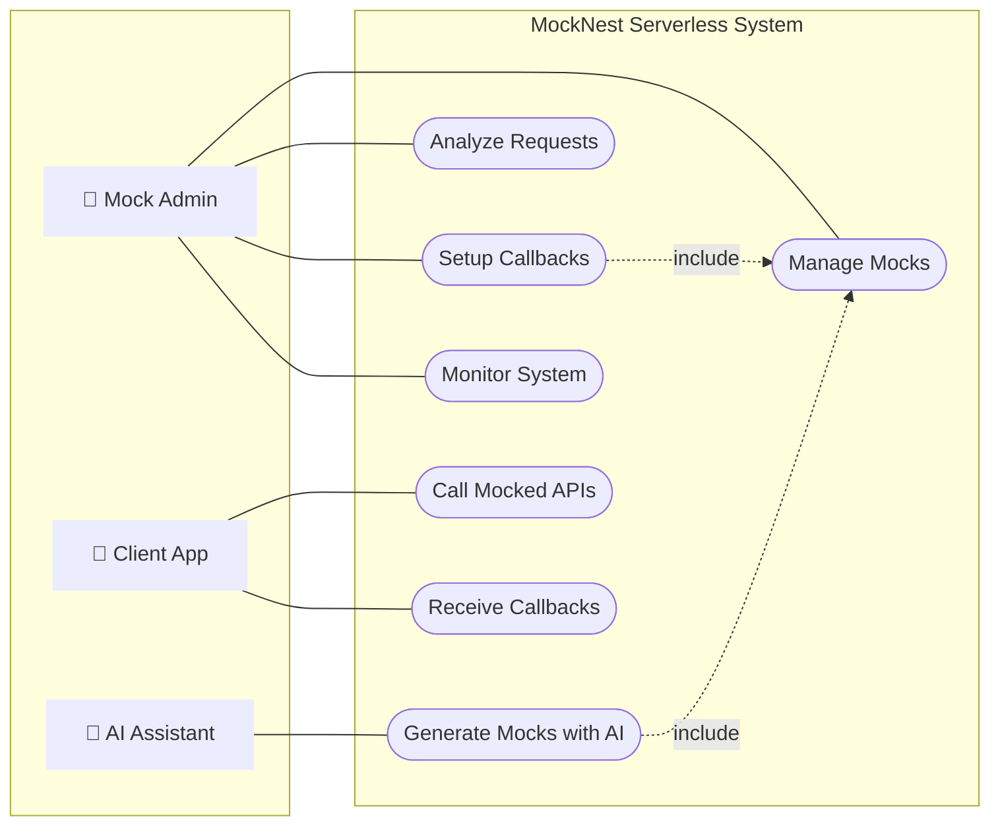

# MockNest Serverless

MockNest Serverless is an AWS-native serverless mock runtime that enables realistic integration testing without relying on live external services. Built with clean architecture principles, it provides persistent mock definitions across AWS Lambda cold starts using Amazon S3.

## Use Cases



## Solution Architecture

For detailed AWS architecture and service descriptions, see our [AWS Services Documentation](.kiro/steering/03-aws-services.md#aws-architecture-overview).

## Clean Architecture

This project follows clean architecture principles with clear separation between domain, application, and infrastructure layers. For detailed architecture explanation and diagrams, see our [Architecture Documentation](.kiro/steering/02-architecture.md#clean-architecture-for-serverless).

## Project Structure

The project structure follows clean architecture principles as outlined in our documentation. For the complete project structure, see our [Project Structure Documentation](.kiro/steering/05-kiro-usage.md#project-structure).

# Using the Mock (cURL quickstart)

The mock server exposes the WireMock Admin API under the `__admin` path and your mocked endpoints under their own paths.

Below are copy-paste-ready cURL examples for the most common scenarios, followed by links to the Postman collections with many more examples.

Prerequisites:
- Set base URL and API key as environment variables for AWS deployment.

AWS API Gateway:
- Both admin and client calls are protected with an API key
```bash
export AWS_URL="https://<api-id>.execute-api.<region>.amazonaws.com/prod"
export API_KEY="<your-api-key>"
```

Notes:
- The complete Admin API is documented here: [wiremock-admin-api.json](software/application/src/main/resources/wiremock-admin-api.json)
- This app normalizes mapping bodies on save: when you POST/PUT `/__admin/mappings` with `persistent: true` and an inline `body`/`base64Body`, the response body is stored in storage and the mapping is rewritten to use `bodyFileName` automatically.

## 1) Reset all mappings
```bash
curl -i -X POST "$AWS_URL/__admin/mappings/reset" \
  -H "x-api-key: $API_KEY"
```

## 2) Create a simple REST mapping
Creates a stub for `GET /api/hello` that returns JSON. Marked `persistent: true` so the body is externalized and `bodyFileName` is used.
```bash
curl -i -X POST "$AWS_URL/__admin/mappings" \
  -H "x-api-key: $API_KEY" \
  -H "Content-Type: application/json" \
  --data @- <<'JSON'
{
  "id": "11111111-1111-1111-1111-111111111111",
  "priority": 1,
  "request": { "method": "GET", "url": "/api/hello" },
  "response": {
    "status": 200,
    "headers": { "Content-Type": "application/json" },
    "body": "{\"message\":\"Hello from MockNest!\"}"
  },
  "persistent": true
}
JSON
```

## 3) Update an existing mapping by ID
Replace `<UUID>` with the mapping ID created earlier.
```bash
curl -i -X PUT "$AWS_URL/__admin/mappings/<UUID>" \
  -H "x-api-key: $API_KEY" \
  -H "Content-Type: application/json" \
  --data @- <<'JSON'
{
  "id": "<UUID>",
  "priority": 1,
  "request": { "method": "GET", "url": "/api/hello" },
  "response": {
    "status": 200,
    "headers": { "Content-Type": "application/json" },
    "body": "{\"message\":\"Hello UPDATED!\"}"
  },
  "persistent": true
}
JSON
```

## 4) List all mappings
```bash
curl -s "$AWS_URL/__admin/mappings" -H "x-api-key: $API_KEY" | jq .
```

## 5) Delete all mappings
```bash
curl -i -X DELETE "$AWS_URL/__admin/mappings" -H "x-api-key: $API_KEY"
```

## 6) Call your mocked endpoint
Using the stub created in step 2 (`GET /api/hello`).
```bash
curl -s "$AWS_URL/api/hello" -H "x-api-key: $API_KEY" | jq .
```

## SOAP example
The Postman collections also include a SOAP Calculator example (request to `/dneonline/calculator.asmx`). You can POST the corresponding mapping via Admin API and call the SOAP endpoint similarly. See the collections below.

# Getting Started

## Prerequisites
Before you begin, ensure you have the following:

- **Java 25** or later installed
- **Kotlin 2.3.0** support
- Git for version control
- Gradle (the project uses the Gradle wrapper, so you don't need to install it separately)
- IDE of your choice (IntelliJ IDEA recommended for Kotlin development)

### AWS Account Requirements
- An AWS account with permissions to:
  - Create and manage Lambda functions
  - Create and manage API Gateway resources
  - Create and manage IAM roles and policies
  - Create and manage S3 buckets
  - Deploy AWS resources via SAM

## Build Project
After checking out the project, ensure it can build properly by running:
```bash
./gradlew build
```
from the root of the project.

## Deploy with SAM
This project uses AWS SAM for deployment. You can deploy to your own AWS account for testing before publishing to SAR:

```bash
# Build the application
sam build

# Deploy to your AWS account
sam deploy --guided

# For SAR publishing (when ready)
sam package --s3-bucket your-artifacts-bucket
sam publish --template packaged-template.yaml
```

## Configure Pipeline
If you are using GitHub Actions for deployment, you'll need to configure the following repository secrets:

### AWS Deployment Secrets
- `AWS_ACCOUNT_ID`: Your AWS account ID
- `AWS_ACCESS_KEY`: Your AWS access key
- `AWS_SECRET_KEY`: Your AWS secret key

## Testing: Postman Collections and Environment

For detailed information about the Postman collections and how to use them, see our [Documentation Practices](.kiro/steering/05-kiro-usage.md#documentation-practices).

The `docs/postman` directory contains:
- **AWS MockNest Serverless.postman_collection.json**: Collection for testing the MockNest API deployed on AWS
- **Health Checks.postman_collection.json**: Collection for running health checks
- **Demo Example.postman_environment.json**: Environment variables for testing

### Environment Configuration
Before using the collections, configure the environment variables:
- `AWS_URL`: Set to your AWS API Gateway endpoint
- `api_key`: Set to your AWS API Gateway API key

### How to use the Postman collections
1. Import the files from `docs/postman` into Postman
2. Select the imported environment and fill in the AWS variables
3. Run the folders in the collection in order:
   - Reset mappings
   - Create mapping(s)
   - Call mocked API
   - View near misses / list mappings
   - Delete mappings

## Questions or Issues
If you have questions or encounter issues, please log them in the repository's issue tracker:
[https://github.com/your-org/mocknest-serverless/issues](https://github.com/your-org/mocknest-serverless/issues)

## Reference Documentation

For comprehensive project documentation, see our steering documents:
- [Product Vision](.kiro/steering/00-vision.md) - Overview, problem statement, and long-term vision
- [Scope and Goals](.kiro/steering/01-scope-and-non-goals.md) - What's in scope and future phases
- [Architecture](.kiro/steering/02-architecture.md) - System architecture and clean architecture principles
- [AWS Services](.kiro/steering/03-aws-services.md) - AWS service details and deployment architecture
- [Market Impact](.kiro/steering/04-market-impact.md) - Competitive landscape and market analysis
- [Development Guidelines](.kiro/steering/05-kiro-usage.md) - Development workflow and best practices

### Additional Links
* [Official Gradle documentation](https://docs.gradle.org)
* [AWS SAM Documentation](https://docs.aws.amazon.com/serverless-application-model/)
* [WireMock Documentation](http://wiremock.org/docs/)
* [Kotlin AWS SDK](https://github.com/awslabs/aws-sdk-kotlin)