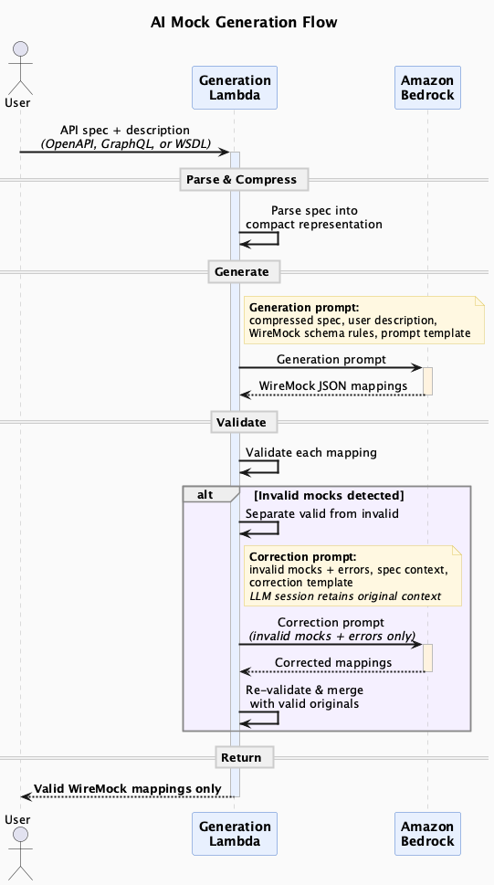

# MockNest Serverless

[](https://github.com/elenavanengelenmaslova/mocknest-serverless/releases/latest)
[](https://serverlessrepo.aws.amazon.com/applications/eu-west-1/021259937026/MockNest-Serverless)
[](https://github.com/elenavanengelenmaslova/mocknest-serverless/actions)
[](https://codecov.io/gh/elenavanengelenmaslova/mocknest-serverless)
[](https://github.com/elenavanengelenmaslova/mocknest-serverless/security/code-scanning)
[](https://securityscorecards.dev/viewer/?uri=github.com/elenavanengelenmaslova/mocknest-serverless)
[](https://www.bestpractices.dev/projects/12218)
[](https://raw.githubusercontent.com/elenavanengelenmaslova/mocknest-serverless/main/docs/api/mocknest-openapi.yaml)


[](https://kotlinlang.org)
[](https://openjdk.org)
[](https://opensource.org/licenses/MIT)

> Deploy WireMock-compatible API mocking into your own AWS account.

Your integration tests need stable external APIs. Those APIs are often unavailable, unreliable, or impossible to configure with test data in non-production environments. MockNest gives you a persistent, serverless mock server running in your own AWS account.

[**Deploy via SAR**](https://serverlessrepo.aws.amazon.com/applications/eu-west-1/021259937026/MockNest-Serverless) | [**Demo Video**](https://youtu.be/NjzcsuE1gqA) | [**Postman Collection**](docs/postman/) | [**API Docs**](docs/api/mocknest-openapi.yaml)

Received the 🏆 **Creative Track Award** at the [AWS 10,000 AIdeas Competition](https://builder.aws.com/content/3D5gTWIjP2zvKncBZBCs849xRqn/aws-10000-aideas-competition-meet-the-winners).

<p>
  
</p>

## Why MockNest?

| Solution | Delivery | Customer-hosted | Serverless | AI mock generation | SSE / Streaming | IAM auth | Pricing |
|---|---|---|---|---|---|---|---|
| **MockNest Serverless** | Own AWS account | ✅ (runs in your account) | ✅ | REST / GraphQL / SOAP | ✅ (chunked delivery) | ✅ | Open source |
| WireMock Cloud | Hosted SaaS | Kubernetes + Postgres | ❌ | REST / GraphQL | ✅ (chunked dribble) | ❌ | Free tier + paid |
| Mockoon Cloud | Hosted SaaS | CLI / Docker (self-assembly) | ❌ | HTTP / JSON templates | ❌ | ❌ | Paid + trial |
| Beeceptor | Hosted SaaS | Docker / VMs / Kubernetes | ❌ | REST / GraphQL / SOAP / gRPC | ❌ | ❌ | Free tier + paid |
| Postman Mock Servers | Hosted SaaS | Local desktop only | ❌ | HTTP example-based | ❌ | ❌ | Free tier + paid |

For detailed competitive analysis, operating model comparison, and cost positioning, see [Market Analysis](docs/MARKET_ANALYSIS.md).

## Getting Started

### Quick Start (5 Minutes)

Try out MockNest Serverless quickly - deploy from SAR and test your first mocks.

### Step 1: Deploy from AWS Serverless Application Repository

1. Go to the [AWS Serverless Application Repository](https://serverlessrepo.aws.amazon.com/applications/eu-west-1/021259937026/MockNest-Serverless)
2. Click "Deploy" and accept the default parameters
3. Wait for deployment to complete (typically 2-3 minutes)

### Step 2: Get Your API Details

After deployment completes, find your API URL and API key in the CloudFormation stack outputs:

```bash
export MOCKNEST_URL="https://your-api-id.execute-api.your-region.amazonaws.com/mocks"
export API_KEY="your-api-key-value-here"
```

### Step 3: Verify Health

```bash
curl "${MOCKNEST_URL}/__admin/health" -H "x-api-key: ${API_KEY}"
```

### Step 4: Create a Mock

```bash
curl -X POST "${MOCKNEST_URL}/__admin/mappings" \
  -H "x-api-key: ${API_KEY}" \
  -H "Content-Type: application/json" \
  -d '{
    "request": {"method": "GET", "urlPath": "/hello"},
    "response": {
      "status": 200,
      "jsonBody": {"message": "Hello from MockNest!"}
    },
    "persistent": true
  }'
```

### Step 5: Test the Mock

```bash
curl "${MOCKNEST_URL}/mocknest/hello" -H "x-api-key: ${API_KEY}"
```

You should receive: `{"message": "Hello from MockNest!"}`

For detailed deployment options, customization, and building from source, see [Deployment for Developers](#deployment-for-developers) below.

### What's Next?

**Try AI-Assisted Generation**
Generate mocks from an OpenAPI spec with a single API call — see [docs/USAGE.md](docs/USAGE.md) for examples using REST, SOAP/WSDL, and GraphQL specifications.

**Configure Your Client App**
To use MockNest with your application:
1. Create mocks for the third-party APIs your app depends on (using manual creation or AI generation)
2. Update your app's configuration to point at MockNest instead of the real API:
   - Change the API base URL to `${MOCKNEST_URL}/mocknest` (plus any path prefix like `/petstore`)
   - **API key mode** (default): Add the API key header to your requests: `x-api-key: ${API_KEY}`
   - **IAM mode**: Sign requests with AWS SigV4 (using your AWS SDK or `--aws-sigv4` in curl)
3. Your app will now call mocks instead of real services

**Learn More**
- **More Examples**: See [docs/USAGE.md](docs/USAGE.md) for SOAP/WSDL, GraphQL, and advanced AI generation
- **Postman Collection**: Import from [docs/postman/](docs/postman/) for ready-to-use examples
- **OpenAPI Specification**: Full API reference at [docs/api/mocknest-openapi.yaml](docs/api/mocknest-openapi.yaml)
- **SAR Guide**: Read [README-SAR.md](README-SAR.md) for detailed deployment and configuration options

## Features

### Current Features
- **Serve Mock Responses**: Call mocked REST, SOAP, and GraphQL endpoints like real APIs — from tests, apps, or CI/CD pipelines
- **Manage Mocks via API (CRUD)**: Create, update, and delete individual mock definitions through a simple REST interface or Postman
- **WireMock-Compatible Mock Format**: Mock definitions use the WireMock mapping format — reuse existing WireMock stubs or leverage the WireMock ecosystem directly
- **Import & Export Mock Sets**: Bulk-import mappings from JSON to replicate environments or onboard quickly
- **Persistent Across Deployments**: Mock definitions and request journal survive Lambda cold starts and redeployments via Amazon S3. Request journal includes sensitive header redaction.
- **Webhook and Callback Support**: Trigger outbound HTTP calls from mocks to simulate chained or event-driven service interactions via SQS, support for AWS IAM SigV4 on webhooks
- **Support for secure API calls**: AWS IAM SigV4 or API Key supported
- **AI-Assisted Mock Generation**: Generate realistic, consistent mocks from OpenAPI, WSDL/SOAP, or GraphQL specs using Amazon Bedrock (configurable model, defaults to Amazon Nova Pro)
- **One-Click Deployment**: Deploy via AWS Serverless Application Repository (SAR) or build from source with SAM
- **Support for Response Streaming**: Responses up to 200 MB via Lambda response streaming, with SSE mock simulation using chunked delivery and configurable delays
- **Low Latency**: Lambda SnapStart minimises cold start times

### AI Mock Generation Flow

The user sends an API specification (OpenAPI, GraphQL, or WSDL) together with a natural language description. MockNest parses and compresses the spec, then assembles a prompt combining the spec summary, user description, WireMock schema rules, and a prompt template. Amazon Bedrock generates WireMock JSON mappings, which are validated automatically. If any mappings are invalid, only those mappings and their errors are sent back to the model for correction. The final response contains only valid mappings.

<div style="text-align: center;">
  
</div>

#### Koog Agent Strategy

Under the hood, the AI generation is powered by a Koog agent that follows a structured strategy graph — parse the spec, generate mocks via Bedrock, validate them, and self-correct if needed:

<div style="text-align: center;">
  
</div>

### Planned Features
See [MockNest Serverless project](https://github.com/users/elenavanengelenmaslova/projects/3) 

### Generation Quality

Generation quality is measured using a 52-scenario eval suite across 14 API specifications, with automated structural validation and LLM-as-a-judge semantic checks.

| Protocol | Scenarios | Valid (no retries) | Valid (1 retry) | Valid (2 retries) | Semantic pass | Avg cost | Avg latency |
|----------|-----------|-------------------|-----------------|-------------------|---------------|----------|-------------|
| REST     | 22        | 93%               | 100%            | 100%              | 100%          | $0.005   | 2.5s        |
| GraphQL  | 15        | 81%               | 93%             | 100%              | 100%          | $0.007   | 2.3s        |
| SOAP     | 15        | 100%              | 100%            | 100%              | 93%           | $0.006   | 3.2s        |

*Tested with Amazon Nova Pro (`eu-west-1`). Self-correction retries are configurable (0–2 via `BedrockGenerationMaxRetries`, default 1). Invalid mocks are filtered out — only valid mocks are returned. For full methodology see the [Prompt Eval Guide](docs/PROMPT_EVAL.md).*

## Architecture Overview

<div style="text-align: center;">
  
</div>

MockNest Serverless consists of AWS Lambda functions that serve both the WireMock admin API and mocked endpoints, with persistent storage in Amazon S3. AI features use Amazon Bedrock for intelligent mock generation when called.

## Known Limitations and Best Practices

### Performance Considerations

**Cold Start Impact**: Mock definitions are loaded into memory at Lambda startup. With very large numbers of persistent mocks (thousands), cold start times may increase. For typical development and testing scenarios with hundreds of mocks, this is not a concern.

**Runtime Latency by Mock Count**: Lambda Power Tuner testing shows warm invocation latency stays flat as mock count grows — ~119 ms with 100 mocks (1024 MB) and ~113 ms with 1000 mocks (1536 MB). The optimal memory shifts from 1024 MB to 1536 MB at 1000 mocks due to increased heap and CPU demand, with per-invocation cost rising from ~$0.0000016 to ~$0.0000023.

**Scaling Strategy**: As your mock count grows, increase Lambda memory accordingly. For large-scale deployments or when managing many APIs, consider grouping mocks into separate deployments:

- **Multiple Deployments**: Deploy separate MockNest instances for different API groups or teams. Group APIs by authentication method (since `AuthMode` is a deployment-level setting), team ownership, or traffic volume. This keeps mock sets at a reasonable size per Lambda, reduces cold start times, and allows independent access control.
  - Example: `mocknest-payment-apis`, `mocknest-user-apis`, `mocknest-notification-apis`

- **Namespace Organization**: Within a single deployment, use namespaces to logically group mocks
  - Simple API: `/petstore/`
  - Client-specific: `/client-a/petstore/`
  - Multi-tenant: `/tenant-b/petstore/`
  - Allows multiple teams and APIs to coexist without conflicts

**Memory Sizing**: Increase Lambda memory as mock count grows. Load testing shows 1024 MB works well for ~100 mocks and 1536 MB for ~1000 mocks. Use multiple deployments when you need isolation, separate auth modes, or independent scaling.

For detailed memory sizing, cold start measurements, scaling benchmarks (100 vs 1000 mocks), and tuning guidance, see [docs/PERFORMANCE.md](docs/PERFORMANCE.md).

### Payload Size Limits

- **Request payloads** are limited to 6 MB by Lambda's invocation payload limit. This is rare in typical REST API testing scenarios.
- **Response payloads** support up to 200 MB via Lambda response streaming.
- Most APIs will not approach these limits in typical integration testing scenarios.

### SOAP/WSDL Support

**SOAP 1.2 Bindings Only for AI Generation**: MockNest Serverless AI-assisted mock generation supports only SOAP 1.2 bindings. SOAP 1.1 bindings are not supported for AI generation.

- **AI-Assisted Mock Generation**: When generating mocks from WSDL specifications using the AI generation endpoint, only WSDLs that contain SOAP 1.2 bindings are accepted. WSDL 1.1 documents that use SOAP 1.2 bindings are supported.
- **Manual Mock Creation**: You can manually create and serve SOAP 1.1 mocks using the standard WireMock admin API. The runtime supports serving SOAP 1.1 mocks - the restriction applies only to AI generation from specifications.
- **Error Handling**: WSDLs with SOAP 1.1 bindings will be rejected during AI generation with: "Only SOAP 1.2 bindings are supported"
- **Non-SOAP WSDLs**: WSDLs with only HTTP bindings or other non-SOAP protocols will be rejected with: "No SOAP binding namespace found; non-SOAP WSDL bindings are not supported"

**Rationale**: Supporting only SOAP 1.2 bindings for AI generation simplifies implementation, focuses on the modern SOAP standard, and reduces complexity in the AI generation pipeline. SOAP 1.2 is the current standard and is widely adopted in modern enterprise systems. The runtime itself can serve any SOAP version when mocks are created manually.

### AI Generation Timeout

The default API Gateway REST API has a synchronous integration timeout of approximately 29 seconds. This constrains how many AI correction retries can complete within a single request. The `BedrockGenerationMaxRetries` SAM parameter controls this (0-2, enforced; default 1).

If you need longer-running AI generation requests, you can:
- Switch to a Regional or private REST API endpoint type
- Then request an API Gateway integration timeout increase from AWS (timeout increases are only available for Regional or private REST APIs)

### Usage Examples

For comprehensive usage examples including SOAP, GraphQL, and advanced AI generation scenarios, see [docs/USAGE.md](docs/USAGE.md).

### Regional Support

- **Core Runtime**: Works in any AWS region with Lambda, API Gateway, and S3 support
- **AI Features**: Availability varies by region based on Amazon Bedrock model support
- **Tested Regions**: See [docs/REGIONS.md](docs/REGIONS.md) for the complete list of tested regions and AI feature availability
- **Officially supported model**: Amazon Nova Pro in [tested regions](docs/REGIONS.md). Other Bedrock models are experimental and have not been tested.

### When Not to Use MockNest

MockNest is designed for cloud-based integration testing over HTTP. For some scenarios, a different tool is a better fit:

- **gRPC or non-HTTP protocols** — Use a protocol-specific mock tool if you need gRPC, WebSocket, or other non-HTTP protocol support.
- **Local-only development without an AWS account** — Use standard WireMock or Mockoon if you only need local mocking without an AWS account.
- **Very large request payloads (over 6 MB)** — Request payloads are limited to 6 MB by Lambda's invocation payload limit. This is rare in typical REST API testing scenarios. Response payloads support up to 200 MB via streaming.

## Deployment for Developers

For developers who want to build from source or contribute to MockNest Serverless.

### Prerequisites

- AWS CLI configured with appropriate permissions
- AWS SAM CLI installed
- Docker (or equivalent such as Colima, for local testing)
- Java 25+ and Gradle (or use included Gradle wrapper)

### Build and Deploy from Source

1. **Clone and Build**:
   ```bash
   git clone https://github.com/elenavanengelenmaslova/mocknest-serverless.git
   cd mocknest-serverless
   ./gradlew build
   ```

2. **Deploy with SAM**:
   ```bash
   cd deployment/aws/sam
   sam build
   sam deploy --guided
   ```

3. **Quick Deploy with Defaults**:
   ```bash
   sam build && sam deploy
   ```

### Development Configuration

**Default SAM Configuration:**
- **Region**: eu-west-1 (Ireland) - supports all features including AI
- **S3 Bucket**: Auto-generated unique name
- **AI Features**: Enabled with Amazon Nova Pro
- **API Key**: Auto-generated

**Deploy to Different Region**:
```bash
sam deploy --region us-east-1
```

**Custom Parameters**:
```bash
sam deploy --parameter-overrides \
  BedrockModelName=AmazonNovaPro \
  AuthMode=IAM
```

### Local Development

1. **Run Tests** (requires Docker for integration tests):
   ```bash
   ./gradlew test
   ```

2. **Local SAM Testing**:
   ```bash
   cd deployment/aws/sam
   sam local start-api
   ```

### Project Structure

```
mocknest-serverless/
├── software/                    # Business logic and application code
│   ├── domain/                  # Domain models and business rules
│   ├── application/             # Use cases and WireMock orchestration
│   └── infra/aws/              # AWS-specific implementations
├── deployment/                 # Deployment configurations
│   └── aws/                   # AWS-specific deployment
│       ├── sam/               # SAM templates and scripts
│       └── shared/            # Shared deployment utilities
├── docs/                       # Documentation and examples
└── .kiro/steering/            # Architecture and design decisions
```

For detailed architecture information, see [Architecture Documentation](.kiro/steering/structure.md).

## Configuration Reference

MockNest Serverless can be configured through SAM deployment parameters or environment variables.

**General**

| Configuration | SAM Parameter | Environment Variable | Possible Values | Default | Notes |
|---------------|---------------|---------------------|-----------------|---------|-------|
| **Deployment Name** | `DeploymentName` | N/A | Alphanumeric string | `mocks` | Used for resource naming and API Gateway stage name |
| **Auth Mode** | `AuthMode` | N/A | `API_KEY`, `IAM` | `API_KEY` | `API_KEY` creates an API key and usage plan; `IAM` requires SigV4-signed requests |
| **Throttle Burst Limit** | `ThrottleBurstLimit` | N/A | 1-5000 | `1` | Maximum number of concurrent requests allowed (burst capacity) for API Gateway throttling |
| **Throttle Rate Limit** | `ThrottleRateLimit` | N/A | 1-10000 | `100` | Steady-state request rate (requests per second) for API Gateway throttling |

> **S3 Bucket**: The `MockStorage` S3 bucket is auto-generated by the template. Pointing at an external bucket is not supported — Lambda IAM permissions are scoped to the `MockStorage` resource.

> **Stack name length**: Lambda function names are limited to 64 characters. MockNest appends suffixes like `-runtime-async` (14 chars) to the stack name. When deploying via SAR, the `serverlessrepo-` prefix (15 chars) is added automatically. Keep your stack name short to stay within the limit.

**Runtime Lambda** — serves mock responses

| Configuration | SAM Parameter | Environment Variable | Possible Values | Default | Notes |
|---------------|---------------|---------------------|-----------------|---------|-------|
| **Memory** | `RuntimeLambdaMemorySize` | N/A | 512-10240 MB | `1024` | Default optimized via Lambda Power Tuner with 100 mocks. See [PERFORMANCE.md](docs/PERFORMANCE.md) |
| **Timeout** | `RuntimeLambdaTimeout` | N/A | 3-29 seconds | `29` | Bounded by API Gateway synchronous limit (~29s) |

**Generation Lambda** — AI mock generation via Bedrock

| Configuration | SAM Parameter | Environment Variable | Possible Values | Default | Notes |
|---------------|---------------|---------------------|-----------------|---------|-------|
| **Memory** | `GenerationLambdaMemorySize` | N/A | 256-10240 MB | `512` | Default optimized via Lambda Power Tuner. See [PERFORMANCE.md](docs/PERFORMANCE.md) |
| **Timeout** | `GenerationLambdaTimeout` | N/A | 10-900 seconds | `29` | Default matches API Gateway synchronous limit (~29s). Each retry counts against this timeout |
| **Max Retries** | `BedrockGenerationMaxRetries` | `BEDROCK_GENERATION_MAX_RETRIES` | 0-2 (enforced) | `1` | Each retry requires a full Bedrock round-trip |
| **Bedrock Model** | `BedrockModelName` | `BEDROCK_MODEL_NAME` | Any Bedrock model ID | `AmazonNovaPro` | Amazon Nova Pro is officially supported |
| **Inference Mode** | `BedrockInferenceMode` | `BEDROCK_INFERENCE_MODE` | `AUTO`, `GLOBAL_ONLY`, `GEO_ONLY` | `AUTO` | Controls cross-region inference routing. Use `GEO_ONLY` for strict data residency |

**Webhook / RuntimeAsync Lambda** — asynchronous webhook dispatch

| Configuration | SAM Parameter | Environment Variable | Possible Values | Default | Notes |
|---------------|---------------|---------------------|-----------------|---------|-------|
| **Webhook Timeout** | `WebhookTimeoutSeconds` | N/A | 5, 10, 25, 55, 115 s | `25` | Also drives RuntimeAsync Lambda timeout (value + 5s) and SQS queue visibility (RuntimeAsync timeout × 6, per AWS best practice) |
| **RuntimeAsync Memory** | `RuntimeAsyncLambdaMemorySize` | N/A | 256-10240 MB | `256` | Memory for the RuntimeAsync Lambda (webhook dispatch via SQS). Default optimized via Lambda Power Tuner. See [PERFORMANCE.md](docs/PERFORMANCE.md) |
| **Sensitive Headers** | `SensitiveHeaders` | `MOCKNEST_SENSITIVE_HEADERS` | Comma-separated names | `x-api-key,authorization,...` | Redacted in S3 request journal. Applied to both Runtime and RuntimeAsync Lambda functions |

**Retention**

| Configuration | SAM Parameter | Environment Variable | Possible Values | Default | Notes |
|---------------|---------------|---------------------|-----------------|---------|-------|
| **Log Retention** | `LogRetentionDays` | N/A | 1, 3, 5, 7, 14, 30, 60, 90+ | `7` | Applies to all Lambda functions (Runtime, Generation, RuntimeAsync) |
| **S3 Version Retention** | `S3VersionRetentionDays` | N/A | 1-365 days | `7` | Days to keep old S3 object versions (previous mock definitions after updates) |
| **Request Journal Retention** | `RequestJournalRetentionDays` | N/A | 1-365 days | `1` | Days to keep request journal records in S3 (`requests/` prefix) |

**Configuration Precedence**: Environment variables override SAM parameters at runtime. Use SAM parameters for initial deployment configuration and environment variables for runtime adjustments without redeployment.

## Cost Information

MockNest Serverless uses a serverless, pay-as-you-go architecture — you only pay for the AWS resources you consume.

**Core Runtime** (Lambda, API Gateway, S3, SQS, CloudWatch, IAM): Pay-as-you-go. See [AWS Free Tier](https://aws.amazon.com/free/) for current eligibility and limits.

**AI Mock Generation** (Amazon Bedrock): Pay-as-you-go. You pay nothing for Bedrock if you don't use MockNest's AI generation endpoints. See [Amazon Bedrock pricing](https://aws.amazon.com/bedrock/pricing/) for details.

For a detailed cost breakdown and monitoring tips, see the [Cost Guide](docs/COST.md).

## Contributing

We welcome contributions! Whether you're fixing bugs, adding features, or improving documentation, your help makes the project better.

See [CONTRIBUTING.md](CONTRIBUTING.md) for guidelines on:
- Reporting bugs and requesting features
- Submitting pull requests
- Development setup and standards
- CI/CD pipelines and testing requirements

## License

This project is open source and available under the [MIT License](LICENSE).

## Support

- **Issues**: Report bugs and feature requests via [GitHub Issues](https://github.com/elenavanengelenmaslova/mocknest-serverless/issues)
- **Changelog**: See [CHANGELOG.md](CHANGELOG.md) for release history and recent changes
- **Documentation**: Additional documentation in the `docs/` directory
- **Architecture**: Design decisions documented in `.kiro/steering/`
- **Community**: Contributions welcome! See [CONTRIBUTING.md](CONTRIBUTING.md)

## Learn more

A detailed explanation of the problem and approach: [Goodbye Flaky External APIs — Hello Mocking in the Cloud](https://medium.com/aws-in-plain-english/goodbye-flaky-external-apis-hello-mocking-in-the-cloud-c0943adf6183)  

For additional context and background: [AIdeas Finalist: MockNest Serverless](https://builder.aws.com/content/3BzM2TZzM7RnsPFR7bzO7qlORUv/aideas-finalist-mocknest-serverless)

🏆 [AWS 10,000 AIdeas Competition — Meet the Winners](https://builder.aws.com/content/3D5gTWIjP2zvKncBZBCs849xRqn/aws-10000-aideas-competition-meet-the-winners)

## Security

MockNest Serverless is designed with security in mind. Access is protected at the edge via API Gateway with configurable authentication (API key or AWS IAM SigV4).

For the full security policy, vulnerability reporting process, IAM permissions reference, and guidance on restricting Bedrock permissions by region, see [SECURITY.md](SECURITY.md).

## Troubleshooting

### Common Issues

1. **Region Mismatch**: Ensure all AWS resources are in the same region
2. **Permissions**: Verify IAM roles have necessary S3 and Lambda permissions. See [SECURITY.md](SECURITY.md#iam-permissions-reference) for the full permission breakdown per role and guidance on restricting Bedrock permissions by region.
3. **Cold Starts**: First requests may be slower due to Lambda cold starts

### Logs

MockNest Serverless provides comprehensive logging through CloudWatch:

**Log Groups Created:**
- `/aws/lambda/{stack-name}-runtime` - WireMock runtime and mock serving
- `/aws/lambda/{stack-name}-generation` - AI-assisted mock generation
- **Retention**: 7 days default (configurable via `LogRetentionDays` parameter)

**View logs via SAM CLI:**
```bash
# Runtime function logs
sam logs -n MockNestRuntimeFunction --stack-name mocknest-serverless --tail

# Generation function logs  
sam logs -n MockNestGenerationFunction --stack-name mocknest-serverless --tail
```

**View logs in AWS Console:**
1. Go to CloudWatch → Log groups
2. Find `/aws/lambda/mocknest-serverless-*` log groups
3. View recent log streams

**Note**: API Gateway access logs are disabled to simplify deployment. Lambda logs provide comprehensive application monitoring.

