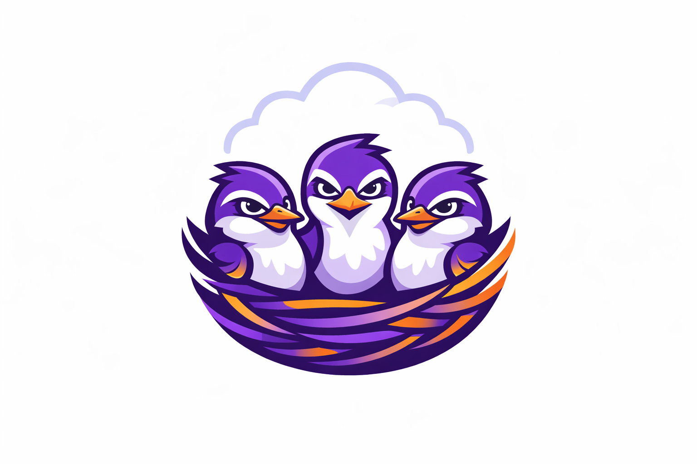
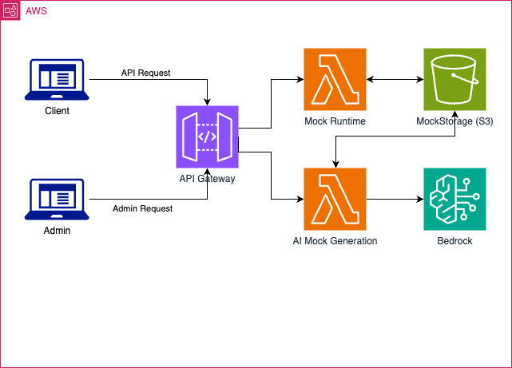

# MockNest Serverless

[](https://github.com/elenavanengelenmaslova/mocknest-serverless/releases/latest)
[](https://serverlessrepo.aws.amazon.com/applications/eu-west-1/021259937026/MockNest-Serverless)
[](https://github.com/elenavanengelenmaslova/mocknest-serverless/actions)
[](https://codecov.io/gh/elenavanengelenmaslova/mocknest-serverless)
[](https://github.com/elenavanengelenmaslova/mocknest-serverless/security/code-scanning)
[](https://securityscorecards.dev/viewer/?uri=github.com/elenavanengelenmaslova/mocknest-serverless)
[](https://www.bestpractices.dev/projects/12218)
[](https://app.snyk.io/org/elenavanengelenmaslova/)
[](https://raw.githubusercontent.com/elenavanengelenmaslova/mocknest-serverless/main/docs/api/mocknest-openapi.yaml)
[](https://kotlinlang.org)
[](https://openjdk.org)
[](https://opensource.org/licenses/MIT)

*AI-powered API mocking for cloud-native testing on AWS*

MockNest Serverless is a serverless WireMock-compatible runtime for AWS that enables realistic integration testing without relying on live external services, with AI-assisted mock generation using Amazon Bedrock. It runs natively on AWS Lambda and persists mock definitions in Amazon S3, making mocks available across cold starts and deployments.
- [Concept article](https://builder.aws.com/content/2zkFqqTTTB259ZesLX6l9ZbAqjD/aideas-mocknest-serverless-ai-powered-api-mocking-for-cloud-native-testing)
- [Demo](https://youtu.be/Rvip8rtULww)

<p>
  
</p>

## Used for

- **CI/CD integration testing in the cloud** - Run automated integration tests in your CI/CD pipeline without depending on external APIs
- **Mocking third-party APIs** - Mock Salesforce, payment gateways, SOAP services, REST APIs, GraphQL APIs and other external dependencies
- **Testing in restricted environments** - Run exploratory and integration tests in cloud environments where external APIs are unavailable, unreliable, or have difficult-to-setup test data

## Architecture Overview

<div style="text-align: center;">
  
</div>

MockNest Serverless consists of AWS Lambda functions that serve both the WireMock admin API and mocked endpoints, with persistent storage in Amazon S3. AI features use Amazon Bedrock for intelligent mock generation when called.

## Features

### Current Features
- **Serve Mock Responses**: Call mocked REST, SOAP, and GraphQL endpoints like real APIs — from tests, apps, or CI/CD pipelines
- **Manage Mocks via API (CRUD)**: Create, update, and delete individual mock definitions through a simple REST interface or Postman
- **WireMock-Compatible Mock Format**: Mock definitions use the WireMock mapping format — reuse existing WireMock stubs or leverage the WireMock ecosystem directly
- **Import & Export Mock Sets**: Bulk-import mappings from JSON to replicate environments or onboard quickly
- **Persistent Across Deployments**: Mock definitions and request journal survive Lambda cold starts and redeployments via Amazon S3. Request journal includes sensitive header redaction.
- **Webhook and Callback Support**: Trigger outbound HTTP calls from mocks to simulate chained or event-driven service interactions via SQS, support for AWS IAM SigV4 on webhooks
- **Support for secure API calls**: AWS IAM SigV4 or API Key supported
- **AI-Assisted Mock Generation**: Generate realistic, consistent mocks from OpenAPI, WSDL/SOAP, or GraphQL specs using Amazon Bedrock (configurable model, defaults to Amazon Nova Pro)
- **One-Click Deployment**: Deploy via AWS Serverless Application Repository (SAR) or build from source with SAM
- **Low Latency**: Lambda SnapStart minimises cold start times

### Planned Features
See [MockNest Serverless project](https://github.com/users/elenavanengelenmaslova/projects/3) 

## Getting Started

### Quick Start (5 Minutes)

Try out MockNest Serverless quickly - deploy from SAR and test your first mocks.

### Step 1: Deploy from AWS Serverless Application Repository

1. Go to the [AWS Serverless Application Repository](https://serverlessrepo.aws.amazon.com/applications/eu-west-1/021259937026/MockNest-Serverless)
2. Select your deployment region (see [supported regions](docs/REGIONS.md) for AI feature availability)
3. Click "Deploy" and accept the default parameters
4. Wait for deployment to complete (typically 2-3 minutes)

> For parameter details and customization options, see the [SAR User Guide](README-SAR.md).

### Step 2: Get Your API Details

After deployment completes, retrieve your API Gateway URL from the AWS Console. If you deployed with `AuthMode=API_KEY` (the default), also retrieve your API key. In `AuthMode=IAM`, requests are authenticated with SigV4 signing instead of an API key.

Set environment variables:
```bash
export MOCKNEST_URL="https://your-api-id.execute-api.your-region.amazonaws.com/mocks"
export API_KEY="your-api-key-value-here"
```

> See the [SAR User Guide](README-SAR.md) for detailed instructions on retrieving these values.

### Step 3: Verify Health

Check runtime health:
```bash
curl "${MOCKNEST_URL}/__admin/health" -H "x-api-key: ${API_KEY}"
```

Check AI generation health:
```bash
curl "${MOCKNEST_URL}/ai/generation/health" -H "x-api-key: ${API_KEY}"
```

> **Note**: The `x-api-key` header applies to API key mode (the default). In IAM mode, requests must be SigV4-signed instead of using an API key header.

### Step 4: Create and Test a Mock

Create a simple mock:
```bash
curl -X POST "${MOCKNEST_URL}/__admin/mappings" \
  -H "x-api-key: ${API_KEY}" \
  -H "Content-Type: application/json" \
  -d '{
    "request": {"method": "GET", "urlPath": "/hello"},
    "response": {
      "status": 200,
      "jsonBody": {"message": "Hello from MockNest!"}
    },
    "persistent": true
  }'
```

Test the mock:
```bash
curl "${MOCKNEST_URL}/mocknest/hello" -H "x-api-key: ${API_KEY}"
```

> **Note**: The `x-api-key` header applies to API key mode (the default). In IAM mode, use SigV4 request signing instead.

### Step 5: Try AI-Assisted Generation

Generate mocks from an OpenAPI spec:
```bash
curl -X POST "${MOCKNEST_URL}/ai/generation/from-spec" \
  -H "x-api-key: ${API_KEY}" \
  -H "Content-Type: application/json" \
  -d '{
    "namespace": {
        "apiName": "petstore",
        "client": null
    },
    "specification": null,
    "specificationUrl": "https://petstore3.swagger.io/api/v3/openapi.json",
    "format": "OPENAPI_3",
    "description": "Generate mocks for 4 pets, only GET endpoints. 1 pet is a bird with image: https://media.s-bol.com/q0Q9jQ7vDjGR/wpzn5L1/550x550.jpg, available, new, tag id=1 name=new. API call to get all new pets returns that bird. The other 3 pets are available but not new.",
    "options": {
        "enableValidation": true
    }
}'
```

When `enableValidation` is enabled, generated mocks are automatically validated. If invalid mocks are detected, the system retries generation with AI self-correction (up to `BedrockGenerationMaxRetries` attempts, default 1, range 0-2) and only returns mocks that pass validation.

Import the generated mappings (copy the `mappings` array from the response):
```bash
curl -X POST "${MOCKNEST_URL}/__admin/mappings/import" \
  -H "x-api-key: ${API_KEY}" \
  -H "Content-Type: application/json" \
  -d '{"mappings": [...]}'
```

Test the imported mock:
```bash
curl "${MOCKNEST_URL}/mocknest/petstore/pet/findByStatus?status=available" \
  -H "x-api-key: ${API_KEY}"
```

### What's Next?

**Configure Your Client App**
To use MockNest with your application:
1. Create mocks for the third-party APIs your app depends on (using manual creation or AI generation)
2. Update your app's configuration to point at MockNest instead of the real API:
   - Change the API base URL to `${MOCKNEST_URL}/mocknest` (plus any path prefix like `/petstore`)
   - Add the API key header to your requests: `x-api-key: ${API_KEY}`
3. Your app will now call mocks instead of real services

**Learn More**
- **More Examples**: See [docs/USAGE.md](docs/USAGE.md) for SOAP/WSDL, GraphQL, and advanced AI generation
- **Postman Collection**: Import from [docs/postman/](docs/postman/) for ready-to-use examples
- **OpenAPI Specification**: Full API reference at [docs/api/mocknest-openapi.yaml](docs/api/mocknest-openapi.yaml)
- **SAR Guide**: Read [README-SAR.md](README-SAR.md) for detailed deployment and configuration options

### Deployment Options

MockNest Serverless offers two deployment methods:

**AWS Serverless Application Repository (SAR) - Recommended for Most Users**
- One-click deployment from AWS Console
- Pre-built and tested application package
- Automatic updates available
- See [Quick Start for SAR Users](#quick-start-for-sar-users) below

**Build from Source - For Developers and Contributors**
- Full control over build and deployment
- Ability to customize and contribute
- Requires AWS SAM CLI and development tools
- See [Deployment for Developers](#deployment-for-developers) below

### After Deployment

Once deployed, retrieve your API Gateway URL from the AWS Console. If you deployed with `AuthMode=API_KEY` (the default), also retrieve your API key. See the [Quick Start (5 Minutes)](#quick-start-5-minutes) guide above for step-by-step instructions, or refer to the [SAR User Guide](README-SAR.md) for detailed guidance.

### Usage Options

MockNest Serverless provides multiple ways to interact with the API:

**Postman Collections (Easiest)**
- Pre-configured requests for all API operations
- Import from [docs/postman/](docs/postman/)
- Includes examples for REST, SOAP, GraphQL, and AI generation
- Ready to use with environment variables

**cURL Commands (Automation-Friendly)**
- Command-line access for CI/CD integration
- Comprehensive examples in [docs/USAGE.md](docs/USAGE.md)
- Suitable for scripts and automated testing
- Works in any terminal or shell script

**Direct HTTP Clients**
- Use any HTTP client library in your preferred language
- Standard REST API with JSON request/response

## Quick Start for SAR Users

**Recommended Path**: Deploy MockNest Serverless directly from the AWS Serverless Application Repository for the easiest setup experience.

### Prerequisites

- AWS account with appropriate permissions
- Access to AWS Console

### Deployment from AWS Serverless Application Repository

1. **Navigate to SAR**: Go to the [AWS Serverless Application Repository](https://console.aws.amazon.com/serverlessrepo/home) in your AWS Console
2. **Select Region**: Choose your preferred deployment region (see [supported regions](docs/REGIONS.md))
3. **Deploy**: Click "Deploy" and configure parameters:
   - **DeploymentName**: Unique identifier for your deployment (default: "mocks")
   - **BedrockModelName**: AI model for mock generation (default: "AmazonNovaPro")
   - **RuntimeLambdaMemorySize**: Runtime Lambda memory in MB (default: 512)
   - **GenerationLambdaMemorySize**: Generation Lambda memory in MB (default: 512)
   - **RuntimeLambdaTimeout**: Mock serving timeout in seconds (default: 10)
   - **GenerationLambdaTimeout**: AI generation timeout in seconds (default: 29)

### Getting Started After Deployment

**Quick Start with Postman**: Import our ready-to-use Postman collections from [`docs/postman/`](docs/postman/) for instant access to all API endpoints with working examples.

**Manual Setup**: Follow the [SAR User Guide](README-SAR.md) for step-by-step instructions using cURL.

#### Region Selection and Model Availability

**Choose Your Deployment Region**: When deploying from SAR, you select the deployment region in the AWS Console. MockNest automatically configures itself for that region.

**Bedrock Model Availability**: Verify Amazon Nova Pro is available in your chosen region using the [AWS Bedrock model availability documentation](https://docs.aws.amazon.com/bedrock/latest/userguide/bedrock-regions.html). Amazon Nova Pro is ready to use immediately in supported regions.

**Note**: If using third-party models (like Anthropic Claude), you may need to enable model access and accept terms in the Amazon Bedrock console.

#### Support and Troubleshooting

**Getting Help**:
- **Issues**: Report problems via [GitHub Issues](https://github.com/elenavanengelenmaslova/mocknest-serverless/issues)
- **Documentation**: See the [SAR User Guide](README-SAR.md) for detailed deployment and usage instructions
- **API Reference**: Complete API documentation in the [OpenAPI specification](docs/api/mocknest-openapi.yaml)

**Common Deployment Issues**:
- **Bedrock Access Denied**: Ensure model access is enabled in Amazon Bedrock console
- **Region Not Supported**: Verify Amazon Bedrock is available in your deployment region
- **CloudFormation Failures**: Check CloudFormation events for detailed error messages

## Tested Configuration

MockNest Serverless has been thoroughly tested in multiple AWS regions:

### Regional Support
- **Core Runtime**: Works in any AWS region with Lambda, API Gateway, and S3 support
- **AI Features**: Availability varies by region based on Amazon Bedrock model support
- **Tested Regions**: See [docs/REGIONS.md](docs/REGIONS.md) for the complete list of tested regions and AI feature availability

### AI Features Support
- **Officially supported**: Amazon Nova Pro model in [tested regions](docs/REGIONS.md)
- **Other Bedrock models**: Are experimental and have not been tested
The following WireMock capabilities have been validated in the serverless environment:
- Request matching (URL, headers, body, query parameters)
- Response templating and transformation
- JSON and XML body matching
- Stateful behavior and scenarios
- Request verification and admin API
- File serving for response bodies
- Callback and webhook simulation

**Note**: MockNest does not claim support for WireMock features that have not been explicitly tested in serverless environments.

## Known Limitations and Best Practices

### Performance Considerations

**Cold Start Impact**: Mock definitions are loaded into memory at Lambda startup. With very large numbers of persistent mocks (thousands), cold start times may increase. For typical development and testing scenarios with hundreds of mocks, this is not a concern.

**Scaling Strategy**: For large-scale deployments or when managing many APIs, consider these approaches:

- **Multiple Deployments**: Deploy separate MockNest instances for different API groups or teams
  - Provides better isolation and independent scaling
  - Reduces cold start times by keeping mock sets smaller per deployment
  - Allows separate access control and security configurations
  - Example: `mocknest-payment-apis`, `mocknest-user-apis`, `mocknest-notification-apis`

- **Namespace Organization**: Within a single deployment, use namespaces to logically group mocks
  - Simple API: `/petstore/`
  - Client-specific: `/client-a/petstore/`
  - Multi-tenant: `/tenant-b/petstore/`
  - Allows multiple teams and APIs to coexist without conflicts

**Recommendation**: Use namespaces for logical grouping within a deployment, and use multiple deployments when you need isolation, separate access control, or independent scaling.

For detailed memory sizing, cold start measurements, and tuning guidance, see [docs/PERFORMANCE.md](docs/PERFORMANCE.md).

### SOAP/WSDL Support

**SOAP 1.2 Bindings Only for AI Generation**: MockNest Serverless AI-assisted mock generation supports only SOAP 1.2 bindings. SOAP 1.1 bindings are not supported for AI generation.

- **AI-Assisted Mock Generation**: When generating mocks from WSDL specifications using the AI generation endpoint, only WSDLs that contain SOAP 1.2 bindings are accepted. WSDL 1.1 documents that use SOAP 1.2 bindings are supported.
- **Manual Mock Creation**: You can manually create and serve SOAP 1.1 mocks using the standard WireMock admin API. The runtime supports serving SOAP 1.1 mocks - the restriction applies only to AI generation from specifications.
- **Error Handling**: WSDLs with SOAP 1.1 bindings will be rejected during AI generation with: "Only SOAP 1.2 bindings are supported"
- **Non-SOAP WSDLs**: WSDLs with only HTTP bindings or other non-SOAP protocols will be rejected with: "No SOAP binding namespace found; non-SOAP WSDL bindings are not supported"

**Rationale**: Supporting only SOAP 1.2 bindings for AI generation simplifies implementation, focuses on the modern SOAP standard, and reduces complexity in the AI generation pipeline. SOAP 1.2 is the current standard and is widely adopted in modern enterprise systems. The runtime itself can serve any SOAP version when mocks are created manually.

### AI Generation Timeout

The default API Gateway REST API has a synchronous integration timeout of approximately 29 seconds. This constrains how many AI correction retries can complete within a single request. The `BedrockGenerationMaxRetries` SAM parameter controls this (0-2, enforced; default 1).

If you need longer-running AI generation requests, you can:
- Switch to a Regional or private REST API endpoint type
- Then request an API Gateway integration timeout increase from AWS (timeout increases are only available for Regional or private REST APIs)

### Usage Examples

For comprehensive usage examples including SOAP, GraphQL, and advanced AI generation scenarios, see [docs/USAGE.md](docs/USAGE.md).

## Deployment for Developers

For developers who want to build from source or contribute to MockNest Serverless.

### Prerequisites

- AWS CLI configured with appropriate permissions
- AWS SAM CLI installed
- Docker (or equivalent such as Colima, for local testing)
- Java 25+ and Gradle (or use included Gradle wrapper)

### Build and Deploy from Source

1. **Clone and Build**:
   ```bash
   git clone <repository-url>
   cd mocknest-serverless
   ./gradlew build
   ```

2. **Deploy with SAM**:
   ```bash
   cd deployment/aws/sam
   sam build
   sam deploy --guided
   ```

3. **Quick Deploy with Defaults**:
   ```bash
   sam build && sam deploy
   ```

### Development Configuration

**Default SAM Configuration:**
- **Region**: eu-west-1 (Ireland) - supports all features including AI
- **S3 Bucket**: Auto-generated unique name
- **AI Features**: Enabled with Amazon Nova Pro
- **API Key**: Auto-generated

**Deploy to Different Region**:
```bash
sam deploy --region us-east-1
```

**Custom Parameters**:
```bash
sam deploy --parameter-overrides \
  BedrockModelName=AmazonNovaPro \
  AuthMode=IAM
```

### Local Development

1. **Run Tests** (requires Docker for integration tests):
   ```bash
   ./gradlew test
   ```

2. **Local SAM Testing**:
   ```bash
   cd deployment/aws/sam
   sam local start-api
   ```

### Project Structure

```
mocknest-serverless/
├── software/                    # Business logic and application code
│   ├── domain/                  # Domain models and business rules
│   ├── application/             # Use cases and WireMock orchestration
│   └── infra/aws/              # AWS-specific implementations
├── deployment/                 # Deployment configurations
│   └── aws/                   # AWS-specific deployment
│       ├── sam/               # SAM templates and scripts
│       └── shared/            # Shared deployment utilities
├── docs/                       # Documentation and examples
└── .kiro/steering/            # Architecture and design decisions
```

For detailed architecture information, see [Architecture Documentation](.kiro/steering/structure.md).

## Configuration Reference

MockNest Serverless can be configured through SAM deployment parameters or environment variables.

**General**

| Configuration | SAM Parameter | Environment Variable | Possible Values | Default | Notes |
|---------------|---------------|---------------------|-----------------|---------|-------|
| **Deployment Name** | `DeploymentName` | N/A | Alphanumeric string | `mocks` | Used for resource naming and API Gateway stage name |
| **Auth Mode** | `AuthMode` | N/A | `API_KEY`, `IAM` | `API_KEY` | `API_KEY` creates an API key and usage plan; `IAM` requires SigV4-signed requests |

> **S3 Bucket**: The `MockStorage` S3 bucket is auto-generated by the template. Pointing at an external bucket is not supported — Lambda IAM permissions are scoped to the `MockStorage` resource.

**Runtime Lambda** — serves mock responses

| Configuration | SAM Parameter | Environment Variable | Possible Values | Default | Notes |
|---------------|---------------|---------------------|-----------------|---------|-------|
| **Memory** | `RuntimeLambdaMemorySize` | N/A | 512-10240 MB | `512` | Default optimized via Lambda Power Tuner |
| **Timeout** | `RuntimeLambdaTimeout` | N/A | 3-29 seconds | `10` | Bounded by API Gateway synchronous limit (~29s) |

**Generation Lambda** — AI mock generation via Bedrock

| Configuration | SAM Parameter | Environment Variable | Possible Values | Default | Notes |
|---------------|---------------|---------------------|-----------------|---------|-------|
| **Memory** | `GenerationLambdaMemorySize` | N/A | 512-10240 MB | `512` | Increase for heavier AI models or large API specs |
| **Timeout** | `GenerationLambdaTimeout` | N/A | 10-900 seconds | `29` | Default matches API Gateway synchronous limit (~29s). Each retry counts against this timeout |
| **Max Retries** | `BedrockGenerationMaxRetries` | `BEDROCK_GENERATION_MAX_RETRIES` | 0-2 (enforced) | `1` | Each retry requires a full Bedrock round-trip |
| **Bedrock Model** | `BedrockModelName` | `BEDROCK_MODEL_NAME` | Any Bedrock model ID | `AmazonNovaPro` | Amazon Nova Pro is officially supported |
| **Inference Mode** | `BedrockInferenceMode` | `BEDROCK_INFERENCE_MODE` | `AUTO`, `GLOBAL_ONLY`, `GEO_ONLY` | `AUTO` | Controls cross-region inference routing. Use `GEO_ONLY` for strict data residency |

**Webhook / RuntimeAsync Lambda** — asynchronous webhook dispatch

| Configuration | SAM Parameter | Environment Variable | Possible Values | Default | Notes |
|---------------|---------------|---------------------|-----------------|---------|-------|
| **Webhook Timeout** | `WebhookTimeoutSeconds` | N/A | 5, 10, 25, 55, 115 s | `25` | Also drives RuntimeAsync Lambda timeout (value + 5s) and SQS queue visibility (RuntimeAsync timeout × 6, per AWS best practice) |
| **Sensitive Headers** | `SensitiveHeaders` | `MOCKNEST_SENSITIVE_HEADERS` | Comma-separated names | `x-api-key,authorization,...` | Redacted in S3 request journal. Applied to both Runtime and RuntimeAsync Lambda functions |

**Retention**

| Configuration | SAM Parameter | Environment Variable | Possible Values | Default | Notes |
|---------------|---------------|---------------------|-----------------|---------|-------|
| **Log Retention** | `LogRetentionDays` | N/A | 1, 3, 5, 7, 14, 30, 60, 90+ | `7` | Applies to all Lambda functions (Runtime, Generation, RuntimeAsync) |
| **S3 Version Retention** | `S3VersionRetentionDays` | N/A | 1-365 days | `7` | Days to keep old S3 object versions (previous mock definitions after updates) |
| **Request Journal Retention** | `RequestJournalRetentionDays` | N/A | 1-365 days | `1` | Days to keep request journal records in S3 (`requests/` prefix) |

**Configuration Precedence**: Environment variables override SAM parameters at runtime. Use SAM parameters for initial deployment configuration and environment variables for runtime adjustments without redeployment.

## Cost Information

MockNest Serverless uses a serverless, pay-as-you-go architecture — you only pay for the AWS resources you consume.

**Core Runtime** (Lambda, API Gateway, S3, SQS, CloudWatch, IAM): Pay-as-you-go. See [AWS Free Tier](https://aws.amazon.com/free/) for current eligibility and limits.

**AI Mock Generation** (Amazon Bedrock): Pay-as-you-go. You pay nothing for Bedrock if you don't use MockNest's AI generation endpoints. See [Amazon Bedrock pricing](https://aws.amazon.com/bedrock/pricing/) for details.

For a detailed cost breakdown and monitoring tips, see the [Cost Guide](docs/COST.md).

## Troubleshooting
### Common Issues

1. **Region Mismatch**: Ensure all AWS resources are in the same region
2. **Permissions**: Verify IAM roles have necessary S3 and Lambda permissions
3. **Cold Starts**: First requests may be slower due to Lambda cold starts

### Logs

MockNest Serverless provides comprehensive logging through CloudWatch:

**Log Groups Created:**
- `/aws/lambda/{stack-name}-runtime` - WireMock runtime and mock serving
- `/aws/lambda/{stack-name}-generation` - AI-assisted mock generation
- **Retention**: 7 days default (configurable via `LogRetentionDays` parameter)

**View logs via SAM CLI:**
```bash
# Runtime function logs
sam logs -n MockNestRuntimeFunction --stack-name mocknest-serverless --tail

# Generation function logs  
sam logs -n MockNestGenerationFunction --stack-name mocknest-serverless --tail
```

**View logs in AWS Console:**
1. Go to CloudWatch → Log groups
2. Find `/aws/lambda/mocknest-serverless-*` log groups
3. View recent log streams

**Note**: API Gateway access logs are disabled to simplify deployment. Lambda logs provide comprehensive application monitoring.

## Contributing

We welcome contributions! Whether you're fixing bugs, adding features, or improving documentation, your help makes the project better.

See [CONTRIBUTING.md](CONTRIBUTING.md) for guidelines on:
- Reporting bugs and requesting features
- Submitting pull requests
- Development setup and standards
- CI/CD pipelines and testing requirements

## License

This project is open source and available under the [MIT License](LICENSE).

## Support

- **Issues**: Report bugs and feature requests via [GitHub Issues](https://github.com/elenavanengelenmaslova/mocknest-serverless/issues)
- **Documentation**: Additional documentation in the `docs/` directory
- **Architecture**: Design decisions documented in `.kiro/steering/`
- **Community**: Contributions welcome! See [CONTRIBUTING.md](CONTRIBUTING.md)

## Learn more

A detailed explanation of the problem and approach: [Goodbye Flaky External APIs — Hello Mocking in the Cloud](https://medium.com/aws-in-plain-english/goodbye-flaky-external-apis-hello-mocking-in-the-cloud-c0943adf6183)  

For additional context and background: [AIdeas: MockNest Serverless – AI-Powered API Mocking for Cloud-Native Testing](https://builder.aws.com/content/2zkFqqTTTB259ZesLX6l9ZbAqjD/aideas-mocknest-serverless-ai-powered-api-mocking-for-cloud-native-testing)
