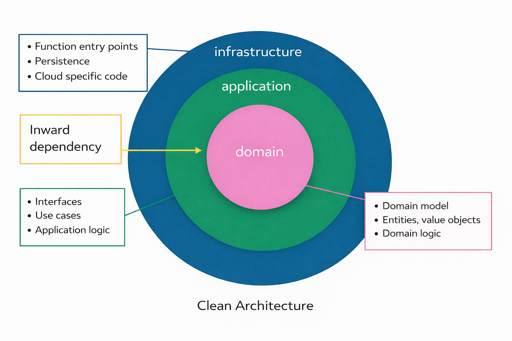

# AIdeas: MockNest Serverless

## App Category
**Workplace Efficiency**

## My Vision

MockNest Serverless is an open-source AWS Serverless Application Repository application that transforms how teams test cloud-native applications by combining a serverless mock runtime with AI-powered capabilities.

### What is Built Today

MockNest provides a WireMock-compatible mock runtime running on AWS Lambda, with mock definitions persisted in Amazon S3. This allows mocks to remain available across Lambda cold starts while keeping the solution simple and cost-efficient within the AWS Free Tier.

Current capabilities include:

- **Serverless Mock Runtime** – A WireMock-compatible API (providing familiar patterns and ecosystem integration) running on AWS Lambda with S3-backed persistence for mock definitions
- **AI-Powered Mock Generation** – Uses Amazon Bedrock (with Amazon Nova Pro as the default model) to generate WireMock [1] mappings from OpenAPI specifications or natural-language descriptions, with automatic validation and retry on errors
- **Protocol Support** – REST, GraphQL over HTTP, and SOAP APIs with synchronous request-response patterns
- **AWS-Native Deployment** – Deploy using AWS SAM templates or one-click installation from the AWS Serverless Application Repository

### The Vision – Intelligent Mock Maintenance

The next phase of MockNest turns mock generation into **intelligent mock maintenance**. As APIs evolve and real traffic patterns emerge, MockNest aims to help teams keep their mocks accurate and comprehensive with minimal manual effort.

Planned capabilities include:

**AI-Assisted Mock Maintenance**
- **Traffic Analysis** – Analyze recorded requests to identify unmatched calls, near-miss patterns, and coverage gaps
- **Automated Mock Evolution** – Recommend or generate updated mocks when APIs change

**Advanced Interaction Support**
- **Webhook and Callback Simulation** – Support asynchronous interaction patterns commonly used in event-driven systems
- **Streaming Response Support** – Simulate streaming APIs using Server-Sent Events (SSE) and streaming HTTP responses

**AI Agent Testing**
- **MCP Protocol Mocking** – Simulate Model Context Protocol (MCP) servers to enable reliable testing of AI agents and tool-calling workflows

## Why This Matters

Modern cloud-native and serverless applications depend on external services—payment gateways, authentication providers, CRM systems, and many other APIs. Testing these integrations is where teams often struggle.

### The Availability Problem
External APIs are not always accessible from development or test environments. Corporate networks may block outbound internet access, external test APIs may be unavailable or unstable, which often makes automated testing unreliable. When dependencies are unreachable, integration testing slows down or stops entirely.

### The Control Problem
Even when external APIs are accessible, controlling test data is difficult. Setting up specific scenarios, synchronizing state across multiple systems, and reliably reproducing edge cases quickly becomes complex and time-consuming.

### The Maintenance Problem
APIs evolve constantly. Third-party services add fields, change response formats, or deprecate endpoints. Over time mocks become outdated, tests pass with incorrect assumptions, and integration failures appear only in production.

MockNest addresses these challenges with a serverless mock runtime and AI-assisted mock generation today, and a roadmap toward intelligent mock maintenance.

### How MockNest Helps

**Serverless-Native Runtime (Available Today)**
- Runs entirely within your AWS account on AWS Lambda
- Deploys quickly using AWS SAR or SAM
- Persists mocks in Amazon S3
- Can operate within AWS Free Tier limits for typical integration testing workloads

**AI-Powered Mock Generation (Available Today)**
- **Amazon Nova Pro as Default** – Uses Amazon Nova Pro as the primary supported model for high-quality mock generation
- **Generate from API specifications** – Provide an OpenAPI specification and receive complete WireMock mappings
- **Generate from natural language** – Describe the API behavior and generate realistic mock responses
- **Organized namespaces** – Structure mocks by API and client for multi-team usage

**Intelligent Mock Maintenance (Roadmap)**
- **Traffic analysis** to identify missing scenarios
- **Automated mock evolution** when APIs change
- **Proactive recommendations** based on observed request patterns

MockNest reduces integration testing friction today while laying the foundation for automated mock maintenance as systems evolve.

## Demo time!
The demo shows generating WireMock mocks from natural language descriptions using Amazon Bedrock, validating the generated mappings, and using them in a pet adoption newsletter application that sends emails with currently available pets.

PLACEHOLDER YOUTUBE DEMO LINK HERE

## How I Built This

### Building with Kiro AI

I built MockNest with Kiro[2] as a development partner. When I started with Kiro, I created a set of **steering documents** to ensure Kiro has the correct context to generate deliverables.

These documents provide long-lived context for the project. In MockNest they include:

- **Product vision** – the problem the project solves and the long-term direction
- **Scope and non-goals** – what the project intentionally does and does not try to solve
- **Architecture** – system structure, clean architecture boundaries, and package layout
- **AWS services** – how cloud components such as Lambda, API Gateway, S3 and Bedrock are used
- **Development guidelines** – coding guidelines and work instructions for Kiro

One of the main features I used is Kiro's structured workflow where changes are planned using **requirements, design, and tasks** before code generation begins. Each feature, bugfix or refactoring includes checkpoints to verify that acceptance criteria are met.

Using this workflow, I built the serverless mock runtime with WireMock integration, S3 persistence layer, and the AI-powered mock generation interface that produces validated WireMock mappings from OpenAPI specifications and natural-language descriptions.

### Architecture

MockNest uses a simplified clean architecture [3] adapted for serverless systems.
The system is organized into three layers:

**Domain layer**

Contains business models and rules related to mock behavior.
This layer has no framework or cloud dependencies and can be tested in isolation.

**Application layer**

Contains use cases and orchestration logic.
It defines interfaces for persistence and AI services and coordinates mock generation workflows.

**Infrastructure layer**

Provides cloud-specific implementations such as AWS Lambda handlers, S3 storage adapters, API Gateway integration, and Bedrock access.

Dependencies flow inward from infrastructure to application to domain, keeping the core logic portable and testable.

### AWS Solution Design

The current implementation uses a small set of AWS services:

- **AWS Lambda** – serverless runtime hosting the WireMock engine
- **Amazon API Gateway** – HTTP ingress and API key protection
- **Amazon S3** – persistent storage for mock definitions and payloads
- **Amazon Bedrock** – Provides access to Amazon Nova Pro, used for intelligent mock generation and validation

This architecture keeps the runtime lightweight while allowing mocks to persist across Lambda cold starts and deployments.

**Performance Characteristics**
Cold start performance varies based on the number of mock definitions loaded at startup. [PLACEHOLDER: AWS Lambda SnapStart optimization in progress to reduce cold start latency]

### Security Considerations

All endpoints are protected with API key authentication through Amazon API Gateway. Since MockNest is a mock API intended for test environments, I chose to start with basic API key security with planned expansion for additional authentication mechanisms in the future.

For the AWS Serverless Application Repository publication, the SAM templates follow least privilege principles, ensuring Lambda functions and other components receive only the minimum IAM permissions required for their specific operations.

### Current Limitations

The current release is optimized for integration testing with moderate mock catalogs. It scales to a maximum concurrency of 1, which keeps the solution simple and cost-efficient. Future releases will add configurable scaling options and performance optimizations for larger workloads.

### Key Development Milestones

MockNest was built in two main milestones.

**1. Serverless Mock Runtime**

The first milestone was creating a WireMock-compatible runtime running on AWS Lambda behind API Gateway.

Mock definitions are persisted in Amazon S3 so they remain available across cold starts and deployments.

This provides a fully serverless mock environment that can run directly inside a developer’s AWS account.

**2. AI-Powered Mock Generation**

The second milestone added an AI interface powered by Amazon Nova Pro on Amazon Bedrock, capable of generating mocks from OpenAPI specifications or natural-language descriptions.

Generated mappings are automatically validated.  
If validation fails, the errors are sent back into the generation workflow so the AI can correct the mappings before returning the final result.

### Quality and Delivery

To maintain reliability and code quality:

- **80% code coverage** is enforced using Kover
- **Integration tests** run with TestContainers and LocalStack
- **GitHub Actions** provide automated build and validation pipelines

Each milestone was implemented incrementally and validated before moving to the next.

### Runtime Design Considerations

The runtime prioritizes predictable behavior for integration testing workloads.

Mock mappings are stored in Amazon S3 and loaded during startup, while response bodies are stored separately and loaded on demand. This optimization reduces memory footprint and improves cold start performance while maintaining deterministic behavior when mocks are created or updated.

Future versions will introduce configurable scaling options and additional runtime optimizations as the project evolves.

## What I Learned

Building MockNest with AI assistance changed how I approach software development.

### Context matters more than prompts

The most important lesson was that AI works best with strong unambiguous context with boundaries. Instead of relying on individual prompts, I started the project by writing steering documents that describe the product vision, architecture, AWS usage, and development guidelines.

These documents provided persistent context for Kiro so it could generate requirements, design and code aligned with the intended system architecture and vision. When generated output did not fully match my expectations, improving the steering documents consistently improved the next results. Over time this created a feedback loop where better documentation produced better AI-generated output.

### Smaller features work better with AI

Breaking work into smaller, clearly defined features made the development process much smoother. Smaller deliverables are easier to review, adjust, and regenerate when requirements change.

In practice, I discovered that this workflow works best with small, focused scope. When scope became too large and requirements changed during implementation, keeping requirements, design, and tasks aligned became complicated. Breaking work down into smaller, story-sized changes made the process much easier to manage.

Trying to generate large features at once makes it harder to maintain oversight and often leads to more corrections later. The experience was close to pair programming, where I preferred working on and reviewing one task at a time.

### Clear architecture improves AI-generated code

Using a clean architecture structure turned out to be very helpful when working with AI-assisted development. Clear boundaries between domain logic, application orchestration, and infrastructure implementations made it easier for Kiro to understand where new code should live.

This helped keep business logic independent from AWS-specific code and made the system easier to test.

### Test-first approach catches issues early

Bug fixing and refactoring worked well because Kiro encourages a test-first approach. When fixing issues Kiro would first reproduce the bug with a test or add tests before refactoring to ensure behavior stayed correct.

Integration tests using TestContainers and LocalStack proved extremely valuable. They validate real interactions with AWS services such as S3 and Lambda and often expose issues that unit tests alone would not detect.

Testing the system against real service behavior increased confidence that the runtime would behave correctly once deployed.

### Requirements review is easier than code review

One of the most valuable insights was discovering that reviewing requirements is much easier than reviewing code. I preferred the requirements-first flow over "vibe coding" for almost everything - not just features, but also bugs and refactorings.

Vibe coding happened only in very rare cases to fix something very small. Code review is still mandatory, but it's much easier to conduct when requirements are sound because you've already prevented many issues from happening.

Reviewing tasks was also very helpful because you see the concrete steps that will be taken to implement requirements. This gives you a chance to catch potential problems before any code is written.

Setting guardrails proved important - usually in steering documents, but also in requirements themselves. Specifying what to avoid, what patterns to use, and what to check after implementation helped keep the AI on track and reduced the need for corrections.

### Keep documentation manageable

The number of requirements, design, and task documents can grow quickly. After completing bugfixes or refactorings I often archived those files and kept only documentation that helped explain the product functionality and architecture.

This kept the steering documents focused on what matters most for generating quality code going forward.

### Configure AI tool permissions carefully

When working with AI development tools, it is important to configure permissions thoughtfully. I learned to give Kiro only specific, read-only permissions to git and build tools rather than broad access.

This approach maintains control over critical operations like commits, pushes, and build configurations while still allowing the AI to understand the project context and generate appropriate code.

## What’s Next

The current version of MockNest focuses on the core serverless runtime and AI-assisted mock generation. The next phase will extend the platform toward intelligent mock management.

Planned improvements include:

**Traffic Analysis and Coverage Insights**  
Analyze recorded request traffic to identify missing mocks, near-miss patterns, and gaps in API coverage.

**Automated Mock Evolution**  
Detect changes in API specifications and suggest updates to existing mocks so test environments stay synchronized with evolving APIs.

**Support for Additional Interaction Patterns**  
Expand support for asynchronous and streaming interactions such as webhooks, callbacks, and Server-Sent Events (SSE).

**MCP (Model Context Protocol) Mocking**  
Add support for mocking MCP servers and tools to help teams test AI agents and LLM-based systems.

The long-term goal is to evolve MockNest from a serverless mock runtime into an intelligent platform that helps teams keep their integration tests accurate as APIs and systems continue to evolve.

## References
[1] WireMock - https://github.com/wiremock/wiremock
[2] Kiro - https://kiro.dev/
[3] Clean Architecture for Serverless - https://medium.com/nntech/keeping-business-logic-portable-in-serverless-functions-with-clean-architecture-bd1976276562