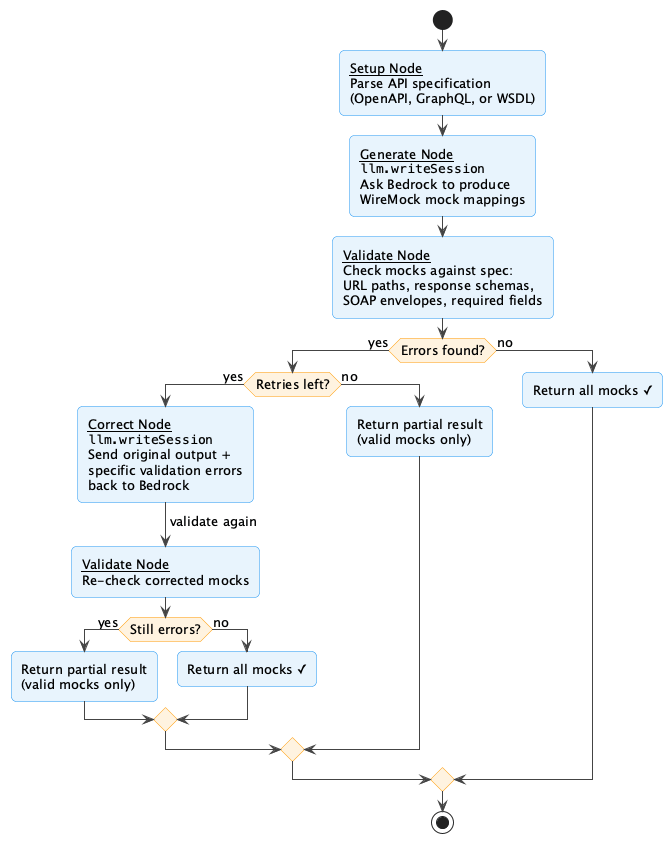

# Lessons Learned: Shipping a Koog + Bedrock AI Agent to Production on AWS Lambda

*Everything the tutorials don't tell you — from a real project that made it to the [AWS 10000 AIdeas Finalist stage](https://builder.aws.com/content/3BzM2TZzM7RnsPFR7bzO7qlORUv/aideas-finalist-mocknest-serverless).*

---

I built [MockNest Serverless](https://github.com/elenavanengelenmaslova/mocknest-serverless) — an open-source AI-powered mock server that generates WireMock mocks from API specifications. It runs on AWS Lambda, uses Koog [1] (JetBrains' Kotlin AI agent framework) for the agent logic, and Amazon Bedrock with Nova Pro as the brain. It was selected as an [AWS AIdeas Finalist](https://builder.aws.com/content/3BzM2TZzM7RnsPFR7bzO7qlORUv/aideas-finalist-mocknest-serverless), which was pretty cool.

Along the way I learned a bunch of things the hard way. This article is those lessons.

---

## Lesson 1: The Tutorial Setup Will Betray You in Production

The Koog Bedrock notebook example [2] uses `simpleBedrockExecutor` with access keys from environment variables. 

That's fine for a local Notebooks demo, but **do not ship this to production.** Although Lambda environment variables are encrypted at rest, users with sufficient permissions can still view them in plain text. And you don't need credentials at all on Lambda — the execution role already provides temporary credentials that the SDK picks up automatically.

Use Koog's API with the Kotlin AWS SDK's `BedrockRuntimeClient` instead — no credentials in sight:

```kotlin
val bedrockClient = BedrockRuntimeClient { region = "eu-west-1" }
val bedrockLLMClient = BedrockLLMClient(bedrockClient, apiMethod = BedrockAPIMethod.Converse)
val executor = MultiLLMPromptExecutor(LLMProvider.Bedrock to bedrockLLMClient)
```

Same Koog executor, same agent, same everything downstream. `BedrockAPIMethod.Converse` uses the Converse API [3] — AWS's recommended unified interface across all Bedrock models. It handles model-specific prompt formatting and returns token usage metadata in the response, which is useful for cost tracking.

This also matters for SnapStart [5]. When you don't set `credentialsProvider`, the SDK defaults to the default credentials provider chain [4], which resolves credentials lazily at each request. With SnapStart, avoid depending on initialization-time connection state. The SDK usually handles its own connections well, but you should still avoid assumptions about restored network state.

Your Lambda role needs Bedrock permissions. Here's a SAM example (same applies for CDK, Terraform, etc.):

```yaml
- PolicyName: BedrockAccess
  PolicyDocument:
    Version: '2012-10-17'
    Statement:
      - Effect: Allow
        Action:
          - bedrock:InvokeModel
          - bedrock:InvokeModelWithResponseStream
        Resource:
          - !Sub "arn:aws:bedrock:${AWS::Region}::foundation-model/*"
          - !Sub "arn:aws:bedrock:${AWS::Region}::inference-profile/*"
```

If you use cross-region inference profiles, you may need to widen the region and add access to foundation-model resources in target regions.

---

## Lesson 2: The Region Puzzle

You write `BedrockModels.AmazonNovaPro` and get an error. Depending on your region and setup, you may use the direct model ID or an inference profile. Inference profiles are especially useful for cross-region routing:

```kotlin
val model = BedrockModels.AmazonNovaPro.withInferenceProfile("eu")
// Produces: eu.amazon.nova-pro-v1:0
```

Deploy to `eu-west-1`? Use `"eu"`. Deploy to `us-east-1`? Use `"us"`. Full mapping is in the AWS docs [6].

**Watch out for model access too.** Some Bedrock models require extra setup before you can use them. Some (like Amazon Nova) may already be available. Others require EULA acceptance or provider-specific setup — check the Bedrock console [7] under Model access. I got an `AccessDeniedException` the first time I tried Anthropic Claude because I hadn't signed their EULA. Not an IAM issue — a licensing step that's easy to miss.

---

## Lesson 3: Building a Multi-Step Pipeline with Koog's Strategy Graph

Most real-world LLM use cases aren't a single call. You want a pipeline: call the LLM, validate the output, and if something's off, send it back with feedback. Koog's strategy DSL is a directed graph of nodes with conditional edges — it manages the LLM session across nodes and keeps the wiring separate from the logic.

In [MockNest](https://builder.aws.com/content/3BzM2TZzM7RnsPFR7bzO7qlORUv/aideas-finalist-mocknest-serverless), the pipeline generates WireMock mocks from API specs:



Here's a simplified version (full code in [`MockGenerationFunctionalAgent.kt`](https://github.com/elenavanengelenmaslova/mocknest-serverless/blob/main/software/application/src/main/kotlin/nl/vintik/mocknest/application/generation/agent/MockGenerationFunctionalAgent.kt)):

```kotlin
val mockGenerationStrategy = strategy<SpecWithDescriptionRequest, GenerationResult>("mock-generation") {

    val setupNode by node<SpecWithDescriptionRequest, MockGenerationContext>("setup") { request ->
        val specification = specificationParser.parse(content, request.format)
        MockGenerationContext(request, specification)
    }

    val generateNode by node<MockGenerationContext, MockGenerationContext>("generate") { ctx ->
        val prompt = promptBuilder.buildSpecWithDescriptionPrompt(
            ctx.specification, ctx.request.description, ctx.request.namespace, ctx.specification.format
        )
        val response = llm.writeSession {
            appendPrompt { user(prompt) }
            requestLLM()
        }
        val mocks = aiModelService.parseModelResponse(textResponse, ctx.request.namespace, ...)
        ctx.copy(mocks = mocks)
    }

    val validateNode by node<MockGenerationContext, MockGenerationContext>("validate") { ctx ->
        val errors = ctx.mocks.flatMap { mockValidator.validate(it, ctx.specification).errors }
        ctx.copy(errors = errors)
    }

    val correctNode by node<MockGenerationContext, MockGenerationContext>("correct") { ctx ->
        val correctionPrompt = promptBuilder.buildCorrectionPrompt(
            invalidMocks = ..., namespace = ctx.request.namespace,
            specification = ctx.specification, format = ctx.specification.format
        )
        val response = llm.writeSession {
            appendPrompt { user(correctionPrompt) }
            requestLLM()
        }
        // Parse corrected mocks, merge with valid ones from first pass
    }

    edge(nodeStart forwardTo setupNode)
    edge(setupNode forwardTo generateNode)
    edge(generateNode forwardTo validateNode onCondition { it.request.options.enableValidation })
    edge(generateNode forwardTo nodeFinish onCondition { !it.request.options.enableValidation })
    edge(validateNode forwardTo nodeFinish onCondition { it.errors.isEmpty() || it.attempt > maxRetries })
    edge(validateNode forwardTo correctNode onCondition { it.errors.isNotEmpty() && it.attempt <= maxRetries })
    edge(correctNode forwardTo validateNode)
}
```

---

## Lesson 4: Watch Out for Bedrock's Output Token Limit

I was generating mocks from a large GraphQL schema, and the output kept coming back as truncated JSON. I kept tweaking the JSON formatting instructions, thinking the model was producing malformed output. The correction loop retried, but the corrected output was *also* truncated.

The problem wasn't the JSON part of the prompt — it was Bedrock's `maxOutputTokens` limit. The schema had so many queries that the mocks exceeded the token ceiling every time. The fix was asking the model to generate *less* by adjusting a completely different part of the prompt.

Output token limits vary by model — check the Bedrock model documentation [8] and service quotas [9]. If your output is consistently truncated, retrying won't help.

---

## Lesson 5: Testing the Graph Without Spending Money

Koog's `agents-test` module lets you create a mock LLM executor, wire it into a real `GraphAIAgent`, and run the actual strategy graph with fake responses:

```kotlin
val mockExecutor = getMockExecutor {
    mockLLMAnswer(validJsonResponse).asDefaultResponse
}

val agent = GraphAIAgent(
    inputType = strategy.inputType, outputType = strategy.outputType,
    promptExecutor = mockExecutor, agentConfig = agentConfig,
    strategy = strategy, toolRegistry = ToolRegistry.EMPTY
)

val result = agent.run(request)
assertTrue(result.success)
```

You can test happy paths, correction loops, parse failure recovery, and prompt content — all without AWS credentials or spending a cent. Tests run in milliseconds.

But there's one thing these tests can't tell you: **are your prompts any good?**

---

## Lesson 6: Testing Your Prompts — Eval-Driven Development

You can't unit test prompts. You need to run them against the real model and measure output quality. MockNest has a dedicated eval suite: generate mocks from real specs, validate them, run the correction loop, and use an LLM-as-a-judge for semantic correctness. Since we use the Converse API, we get token usage back from every Bedrock call, which lets us track costs per scenario.

```
╔═══════════════════════════════════════════════════════════════════════════════════╗
║                 MULTI-PROTOCOL BEDROCK PROMPT EVAL SUMMARY                       ║
╠═══════════════════════════════════════════════════════════════════════════════════╣
║ Protocol │ Runs │ 1st-pass valid │ After retry │ Scenario pass │ Cost   │ Latency ║
╠═══════════════════════════════════════════════════════════════════════════════════╣
║ GraphQL  │ 15   │ 87%            │ 97%         │ 97%           │ $0.004 │ 2.8s    ║
║ SOAP     │ 15   │ 67%            │ 97%         │ 97%           │ $0.009 │ 6.1s    ║
╚═══════════════════════════════════════════════════════════════════════════════════╝
```

SOAP gets URL paths wrong 33% of the time on the first try, but the correction loop catches most of it. And 97% — not 100% — because LLMs are non-deterministic. These tests have to be triggered manually because there's a cost attached.

---

## Lesson 7: Keep Bedrock Out of Your Business Logic

If you want your agent strategy, prompts, and eval tests to be portable across cloud providers, keep Bedrock out of the business logic:

```
software/
├── application/          # Agent strategy, parsers, validators, prompts (no AWS)
│   └── src/main/
│       ├── kotlin/.../generation/agent/MockGenerationFunctionalAgent.kt
│       └── resources/prompts/
├── domain/               # Business models (no AI, no AWS)
└── infra/aws/generation/ # Bedrock adapter, model config (AWS-specific)
    └── ai/BedrockServiceAdapter.kt
```

The boundary is an interface. The application layer depends on it, the infrastructure layer implements it with Bedrock. Swap Bedrock for OpenAI or a local model — the agent strategy doesn't change.

---

## Wrapping Up

Koog and Bedrock work well together once you get past the gotchas. Use IAM roles instead of access keys, don't pass credentials into the client so they resolve lazily, and set up inference profiles for your region. Build your LLM pipeline as a Koog strategy graph with a validate-and-correct loop. Watch out for output token limits. Test the graph with `agents-test` (fast, free, deterministic), and test your prompts with eval tests against real Bedrock. Keep Bedrock out of your business logic so the whole thing stays portable.

Full code is on [GitHub](https://github.com/elenavanengelenmaslova/mocknest-serverless). More about the project in the [AWS AIdeas Finalist write-up](https://builder.aws.com/content/3BzM2TZzM7RnsPFR7bzO7qlORUv/aideas-finalist-mocknest-serverless).

---

## References

1. [Koog Framework](https://github.com/JetBrains/koog)
2. [Koog Bedrock Example](https://docs.koog.ai/examples/BedrockAgent/)
3. [Bedrock Converse API](https://docs.aws.amazon.com/bedrock/latest/APIReference/API_runtime_Converse.html)
4. [Kotlin AWS SDK Credential Providers](https://docs.aws.amazon.com/sdk-for-kotlin/latest/developer-guide/credential-providers.html)
5. [AWS Lambda SnapStart](https://docs.aws.amazon.com/lambda/latest/dg/snapstart.html)
6. [Bedrock Inference Profiles — Supported Regions and Models](https://docs.aws.amazon.com/bedrock/latest/userguide/inference-profiles-support.html)
7. [Bedrock Model Access](https://docs.aws.amazon.com/bedrock/latest/userguide/model-access.html)
8. [Bedrock Supported Models](https://docs.aws.amazon.com/bedrock/latest/userguide/models-supported.html)
9. [Bedrock Service Quotas](https://docs.aws.amazon.com/general/latest/gr/bedrock.html)
10. [Koog agents-test Module](https://api.koog.ai/agents/agents-test/index.html)
