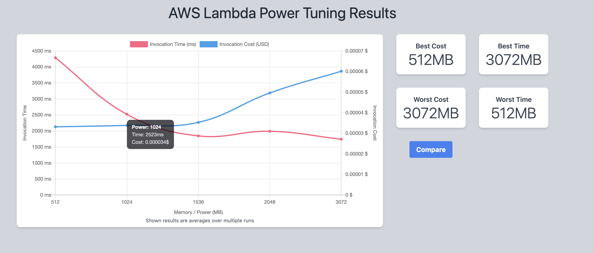

# Performance Guide

## Memory Configuration

Both Runtime and Generation functions default to **1536 MB** based on AWS Lambda Power Tuner analysis.



The Power Tuner analysis shows 1536 MB provides the best balance between execution speed and cost efficiency.

## Tuning Your Deployment

To optimize memory for your workload, use [AWS Lambda Power Tuner](https://serverlessrepo.aws.amazon.com/applications/arn:aws:serverlessrepo:us-east-1:451282441545:applications~aws-lambda-power-tuning):

1. Deploy Power Tuner from AWS Serverless Application Repository
2. Go to Step Functions console and find `powerTuningStateMachine`
3. Start execution with this input (replace placeholders):

**Runtime Function:**
```json
{
  "lambdaARN": "arn:aws:lambda:REGION:ACCOUNT_ID:function:STACK_NAME-runtime",
  "powerValues": [512, 1024, 1536, 2048, 3072],
  "num": 50,
  "strategy": "balanced",
  "payload": {
    "resource": "/__admin/health",
    "path": "/__admin/health",
    "httpMethod": "GET",
    "headers": {
      "x-api-key": "YOUR_API_KEY"
    },
    "requestContext": {
      "requestId": "power-tuner-test",
      "stage": "mocks"
    }
  },
  "parallelInvocation": true,
  "onlyColdStarts": false
}
```

**Generation Function:**
```json
{
  "lambdaARN": "arn:aws:lambda:REGION:ACCOUNT_ID:function:STACK_NAME-generation",
  "powerValues": [512, 1024, 1536, 2048, 3072],
  "num": 50,
  "strategy": "balanced",
  "payload": {
    "resource": "/ai/generation/health",
    "path": "/ai/generation/health",
    "httpMethod": "GET",
    "headers": {
      "x-api-key": "YOUR_API_KEY"
    },
    "requestContext": {
      "requestId": "power-tuner-test",
      "stage": "mocks"
    }
  },
  "parallelInvocation": true,
  "onlyColdStarts": false
}
```

4. Review the visualization URL in the output to see cost vs. performance tradeoffs
5. Update your deployment: `sam deploy --parameter-overrides LambdaMemorySize=1536`

## Measuring Cold Start Times

To measure cold start performance, use CloudWatch Logs Insights:

1. Go to **CloudWatch** → **Logs Insights**
2. Select log group: `/aws/lambda/STACK_NAME-runtime` or `/aws/lambda/STACK_NAME-generation`
3. Run this query:

```
filter @type = "REPORT"
| parse @message /Init Duration: (?<init_duration>\S+) ms/
| filter init_duration > 0
| stats avg(init_duration) as avg_cold_start, 
        min(init_duration) as min_cold_start, 
        max(init_duration) as max_cold_start,
        count() as cold_start_count
```

This shows average, minimum, and maximum cold start times with SnapStart enabled.
