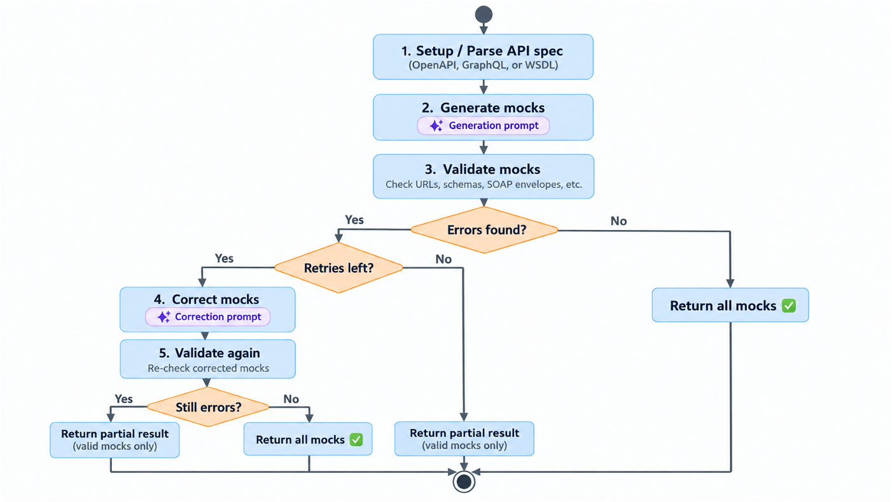
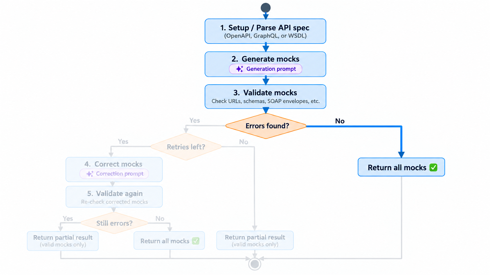
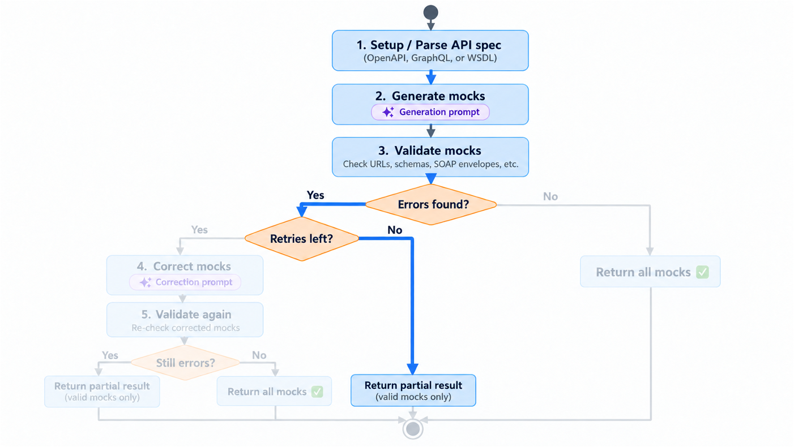
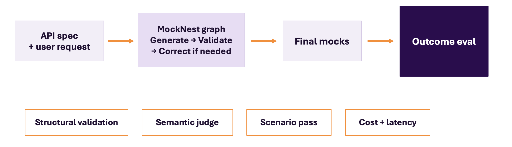
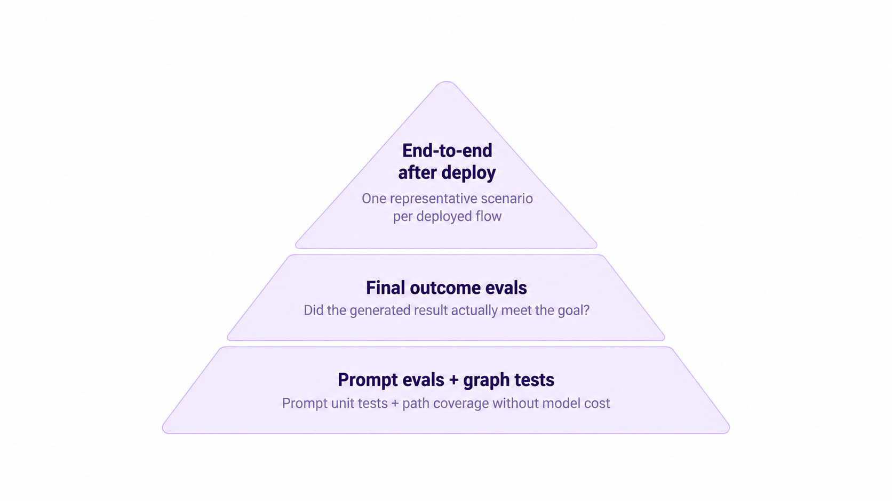

# Testing Production AI Applications on AWS

## How do we test an agentic system?

We know how to test traditional software. In a unit test, we give a component a known input and assert the expected output. With white-box testing, we know the implementation and can exercise its branches and conditions. With black-box testing, we test a feature through its inputs and observable results.

Agentic systems challenge these approaches. We cannot inspect and cover the internal branches of a prompt because it does not have executable branches, and the same input does not always produce the same output. In many cases, there is no single exact value we can assert.

So how do we test an agentic system? And how do we determine whether its output is good enough?

##  Example system under test

Consider a small agent graph that generates API mocks from an API specification and a user scenario.



The graph first parses and compresses the OpenAPI specification, then injects it into the generation prompt together with the user’s scenario. A model generates the mocks via Amazon Bedrock, which are then validated against the API specification. If validation succeeds, the graph returns all generated mocks. If errors are found and retries are available, the graph passes the validation errors and invalid mocks to a correction prompt. A model attempts to correct them, and the result is validated again. If errors remain, or the retry limit has been reached, the graph returns only the valid mocks.

Although this graph is relatively small, it contains prompts, deterministic validation, decisions, retries, and several possible outcomes. How do we test that it follows the correct path without calling the model every time?


## The Koog strategy graph in code

The graph could be implemented using various available libraries for agentic systems, such as Strands Agents SDK available for Python and TypeScript. Our graph is implemented with Koog, JetBrains’ open-source framework for building AI agents on the JVM. I chose Koog because the implementation is written in Kotlin, and its type-safe Kotlin DSL allows me to define the nodes, decisions, and retry paths directly in the existing codebase. It serves a similar purpose to the Strands Agents SDK, but is designed for Kotlin and Java applications.

The simplified strategy graph looks like this:
```kotlin
strategy<SpecWithDescriptionRequest, GenerationResult>("mock-generation") {
    val setupNode by node("setup") {
        prepareSpecification()
    }

    val generateNode by node("generate") {
        generateMocks()
    }

    val validateNode by node("validate") {
        validateMocks()
    }

    val correctNode by node("correct") {
        applyCorrections()
    }

    edge(nodeStart forwardTo setupNode)
    edge(setupNode forwardTo generateNode)
    edge(generateNode forwardTo validateNode)

    edge(validateNode forwardTo nodeFinish)
        .onCondition {
            errors.isEmpty() || attempt > maxRetries
        }

    edge(validateNode forwardTo correctNode)
        .onCondition {
            errors.isNotEmpty() && attempt <= maxRetries
        }

    edge(correctNode forwardTo validateNode)
}
```

## Graph test

Typically, a library or framework you use to define a graph gives you a way to test it.
Koog is no exception, and the nice part is that no model calls are needed. There are two
complementary levels to testing a graph, and it helps to keep them separate in your head:

- **Path testing** is like an *integration test of the graph*. You run the whole thing end
  to end, with only the LLM (and other leaf collaborators) mocked, then assert on the
  outcome. Each test drives inputs that force one traversal: happy path, correction
  succeeds, correction still fails, retry limit reached.
- **Topology testing** is like a *unit test of the graph*. You don't run a full traversal.
  Instead you check the wiring directly: which nodes exist, which nodes are reachable, and
  which edge a node takes for a given output. Koog exposes this through its `testGraph` API.

Path testing tells you *"a full run of this scenario produces the right result."*
Topology testing tells you *"the graph is wired the way I think it is."* You want both, and
the reason is subtle: a path test only observes the **destination**. A wrong turn inside the
graph can still reach the right destination, so a result-only assertion can silently pass
even when an edge is miswired. Topology testing checks the **map**, so it catches that class
of bug — accidental rewiring of the generate → validate → correct loop, or an off-by-one in
a retry condition — directly and points at the exact edge.

One clarification, because "topology testing doesn't run anything" is easy to overstate.
Topology tests never run the **node bodies** (no `setup`/`generate`/`validate`/`correct`
work, no LLM, no parser). But asserting an edge *does* evaluate that edge's **condition**
against an output you hand it. So a retry comparison like `attempt <= maxRetries` really does
run — just in isolation, without the nodes around it. That is exactly what makes it a unit
test of the wiring.

### Happy path (path test)

Given that the generated mocks validate successfully, the graph should skip correction and return all mocks.



### Retry limit (topology test)

If errors remain and there are no retries left, the graph must not loop forever. Once the
retry budget is exhausted, the `validate` node routes to `finish` instead of back to
`correct`, so the loop terminates and it returns the mocks that passed validation.

This is a condition on an *edge*, so it's a perfect fit for a topology test. We assert which
edge `validate` takes for two inputs that sit on either side of the boundary — the last
allowed retry, and one attempt past it — without running any node logic:



```kotlin
// No model calls, no node bodies run. maxRetries = 1.
// We evaluate the "validate" edge conditions for a given output.
testGraph<Request, Result>("mock-generation") {
    val finish   = finishNode()
    val validate = assertNodeByName<Ctx, Ctx>("validate")
    val correct  = assertNodeByName<Ctx, Ctx>("correct")

    assertEdges {
        // errors remain, a retry is still available -> go to correction
        validate withOutput ctx(errors = listOf("..."), attempt = 1) goesTo correct
        // errors remain, retries exhausted -> stop, go to finish (no infinite loop)
        validate withOutput ctx(errors = listOf("..."), attempt = 2) goesTo finish
    }
}
```

## The graph works. But how do we test the output?
Every graph test can be green while the model still produces wrong results. So how do we test the actual output?

## What is an eval?

An evaluation, usually shortened to *eval*, is a repeatable way to measure how well an AI system performs against defined criteria. Each eval scenario provides an input, describes the expected behaviour, and defines how the generated output will be assessed.

Unlike a traditional test, an eval does not always compare the result with one exact expected value. Different outputs can be valid as long as they satisfy the requirements of the scenario. The assessment can combine deterministic checks with an LLM judge.

Evals can target an individual prompt or the complete AI workflow. I started by evaluating the final outcome.

## Outcome eval

An outcome eval runs the complete graph and evaluates what the user actually receives.



Each scenario gives the system an API specification and a user request. The complete graph generates the mocks, validates them, and corrects them when necessary. The eval then assesses the final mocks returned to the user.

Wherever code knows the answer, use code. Schema conformance, endpoint selection, response types, status codes and, in many cases, data consistency across related endpoints can be checked deterministically. There is no reason to ask an LLM to judge them.

A semantic judge is used only for criteria that are difficult to express as deterministic assertions. For example, does the result satisfy the user’s request? Is the generated data realistic?

A scenario passes only when the required deterministic and semantic checks pass. The eval suite also records latency and cost, with generation and judge costs tracked separately.

### Running the eval suite

These evals call a real model through Amazon Bedrock and have associated costs, so I keep them separate from the normal build and run then as "remocal" tests. I only run them when any asciated prompts, model, or graph change.

Each scenario defines concrete expected behaviour and applies both deterministic and semantic checks. It measures much more than whether the generated response can be parsed.

[DemoEval.mov](DemoEval.mov)


### Example eval results

The eval suite reports first-pass quality, quality after correction, scenario pass rate, cost, and latency.


In this run, 88% of the generated REST mocks passed structural validation on the first attempt, and 100% after correction; semantic pass was also 100%. The REST eval run cost $0.0064, with an average latency of 3.4 seconds per scenario.

This distinction betweek structural and semantic pass is important. A structural pass rate of 100% shows that the mocks conform to the API specification after correction. It does not necessarily mean that they satisfy the user’s request. That is what the complete scenario evaluation measures.

Recording both first-pass and after-retry quality is also important. A final structural pass rate of 100% does not show how often the correction prompt had to repair the initial result.


## LLM as a judge – how can we trust it?

A semantic judge makes it possible to evaluate output quality at scale, but it also introduces another probabilistic component. Its decision is not ground truth. Before using its scores, we need to calibrate it against human judgement.

At least initially, manual testing is back! Start with a representative set of model outputs that you have reviewed and labelled. Include clear passes, clear failures, borderline cases, and examples of known failure modes. Give the judge the same outputs and compare its decisions with the human labels.

The evaluation criteria must be specific. Instead of asking:

> Is this a good mock?

Ask questions such as:

- Does the generated data match the scenario requested by the user?
- If the user requested bird data, do the mocks actually describe birds?
- Does the complete set of mocks represent the requested use case?

When the judge and the human label disagree, inspect the reason. First confirm that the human label is correct. If it is, make the judge instructions or scoring criteria more precise. Pay particular attention to false passes, where the judge accepts output that a human considers incorrect.

A simple calibration process looks like this:

1. Create and label a representative set of outputs.
2. Let the judge evaluate the same outputs.
3. Compare the decisions and inspect disagreements.
4. Refine the scoring criteria or judge instructions.
5. Run the calibration set again.

Calibration is not a one-time activity. Rerun it after changing the judge model, judge instructions, or scoring criteria. Changes to the generation prompt may also produce different kinds of output, so they can require another calibration run.

The calibration set of scenarios should evolve as well. When a judge makes a new mistake, add that scenario as another labelled example to the calibration set. It then becomes a regression case for future changes.

I also use a different model for judging than the model used by the agent. This can reduce the risk of both models sharing the same failure patterns, but it does not replace calibration.

Only after calibration do the judge scores become useful engineering feedback rather than an unverified opinion from another model.

## Was the initial generation good, or did correction fix the result?

An outcome eval can show that the final result is correct, but it may hide where the quality came from. A weak generation prompt could produce invalid mocks that the correction step successfully repairs. The scenario passes, but the additional model call increases latency and cost.

The first-pass result helps identify this problem. In the earlier example, 91% of the REST mocks passed structural validation on the first attempt, while 100% passed after correction. The difference shows how much work the correction step is doing.

Focused prompt evals help assess and improve individual AI nodes.

A generation prompt eval provides an API specification and a user request, invokes the generation node, and checks whether the generated mocks:

- Match the requested endpoints
- Use response types and status codes from the specification
- Do not invent parameters or operations
- Contain realistic and consistent data

Evaluating the correction node is more complicated because it runs within the existing model session. Its behaviour depends on the original prompt, the first model response, and the validation errors. Calling only the correction prompt would remove that context and test something different from the production workflow.

A focused correction eval must therefore reproduce the conversation up to that point. It starts with a representative original request and invalid model response, adds the validation feedback, and then invokes the correction node in the same session context. The eval checks whether the corrected result:

- Fixes the reported errors
- Preserves content that was already correct
- Avoids introducing new validation errors
- Still satisfies the original user request

These focused evals make problems easier to diagnose. Generation evals measure the quality of the initial result. Correction evals measure whether the system can repair known errors when given the same context it receives in the real graph.

Outcome evals tell us whether the complete agentic workflow produces what we want. Focused prompt evals help tune AI nodes individually.

## Testing pyramid for agentic systems



These testing approaches form a testing pyramid.

At the bottom are focused tests for individual components and graph behaviour. Structural graph tests verify the graph topology: whether the expected nodes and routes exist. Execution tests use mocked model responses to exercise decisions, retries, and failure paths without real model calls. Prompt evals test the behaviour of individual AI nodes with a real model.

In the middle, outcome evals run the complete AI workflow and determine whether the final result meets the goal.

At the top, end-to-end tests exercise the deployed application. The evals already provide detailed scenario coverage, so this does not need to become another large edge-case suite. Instead, use one representative happy-flow scenario for each important deployed flow, such as REST, GraphQL, SOAP, callbacks, and streaming.

These end-to-end tests catch IAM permissions, API Gateway configuration, Lambda deployment problems, and other integration issues that local tests and evals cannot detect.

The pyramid increases scope from individual components, to AI outcomes, to the deployed product. As the scope and cost increase, the number of tests decreases.

## Takeaways

### 1. Test the graph without model API cost

Use structural tests to verify the topology and mocked execution tests to exercise decisions, retries, and failure paths.

### 2. Evaluate the prompt nodes

Use focused evals to determine whether individual prompts produce the required behaviour with a real model.

### 3. Evaluate the final outcome

Run the complete workflow and assess the result that the user actually receives.

### 4. Calibrate the judge

Compare the judge with human-labelled examples and refine its instructions when they disagree.

### 5. Test the deployed application

Add one representative end-to-end scenario for each important deployed flow.

Production confidence requires all these layers. A graph can be wired correctly while its prompts produce poor results. Its prompts can perform well in isolation while the complete workflow fails. The complete workflow can pass an eval while the deployed application has an IAM or configuration problem.

AI quality is not something we test once. Every new failure should improve the graph tests, eval scenarios, or judge calibration set.
